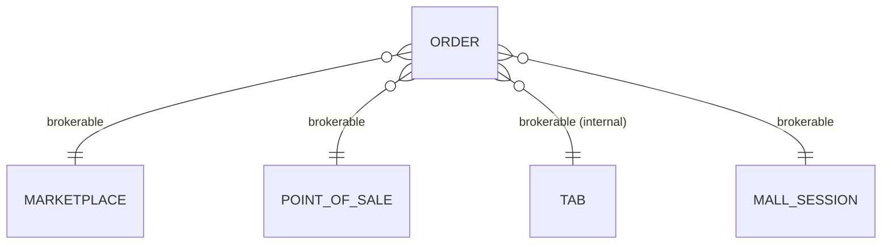

# Order Module

> Order processing and payment management for the DASH platform.

## Overview

The Order module manages order lifecycle, payments, and integrations with various brokers (Marketplaces, Point of Sale systems).

## Models

### Order

Main order model with polymorphic broker relationships.

**Key Fields:**
- `hash_id` - 6-character unique public identifier
- `tenant_id` - Tenant ownership
- `brokerable_type/id` - Polymorphic relation to broker (Marketplace, POS, Tab)
- `status` - Order lifecycle status
- `total_amount`, `subtotal`, `discount_amount` - Pricing
- `currency_id` - Order currency

**Statuses:**
```
CREATED → PAID → SALE_NOTE_GENERATED → IN_PREPARATION → PREPARED → SHIPPED → CLOSED
       ↘ CANCELLED | RETURNED | NOT_SHIPPED
```

**Traits:**
- `HasHashId` - 6-character public ID generation
- `ResourceVisibility` - Tenant-scoped data isolation
- `LogsActivity` - Audit trail logging

### OrderProduct

Line items within an order.

**Key Fields:**
- `order_id` - Parent order
- `product_id` - Product reference
- `quantity`, `unit_price`, `sale_fee`
- `status` - Syncs with parent order status

### Payment

Payment records for orders.

**Key Fields:**
- `order_id` - Associated order
- `amount`, `method`, `status`

## API Endpoints

| Method | Endpoint | Description |
|--------|----------|-------------|
| GET | `/api/orders` | List orders (tenant-scoped) |
| GET | `/api/orders/{hash_id}` | Get single order |
| POST | `/api/orders` | Create order |
| PUT | `/api/orders/{hash_id}` | Update order |
| DELETE | `/api/orders/{hash_id}` | Delete order |

## Polymorphic Brokers

Orders can be brokered by different sources:



## Discount System

```php
// Apply percentage discount
$order->applyDiscount('percentage', 10, 'Customer loyalty');

// Apply fixed discount
$order->applyDiscount('fixed', 5.00, 'Promo code');

// Remove discount
$order->removeDiscount();
```

## Events

- Order status changes notify external marketplace integrations
- Mall session orders broadcast status updates via WebSocket
