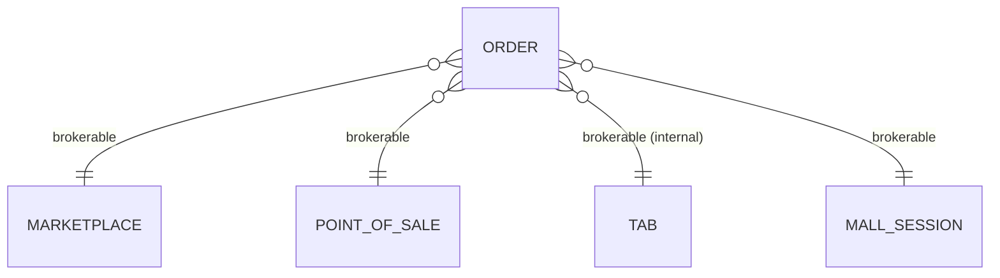

# Order Module

> Order processing and payment management for the DASH platform.

## Overview

The Order module manages order lifecycle, payments, and integrations with various brokers (Marketplaces, Point of Sale systems).

## Models

### Order

Main order model with polymorphic broker relationships.

> **Corrected 2026-08-23** against the schema and code. The previous version
> documented a `hash_id` / `HasHashId` public identifier and `/api/orders`
> endpoints; **neither exists** — there is no `hash_id` column on `orders` and no
> `HasHashId` trait in the codebase. Ids are UUIDv7.

**Key Fields:**
- `id` — UUIDv7 primary key (`HasUuidV7`, DB default `uuidv7()`)
- `tenant_id` (uuid) and `tenancy_id` (uuid, nullable) — unlike `tabs`, orders
  carry both, plus an `order_tenants` pivot
- `brokerable_type` / `brokerable_id` — where the order came from
  (SelfServiceSession = kiosk, Tab = staff, Marketplace, MallSession, PointOfSale)
- `tabable_type` / `tabable_id` — the Tab, plus a mirrored `tab_status`
- `status`, `broker_status`, `tab_status` — three separate status vocabularies
- `total_amount`, `subtotal`, `discount_amount`, `discount_type`, `discount_value`
- `is_paid`, `shipping`, `currency_id`, `pricelist_id`, `parent_order_id`

> ⚠️ **`total_amount` is declared `float`** in its migration (Postgres
> `double precision`) while the model casts it `decimal:2`. Summing binary
> floating point drifts, so any `SUM` over it must cast:
> `SUM(total_amount::numeric)`.

**Statuses** — all twelve constants actually defined on the model:
```
CREATED → PAID → SALE_NOTE_GENERATED → IN_PREPARATION → PREPARED
        → PICKED_UP | SCHEDULE_SHIPPING | SHIPPED → CLOSED
        ↘ CANCELLED | RETURNED | NOT_SHIPPED
```
The previous diagram omitted `PICKED_UP` and `SCHEDULE_SHIPPING` (the constant
is `STATUS_SCHEDULED_SHIPPING`, value `SCHEDULE_SHIPPING` — they differ).

**Traits:**
- `HasUuidV7` — UUIDv7 primary key
- `ResourceVisibility` — tenant-scoped data isolation (opt-in per query; no
  global scope exists)
- `LogsActivity` — audit trail logging

> ⚠️ **Three status fields disagree.** `TabsNotificationService` maps tab CLOSED
> to order CLOSED, while `TabController` sets order SHIPPED for the same
> transition. Treat `tabs.status` as the source of truth for whether a tab
> completed; `orders.status` is not a reliable read of it.

### OrderProduct

Line items within an order.

**Key Fields:**
- `order_id` (uuid), `product_id` (uuid, **nullable** — set null on product delete)
- `product_name` — a snapshot taken at sale time, so a renamed or deleted
  product still reports under the name it was actually sold as
- `quantity`, `unit_price`, `sale_fee`, `note`, `line_id`
- `status`, `tenant_id`, `source_tenant_id` (mall orders only — **nullable and
  usually empty**, so scoping on it drops ordinary lines)
- `itemable_type` / `itemable_id`

> Line totals are **computed, never stored**:
> `OrderProduct::getTotalPriceAttribute()` derives them from
> `unit_price * quantity` plus modifier adjustments, which cannot be pushed into
> SQL. An aggregate summing `unit_price * quantity` therefore reads slightly low
> where paid modifiers exist.

### Payment

Payment records for orders.

**Key Fields:**
- `order_id`, `tenant_id`, `currency_id`
- `source_id` — **this is a `point_of_sales` id**, i.e. the payment method
  (see `Payment::pointOfSale()`). The column name is historical.
- `transaction_amount`, `total_paid_amount`, `installment_amount`, `service_fee`
- `status`, `broker_status`, `payment_type`

> ⚠️ `Payment::STATUS_APPROVED` is **lowercase `'approved'`** while every other
> status constant is uppercase — a filter written by hand will miss it.

## API Endpoints

Orders are served under the `ecommerce.` route group, with CRUD generated from
`config('react-admin-methods')`.

| Method | Endpoint | Description |
|--------|----------|-------------|
| GET | `/api/ecommerce/order` | List orders (tenant-scoped) |
| GET | `/api/ecommerce/order/{id}` | Get single order (UUID) |
| POST | `/api/ecommerce/order` | Create order |
| PUT | `/api/ecommerce/order/{id}` | Update order |

## Polymorphic Brokers

Orders can be brokered by different sources:


```mermaid
erDiagram
    ORDER }o--|| MARKETPLACE : "brokerable"
    ORDER }o--|| POINT_OF_SALE : "brokerable"
    ORDER }o--|| TAB : "brokerable (internal)"
    ORDER }o--|| MALL_SESSION : "brokerable"
```

## Discount System

```php
// Apply percentage discount
$order->applyDiscount('percentage', 10, 'Customer loyalty');

// Apply fixed discount
$order->applyDiscount('fixed', 5.00, 'Promo code');

// Remove discount
$order->removeDiscount();
```

## Events

- Order status changes notify external marketplace integrations
- Mall session orders broadcast status updates via WebSocket
