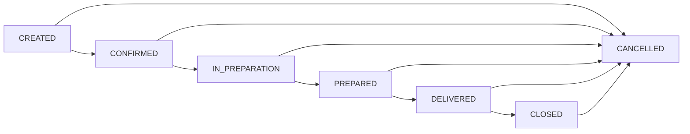
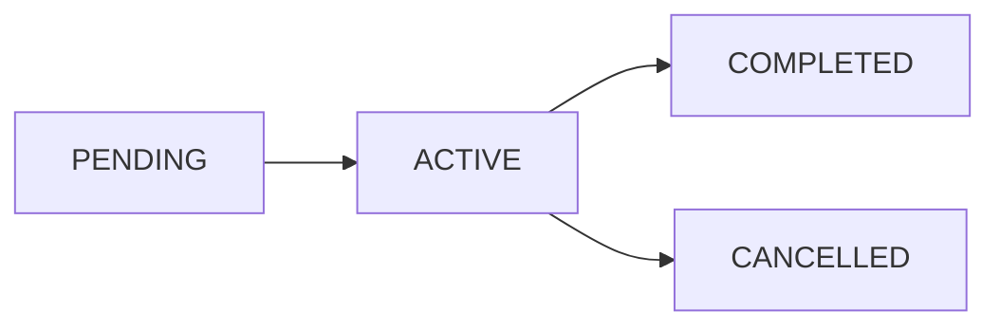
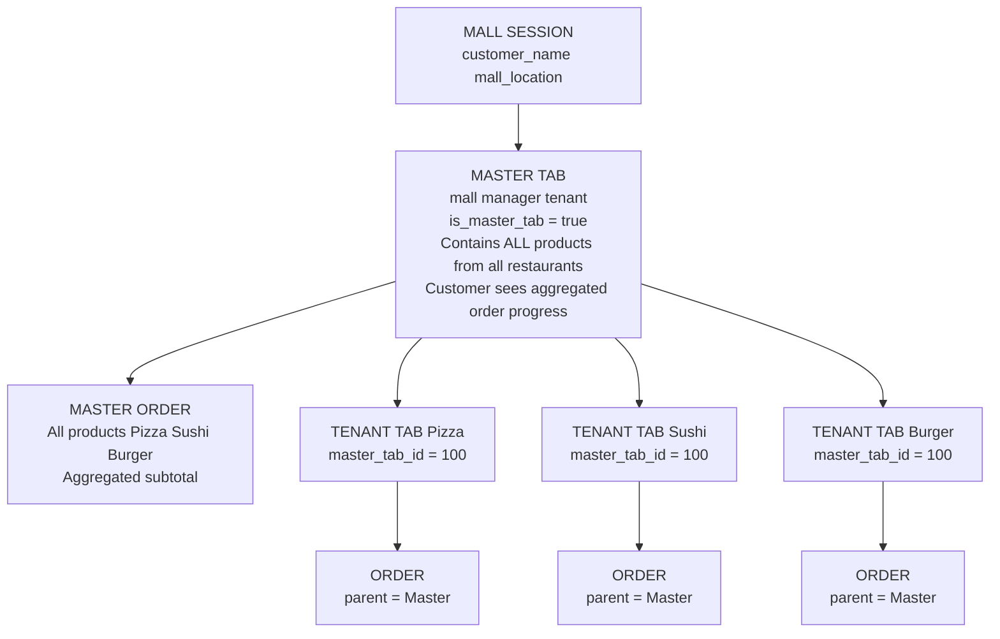
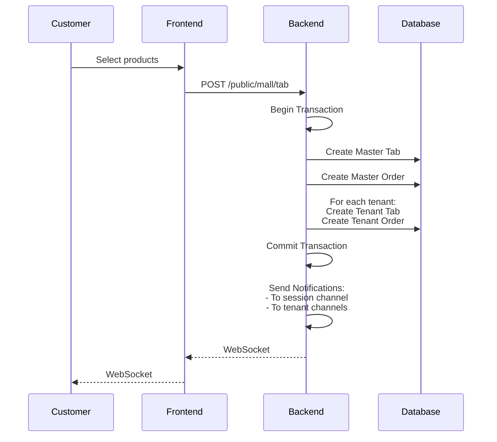
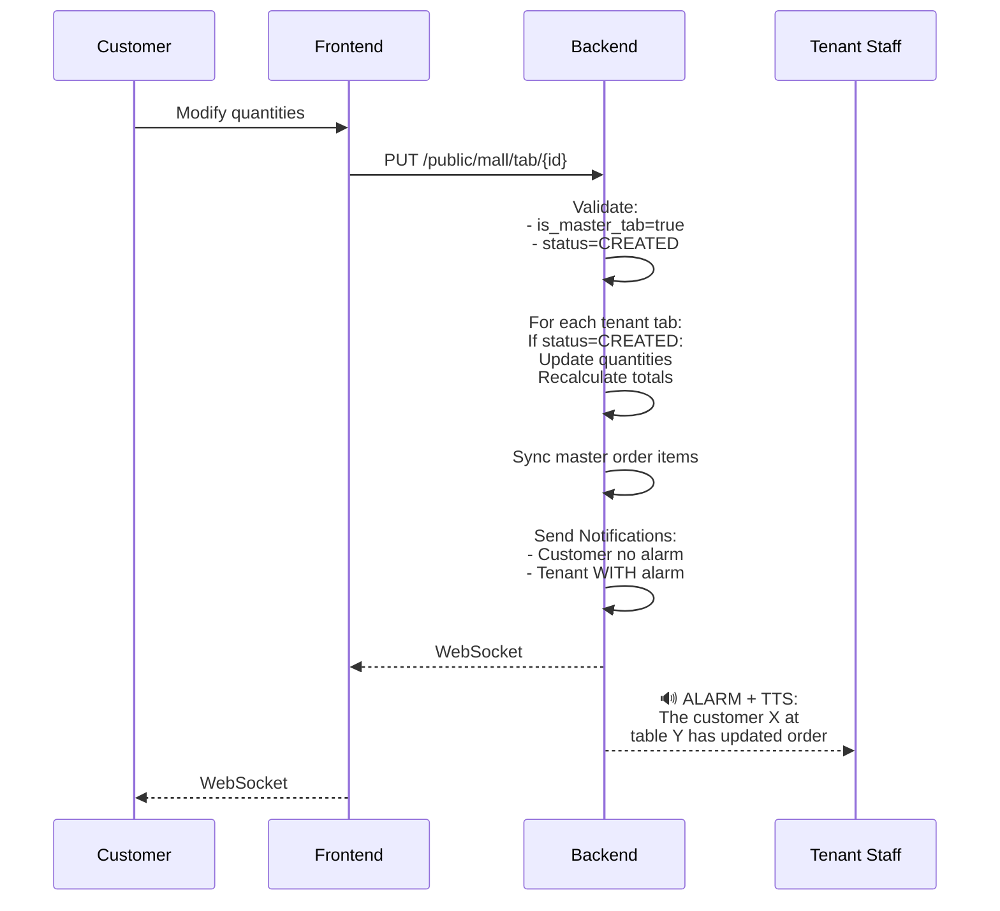
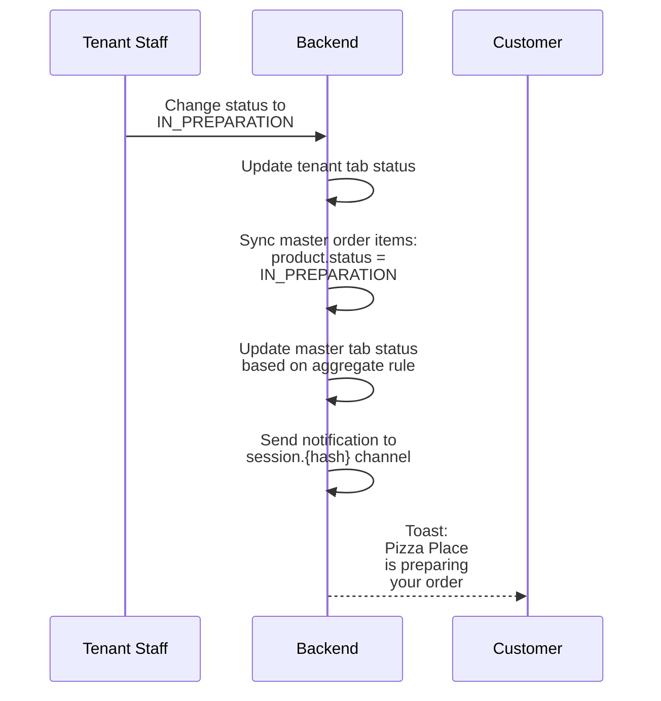

# Tabs & MallTabs Architecture - Technical Documentation

## Overview

This document describes the architecture of the Tab system in the Dash framework, including the specialized MallTabs system for multi-tenant food court ordering.

## Table of Contents

1. [Core Concepts](#core-concepts)
2. [Tab Model Architecture](#tab-model-architecture)
3. [Order Model Architecture](#order-model-architecture)
4. [Mall Session Architecture](#mall-session-architecture)
5. [Master/Slave Tab Relationship](#masterslave-tab-relationship)
6. [Notification System](#notification-system)
7. [API Endpoints](#api-endpoints)
8. [Frontend Integration](#frontend-integration)
9. [WebSocket Channels](#websocket-channels)
10. [Data Flow Diagrams](#data-flow-diagrams)

---

## Core Concepts

### Tab
A **Tab** represents an order session. In a restaurant context, it's like having a tab open at a bar - you can add items and the tab remains open until you pay and close it.

### Order
An **Order** is the actual collection of items (products) associated with a Tab. The Tab manages the lifecycle (created → confirmed → preparing → ready → delivered → closed), while the Order manages the items and payment.

### MallSession
A **MallSession** is a customer session in a mall/food court context. It allows a customer to order from multiple restaurants in a single session by scanning a QR code.

### Master Tab
In mall orders, the **Master Tab** is created under the mall's manager tenant. It aggregates all products from all restaurants into a single view for the customer.

### Tenant Tab (Slave Tab)
**Tenant Tabs** are individual tabs created for each restaurant in a mall order. They contain only the products from that specific restaurant and are managed independently by each restaurant's staff.

---

## Tab Model Architecture

### File Location
`domain/app/Models/Tab/Tab.php`

### Key Properties

| Property | Type | Description |
|----------|------|-------------|
| `id` | integer | Primary key |
| `tenant_id` | integer | FK to tenant (restaurant) |
| `status` | enum | Current tab status |
| `delivery_method` | enum | COUNTER, TABLE, DELIVERY |
| `note` | text | Customer notes |
| `is_master_tab` | boolean | True if this is a mall master tab |
| `master_tab_id` | integer | FK to master tab (for slave tabs) |
| `brokerable_type` | string | Polymorphic type (e.g., MallSession) |
| `brokerable_id` | integer | Polymorphic FK |

### Status Constants

```php
const STATUS_CREATED = 'CREATED';           // Tab created, awaiting confirmation
const STATUS_CONFIRMED = 'CONFIRMED';       // Restaurant confirmed the order
const STATUS_IN_PREPARATION = 'IN_PREPARATION';  // Kitchen is preparing
const STATUS_PREPARED = 'PREPARED';         // Order is ready
const STATUS_DELIVERED = 'DELIVERED';       // Delivered to customer
const STATUS_CLOSED = 'CLOSED';             // Tab closed (paid)
const STATUS_CANCELLED = 'CANCELLED';       // Order cancelled
```

### Status Flow



### Key Relationships

```php
// The tenant (restaurant) this tab belongs to
public function tenant(): BelongsTo

// The order containing items
public function order(): HasOne

// Master tab (for slave tabs)
public function masterTab(): BelongsTo

// Slave tabs (for master tabs)
public function tenantTabs(): HasMany

// Polymorphic brokerable (e.g., MallSession)
public function brokerable(): MorphTo
```

---

## Order Model Architecture

### File Location
`domain/app/Models/Order/Order.php`

### Key Properties

| Property | Type | Description |
|----------|------|-------------|
| `id` | integer | Primary key |
| `tab_id` | integer | FK to tab |
| `subtotal` | decimal | Sum of item prices |
| `discount_type` | enum | PERCENTAGE, FIXED |
| `discount_value` | decimal | Discount value |
| `discount_amount` | decimal | Calculated discount |
| `total_amount` | decimal | Final total |
| `is_paid` | boolean | Payment status |
| `parent_order_id` | integer | FK to parent order (for tenant orders) |
| `brokerable_type` | string | Polymorphic type |
| `brokerable_id` | integer | Polymorphic FK |

### Key Relationships

```php
// Items in this order
public function items(): HasMany

// Parent order (for tenant orders)
public function parentOrder(): BelongsTo

// Child orders (for master orders)
public function childOrders(): HasMany

// The tab this order belongs to
public function tab(): BelongsTo
```

---

## Mall Session Architecture

### File Location
`domain/app/Models/Mall/MallSession.php`

### Purpose
Manages customer sessions in a mall/food court. When a customer scans a QR code at their table, a MallSession is created or activated.

### Key Properties

| Property | Type | Description |
|----------|------|-------------|
| `id` | integer | Primary key |
| `hash` | string(5) | Unique session identifier (e.g., "M5U2W") |
| `mall_id` | integer | FK to mall |
| `customer_name` | string | Customer's name |
| `mall_location` | string | Table number/location |
| `status` | enum | pending, active, completed, cancelled |
| `meta` | JSON | Client metadata (IP, user agent) |
| `assistance_requests` | JSON | Track help requests per store |

### Session Status Flow



### Key Methods

```php
// Generate unique 5-character hash
public static function generateUniqueHash(): string

// Get master tab for this session
public function getMasterTab(): ?Tab

// Get all tenant (slave) tabs
public function getSlaveTabs(): Collection

// Add notification
public function addNotification(array $data): MallSessionNotification
```

---

## Master/Slave Tab Relationship

### Architecture Overview



### Key Points

1. **Master Tab** is created under the mall's `manager_tenant_id`
2. **Tenant Tabs** are linked via `master_tab_id`
3. **Master Order** contains ALL products
4. **Tenant Orders** are linked via `parent_order_id`
5. Status updates on tenant tabs sync to master tab
6. Master status reflects aggregate of all tenant statuses

### Status Synchronization Rules

| All Tenant Statuses | Master Status |
|---------------------|---------------|
| All CANCELLED | CANCELLED |
| All CLOSED | CLOSED |
| All DELIVERED | DELIVERED |
| All PREPARED or DELIVERED | PREPARED |
| Any IN_PREPARATION | IN_PREPARATION |
| Any CONFIRMED | CONFIRMED |
| All CREATED | CREATED |

---

## Notification System

### Notification Classes

| Class | Purpose | Channels |
|-------|---------|----------|
| `MallSessionOrderStatusNotification` | Status updates (CONFIRMED, PREPARING, etc.) | socket, database |
| `MallSessionTabCreationNotification` | New order created | socket, database, push |
| `MallOrderUpdatedNotification` | Customer updated unconfirmed order | socket, database, push |
| `MallStoreAssistanceNotification` | Customer requests help | socket, push |

### Base Class
`domain/app/Notifications/Mall/BaseMallSessionNotification.php`

All mall notifications extend this class which:
- Persists notifications to `mall_session_notifications` table
- Handles WebSocket broadcasting
- Manages notification payload building

### Notification Data Structure

```json
{
    "event": "mall_order_status_update",
    "type": "mall_order_status_update",
    "tenant_tab_id": 123,
    "tenant_id": 45,
    "tenant_name": "Pizza Place",
    "status": "IN_PREPARATION",
    "master_tab_id": 100,
    "timestamp": "2025-01-15T12:30:00.000000Z",
    "customer_info": {
        "name": "John Doe",
        "table": "15"
    },
    "products": [
        {
            "id": 1,
            "product_id": 50,
            "product_name": "Margherita Pizza",
            "quantity": 2,
            "status": "IN_PREPARATION"
        }
    ],
    "mall_session_hash": "M5U2W",
    "alarm": "true",
    "tts": "true",
    "speech": "The customer John Doe at table 15 has updated the order"
}
```

### Alarm and TTS (Text-to-Speech) Flags

| Flag | Value | Description |
|------|-------|-------------|
| `alarm` | `"true"` | Triggers alarm sound on frontend |
| `tts` | `"true"` | Enables text-to-speech |
| `tts_delay` | `5-10` | Seconds to wait before TTS (let alarm finish) |
| `speech` | string | Text to speak |
| `priority` | `"high"` | Notification priority |

### AppNotificationBuilder Usage

```php
AppNotificationBuilder::send(
    notificationClass: MallOrderUpdatedNotification::class,
    data: [
        'event' => 'mall_order_updated',
        'customer_info' => ['name' => $name, 'table' => $table],
        'alarm' => 'true',
        'tts' => 'true',
        'speech' => "The customer {$name} at table {$table} has updated the order",
        'priority' => 'high',
    ],
    channel: "tenant.{$tenantId}.system",
    scope: "channel",
    modelInstance: $mallSession,
    targets: ['kitchen', 'staff', 'admin'],
    targetType: "role",
    individual: ["push"],
    type: 'urgency-alert:speech'
);
```

---

## API Endpoints

### Public Mall Endpoints (No Auth Required)

| Method | Endpoint | Description |
|--------|----------|-------------|
| POST | `/api/public/mall/session/create` | Create new session |
| GET | `/api/public/mall/{hash}/getSessionAuth` | Authenticate session |
| GET | `/api/public/mall/stores` | List mall stores |
| GET | `/api/public/mall/products` | List products |
| POST | `/api/public/mall/tab` | Create order |
| PUT | `/api/public/mall/tab/{id}` | Update order |
| GET | `/api/public/mall/tab` | List customer's orders |
| GET | `/api/public/mall/session/{hash}/notifications` | Get notifications |

### Tenant Admin Endpoints (Auth Required)

| Method | Endpoint | Description |
|--------|----------|-------------|
| GET | `/api/tabs` | List tabs for tenant |
| PUT | `/api/tabs/{id}` | Update tab status |
| POST | `/api/tabs/{id}/confirm` | Confirm order |
| POST | `/api/tabs/{id}/prepare` | Start preparation |
| POST | `/api/tabs/{id}/ready` | Mark as ready |
| POST | `/api/tabs/{id}/deliver` | Mark as delivered |
| POST | `/api/tabs/{id}/close` | Close tab |

---

## Frontend Integration

### Data Provider

**File:** `apps/kitchntabs-mall/src/dash-extensions/config/DASHMallClientDataProvider.tsx`

The data provider:
1. Maps resources to public API paths (`tab` → `public/mall/tab`)
2. Injects `mall_id` and `mall_session` filters automatically
3. Retrieves session ID from localStorage (`mall-session-hash`)

### WebSocket Context

**File:** `packages/kt-mall/src/contexts/MallSessionEchoContext.tsx`

Provides:
- `events`: Array of all received events
- `lastEvent`: Most recent event
- `productStatuses`: Map of product statuses
- `tenantStatuses`: Map of tenant order statuses
- `isConnected`: WebSocket connection status

### Key Components

| Component | Purpose |
|-----------|---------|
| `MallClientWrapper` | Session validation, WebSocket setup |
| `MallClientTabsList` | Display customer's orders with real-time updates |
| `MallOrderProductsFieldV2` | Product selection in create form |
| `MallSessionOrderProgress` | Progress bars per tenant |
| `MallSessionOrderNotifications` | Notification history |

---

## WebSocket Channels

### Channel Types

| Channel | Format | Scope | Purpose |
|---------|--------|-------|---------|
| Session | `session.{hash}` | public | Customer notifications |
| Tenant System | `tenant.{id}.system` | private | Staff notifications |
| Tenant Tabs | `tenant.{id}.tabs` | private | Tab updates |
| User | `user.{id}` | private | Individual user notifications |

### Frontend Subscription

```typescript
// Subscribe to session channel (public)
echo.channel(`session.${sessionHash}`)
    .listen('.mall_order_status_update', (event) => {
        // Handle status update
    })
    .listen('.mall_order_updated', (event) => {
        // Handle order modification
    });
```

### Backend Broadcasting

```php
// Public channel (no auth)
Broadcast::channel('session.{hash}', fn() => true);

// Private channel (requires auth)
Broadcast::channel('tenant.{tenantId}.system', function ($user, $tenantId) {
    return $user->tenant_id === (int) $tenantId;
});
```

---

## Data Flow Diagrams

### Order Creation Flow



### Order Update Flow (When Customer Modifies Unconfirmed Order)



### Status Update Flow (When Restaurant Updates Status)



---

## File Reference

### Backend Files

| Path | Description |
|------|-------------|
| `domain/app/Models/Tab/Tab.php` | Tab model |
| `domain/app/Models/Order/Order.php` | Order model |
| `domain/app/Models/Mall/MallSession.php` | Mall session model |
| `domain/app/Models/Mall/MallSessionNotification.php` | Notification storage model |
| `domain/app/Traits/Mall/MallTabCrudOperationsTrait.php` | Tab create/update logic |
| `domain/app/Traits/Mall/MallTabNotificationsTrait.php` | Notification sending |
| `domain/app/Notifications/Mall/BaseMallSessionNotification.php` | Base notification class |
| `domain/app/Notifications/Mall/MallOrderUpdatedNotification.php` | Order updated notification |
| `domain/app/Services/Mall/MallTabNotificationService.php` | Notification service |
| `domain/routes/api/mall_routes.php` | API routes |

### Frontend Files

| Path | Description |
|------|-------------|
| `apps/kitchntabs-mall/src/components/mall/MallClientWrapper.tsx` | Session wrapper |
| `apps/kitchntabs-mall/src/dash-extensions/config/DASHMallClientDataProvider.tsx` | Data provider |
| `packages/kt-mall/src/contexts/MallSessionEchoContext.tsx` | WebSocket context |
| `packages/kt-mall/src/components/MallClientTabsList.tsx` | Orders list |
| `packages/kt-mall/src/components/MallOrderProductsFieldV2.tsx` | Product field |
| `packages/kt-mall/src/components/MallSessionOrderProgress.tsx` | Progress display |
| `packages/kt-mall/src/components/MallSessionOrderNotifications.tsx` | Notifications display |
| `packages/kt-mall/src/schemas/MallTabSchemaV2.tsx` | Schema definition |

---

## Troubleshooting

### Common Issues

#### 1. Notifications Not Received
- Check WebSocket connection status in browser console
- Verify channel name matches (`session.{hash}` for customers)
- Check Laravel Echo configuration
- Verify Pusher/Soketi credentials

#### 2. Order Update Fails
- Ensure tab status is still `CREATED` (not confirmed)
- Check `is_master_tab` flag is true
- Verify `mall_session` header is present

#### 3. Status Not Syncing
- Check `master_tab_id` relationship is set
- Verify `MallTabNotificationService` is being called
- Check logs for sync errors

### Debug Logging

Enable detailed logging in `.env`:
```
LOG_CHANNEL=stack
LOG_LEVEL=debug
```

Check logs at:
- `storage/logs/laravel.log` - General logs
- Custom notification channel logs

---

## Version History

| Version | Date | Changes |
|---------|------|---------|
| 1.0 | 2025-01-15 | Initial documentation |
| 1.1 | 2025-01-15 | Added MallOrderUpdatedNotification with alarm/TTS |

