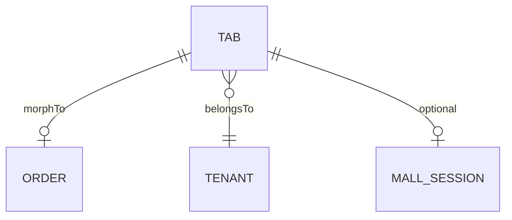

# Tab Module

> Restaurant order/tab management for the DASH platform.

## Overview

The Tab module handles restaurant order tracking, including preparation status, delivery methods, and order lifecycle management.

## Models

### Tab

The main model for restaurant tabs/tickets.

**Key Fields:**
- `hash_id` - 6-character unique public identifier
- `tenant_id` - Tenant ownership
- `order_id` - Polymorphic relation to Order
- `status` - Tab lifecycle status
- `delivery_method` - COUNTER, TABLE, or DELIVERY

**Statuses:**
```
CREATED → CONFIRMED → IN_PREPARATION → PREPARED → DELIVERED → CLOSED
                                                 ↘ CANCELLED
```

**Traits:**
- `HasHashId` - 6-character public ID generation
- `ResourceVisibility` - Tenant-scoped data isolation
- `LogsActivity` - Audit trail logging

## API Endpoints

| Method | Endpoint | Description |
|--------|----------|-------------|
| GET | `/api/tabs` | List tabs (tenant-scoped) |
| GET | `/api/tabs/{hash_id}` | Get single tab |
| POST | `/api/tabs` | Create tab |
| PUT | `/api/tabs/{hash_id}` | Update tab |
| DELETE | `/api/tabs/{hash_id}` | Delete tab |

## Usage Example

```php
use Domain\App\Models\Tab\Tab;

// Create with automatic hash_id
$tab = Tab::create([
    'tenant_id' => $user->tenant_id,
    'status' => Tab::STATUS_CREATED,
    'delivery_method' => Tab::DELIVERY_METHOD_TABLE,
]);

// Find by hash_id
$tab = Tab::findByHashId('abc123');

// Route model binding works with hash_id
Route::get('/tabs/{tab}', fn(Tab $tab) => $tab);
```

## Relationships



## Events

- Tab status changes trigger WebSocket broadcasts to `tenant.{tenantId}` channel
- PDF sale note generation on status change
