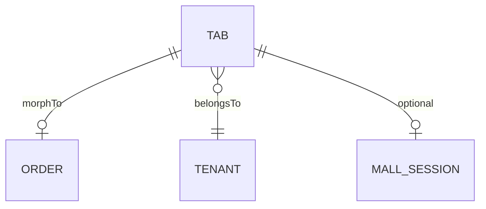

# Tab Module

> Restaurant order/tab management for the DASH platform.

## Overview

The Tab module handles restaurant order tracking, including preparation status, delivery methods, and order lifecycle management.

## Models

### Tab

The main model for restaurant tabs/tickets.

> **Corrected 2026-08-23** against the schema and code. The previous version of
> this file documented a `hash_id` / `HasHashId` public identifier and
> `/api/tabs` endpoints. **None of those exist** — there is no `hash_id` column
> on `tabs`, no `HasHashId` trait anywhere in the codebase, and the routes are
> under `/api/tab/tab`. Ids are UUIDv7.

**Key Fields:**
- `id` — UUIDv7 primary key (`HasUuidV7`, DB default `uuidv7()`)
- `tenant_id` — tenant ownership (uuid). Note there is **no** `tenancy_id` on
  `tabs`; tenancy-wide scoping goes through `tabs.tenant_id → tenants.tenancy_id`
- `order_type` / `order_id` — polymorphic relation to Order
- `status` — tab lifecycle status
- `delivery_method` — COUNTER, TABLE, or DELIVERY
- `table_number`, `note`, `sale_note_path`
- `mall_id`, `is_master_tab`, `master_tab_id`, `customer_id` — food-court fields
- `date_created`, `date_confirmed`, `date_in_preparation`, `date_prepared`,
  `date_delivered`, `date_closed`, `date_canceled` — per-stage timestamps

**Statuses:**
```
CREATED → CONFIRMED → IN_PREPARATION → PREPARED → DELIVERED → CLOSED
                                                 ↘ CANCELLED
```

**Traits:**
- `HasUuidV7` — UUIDv7 primary key
- `ResourceVisibility` — tenant-scoped data isolation (opt-in per query via
  `visibleThroughTenant()`; there is no global scope)
- `LogsActivity` — audit trail logging
- `Filterable`, `DashFileStorage`

### Stage timestamps

The `date_*` columns are what the funnel and cycle-time reports read, and two of
them were wrong until 2026-08-23:

- `date_canceled` was **never written** — the CANCELLED branch wrote
  `date_closed`, so a cancellation was indistinguishable from a completed sale.
  Fixed in both `TabsNotificationService` and `MallTabCrudOperationsTrait`.
  **Not backfilled**: tabs closed before the fix have `date_closed` set and
  `date_canceled` null regardless of how they actually ended.
- A missing `break` let a transition *to* CREATED fall through and also stamp
  `date_confirmed`, inventing a confirmation that never happened.

`date_created` is **not** the creation time. It is only written by
`handleStatusChange()`, and creating a tab is not a status *change*, so it is
normally NULL. Cohort by `created_at`.

## API Endpoints

All under the `tab.` route group (`prefix => 'tab'`, middleware
`access`, `auth:sanctum`, `verified`). Standard CRUD is generated from
`config('react-admin-methods')`.

| Method | Endpoint | Description |
|--------|----------|-------------|
| GET | `/api/tab/tab` | List tabs (tenant-scoped) |
| GET | `/api/tab/tab/{id}` | Get single tab (UUID) |
| POST | `/api/tab/tab` | Create tab |
| PUT | `/api/tab/tab/{id}` | Update tab |
| GET | `/api/tab/tab/statuses` | Available statuses |
| GET | `/api/tab/tab/{id}/status-transitions` | Legal transitions from here |
| POST | `/api/tab/tab/bulk-update-status` | Bulk status change |
| GET | `/api/tab/tab/{order}/download` · `/print` | Sale note PDF |

## Usage Example

```php
use Domain\App\Models\Tab\Tab;

// Create — the UUIDv7 id is generated by the DB default
$tab = Tab::create([
    'tenant_id'       => $user->tenant_id,
    'status'          => Tab::STATUS_CREATED,
    'delivery_method' => Tab::DELIVERY_METHOD_TABLE,
]);

// Tenant scoping is explicit — there is NO global scope, so an aggregate that
// forgets this silently sums every tenant's rows into one number.
Tab::query()->visibleThroughTenant($user)->get();
```

### Transition rules

`TabsNotificationService::isValidStatusTransition()` enforces the graph below —
except for a **TenantAdmin or SystemAdmin, who bypass it entirely**. That bypass
is why states unreachable in the diagram (a tab moving back to CREATED) do occur
in practice.

## Relationships


```mermaid
erDiagram
    TAB ||--o| ORDER : "morphTo"
    TAB }o--|| TENANT : "belongsTo"
    TAB ||--o| MALL_SESSION : "optional"
```

## Events

- Tab status changes trigger WebSocket broadcasts to `tenant.{tenantId}` channel
- PDF sale note generation on status change
