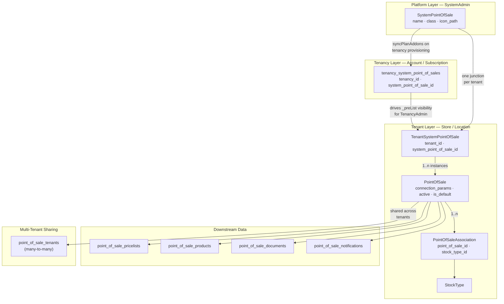
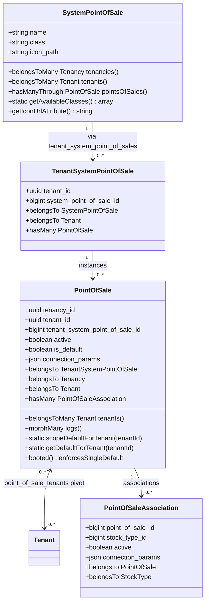
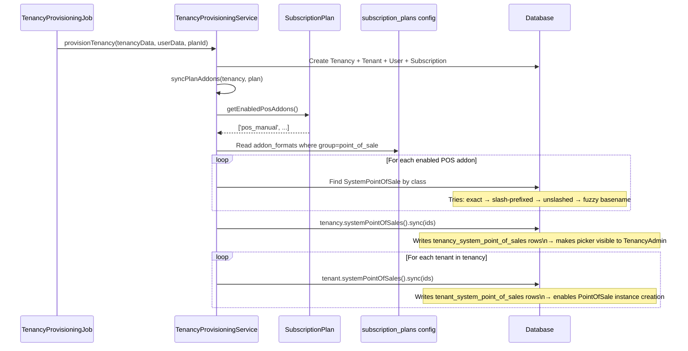
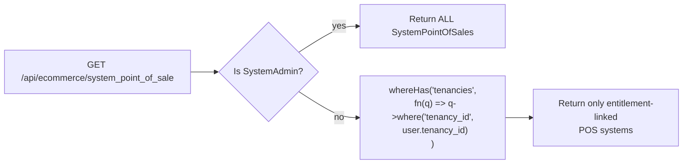
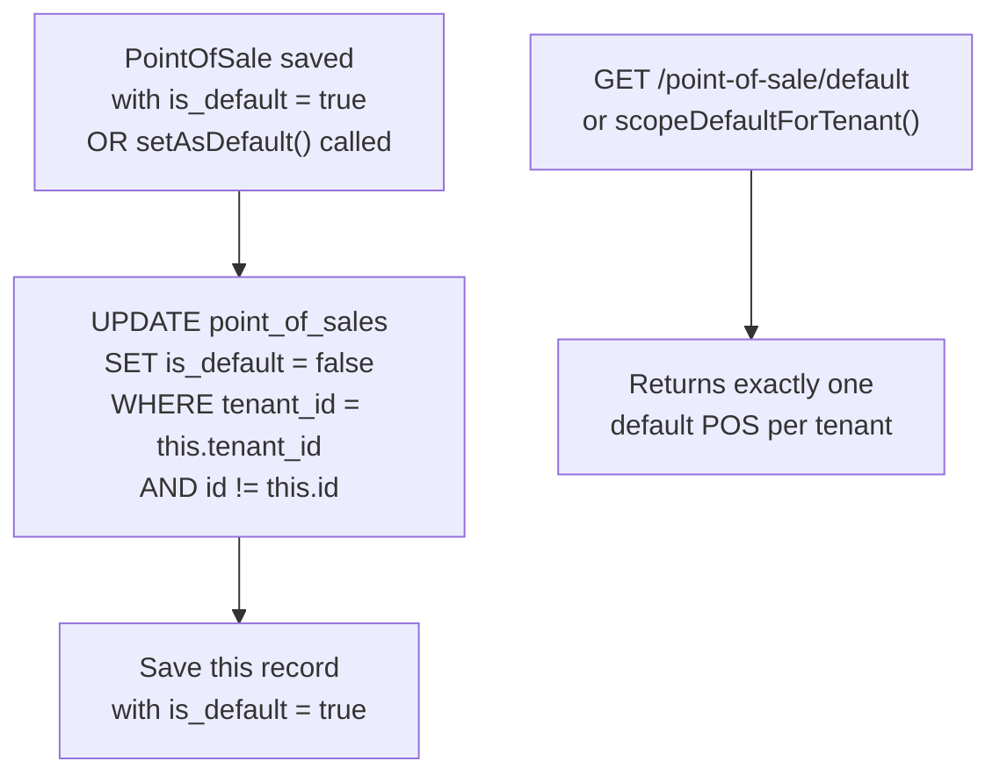
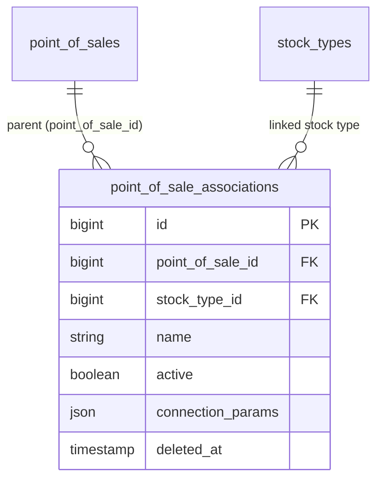
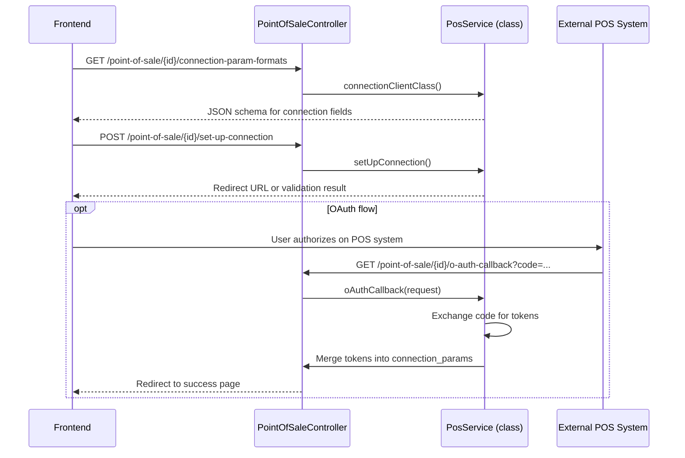

# System Point of Sale — Technical Documentation

> **Version:** 1.0
> **Last Updated:** June 2026
> **Status:** Technical Reference
> **Audience:** Engineers, Backend/Frontend Developers
> **Related Docs:** [FEAT-SYSTEM-MARKETPLACES.md](../marketplaces/FEAT-SYSTEM-MARKETPLACES.md) · [SUBSCRIPTION_PLAN_ADDONS_FEATURE.md](../billing/SUBSCRIPTION_PLAN_ADDONS_FEATURE.md)

---

## Table of Contents

1. [Overview](#overview)
2. [Architecture Layers](#architecture-layers)
3. [Database Schema](#database-schema)
4. [Entity Relationships](#entity-relationships)
5. [Provisioning Flow](#provisioning-flow)
6. [Visibility & Access Control](#visibility--access-control)
7. [POS Instance Lifecycle](#pos-instance-lifecycle)
8. [Default POS Enforcement](#default-pos-enforcement)
9. [POS Associations](#pos-associations)
10. [Connection Flow](#connection-flow)
11. [API Reference](#api-reference)
12. [Service Contract](#service-contract)

---

## Overview

The System Point of Sale (POS) feature follows the same multi-tenant integration architecture as [System Marketplaces](../marketplaces/FEAT-SYSTEM-MARKETPLACES.md), providing a structured way to connect tenants with POS systems for order management, inventory sync, and pricelist distribution.

Key distinctions from Marketplaces:

- Each tenant has exactly **one default POS** — enforced at the model level in `booted()`
- POS instances can have **Associations** that link them to `StockType` records for granular inventory management
- POS drives downstream data: pricelists, products, stock types, documents, and notifications
- Currently one implementation: **ManualPosServiceProvider** (manual order entry, no external API)

### Key Concepts

| Concept | Description |
|---------|-------------|
| **SystemPointOfSale** | Platform-defined POS integration (class, icon, name). Managed by SystemAdmin only. |
| **tenancy_system_point_of_sales** | Entitlement pivot: which POS systems this account's subscription allows. Drives picker visibility for TenancyAdmin. |
| **TenantSystemPointOfSale** | Junction: one record per (tenant × system_pos) pair. Enables the tenant to create instances. |
| **PointOfSale** | Tenant-specific POS instance with connection params, `active`, and `is_default` flags. |
| **PointOfSaleAssociation** | Single-table-inheritance extension of `PointOfSale` linking a POS to a `StockType`. |

---

## Architecture Layers



---

## Database Schema

```mermaid
erDiagram
    system_point_of_sales {
        bigint id PK
        string name
        string class
        string icon_path
        timestamp deleted_at
        timestamps
    }

    tenancy_system_point_of_sales {
        bigint id PK
        uuid tenancy_id FK
        bigint system_point_of_sale_id FK
        timestamps
    }

    tenant_system_point_of_sales {
        bigint id PK
        uuid tenant_id FK
        bigint system_point_of_sale_id FK
        timestamps
    }

    point_of_sales {
        bigint id PK
        uuid tenancy_id FK
        uuid tenant_id FK
        bigint tenant_system_point_of_sale_id FK
        string name
        boolean active
        boolean notified
        boolean is_default
        json connection_params
        timestamp deleted_at
        timestamps
    }

    point_of_sale_tenants {
        bigint point_of_sale_id PK_FK
        uuid tenant_id PK_FK
    }

    point_of_sale_associations {
        bigint id PK
        bigint point_of_sale_id FK
        bigint stock_type_id FK
        string name
        boolean active
        json connection_params
        timestamp deleted_at
        timestamps
    }

    point_of_sale_pricelists {
        bigint id PK
        bigint point_of_sale_id FK
        string name
        timestamps
    }

    point_of_sale_pricelist_details {
        bigint id PK
        bigint point_of_sale_pricelist_id FK
        json data
        timestamps
    }

    point_of_sale_products {
        bigint id PK
        bigint point_of_sale_id FK
        json data
        timestamps
    }

    point_of_sale_notifications {
        bigint id PK
        bigint point_of_sale_id FK
        string status
        json data
        json errors
        timestamps
    }

    point_of_sale_documents {
        bigint id PK
        bigint point_of_sale_id FK
        string type
        json data
        timestamps
    }

    stock_types {
        bigint id PK
        string name
        timestamps
    }

    system_point_of_sales ||--o{ tenancy_system_point_of_sales : "entitlement"
    system_point_of_sales ||--o{ tenant_system_point_of_sales : "junction"
    tenant_system_point_of_sales ||--o{ point_of_sales : "instance"
    point_of_sales ||--o{ point_of_sale_tenants : "shared with"
    point_of_sales ||--o{ point_of_sale_associations : "associations"
    point_of_sales ||--o{ point_of_sale_pricelists : "pricelists"
    point_of_sale_pricelists ||--o{ point_of_sale_pricelist_details : "details"
    point_of_sales ||--o{ point_of_sale_products : "products"
    point_of_sales ||--o{ point_of_sale_notifications : "notifications"
    point_of_sales ||--o{ point_of_sale_documents : "documents"
    point_of_sale_associations }o--|| stock_types : "linked to"
```

### Table Roles at a Glance

| Table | Purpose | Who writes it |
|-------|---------|--------------|
| `system_point_of_sales` | Platform-defined POS integrations | SystemAdmin via CRUD |
| `tenancy_system_point_of_sales` | Subscription entitlement — what the _account_ can access | `syncPlanAddons` on provisioning / plan change |
| `tenant_system_point_of_sales` | Store-level junction — what a _tenant_ can configure | `syncPlanAddons` on provisioning / plan change |
| `point_of_sales` | Actual POS instance with credentials and default flag | TenancyAdmin / Tenant via CRUD |
| `point_of_sale_tenants` | Shares one instance across multiple tenants | PointOfSaleController on create/update |
| `point_of_sale_associations` | Links POS to stock type for inventory sync | PointOfSaleAssociationController |
| `point_of_sale_pricelists` | Pricelist definitions exported to POS | POS service layer |
| `point_of_sale_products` | Product snapshots exported to POS | POS service layer |
| `point_of_sale_notifications` | Inbound POS notifications / webhooks | Notification handler |
| `point_of_sale_documents` | Orders / documents received from POS | Order processing layer |

---

## Entity Relationships



---

## Provisioning Flow

When a new tenancy registers and verifies their email, `TenancyProvisioningService::syncPlanAddons` runs and links all plan-enabled POS systems at both the **tenancy** and **tenant** level. The flow is identical to Marketplaces.



> **Critical distinction**: `tenancy_system_point_of_sales` controls what the TenancyAdmin _sees in the picker_. `tenant_system_point_of_sales` controls what PointOfSale instances _can be created_. If only one is populated, the feature is broken for non-SystemAdmin users.

---

## Visibility & Access Control

### _preList Scoping (`SystemPointOfSaleController`)



### Who Sees What

| Role | `system_point_of_sale` list | `point_of_sale` list |
|------|----------------------------|---------------------|
| SystemAdmin | All system POS | All POS instances |
| TenancyAdmin | Only those in `tenancy_system_point_of_sales` | All POS in their tenancy |
| Tenant user | Same as TenancyAdmin | Only instances where tenant is in `point_of_sale_tenants` |

### Authorization Policy (`PointOfSalePolicy`)

Update and delete on POS instances require:

```
user.tenant_id === pointOfSale.tenantSystemPointOfSale.tenant_id
```

Checked via `$this->authorize('manage', $pointOfSale)` in `PointOfSaleController::_update` and `_delete`.

---

## POS Instance Lifecycle

```mermaid
stateDiagram-v2
    [*] --> Entitlement : SystemAdmin creates SystemPointOfSale\nsyncPlanAddons links it to tenancy + tenant

    Entitlement --> Configured : TenancyAdmin POSTs to\n/api/ecommerce/point_of_sale

    Configured --> Connecting : Frontend calls\nsetUpConnection()

    Connecting --> Connected : oAuthCallback() or\nmanual token accepted

    Connected --> Active : active = true

    Active --> Default : setAsDefault()\nAutomatically unsets other\ndefaults for this tenant

    Active --> Associated : PointOfSaleAssociation created\nLinked to StockType

    Associated --> AssocActive : association.active = true\nInventory sync enabled

    Active --> Paused : active = false

    Paused --> Active : active = true

    Active --> Deleted : _delete cascades\nAll PointOfSale instances removed
```

### AUTO_CREATE Feature Flag

`SystemPointOfSaleController` has a dormant feature flag:

```php
const AUTO_CREATE_POINT_OF_SALE_FOR_TENANTS = false;
```

When enabled, creating or updating a `SystemPointOfSale` (associating it with tenants) would automatically create `PointOfSale` instances for each tenant. Currently disabled — instances must be created manually by TenancyAdmin.

---

## Default POS Enforcement

The `PointOfSale` model uses a `booted()` hook to enforce the single-default-per-tenant invariant automatically. No controller code is needed to maintain this constraint.



### Scopes & Helper Methods

| Method | Description |
|--------|-------------|
| `scopeDefaultForTenant($query, $tenantId)` | Filters to `is_default=true` records for the given tenant |
| `scopeForTenant($query, $tenantId)` | Filters all POS records for the given tenant |
| `static getDefaultForTenant($tenantId)` | Returns the single default `PointOfSale` for a tenant |
| `PointOfSaleController::getDefault()` | API endpoint wrapping `getDefaultForTenant` for the authenticated user's tenant |
| `PointOfSaleController::setAsDefault()` | API endpoint that sets `is_default=true` and triggers the unset hook |

---

## POS Associations

`PointOfSaleAssociation` uses single-table inheritance (STI) extending `PointOfSale`. It links a parent POS instance to a `StockType`, enabling per-location inventory management where one POS manages multiple stock sources with independent credentials.



Associations have their own `connection_params` and OAuth flow, allowing each stock type link to have independent credentials if needed. Associations support the same `getConnectionParamFormats`, `setUpConnection`, and `oAuthCallback` endpoints as their parent POS.

---

## Connection Flow



The same flow applies to `PointOfSaleAssociation` via its own endpoints at `/point-of-sale-association/{id}/...`.

---

## API Reference

### SystemPointOfSale Endpoints

| Method | Path | Description | Access |
|--------|------|-------------|--------|
| GET | `/api/ecommerce/system_point_of_sale` | List system POS | TenancyAdmin+ |
| GET | `/api/ecommerce/system_point_of_sale/{id}` | Get single system POS | TenancyAdmin+ |
| POST | `/api/ecommerce/system_point_of_sale` | Create system POS | SystemAdmin |
| PUT | `/api/ecommerce/system_point_of_sale/{id}` | Update system POS | SystemAdmin |
| DELETE | `/api/ecommerce/system_point_of_sale/{id}` | Delete + cascade to all instances | SystemAdmin |
| GET | `/api/ecommerce/system_point_of_sale/available-classes` | List available service classes | SystemAdmin |

### PointOfSale Instance Endpoints

| Method | Path | Description | Access |
|--------|------|-------------|--------|
| GET | `/api/ecommerce/point_of_sale` | List tenant POS instances | Tenant+ |
| GET | `/api/ecommerce/point_of_sale/{id}` | Get single instance | Tenant+ |
| POST | `/api/ecommerce/point_of_sale` | Create instance | TenancyAdmin |
| PUT | `/api/ecommerce/point_of_sale/{id}` | Update instance | Tenant (owner) |
| DELETE | `/api/ecommerce/point_of_sale/{id}` | Delete instance | Tenant (owner) |
| GET | `/api/ecommerce/point_of_sale/default` | Get tenant's default POS | Tenant |
| POST | `/api/ecommerce/point_of_sale/{id}/set-as-default` | Set as default for tenant | Tenant (owner) |
| GET | `/api/ecommerce/point_of_sale/{id}/connection-param-formats` | Get connection param schema | Tenant (owner) |
| POST | `/api/ecommerce/point_of_sale/{id}/set-up-connection` | Initiate connection / OAuth | Tenant (owner) |
| GET | `/api/ecommerce/point_of_sale/{id}/o-auth-callback` | OAuth callback | Public |

### PointOfSaleAssociation Endpoints

| Method | Path | Description | Access |
|--------|------|-------------|--------|
| GET | `/api/ecommerce/point_of_sale_association` | List associations | Tenant+ |
| GET | `/api/ecommerce/point_of_sale_association/{id}` | Get single association | Tenant+ |
| POST | `/api/ecommerce/point_of_sale_association` | Create association | TenancyAdmin |
| PUT | `/api/ecommerce/point_of_sale_association/{id}` | Update association | Tenant (owner) |
| DELETE | `/api/ecommerce/point_of_sale_association/{id}` | Force delete association | Tenant (owner) |
| GET | `/api/ecommerce/point_of_sale_association/{id}/connection-param-formats` | Get param schema | Tenant (owner) |
| POST | `/api/ecommerce/point_of_sale_association/{id}/set-up-connection` | Initiate connection | Tenant (owner) |
| GET | `/api/ecommerce/point_of_sale_association/{id}/o-auth-callback` | OAuth callback | Public |

---

## Service Contract

Each POS integration must implement `App\Services\ECommerce\Contracts\PointOfSale`:

| Method | Description |
|--------|-------------|
| `connectionClientClass()` | Returns the connection client class name |
| `getPointOfSale()` | Fetches POS account info from the external system |

### Available Implementations

| Class | Description | Auth Method |
|-------|-------------|-------------|
| `ManualPosServiceProvider` | Manual order entry; no external API integration | None |

> **Extension note**: Additional POS providers (Transbank, MercadoPago, etc.) would be added by implementing this contract and registering the class in `SystemPointOfSale::getAvailableClasses()`.
