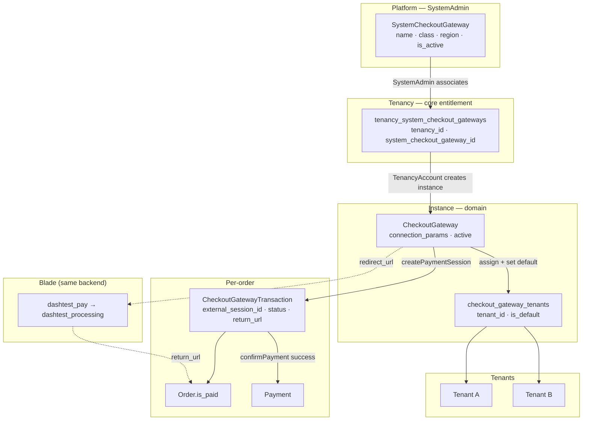
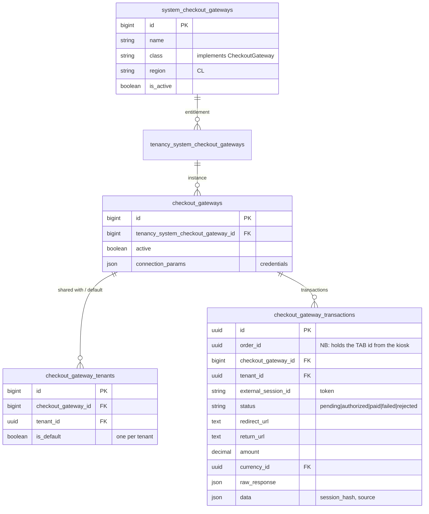
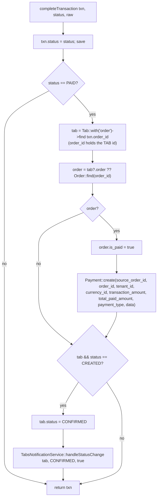
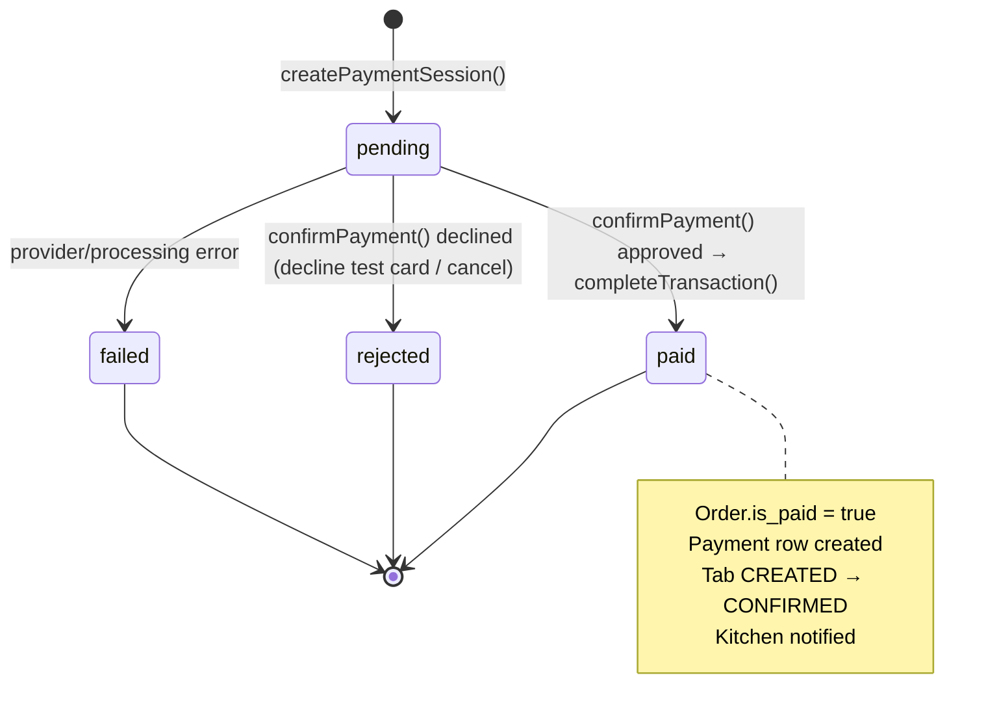

# KitchnTabs Checkout Gateways — Full Technical Documentation

> **Scope:** the Checkout Gateway Providers (CGP) feature — the three-tier provider model, the
> generic gateway contract, the **DashTest** demo provider (a self-hosted Webpay-style bank
> simulation), the self-service payment flow, settlement, and the return/outcome handling.
>
> **Audience:** backend & frontend engineers.
> **Status:** backend three-tier + DashTest provider + self-service integration **implemented**;
> Transbank Webpay and Mercado Pago **not yet implemented**.
> **Last updated:** 2026-06-22.
>
> **Companion docs:** [SELFSERVICE_FEATURE.md](./SELFSERVICE_FEATURE.md) ·
> the original design spec `kitchntabs-github-io/docs/tech/features/checkout-gateways/FEAT-SYSTEM-CHECKOUT-GATEWAYS.md`.

---

## Table of Contents

1. [Overview](#1-overview)
2. [Three-Tier Architecture](#2-three-tier-architecture)
3. [Database Schema](#3-database-schema)
4. [Backend — Files & Responsibilities](#4-backend--files--responsibilities)
5. [Frontend — Files & Responsibilities](#5-frontend--files--responsibilities)
6. [The Generic Gateway Contract](#6-the-generic-gateway-contract)
7. [Provisioning Flow](#7-provisioning-flow)
8. [Payment Flow (DashTest, end-to-end)](#8-payment-flow-dashtest-end-to-end)
9. [The Settlement Tail (`completeTransaction`)](#9-the-settlement-tail-completetransaction)
10. [Return Handling & Outcome Dialog](#10-return-handling--outcome-dialog)
11. [Payable-State Rules](#11-payable-state-rules)
12. [Transaction State Machine](#12-transaction-state-machine)
13. [API Reference](#13-api-reference)
14. [DashTest Bank Simulation Details](#14-dashtest-bank-simulation-details)
15. [Gotchas Learned & Known Gaps](#15-gotchas-learned--known-gaps)

---

## 1. Overview

Checkout Gateways let a tenant's **end customer** pay for a self-service order online. The feature
follows the platform's three-tier "catalog → entitlement → instance" pattern (mirroring System
Marketplaces / Point of Sales) with one structural addition: an instance is owned by the
**Tenancy** and **shared with one or more Tenants**, each picking a per-tenant **default**.

The backend lives in the **domain layer** (`kitchntabs-backend-domain`) under `/api/checkout/*`
(admin) and `/api/public/selfservice/{hash}/checkout/*` (guest). Server-rendered **Blade** pages
host the provider's redirect/return surface.

**v1 provider: DashTest** — a fully self-hosted demo gateway that mimics a Transbank Webpay
redirect → card-entry → return-URL flow with **no external API or credentials**. KitchnTabs serves
its own fake "bank" page, so the whole flow is exercisable in any environment.

---

## 2. Three-Tier Architecture



| Tier | Owner | Table(s) |
|---|---|---|
| Catalog | SystemAdmin | `system_checkout_gateways` (domain) |
| Entitlement | core `dash-backend` | `tenancy_system_checkout_gateways` |
| Instance + sharing | TenancyAccount / Tenant | `checkout_gateways`, `checkout_gateway_tenants` |
| Per-order | — | `checkout_gateway_transactions` |

---

## 3. Database Schema



> **Load-bearing gotcha:** `checkout_gateway_transactions.order_id` stores the **Tab id**, because
> the kiosk lists Tabs and sends `record.id` (a Tab) as `order_id`. Backend code that needs the
> Order resolves `Tab::with('order')->find($transaction->order_id)->order`. See §9.

---

## 4. Backend — Files & Responsibilities

All paths under `kitchntabs-backend-domain/` unless noted.

### Models — `app/Models/Checkout/`
| File | Responsibility |
|---|---|
| `SystemCheckoutGateway.php` | Catalog row; `class` references a provider implementing the contract; `getCapabilities()` via the service class. |
| `CheckoutGateway.php` | Instance; `connection_params`, `active`, `service()` factory → provider, `tenants()` (pivot). |
| `CheckoutGatewayTenant.php` | Sharing pivot with `is_default`; `getDefaultForTenant($tenantId)`; single-default-per-tenant hook. |
| `CheckoutGatewayTransaction.php` | Per-order transaction; status constants `STATUS_PENDING/AUTHORIZED/PAID/FAILED/REJECTED`. |

### Services — `app/Services/ECommerce/Checkout/`
| File | Responsibility |
|---|---|
| `Contracts/CheckoutGateway.php` | The generic interface (see §6). |
| `AbstractCheckoutGatewayProvider.php` | Shared base: `param()`, `isSandbox()`, `newTransaction()`, and the single **`completeTransaction()`** settlement tail (§9). |
| `DashTest/DashTestCheckoutProvider.php` | The demo provider: `createPaymentSession`, `getRedirectUrl`, `handleCallback`, `confirmPayment`, `decisionForCard`, `testCards`, `TEST_CARD_APPROVE/DECLINE`, `getCapabilities` (`supports_webhooks=false`, `requires_redirect=true`, `region=CL`, `is_demo=true`). |

### Controllers, routes, views
| File | Responsibility |
|---|---|
| `app/Http/Controllers/API/SelfService/SelfServiceCheckoutController.php` | `createSession` (payable-state guard + resolve default gateway + create session) and `transactionStatus` (outcome lookup). |
| `app/Http/Controllers/Web/Checkout/CheckoutWebController.php` | `dashtestPay` (card form), `dashtestProcess` (decision → settle → processing page), `result`, `returnForSession`. |
| `app/Http/Controllers/API/Checkout/*` | Admin CRUD (system catalog, instances, assign-tenants, set-default). |
| `routes/web/checkout.php` | `dashtest/{token}/pay` (GET), `dashtest/{token}/process` (GET\|POST), `result`, `return/{hash}`. |
| `routes/api/selfservice.php` | `{hash}/checkout/session` (POST), `{hash}/checkout/transaction/{id}` (GET). |
| `resources/views/layouts/checkout.blade.php` | Branded base layout (`@yield('content')`, `@yield('styles')`). |
| `resources/views/checkout/dashtest_pay.blade.php` | Card-entry "bank" page (PAN/expiry/CVV, tap-to-fill test cards). |
| `resources/views/checkout/dashtest_processing.blade.php` | Spinner → approved/declined result → JS redirect back to the kiosk. |
| `resources/views/checkout/result.blade.php` | Generic settled-state page. |
| `dash-backend/app/Http/Middleware/VerifyCsrfToken.php` (core) | Excepts `/checkout/dashtest/*/process` (public, token-scoped, cross-domain redirect). |

---

## 5. Frontend — Files & Responsibilities

All paths under `kitchntabs-frontend/apps/kitchntabs-app/src/`.

| File | Responsibility |
|---|---|
| `kt-kiosk/components/SelfServiceOrderActions.tsx` | Order-card **Pay** button + `payOnline()`; `canPay` gate; builds `return_url`; same-tab redirect. |
| `kt-kiosk/components/MallClientTabsList.tsx` | List-view **Pagar** quick action (`handlePayOnline`). |
| `kt-selfservice/contexts/SelfServiceAppHookComponent.tsx` | **Global** return handler: reads `?transaction={id}`, calls `transactionStatus`, invalidates cache, shows success toast / failure dialog (`useDialog`). |
| Admin resources (`kitchntabs-system` / `apps/kitchntabs-web`) | `SystemCheckoutGateway` catalog CRUD and `CheckoutGateway` instance management (create / configure credentials / assign tenants / set default). |

---

## 6. The Generic Gateway Contract

Every provider implements `Domain\App\Services\ECommerce\Checkout\Contracts\CheckoutGateway` and
extends `AbstractCheckoutGatewayProvider`:

```php
interface CheckoutGateway
{
    public function __construct(CheckoutGatewayModel $checkoutGateway);
    public static function getConnectionParamFormats(): array;
    public static function getCapabilities(): array;      // supports_webhooks, requires_redirect, ...
    public function verifyCredentials(): bool;
    public function createPaymentSession(array $orderData): array; // -> token, external_session_id, redirect_url
    public function getRedirectUrl(string $token): string;
    public function handleCallback(Request $request): array;       // -> transaction_id (+ decision)
    public function confirmPayment(string $transactionId): array;  // the single settlement entry point
    public function handleWebhook(string $type, array $data): bool;
    public function refundPayment(string $transactionId): array;
}
```

The **7-step generic flow** maps onto the methods: *Order Init* (`createPaymentSession`) → *Redirect*
(`getRedirectUrl`) → *Authorization* (external) → *Callback* (`handleCallback`) → *Confirmation*
(`confirmPayment`) → *Webhook* (capability-gated; DashTest = no-op) → *Finalization*
(`completeTransaction`, shared in the abstract base).

---

## 7. Provisioning Flow

```mermaid
sequenceDiagram
    autonumber
    participant SA as SystemAdmin
    participant TA as TenancyAccount
    participant T as Tenant
    participant DB as Database

    SA->>DB: create SystemCheckoutGateway (DashTest, class, region=CL)
    SA->>DB: associate gateway ↔ Tenancy (tenancy_system_checkout_gateways)
    TA->>DB: create CheckoutGateway instance (+ connection_params)
    TA->>DB: assign instance → tenant(s) (checkout_gateway_tenants)
    T->>DB: set-as-default (is_default=true; unsets others for this tenant)
    Note over DB: CheckoutGatewayTenant::getDefaultForTenant(tenant) now resolves
```

---

## 8. Payment Flow (DashTest, end-to-end)

```mermaid
sequenceDiagram
    autonumber
    participant Cust as Customer
    participant Actions as SelfServiceOrderActions
    participant API as SelfServiceCheckoutController
    participant Prov as DashTestCheckoutProvider
    participant Bank as CheckoutWebController (Blade)
    participant Tail as completeTransaction
    participant Hook as SelfServiceAppHookComponent

    Cust->>Actions: tap "Pagar en línea"
    Actions->>Actions: return_url = {origin}/selfservice/{hash}/tab/{tabId}
    Actions->>API: POST /public/selfservice/{hash}/checkout/session<br/>{ order_id=tabId, amount, return_url }
    API->>API: payable-state guard (not paid, not CLOSED/CANCELLED, belongs to session)
    API->>Prov: resolve default gateway → createPaymentSession()
    Prov->>Prov: persist transaction (pending), token = dashtest_{uuid}
    Prov-->>API: { redirect_url = checkout.dashtest.pay }
    API-->>Actions: { redirect_url }
    Actions->>Bank: SAME-TAB navigate → GET /checkout/dashtest/{token}/pay
    Bank-->>Cust: card-entry "bank" page (PAN / expiry / CVV)
    Cust->>Bank: POST /checkout/dashtest/{token}/process (card or cancel)
    Bank->>Prov: decisionForCard(PAN) → merge('decision') → confirmPayment(token)
    Prov->>Tail: completeTransaction(txn, paid|rejected, raw)
    Tail->>Tail: (if paid) order.is_paid=true, Payment row, tab→CONFIRMED, notify
    Bank-->>Cust: dashtest_processing (spinner → result)
    Bank->>Actions: JS redirect → /selfservice/{hash}/tab/{tabId}?transaction={id}
    Actions->>Hook: (mounted globally) sees ?transaction
    Hook->>API: GET /public/selfservice/{hash}/checkout/transaction/{id}
    API-->>Hook: { status, is_paid }
    Hook->>Hook: invalidate cache + refresh; paid→toast / rejected→danger dialog
```

**Notable behaviors (as-built):** payment opens in the **same tab** (not `_blank`); the return lands
on the **kiosk SPA** tab-detail page (not a `checkout.kitchntabs.com` Blade result page); a
successful payment **auto-confirms** the tab.

---

## 9. The Settlement Tail (`completeTransaction`)

Both the return-URL path and (future) webhook path converge here. This is where several
production bugs were fixed.



**Bugs fixed here (chronological):**

1. **Wrong relation** — used `Order::find($transaction->order_id)` but `order_id` is a **Tab id**, so
   it returned `null` and the whole settlement silently skipped. Fixed by resolving the **Tab** first
   (`Tab::with('order')`), then `$tab->order`.
2. **`Payment` NOT-NULL `tenant_id`** — the insert omitted `tenant_id`. Added `$order->tenant_id`.
3. **Wrong Payment columns** — used `amount` / `raw_response` (not fillable); the real columns are
   `transaction_amount` / `total_paid_amount` / `data`.
4. **`Payment` NOT-NULL `source_order_id`** — added `$order->id` (matches `TabController`'s convention).
5. **Tab not confirmed / no kitchen notification** — once (1) was fixed, the tab now auto-confirms
   (`CREATED → CONFIRMED`) and reuses `handleStatusChange`, so staff get the standard CONFIRMED event.

---

## 10. Return Handling & Outcome Dialog

The return-param logic is centralised in `SelfServiceAppHookComponent` (global, always mounted,
inside the providers so `useDialog`/`useQueryClient` work):

```mermaid
flowchart TD
    A[location.search changes] --> B{has ?transaction or<br/>?returned_from_payment?}
    B -- no --> Z[do nothing]
    B -- yes --> C[strip param via history.replaceState<br/>guard processedTransactionRef]
    C --> D{transaction id present?}
    D -- no --> R[refreshOrders only]
    D -- yes --> E[GET checkout/transaction/&#123;id&#125;]
    E --> F[refreshOrders: invalidate &#91;'tab'&#93; + RA refresh]
    F --> G{status}
    G -- paid / is_paid --> H[success toast]
    G -- rejected / failed --> I["danger dialog (closeable):<br/>El pago fue rechazado o cancelado"]
    G -- pending / authorized --> J[stay quiet]
```



Why a backend status lookup is required: a **rejected** payment leaves the order unpaid and the tab
`CREATED` — indistinguishable from "not paid yet" by looking at the order alone — so the frontend
must read the **transaction's** status (`GET …/checkout/transaction/{id}`) to choose the success vs
failure UX.

---

## 11. Payable-State Rules

An order can be paid at **any active step** (must be paid before closing); blocked only once paid or
terminal. Staff may also settle at the counter / staff app (out of scope for this module).

| Surface | Rule |
|---|---|
| Card view (`SelfServiceOrderActions`) | `canPay = checkout available && !is_paid && status ∉ {CLOSED, CANCELLED}` |
| List view (`MallClientTabsList`) | Pay shown when `!is_paid && status ∉ {CLOSED, CANCELLED}` |
| Backend (`SelfServiceCheckoutController::createSession`) | `404` not found · `403` wrong session · `409` already paid · `409` `CLOSED`/`CANCELLED` |

The backend guard is authoritative (the buttons are bypassable).

---

## 12. Transaction State Machine



---

## 13. API Reference

### Public (guest, self-service)
| Method | Path | Description |
|---|---|---|
| POST | `/api/public/selfservice/{hash}/checkout/session` | Start payment. Body `{ order_id (=tab id), amount, return_url }`. Returns `{ redirect_url, transaction_id, provider }`. Guards payable state. |
| GET | `/api/public/selfservice/{hash}/checkout/transaction/{id}` | Outcome lookup `{ status, is_paid, tab_status, order_id }`. Session-scoped via `data.session_hash`. |

### Public web (Blade, DashTest)
| Method | Path | Description |
|---|---|---|
| GET | `/checkout/dashtest/{token}/pay` | Card-entry bank page. |
| GET\|POST | `/checkout/dashtest/{token}/process` | Decide from card → settle → processing page (CSRF-excepted). |
| GET | `/checkout/result` · `/checkout/return/{hash}` | Generic result / session-keyed return. |

### Admin (`/api/checkout/*`)
CRUD for `system_checkout_gateway` (catalog) and `checkout_gateway` (instances), plus
assign-tenants and set-as-default. Access via `CheckoutGatewayPolicy`.

---

## 14. DashTest Bank Simulation Details

`DashTestCheckoutProvider` + the Blade pages emulate Transbank Webpay without any external API.

| Aspect | Detail |
|---|---|
| Token | `dashtest_` + the transaction UUID (mimics `token_ws`). |
| Redirect | `getRedirectUrl()` → `route('checkout.dashtest.pay', token)` — the self-hosted bank page. |
| Card form | `dashtest_pay.blade.php`: PAN (auto-grouped), cardholder, MM/AA expiry mask, CVV; tap-to-fill test cards; **Pagar** / **Cancelar**. |
| Decision | `decisionForCard($pan)` — only `TEST_CARD_DECLINE` (`5186 0595 5959 0568`) or an empty PAN reject; anything else (incl. `TEST_CARD_APPROVE` `4051 8856 0044 6623`) approves. Cancel → reject. |
| Settlement | `dashtestProcess` merges the decision into the request and calls `confirmPayment()` → `completeTransaction()`. |
| Processing | `dashtest_processing.blade.php`: spinner (~1.8s) → approved/declined result → JS redirect to `return_url?transaction={id}`. |
| Legacy tolerance | `dashtestProcess` also honours a legacy `?decision=approved/rejected` (old two-button page) when no `card_number` is posted. |

---

## 15. Gotchas Learned & Known Gaps

**Gotchas (already fixed):**
- `order_id` on the transaction is a **Tab id**, not an Order id — resolve via `Tab::with('order')`.
- `Payment` requires `source_order_id`, `tenant_id`, `currency_id`; amounts are
  `transaction_amount`/`total_paid_amount`; raw JSON is `data` (not `raw_response`).
- Switching `process` to POST broke a **stale compiled Blade** (old GET form). Mitigated by
  `Route::match(['get','post'])`, the CSRF exception, and `view:clear` + `route:clear`.
- The `dashtestProcess` reject button previously sent `"rejected"` while the check compared against
  `"reject"` — reject silently approved. Now the decision is computed server-side.

**Known gaps:**
- **Return-param mismatch (UX):** `SelfServiceAppHookComponent` now handles `?transaction={id}`
  (what DashTest's `dashtestProcess` appends). The generic `returnForSession` route would instead
  append `?returned_from_payment=true`; both are handled, but the two return paths should be unified.
- **Webpay / Mercado Pago** are specified but not built; DashTest stands in for both the
  redirect-only and (future) webhook-confirmed shapes.
- **`checkout.kitchntabs.com`** host scoping (`Route::domain(...)`) and the branded Blade result
  page are not wired — the live path returns to the kiosk SPA instead.
- **Refunds** (`refundPayment`) are stubbed.

---

## Related Documentation

- [SELFSERVICE_FEATURE.md](./SELFSERVICE_FEATURE.md) — the consuming kiosk feature.
- `kitchntabs-github-io/docs/tech/features/checkout-gateways/FEAT-SYSTEM-CHECKOUT-GATEWAYS.md` — the original design spec (v0.4) with the full Webpay/Mercado Pago target design.
