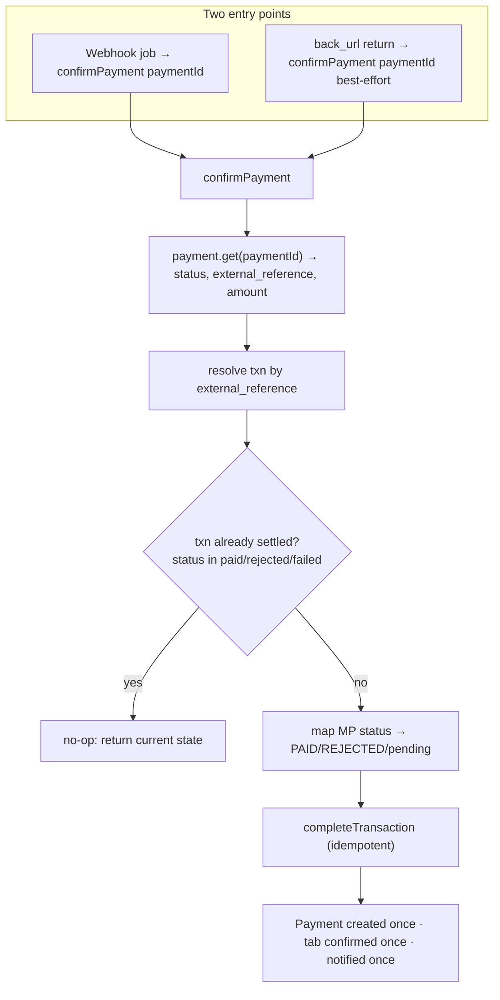
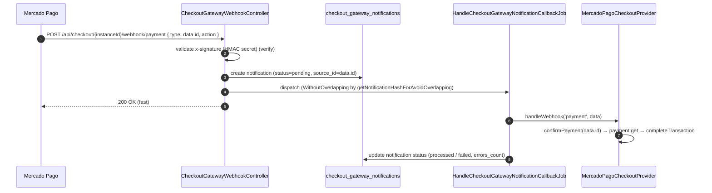
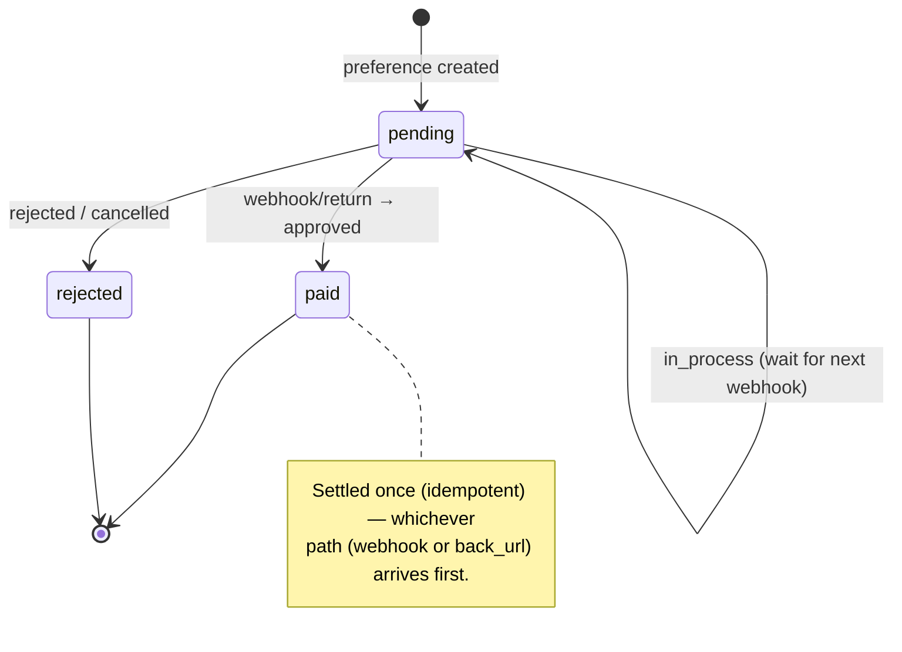

# KitchnTabs Checkout Gateway — Mercado Pago (Checkout Pro) Integration — Plan

> **Version:** 0.2 (plan — decisions locked, grounded in the official MP docs)
> **Status:** Proposed — not yet implemented. Branch: `feature/mercadopago` (from `feature/transbank-pst`).
> **Audience:** Backend & Frontend engineers.
> **Builds on:** the implemented CGP contract + settlement tail + gateway-selection
> ([CHECKOUT_GATEWAYS_FEATURE.md](../../../../../kitchntabs-frontend/docs/CHECKOUT_GATEWAYS_FEATURE.md)),
> the **Transbank** integration as the redirect-flow template
> ([FEAT-TRANSBANK-PST.md](./FEAT-TRANSBANK-PST.md) ·
> [TRANSBANK_INTEGRATION.md](../../../../../kitchntabs-frontend/docs/TRANSBANK_INTEGRATION.md)).
> **Sources:** the attached MP docs ([ML-CHECKOUT-PRO-DOCS.md](./ML-CHECKOUT-PRO-DOCS.md),
> [ML-WEBHOOKS.md](./ML-WEBHOOKS.md)) — API field names, SDK classes, the `x-signature` scheme, and
> test cards below are taken from them.

> **Goal:** let KitchnTabs tenants use **Mercado Pago Checkout Pro** as a checkout gateway in the
> self-service module, following the generic gateway contract — adding the **webhook-confirmed**
> path that DashTest/Transbank (redirect-only) didn't exercise.

> **v0.2 decisions (locked):**
> 1. **Per-tenant `access_token`**, **no `application_fee`** — money goes straight to each tenant's MP
>    account; KitchnTabs takes no commission (no marketplace/OAuth, no split). (§3)
> 2. **Idempotent settlement** is added to the shared tail (defensive, must not change DashTest/Transbank
>    behavior). (§5)
> 3. The **`checkout_gateway_notifications`** table is added if not already migrated. (§6)
> 4. The **`mercadopago/dx-php`** SDK lives in **core `dash-backend`** → requires a **docker core
>    rebuild**, not a hot edit. (§11)

> ⚠️ **Sandbox caveat (from the docs):** **test payments do NOT trigger webhooks.** In sandbox the
> webhook can only be exercised via MP's **dashboard simulator**; the end-to-end sandbox happy path
> relies on the **`back_url` return + `payment.get` fast-path** (§5). Full webhook verification needs
> production credentials (or the simulator). Plan QA accordingly.

---

## Table of Contents

1. [What's Different vs Transbank (the whole point)](#1-whats-different-vs-transbank-the-whole-point)
2. [How It Maps onto the CGP Architecture](#2-how-it-maps-onto-the-cgp-architecture)
3. [Credential Model — Decision](#3-credential-model--decision)
4. [Mercado Pago Checkout Pro Flow](#4-mercado-pago-checkout-pro-flow)
5. [The Two Confirmation Paths + Idempotency](#5-the-two-confirmation-paths--idempotency)
6. [Webhook Infrastructure (new)](#6-webhook-infrastructure-new)
7. [The Provider — `MercadoPagoCheckoutProvider`](#7-the-provider--mercadopagocheckoutprovider)
8. [Connection Params](#8-connection-params)
9. [Transaction State Mapping](#9-transaction-state-mapping)
10. [Self-Service & Gateway Selection (reuse)](#10-self-service--gateway-selection-reuse)
11. [SDK & Dependency (docker rebuild)](#11-sdk--dependency-docker-rebuild)
12. [Environments, Test Users & Cards](#12-environments-test-users--cards)
13. [File-by-File Change List](#13-file-by-file-change-list)
14. [Open Decisions](#14-open-decisions)
15. [Phased Rollout & Testing](#15-phased-rollout--testing)
16. [Sources](#16-sources)

---

## 1. What's Different vs Transbank (the whole point)

| Aspect | Transbank Webpay (done) | Mercado Pago (this plan) |
|---|---|---|
| Confirmation | **Return-URL** (`token_ws` → `commit`) | **Webhook is authoritative** (async); the browser `back_urls` are *informational* |
| `getCapabilities` | `supports_webhooks=false` | **`supports_webhooks=true`**, `requires_redirect=true` |
| Credentials | PST: platform key + tenant commerce code | **Per-tenant `access_token`** (each merchant's own MP account) — §3 |
| Redirect target | `getUrl()` + `?token_ws=` | preference **`init_point`** / `sandbox_init_point` |
| Confirmation call | `Webpay::commit(token)` | `PaymentClient->get(paymentId)` (triggered by the webhook) |
| New infra | a return route | **webhook route + `checkout_gateway_notifications` + queued job + dedup + idempotent settlement** |
| SDK | `laragear/transbank` (already installed) | **`mercadopago/dx-php`** — new dependency → **docker core rebuild** (§11) |
| Environments | separate host (`webpay3gint`) | **same host**, distinguished by **TEST vs prod credentials** |

The single biggest design item is **§5: two confirmation paths converging on one idempotent
settlement**.

---

## 2. How It Maps onto the CGP Architecture

MP is another provider behind the same `CheckoutGateway` contract. The three-tier model, the
per-order `CheckoutGatewayTransaction`, the self-service controller, and the gateway-selection screen
are **reused unchanged**. The new pieces are the webhook ingestion path and an **idempotency guard**
in the shared settlement tail.

```mermaid
flowchart TB
    subgraph Platform["Platform — SystemAdmin"]
        SCG["SystemCheckoutGateway<br/>name='Mercado Pago'<br/>class=MercadoPagoCheckoutProvider"]
    end
    subgraph Instance["Per-tenant instance"]
        CG["CheckoutGateway<br/>connection_params={ access_token, public_key?, test_mode }"]
    end
    subgraph Order["Per-order"]
        TX["CheckoutGatewayTransaction<br/>external_session_id = preference.id<br/>external_reference = txn id"]
        ORD[Order.is_paid] --> PAY[Payment]
        TAB[Tab → CONFIRMED]
    end
    subgraph MP["Mercado Pago"]
        PREF[(Preferences API)]
        PAYAPI[(Payments API)]
    end
    subgraph Webhook["Webhook ingestion (NEW)"]
        WROUTE["POST /api/checkout/&#123;instance&#125;/webhook/payment"]
        NOTIF[(checkout_gateway_notifications)]
        JOB[HandleCheckoutGatewayNotificationCallbackJob]
    end

    SCG --> CG
    CG -->|createPaymentSession → preference.create| PREF --> TX
    CG -. init_point .-> MP
    MP -. webhook (payment.id) .-> WROUTE --> NOTIF --> JOB
    JOB -->|handleWebhook → confirmPayment → payment.get| PAYAPI
    JOB -->|on approved| ORD
    JOB --> TAB
```

---

## 3. Credential Model — **Decided: per-tenant access token, no fee**

Mercado Pago is naturally **per-merchant**: each tenant has their own MP account/application with an
**`access_token`** (private, backend) and **`public_key`** (frontend). Per your decision, KitchnTabs
uses **the tenant's own access token** and takes **no `application_fee`** — money settles directly to
the tenant's MP account. (The marketplace/OAuth + `marketplace_fee` model is explicitly **out of
scope**; revisit only if a platform commission is ever required.)

**Test vs production (per the docs):** **both** test and production access tokens are issued by MP and
**both start with `APP_USR`** — you cannot tell them apart by prefix. For **Checkout Pro**, sandbox is
done with **test accounts** (a test **seller** + test **buyer**), using the **test seller's access
token**; the preference returns a separate **`sandbox_init_point`** to redirect to. So:

```mermaid
flowchart TD
    A["resolveAccessToken() / redirect target"] --> B{instance test_mode?<br/>(default true)}
    B -- "yes (sandbox)" --> S["access token = a TEST-seller token<br/>(instance, or a shared dev token in config)<br/>redirect → preference.sandbox_init_point"]
    B -- "no (production)" --> P["access token = tenant's production token (APP_USR)<br/>redirect → preference.init_point"]
```

Per-request credential scoping — MP's SDK uses a static config setter:

```php
// Sketch — inside MercadoPagoCheckoutProvider
use MercadoPago\MercadoPagoConfig;
protected function withCredentials(callable $fn) {
    $previous = MercadoPagoConfig::getAccessToken();
    MercadoPagoConfig::setAccessToken($this->resolveAccessToken()); // tenant prod token, or sandbox test-seller token
    try { return $fn(); } finally { MercadoPagoConfig::setAccessToken($previous); }
}
```

> Each tenant has their **own** MP application, so each also has its **own webhook secret** (§6) and
> can have its own test seller account. For shared-dev convenience, the sandbox test-seller token may
> instead live in `config/checkout.php` (`checkout.mercadopago.sandbox_access_token`) — analogous to
> Transbank's sandbox constants.

---

## 4. Mercado Pago Checkout Pro Flow

```mermaid
sequenceDiagram
    autonumber
    participant Cust as Customer (kiosk)
    participant API as SelfServiceCheckoutController
    participant Prov as MercadoPagoCheckoutProvider
    participant MP as Mercado Pago
    participant WH as Webhook route + job
    participant Ret as CheckoutWebController (back_url)
    participant Tail as completeTransaction (idempotent)

    Cust->>API: POST /checkout/session { order_id=tabId, amount }
    API->>Prov: createPaymentSession(orderData)
    Prov->>MP: PreferenceClient->create({ items, back_urls, auto_return:'approved',<br/>notification_url, external_reference = txn.id })
    MP-->>Prov: { id, init_point, sandbox_init_point }
    Prov->>Prov: persist txn (external_session_id = preference.id; status=pending)
    Prov-->>API: redirect_url = (test_mode ? sandbox_init_point : init_point)
    API-->>Cust: { redirect_url }
    Cust->>MP: SAME-TAB navigate → MP hosted checkout
    Cust->>MP: pays (test card / test user)

    par Authoritative (async)
        MP->>WH: POST notification_url { type:'payment', data.id }
        WH->>WH: store + queue job (deduped)
        WH->>MP: PaymentClient->get(data.id) → { status, external_reference, amount }
        WH->>Tail: confirmPayment(paymentId) → completeTransaction(PAID|REJECTED)
    and Informational (browser)
        MP->>Ret: back_urls.success → GET /checkout/mercadopago/return/{hash}?payment_id&status&external_reference
        Ret->>Tail: best-effort confirmPayment(payment_id)  (idempotent; may be a no-op)
        Ret-->>Cust: redirect → /selfservice/{hash}/tab/{tabId}?transaction={id}
    end

    Cust->>Cust: kiosk reads ?transaction → status<br/>(paid→toast · rejected→dialog · pending→"procesando", wait for WS)
```

Key field choices:
- **`external_reference`** = our `CheckoutGatewayTransaction.id` → lets the webhook's `payment.get`
  correlate back to our transaction.
- **`external_session_id`** = the **preference id** (returned by `create`).
- **`notification_url`** = `/api/checkout/{instanceId}/webhook/payment` (per-preference; also set in
  the MP dashboard as a fallback).
- **`back_urls`** = `{ success|failure|pending → /checkout/mercadopago/return/{hash} }`, `auto_return='approved'`.

---

## 5. The Two Confirmation Paths + Idempotency

This is the crux. **Both** the webhook (authoritative) and the back_url return (informational
fast-path) call `confirmPayment(paymentId)`. They can arrive in **either order** (webhook may beat
the redirect, or vice-versa). So:



**Required cross-cutting change — make settlement idempotent.** Today
`AbstractCheckoutGatewayProvider::completeTransaction()` would double-insert `Payment` / re-notify if
called twice. Add a guard:
- `confirmPayment` (or `completeTransaction`) returns early if the transaction is **already in a
  terminal state** (`paid`/`rejected`/`failed`).
- The `Payment` insert keys on `source_id = paymentId` (or `transaction_id`) so a duplicate is a
  no-op (`firstOrCreate`).
- `handleStatusChange(... CONFIRMED ...)` only fires if the tab is still `CREATED`.

This guard benefits **all** providers (defensive) but is **mandatory** for MP's dual paths.

**`in_process`/`pending`:** if the payment is pending (e.g. ticket/transfer not yet cleared), leave
the transaction `pending`; the kiosk shows "procesando" and settles when the next webhook
(`payment.updated` → approved) arrives.

---

## 6. Webhook Infrastructure (new)

Mirrors the marketplace webhook pattern (`HandleMarketplaceNotificationCallbackJob` + dedup).



**Webhook payload (confirmed).** MP POSTs with query `?data.id={paymentId}&type=payment` and body:
```json
{ "id": 12345, "live_mode": true, "type": "payment", "date_created": "…",
  "user_id": 44444, "api_version": "v1", "action": "payment.created|payment.updated",
  "data": { "id": "999999999" } }
```
Headers: `x-signature: ts=<unix>,v1=<hmac>` and `x-request-id`. MP expects **HTTP 200/201 within 22s**;
otherwise it **retries every 15 min** (then backs off). Webhooks fire on payment **create and every
status change** (pending/rejected/approved).

**Signature validation (confirmed scheme).** Use the SDK validator, or the manual HMAC:
```php
use MercadoPago\Webhook\WebhookSignatureValidator;            // dx-php
use MercadoPago\Exceptions\InvalidWebhookSignatureException;
// $dataId = strtolower($request->query('data_id'));  // NB: PHP/Laravel turn "data.id" → "data_id"
try {
    WebhookSignatureValidator::validate($xSignature, $xRequestId, $dataId, $secret);
} catch (InvalidWebhookSignatureException $e) { abort(401); }
```
Manual manifest (if not using the SDK): `id:{data.id};request-id:{x-request-id};ts:{ts};`
(lowercase `data.id`; omit absent pairs) → `hash_hmac('sha256', $manifest, $secret)` → compare to `v1`.

Components:
- **Route:** `POST /api/checkout/{instanceId}/webhook/{type}` (public, no auth). Resolve the
  `CheckoutGateway` by `{instanceId}` → the tenant's credentials (for `payment.get`) **and** that
  instance's **`webhook_secret`** (for signature validation). Return 200 fast, process async.
- **Confirm:** after validation, fetch the payment — `(new MercadoPago\Client\Payment\PaymentClient())->get($data['data']['id'])`
  (`GET https://api.mercadopago.com/v1/payments/{id}`) → map `status` (§9) → idempotent settlement.
- **`checkout_gateway_notifications`** table + model (CGP schema §6). **Add the migration if missing**
  (`checkout_gateway_id`, `source_id`, `data` json, `status`, `error`, `errors_count`).
- **`HandleCheckoutGatewayNotificationCallbackJob`** (new, mirrors `HandleMarketplaceNotificationCallbackJob`)
  with `WithoutOverlapping($hash)` dedup; updates the notification row to processed/failed.
- **Contract:** `handleWebhook(string $type, array $data): bool` + static
  `getNotificationHashForAvoidOverlapping($instanceUrlId, $payload)` (already in the contract).
- **`webhook_secret`** is the **per-application** signing key from MP dashboard (Webhooks → Configure
  notification); stored in the instance `connection_params`.

---

## 7. The Provider — `MercadoPagoCheckoutProvider`

`Domain\App\Services\ECommerce\Checkout\MercadoPago\MercadoPagoCheckoutProvider extends
AbstractCheckoutGatewayProvider`. SDK classes (dx-php): `MercadoPago\MercadoPagoConfig`,
`MercadoPago\Client\Preference\PreferenceClient`, `MercadoPago\Client\Payment\PaymentClient`,
`MercadoPago\Webhook\WebhookSignatureValidator`.

| Contract method | Implementation |
|---|---|
| `getCapabilities()` | `['supports_webhooks'=>true, 'requires_redirect'=>true, 'supported_currencies'=>['CLP'], 'region'=>'CL', 'is_demo'=>false]` |
| `getConnectionParamFormats()` | `access_token` (password), `public_key` (text, optional), `webhook_secret` (password), `test_mode` (boolean, default true). §8 |
| `verifyCredentials()` | sandbox → non-empty token; prod → a cheap authenticated call (e.g. `GET /users/me`) succeeds. |
| `createPaymentSession($orderData)` | `withCredentials(fn => (new PreferenceClient())->create([ 'items'=>[…], 'back_urls'=>[…], 'auto_return'=>'approved', 'notification_url'=>…, 'external_reference'=>txn.id ]))`; persist `external_session_id = pref->id`; `redirect_url = test_mode ? pref->sandbox_init_point : pref->init_point`. |
| `getRedirectUrl($token)` | stored `redirect_url`. |
| `handleCallback($request)` | from the back_url GET: `['transaction_id' => $request->query('payment_id')]`. |
| `confirmPayment($paymentId)` | `withCredentials(fn => (new PaymentClient())->get($paymentId))`; **idempotency guard**; map `$payment->status` (§9); `completeTransaction(...)`. Correlate via `$payment->external_reference`. |
| `handleWebhook('payment', $data)` | `confirmPayment($data['data']['id'])`. Other types → no-op `true`. |
| `getNotificationHashForAvoidOverlapping($id, $payload)` | `"checkout|mercadopago|{$id}|{$payload['data']['id']}"`. |
| `refundPayment($paymentId, $amount?)` | MP refunds (`POST /v1/payments/{id}/refunds`) — wire later. |

Everything after a successful `confirmPayment` (order paid, `Payment`, tab `CONFIRMED`, notify) is the
**shared idempotent settlement tail** (§5).

---

## 8. Connection Params

| Field | Type | Notes |
|---|---|---|
| `access_token` | password (required) | The tenant's MP **access token** (`APP_USR…`). Sandbox: a **test-seller** account token. |
| `public_key` | text (optional) | Frontend key; not needed for the Checkout Pro redirect (Wallet Brick) flow. |
| `webhook_secret` | password (required for webhooks) | The application's **signing secret** (MP dashboard → Webhooks → Configure notification) — used to validate `x-signature`. |
| `test_mode` | boolean (default **true**) | Use the sandbox token + redirect to `sandbox_init_point`. |

Rendered by the now-generic `CheckoutGatewayConfiguration` form (boolean→switch, password, text) — no
frontend change needed (the type-driven renderer already handles these).

---

## 9. Transaction State Mapping

| MP payment `status` | `CheckoutGatewayTransaction.status` | Effect |
|---|---|---|
| `approved` | `STATUS_PAID` | order paid · Payment · tab CONFIRMED · notify |
| `rejected` / `cancelled` | `STATUS_REJECTED` | no settlement; kiosk failure dialog |
| `in_process` / `pending` | `STATUS_PENDING` (unchanged) / `STATUS_AUTHORIZED` | kiosk "procesando"; settle on the next webhook |
| (lookup error) | `STATUS_FAILED` | logged |



---

## 10. Self-Service & Gateway Selection (reuse)

No new self-service or kiosk code:
- `SelfServiceCheckoutController::createSession` already resolves the chosen/default gateway and calls
  `createPaymentSession` — works for MP unchanged.
- The **gateway-selection screen** already lists all enabled gateways (DashTest, Transbank, **Mercado
  Pago**) default-first; the customer picks MP and is redirected to `init_point`.
- The kiosk **return handler** (`SelfServiceAppHookComponent`) already reads `?transaction={id}` and
  polls `checkout/transaction/{id}`. **One enhancement:** handle the **`pending`/`in_process`** status
  with a "procesando tu pago…" state that resolves on the WebSocket settlement event (today it stays
  quiet on pending). Small, additive.

---

## 11. SDK & Dependency (docker rebuild)

- Add **`mercadopago/dx-php`** to `dash-backend/composer.json` (`composer require "mercadopago/dx-php"`)
  — confirmed package name; namespaces `MercadoPago\MercadoPagoConfig`, `MercadoPago\Client\…`,
  `MercadoPago\Webhook\WebhookSignatureValidator`. The domain layer runs inside dash-backend's vendor.
- Per the dev setup: **new dependencies require a docker core build** (core files are mounted, but
  `vendor` is baked) — so this is **not** a hot edit; schedule the rebuild before backend work starts.
- Initialise per request via the tenant's token (`MercadoPagoConfig::setAccessToken`, §3), not a
  global config.

---

## 12. Environments, Test Users & Cards

- **Same API host** (`api.mercadopago.com`) for test and production; the **credential** selects the
  environment (both tokens are `APP_USR…`). Redirect to `sandbox_init_point` in test, `init_point` in
  prod.
- **Test accounts:** MP sandbox needs a **test seller** (its access token is the sandbox credential)
  and a **test buyer** (to pay) — created under *Your integrations → Test accounts* (same country).
- **Test cards** (from the docs): Mastercard `5416 7526 0258 2580`, Visa `4168 8188 4444 7115`, Amex
  `3757 781744 61804`; CVV `123` (Amex `1234`); expiry `11/30`. Force the outcome via the **cardholder
  name**: `APRO` = approved, `OTHE` = rejected, `CONT` = pending (+ `FUND`/`SECU`/`EXPI`/…); doc number
  `(otro) 123456789`.
- **⚠️ Webhooks are NOT sent for test payments.** Per the docs, payments made with test credentials do
  **not** fire webhooks. Verify the webhook path via the MP dashboard **simulator** (*Webhooks →
  Simulate*, sends a `payment` body with a chosen `data.id`), or with a real production payment. The
  **back_url + `payment.get` fast-path** is the e2e sandbox happy path.
- **Webhook reachability:** MP must reach `notification_url` over HTTPS — use the existing Cloudflare
  tunnel (`api-dev.kitchntabs.com`); never a localhost/`back_urls` local domain (MP rejects those).

---

## 13. File-by-File Change List

### Domain (`kitchntabs-backend-domain`)
| File | Change |
|---|---|
| `app/Services/ECommerce/Checkout/MercadoPago/MercadoPagoCheckoutProvider.php` | **New** — the provider (§7). |
| `app/Services/ECommerce/Checkout/AbstractCheckoutGatewayProvider.php` | **Idempotency guard** in `completeTransaction` (early-return if already terminal; `Payment` keyed on `source_id`) (§5). |
| `app/Models/Checkout/SystemCheckoutGateway.php` | Add `MercadoPagoCheckoutProvider::class` to `getAvailableClasses()`. |
| `database/seeders/Checkout/SystemCheckoutGatewaysSeeder.php` | Seed the "Mercado Pago" catalog row. |
| `app/Http/Controllers/API/Checkout/CheckoutGatewayWebhookController.php` | **New** — `POST /api/checkout/{instance}/webhook/{type}` (validate signature, store, dispatch job, 200). |
| `app/Jobs/ECommerce/HandleCheckoutGatewayNotificationCallbackJob.php` | **New** — queued, `WithoutOverlapping`, calls `handleWebhook`. |
| `app/Models/Checkout/CheckoutGatewayNotification.php` + migration | **New if missing** — `checkout_gateway_notifications` (CGP schema §6). |
| `app/Http/Controllers/Web/Checkout/CheckoutWebController.php` | `mercadopagoReturn` (back_url → best-effort confirm → redirect to kiosk tab). |
| `routes/api/checkout.php` | Webhook route. |
| `routes/web/checkout.php` | `checkout.mercadopago.return` route. |

### Core (`dash-backend`)
| File | Change |
|---|---|
| `composer.json` | Add `mercadopago/dx-php` → **docker core rebuild** (§11). |
| `config/checkout.php` | Optional MP platform defaults (only if Option B / shared sandbox token). |
| `app/Http/Middleware/VerifyCsrfToken.php` | Except the webhook + `/checkout/mercadopago/return/*` (cross-site POSTs). |

### Frontend (`kitchntabs-frontend`)
| File | Change |
|---|---|
| `apps/kitchntabs-app/src/kt-selfservice/contexts/SelfServiceAppHookComponent.tsx` | Add a **"procesando" / pending** state on return (webhook may settle slightly later). |
| `i18n/{es,en}` | Strings for the pending state. |
| — | Admin config form + gateway selection + pay flow **unchanged** (already generic). |

---

## 14. Open Decisions

**Decided (v0.2):**
- ✅ **Per-tenant access token, no `application_fee`** (§3).
- ✅ **Idempotent settlement** in the shared `completeTransaction` (early-return on terminal +
  `Payment::firstOrCreate` on the MP payment id) — defensive, must not change DashTest/Transbank (§5).
- ✅ Add **`checkout_gateway_notifications`** if missing (§6); SDK in **core** (§11).
- ✅ **Validate `x-signature`** (HMAC scheme confirmed from the docs, §6) using the per-instance
  `webhook_secret`.

**Still open / to confirm:**
1. **Sandbox webhook testing** — since test payments don't fire webhooks, decide the QA approach:
   MP **simulator** for the webhook + back_url fast-path for e2e, vs a short-lived **production**
   smoke test. (Doesn't block building.)
2. **Pending UX** — how long the kiosk shows "procesando" before "te avisaremos cuando se confirme"
   (relies on the WebSocket settlement event when the webhook lands).
3. **Refunds** — wire `refundPayment` now vs defer (CGP-wide it's currently stubbed).
4. **Confirm the exact `mercadopago/dx-php` version** + that `PreferenceClient`/`PaymentClient`/
   `WebhookSignatureValidator` namespaces match the pinned release.

---

## 15. Phased Rollout & Testing

1. **Dependency + scaffolding:** add `mercadopago/dx-php` (docker rebuild); create the provider
   skeleton + seed; add the idempotency guard to `completeTransaction`.
2. **Preference + redirect (sandbox):** `createPaymentSession` → `init_point`; redirect → MP test
   checkout; pay with a test user/card. Verify the txn persists with `external_reference`.
3. **Webhook path:** webhook route + `checkout_gateway_notifications` + queued job + signature check;
   confirm `payment.get` settles via the **idempotent** tail. Test with MP's webhook simulator and a
   real sandbox payment (over the dev tunnel).
4. **back_url path:** `mercadopagoReturn` best-effort confirm + redirect; verify it's a **no-op** when
   the webhook already settled (idempotency), and a **fast-path** when it arrives first.
5. **Pending UX:** force an `in_process` payment; verify the kiosk shows "procesando" and resolves on
   the follow-up webhook.
6. **Gateway selection:** enable DashTest + Transbank + Mercado Pago for one tenant → the picker shows
   all three, default first; each pays through its own provider.
7. **Unit/feature:** preference build, status mapping, **double-confirmation idempotency** (webhook +
   return for the same payment → exactly one `Payment`, one notification), signature rejection.

---

## 16. Sources

- **Attached MP docs** (authoritative for this plan): [ML-CHECKOUT-PRO-DOCS.md](./ML-CHECKOUT-PRO-DOCS.md)
  (create application/credentials, SDK init, preferences, `back_urls`, frontend Wallet brick, payment
  notifications + `x-signature` validation) and [ML-WEBHOOKS.md](./ML-WEBHOOKS.md) (credentials, test
  accounts & **test cards**, webhook payload/headers/retry, `payment.get` endpoints, the
  "test payments don't notify" caveat, IPN deprecation).
- Mercado Pago — Official PHP SDK: `https://github.com/mercadopago/sdk-php` (package
  `mercadopago/dx-php`).
- In-repo template: the implemented **Transbank** integration
  ([FEAT-TRANSBANK-PST.md](./FEAT-TRANSBANK-PST.md),
  [TRANSBANK_INTEGRATION.md](../../../../../kitchntabs-frontend/docs/TRANSBANK_INTEGRATION.md)) and the
  generic CGP contract + settlement tail
  ([FEAT-SYSTEM-CHECKOUT-GATEWAYS.md](./FEAT-SYSTEM-CHECKOUT-GATEWAYS.md),
  [CHECKOUT_GATEWAYS_FEATURE.md](../../../../../kitchntabs-frontend/docs/CHECKOUT_GATEWAYS_FEATURE.md)).
