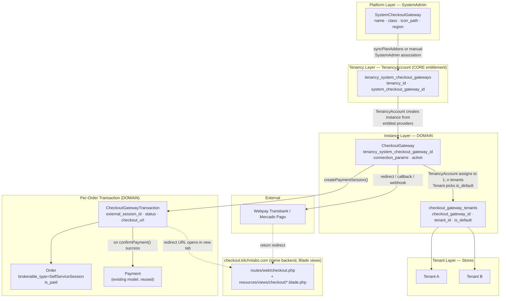
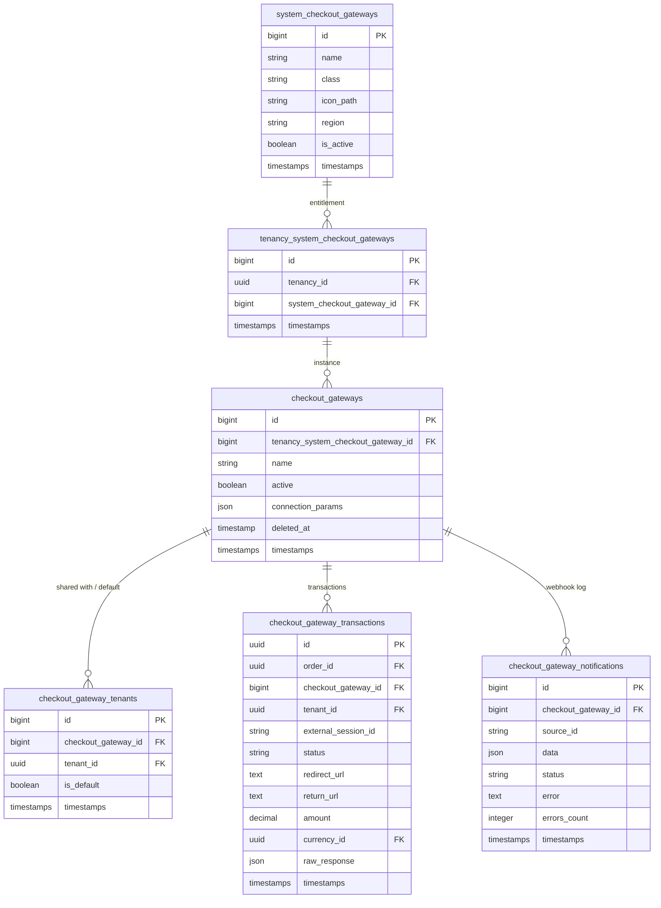
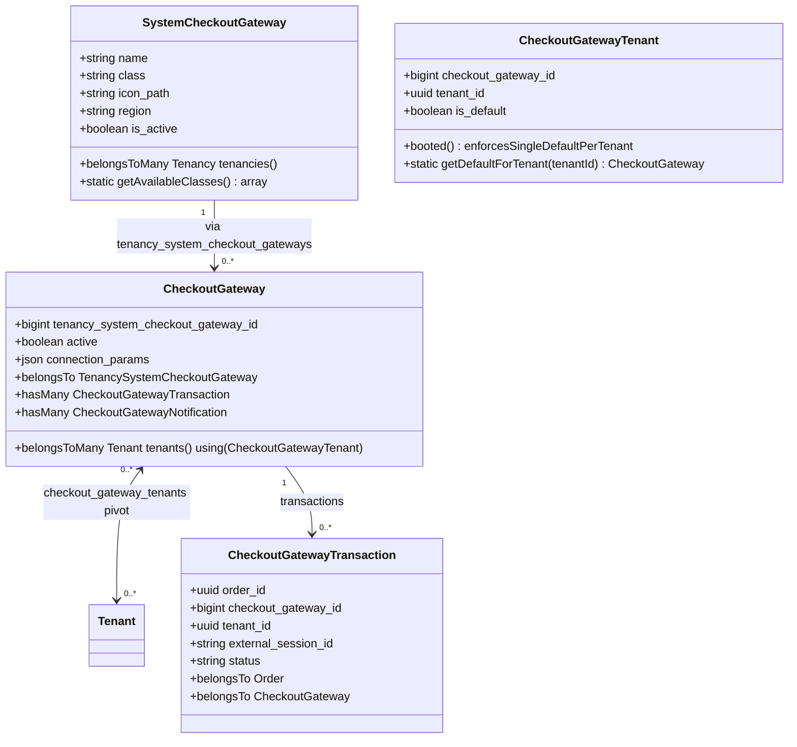
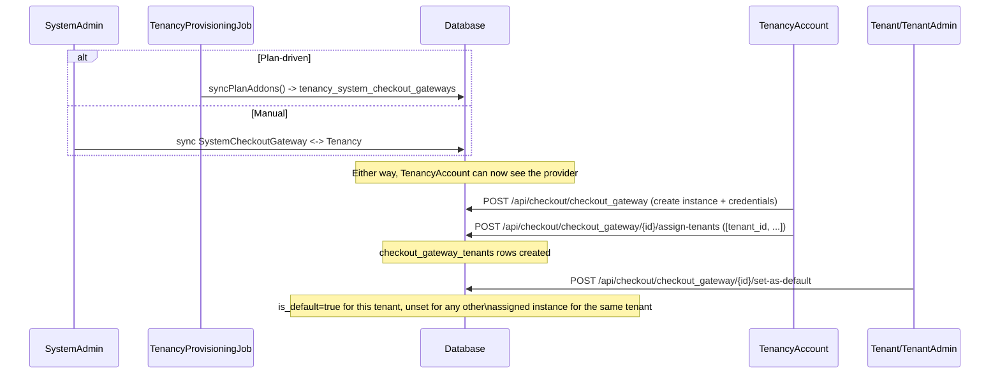
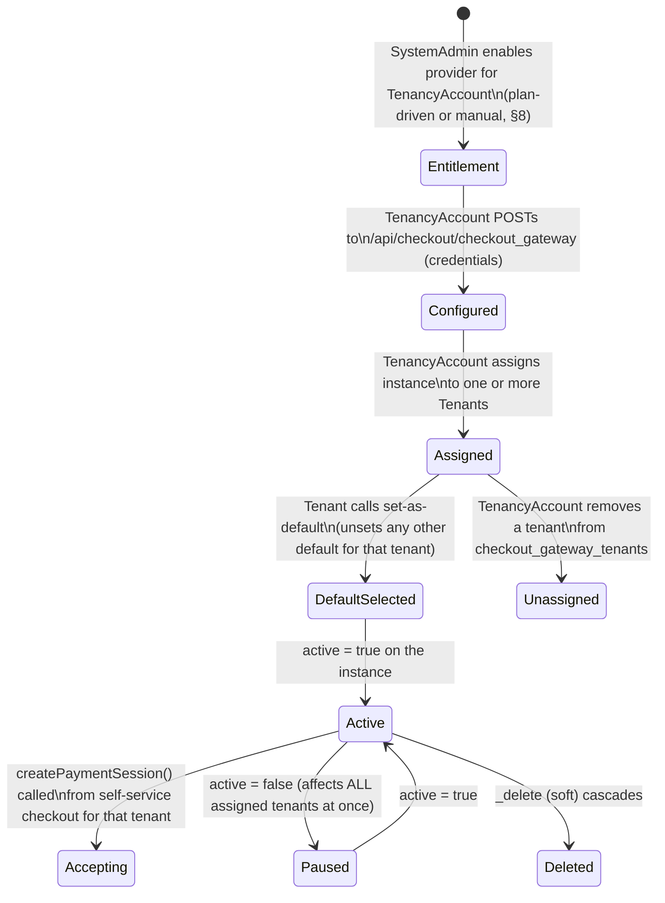
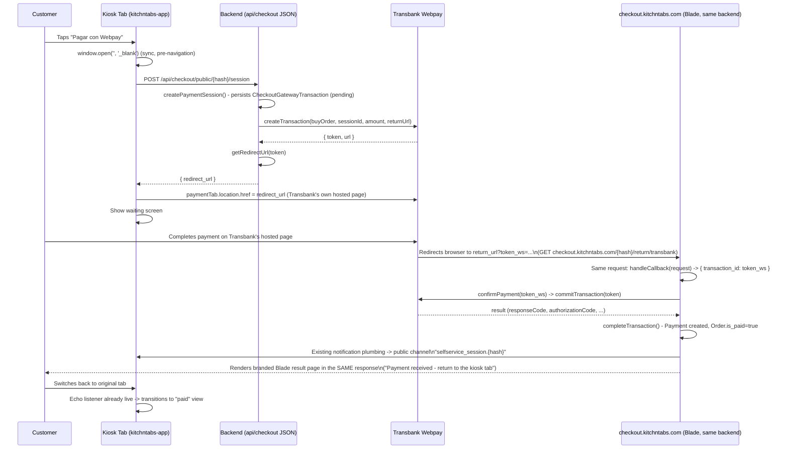
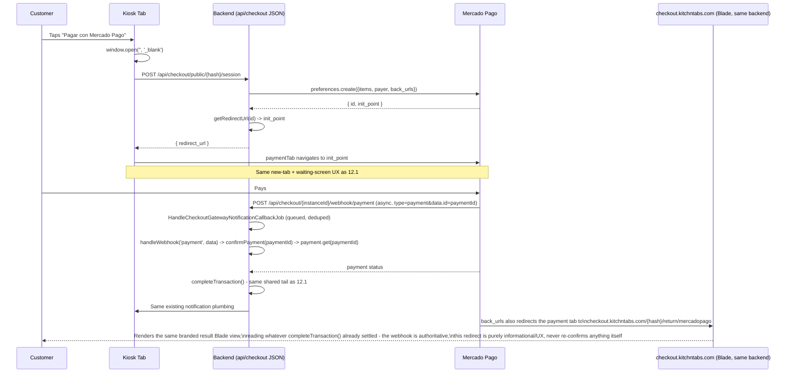

# KitchnTabs Checkout Gateway — Technical Requirements & Implementation Plan

> **Version:** 0.4 (partially implemented)
> **Status:** Backend three-tier + DashTest demo provider + self-service integration **implemented**; Transbank Webpay & Mercado Pago **not yet implemented** (see §1.1)
> **Audience:** Engineers, Backend/Frontend Developers
> **Related docs:** [FEAT-SYSTEM-MARKETPLACES.md](../marketplaces/FEAT-SYSTEM-MARKETPLACES.md) · [FEAT-SYSTEM-POINT-OF-SALES.md](../point-of-sales/FEAT-SYSTEM-POINT-OF-SALES.md) · [PAYMENT_GATEWAYS.md](../payments/PAYMENT_GATEWAYS.md)

> **v0.4 changelog (2026-06-21)**: first working slice landed. A **DashTest** demo provider (a self-hosted fake "bank" page, no external SDK) now exercises the full create-order → pay → confirm flow end-to-end. Several runtime behaviors **diverge from the v0.2/v0.3 plan** and this version documents the as-built reality; the Webpay/Mercado Pago sections (§14, §15) and the `checkout.kitchntabs.com` Blade-result design (§16) remain the forward target, not yet built. Key divergences: (a) payment opens in the **same tab**, not `window.open('', '_blank')`; (b) the return leg redirects to the **kiosk SPA tab-detail page** (`/selfservice/{hash}/tab/{orderId}`), not a `checkout.kitchntabs.com` Blade result page; (c) a successful payment **auto-confirms the tab** (`CREATED → CONFIRMED`) in addition to `is_paid=true`; (d) web routes are **not yet `Route::domain()`-scoped** — they answer under `/checkout/...` on the API host. See §1.1.
>
> **v0.3 changelog**: `checkout.kitchntabs.com` is no longer a React app — it's server-rendered Blade views on the same backend that serves `api.kitchntabs.com`, reusing the tenant-branding extraction already built for transactional emails. See §16.
>
> **v0.2 changelog**: reworked the ownership model per the CGP spec — gateway *instances* are now created at the **TenancyAccount** level and **shared with one or more tenants** (mirroring `Marketplace::tenants()`/`marketplace_tenants`), with a **per-tenant default selection**, instead of v0.1's one-instance-per-tenant model. Adopted the spec's literal interface method names. Promoted **Mercado Pago** to a co-equal v1 provider alongside Transbank Webpay (validating genericity against two real gateways instead of one). Webhook handling is now an actively-used v1 capability (Mercado Pago), not just forward-looking.

---

## Table of Contents

1. [Overview](#1-overview)
   - [1.1 Implementation Status (v0.4 — as built)](#11-implementation-status-v04--as-built)
2. [Roles & Responsibilities](#2-roles--responsibilities)
3. [Relationship to Existing Payment Concepts](#3-relationship-to-existing-payment-concepts)
4. [Core vs Domain Placement](#4-core-vs-domain-placement)
5. [Architecture Layers](#5-architecture-layers)
6. [Database Schema](#6-database-schema)
7. [Entity Relationships](#7-entity-relationships)
8. [Provisioning Flow](#8-provisioning-flow)
9. [Visibility & Access Control](#9-visibility--access-control)
10. [Checkout Gateway Instance Lifecycle](#10-checkout-gateway-instance-lifecycle)
11. [The Generic CheckoutGateway Contract](#11-the-generic-checkoutgateway-contract)
12. [Standard Checkout Flow](#12-standard-checkout-flow)
13. [Self-Service Integration (v1 target)](#13-self-service-integration-v1-target)
14. [Transbank Webpay Implementation](#14-transbank-webpay-implementation)
15. [Mercado Pago Implementation](#15-mercado-pago-implementation)
16. [New Frontend App: checkout.kitchntabs.com](#16-new-frontend-app-checkoutkitchntabscom)
17. [API Reference](#17-api-reference)
18. [File-by-File Change List](#18-file-by-file-change-list)
19. [Open Decisions](#19-open-decisions)
20. [Phased Rollout Plan](#20-phased-rollout-plan)
21. [Testing Plan](#21-testing-plan)

---

## 1. Overview

KitchnTabs will let TenancyAccounts configure **Checkout Gateway Providers (CGP)** so that a tenant's *end customers* can pay for an order online. **Two** providers ship in v1, both region `CL`: **Transbank Webpay** and **Mercado Pago** — deliberately two, not one, so the generic abstraction is validated against a redirect-only/return-URL-confirmed gateway (Webpay) *and* a webhook-capable one (Mercado Pago) from the start, rather than risking a contract accidentally shaped around a single provider's quirks.

The initial consumer is the **self-service kiosk** module. This feature gives it first-party checkout gateways that KitchnTabs controls end-to-end, rather than depending on a third-party marketplace's order/checkout API.

Architecturally this mimics System Marketplaces and System Point of Sales — the existing three-tier "platform catalog → account entitlement → instance" pattern — with one deliberate structural addition the CGP spec requires and Marketplaces/POS don't: an instance can be **created once at the account level and shared across several tenants (stores)**, each picking their own default. See §2 and §6.

The backend logic lives in the **domain layer** (`kitchntabs-backend-domain`), exposed under **`/api/checkout/...`**. **`checkout.kitchntabs.com`** hosts the redirect/result pages as lightweight, server-rendered Blade views on that same backend — not a separate frontend application (§16).

---

## 1.1 Implementation Status (v0.4 — as built)

This section is the source of truth for **what actually runs today**. Everything below it (§2 onward) still describes the full intended design; where the two disagree, this section wins until the rest is reconciled.

### Implemented

| Area | What's built | Where |
|---|---|---|
| **Three-tier schema** | `system_checkout_gateways`, `tenancy_system_checkout_gateways`, `checkout_gateways`, `checkout_gateway_tenants` (with `is_default`), `checkout_gateway_transactions` | domain migrations + `app/Models/Checkout/*` |
| **Generic contract** | `CheckoutGateway` interface + `AbstractCheckoutGatewayProvider` base class with the shared `completeTransaction()` tail | `app/Services/ECommerce/Checkout/` |
| **DashTest demo provider** | A fully self-hosted fake gateway — KitchnTabs serves its own "bank" page (Approve/Reject), no external SDK or credentials. Capabilities: `supports_webhooks=false`, `requires_redirect=true`, `supported_currencies=['CLP']`, `region='CL'`, `is_demo=true` | `app/Services/ECommerce/Checkout/DashTest/DashTestCheckoutProvider.php` |
| **Default-instance resolution** | `CheckoutGatewayTenant::getDefaultForTenant($tenantId)` | `app/Models/Checkout/CheckoutGatewayTenant.php` |
| **Self-service session endpoint** | `POST /public/selfservice/{hash}/checkout/session` — accepts `order_id`, `amount`, and a frontend-supplied `return_url`; resolves the tenant's default active gateway; creates the transaction; returns `redirect_url` | `app/Http/Controllers/API/SelfService/SelfServiceCheckoutController.php` |
| **Web (Blade) pages** | DashTest bank page (`dashtest_pay`), decision processor (`dashtestProcess`), generic `result`, and a session-keyed `returnForSession` | `routes/web/checkout.php` + `app/Http/Controllers/Web/Checkout/CheckoutWebController.php` |
| **Completion tail** | On approval: `Order.is_paid=true`, a `Payment` row is created, the **tab is auto-confirmed** (`CREATED → CONFIRMED` via `Order.tabable`), and `TabsNotificationService::handleStatusChange()` broadcasts to the kiosk | `AbstractCheckoutGatewayProvider::completeTransaction()` |
| **Kiosk UI** | "Pagar en línea" on the order card **and** "Pagar" in the order list; post-payment "Pedido Pagado" badge + hidden pay/cancel buttons; "Pedido Confirmado — bloqueado" state; cart item delete + smart add/merge | `apps/kitchntabs-app/src/kt-kiosk/components/{SelfServiceOrderActions,MallClientTabsList,MallCartItemsList}.tsx`, `contexts/MallOrderCreateContext.tsx` |

### Divergences from §12–§16 (intentional, as built)

1. **Same-tab redirect, not a new tab.** The kiosk navigates the **current** window to the gateway (`window.location.href = redirect_url`). The spec's `window.open('', '_blank')` + waiting-screen pattern (§12, §13) is **not** used. (Product decision: cleaner on locked-down kiosk hardware.)
2. **Return lands on the kiosk SPA, not a Blade result page.** The frontend sets `return_url` to `{appOrigin}/selfservice/{hash}/tab/{orderId}`. For DashTest, `dashtestProcess()` runs `confirmPayment()` itself and then `redirect()->away()` straight to that SPA URL (appending `?transaction={id}`). The branded `checkout.kitchntabs.com` Blade result page in §16 is **not** on the critical path for DashTest; `returnForSession()` exists but is **only** reached if a provider's `return_url` is pointed at `/checkout/return/{hash}` (it isn't, today).
3. **Payment auto-confirms the tab.** A successful payment sets `is_paid=true` **and** moves the tab `CREATED → CONFIRMED`. The spec (§13) only specified `is_paid`. This is so the kiosk correctly locks the order (no further pay/cancel) once paid.
4. **Web routes are not yet host-scoped.** `routes/web/checkout.php` uses a plain `Route::prefix('checkout')` group — no `Route::domain(config('app.checkout_domain'))` yet (§16.3). The pages answer under `/checkout/...` on the API host.
5. **Single demo provider, no real SDKs.** Neither `laragear/transbank` (Webpay, §14) nor `mercadopago/dx-php` (§15) is wired. DashTest stands in for both the redirect-only and (eventually) webhook-confirmed shapes.

### Known gap (open)

- **Return-param mismatch breaks cache refresh.** The kiosk's `SelfServiceOrderActions` invalidates the React-Query cache **only when it sees `?returned_from_payment=true`**, but the live DashTest path (`dashtestProcess`) appends **`?transaction={id}`** instead (and `returnForSession`, which would append `returned_from_payment`, isn't on that path). Net effect: returning from payment can show **stale** order data (pay/cancel buttons still enabled) until a manual refresh, even though the backend already marked the order paid+confirmed. Fix options: have the frontend effect also treat `transaction` as a return signal, or route DashTest's return through `returnForSession`. Not yet resolved.

---

## 2. Roles & Responsibilities

This is the load-bearing section of the spec — getting the ownership chain right here drives every table/policy decision below.

| Role | Can do |
|---|---|
| **SystemAdmin** | Lists the available CGP classes (PHP classes implementing the `CheckoutGateway` interface — `WebPay`, `Mercado Pago`, future providers). Creates the **`SystemCheckoutGateway`** catalog row referencing each class. Associates a `SystemCheckoutGateway` with specific **TenancyAccounts**, making it visible/usable to them. |
| **TenancyAccount** (TenancyAdmin) | From the providers SystemAdmin enabled for their account, **creates `CheckoutGateway` instances** (e.g., a configured Webpay connection with real commerce-code credentials). **Associates each instance with one or a group of specific Tenants (stores)** under their account. Can configure credentials/params on any instance their account owns. |
| **Tenant / TenantAdmin** | Manages (CRUD) the instances **assigned to their tenant** by the TenancyAccount — including editing credentials. **Selects which assigned instance is the default** for that tenant's self-service checkout. |
| **End customer (via Self-Service)** | Executes the checkout flow using the tenant's currently-default `CheckoutGateway` instance. |

The key structural consequence: a `CheckoutGateway` instance's "owner" is the **Tenancy**, not a single Tenant — one instance can genuinely serve several stores under the same account (e.g., one Webpay merchant agreement covering three locations), and each store independently picks its default if more than one instance is assigned to it. This is the one place this feature **diverges** from the Marketplace/POS precedent (where an instance is created *as* a specific tenant and only optionally shared afterward) — see §6 for how the schema captures it.

---

## 3. Relationship to Existing Payment Concepts

Two existing things sound like "payment gateway." Neither is this feature.

### 3.1 `SystemPaymentGateway` (existing, core, `dash-backend`)

`App\Models\SystemPaymentGateway`, documented in [PAYMENT_GATEWAYS.md](../payments/PAYMENT_GATEWAYS.md). This is **tenancy billing** — how a TenancyAccount pays *KitchnTabs* for its subscription. Implementations: `InternalPaymentGatewayService`, `RebillPaymentGatewayService`, `FlowPaymentGatewayService`, and — notably — **`TransbankPaymentGatewayService`** (`dash-backend/app/Services/Payments/Transbank/`), already using the `laragear/transbank` package's `Webpay`/`Oneclick` facades, but for **subscription** charges, scoped per-Tenancy (`TenancySystemPaymentGateway`).

Confirmed facts from this existing system that shape this doc:
- `system_payment_gateways.region` is a plain nullable string (`"CL, PE, MX"` as a multi-region display value per [PAYMENT_GATEWAYS.md](../payments/PAYMENT_GATEWAYS.md)) — the direct precedent for Region classification (§6).
- `system_payment_gateways` explicitly **does not use soft deletes** — a 2026-06-13 migration removed them because *"a soft-deleted row keeps occupying the unique name/class, which blocks re-creating a gateway with the same identity."* Applied to `system_checkout_gateways` below.
- `TransbankPaymentGatewayService::getCapabilities()` reports `'supports_webhooks' => false, 'requires_redirect' => true` against the **real** `laragear/transbank` package — confirms Webpay is return-URL-confirmed, not webhook-confirmed, which is why the contract (§11) needs both paths.

### 3.2 System Marketplaces / System Point of Sales (existing, domain)

The structural template — three-tier, domain-owned, tenant-facing. See §4, §6.

### 3.3 What the self-service module already gives us for free

This feature doesn't need to build new self-service plumbing — it reuses pieces already proven in this codebase: `SelfServiceSession` ownership checks, the `Order.brokerable_type/brokerable_id` scoping pattern, and the existing `TabsNotificationService`/`SelfServiceTabNotificationService` plumbing for telling the kiosk tab payment succeeded. See §13.

### 3.4 Naming

| Concept | Class/table prefix | Owner scope | Pays for |
|---|---|---|---|
| Existing, core | `SystemPaymentGateway` | Tenancy | KitchnTabs subscription |
| **New, domain (this doc)** | `SystemCheckoutGateway` | Tenancy (instance) → shared with Tenant(s) | A tenant's customer's order |

---

## 4. Core vs Domain Placement

[`solution-architecture.md`](../../../../../dash-backend-docker/docs/solution-architecture.md) lists *"payment gateways, billing state, and webhooks"* under core ownership. That describes `SystemPaymentGateway` (§3.1) — genuine cross-domain platform billing every domain needs identically. System Marketplaces is the controlling precedent showing an ecommerce/order-payment concern correctly lives in the domain when specific to this client's order flow:

| Table | Owner | Why |
|---|---|---|
| `tenancy_system_marketplaces` | **`dash-backend`** (core) | Subscription **entitlement** only. Generic, plan-driven, applies to every domain. |
| `system_marketplaces`, `marketplaces`, `marketplace_tenants` | **`kitchntabs-backend-domain`** | The actual integration. Specific to this client's order model. |

Applied identically here:

| Table | Owner | Why |
|---|---|---|
| `tenancy_system_checkout_gateways` | **`dash-backend`** (core) | Entitlement pivot — "SystemAdmin associates a provider with a TenancyAccount." Mirrors `tenancy_system_marketplaces` exactly. |
| `system_checkout_gateways`, `checkout_gateways`, `checkout_gateway_tenants`, `checkout_gateway_transactions`, `checkout_gateway_notifications` | **`kitchntabs-backend-domain`** | Catalog, instances, sharing, contract, services, controllers, routes (`domain/routes/api/checkout.php`), self-service integration. |

---

## 5. Architecture Layers



---

## 6. Database Schema



### Notes on schema decisions

- **`checkout_gateways` hangs off `tenancy_system_checkout_gateway_id`, not a tenant-level junction.** This is the structural change from v0.1 — it reflects §2's "TenancyAccount creates instances" directly: there is no intermediate "which tenant created this" step. A tenant only enters the picture via the sharing pivot below.
- **`checkout_gateway_tenants` is a new pivot, not a bare `belongsToMany` table.** It mirrors `Marketplace::tenants()` / `marketplace_tenants` (`belongsToMany(Tenant::class, 'marketplace_tenants')->withTimestamps()`, confirmed by reading the model directly) for the *sharing* half, but **adds `is_default`** — something `marketplace_tenants` doesn't need because Marketplace instances aren't picked-as-default for a payment flow. Because it carries business logic (only one default per tenant, see §10), it's modeled as a **dedicated Eloquent pivot model** (`CheckoutGatewayTenant`, attached via `->using(CheckoutGatewayTenant::class)` on both sides) rather than an anonymous pivot, so it can carry a `booted()` "unset other defaults for this tenant" hook — the same idea as `PointOfSale`'s single-default enforcement (`FEAT-SYSTEM-POINT-OF-SALES.md` §"Default POS Enforcement"), just applied to the pivot row instead of the instance row, because here one instance can be any tenant's default *and* simultaneously not-default for another tenant that shares it.
- **`system_checkout_gateways` has no `deleted_at`** (lesson from §3.1's `system_payment_gateways` fix); **`checkout_gateways` keeps `softDeletes()`**, matching `marketplaces`/`point_of_sales` — no global uniqueness constraint at that level, so the original problem doesn't apply.
- **`region` is a single nullable string** on `system_checkout_gateways`, matching `system_payment_gateways.region` exactly. `"CL"` for both v1 providers; comma-separated if a future provider spans several regions.
- **`checkout_gateway_transactions` carries its own `tenant_id`**, separate from `checkout_gateway_id` — needed because the gateway instance can be shared, but a given transaction is always for one specific tenant's order.
- **`checkout_gateway_notifications` is now an actively-used v1 table**, not forward-looking — Mercado Pago genuinely sends asynchronous IPN/webhook notifications. Mirrors `MarketplaceNotification` + `HandleMarketplaceNotificationCallbackJob`'s `WithoutOverlapping` dedup pattern.
- On confirmation, both providers' flows converge on creating a row in the **existing** `payments` table (no new migration there) — exactly how marketplace orders are already marked paid today, with `payment_type` set to the provider identifier (`'transbank_webpay'` / `'mercadopago'`).

---

## 7. Entity Relationships



---

## 8. Provisioning Flow

The entitlement half (SystemAdmin → TenancyAccount visibility) can be satisfied two ways, and there's no need to pick only one — both write to the same `tenancy_system_checkout_gateways` pivot:

1. **Plan-driven** (mirrors Marketplaces/POS exactly): `TenancyProvisioningService::syncPlanAddons` gains a `checkout_gateways` addon group, auto-linking entitled providers at tenancy creation/plan change.
2. **Manual SystemAdmin association** (what the CGP spec's wording most directly describes — *"SystemAdmin can associate providers with specific TenancyAccount"*): a small admin action (`POST /api/checkout/system_checkout_gateway/{id}/tenancies`) that does the same `sync()` ad hoc, for cases outside the standard plan (e.g. a sales exception). `SystemMarketplace`/`SystemPointOfSale` already support both — their `tenancies()`/`tenants()` are plain `belongsToMany`, callable from either a plan-sync job or a manual CRUD action.



---

## 9. Visibility & Access Control

| Role | `system_checkout_gateway` list | `checkout_gateway` list | Can edit credentials |
|---|---|---|---|
| SystemAdmin | All | All instances | — |
| TenancyAdmin (TenancyAccount) | Only entitled (`tenancy_system_checkout_gateways`) | All instances owned by their tenancy | Yes, any instance their tenancy owns |
| Tenant / TenantAdmin | Same as TenancyAdmin | Only instances assigned to their tenant (`checkout_gateway_tenants`) | **Yes** — explicit CGP requirement, broader than `MarketplacePolicy`'s owner-only rule (see below) |

`CheckoutGatewayPolicy` is **intentionally more permissive** than `MarketplacePolicy` (which only allows the single owning tenant to manage an instance) — the CGP spec explicitly states *"Both TenancyAccount Role and the TenantAdmin Role: Can configure credentials and parameters for each instance."* This is the one place this doc deviates from blindly copying the Marketplace precedent, and it's a deliberate, spec-driven choice:

```php
namespace Domain\App\Policies\ECommerce;

use App\Models\User;
use Domain\App\Models\Checkout\CheckoutGateway;
use Illuminate\Auth\Access\HandlesAuthorization;

class CheckoutGatewayPolicy
{
    use HandlesAuthorization;

    public function manage(User $user, CheckoutGateway $checkoutGateway)
    {
        $ownsViaTenancy = $user->tenancy_id === $checkoutGateway->tenancySystemCheckoutGateway->tenancy_id
            && $user->isTenancyAdmin();

        $assignedToUsersTenant = $checkoutGateway->tenants()
            ->where('tenant_id', $user->tenant_id)
            ->exists();

        return $ownsViaTenancy || $assignedToUsersTenant;
    }
}
```

---

## 10. Checkout Gateway Instance Lifecycle



Two independent toggles, both real and both needed: **`active`** on the instance (TenancyAccount-level "is this gateway operational at all," affects every tenant it's shared with) and **`is_default`** on the pivot (per-tenant "which of my assigned, active instances do I actually use").

---

## 11. The Generic CheckoutGateway Contract

Adopts the CGP spec's literal interface verbatim, with one addition (`getNotificationHashForAvoidOverlapping`, needed for the queued-webhook dedup pattern that already exists for Marketplaces — not in the spec's conceptual example but required by the infrastructure it'll run on):

```php
<?php

namespace Domain\App\Services\ECommerce\Contracts;

use Illuminate\Http\Request;
use Domain\App\Models\Checkout\CheckoutGateway as CheckoutGatewayModel;

interface CheckoutGateway
{
    public function __construct(CheckoutGatewayModel $checkoutGateway);

    public static function getConnectionParamFormats(): array;

    public static function getCapabilities(): array;
    // supports_webhooks (bool), requires_redirect (bool), supported_currencies (array), region (string)

    public function verifyCredentials(): bool;

    /**
     * Step 1-2 of the standard flow (§12): validates order data, creates the
     * payment session with the external API, and returns a token/reference.
     * Webpay -> createTransaction(buyOrder, sessionId, amount, returnUrl)
     * Mercado Pago -> preferences.create({items, payer, back_urls})
     */
    public function createPaymentSession(array $orderData): array;
    // Returns ['token' => string, 'external_session_id' => string, 'raw' => array]

    /**
     * Step 3: some providers return the redirect URL directly from session
     * creation; others derive it from the token. Kept as its own method so
     * both shapes fit the same contract without the caller caring which.
     */
    public function getRedirectUrl(string $token): string;

    /**
     * Step 4: parses OUR return URL hit (the provider redirecting the
     * customer's browser back to us) and extracts the transaction
     * reference. Deliberately does NOT call the provider's API yet - that's
     * confirmPayment()'s job. Keeping these separate means the same
     * verification step is reusable from both the return-URL path and the
     * webhook path (see below).
     */
    public function handleCallback(Request $request): array;
    // Returns ['transaction_id' => string]

    /**
     * Step 5: the one place that actually calls the provider's API to
     * verify authenticity server-side. Called from handleCallback's result
     * (return-URL gateways) AND from handleWebhook (webhook gateways) - the
     * single source of truth for "is this transaction really paid."
     * Webpay -> commitTransaction(token)
     * Mercado Pago -> payment.get(payment_id)
     */
    public function confirmPayment(string $transactionId): array;
    // Returns ['success' => bool, 'status' => string, 'raw' => array]

    /**
     * Step 6: async notifications. Providers without real webhooks
     * (Webpay) implement this as a no-op returning false; getCapabilities()
     * is what callers check before registering a webhook route at all.
     */
    public function handleWebhook(string $type, array $data): bool;

    public function refundPayment(string $transactionId): array;

    /**
     * Dedup hash for queued webhook processing - mirrors
     * Marketplace::getNotificationHashForAvoidOverlapping() exactly. Not in
     * the spec's conceptual interface, but required by the existing queue
     * infrastructure this will run on (HandleCheckoutGatewayNotificationCallbackJob).
     */
    public static function getNotificationHashForAvoidOverlapping(string $instanceUrlId, array $payload): string;
}
```

A shared trait (used by every implementation, analogous to `OrdersServiceMethods` centralizing order-paid handling for Marketplaces) does the part that's identical regardless of provider — the **single** completion path both `confirmPayment()` callers converge on:

```php
trait CompletesCheckoutTransactions
{
    /**
     * Shared tail, called after confirmPayment() returns success=true from
     * EITHER the return-URL path or the webhook path: marks the transaction
     * confirmed, marks the Order paid, creates the Payment row (reusing the
     * existing Payment model - §6), and fires the existing self-service
     * notification plumbing so the kiosk tab updates exactly like a
     * marketplace order-paid webhook already does today.
     */
    protected function completeTransaction(CheckoutGatewayTransaction $transaction, array $confirmResult): Payment { /* ... */ }
}
```

---

## 12. Standard Checkout Flow

### 12.1 Return-URL-confirmed provider (Transbank Webpay)



No client-side framework or extra network hop on the return leg: the gateway's browser redirect lands directly on a Laravel **web** route, which calls `handleCallback()` + `confirmPayment()` + `completeTransaction()` and renders the result Blade view in that same request/response — see §16.

### 12.2 Webhook-confirmed provider (Mercado Pago)



The 7-step generic flow from the spec maps onto these as: **Order Initialization** (validate `orderData`, both flows) → **Payment Session Creation** (`createPaymentSession`) → **Frontend Redirection** (`getRedirectUrl`) → **Payment Authorization** (external, then `handleCallback` *or* the webhook arriving) → **Transaction Confirmation** (`confirmPayment`, the one place both flows converge) → **Webhook Handling** (`handleWebhook`, real for Mercado Pago, a capability-gated no-op for Webpay) → **Order Finalization** (`completeTransaction` shared tail, §11).

---

## 13. Self-Service Integration (v1 target)

> **As-built (v0.4):** the session endpoint, default-instance resolution, and notification reuse below are implemented. **But** the kiosk uses a **same-tab redirect** (not the `window.open('', '_blank')` waiting-screen UX described here), the `return_url` points at the kiosk SPA tab-detail page (not `checkout.kitchntabs.com`), and a successful payment **also auto-confirms the tab** (`CREATED → CONFIRMED`). See [§1.1](#11-implementation-status-v04--as-built).

Reuses, unchanged, the proven pieces already in this codebase:

- **Session/order ownership**: `Order.brokerable_type === SelfServiceSession::class && Order.brokerable_id === session.id`, the same check `SelfServiceTabsController::confirmTab()` already uses.
- **Pre-payment Order shell**: created at `createPaymentSession()` time — `is_paid=false`, `brokerable_type=SelfServiceSession::class`, `data.source='selfservice_checkout_gateway'`.
- **Outcome notification**: `TabsNotificationService::handleStatusChange()` → `SelfServiceTabNotificationService::notifySession()` → public channel `selfservice_session.{hash}` → `useSelfServiceEcho()`. No new transport.
- **New-tab + waiting-screen UX**: `window.open('', '_blank')` synchronously inside the click handler (required for iOS Safari, which popup-blocks anything opened after an `await`).

**Resolving "the" gateway for a tenant** now goes through the default-selection pivot, not a simple per-tenant lookup:

```php
$checkoutGateway = CheckoutGatewayTenant::where('tenant_id', $tenant->id)
    ->where('is_default', true)
    ->whereHas('checkoutGateway', fn ($q) => $q->where('active', true))
    ->first()?->checkoutGateway;
```

Gating: a new boolean tenant setting `enable_self_service_checkout_gateway`, default `false`, defined in `kitchntabs-backend-domain/config/tenant_settings.php` (the domain-layer tenant-settings extension point already built for the self-confirm-order feature — reused, not rebuilt). The "Pagar con ..." button additionally requires the lookup above to resolve to a real instance.

---

## 14. Transbank Webpay Implementation

- **Package**: `laragear/transbank`, already a project dependency, already used by `App\Services\Payments\Transbank\TransbankPaymentGatewayService` (§3.1) for subscription billing. The new domain-layer service uses the **same package** via its own configuration (the tenant's own commerce code/secret in `CheckoutGateway.connection_params`) — credentials must never be shared between the two services.
- **New class**: `Domain\App\Services\ECommerce\Checkout\Transbank\TransbankCheckoutGatewayService implements CheckoutGateway`.
- **Capabilities** (confirmed against the real package via the existing core service): `supports_webhooks = false`, `requires_redirect = true`, `supported_currencies = ['CLP']`, `region = 'CL'`.
- `createPaymentSession()` → `Webpay::create($buyOrder, $amount, $returnUrl)`, persists `CheckoutGatewayTransaction{external_session_id: $response->token, status: 'pending'}`.
- `getRedirectUrl($token)` → `$response->url . '?token_ws=' . $token` (stored at session-creation time).
- `handleCallback($request)` → reads `$request->input('token_ws')`, returns `['transaction_id' => $token_ws]`. No gateway call yet.
- `confirmPayment($token_ws)` → `Webpay::commit($token_ws)`, checks `responseCode === 0`, on success hands off to `completeTransaction()`.
- `handleWebhook()` → no-op (`return false`); `getCapabilities()['supports_webhooks'] === false` is what the controller checks before ever registering a live webhook route for a Webpay instance.
- `refundPayment($transactionId)` → `Webpay::refund($transactionId, $amount)`.
- **Connection params**: `commerce_code`, `api_key`, `environment` (`integration`/`production`) — same shape as the existing core service's `getConnectionParamFormats()`, reused as a direct template.

---

## 15. Mercado Pago Implementation

- **Package**: `mercadopago/dx-php` (official SDK) — **not yet a dependency anywhere in this codebase** (confirmed: no reference in either `dash-backend/composer.json` or `kitchntabs-backend-domain/composer.json`). Needs to be added to `kitchntabs-backend-domain/composer.json` as a new domain-layer dependency.
- **New class**: `Domain\App\Services\ECommerce\Checkout\MercadoPago\MercadoPagoCheckoutGatewayService implements CheckoutGateway`.
- **Capabilities**: `supports_webhooks = true`, `requires_redirect = true` (still browser-redirect based, just also webhook-confirmed), `supported_currencies = ['CLP']`, `region = 'CL'`.
- `createPaymentSession()` → builds a `Preference` with `items`, `payer`, and `back_urls` (success/failure/pending all pointed at `checkout.kitchntabs.com`'s result page), persists `CheckoutGatewayTransaction{external_session_id: $preference->id}`.
- `getRedirectUrl($token)` → the preference's `init_point` (production) or `sandbox_init_point` (integration/testing), stored at session-creation time.
- `handleCallback($request)` → reads `payment_id`/`status`/`merchant_order_id` from the `back_urls` redirect query params, returns `['transaction_id' => payment_id]`. Per Mercado Pago's own guidance this redirect is informational, not authoritative — the webhook is.
- `confirmPayment($paymentId)` → `$client->get($paymentId)` (Payment API), inspects `status` (`approved`/`rejected`/`in_process`), hands off to `completeTransaction()` on `approved`.
- `handleWebhook('payment', $data)` → reads `$data['data']['id']`, calls `confirmPayment()` internally — the webhook path and the return-URL path both terminate in the exact same verification call, per §11's design intent.
- `refundPayment($transactionId)` → Mercado Pago's refund endpoint on the Payment API.
- **Connection params**: `access_token`, `public_key`, `environment` (`sandbox`/`production`).

---

## 16. checkout.kitchntabs.com — Server-Rendered Blade, Not a Frontend App

> **As-built (v0.4):** partially realized. Blade views exist (`checkout/dashtest_pay`, `checkout/result`, `layouts/checkout`) and the DashTest "bank" page is one of them. **However**, in the live self-service path the gateway returns the customer to the **kiosk SPA** tab-detail page, not to a branded `checkout.kitchntabs.com` result page — `returnForSession()` exists but isn't on the DashTest critical path. The routes are also **not** yet `Route::domain()`-scoped to the `checkout.` host; they answer under `/checkout/...` on the API host. See [§1.1](#11-implementation-status-v04--as-built).

**Revised from v0.2**: `checkout.kitchntabs.com` is not a React SPA and gets no entry in `kitchntabs-frontend/apps/`. It's a handful of **Blade views served by the same Laravel backend** that already serves `api.kitchntabs.com` — simple, lightweight, no build step, no separate deploy artifact. This also removes a real weak point from the v0.2 design: the gateway's return-redirect no longer lands on a client app that then has to make a *second*, separate call back to the JSON API just to learn what already happened server-side — the web route that receives the redirect **is** the place `handleCallback()`/`confirmPayment()`/`completeTransaction()` run, and it renders the result in that same response.

### 16.1 Reuses the email template system, per your direction

This codebase already solves "render a tenant-branded HTML document from the backend" for transactional emails — `dash-backend/resources/views/layouts/emails.blade.php` extracts the tenant's logo and brand colors and makes them available to every email view that extends it:

```php
// resources/views/layouts/emails.blade.php (existing, real code)
$rawTenant = $tenant ?? $tenantData ?? null;
$settings = data_get_safe($rawTenant, 'settings', null);
$colors = data_get_safe($settings, 'colors', null);
$primaryColor = data_get_safe($colors, 'primary-color--light', data_get_safe($colors, 'primary-color', '#417300'));
$tenantHorizontalLogo = data_get_safe($rawTenant, 'horizontal_logo_url', null);
$tenantDisplayName = data_get_safe($rawTenant, 'display_name', config('app.name'));
```
```blade
@if(!empty($tenantHorizontalLogo))
    
@endif
```

A new **`resources/views/layouts/checkout.blade.php`** in the domain layer reuses the **exact same `data_get_safe()` extraction and the exact same tenant-data shape** (`horizontal_logo_url`, `squared_logo_url`, `settings.colors.primary-color--light`, etc. — see §16.4 for an extraction worth sharing instead of duplicating). The result is visually consistent with every email the customer has already received from the same tenant, for free.

### 16.2 Pages (v1 scope)

Modeled on the structure of a typical hosted gateway's own "thank you" page (store name + logo header, a status banner, an order summary with line items and totals, a footer, one CTA button) — familiar territory for a customer who's just paid online:

- `GET /{hash}/checkout/{checkoutGatewayId}/redirecting` — optional transitional page if a provider's redirect can't happen instantly server-side; otherwise the customer skips straight to the provider's own hosted page.
- `GET /{hash}/checkout/return/{providerSlug}` — the return-URL/`back_urls` target. Runs `handleCallback()` → `confirmPayment()` → `completeTransaction()` in-request, then renders one of three states in the same branded layout: **paid** ("¡Gracias! tu pedido fue pagado — vuelve a la pestaña original"), **failed** ("El pago no se pudo procesar — intenta de nuevo"), or **pending** (Mercado Pago's `in_process` status).

### 16.3 Routing & deployment

- New routes in `kitchntabs-backend-domain/routes/web/checkout.php`, loaded the same way the domain's existing `routes/web.php` already loads `domain/routes/web/*.php` and its own `tracking/{id}` public Blade route — direct precedent for a public, unauthenticated, token-based HTML page already working in this codebase (the same general shape as `UnsubscribeController`'s `/unsubscribe/{token}` pages in core).
- Scoped to the new hostname via `Route::domain(config('app.checkout_domain'))->group(...)`, so these routes don't also answer on `api.kitchntabs.com`.
- **Production nginx**: no new server block needed — `checkout.${PROJECT_DOMAIN}` can simply be added to the *existing* API server block's `server_name` line (`server_name ${SERVER_NAME} api.${PROJECT_DOMAIN} checkout.${PROJECT_DOMAIN};`) in `dash-backend/docker/nginx/api.nginx.conf`, since it's the same app, same root, same PHP handling — not a second static build to host.
- **Local dev tunnel**: a new `CF_TUNNEL_HOSTNAME_CHECKOUT` slot pointing at the **same** local target as the API slot (`CF_TUNNEL_LOCAL_CHECKOUT=http://localhost:25000`), just a different public hostname routed to the identical backend.
- **No backend CORS changes needed** for the redirect-time `fetch`/`session` call from the kiosk app — `dash-backend/config/cors.php` already allows all `*.kitchntabs.com` subdomains via an `allowed_origins_patterns` regex. The return/result pages themselves are full-page browser navigations, not cross-origin requests, so CORS doesn't even apply there.

### 16.4 Worth doing while touching this: extract the branding helper

The email layout's tenant-branding extraction (`data_get_safe()` + the `primary-color--light`/logo-URL lookups) is currently inlined directly in `layouts/emails.blade.php`. Since `layouts/checkout.blade.php` needs the identical logic, this is a natural moment to lift it into a small shared helper (a `TenantBranding` view-data class or a Blade component) consumed by **both** layouts — avoiding a second copy of the same fallback-chain logic drifting out of sync over time. Not required for v1, but cheap to do while already in this code.

---

## 17. API Reference

All under the **`checkout`** group per the `make:dash-module {GroupName} {ResourceName}` scaffolding convention (`docs/AGENT.md`) — i.e. `/api/checkout/{module}`.

### Admin (SystemAdmin / TenancyAccount / Tenant)

| Method | Path | Description | Access |
|---|---|---|---|
| GET/POST/PUT/DELETE | `/api/checkout/system_checkout_gateway` | Platform catalog CRUD | SystemAdmin |
| POST | `/api/checkout/system_checkout_gateway/{id}/tenancies` | Manual entitlement sync (§8) | SystemAdmin |
| GET/POST/PUT/DELETE | `/api/checkout/checkout_gateway` | Instance CRUD (create, edit credentials) | TenancyAdmin, or assigned Tenant (§9) |
| GET | `/api/checkout/checkout_gateway/{id}/connection-param-formats` | Connection field schema | TenancyAdmin / assigned Tenant |
| POST | `/api/checkout/checkout_gateway/{id}/set-up-connection` | Save + verify credentials | TenancyAdmin / assigned Tenant |
| POST | `/api/checkout/checkout_gateway/{id}/assign-tenants` | Set the list of tenants this instance serves | TenancyAdmin |
| POST | `/api/checkout/checkout_gateway/{id}/set-as-default` | Mark default **for the caller's own tenant** (unsets other defaults for that tenant only) | Tenant (assigned) |

### Public JSON (consumed by the self-service kiosk app and by providers)

| Method | Path | Description |
|---|---|---|
| POST | `/api/checkout/public/{hash}/session` | `createPaymentSession()` for the self-service order; `{hash}` = `SelfServiceSession` hash |
| POST | `/api/checkout/{instanceId}/webhook/{type}` | `handleWebhook()` for providers that support one (Mercado Pago in v1) |

### Public web — Blade, on the `checkout.kitchntabs.com` hostname (§16)

| Method | Path | Description |
|---|---|---|
| GET | `/{hash}/checkout/{checkoutGatewayId}/redirecting` | Optional transitional page before handing off to the provider's hosted page |
| GET | `/{hash}/checkout/return/{providerSlug}` | Runs `handleCallback()` + `confirmPayment()` + `completeTransaction()` in-request and renders the branded result view (§16.2) — this is the gateway's `return_url`/`back_urls` target, a full-page browser navigation, not a JSON response |

---

## 18. File-by-File Change List

### Core (`dash-backend`)

| File | Change |
|---|---|
| `database/migrations/..._create_tenancy_system_checkout_gateways_table.php` | New — entitlement pivot only |
| `app/Models/Tenancy.php` | Add `systemCheckoutGateways()` belongsToMany, mirroring `systemMarketplaces()` |
| Subscription plan addon config | Optionally add a `checkout_gateways` addon group (§8 — plan-driven path) |

### Domain (`kitchntabs-backend-domain`)

| File | Change |
|---|---|
| `database/migrations/checkout/..._create_system_checkout_gateways_table.php` | New |
| `database/migrations/checkout/..._create_checkout_gateways_table.php` | New (FK: `tenancy_system_checkout_gateway_id`) |
| `database/migrations/checkout/..._create_checkout_gateway_tenants_table.php` | New — sharing + `is_default` |
| `database/migrations/checkout/..._create_checkout_gateway_transactions_table.php` | New |
| `database/migrations/checkout/..._create_checkout_gateway_notifications_table.php` | New |
| `app/Models/Checkout/{SystemCheckoutGateway,CheckoutGateway,CheckoutGatewayTenant,CheckoutGatewayTransaction,CheckoutGatewayNotification}.php` | New. `CheckoutGatewayTenant` carries the single-default-per-tenant `booted()` hook (§6) |
| `app/Services/ECommerce/Contracts/CheckoutGateway.php` | New — the interface (§11) |
| `app/Services/ECommerce/Checkout/Transbank/TransbankCheckoutGatewayService.php` | New (§14) |
| `app/Services/ECommerce/Checkout/MercadoPago/MercadoPagoCheckoutGatewayService.php` | New (§15) |
| `app/Services/ECommerce/Checkout/Traits/CompletesCheckoutTransactions.php` | New — shared tail (§11) |
| `app/Http/Controllers/API/Checkout/{SystemCheckoutGatewayController,CheckoutGatewayController}.php` | New — admin CRUD + assign-tenants + set-as-default, mirrors `MarketplaceController` |
| `app/Http/Controllers/API/SelfService/SelfServiceCheckoutController.php` | New — public **JSON** session-creation + webhook endpoints (provider-agnostic; resolves the tenant's default `CheckoutGateway` and delegates to its contract implementation) |
| `app/Http/Controllers/Web/Checkout/CheckoutReturnController.php` | New — public **web** controller for the `checkout.kitchntabs.com` return/result pages (§16.2); runs `handleCallback()`/`confirmPayment()`/`completeTransaction()` and returns a Blade `view()`, not JSON |
| `resources/views/layouts/checkout.blade.php` | New — branded layout, reusing the same tenant logo/color extraction as `layouts/emails.blade.php` (§16.1, §16.4) |
| `resources/views/checkout/{redirecting,result}.blade.php` | New — the two pages from §16.2 |
| `app/Policies/ECommerce/CheckoutGatewayPolicy.php` | New (§9) |
| `app/Jobs/ECommerce/HandleCheckoutGatewayNotificationCallbackJob.php` | New, mirrors `HandleMarketplaceNotificationCallbackJob` |
| `routes/api/checkout.php` | New — JSON routes only (§17) |
| `routes/web/checkout.php` | New — Blade routes, `Route::domain(config('app.checkout_domain'))`-scoped (§16.3) |
| `config/tenant_settings.php` | Add `enable_self_service_checkout_gateway` |
| `database/seeders/SystemCheckoutGatewaysSeeder.php` | New, mirrors `SystemMarketplacesSeeder` — seeds Webpay + Mercado Pago catalog rows, both `region='CL'` |
| `composer.json` | Add `mercadopago/dx-php` |

### Frontend (`kitchntabs-frontend`)

No new app — `checkout.kitchntabs.com` is the domain-layer Blade work above (§16), not a `kitchntabs-frontend` workspace package.

| File | Change |
|---|---|
| `apps/kitchntabs-system/src/.../CheckoutGatewayResource.tsx` | New — admin CRUD resource; exact location to confirm during implementation against wherever `SystemMarketplace`/`SystemPointOfSale` resources actually live today |
| `apps/kitchntabs-app/src/kt-kiosk/components/MallOrderSummaryDrawer.tsx` | Add a "Pagar con Webpay/Mercado Pago" button + waiting screen, calling `POST /api/checkout/public/{hash}/session` and opening the returned `redirect_url` in a new tab |
| `apps/kitchntabs-app/src/i18n/{es,en}.tsx` | New keys for the button/waiting states |

---

## 19. Open Decisions

1. **Plan-driven vs. manual entitlement, or both (§8).** Recommendation: support both, exactly like `SystemMarketplace`/`SystemPointOfSale` already do — costs nothing extra since both write to the same pivot.
2. **`assign-tenants` replace-all vs. add/remove.** The API table (§17) suggests a `sync()`-style replace-all call, matching `MarketplaceController`'s confirmed `$item->tenants()->sync($validated['tenant_ids'])` pattern. Confirm this is the desired UX (vs. separate add/remove endpoints) before implementation.
3. **Region as enforcement vs. metadata.** Still informational/admin-filtering only in this draft (so SystemAdmin only offers Chile-relevant providers to Chilean tenants), not a runtime gate against the tenant's actual country. Automatic matching against the existing `Domain\App\Models\Common\Country`/`Region` records is possible later.
4. **`checkout_gateway_transactions.id`/`checkout_gateway_tenants.tenant_id` types** — suggested UUID where joining to UUID-keyed tables (`orders`, `tenants`), bigint elsewhere, matching what each joined table already uses.
5. **Refunds and partial refunds** are stubbed in the contract (§11, single-arg `refundPayment`) but not designed end-to-end — defer full design (amount, reason, partial-refund bookkeeping) to a follow-up once a refund UI is actually requested.
6. **What happens to a `checkout_gateway_tenants` row's `is_default` when a TenancyAdmin un-assigns that tenant (§10's "Unassigned" transition)?** Recommendation: cascade-delete the pivot row (same as `marketplace_tenants`'s `withTimestamps()`-only, no special handling needed) and require the tenant to pick a new default among whatever remains assigned, if anything.

---

## 20. Phased Rollout Plan

1. **Backend scaffolding** — migrations, models (including `CheckoutGatewayTenant`'s default-enforcement hook), the `CheckoutGateway` contract, `CheckoutGatewayPolicy`, admin controllers/routes, `SystemCheckoutGatewaysSeeder` (both providers seeded, no processing yet). Verifiable via `php artisan migrate` + `route:list` + admin CRUD smoke test, including assign-tenants and set-as-default.
2. **Transbank implementation** (§14) — against Transbank's integration/sandbox environment.
3. **Mercado Pago implementation** (§15) — against Mercado Pago's sandbox, including the webhook path. Doing both providers in this phase (rather than Transbank-only) is what proves the contract is actually generic before any UI work starts.
4. **Self-service JSON endpoints** — `SelfServiceCheckoutController` (session creation + webhook routing), `CompletesCheckoutTransactions` trait, notification reuse, default-instance resolution (§13). Verifiable end-to-end via direct `curl`/tinker calls against both providers' sandboxes before touching any UI or views.
5. **`checkout.kitchntabs.com` Blade views** — `layouts/checkout.blade.php` + the return/result controller and views (§16), pointed at a dev Cloudflare tunnel slot sharing the API's local target first.
6. **Kiosk UI** — "Pagar con ..." button(s) + waiting screen in `MallOrderSummaryDrawer.tsx`, gated by `enable_self_service_checkout_gateway` and a resolved default instance.
7. **Pilot** — one real tenant per provider, sandbox environments, full manual E2E including the popup-blocked fallback and tab-switch-back recovery path.

---

## 21. Testing Plan

- **Unit**: each provider service against a mocked SDK client (session creation, successful/failed `confirmPayment`, expired/invalid token, webhook payload parsing for Mercado Pago).
- **Feature**: `CompletesCheckoutTransactions` — confirm `Order.is_paid` flips, a `Payment` row is created with the right `payment_type`/`source_id`, and `TabsNotificationService::handleStatusChange()` fires exactly once per transaction regardless of which path (return-URL or webhook) triggered it — regression guard against double-firing if both arrive for the same transaction.
- **Feature**: `CheckoutGatewayTenant`'s default-enforcement hook — setting a new default unsets exactly the caller's own previous default, never another tenant's, even when both share the same instance.
- **Feature**: `CheckoutGatewayPolicy` — both a TenancyAdmin of the owning tenancy and an assigned Tenant/TenantAdmin can manage credentials; an unrelated tenant cannot.
- **Manual E2E**: both providers' sandbox environments (real test card numbers from each provider's docs), real mobile browser (iOS Safari + Android Chrome) for the new-tab popup-blocking behavior, and the tab-switch-back recovery path for both the return-URL and webhook confirmation styles.
