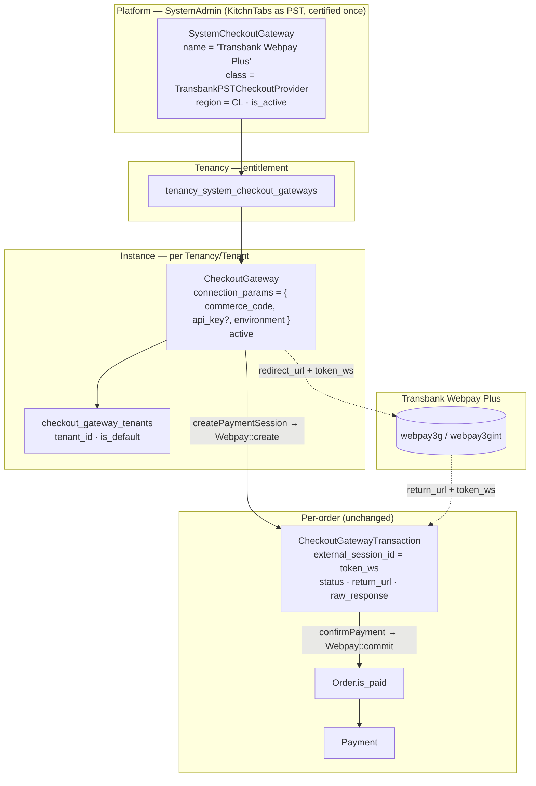
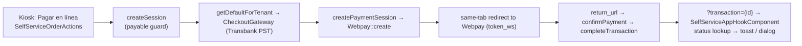
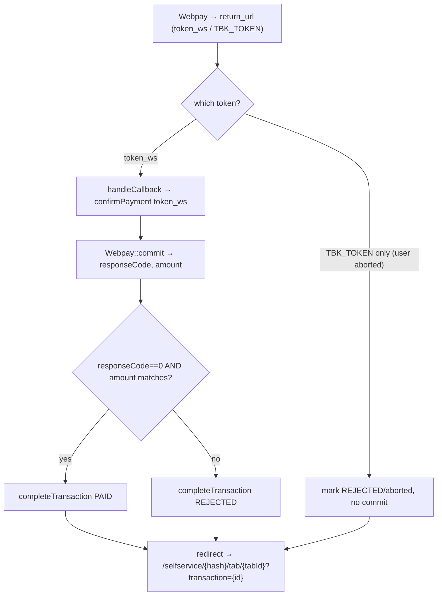

# KitchnTabs Checkout Gateway — Transbank Webpay Plus (PST) Integration

> **Version:** 0.2 (outline / technical requirement plan — key decisions locked)
> **Status:** Proposed — not yet implemented. Branch: `feature/transbank-pst`.
> **Audience:** Backend & Frontend engineers.
>
> **v0.2 decisions (locked):**
> 1. **Webpay Plus REST** (SDK 5.x via `laragear/transbank`), **not** the legacy SOAP Webservices.
> 2. **Single Webpay Plus per tenant** (not Webpay Plus Mall) — self-service orders are single-tenant.
> 3. **Credential model:** the **tenant enters only their commerce code** (12-digit production code).
>    The Webpay REST **API key + production credentials live with the PST (platform), configured once** —
>    never per-tenant. A per-instance **test/sandbox mode** is available now for development. This mirrors
>    the Jumpseller config UX (commerce code field + "Modo de Pruebas" toggle; no API-key field).
> 4. **Certification:** KitchnTabs certifies its checkout with Transbank **once** as a PST to obtain the
>    production REST credentials; **sandbox/integration works today** with Transbank's shared test
>    credentials (no certification needed to build & test).
> **Builds on:** [FEAT-SYSTEM-CHECKOUT-GATEWAYS.md](./FEAT-SYSTEM-CHECKOUT-GATEWAYS.md) (the generic CGP
> contract + three-tier model, already implemented and proven end-to-end by the **DashTest** demo
> provider) and the self-service feature
> (`kitchntabs-frontend/docs/SELFSERVICE_FEATURE.md`, `…/CHECKOUT_GATEWAYS_FEATURE.md`).

> **Goal:** let KitchnTabs tenants configure and use **Transbank Webpay Plus** as a checkout provider
> in the self-service module, following the generic gateway contract and multi-tenant architecture —
> by integrating KitchnTabs as a **PST (Proveedor de Servicios Transaccionales)**, exactly as
> Jumpseller does (`https://jumpseller.cl/support/webpay/`).

---

## Table of Contents

1. [What "PST" Means and Why It Fits Us](#1-what-pst-means-and-why-it-fits-us)
2. [How It Maps onto the Existing CGP Architecture](#2-how-it-maps-onto-the-existing-cgp-architecture)
3. [The Webpay Plus Transaction Flow](#3-the-webpay-plus-transaction-flow)
4. [Multi-Tenant Credentials — the Central Decision](#4-multi-tenant-credentials--the-central-decision)
5. [Provider Class — `TransbankPSTCheckoutProvider`](#5-provider-class--transbankpstcheckoutprovider)
6. [Connection Params (per-tenant credentials)](#6-connection-params-per-tenant-credentials)
7. [Self-Service Integration (reuse, near-zero new code)](#7-self-service-integration-reuse-near-zero-new-code)
8. [Return / Callback Handling (`token_ws`)](#8-return--callback-handling-token_ws)
9. [Transaction State Mapping](#9-transaction-state-mapping)
10. [Environments, Test Cards & Certification](#10-environments-test-cards--certification)
11. [Comparison with Jumpseller's Integration](#11-comparison-with-jumpsellers-integration)
12. [File-by-File Change List](#12-file-by-file-change-list)
13. [Open Decisions](#13-open-decisions)
14. [Phased Rollout & Certification Plan](#14-phased-rollout--certification-plan)
15. [Testing Plan](#15-testing-plan)
16. [Sources](#16-sources)

---

## 1. What "PST" Means and Why It Fits Us

**PST = Proveedor de Servicios Transaccionales** — a Transbank-certified technology provider whose
**single platform integration is certified once**, after which any merchant can use Webpay simply by
entering their **8-digit código de comercio**; they *inherit* the platform's certification and skip
the per-merchant certification (the 7 test transactions). Jumpseller is exactly this (its "Mall Code"
is `32889344`; merchants enable Webpay by entering their commerce code and checking **"Modo Webpay
Webservices PST"**).

This is the ideal model for a **multi-tenant SaaS** like KitchnTabs:

- **KitchnTabs** registers/certifies **once** with Transbank as a PST (the platform-level provider).
- **Each tenant** configures only their own commerce code (and, for REST, their API key) in their
  `CheckoutGateway` instance.
- No tenant has to run their own Transbank certification — they go live immediately under KitchnTabs's
  certified integration.

> **Contrast — "Webpay Webservices Normal":** each merchant must perform 7 documented test
> transactions and be certified by Transbank before going live. We explicitly **do not** want this for
> per-tenant onboarding; PST is the whole point.

---

## 2. How It Maps onto the Existing CGP Architecture

The generic three-tier model from FEAT-SYSTEM-CHECKOUT-GATEWAYS.md already expresses this perfectly —
Transbank PST is just a **new provider class** plugged into the existing contract; **no schema or
flow changes** are required.



**Reused unchanged:** `SystemCheckoutGateway`, `CheckoutGateway`, `CheckoutGatewayTenant`
(`getDefaultForTenant`), `CheckoutGatewayTransaction`, the `CheckoutGateway` contract,
`AbstractCheckoutGatewayProvider::completeTransaction()` settlement tail, `SelfServiceCheckoutController`
(`createSession` + `transactionStatus`), the kiosk `SelfServiceOrderActions` / `SelfServiceAppHookComponent`
return handling, and the payable-state + paid-lock rules.

**New:** one provider class, one `SystemCheckoutGateway` seed row, a return-URL web route that maps
`token_ws → confirmPayment`, and per-tenant credential config.

---

## 3. The Webpay Plus Transaction Flow

Webpay Plus is a **redirect / return-URL-confirmed** gateway (`supports_webhooks = false`,
`requires_redirect = true`) — the *same shape* as DashTest, so it slots into the proven path.

```mermaid
sequenceDiagram
    autonumber
    participant Cust as Customer (kiosk)
    participant API as SelfServiceCheckoutController
    participant Prov as TransbankPSTCheckoutProvider
    participant TBK as Transbank Webpay
    participant Ret as CheckoutWebController (return)
    participant Tail as completeTransaction

    Cust->>API: POST /selfservice/{hash}/checkout/session { order_id=tabId, amount }
    API->>API: payable-state guard + resolve default gateway (Transbank PST)
    API->>Prov: createPaymentSession(orderData)
    Prov->>TBK: Webpay::create(buyOrder, amount, returnUrl)   // tenant commerce code
    TBK-->>Prov: { token, url }
    Prov->>Prov: persist txn (pending), external_session_id = token
    Prov-->>API: redirect_url = url + "?token_ws=" + token
    API-->>Cust: { redirect_url }
    Cust->>TBK: SAME-TAB navigate to Webpay hosted page (enters card)
    TBK->>Ret: redirect browser to return_url (POST/GET token_ws)
    Ret->>Prov: handleCallback(request) → token_ws ; confirmPayment(token_ws)
    Prov->>TBK: Webpay::commit(token_ws)
    TBK-->>Prov: { responseCode, authorizationCode, amount, cardDetail, ... }
    Prov->>Prov: validate responseCode === 0 AND amount matches
    Prov->>Tail: completeTransaction(txn, paid|rejected, raw)
    Tail->>Tail: (paid) order.is_paid=true · Payment · tab→CONFIRMED · notify staff/kiosk
    Ret-->>Cust: redirect → /selfservice/{hash}/tab/{tabId}?transaction={id}
```

The `Webpay::create / commit / refund` calls are **already proven** in
`dash-backend/app/Services/Payments/Transbank/TransbankPaymentGatewayService.php` (used today for
subscription billing). The new provider replicates that usage, differing only in **which credentials**
each call runs under (§4).

---

## 4. Credentials — Platform Key + Tenant Commerce Code

The credential split is the defining design point, and it is now **decided** (v0.2 decision 3):

- **The PST API key + production credentials are platform-level** — KitchnTabs holds **one** Webpay
  REST API key (obtained on certification), configured **once** (env / config), used for every tenant.
- **The tenant supplies only their commerce code** (12-digit production code, e.g. `597030470000`),
  stored in their `CheckoutGateway` instance's `connection_params`.
- **Sandbox/test mode** ignores the tenant's real code and uses Transbank's shared **integration**
  credentials, so development needs no certification and no real codes.

### Credential resolution per transaction

```mermaid
flowchart TD
    A[Transbank tx for tenant] --> B{instance test_mode<br/>OR APP not production?}
    B -- yes (sandbox) --> S["Options::forIntegration()<br/>commerce_code = 597055555532 (shared test)<br/>api_key = 579B…ECEB… (shared test)<br/>host = webpay3gint.transbank.cl"]
    B -- no (production) --> P["Options::forProduction(<br/>tenant.commerce_code,  ← from connection_params<br/>PST_API_KEY            ← platform config, one key<br/>)<br/>host = webpay3g.transbank.cl"]
    S --> T[new WebpayPlus\\Transaction(options)]
    P --> T
```

So the per-request `Options` is built from **platform config** (API key) + the **tenant's commerce
code** — never a per-tenant API key. This is the REST equivalent of Jumpseller's "Modo Webpay
Webservices PST": the platform's credential transacts on behalf of the tenant's commerce code.

### Implementation: per-request `Options` (no global state)

The core billing service uses the `laragear/transbank` **`Webpay` facade**, which reads a single
global commerce code/key from `config('transbank')` — unsuitable here. Instead the provider builds a
fresh `Transaction` from explicit `Options` each call (stateless, concurrency-safe, no global
mutation). `laragear/transbank` wraps the official `transbank/transbank-sdk`, so the underlying
classes are available.

```php
// Sketch — inside TransbankPSTCheckoutProvider
protected function tx(): \Transbank\Webpay\WebpayPlus\Transaction
{
    if ($this->isSandbox()) {
        // Shared Transbank integration credentials — tenant's real code is NOT used in sandbox.
        $options = \Transbank\Webpay\Options::forIntegration(
            config('checkout.transbank.integration_commerce_code'), // 597055555532
            config('checkout.transbank.integration_api_key')        // 579B…
        );
    } else {
        // Production: tenant's own commerce code + the PLATFORM (PST) api key.
        $options = \Transbank\Webpay\Options::forProduction(
            $this->param('commerce_code'),               // tenant's 12-digit code
            config('checkout.transbank.pst_api_key')     // platform PST key, configured once
        );
    }
    return new \Transbank\Webpay\WebpayPlus\Transaction($options);
}
```

> **⚠️ Verify during certification (§13.1):** Transbank must confirm that a PST's **REST** API key may
> transact for a tenant's own 12-digit commerce code under **single** Webpay Plus. Jumpseller's screen
> proves the model via the legacy **SOAP** "Webservices PST" mode; the REST-PST equivalent (one
> platform key ↔ many child commerce codes) needs explicit confirmation. If REST-single does not
> support it, the fallback that preserves the exact same tenant UX (commerce code only) is **Webpay
> Plus Mall REST** under the hood (KitchnTabs mall code + tenant child store codes). **Sandbox is
> unaffected either way** — it uses the shared integration code today.

---

## 5. Provider Class — `TransbankPSTCheckoutProvider`

`Domain\App\Services\ECommerce\Checkout\Transbank\TransbankPSTCheckoutProvider extends
AbstractCheckoutGatewayProvider` — implements the same contract DashTest does, so the settlement tail,
self-service controller, and kiosk all work without change.

| Contract method | Implementation |
|---|---|
| `getCapabilities()` | `['supports_webhooks' => false, 'requires_redirect' => true, 'supported_currencies' => ['CLP'], 'region' => 'CL', 'is_demo' => false]` |
| `getConnectionParamFormats()` | `commerce_code` (text) + `test_mode` / `auto_refund` toggles — **no API-key field** (the PST key is platform-level, §6). |
| `verifyCredentials()` | Structural check (non-empty `commerce_code`, valid 12-digit format); optionally a sandbox `create` smoke test. |
| `createPaymentSession($orderData)` | `tx()->create($buyOrder, $sessionId, $amount, $returnUrl)` → persist `external_session_id = token`, `redirect_url = url . '?token_ws=' . token`. `buyOrder` derived from the tab/order id (≤26 chars). |
| `getRedirectUrl($token)` | The stored `redirect_url` (`url . '?token_ws=' . token`). |
| `handleCallback($request)` | `['transaction_id' => $request->input('token_ws')]`. No gateway call yet (reusable from both return-URL and any future path). |
| `confirmPayment($token)` | `tx()->commit($token)`; success = `responseCode === 0`; **verify `amount` matches** the stored transaction; hand to `completeTransaction(txn, PAID|REJECTED, raw)`. |
| `handleWebhook()` | no-op (`return false`) — capability-gated off. |
| `refundPayment($token, $amount)` | `tx()->refund($token, $amount)`. |

Everything after `confirmPayment()` — `Order.is_paid`, the `Payment` row, tab `CREATED → CONFIRMED`,
and the staff/kiosk notification — is **already handled** by
`AbstractCheckoutGatewayProvider::completeTransaction()` (the Tab-resolution + Payment-column fixes
from the DashTest work apply unchanged).

---

## 6. Connection Params & Platform Credentials

### Per-tenant — `getConnectionParamFormats()` (the tenant's form)

Mirrors the Jumpseller "Webpay Plus" config screen — **the tenant enters only their commerce code**,
plus two toggles. **No API-key field.**

| Field | Type | Notes |
|---|---|---|
| `commerce_code` | text (required) | The tenant's **12-digit** Transbank production código de comercio (e.g. `597030470000`). The only credential the tenant provides. Ignored while `test_mode` is on. |
| `test_mode` | boolean (default **true** until certified) | "Modo de Pruebas" — routes through Transbank **integration** (shared test code + key + `webpay3gint`). Use the published test cards (VISA `4051 8856 0044 6623` approves; Mastercard `5186 0595 5959 0568` rejects; CVV `123`, exp `01/2018`, RUT `11.111.111-1`, clave `123`). |
| `auto_refund` | boolean (optional) | "Reembolso automático" — auto-refund cancelled/voided paid orders via `Webpay::refund` (credit/debit only). Off by default; only meaningful once `refundPayment` is wired (§13.5). |

Stored in `checkout_gateways.connection_params` (JSON). A tenant's instance carries **no secret** — it
is just a commerce code + flags, which is why the form has no API-key field.

### Platform-level (PST) — configured once, never per tenant

The Webpay REST API key (and any production credentials issued on certification) live at the platform
level, e.g. `config/checkout.php` fed from env:

| Config key | Source | Notes |
|---|---|---|
| `checkout.transbank.pst_api_key` | env (`TRANSBANK_PST_API_KEY`) | The platform's **production** Webpay Plus REST key, obtained when KitchnTabs certifies as a PST. |
| `checkout.transbank.integration_commerce_code` | constant / env | `597055555532` (Transbank shared integration code). |
| `checkout.transbank.integration_api_key` | constant / env | `579B532A7440BB0C9079DED94D31EA1615BACEB56610332264630D42D0A36B1C` (shared integration secret). |

> **Isolation:** these are **separate** from the core subscription-billing
> `TransbankPaymentGatewayService`'s `config('transbank')` — that pays *KitchnTabs* for subscriptions;
> this pays *the tenant's* customers' orders. Never share keys between the two.

---

## 7. Self-Service Integration (reuse, near-zero new code)

The guest payment entry point is **unchanged**. `SelfServiceCheckoutController::createSession`
already (a) guards the payable state, (b) resolves the tenant's default active gateway via
`CheckoutGatewayTenant::getDefaultForTenant`, and (c) calls `->service()->createPaymentSession()`.
Once a tenant's default `CheckoutGateway` is a Transbank PST instance, the kiosk "Pagar en línea"
button drives Webpay with no frontend change.



The only self-service-specific addition is the **return route** (§8): Webpay's `return_url` must hit a
handler that runs `handleCallback → confirmPayment` and then redirects back to
`/selfservice/{hash}/tab/{tabId}?transaction={id}` (the SPA the kiosk already listens to).

---

## 8. Return / Callback Handling (`token_ws`)

Webpay returns the browser to our `return_url` with `token_ws` (POST on success, or `TBK_TOKEN` on
user-abort). A web route (mirroring `CheckoutWebController::returnForSession` / the DashTest
`dashtestProcess`) handles it:



Notes:
- The web route must accept **POST** (Webpay posts `token_ws` on return) — add it to the CSRF
  `except` list, same as the DashTest `/checkout/dashtest/*/process` exception already added.
- Webpay's "timeout / user cancelled" return sends `TBK_TOKEN` (and no `token_ws`); treat as
  rejected/aborted without committing.
- **Always re-validate the committed `amount` against the stored transaction** before marking paid
  (Transbank security requirement; also guards tampering).

---

## 9. Transaction State Mapping

Map Transbank's `commit` result onto our `CheckoutGatewayTransaction` statuses; the settlement tail
does the rest.

| Transbank result | KitchnTabs `CheckoutGatewayTransaction.status` | Effect |
|---|---|---|
| `responseCode === 0` (authorized) + amount matches | `STATUS_PAID` | `order.is_paid=true`, `Payment` row, tab `CREATED → CONFIRMED`, notify |
| `responseCode !== 0` (declined) | `STATUS_REJECTED` | no settlement; kiosk shows failure dialog |
| `commit` throws / invalid token / amount mismatch | `STATUS_FAILED` | no settlement; logged |
| return with `TBK_TOKEN` only (aborted) | `STATUS_REJECTED` | no settlement |

```mermaid
stateDiagram-v2
    [*] --> pending : Webpay::create()
    pending --> paid : commit responseCode=0 & amount OK
    pending --> rejected : commit responseCode!=0 / user abort (TBK_TOKEN)
    pending --> failed : commit error / amount mismatch / invalid token
    paid --> refunded : refundPayment()
    paid --> [*]
    rejected --> [*]
    failed --> [*]
```

Persist `authorizationCode`, `paymentTypeCode`, `installmentsNumber`, `cardDetail.card_number`
(last 4), and the full raw response in `raw_response` / the `Payment.data` JSON.

---

## 10. Environments, Test Cards & Certification

| | Integration / Sandbox (`test_mode` on) | Production (`test_mode` off) |
|---|---|---|
| Host | `https://webpay3gint.transbank.cl` | `https://webpay3g.transbank.cl` |
| Commerce code | `597055555532` (shared test code — tenant's own code is **not** used) | the **tenant's** 12-digit production code (from `connection_params`) |
| API key | `579B532A7440BB0C9079DED94D31EA1615BACEB56610332264630D42D0A36B1C` (shared) | the **platform PST** key (`config`, one key) |
| Options factory | `Options::forIntegration()` | `Options::forProduction()` |
| Certification needed | **No** — build & test today | Yes — platform certifies **once** as PST |

**Integration test cards** (from Transbank): a VISA that **approves** and a Mastercard that
**declines** (Transbank publishes the exact PANs/CVV/expiry on the "Cómo empezar" → test cards page;
to be pinned in the implementation README). KitchnTabs's existing **DashTest** provider already uses
the canonical Transbank PANs (`4051 8856 0044 6623` approves) as stand-ins, so QA muscle memory
carries over.

**Certification (PST path):** because KitchnTabs integrates as a PST, the **platform** completes
Transbank's validation once (transaction evidence, a ≥$50 production smoke transaction, monthly
vulnerability scans, HTTPS/TLS 1.2+). After that, onboarding a tenant is just: tenant obtains a
commerce code at `privado.transbank.cl` (Solicitar Productos → Venta Online → select the KitchnTabs
PST), and pastes it into their `CheckoutGateway` instance — **no per-tenant certification**.

---

## 11. Comparison with Jumpseller's Integration

| Aspect | Jumpseller | KitchnTabs (proposed) |
|---|---|---|
| Role | Certified Transbank **PST** (Mall Code `32889344`) | Certified Transbank **PST** (platform) |
| Merchant onboarding | Enter 8-digit commerce code; check "Modo Webpay Webservices PST"; **no test mode** for certified codes | Enter `commerce_code` in the `CheckoutGateway` instance; `environment=production` |
| Per-merchant certification | **None** (inherits Jumpseller's) | **None** (inherits KitchnTabs's) |
| Products | Credit, RedCompra (debit), prepaid, transfers | Webpay Plus (credit/debit/prepaid) via the tenant's code |
| Credentials stored | Commerce code (+ API key only if REST) | `commerce_code`, `api_key` (REST), `environment` per tenant |
| Flow | Redirect to Webpay → return → confirm | Identical (redirect → `token_ws` → `commit`) |
| Refunds | Optional toggle | `refundPayment()` (`Webpay::refund`) — stubbed until a refund UI exists |

The parallel is near-exact: Jumpseller validates our architectural choice. The main thing to confirm
with Transbank is whether the multi-tenant arrangement uses **per-tenant commerce codes under one PST
REST integration** (preferred) or the **Webpay Plus Mall** structure (KitchnTabs mall code + child
store codes) — see §13.2.

---

## 12. File-by-File Change List

### Domain (`kitchntabs-backend-domain`)
| File | Change |
|---|---|
| `app/Services/ECommerce/Checkout/Transbank/TransbankPSTCheckoutProvider.php` | **New** — the provider (§5). |
| `database/seeders/SystemCheckoutGatewaysSeeder.php` | Add the `Transbank Webpay Plus` catalog row (`class = TransbankPSTCheckoutProvider`, `region = CL`). |
| `app/Http/Controllers/Web/Checkout/CheckoutWebController.php` | Add a `transbankReturn` action (POST `token_ws` → `handleCallback` → `confirmPayment` → redirect to the kiosk tab). May generalise `returnForSession`. |
| `routes/web/checkout.php` | Add `POST /checkout/transbank/return/{hash}` (or reuse `return/{hash}`). |
| `composer.json` | Already has `laragear/transbank ^3.2` (core); confirm it (or the underlying `transbank/transbank-sdk`) is resolvable in the domain layer. |
| `config/checkout.php` | **New** platform-level config: `transbank.pst_api_key` (env), `transbank.integration_commerce_code`, `transbank.integration_api_key` (§6). Kept **separate** from core `config('transbank')`. |
| `.env` / deployment | Add `TRANSBANK_PST_API_KEY` (production, post-certification). Sandbox needs nothing. |

### Core (`dash-backend`)
| File | Change |
|---|---|
| `app/Http/Middleware/VerifyCsrfToken.php` | Add `/checkout/transbank/return/*` to `$except` (Webpay POSTs `token_ws`), mirroring the existing DashTest exception. |

### Frontend (`kitchntabs-frontend`)
| File | Change |
|---|---|
| — | **No new components.** The kiosk pay button, return handler, payable-state, and paid-lock are provider-agnostic and already work. Only copy/i18n (e.g. "Pagar con Webpay") and the admin credentials form labels may be touched. |

### Admin resources (`kitchntabs-system` / `apps/kitchntabs-web`)
| File | Change |
|---|---|
| Checkout gateway instance form | Render `getConnectionParamFormats()` for Transbank (commerce_code / api_key / environment) — already generic if the existing CGP admin resource reads the param formats from the provider. |

---

## 13. Open Decisions

**Decided (v0.2):**
- ✅ **REST**, not SOAP Webservices (decision 1).
- ✅ **Single Webpay Plus per tenant**, not Mall (decision 2).
- ✅ **Credential model:** tenant enters only the commerce code; platform holds the REST API key;
  sandbox uses shared integration credentials (decision 3, §4/§6).
- ✅ **Credential injection:** per-request `Options` built from platform key + tenant code (§4) — no
  global facade mutation.

**Still open / to confirm:**

1. **REST-PST delegation (the one real unknown).** Confirm with Transbank, during PST certification,
   that the platform's **REST** API key may authorize transactions for a tenant's own **12-digit**
   commerce code under **single** Webpay Plus. Jumpseller proves the model via legacy **SOAP**
   "Webservices PST"; the REST-single equivalent must be verified. If unsupported, fall back to
   **Webpay Plus Mall REST** under the hood (mall code + child store codes) — the tenant UX (commerce
   code only) and the provider abstraction are unchanged. **Sandbox is unaffected and can proceed now.**
2. **`buyOrder` derivation** — must be ≤26 chars and unique. Use a compact encoding of the tab/order
   id (e.g. last 26 chars of the UUID hex, or a ULID stored on the transaction) and keep the mapping
   in `CheckoutGatewayTransaction`.
3. **Refunds** — wire `refundPayment` now (cheap, `Webpay::refund`) so the per-instance "Reembolso
   automático" toggle is live, or defer until a refund UI exists (currently stubbed across CGP).
4. **Abort/timeout UX** — Webpay's `TBK_TOKEN`-only return (user cancelled / 10-min timeout) maps to
   the existing kiosk **failure dialog** ("pago rechazado o cancelado"); retry simply starts a new
   session (the order stays `CREATED`/unpaid and remains payable).

---

## 14. Phased Rollout & Certification Plan

1. **Provider + seed (sandbox).** Implement `TransbankPSTCheckoutProvider` against
   `webpay3gint.transbank.cl` with the shared integration code `597055555532`. Exercise the full
   create → redirect → commit → settle loop end-to-end (the DashTest flow already proves everything
   downstream of `confirmPayment`).
2. **Return route + CSRF exception.** Wire `POST /checkout/transbank/return/{hash}`; verify `token_ws`
   commit and `TBK_TOKEN` abort paths, and the redirect back to the kiosk tab with `?transaction={id}`.
3. **Per-tenant credentials.** Configure a real test tenant's `CheckoutGateway` instance; confirm
   `getDefaultForTenant` resolves it and the kiosk pays through the tenant's commerce code (Option A).
4. **PST certification (platform, once).** Complete Transbank's validation as a PST: transaction
   evidence, ≥$50 production smoke transaction, HTTPS/TLS 1.2+, monthly vulnerability scans. Obtain
   the production PST credentials.
5. **Tenant onboarding (production).** Tenant requests a commerce code at `privado.transbank.cl`
   (Venta Online → KitchnTabs PST), enters it, sets `environment=production`. No per-tenant
   certification.
6. **Pilot** with one real tenant; then enable for others via the existing entitlement/assign/default
   flow.

---

## 15. Testing Plan

- **Unit:** mock the SDK `Transaction` — `create` returns `{token,url}`; `commit` returns
  approved/declined/`responseCode` variants; assert the status mapping (§9) and the **amount-match**
  guard.
- **Feature:** reuse the CGP settlement-tail regression suite — `Order.is_paid` flips, a `Payment`
  row with `payment_type='transbank_webpay'` is created (correct columns: `source_order_id`,
  `tenant_id`, `currency_id`, `transaction_amount`, `total_paid_amount`, `data`), tab auto-confirms,
  and `handleStatusChange` fires exactly once.
- **Feature:** payable-state guard (`createSession`) and per-tenant default resolution unchanged from
  DashTest — re-run those.
- **Manual E2E (sandbox):** real Transbank integration cards (approve + decline), iOS Safari + Android
  Chrome, the abort/timeout (`TBK_TOKEN`) path, and the kiosk return (`?transaction` → toast/dialog).
- **Production smoke:** the ≥$50 certification transaction, then immediately refund if `refundPayment`
  is wired.

---

## 16. Sources

- Transbank — *Cómo empezar*: `https://www.transbankdevelopers.cl/documentacion/como_empezar`
  (products, environments `webpay3gint`/`webpay3g`, integration commerce codes/secret, SDKs incl.
  `transbank/transbank-sdk`, the create → redirect → `token_ws` → commit flow, result-page +
  security/HTTPS requirements).
- Jumpseller — *Webpay (Transbank)*: `https://jumpseller.cl/support/webpay/` (the PST model: commerce
  code only, "Modo Webpay Webservices PST", no per-merchant certification, settlement, troubleshooting).
- Existing in-repo precedent: `dash-backend/app/Services/Payments/Transbank/TransbankPaymentGatewayService.php`
  (`laragear/transbank` `Webpay::create/commit/refund`, `token_ws` redirect) — for subscription billing.
- [FEAT-SYSTEM-CHECKOUT-GATEWAYS.md](./FEAT-SYSTEM-CHECKOUT-GATEWAYS.md) and
  `kitchntabs-frontend/docs/{CHECKOUT_GATEWAYS_FEATURE,SELFSERVICE_FEATURE}.md` — the implemented CGP
  contract, settlement tail, and self-service flow this provider plugs into.
