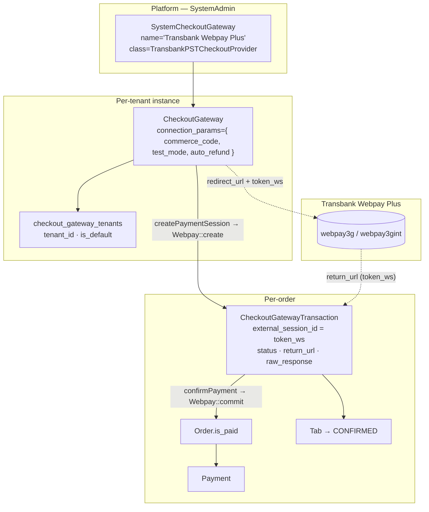
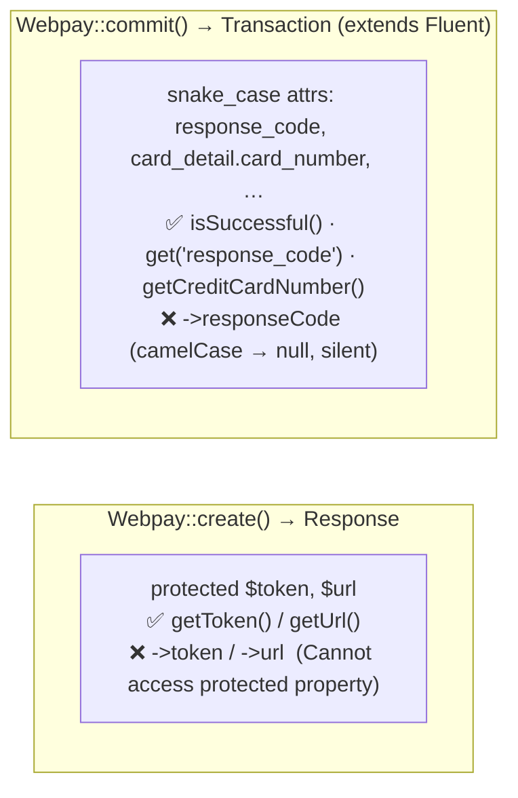
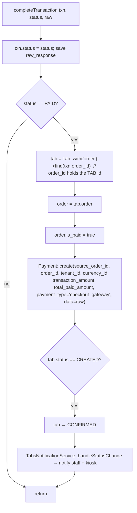
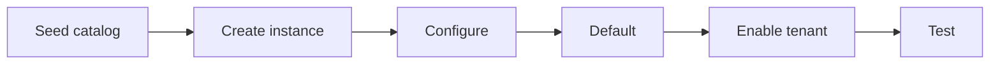

# KitchnTabs — Transbank Webpay Plus (PST) Integration — Full Technical Documentation

> **Scope:** the as-built Transbank Webpay Plus checkout integration — the provider, per-tenant
> credential model, the redirect/return (`token_ws`) flow, settlement, the gateway-selection screen,
> tenant settings, the admin config form, environments, and operations.
>
> **Status:** **Sandbox implemented & working** (transactions created against
> `webpay3gint.transbank.cl`). Production requires PST certification (see §13).
> **Audience:** backend & frontend engineers.
> **Last updated:** 2026-06-23 · Branch: `feature/transbank-pst`.
>
> **Companion docs:** [CHECKOUT_GATEWAYS_FEATURE.md](./CHECKOUT_GATEWAYS_FEATURE.md) (the generic CGP
> contract + settlement tail this plugs into) · [SELFSERVICE_FEATURE.md](./SELFSERVICE_FEATURE.md) ·
> the design spec `kitchntabs-github-io/docs/tech/features/checkout-gateways/FEAT-TRANSBANK-PST.md`.

---

## Table of Contents

1. [Overview](#1-overview)
2. [Where It Plugs Into the CGP Architecture](#2-where-it-plugs-into-the-cgp-architecture)
3. [File Map](#3-file-map)
4. [The PST Credential Model](#4-the-pst-credential-model)
5. [The laragear/transbank SDK — What You Must Know](#5-the-laragear-transbank-sdk--what-you-must-know)
6. [The Provider — `TransbankPSTCheckoutProvider`](#6-the-provider--transbankpstcheckoutprovider)
7. [End-to-End Payment Flow](#7-end-to-end-payment-flow)
8. [Return Handling (`token_ws` / `TBK_TOKEN`)](#8-return-handling-token_ws--tbk_token)
9. [Settlement Tail (`completeTransaction`)](#9-settlement-tail-completetransaction)
10. [Transaction State Mapping](#10-transaction-state-mapping)
11. [Gateway Selection (multiple gateways)](#11-gateway-selection-multiple-gateways)
12. [Tenant Settings & Admin Config Form](#12-tenant-settings--admin-config-form)
13. [Environments, Test Cards & Certification](#13-environments-test-cards--certification)
14. [Operations — Enabling Transbank for a Tenant](#14-operations--enabling-transbank-for-a-tenant)
15. [API & Route Reference](#15-api--route-reference)
16. [Known Gaps & Gotchas](#16-known-gaps--gotchas)

---

## 1. Overview

Transbank **Webpay Plus** lets a tenant's end customer pay for a self-service order online. KitchnTabs
integrates as a **PST (Proveedor de Servicios Transaccionales)** — the platform certifies once, and
each tenant supplies only their **commerce code** (this mirrors Jumpseller's "Modo Webpay Webservices
PST"). It is a **redirect / return-URL-confirmed** gateway — the same shape as the DashTest demo
provider — so it slots into the existing Checkout Gateway Providers (CGP) machinery with **one new
provider class** and a return route; everything downstream (mark paid, create `Payment`, auto-confirm
the tab, notify staff/kiosk) is **reused unchanged**.

| Aspect | Value |
|---|---|
| Provider class | `Domain\App\Services\ECommerce\Checkout\Transbank\TransbankPSTCheckoutProvider` |
| Product | Webpay Plus (single commerce code per tenant), REST, via `laragear/transbank` |
| Capabilities | `supports_webhooks=false`, `requires_redirect=true`, `supported_currencies=['CLP']`, `region='CL'`, `is_demo=false` |
| Confirmation | Return-URL (`token_ws`) → `Webpay::commit()` |
| Sandbox | `webpay3gint.transbank.cl` with shared integration credentials (no cert needed) |

---

## 2. Where It Plugs Into the CGP Architecture

Transbank is just a new **provider** behind the generic `CheckoutGateway` contract. No schema or flow
changes — the three-tier model (catalog → entitlement → instance), the per-order
`CheckoutGatewayTransaction`, and the settlement tail are all shared.



**Reused unchanged:** `AbstractCheckoutGatewayProvider::completeTransaction()`,
`SelfServiceCheckoutController`, the kiosk pay button / return handler, the payable-state + paid-lock
rules (see CHECKOUT_GATEWAYS_FEATURE.md). **New for Transbank:** the provider class, the
`/checkout/transbank/return/{hash}` web route + handler, `config/checkout.php`, and the CSRF
exception.

---

## 3. File Map

### Backend — domain (`kitchntabs-backend-domain/`)
| File | Role |
|---|---|
| `app/Services/ECommerce/Checkout/Transbank/TransbankPSTCheckoutProvider.php` | **The provider** (§6). |
| `app/Services/ECommerce/Checkout/AbstractCheckoutGatewayProvider.php` | Base + `completeTransaction()` settlement tail (§9). |
| `app/Services/ECommerce/Checkout/Contracts/CheckoutGateway.php` | The contract the provider implements. |
| `app/Models/Checkout/SystemCheckoutGateway.php` | `getAvailableClasses()` lists the provider (catalog gate). |
| `app/Models/Checkout/CheckoutGateway.php` | `service()` = `new $class($this)` (instantiates the provider). |
| `app/Models/Checkout/CheckoutGatewayTenant.php` | `getDefaultForTenant()`, `getEnabledForTenant()`. |
| `app/Models/Checkout/CheckoutGatewayTransaction.php` | Statuses `pending/authorized/paid/failed/rejected`. |
| `app/Http/Controllers/API/SelfService/SelfServiceCheckoutController.php` | `createSession`, `listGateways`, `transactionStatus`. |
| `app/Http/Controllers/Web/Checkout/CheckoutWebController.php` | `transbankReturn` (token_ws / TBK_TOKEN). |
| `routes/web/checkout.php` | `checkout.transbank.return` web route. |
| `routes/api/selfservice.php` | `checkout/session`, `checkout/gateways`, `checkout/transaction/{id}`. |
| `config/checkout_tenant.php` | Tenant checkout settings (enable, allow gateway selection). |
| `app/Providers/AppDomainServiceProvider.php` | `mergeDomainTenantSettings()` merges the config above. |
| `app/Http/Controllers/API/SelfService/Traits/SelfServiceAuthResponseTrait.php` | Exposes flags to the guest session. |
| `database/seeders/Checkout/SystemCheckoutGatewaysSeeder.php` | Seeds the catalog row. |

### Backend — core (`dash-backend/`)
| File | Role |
|---|---|
| `config/checkout.php` | Platform PST api key (`TRANSBANK_PST_API_KEY`) + integration fallbacks. |
| `app/Http/Middleware/VerifyCsrfToken.php` | Excepts `/checkout/transbank/return/*`. |
| `composer.json` | `laragear/transbank` (installed **v3.5.1**) — the SDK. |
| `vendor/laragear/transbank/…` | `Facades/Webpay`, `Services/Webpay`, `Transbank`, `Http/Client`, `Services/Transactions/{Response,Transaction,DynamicallyAccess}`. |

### Frontend (`kitchntabs-frontend/apps/kitchntabs-app/src/`)
| File | Role |
|---|---|
| `kt-kiosk/hooks/useSelfServiceCheckout.tsx` | Pay flow: fetch gateways → pay or show selection → redirect. |
| `kt-kiosk/components/CheckoutGatewayDialog.tsx` | The gateway-selection screen. |
| `kt-kiosk/components/SelfServiceOrderActions.tsx` | Order-card "Pagar" → `startPayment`. |
| `kt-kiosk/components/MallClientTabsList.tsx` | Order-list "Pagar" → `startPayment`. |
| `kt-selfservice/contexts/SelfServiceAppHookComponent.tsx` | Return handler (`?transaction={id}` → status → toast/dialog). |
| `packages/kt-ecommerce/src/components/Checkout/CheckoutGatewayConfiguration.tsx` | Admin instance config (commerce_code + switches). |

---

## 4. The PST Credential Model

**The tenant provides only their commerce code.** The Webpay REST API key is **platform-level** (the
PST), configured once. Sandbox ignores the tenant code entirely and uses Transbank's shared
integration credentials — so development needs no certification.

```mermaid
flowchart TD
    A["TransbankPSTCheckoutProvider::resolveCredentials()"] --> B{instance test_mode?<br/>(default true)}
    B -- "yes (sandbox)" --> S["environment = integration<br/>commerce code = 597055555532  (Webpay::INTEGRATION_KEY)<br/>api key = 579B…  (Transbank::INTEGRATION_SECRET)"]
    B -- "no (production)" --> P["environment = production<br/>commerce code = instance.connection_params.commerce_code  (tenant's 12-digit)<br/>api key = config('checkout.transbank.pst_api_key')  (platform PST key)"]
```

| Source | Sandbox (`test_mode` on) | Production (`test_mode` off) |
|---|---|---|
| Host | `webpay3gint.transbank.cl` | `webpay3g.transbank.cl` |
| Commerce code | `597055555532` (shared — tenant's code **not** used) | tenant's 12-digit code (`connection_params.commerce_code`) |
| API key | `579B532A…` (shared) | platform PST key (`config/checkout.php`) |

- Per-tenant data lives on `CheckoutGateway.connection_params` (`commerce_code`, `test_mode`,
  `auto_refund`) — **no secret stored per tenant**.
- Platform credentials live in `dash-backend/config/checkout.php`
  (`transbank.pst_api_key` ← `TRANSBANK_PST_API_KEY`), **separate** from the core
  subscription-billing `config('transbank')`.

---

## 5. The laragear/transbank SDK — What You Must Know

`laragear/transbank` is its **own** implementation (there is **no** `transbank/transbank-sdk`
package). Two facts drove the implementation:

**(a) Credentials are read live from config.** `Laragear\Transbank\Http\Client` reads
`transbank.environment` and `transbank.credentials.webpay.{key,secret}` from config **at request
time**, and the service is bound fresh per resolve. There is no public per-call credential API — so
multi-tenant credentials are achieved by **scoping those config keys around each call** (see
`runWebpay()` in §6). Safe within a single checkout request (one customer, one payment).

**(b) Result objects don't expose data as plain properties.** This caused the first runtime bug:



- `Webpay::create()` returns a `Response` with **protected** `$token`/`$url` → use **`getToken()` /
  `getUrl()`**.
- `Webpay::commit()` returns a `Transaction` (a `Fluent`) whose attributes are **snake_case**
  (`response_code`, `card_detail`, `authorization_code`, `installments_number`, `payment_type_code`).
  `->responseCode` (camelCase) silently returns `null`. Use **`isSuccessful()`** (checks
  `response_code === 0` + an authorized status, and bails on TBK-abort data) and
  **`get('snake_key')`** / **`getCreditCardNumber()`**.

> ⚠️ The core `dash-backend/app/Services/Payments/Transbank/TransbankPaymentGatewayService.php` has
> the same latent `->token` / `->responseCode` bug; it just isn't exercised on that path. Out of
> scope here, but flagged.

---

## 6. The Provider — `TransbankPSTCheckoutProvider`

Extends `AbstractCheckoutGatewayProvider`, so the settlement tail + self-service controller + kiosk
work without change. Contract methods mapped to laragear:

| Contract method | Implementation |
|---|---|
| `getCapabilities()` | redirect-only, CLP, CL, not demo (§1). |
| `getConnectionParamFormats()` | `commerce_code` (text), `test_mode` (boolean, default **true**), `auto_refund` (boolean). |
| `verifyCredentials()` | sandbox → always true; production → `commerce_code` matches `/^\d{8,12}$/`. |
| `createPaymentSession($orderData)` | `Webpay::create($buyOrder, $amount, $webpayReturnUrl)`; persist `external_session_id = getToken()`, `redirect_url = getUrl().'?token_ws='.token`. `$webpayReturnUrl = route('checkout.transbank.return', ['hash' => session_hash])`. |
| `getRedirectUrl($token)` | the stored `redirect_url`. |
| `handleCallback($request)` | `['transaction_id' => token_ws ?? TBK_TOKEN]`. |
| `confirmPayment($token)` | `Webpay::commit($token)`; `approved = isSuccessful() && amountMatches`; → `completeTransaction(PAID|REJECTED)`. Errors → `FAILED`. |
| `refundPayment($token)` | `Webpay::refund($token, $amount)`. |

**Per-tenant credential scoping** (the crux):

```php
protected function runWebpay(callable $fn)
{
    $config   = app('config');
    $original = [ /* environment, credentials.webpay.key, credentials.webpay.secret */ ];
    [$env, $key, $secret] = $this->resolveCredentials();   // sandbox constants OR tenant code + PST key
    $config->set('transbank.environment', $env);
    $config->set('transbank.credentials.webpay.key', $key);
    $config->set('transbank.credentials.webpay.secret', $secret);
    try   { return $fn(); }                                  // e.g. Webpay::create(...) / Webpay::commit(...)
    finally { /* restore original config */ }
}
```

**`buyOrder`** must be ≤26 chars & unique → `substr('kt'.str_replace('-', '', $transaction->id), 0, 26)`.

---

## 7. End-to-End Payment Flow

```mermaid
sequenceDiagram
    autonumber
    participant Cust as Customer (kiosk)
    participant Hook as useSelfServiceCheckout
    participant API as SelfServiceCheckoutController
    participant Prov as TransbankPSTCheckoutProvider
    participant TBK as Webpay (webpay3gint)
    participant Ret as CheckoutWebController::transbankReturn
    participant Tail as completeTransaction

    Cust->>Hook: tap "Pagar"
    Hook->>API: GET /checkout/gateways  (decide skip vs select)
    Hook->>API: POST /checkout/session { order_id=tabId, amount, return_url, checkout_gateway_id? }
    API->>API: payable-state guard + resolve gateway (selected or default)
    API->>Prov: createPaymentSession(orderData)
    Prov->>Prov: runWebpay(): set tenant/sandbox config
    Prov->>TBK: Webpay::create(buyOrder, amount, returnUrl=/checkout/transbank/return/{hash})
    TBK-->>Prov: Response { token, url }
    Prov->>Prov: persist txn (external_session_id=token); redirect_url = url + "?token_ws=" + token
    Prov-->>API: { redirect_url }
    API-->>Hook: { redirect_url }
    Hook->>TBK: SAME-TAB navigate → Webpay hosted card page
    Cust->>TBK: enter card (e.g. VISA 4051 8856 0044 6623)
    TBK->>Ret: POST return_url  (token_ws)
    Ret->>Prov: confirmPayment(token_ws)
    Prov->>TBK: Webpay::commit(token_ws)
    TBK-->>Prov: Transaction { response_code, amount, authorization_code, card_detail, … }
    Prov->>Prov: approved = isSuccessful() && amount matches
    Prov->>Tail: completeTransaction(txn, PAID|REJECTED, raw)
    Tail->>Tail: (PAID) order.is_paid=true · Payment · tab→CONFIRMED · notify staff+kiosk
    Ret-->>Cust: redirect → /selfservice/{hash}/tab/{tabId}?transaction={id}
    Cust->>Hook: SelfServiceAppHookComponent reads ?transaction → status → toast/dialog
```

**Real sandbox log excerpt (working):**
```
Creating transaction { buy_order: "kt019ef6b9a9107198bfc5c0c2", amount: 14980,
  return_url: ".../checkout/transbank/return/XQLXR" }
Response received { token: "01ab884a…", url: "https://webpay3gint.transbank.cl/webpayserver/initTransaction" }
```

---

## 8. Return Handling (`token_ws` / `TBK_TOKEN`)

Webpay returns the browser to `return_url` = `/checkout/transbank/return/{hash}` (POST). The
`transbankReturn` controller resolves the transaction by token (= `external_session_id`), settles,
and bounces back to the kiosk SPA.

```mermaid
flowchart TD
    A["POST /checkout/transbank/return/{hash}"] --> B{which param?}
    B -- "token_ws (paid attempt)" --> C[find txn by external_session_id = token_ws]
    C --> D["service()->confirmPayment(token_ws) → Webpay::commit + completeTransaction"]
    B -- "TBK_TOKEN only (user aborted / timeout)" --> E[find txn by external_session_id = TBK_TOKEN]
    E --> F[txn.status = REJECTED  (no commit)]
    D --> G["redirect → transaction.return_url + ?transaction={id}"]
    F --> G
    G --> H["kiosk SPA: SelfServiceAppHookComponent<br/>→ GET checkout/transaction/{id} → success toast / failure dialog"]
```

Notes:
- The route is **CSRF-excepted** (`/checkout/transbank/return/*`) — Webpay POSTs cross-site with no
  session cookie. Route accepts **GET|POST**.
- `transaction.return_url` is the frontend-supplied kiosk tab-detail URL (stored at
  `createPaymentSession` via `SelfServiceCheckoutController`); Webpay's own `returnUrl` is our web
  route, **not** the SPA.
- Abort/timeout (`TBK_TOKEN`) → `REJECTED`; the order stays `CREATED`/unpaid and remains payable
  (retry just starts a new session).

---

## 9. Settlement Tail (`completeTransaction`)

Identical to the DashTest path — `AbstractCheckoutGatewayProvider::completeTransaction()` does
everything after `confirmPayment` returns PAID:



> Reminder: `CheckoutGatewayTransaction.order_id` carries the **Tab id** (the kiosk sends
> `record.id`, a Tab). The tail resolves `Tab::with('order')` then `$tab->order`.

---

## 10. Transaction State Mapping

| Transbank commit result | `CheckoutGatewayTransaction.status` | Effect |
|---|---|---|
| `isSuccessful()` true **and** amount matches | `STATUS_PAID` | order paid · Payment · tab CONFIRMED · notify |
| `isSuccessful()` false (declined) | `STATUS_REJECTED` | no settlement; kiosk shows failure dialog |
| commit throws / amount mismatch | `STATUS_FAILED` | no settlement; logged |
| return with `TBK_TOKEN` only (aborted) | `STATUS_REJECTED` | no settlement |

```mermaid
stateDiagram-v2
    [*] --> pending : Webpay::create()
    pending --> paid : commit isSuccessful() & amount OK
    pending --> rejected : commit declined / user abort (TBK_TOKEN)
    pending --> failed : commit error / amount mismatch
    paid --> [*]
    rejected --> [*]
    failed --> [*]
    note right of paid
        Order.is_paid=true · Payment row
        Tab CREATED → CONFIRMED · staff notified
    end note
```

Persisted in `raw_response` / `Payment.data`: `response_code`, `authorization_code`, `amount`,
`status`, `payment_type_code`, `installments_number`, card last-4 (`getCreditCardNumber()`),
`amount_match`.

---

## 11. Gateway Selection (multiple gateways)

Because a tenant can now enable **DashTest and Transbank** (and future providers), the kiosk shows a
selection screen when more than one is enabled. Shared logic lives in `useSelfServiceCheckout`.

```mermaid
flowchart TD
    A[startPayment orderId, amount] --> B[GET /checkout/gateways  (active, default first)]
    B --> C{count}
    C -- "0 or 1, or allow_gateway_selection = false" --> D["createSession (gateway_id = single id or none → backend default)"]
    C -- "2+ and selection allowed" --> E[open CheckoutGatewayDialog  (default first + chip)]
    E --> F[user taps a gateway]
    F --> G["createSession (checkout_gateway_id = chosen)"]
    D --> H[same-tab redirect to gateway]
    G --> H
```

- **Backend:** `CheckoutGatewayTenant::getEnabledForTenant()` (default first); `listGateways`
  endpoint; `createSession` validates `checkout_gateway_id` is active + assigned to the tenant, else
  falls back to the default.
- **Frontend:** `CheckoutGatewayDialog.tsx` (cards, default highlighted with "Predeterminado"),
  wired via `useSelfServiceCheckout` into both the card and list pay buttons.
- **Tenant toggle:** `selfservice_allow_gateway_selection` (default on). When off, the default
  gateway is always used even with several enabled.

---

## 12. Tenant Settings & Admin Config Form

### Tenant-level settings (`config/checkout_tenant.php`)
Merged into `config('tenants.setting_formats')` by `AppDomainServiceProvider::mergeDomainTenantSettings()`
(which now merges a **list** of domain config files), auto-rendered in the Tenant settings UI.

| Setting | Default | Effect |
|---|---|---|
| `enable_self_service_checkout_gateway` | false | Enables online payment (+ requires an active default gateway). |
| `selfservice_allow_gateway_selection` | true | Show the selection screen when >1 gateway; off → always default. |

Surfaced to the guest in `SelfServiceAuthResponseTrait` → `systemValues.selfservice`:
`checkout_gateway_enabled`, `checkout_gateway_available`, `allow_gateway_selection`.

### Per-instance config form (`CheckoutGatewayConfiguration.tsx`)
Renders the provider's `getConnectionParamFormats()` **by type** — `boolean → Switch`, `select`,
`number`, `textarea`, `color`, `password`, `text` — with required + helper text (this replaced a
bespoke text-only renderer; the `boolean` types now show as switches). For Transbank the tenant sees:
**Código de comercio**, **Modo de pruebas (sandbox)** (switch, default on), **Reembolso automático**
(switch). Saved via `setUpConnection`; activated by **Guardar y verificar** (sandbox
`verifyCredentials()` returns true); promoted via **Usar como predeterminada**.

---

## 13. Environments, Test Cards & Certification

| | Integration / Sandbox (`test_mode` on) | Production (`test_mode` off) |
|---|---|---|
| Host | `https://webpay3gint.transbank.cl` | `https://webpay3g.transbank.cl` |
| Commerce code | `597055555532` (shared) | tenant's 12-digit code |
| API key | `579B532A…` (shared) | platform PST key (`TRANSBANK_PST_API_KEY`) |
| Certification | **none** | platform certifies **once** as PST |

**Integration test cards** (from Transbank): VISA **`4051 8856 0044 6623`** → **approved**;
Mastercard **`5186 0595 5959 0568`** → **rejected**; CVV `123`, exp any future, RUT `11.111.111-1`,
clave `123`.

**Certification (PST):** the **platform** completes Transbank's validation once (transaction
evidence, a ≥$50 production smoke transaction, HTTPS/TLS 1.2+, monthly vulnerability scans) → obtains
the production REST key. After that, onboarding a tenant is just: get a commerce code at
`privado.transbank.cl` (Venta Online → KitchnTabs PST), paste it, turn **Modo de pruebas** off.

---

## 14. Operations — Enabling Transbank for a Tenant



1. **Seed the catalog row** (idempotent):
   `php artisan db:seed --class="Domain\Database\Seeders\Checkout\SystemCheckoutGatewaysSeeder"`
   → creates the "Transbank Webpay Plus" `SystemCheckoutGateway`.
2. **Create an instance** (admin: Checkout Gateways → +): pick "Transbank Webpay Plus", assign the
   tenant (e.g. PinoyWok).
3. **Configure** (instance config form): leave **Modo de pruebas** on for sandbox → **Guardar y
   verificar** (instance flips to **Activa**).
4. **Usar como predeterminada** (so `getDefaultForTenant` resolves it).
5. **Enable tenant setting** `enable_self_service_checkout_gateway` (Tenant settings).
6. **Test** in the kiosk: create order → **Pagar** → (selection screen if DashTest also enabled) →
   Transbank Webpay integration page → pay with the VISA test card → settles and returns to the tab.

---

## 15. API & Route Reference

### Public JSON (guest, self-service) — `/api/public/selfservice/{hash}`
| Method | Path | Description |
|---|---|---|
| GET | `/checkout/gateways` | Enabled gateways for the tenant, default first. |
| POST | `/checkout/session` | Start payment. Body `{ order_id (=tab id), amount, return_url, checkout_gateway_id? }`. Returns `{ redirect_url, transaction_id, provider }`. |
| GET | `/checkout/transaction/{id}` | Outcome lookup `{ status, is_paid, tab_status, … }` for the return dialog. |

### Public web (Blade/redirect) — `/checkout`
| Method | Path | Description |
|---|---|---|
| GET\|POST | `/checkout/transbank/return/{hash}` | Webpay return target; `token_ws` → commit + settle, `TBK_TOKEN` → reject; redirects to the kiosk tab. **CSRF-excepted.** |

### Admin — `/api/checkout`
CRUD for `system_checkout_gateway` / `checkout_gateway`, `connectionParamFormats`, `setUpConnection`,
`setAsDefault`, assign-tenants (see CHECKOUT_GATEWAYS_FEATURE.md §13).

---

## 16. Known Gaps & Gotchas

**Resolved gotchas (documented for posterity):**
- `Response::$token/$url` are protected → use `getToken()`/`getUrl()` (was the first runtime crash).
- `Transaction` (Fluent) attrs are snake_case → use `isSuccessful()` + `get('response_code')`;
  `->responseCode` returns `null` silently.
- laragear reads credentials live from config → multi-tenant via scoped config override (`runWebpay`).
- `transaction.order_id` is a **Tab id**, not an Order id → resolve `Tab::with('order')`.

**Open / pending:**
- **Production REST-PST delegation:** confirm with Transbank that the platform's REST API key may
  transact for a tenant's own commerce code under single Webpay Plus (Jumpseller proves it via the
  legacy SOAP "Webservices PST"). Fallback that preserves the same tenant UX: **Webpay Plus Mall
  REST** (mall code + child store codes). Sandbox is unaffected. (Spec §13.1.)
- **Refunds:** `refundPayment` is wired (`Webpay::refund`) but no refund UI / the `auto_refund`
  toggle isn't acted on yet.
- **Core service latent bug:** `TransbankPaymentGatewayService` (subscription billing) uses the same
  wrong `->token`/`->responseCode` accessors — fix when that path is next touched.
- **i18n:** kiosk/admin strings use inline `_` fallbacks (`mall.select_payment_method`,
  `mall.default_gateway`, …) — add to `i18n/es|en`.

---

## Related Documentation

- [CHECKOUT_GATEWAYS_FEATURE.md](./CHECKOUT_GATEWAYS_FEATURE.md) — generic CGP contract, settlement tail, DashTest.
- [SELFSERVICE_FEATURE.md](./SELFSERVICE_FEATURE.md) — the consuming kiosk feature.
- `kitchntabs-github-io/docs/tech/features/checkout-gateways/FEAT-TRANSBANK-PST.md` — the design spec (v0.2) + Webpay/Mercado-Pago target.
