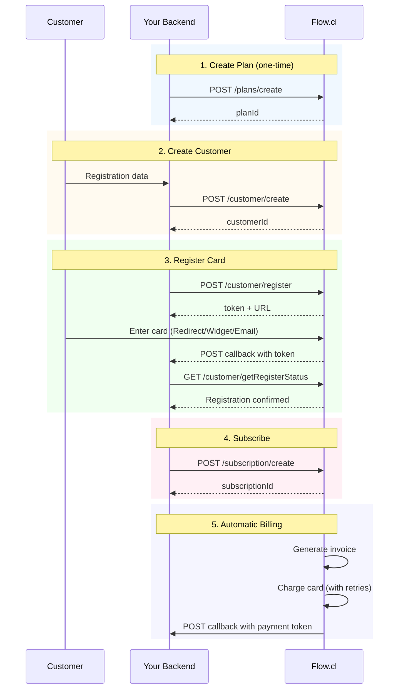

# Flow.cl Payment Gateway Integration

Flow.cl is Chile's leading payment gateway, supporting Chile, Peru, and Mexico with card payments, bank transfers, and local payment methods.

## Overview

| Property | Value |
|----------|-------|
| Identifier | `flow` |
| Display Name | Flow.cl (Chile) |
| Currencies | CLP, PEN, MXN |
| Countries | CL, PE, MX |
| Card Registration | Redirect / Widget / Email |
| Webhook Type | Token-based POST |
| API Authentication | HMAC-SHA256 signed parameters |

---

## KitchnTabs Billing Policy

### Design Principle

**"No value delivered without payment first"** (except 30-day internal free trial).

This baseline policy is implemented because Flow does not support automatic proration. It prioritizes:
- ✅ Revenue protection (no leakage)
- ✅ Simplified accounting logic
- ✅ Avoiding complex intermediate states
- ✅ Clear, predictable customer experience

### Upgrade Policy (Immediate)

**When a customer upgrades their plan:**

1. **Immediate plan change** in Flow (or new subscription creation)
2. **Full charge generated immediately** for the new plan amount
3. **Upon payment confirmation:**
   - New features are activated immediately
   - Next billing cycle continues normally
4. **Previously paid period:**
   - ❌ Not discounted from the charge
   - ❌ Not refunded
   - ✅ Considered "consumed" by the upgrade

**Example:**
```
User has Basic Plan ($29/month, paid until Feb 28)
User upgrades to Premium Plan ($99/month) on Feb 10

→ Charge immediately: $99 (full amount)
→ Features activated: Immediately
→ Next billing: March 10 ($99)
→ Feb 10-28 period: No credit, no refund
```

📌 **This is standard SaaS practice** for early-stage products and widely accepted when communicated clearly.

### Downgrade Policy (Deferred)

**When a customer downgrades their plan:**

1. **Register downgrade as pending** in local database
2. **No changes in Flow** payment gateway yet
3. **Continue current plan features** until period end
4. **At end of billing period:**
   - Change plan in Flow
   - Update feature enablement
   - Next charge reflects new (lower) price

**Example:**
```
User has Premium Plan ($99/month, paid until March 10)
User requests downgrade to Basic Plan ($29/month) on Feb 15

→ Immediate: Register as "pending_downgrade"
→ Feb 15 - March 10: Premium features still active
→ March 10: Switch to Basic plan in Flow
→ Next billing: March 10 ($29)
```

**No refunds, no calculations, no edge cases.**

### Technical Implementation

```php
// Upgrade: Immediate, full charge
$service->upgrade($subscription, $newPlan);
// → Sync to Flow immediately
// → Generate full charge
// → Activate features on payment

// Downgrade: Deferred to period end  
$service->downgrade($subscription, $newPlan);
// → Validate usage fits new limits
// → Mark as pending_downgrade
// → Apply at current_period_end
```

---

## Configuration

### Environment Variables

```env
# API Configuration
FLOW_API_URL=https://www.flow.cl/api
FLOW_API_KEY=your_api_key_here
FLOW_SECRET_KEY=your_secret_key_here
FLOW_ENVIRONMENT=sandbox  # sandbox or production

# Card Registration Method
# Options: redirect, widget, email
FLOW_CARD_REGISTRATION_METHOD=redirect

# Defaults
FLOW_DEFAULT_CURRENCY=CLP
FLOW_DEFAULT_COUNTRY=CL
```

### Config File

Location: `config/flow.php`

```php
return [
    'api_url' => env('FLOW_API_URL', 'https://www.flow.cl/api'),
    'api_key' => env('FLOW_API_KEY'),
    'secret_key' => env('FLOW_SECRET_KEY'),
    'environment' => env('FLOW_ENVIRONMENT', 'sandbox'),
    'card_registration_method' => env('FLOW_CARD_REGISTRATION_METHOD', 'redirect'),
    'supported_currencies' => ['CLP', 'PEN', 'MXN'],
    'supported_countries' => ['CL', 'PE', 'MX'],
    'retry' => [
        'max_attempts' => 3,      // Flow's built-in retry
        'days_until_due' => 3,    // Days before invoice overdue
    ],
];
```

---

## Architecture

### Files

```
domain/app/Services/Payments/Flow/
├── FlowPaymentGatewayService.php       # Main service
└── Traits/
    ├── FlowApiTrait.php                # HTTP client + HMAC signing
    ├── FlowCustomersTrait.php          # Customer + card registration
    ├── FlowSubscriptionsTrait.php      # Plans + subscriptions
    └── FlowWebhookTrait.php            # Token-based callbacks
```

### Database

```sql
-- Tenancy customer mapping
ALTER TABLE tenancies ADD flow_customer_id VARCHAR(255) NULL;

-- Plan synchronization
ALTER TABLE subscription_plans ADD flow_plan_id VARCHAR(255) NULL;
```

---

## Request Signing

**All Flow API requests must be signed with HMAC-SHA256.**

### Signing Algorithm

```php
public function sign(array $params): string
{
    // 1. Sort parameters alphabetically by key
    ksort($params);
    
    // 2. Concatenate: key1value1key2value2...
    $toSign = '';
    foreach ($params as $key => $value) {
        $toSign .= $key . $value;
    }
    
    // 3. Sign with HMAC-SHA256
    return hash_hmac('sha256', $toSign, $this->secretKey);
}
```

### Example

```php
$params = [
    'apiKey' => 'XXXX-XXXX-XXXX',
    'currency' => 'CLP',
    'amount' => 5000,
];

// String to sign: "amount5000apiKeyXXXX-XXXX-XXXXcurrencyCLP"
$signature = hash_hmac('sha256', $stringToSign, $secretKey);

// Add signature to params
$params['s'] = $signature;
```

---

## Subscription Flow



---

## Card Registration Methods

### 1. Redirect (Default)

Customer is redirected to Flow's hosted page.

```php
$result = $gateway->registerCard($customerId, $returnUrl);
// Redirect customer to: $result['url']
```

### 2. Widget

Embed Flow's JavaScript widget in your page.

```html
<form id="formSubscribe" action="/" method="POST">
  <input type="hidden" id="token" name="token" value="{token}">
  <div id="subscribe-container" style="height: 250px;"></div>
</form>

<script src="https://www.flow.cl/app/elements/flow-1.1.0.min.js"></script>

<script>
document.addEventListener("DOMContentLoaded", function () {
    var flow = Flow();
    var elements = flow.elements();
    var token = document.getElementById("token").value;
    
    var subscribe = elements.create('subscribe', {
        style: { backgroundColor: "#f8f9fa" }
    });
    
    subscribe.mount('#subscribe-container', token);
    
    flow.handleCardSubscribed(subscribe)
    .then(function (data) {
        document.getElementById("formSubscribe").submit();
    })
    .catch(function (error) {
        console.error("Error:", error);
    });
});
</script>
```

### 3. Email

Flow sends registration link to customer's email.

```php
// Create customer via portal and select "send email"
// Or use API to trigger email invitation
```

---

## Payment Retry

Flow has **built-in retry logic**. Configuration when creating plans:

| Parameter | Default | Description |
|-----------|---------|-------------|
| `charges_retries_number` | 3 | Number of retry attempts |
| `days_until_due` | 3 | Days before invoice is overdue |

### Relying on Flow's Retry

```php
// When creating plan
$params = [
    'planId' => 'plan-01',
    'name' => 'Monthly Plan',
    'amount' => 10000,
    'interval' => 3, // monthly
    'charges_retries_number' => 3,
    'days_until_due' => 3,
];
```

### Custom Retry (Optional)

If you need custom retry logic:

```php
// 1. Set charges_retries_number = 0 when creating plans
// 2. Listen for invoice.overdue webhook
// 3. Implement your own retry schedule
// 4. Use /customer/charge to manually retry

public function retryInvoicePayment(string $invoiceId): array
{
    $invoice = $this->getInvoice($invoiceId);
    
    return $this->charge(
        $invoice['customerId'],
        $invoice['amount'],
        $invoice['currency'],
        ['invoice_id' => $invoiceId]
    );
}
```

---

## Webhooks

### Endpoint

```
POST /api/payments/webhooks/flow
```

### Callback Pattern

Flow uses **token-based callbacks**:

1. Flow sends POST with `token` parameter
2. Your server calls getStatus endpoint with token
3. Process the returned data

```php
public function handleFlow(Request $request): JsonResponse
{
    $token = $request->input('token');
    
    // Get actual data from Flow
    $paymentStatus = $this->get('/payment/getStatus', ['token' => $token]);
    
    // Process based on status
    // ...
}
```

### Supported Events

| Event | Source | Action |
|-------|--------|--------|
| `payment` | Payment confirmation | Update subscription status |
| `refund` | Refund processed | Record refund |
| `card.registered` | Card registration complete | Enable subscriptions |
| `invoice.paid` | Invoice paid | Mark active, reset retry counter |
| `invoice.overdue` | Invoice past due | Trigger suspension flow |

---

## Plan Synchronization

```php
// Dispatch job
dispatch(new \App\Jobs\SyncFlowPlansJob());

// Or manually
$gateway = new FlowPaymentGatewayService();
$results = $gateway->syncPlans();
```

---

## API Intervals

Flow uses numeric intervals:

| Value | Meaning |
|-------|---------|
| 1 | Daily |
| 2 | Weekly |
| 3 | Monthly |
| 4 | Yearly |

### Combined with interval_count

```php
// Weekly
['interval' => 2, 'interval_count' => 1]

// Bi-weekly
['interval' => 2, 'interval_count' => 2]

// Quarterly
['interval' => 3, 'interval_count' => 3]
```

---

## API Usage Examples

### Create Customer

```php
$gateway = new FlowPaymentGatewayService();
$customer = $gateway->getOrCreateCustomer($tenancy);
// Returns: ['customerId' => 'cus_xxx', 'email' => '...', ...]
```

### Initiate Card Registration

```php
$result = $gateway->createPaymentMethod([
    'customer_id' => 'cus_xxx',
    'url_return' => 'https://yourapp.com/callback',
]);

// For redirect method:
return redirect($result['payment_method']['registration_url']);

// For widget method:
// Use $result['payment_method']['registration_token'] in widget
```

### Create Subscription

```php
$result = $gateway->createSubscription($tenancySubscription, $paymentMethod);
// Returns: ['success' => true, 'external_subscription_id' => 'sus_xxx', ...]
```

### Get Invoice Payment Link

```php
$paymentLink = $gateway->getInvoiceUrl($invoiceId);
// Returns: "https://www.flow.cl/app/web/pay.php?token=..."
```

---

## Testing

### Sandbox URLs

| Environment | URL |
|-------------|-----|
| API | `https://sandbox.flow.cl/api` |
| Portal | `https://sandbox.flow.cl` |

### Test Cards

**Chile:**
| Field | Value |
|-------|-------|
| Number | `4051 8856 0044 6623` |
| Expiry | `11/27` |
| CVV | `123` |

**Bank Simulation:**
| Field | Value |
|-------|-------|
| RUT | `11111111-1` |
| Password | `123` |

**Peru/Mexico:**
| Field | Value |
|-------|-------|
| Number | `5293 1380 8643 0769` |
| Expiry | Any |
| CVV | `123` |

---

## Subscription Statuses

| Flow Status | Code | Internal Status |
|-------------|------|-----------------|
| Inactive | 0 | `pending` |
| Active | 1 | `active` |
| Trial | 2 | `trial` |
| Cancelled | 4 | `cancelled` |

---

## Invoice Statuses

| Status | Code | Description |
|--------|------|-------------|
| Unpaid | 0 | Invoice generated, awaiting payment |
| Paid | 1 | Successfully paid |
| Cancelled | 2 | Invoice cancelled |

---

## Error Handling

```php
try {
    $result = $gateway->createSubscription($sub, $pm);
    
    if (!$result['success']) {
        Log::error('Subscription failed', ['error' => $result['error']]);
    }
} catch (\Exception $e) {
    // Network or API error
    Log::error('Flow API error', ['message' => $e->getMessage()]);
}
```

---


# CHANGELOG

02/02/26
1. FlowSubscriptionsTrait.php - Added new methods:
findSubscriptionItemByName() - Searches through all Flow subscription items to find one with a matching name. Uses pagination to handle large lists.

getOrCreateSubscriptionItem() - The key method that:

First checks if an item with the given name already exists in Flow
If it exists, returns the existing item (optionally updating the amount if it differs)
If not, creates a new item
Returns metadata about whether the item was reused or created new
Updated createAddonSubscriptionItem() - Now uses getOrCreateSubscriptionItem() instead of createSubscriptionItem() directly, which prevents the "duplicate name" error.

2. SubscriptionPlanController.php - Added sync functionality:
Updated _update() - Now automatically syncs addons to Flow when a plan is updated with addon_prices

syncAddonsToFlowGateway() - Protected method that handles the Flow gateway instantiation and addon sync

syncAddonsToFlow() - Public endpoint to manually sync a single plan's addons (POST /api/system/subscription-plan/{id}/sync-addons-to-flow)

syncAllAddonsToFlow() - Public endpoint to sync all active plans' addons at once (POST /api/system/subscription-plan/sync-all-addons-to-flow)

3. system.php - Added new routes:
POST /api/system/subscription-plan/{id}/sync-addons-to-flow
POST /api/system/subscription-plan/sync-all-addons-to-flow
How It Works Now
When a system admin updates a subscription plan with addon prices, the system automatically syncs those addons to Flow (creating items if they don't exist, or reusing existing ones)

When a tenant subscribes, the Flow item IDs are already stored in the plan's flow_addon_items field, so the subscription just needs to attach those pre-existing items

The "duplicate name" error is eliminated because the system now checks for existing items before attempting to create new ones

Running the sync for all plans: POST /api/system/subscription-plan/sync-all-addons-to-flow
Then testing a tenant subscription change


## Related Files

- Service: `domain/app/Services/Payments/Flow/FlowPaymentGatewayService.php`
- Config: `config/flow.php`
- Migration: `database/migrations/2026_01_21_000003_add_flow_customer_id_to_tenancies.php`
- Job: `app/Jobs/SyncFlowPlansJob.php`
- Webhook: `app/Http/Controllers/API/Webhooks/PaymentWebhookController.php`

---

## External Resources

- [Flow API Documentation](https://www.flow.cl/docs/api.html)
- [Flow Sandbox](https://sandbox.flow.cl)
- [Flow PHP Client](https://github.com/flowcl/PHP-API-CLIENT)
