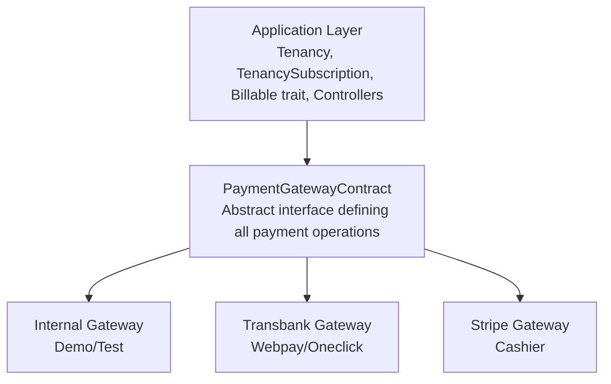

# Payment Gateway Integration Guide

> **Technical documentation for integrating payment providers with the DASH Tenancy & Billing system**

---

## Overview

The DASH billing system uses a **gateway-agnostic architecture** built around the `PaymentGatewayContract` interface. This allows seamless integration with multiple payment providers while maintaining consistent behavior across the application.



---

## Architecture Components

### 1. PaymentGatewayContract Interface

Located at: `domain/app/Services/Payments/Contracts/PaymentGatewayContract.php`

```php
interface PaymentGatewayContract
{
    // Gateway Configuration
    public static function getIdentifier(): string;
    public static function getDisplayName(): string;
    public static function getCapabilities(): array;
    public static function getConnectionParamFormats(): array;
    public static function getWebhookEndpoint(): string;
    public function verifyCredentials(): bool;
    
    // Payment Methods
    public function createPaymentMethod(array $data): array;
    public function getPaymentMethod(string $externalId): ?array;
    public function updatePaymentMethod(string $externalId, array $data): array;
    public function deletePaymentMethod(string $externalId): bool;
    
    // Subscriptions
    public function createSubscription(TenancySubscription $subscription, TenancyPaymentMethod $paymentMethod): array;
    public function updateSubscription(TenancySubscription $subscription, array $changes): array;
    public function cancelSubscription(TenancySubscription $subscription, bool $atPeriodEnd = true): array;
    public function resumeSubscription(TenancySubscription $subscription): array;
    
    // Charges
    public function charge(string $paymentMethodId, int $amountInCents, string $currency, array $metadata = []): array;
    public function refund(string $transactionId, ?int $amountInCents = null, string $reason = ''): array;
    
    // Webhooks
    public function validateWebhookSignature(string $payload, string $signature): bool;
    public function handleWebhook(string $eventType, array $payload): array;
    
    // Invoices
    public function getInvoice(string $invoiceId): ?array;
    public function listInvoices(TenancySubscription $subscription, int $limit = 10): array;
    public function getInvoiceUrl(string $invoiceId): ?string;
}
```

### 2. Billable Trait

Located at: `app/Traits/Billable.php`

The `Billable` trait is applied to the `Tenancy` model and provides Cashier-compatible methods:

| Method Category | Methods |
|----------------|---------|
| **Subscriptions** | `subscriptions()`, `subscription()`, `newSubscription()`, `subscribed()`, `onTrial()` |
| **Payment Methods** | `paymentMethods()`, `defaultPaymentMethod()`, `addPaymentMethod()` |
| **Charges** | `charge()`, `refund()`, `payments()` |
| **Gateway** | `getPaymentGateway()`, `gatewayId()`, `createAsGatewayCustomer()` |

### 3. SubscriptionBuilder

Located at: `app/Services/Billing/SubscriptionBuilder.php`

Fluent API for creating subscriptions:

```php
$tenancy->newSubscription('default', 'premium')
    ->trialDays(14)
    ->skipTrial()
    ->withMetadata(['source' => 'web'])
    ->create($paymentMethodId);
```

---

## Available Payment Gateways

### Internal Gateway (Demo/Testing)

**Identifier:** `internal`  
**Location:** `domain/app/Services/Payments/Internal/InternalPaymentGatewayService.php`

The internal gateway provides a fully functional simulation for:
- Development without external dependencies
- Demo environments
- Automated testing
- User acceptance testing

**Capabilities:**
```php
[
    'supports_subscriptions' => true,
    'supports_trials' => true,
    'supports_refunds' => true,
    'supports_webhooks' => true,
    'supports_invoices' => true,
    'is_simulation' => true,
    'supported_currencies' => ['USD', 'CLP', 'EUR'],
]
```

**Configuration:**
```php
// Set success rate (percentage of charges that succeed)
$gateway = new InternalPaymentGatewayService();
$gateway->setSuccessRate(90); // 90% success rate

// Or via connection params
'connection_params' => [
    'success_rate' => 90,
    'simulate_delays' => true,
    'webhook_secret' => 'your_secret',
]
```

---

### Transbank Gateway (Chile)

**Identifier:** `transbank`  
**Location:** `domain/app/Services/Payments/Transbank/TransbankPaymentGatewayService.php`

Integrates with Chilean Transbank payment system via `laragear/transbank` package.

**Capabilities:**
```php
[
    'supports_subscriptions' => false, // Manual via Oneclick
    'supports_recurring_billing' => true,
    'supports_refunds' => true,
    'requires_redirect' => true,
    'supported_currencies' => ['CLP', 'USD'],
]
```

**Configuration (.env):**
```env
TRANSBANK_ENV=integration  # or 'production'
WEBPAY_KEY=597055555532
WEBPAY_SECRET=579B532A7440BB0C9079DED94D31EA1615BACEB56610332264630D42D0A36B1C
```

---

## Creating a New Payment Gateway

### Step 1: Create the Service Class

```php
<?php

namespace Domain\App\Services\Payments\YourProvider;

use Domain\App\Services\Payments\Contracts\PaymentGatewayContract;
use App\Models\TenancySubscription;
use App\Models\TenancyPaymentMethod;

class YourProviderPaymentGatewayService implements PaymentGatewayContract
{
    // 1. Gateway Configuration
    public static function getIdentifier(): string
    {
        return 'yourprovider';
    }

    public static function getDisplayName(): string
    {
        return 'Your Provider Name';
    }

    public static function getCapabilities(): array
    {
        return [
            'supports_subscriptions' => true,
            'supports_trials' => true,
            'supports_refunds' => true,
            'supports_webhooks' => true,
            'supports_invoices' => true,
            'supported_currencies' => ['USD', 'EUR'],
            'is_simulation' => false,
        ];
    }

    public static function getConnectionParamFormats(): array
    {
        return [
            [
                'attribute' => 'connection_params.api_key',
                'label' => 'API Key',
                'type' => 'string',
                'required' => true,
            ],
            [
                'attribute' => 'connection_params.api_secret',
                'label' => 'API Secret',
                'type' => 'password',
                'required' => true,
            ],
            [
                'attribute' => 'connection_params.environment',
                'label' => 'Environment',
                'type' => 'select',
                'options' => ['sandbox', 'production'],
                'default_value' => 'sandbox',
            ],
        ];
    }

    public static function getWebhookEndpoint(): string
    {
        return '/api/payments/webhooks/yourprovider';
    }

    // 2. Implement all interface methods...
}
```

### Step 2: Register the Gateway

Add to `SystemPaymentGatewaysSeeder.php` or create migration:

```php
SystemPaymentGateway::create([
    'name' => 'Your Provider',
    'slug' => 'yourprovider',
    'class' => \Domain\App\Services\Payments\YourProvider\YourProviderPaymentGatewayService::class,
    'is_active' => true,
    'is_default' => false,
]);
```

### Step 3: Update Billable Trait

Add the gateway to the `getPaymentGateway()` method:

```php
public function getPaymentGateway(): PaymentGatewayContract
{
    $gatewayType = $this->gateway_type ?? 'internal';

    return match ($gatewayType) {
        'internal' => new InternalPaymentGatewayService(),
        'transbank' => new TransbankPaymentGatewayService(),
        'yourprovider' => new YourProviderPaymentGatewayService(),
        default => new InternalPaymentGatewayService(),
    };
}
```

### Step 4: Add Webhook Routes

```php
// routes/api.php
Route::prefix('payments/webhooks')->group(function () {
    Route::post('/yourprovider', [PaymentWebhookController::class, 'handleYourProvider']);
});
```

---

## Subscription Lifecycle

### Creating a Subscription

```php
// Via Billable trait
$subscription = $tenancy->newSubscription('default', $plan)
    ->trialDays(14)
    ->create($paymentMethodId);

// Via service directly
$service = new TenancySubscriptionService();
$subscription = $service->createSubscription($tenancy, $plan, $startTrial);
```

### Upgrading a Plan

```php
$service = new TenancySubscriptionService();
$subscription = $service->upgradePlan($subscription, $newPlan);

// Upgrade behavior (Flow/KitchnTabs policy):
// - ✅ Immediate plan change in gateway
// - ✅ Full charge for new plan amount (no proration)
// - ✅ Features activated immediately on payment
// - ❌ No credit for unused time on previous plan
```

### Downgrading a Plan

```php
$service = new TenancySubscriptionService();

// Check for conflicts first (usage vs new limits)
$conflicts = $service->validateDowngrade($subscription, $currentPlan, $newPlan);

if (!empty($conflicts)) {
    return response()->json(['errors' => $conflicts], 422);
}

$subscription = $service->downgradePlan($subscription, $newPlan);

// Downgrade behavior (Flow/KitchnTabs policy):
// - ✅ Registered as pending in database
// - ✅ Current plan continues until period end
// - ✅ Gateway updated at current_period_end
// - ❌ No partial refunds
// - ❌ No complex calculations
```

### Cancelling a Subscription

```php
// Cancel at period end (default)
$service->cancelSubscription($subscription, atPeriodEnd: true);

// Cancel immediately
$service->cancelSubscription($subscription, atPeriodEnd: false);
```

---

## Invoice Generation

### PDF Invoice Service

```php
use App\Services\Billing\InvoiceService;

$invoiceService = new InvoiceService();

// Generate PDF for a payment
$pdf = $invoiceService->generatePdf($payment);

// Store to disk
$path = $invoiceService->store($payment);

// Get download URL
$url = $invoiceService->getDownloadUrl($payment);
```

### Invoice Data Structure

```php
[
    'id' => 'inv_internal_abc123',
    'number' => 'INV-2026-0001',
    'tenancy_id' => '...',
    'subscription_id' => '...',
    'status' => 'paid', // draft, pending, paid, void
    'amount' => 2999, // cents
    'currency' => 'USD',
    'tax_amount' => 570, // cents
    'total' => 3569, // cents
    'period_start' => '2026-01-01',
    'period_end' => '2026-02-01',
    'paid_at' => '2026-01-01T12:00:00Z',
    'line_items' => [
        [
            'description' => 'Premium Plan - Monthly',
            'quantity' => 1,
            'unit_price' => 2999,
            'amount' => 2999,
        ],
    ],
]
```

---

## Webhook Handling

### Webhook Controller Pattern

```php
class PaymentWebhookController extends Controller
{
    public function handleInternal(Request $request)
    {
        $gateway = new InternalPaymentGatewayService();
        
        // Validate signature
        $signature = $request->header('X-Webhook-Signature');
        if (!$gateway->validateWebhookSignature($request->getContent(), $signature)) {
            return response('Invalid signature', 403);
        }
        
        // Handle event
        $result = $gateway->handleWebhook(
            $request->input('event_type'),
            $request->input('data')
        );
        
        return response()->json($result);
    }
}
```

### Supported Webhook Events

| Event | Description | Handler Action |
|-------|-------------|----------------|
| `payment.succeeded` | Payment was successful | Activate subscription |
| `payment.failed` | Payment failed | Increment retry counter |
| `subscription.created` | New subscription | Sync to local model |
| `subscription.updated` | Subscription changed | Update local model |
| `subscription.cancelled` | Subscription cancelled | Mark as cancelled |
| `invoice.paid` | Invoice was paid | Record payment |
| `trial.ending` | Trial ending soon | Send notification |

---

## Testing Payment Flows

### Demo Flow with Internal Gateway

```php
// 1. Create tenancy with internal gateway
$tenancy = Tenancy::create([
    'public_name' => 'Demo Company',
    'gateway_type' => 'internal',
]);

// 2. Add payment method
$gateway = $tenancy->getPaymentGateway();
$result = $gateway->createPaymentMethod([
    'type' => 'internal_card',
    'last4' => '4242',
    'holder_name' => 'Test User',
]);

$paymentMethod = $tenancy->addPaymentMethod([
    'type' => 'card',
    'provider_payment_method_id' => $result['payment_method']['id'],
    'last_four' => '4242',
]);

// 3. Create subscription
$plan = SubscriptionPlan::where('slug', 'basic')->first();
$subscription = $tenancy->newSubscription('default', $plan)
    ->trialDays(14)
    ->create($paymentMethod->id);

// 4. Upgrade plan
$premiumPlan = SubscriptionPlan::where('slug', 'premium')->first();
$subscription = (new TenancySubscriptionService())
    ->upgradePlan($subscription, $premiumPlan);

// 5. Downgrade plan
$subscription = (new TenancySubscriptionService())
    ->downgradePlan($subscription, $plan);
```

### Simulating Webhook Events

```php
$gateway = new InternalPaymentGatewayService();

// Simulate payment success
$result = $gateway->simulateWebhookEvent('payment.succeeded', [
    'subscription_id' => $subscription->external_subscription_id,
    'amount' => 2999,
]);

// Simulate payment failure
$result = $gateway->simulateWebhookEvent('payment.failed', [
    'subscription_id' => $subscription->external_subscription_id,
    'error' => 'Card declined',
]);
```

---

## Database Schema

### Key Tables

| Table | Purpose |
|-------|---------|
| `tenancies` | Customer accounts with billing info |
| `tenancy_subscriptions` | Active subscriptions |
| `tenancy_payment_methods` | Stored payment methods |
| `tenancy_payments` | Payment transaction history |
| `subscription_plans` | Available plans with limits |
| `system_payment_gateways` | Registered gateway configurations |

### Tenancy Billing Columns

```sql
ALTER TABLE tenancies ADD COLUMN gateway_customer_id VARCHAR(255);
ALTER TABLE tenancies ADD COLUMN gateway_type VARCHAR(50) DEFAULT 'internal';
ALTER TABLE tenancies ADD COLUMN pm_type VARCHAR(50);
ALTER TABLE tenancies ADD COLUMN pm_last_four VARCHAR(4);
```

---

## Troubleshooting

### Common Issues

| Issue | Solution |
|-------|----------|
| Payment always fails | Check `success_rate` config on Internal gateway |
| Webhook not received | Verify webhook URL is publicly accessible |
| Subscription stuck in trial | Check `trial_ends_at` date and status |
| Invoice not generating | Ensure `dompdf` or PDF library is installed |

### Debug Mode

```php
// Enable detailed logging
Log::channel('payments')->info('Payment attempt', [
    'tenancy_id' => $tenancy->id,
    'amount' => $amount,
    'gateway' => $tenancy->gateway_type,
]);
```

---

## Security Considerations

1. **API Keys**: Store in `.env`, never commit to version control
2. **Webhook Signatures**: Always validate before processing
3. **PCI Compliance**: Never store full card numbers locally
4. **Audit Logging**: Log all payment operations
5. **Rate Limiting**: Apply to payment endpoints
