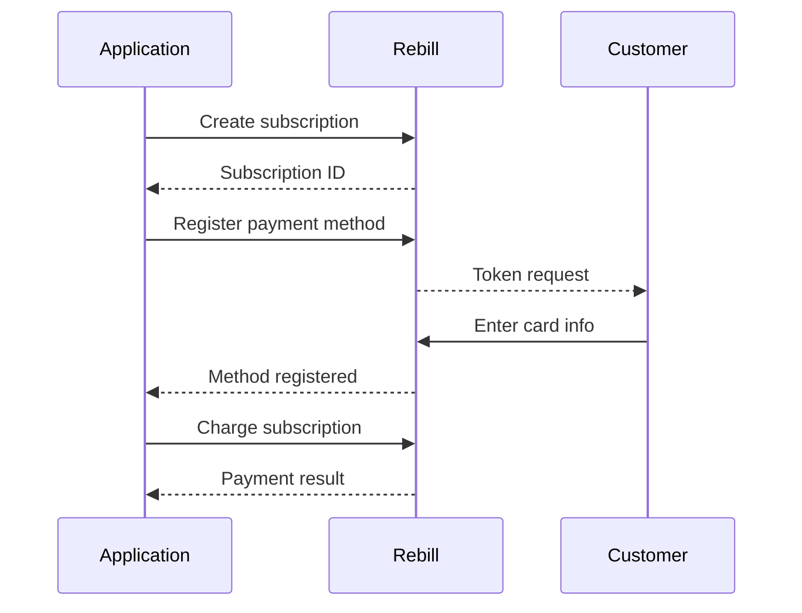
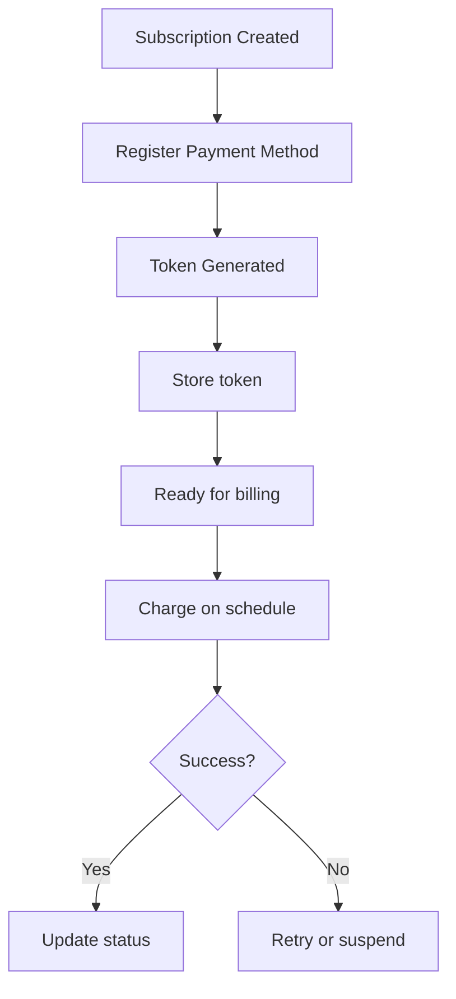

# REDBILL Payment Gateway Integration

REDBILL (Rebill) is a LATAM-focused payment gateway supporting Argentina, Brazil, Chile, Colombia, and Mexico.

## Overview

| Property | Value |
|----------|-------|
| Identifier | `rebill` |
| Display Name | Rebill (LATAM) |
| Currencies | ARS, BRL, CLP, COP, MXN |
| Countries | AR, BR, CL, CO, MX |
| Card Tokenization | JavaScript SDK (PCI compliant) |
| Webhook Type | JSON POST with signature |
| Proration Support | ❌ No (use KitchnTabs billing policy) |

> **Note:** Rebill does not support automatic proration. For KitchnTabs billing policy on upgrades/downgrades, see [KITCHNTABS_BILLING_POLICY.md](./KITCHNTABS_BILLING_POLICY.md).

---

## Configuration

### Environment Variables

```env
# API Configuration
REBILL_API_URL=https://api.rebill.com/v3
REBILL_API_KEY=your_api_key_here
REBILL_WEBHOOK_SECRET=your_webhook_secret_here
REBILL_ENVIRONMENT=sandbox  # sandbox or production

# Defaults
REBILL_DEFAULT_COUNTRY=CL
REBILL_DEFAULT_CURRENCY=CLP

# Client-side SDK
REBILL_PUBLIC_KEY=your_public_key_for_sdk
```

### Config File

Location: `config/rebill.php`

```php
return [
    'api_url' => env('REBILL_API_URL', 'https://api.rebill.com/v3'),
    'api_key' => env('REBILL_API_KEY'),
    'webhook_secret' => env('REBILL_WEBHOOK_SECRET'),
    'environment' => env('REBILL_ENVIRONMENT', 'sandbox'),
    'supported_currencies' => ['ARS', 'BRL', 'CLP', 'COP', 'MXN'],
    'supported_countries' => ['AR', 'BR', 'CL', 'CO', 'MX'],
    'retry' => [
        'schedule' => [1, 3, 5, 7],  // Days between retries
        'max_attempts' => 4,
        'grace_period_days' => 10,
    ],
];
```

---

## Architecture

### Files

```
domain/app/Services/Payments/Rebill/
├── RebillPaymentGatewayService.php     # Main service
└── Traits/
    ├── RebillApiTrait.php              # HTTP client, retry, logging
    ├── RebillCustomersTrait.php        # Customer CRUD operations
    ├── RebillSubscriptionsTrait.php    # Subscriptions & plans
    ├── RebillWebhookTrait.php          # 12 webhook event handlers
    └── RebillPaymentRetryTrait.php     # Custom retry with exponential backoff
```

### Database

```sql
-- Tenancy customer mapping
ALTER TABLE tenancies ADD rebill_customer_id VARCHAR(255) NULL;

-- Plan synchronization
ALTER TABLE subscription_plans ADD rebill_plan_id VARCHAR(255) NULL;
```

---

## Subscription Flow



---

## Card Tokenization (Frontend)



---

## Payment Retry Logic

REDBILL integration includes custom retry logic with exponential backoff:

### Retry Schedule

| Attempt | Days After Failure | Action |
|---------|-------------------|--------|
| 1 | 1 day | First retry |
| 2 | 3 days | Second retry |
| 3 | 5 days | Third retry |
| 4 | 7 days | Final retry |
| - | 10 days | Grace period ends, suspension |

### Implementation

```php
// RebillPaymentRetryTrait.php

protected array $retrySchedule = [1, 3, 5, 7];
protected int $maxRetryAttempts = 4;
protected int $gracePeriodDays = 10;

public function shouldRetryPayment(TenancySubscription $subscription): bool
{
    if ($subscription->status !== 'past_due') {
        return false;
    }
    
    $attempts = $subscription->failed_payment_attempts ?? 0;
    
    if ($attempts >= $this->maxRetryAttempts) {
        return false;
    }
    
    return $this->isRetryDue($subscription);
}
```

---

## Webhooks

### Endpoint

```
POST /api/payments/webhooks/rebill
```

### Signature Validation

```php
$signature = $request->header('X-Rebill-Signature');
$payload = $request->getContent();
$expected = hash_hmac('sha256', $payload, $webhookSecret);
$valid = hash_equals($expected, $signature);
```

### Supported Events

| Event | Handler | Action |
|-------|---------|--------|
| `payment.approved` | `handlePaymentApproved` | Mark subscription active |
| `payment.rejected` | `handlePaymentRejected` | Increment retry counter |
| `payment.pending` | `handlePaymentPending` | Log pending status |
| `payment.refunded` | `handlePaymentRefunded` | Record refund |
| `subscription.created` | `handleSubscriptionCreated` | Update local record |
| `subscription.cancelled` | `handleSubscriptionCancelled` | Mark cancelled |
| `subscription.paused` | `handleSubscriptionPaused` | Mark paused |
| `subscription.resumed` | `handleSubscriptionResumed` | Mark active |
| `subscription.expired` | `handleSubscriptionExpired` | Mark expired |
| `charge.pending` | `handleChargePending` | Log charge |
| `charge.succeeded` | `handleChargeSucceeded` | Record transaction |
| `charge.failed` | `handleChargeFailed` | Trigger retry logic |

---

## Plan Synchronization

```php
// Dispatch job
dispatch(new \App\Jobs\SyncRebillPlansJob());

// Or manually
$gateway = new RebillPaymentGatewayService();
$results = $gateway->syncPlans();
```

### What it does

1. Finds local `SubscriptionPlan` records without `rebill_plan_id`
2. Creates each plan in REDBILL via API
3. Stores the returned plan ID for future reference

---

## API Usage Examples

### Create Customer

```php
$gateway = new RebillPaymentGatewayService();
$customer = $gateway->getOrCreateCustomer($tenancy);
// Returns: ['id' => 'cus_xxx', 'email' => '...', ...]
```

### Create Subscription

```php
$result = $gateway->createSubscription($tenancySubscription, $paymentMethod);
// Returns: ['success' => true, 'external_subscription_id' => 'sub_xxx', ...]
```

### Charge Customer

```php
$result = $gateway->charge(
    paymentMethodId: 'pm_xxx',
    amountInCents: 10000,
    currency: 'CLP',
    metadata: ['description' => 'One-time charge']
);
```

### Cancel Subscription

```php
$result = $gateway->cancelSubscription($subscription, atPeriodEnd: true);
```

---

## Testing

### Sandbox URL

```
https://api.rebill.dev/v3
```

### Test Card (Chile)

| Field | Value |
|-------|-------|
| Number | `4507 9900 0000 4905` |
| Expiry | Any future date |
| CVV | `123` |
| Name | Any |

---

## Error Handling

```php
try {
    $result = $gateway->createSubscription($sub, $pm);
    
    if (!$result['success']) {
        Log::error('Subscription failed', ['error' => $result['error']]);
    }
} catch (\Exception $e) {
    // Network or API error
    Log::error('REDBILL API error', ['message' => $e->getMessage()]);
}
```

---

## Related Files

- Service: `domain/app/Services/Payments/Rebill/RebillPaymentGatewayService.php`
- Config: `config/rebill.php`
- Migration: `database/migrations/2026_01_21_000001_add_rebill_customer_id_to_tenancies.php`
- Job: `app/Jobs/SyncRebillPlansJob.php`
- Webhook: `app/Http/Controllers/API/Webhooks/PaymentWebhookController.php`
