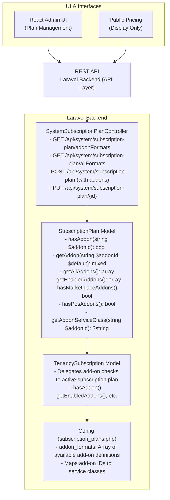

# Subscription Plan Add-ons Feature - Technical Documentation

> **Version:** 1.0  
> **Last Updated:** February 2026  
> **Status:** Technical Reference  
> **Audience:** Engineers, Backend/Frontend Developers  
> **Related Docs:** [SUBSCRIPTION_SYSTEM_COMPLETE_DOCUMENTATION.md](./SUBSCRIPTION_SYSTEM_COMPLETE_DOCUMENTATION.md)

---

## Table of Contents

1. [Overview](#overview)
2. [Architecture](#architecture)
3. [Backend Implementation](#backend-implementation)
4. [Frontend Implementation](#frontend-implementation)
5. [Database Schema](#database-schema)
6. [Configuration Reference](#configuration-reference)
7. [API Reference](#api-reference)
8. [Usage Examples](#usage-examples)
9. [Testing](#testing)
10. [Add-on Naming Convention](#add-on-naming-convention)

---

## Overview

The Subscription Plan Add-ons feature extends the existing subscription plan system to support **modular integrations** that can be enabled or disabled on a per-plan basis. This allows plans to offer specific integrations (marketplaces, POS systems) as optional add-ons rather than bundled features.

### Key Concepts

| Concept | Description |
|---------|-------------|
| **Add-on** | A toggleable integration that can be enabled/disabled per subscription plan |
| **Marketplace Add-on** | Integration with external marketplaces (e.g., Uber Eats, Jumpseller) |
| **POS Add-on** | Integration with point-of-sale systems (e.g., Transbank, MercadoPago) |
| **Service Class** | The backend service class that implements the add-on functionality |

### Business Use Cases

1. **Tiered Integration Access**: Higher-tier plans can include more marketplace integrations
2. **À la carte Add-ons**: Offer specific integrations as purchasable add-ons
3. **Partner Integrations**: Enable specific integrations for partner accounts
4. **Feature Gating**: Control which tenants can access specific integrations

### Add-ons vs Features vs Limits

| Type | Purpose | Storage | Example |
|------|---------|---------|---------|
| **Limits** | Quantitative constraints | `limits` JSON | `max_tenants: 5` |
| **Features** | Boolean feature flags | `features` array | `['api_access', 'analytics']` |
| **Add-ons** | Integration toggles | `addons` JSON | `{marketplace_ubereats: true}` |

---

## Architecture

### System Architecture



### Data Flow

```
┌─────────────────────────────────────────────────────────────────────────────┐
│                          ADD-ON CHECK FLOW                                   │
├─────────────────────────────────────────────────────────────────────────────┤
│                                                                              │
│  Application Code                                                           │
│       │                                                                      │
│       │ $tenant->tenancySubscription->hasAddon('marketplace_ubereats')      │
│       ▼                                                                      │
│  ┌─────────────────────────────────────────────────────────────────────┐    │
│  │                    TenancySubscription                               │    │
│  │  hasAddon('marketplace_ubereats')                                   │    │
│  └─────────────────────────────┬───────────────────────────────────────┘    │
│                                │                                             │
│                                │ delegates to                                │
│                                ▼                                             │
│  ┌─────────────────────────────────────────────────────────────────────┐    │
│  │                    SubscriptionPlan (from plan relation)             │    │
│  │  hasAddon('marketplace_ubereats')                                   │    │
│  │                                                                      │    │
│  │  1. Get $this->addons ?? []                                         │    │
│  │  2. Check isset($addons['marketplace_ubereats'])                    │    │
│  │  3. Return $addons['marketplace_ubereats'] === true                 │    │
│  └─────────────────────────────┬───────────────────────────────────────┘    │
│                                │                                             │
│                                ▼                                             │
│                         Returns: true / false                                │
│                                                                              │
└─────────────────────────────────────────────────────────────────────────────┘
```

---

## Backend Implementation

### 1. Configuration File

**File:** `config/subscription_plans.php`

The add-on definitions are centralized in the config file alongside limit formats:

```php
'addon_formats' => [
    // ============ Marketplace Add-ons ============
    [
        'id'            => 'marketplace_jumpseller',
        'group'         => 'marketplaces',
        'tab'           => 'Marketplaces',
        'attribute'     => 'addons.marketplace_jumpseller',
        'label'         => 'Jumpseller Integration',
        'visible'       => true,
        'required'      => false,
        'type'          => 'boolean',
        'editable'      => true,
        'rules'         => 'nullable|boolean',
        'default_value' => false,
        'description'   => 'Enable Jumpseller e-commerce marketplace integration.',
        'service_class' => \Domain\App\Services\ECommerce\Marketplaces\Jumpseller\JumpsellerService::class,
        'icon'          => 'shopping_cart',
    ],
    [
        'id'            => 'marketplace_ubereats',
        'group'         => 'marketplaces',
        'tab'           => 'Marketplaces',
        'attribute'     => 'addons.marketplace_ubereats',
        'label'         => 'Uber Eats Integration',
        'visible'       => true,
        'required'      => false,
        'type'          => 'boolean',
        'editable'      => true,
        'rules'         => 'nullable|boolean',
        'default_value' => false,
        'description'   => 'Enable Uber Eats marketplace integration for food delivery.',
        'service_class' => \Domain\App\Services\ECommerce\Marketplaces\Uber\UberService::class,
        'icon'          => 'delivery_dining',
    ],
    // ... more add-ons
],
```

### 2. Database Migration

**File:** `database/migrations/xxxx_add_addons_to_subscription_plans_table.php`

```php
Schema::table('subscription_plans', function (Blueprint $table) {
    $table->json('addons')->nullable()->after('limits');
});
```

### 3. SubscriptionPlan Model Methods

**File:** `app/Models/Subscription/SubscriptionPlan.php`

```php
// ============ Add-on Methods ============

/**
 * Check if an add-on is enabled for this plan.
 *
 * @param string $addonId The add-on identifier (e.g., 'marketplace_ubereats')
 * @return bool True if the add-on is enabled
 */
public function hasAddon(string $addonId): bool
{
    $addons = $this->addons ?? [];
    return isset($addons[$addonId]) && $addons[$addonId] === true;
}

/**
 * Get a specific add-on value.
 *
 * @param string $addonId The add-on identifier
 * @param mixed $default Default value if add-on not set
 * @return mixed
 */
public function getAddon(string $addonId, $default = false)
{
    $addons = $this->addons ?? [];
    return $addons[$addonId] ?? $default;
}

/**
 * Get all add-ons as an array.
 *
 * @return array
 */
public function getAllAddons(): array
{
    return $this->addons ?? [];
}

/**
 * Get all enabled add-ons.
 *
 * @return array List of enabled add-on IDs
 */
public function getEnabledAddons(): array
{
    $addons = $this->addons ?? [];
    return array_keys(array_filter($addons, fn($value) => $value === true));
}

/**
 * Check if plan has any marketplace add-ons enabled.
 *
 * @return bool
 */
public function hasMarketplaceAddons(): bool
{
    $addons = $this->addons ?? [];
    foreach ($addons as $key => $value) {
        if (str_starts_with($key, 'marketplace_') && $value === true) {
            return true;
        }
    }
    return false;
}

/**
 * Check if plan has any POS add-ons enabled.
 *
 * @return bool
 */
public function hasPosAddons(): bool
{
    $addons = $this->addons ?? [];
    foreach ($addons as $key => $value) {
        if (str_starts_with($key, 'pos_') && $value === true) {
            return true;
        }
    }
    return false;
}

/**
 * Get enabled marketplace add-ons.
 *
 * @return array List of enabled marketplace add-on IDs
 */
public function getEnabledMarketplaceAddons(): array
{
    return array_filter(
        $this->getEnabledAddons(),
        fn($addonId) => str_starts_with($addonId, 'marketplace_')
    );
}

/**
 * Get enabled POS add-ons.
 *
 * @return array List of enabled POS add-on IDs
 */
public function getEnabledPosAddons(): array
{
    return array_filter(
        $this->getEnabledAddons(),
        fn($addonId) => str_starts_with($addonId, 'pos_')
    );
}

/**
 * Get the service class for a specific add-on from config.
 *
 * @param string $addonId The add-on identifier
 * @return string|null The service class or null if not found
 */
public static function getAddonServiceClass(string $addonId): ?string
{
    $addonFormats = config('subscription_plans.addon_formats', []);
    foreach ($addonFormats as $addon) {
        if ($addon['id'] === $addonId) {
            return $addon['service_class'] ?? null;
        }
    }
    return null;
}
```

### 4. TenancySubscription Model Methods

**File:** `app/Models/Tenancy/TenancySubscription.php`

```php
/**
 * Check if the subscription's plan has a specific add-on enabled.
 *
 * @param string $addonId The add-on identifier
 * @return bool
 */
public function hasAddon(string $addonId): bool
{
    return $this->plan?->hasAddon($addonId) ?? false;
}

/**
 * Get all enabled add-ons from the subscription's plan.
 *
 * @return array
 */
public function getEnabledAddons(): array
{
    return $this->plan?->getEnabledAddons() ?? [];
}

/**
 * Check if the subscription's plan has any marketplace add-ons.
 *
 * @return bool
 */
public function hasMarketplaceAddons(): bool
{
    return $this->plan?->hasMarketplaceAddons() ?? false;
}

/**
 * Check if the subscription's plan has any POS add-ons.
 *
 * @return bool
 */
public function hasPosAddons(): bool
{
    return $this->plan?->hasPosAddons() ?? false;
}
```

### 5. Controller Endpoints

**File:** `app/Http/Controllers/API/System/SystemSubscriptionPlanController.php`

```php
/**
 * Get add-on format definitions from config.
 *
 * @return JsonResponse
 */
public function addonFormats(): JsonResponse
{
    return ResponseHandler::json([
        'formats' => config('subscription_plans.addon_formats', []),
        'groups' => $this->getGroupedFormats('addon_formats'),
    ]);
}

/**
 * Get both limit and add-on formats in a single request.
 *
 * @return JsonResponse
 */
public function allFormats(): JsonResponse
{
    return ResponseHandler::json([
        'limits' => [
            'formats' => config('subscription_plans.limit_formats', []),
            'groups' => $this->getGroupedFormats('limit_formats'),
        ],
        'addons' => [
            'formats' => config('subscription_plans.addon_formats', []),
            'groups' => $this->getGroupedFormats('addon_formats'),
        ],
    ]);
}
```

### 6. Request Validation

**File:** `app/Http/Requests/Subscription/SubscriptionPlanRequest.php`

```php
public function rules(): array
{
    return [
        // ... other rules
        'addons' => 'nullable|array',
        'addons.*' => 'boolean',
    ];
}
```

### 7. API Resource

**File:** `app/Http/Resources/Subscription/SubscriptionPlanResource.php`

```php
public function toArray($request): array
{
    return [
        // ... other fields
        'limits' => $this->limits,
        'addons' => $this->addons,
        'enabled_addons' => $this->getEnabledAddons(),
        'has_marketplace_addons' => $this->hasMarketplaceAddons(),
        'has_pos_addons' => $this->hasPosAddons(),
    ];
}
```

---

## Frontend Implementation

### 1. SubscriptionPlanFormatsProvider

**File:** `packages/dash-admin/src/contexts/SubscriptionPlanFormatsProvider.tsx`

A React context that fetches and caches both limit formats and add-on formats:


```tsx
import React, { createContext, useContext, useEffect, useState } from 'react';
import { useAxios, idbSet, idbGet } from 'dash-admin';

interface SubscriptionPlanFormatsContextType {
    formats: any[];
    addonFormats: any[];
    loading: boolean;
    fetchFormats: () => Promise<void>;
}

const SubscriptionPlanFormatsContext = createContext<SubscriptionPlanFormatsContextType>({
    formats: [],
    addonFormats: [],
    loading: true,
    fetchFormats: async () => {},
});

export const useSubscriptionPlanFormats = () => useContext(SubscriptionPlanFormatsContext);

interface Props {
    children: React.ReactNode;
    cacheSeconds?: number;
}

export const SubscriptionPlanFormatsProvider: React.FC<Props> = ({
    children,
    cacheSeconds = 300,
}) => {
    const [formats, setFormats] = useState<any[]>([]);
    const [addonFormats, setAddonFormats] = useState<any[]>([]);
    const [loading, setLoading] = useState(true);
    const axios = useAxios();

    const fetchFormats = async () => {
        setLoading(true);
        try {
            const [limitsRes, addonsRes] = await Promise.all([
                axios.get('/api/system/subscription-plan/limitFormats'),
                axios.get('/api/system/subscription-plan/addonFormats'),
            ]);
            
            setFormats(limitsRes.data.formats || []);
            setAddonFormats(addonsRes.data.formats || []);
            
            // Cache in IndexedDB
            await idbSet('subscription_plan_formats', {
                formats: limitsRes.data.formats,
                addonFormats: addonsRes.data.formats,
                timestamp: Date.now(),
            });
        } catch (error) {
            console.error('Failed to fetch formats:', error);
        } finally {
            setLoading(false);
        }
    };

    useEffect(() => {
        const loadFormats = async () => {
            const cached = await idbGet('subscription_plan_formats');
            const isValid = cached && 
                (Date.now() - cached.timestamp) < cacheSeconds * 1000;
            
            if (isValid) {
                setFormats(cached.formats || []);
                setAddonFormats(cached.addonFormats || []);
                setLoading(false);
            } else {
                await fetchFormats();
            }
        };
        loadFormats();
    }, []);

    return (
        <SubscriptionPlanFormatsContext.Provider 
            value={{ formats, addonFormats, loading, fetchFormats }}
        >
            {children}
        </SubscriptionPlanFormatsContext.Provider>
    );
};
```


### 2. PlanAddonsSettings Component

**File:** `packages/dash-admin/src/components/subscription/PlanAddonsSettings.tsx`


```tsx
import React from 'react';
import { useRecordContext, useInput } from 'react-admin';
import { Box, Switch, FormControlLabel, Typography, Chip, Card } from '@mui/material';
import { useSubscriptionPlanFormats } from '../../contexts/SubscriptionPlanFormatsProvider';

const PlanAddonsSettings: React.FC = () => {
    const record = useRecordContext();
    const { addonFormats, loading } = useSubscriptionPlanFormats();
    const { field } = useInput({ source: 'addons', defaultValue: {} });
    
    if (loading) return <CircularProgress />;
    
    // Group add-ons by category
    const groupedAddons = addonFormats.reduce((acc, addon) => {
        const group = addon.group || 'other';
        if (!acc[group]) acc[group] = [];
        acc[group].push(addon);
        return acc;
    }, {} as Record<string, any[]>);
    
    const handleToggle = (addonId: string) => {
        const newAddons = { ...field.value };
        newAddons[addonId] = !newAddons[addonId];
        field.onChange(newAddons);
    };
    
    return (
        <Box>
            {Object.entries(groupedAddons).map(([group, addons]) => (
                <Card key={group} sx={{ mb: 2, p: 2 }}>
                    <Typography variant="h6" gutterBottom>
                        {group.charAt(0).toUpperCase() + group.slice(1)}
                    </Typography>
                    
                    {addons.map((addon) => (
                        <Box key={addon.id} sx={{ mb: 1 }}>
                            <FormControlLabel
                                control={
                                    <Switch
                                        checked={field.value?.[addon.id] ?? false}
                                        onChange={() => handleToggle(addon.id)}
                                    />
                                }
                                label={
                                    <Box>
                                        <Typography>{addon.label}</Typography>
                                        <Typography variant="caption" color="text.secondary">
                                            {addon.description}
                                        </Typography>
                                    </Box>
                                }
                            />
                        </Box>
                    ))}
                </Card>
            ))}
        </Box>
    );
};

export default PlanAddonsSettings;
```


### 3. Schema Integration

**File:** `packages/dash-admin/src/schemas/subscriptionPlan.ts`

```typescript
import PlanAddonsSettings from '../components/subscription/PlanAddonsSettings';

const subscriptionPlanSchema: IDashAutoAdminAttribute[] = [
    // ... other attributes
    {
        tab: 'Add-ons',
        attribute: 'addons',
        label: 'Plan Add-ons',
        type: Object,
        custom: true,
        component: PlanAddonsSettings,
    },
];
```

---

## Database Schema

### subscription_plans Table

```sql
CREATE TABLE subscription_plans (
    id BIGINT UNSIGNED AUTO_INCREMENT PRIMARY KEY,
    name VARCHAR(255) NOT NULL,
    slug VARCHAR(255) UNIQUE NOT NULL,
    description TEXT,
    prices JSON,                    -- {"CLP": 9900, "USD": 999}
    billing_cycle VARCHAR(50),      -- 'monthly', 'yearly'
    trial_days INT DEFAULT 0,
    tier INT DEFAULT 1,
    features JSON,                  -- ["feature1", "feature2"]
    limits JSON,                    -- {"max_tenants": 5, "max_users": 10}
    addons JSON,                    -- {"marketplace_ubereats": true, "pos_transbank": false}
    is_active BOOLEAN DEFAULT true,
    is_default BOOLEAN DEFAULT false,
    metadata JSON,
    flow_plan_id VARCHAR(255),
    rebill_plan_id VARCHAR(255),
    created_at TIMESTAMP,
    updated_at TIMESTAMP,
    deleted_at TIMESTAMP
);
```

### Example Add-ons JSON Structure

```json
{
    "marketplace_jumpseller": true,
    "marketplace_ubereats": true,
    "marketplace_dash": false,
    "pos_manual": true,
    "pos_transbank": false,
    "pos_mercadopago": false
}
```

---

## Configuration Reference

### Add-on Format Properties

| Property | Type | Required | Description |
|----------|------|----------|-------------|
| `id` | string | Yes | Unique identifier (e.g., `marketplace_ubereats`) |
| `group` | string | Yes | Grouping category (e.g., `marketplaces`, `point_of_sale`) |
| `tab` | string | Yes | UI tab name for display |
| `attribute` | string | Yes | JSON path (e.g., `addons.marketplace_ubereats`) |
| `label` | string | Yes | Human-readable label |
| `visible` | boolean | Yes | Show in UI |
| `required` | boolean | Yes | Is required (typically false for add-ons) |
| `type` | string | Yes | Always `boolean` for add-ons |
| `editable` | boolean | Yes | Can be edited |
| `rules` | string | Yes | Validation rules (e.g., `nullable|boolean`) |
| `default_value` | boolean | Yes | Default state (typically `false`) |
| `description` | string | Yes | Help text for UI |
| `service_class` | string | No | FQCN of service class implementing the add-on |
| `icon` | string | No | Material icon name for UI |

### Available Add-ons

| Add-on ID | Group | Description | Service Class |
|-----------|-------|-------------|---------------|
| `marketplace_jumpseller` | marketplaces | Jumpseller e-commerce integration | `JumpsellerService` |
| `marketplace_ubereats` | marketplaces | Uber Eats food delivery | `UberService` |
| `marketplace_dash` | marketplaces | Dash internal marketplace | `DashService` |
| `pos_manual` | point_of_sale | Manual cash transactions | `ManualPosServiceProvider` |
| `pos_transbank` | point_of_sale | Transbank payment terminal | TBD |
| `pos_mercadopago` | point_of_sale | MercadoPago Point device | TBD |

---

## API Reference

### Get Add-on Formats

```http
GET /api/system/subscription-plan/addonFormats
Authorization: Bearer {token}
```

**Response:**

```json
{
    "formats": [
        {
            "id": "marketplace_ubereats",
            "group": "marketplaces",
            "tab": "Marketplaces",
            "label": "Uber Eats Integration",
            "type": "boolean",
            "default_value": false,
            "description": "Enable Uber Eats marketplace integration for food delivery.",
            "service_class": "Domain\\App\\Services\\ECommerce\\Marketplaces\\Uber\\UberService",
            "icon": "delivery_dining"
        }
    ],
    "groups": {
        "marketplaces": [...],
        "point_of_sale": [...]
    }
}
```

### Get All Formats (Limits + Add-ons)

```http
GET /api/system/subscription-plan/allFormats
Authorization: Bearer {token}
```

**Response:**

```json
{
    "limits": {
        "formats": [...],
        "groups": {...}
    },
    "addons": {
        "formats": [...],
        "groups": {...}
    }
}
```

### Create Plan with Add-ons

```http
POST /api/system/subscription-plan
Authorization: Bearer {token}
Content-Type: application/json

{
    "name": "Professional Plan",
    "slug": "professional",
    "prices": {"CLP": 29900},
    "billing_cycle": "monthly",
    "tier": 2,
    "addons": {
        "marketplace_jumpseller": true,
        "marketplace_ubereats": true,
        "pos_manual": true,
        "pos_transbank": false
    }
}
```

### Update Plan Add-ons

```http
PUT /api/system/subscription-plan/{id}
Authorization: Bearer {token}
Content-Type: application/json

{
    "addons": {
        "marketplace_ubereats": true,
        "pos_transbank": true
    }
}
```

---

## Usage Examples

### Check Add-on from Tenancy Subscription

```php
// In application code
$tenant = auth()->user()->tenant;
$subscription = $tenant->tenancy->tenancySubscription;

if ($subscription->hasAddon('marketplace_ubereats')) {
    // Enable Uber Eats features
    $uberService = app(UberService::class);
    $uberService->syncMenu($tenant);
}

if ($subscription->hasAddon('pos_transbank')) {
    // Show Transbank payment option
}
```

### Check Add-on from SubscriptionPlan Directly

```php
$plan = SubscriptionPlan::find(1);

// Check specific add-on
if ($plan->hasAddon('marketplace_ubereats')) {
    echo "Uber Eats enabled";
}

// Get all enabled add-ons
$enabledAddons = $plan->getEnabledAddons();
// ['marketplace_ubereats', 'pos_manual']

// Check category
if ($plan->hasMarketplaceAddons()) {
    echo "Has marketplace integrations";
}

// Get enabled marketplace add-ons
$marketplaces = $plan->getEnabledMarketplaceAddons();
// ['marketplace_ubereats', 'marketplace_jumpseller']
```

### Get Service Class for Add-on

```php
$serviceClass = SubscriptionPlan::getAddonServiceClass('marketplace_ubereats');
// "Domain\App\Services\ECommerce\Marketplaces\Uber\UberService"

if ($serviceClass) {
    $service = app($serviceClass);
    // Use the service
}
```

### Middleware for Add-on Gating

```php
// app/Http/Middleware/RequireAddon.php
class RequireAddon
{
    public function handle($request, Closure $next, string $addonId)
    {
        $tenant = auth()->user()->tenant;
        $subscription = $tenant->tenancy->tenancySubscription;
        
        if (!$subscription->hasAddon($addonId)) {
            return response()->json([
                'error' => 'Add-on not available in your plan',
                'addon' => $addonId,
                'upgrade_url' => route('subscription.upgrade'),
            ], 403);
        }
        
        return $next($request);
    }
}

// Usage in routes
Route::middleware('addon:marketplace_ubereats')
    ->prefix('uber')
    ->group(function () {
        Route::post('/sync', [UberController::class, 'sync']);
    });
```

---

## Testing

### Test Suite Location

**File:** `tests/Feature/API/Subscription/SubscriptionPlanAddonsTest.php`

### Running Tests

```bash
sail artisan test --filter=SubscriptionPlanAddonsTest
```

### Test Categories

| Category | Tests | Description |
|----------|-------|-------------|
| Model Tests | 14 | SubscriptionPlan add-on methods |
| Delegation Tests | 5 | TenancySubscription delegation to plan |
| API Tests | 6 | CRUD and format endpoints |
| Edge Cases | 4 | Null/empty add-ons handling |

### Example Test

```php
/** @test */
public function subscription_plan_has_addon_method_returns_true_for_enabled_addon()
{
    $plan = SubscriptionPlan::factory()->create([
        'addons' => [
            'marketplace_ubereats' => true,
            'pos_transbank' => false,
        ],
    ]);

    $this->assertTrue($plan->hasAddon('marketplace_ubereats'));
    $this->assertFalse($plan->hasAddon('pos_transbank'));
}

/** @test */
public function tenancy_subscription_has_addon_delegates_to_plan()
{
    $plan = SubscriptionPlan::factory()->create([
        'addons' => ['marketplace_ubereats' => true],
    ]);

    $subscription = TenancySubscription::factory()->create([
        'tenancy_id' => $this->tenancy->id,
        'subscription_plan_id' => $plan->id,
    ]);

    $this->assertTrue($subscription->hasAddon('marketplace_ubereats'));
}
```

---

## Add-on Naming Convention

### Prefix Rules

| Prefix | Category | Example |
|--------|----------|---------|
| `marketplace_` | External marketplace integrations | `marketplace_ubereats` |
| `pos_` | Point of sale integrations | `pos_transbank` |
| `integration_` | Generic third-party integrations | `integration_zapier` |
| `feature_` | Premium feature toggles | `feature_advanced_reports` |

### Naming Best Practices

1. **Lowercase with underscores**: Use snake_case
2. **Prefix by category**: Always start with category prefix
3. **Be specific**: Use specific service names, not generic ones
4. **Consistent naming**: Match the service class name when possible

### Examples

```
✅ Good:
  - marketplace_ubereats
  - pos_transbank
  - integration_mailchimp
  
❌ Bad:
  - ubereats (missing prefix)
  - marketplace-uber-eats (using hyphens)
  - MARKETPLACE_UBEREATS (uppercase)
```

---

# CHANGELOG:

02/02/26
Config (subscription_plans.php):

Added available_currencies configuration
Updated addon_formats with default_prices per currency for each add-on
Migration (database/migrations/2026_02_02_add_addon_prices_to_subscription_plans_table.php):

Added addon_prices JSON column for per-currency pricing
Added flow_addon_items JSON column to store Flow subscription_item IDs
SubscriptionPlan Model (SubscriptionPlan.php):

getAddonPrice($addonId, $currency) - Get price for a specific currency
getAddonPrices($addonId) - Get all currency prices for an addon
setAddonPrice($addonId, $currency, $price) - Set individual price
setAddonPrices($addonId, $prices) - Set all prices at once
getEnabledAddonsWithPrices($currency) - Get addons with their prices
getTotalAddonsCost($currency) - Calculate total of enabled addons
getPricedAddons($currency) - Get addons with price > 0
Flow integration methods: getFlowAddonItemId(), setFlowAddonItemId(), removeFlowAddonItemId(), addonNeedsFlowSync(), getAddonsNeedingFlowSync()
formatAddonPrice($addonId, $currency) - Format price for display
FlowSubscriptionsTrait (app/Services/PaymentGateway/Flow/FlowSubscriptionsTrait.php):

createSubscriptionItem() - Create subscription_item in Flow
getSubscriptionItem() - Get subscription_item details
editSubscriptionItem() - Update subscription_item
deleteSubscriptionItem() - Remove subscription_item
listSubscriptionItems() - List items for a subscription
attachAddonsToFlowSubscription() - Sync all priced addons with Flow
removeAddonsFromFlowSubscription() - Remove addons from Flow
Request Validation (SubscriptionPlanRequest.php):

Added validation rules for addon_prices and flow_addon_items
Resource (app/Http/Resources/Subscription/SubscriptionPlanResource.php):

Added addon_prices and flow_addon_items to API response
Frontend
PlanAddonsSettings.tsx (packages/dash-admin/src/components/subscription/PlanAddonsSettings.tsx):
New AddonRow component with toggle + price inputs per currency
Dynamically fetches available currencies from system values
Shows price inputs when addon is enabled
Updates both addons and addon_prices form fields
Tests
SubscriptionPlanAddonsTest.php - Added 24 new tests for addon pricing:
Model pricing methods (get/set/format)
Flow integration methods
API CRUD operations with addon_prices


## Related Documentation

- [SUBSCRIPTION_FLOW_TECHNICAL_DOCUMENTATION.md](./SUBSCRIPTION_FLOW_TECHNICAL_DOCUMENTATION.md) - Plan upgrade/downgrade flows
- [SUBSCRIPTION_SYSTEM_COMPLETE_DOCUMENTATION.md](./SUBSCRIPTION_SYSTEM_COMPLETE_DOCUMENTATION.md) - Complete subscription system
- [TENANCY_BILLING_SYSTEM.md](./TENANCY_BILLING_SYSTEM.md) - Tenancy billing architecture
