# KitchnTabs Subscription System - Complete Documentation

## Table of Contents

1. [Overview](#overview)
2. [Architecture Principles](#architecture-principles)
3. [Entity-Relationship Diagram](#entity-relationship-diagram)
4. [State Machines](#state-machines)
5. [Database Schema](#database-schema)
6. [Domain Events](#domain-events)
7. [Service Architecture](#service-architecture)
8. [Flow Diagrams](#flow-diagrams)
9. [API Endpoints](#api-endpoints)
10. [Usage Examples](#usage-examples)
11. [Integration Guide](#integration-guide)

---

## Overview

The KitchnTabs Subscription System is an event-driven, multi-gateway billing solution that separates billing authority (payment gateway) from entitlement authority (application). It supports multiple payment gateways (Flow.cl, Rebill, Transbank) and implements sophisticated plan change policies.

### Key Features

- **Multi-gateway support**: Flow.cl (Chile), Rebill (LATAM), Transbank, Internal
- **Event-driven architecture**: All billing operations emit domain events
- **State machines**: Separate billing and subscription lifecycle management
- **Deferred downgrades**: Downgrades take effect at period end
- **Immediate upgrades**: Upgrades apply instantly
- **Audit trail**: Complete activity logging via Spatie ActivityLog
- **Webhook-driven**: Payment gateway webhooks drive state changes

---

## Architecture Principles

### 1. Separation of Concerns

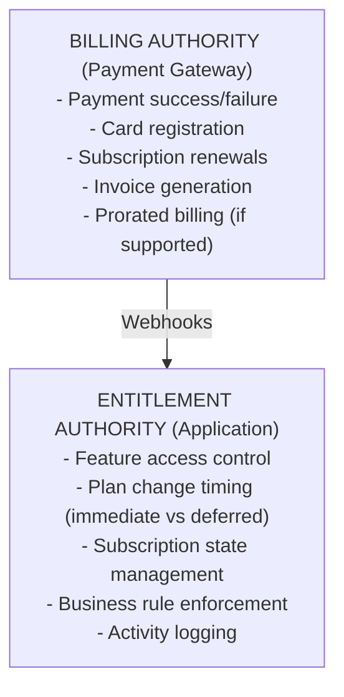

### 2. Event-Driven Flow

All billing operations follow this pattern:

```
Action → Domain Event → Event Listener → State Machine → Model Update
```

### 3. Two-Level State Management

**Tenancy Level** (`billing_state`): Overall billing relationship
- Tracks: Card registration status, subscription existence

**Subscription Level** (`subscription_state`): Subscription lifecycle
- Tracks: Trial, active, payment issues, cancellation

---

## Entity-Relationship Diagram

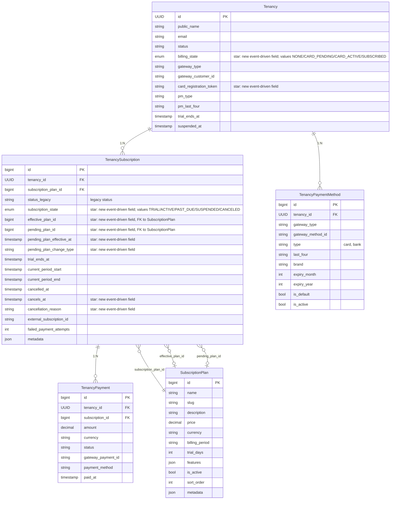

Legend: fields marked "star" in the notes above are new event-driven billing fields. PK = Primary Key, FK = Foreign Key.

### Key Relationships

1. **Tenancy ↔ TenancySubscription** (1:N)
   - A tenancy can have multiple subscriptions over time
   - Only one should be active at a time

2. **TenancySubscription ↔ SubscriptionPlan** (N:1)
   - Multiple relationships to SubscriptionPlan:
     - `subscription_plan_id`: Gateway's billing plan
     - `effective_plan_id`: Current entitlement plan
     - `pending_plan_id`: Scheduled future plan

3. **TenancySubscription ↔ TenancyPayment** (1:N)
   - Subscription has many payment records
   - Tracks payment history and failures

---

## State Machines

### Billing State Machine (Tenancy Level)

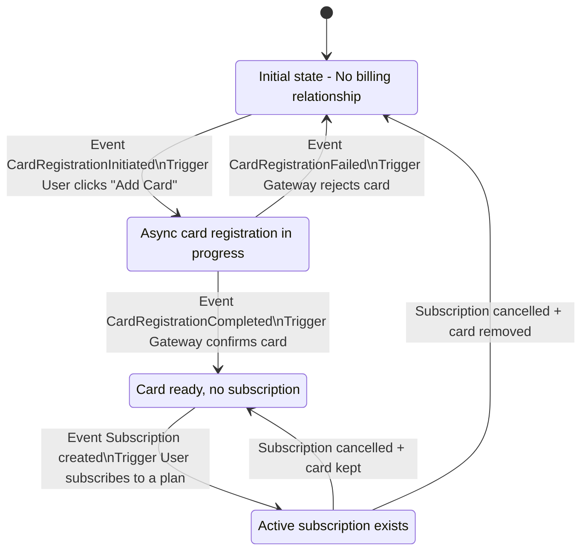

State Properties:

| State | Has Payment? | Description |
|---|---|---|
| NONE | No | No billing setup |
| CARD_PENDING | In Progress | Card registration pending |
| CARD_ACTIVE | Yes | Card ready, no subscription |
| SUBSCRIBED | Yes | Active subscription |

### Subscription State Machine (Subscription Level)

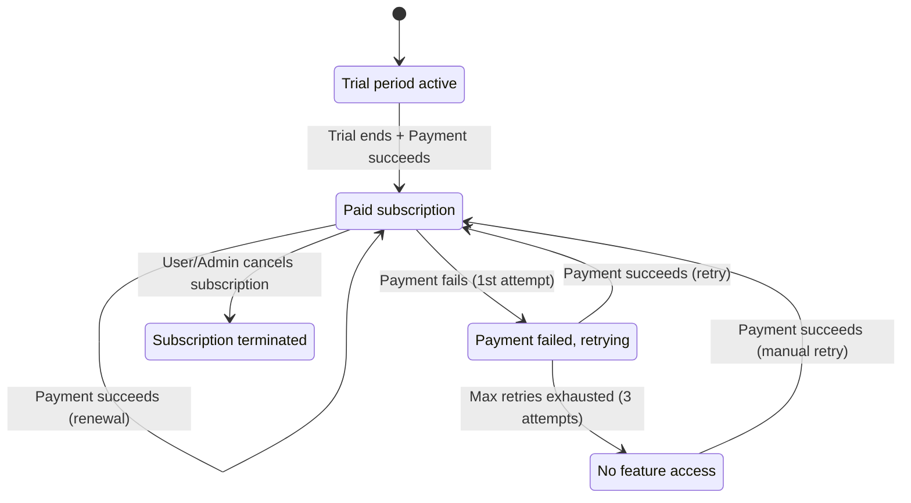

State Properties:

| State | Feature Access | In Good Standing | Description |
|---|---|---|---|
| TRIAL | Yes | Yes | Trial period |
| ACTIVE | Yes | Yes | Paid & current |
| PAST_DUE | Yes (grace) | No | Retrying payment |
| SUSPENDED | No | No | Payment exhausted |
| CANCELED | No | No | Terminated |

### Plan Change Type Decision Tree

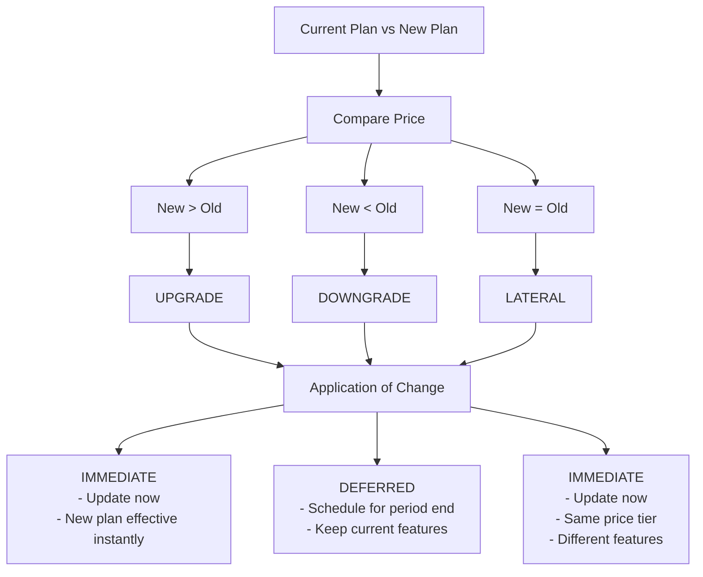

Policy Rules:

| Change Type | Timing | Reason |
|---|---|---|
| UPGRADE | Immediate | Customer wants features now |
| DOWNGRADE | Deferred | Keep paid features till end |
| LATERAL | Immediate | No billing impact |

---

## Database Schema

### Core Tables

#### tenancies

```sql
CREATE TABLE tenancies (
    id UUID PRIMARY KEY,
    public_name VARCHAR(255),
    legal_name VARCHAR(255),
    email VARCHAR(255) UNIQUE,
    status VARCHAR(50) DEFAULT 'active',
    
    -- Event-driven billing fields
    billing_state VARCHAR(20) DEFAULT 'none',
    card_registration_token VARCHAR(255) NULL,
    card_registration_initiated_at TIMESTAMP NULL,
    
    -- Payment gateway fields
    gateway_type VARCHAR(50) DEFAULT 'internal',
    gateway_customer_id VARCHAR(255) NULL,
    pm_type VARCHAR(50) NULL,
    pm_last_four VARCHAR(4) NULL,
    
    -- Gateway-specific IDs
    rebill_customer_id VARCHAR(255) NULL,
    flow_customer_id VARCHAR(255) NULL,
    
    -- Trial and suspension
    trial_ends_at TIMESTAMP NULL,
    suspended_at TIMESTAMP NULL,
    
    created_at TIMESTAMP DEFAULT NOW(),
    updated_at TIMESTAMP DEFAULT NOW(),
    deleted_at TIMESTAMP NULL,
    
    INDEX idx_billing_state (billing_state),
    INDEX idx_status (status),
    INDEX idx_email (email)
);
```

#### tenancy_subscriptions

```sql
CREATE TABLE tenancy_subscriptions (
    id BIGSERIAL PRIMARY KEY,
    tenancy_id UUID NOT NULL REFERENCES tenancies(id),
    
    -- Plan relationships
    subscription_plan_id BIGINT NOT NULL REFERENCES subscription_plans(id),
    effective_plan_id BIGINT NULL REFERENCES subscription_plans(id),
    pending_plan_id BIGINT NULL REFERENCES subscription_plans(id),
    
    -- Legacy fields (maintained for backward compatibility)
    scheduled_plan_id BIGINT NULL REFERENCES subscription_plans(id),
    scheduled_plan_change_at TIMESTAMP NULL,
    status VARCHAR(50) DEFAULT 'trial',
    
    -- Event-driven subscription state
    subscription_state VARCHAR(20) DEFAULT 'trial',
    pending_plan_effective_at TIMESTAMP NULL,
    pending_plan_change_type VARCHAR(20) NULL,
    
    -- Billing periods
    trial_ends_at TIMESTAMP NULL,
    current_period_start TIMESTAMP NOT NULL,
    current_period_end TIMESTAMP NOT NULL,
    
    -- Cancellation
    cancelled_at TIMESTAMP NULL,
    cancels_at TIMESTAMP NULL,
    cancellation_reason VARCHAR(255) NULL,
    
    -- Payment tracking
    failed_payment_attempts INT DEFAULT 0,
    last_payment_attempt_at TIMESTAMP NULL,
    next_payment_attempt_at TIMESTAMP NULL,
    
    -- Gateway integration
    payment_gateway VARCHAR(50) NOT NULL,
    external_subscription_id VARCHAR(255) NULL,
    
    metadata JSONB DEFAULT '{}',
    
    created_at TIMESTAMP DEFAULT NOW(),
    updated_at TIMESTAMP DEFAULT NOW(),
    deleted_at TIMESTAMP NULL,
    
    INDEX idx_tenancy (tenancy_id),
    INDEX idx_subscription_state (subscription_state),
    INDEX idx_status (status),
    INDEX idx_pending_plan_effective (pending_plan_effective_at),
    INDEX idx_cancels_at (cancels_at),
    INDEX idx_current_period_end (current_period_end)
);
```

#### subscription_plans

```sql
CREATE TABLE subscription_plans (
    id BIGSERIAL PRIMARY KEY,
    name VARCHAR(255) NOT NULL,
    slug VARCHAR(255) UNIQUE NOT NULL,
    description TEXT,
    
    -- Pricing
    price DECIMAL(10, 2) NOT NULL,
    currency VARCHAR(3) DEFAULT 'CLP',
    billing_period VARCHAR(20) DEFAULT 'monthly',
    
    -- Trial
    trial_days INT DEFAULT 0,
    
    -- Features (JSON array)
    features JSONB DEFAULT '[]',
    
    -- Display
    is_active BOOLEAN DEFAULT true,
    is_featured BOOLEAN DEFAULT false,
    sort_order INT DEFAULT 0,
    
    metadata JSONB DEFAULT '{}',
    
    created_at TIMESTAMP DEFAULT NOW(),
    updated_at TIMESTAMP DEFAULT NOW(),
    deleted_at TIMESTAMP NULL,
    
    INDEX idx_slug (slug),
    INDEX idx_active (is_active),
    INDEX idx_price (price)
);
```

#### tenancy_payments

```sql
CREATE TABLE tenancy_payments (
    id BIGSERIAL PRIMARY KEY,
    tenancy_id UUID NOT NULL REFERENCES tenancies(id),
    subscription_id BIGINT NULL REFERENCES tenancy_subscriptions(id),
    
    -- Payment details
    amount DECIMAL(10, 2) NOT NULL,
    currency VARCHAR(3) DEFAULT 'CLP',
    status VARCHAR(50) NOT NULL,
    
    -- Gateway integration
    gateway_payment_id VARCHAR(255) NULL,
    payment_method VARCHAR(50) NULL,
    
    -- Timestamps
    paid_at TIMESTAMP NULL,
    failed_at TIMESTAMP NULL,
    
    metadata JSONB DEFAULT '{}',
    
    created_at TIMESTAMP DEFAULT NOW(),
    updated_at TIMESTAMP DEFAULT NOW(),
    
    INDEX idx_tenancy (tenancy_id),
    INDEX idx_subscription (subscription_id),
    INDEX idx_status (status),
    INDEX idx_gateway_payment (gateway_payment_id)
);
```

#### tenancy_payment_methods

```sql
CREATE TABLE tenancy_payment_methods (
    id BIGSERIAL PRIMARY KEY,
    tenancy_id UUID NOT NULL REFERENCES tenancies(id),
    
    gateway_type VARCHAR(50) NOT NULL,
    gateway_method_id VARCHAR(255) NOT NULL,
    
    type VARCHAR(50) NOT NULL, -- 'card', 'bank_account'
    last_four VARCHAR(4) NULL,
    brand VARCHAR(50) NULL,
    expiry_month INT NULL,
    expiry_year INT NULL,
    
    is_default BOOLEAN DEFAULT false,
    is_active BOOLEAN DEFAULT true,
    
    created_at TIMESTAMP DEFAULT NOW(),
    updated_at TIMESTAMP DEFAULT NOW(),
    deleted_at TIMESTAMP NULL,
    
    INDEX idx_tenancy (tenancy_id),
    INDEX idx_gateway (gateway_type, gateway_method_id),
    INDEX idx_default (tenancy_id, is_default)
);
```

---

## Domain Events

### Event Hierarchy

```
BaseBillingEvent (Abstract)
├── BillingStateChanged
├── SubscriptionStateChanged
├── CardRegistrationInitiated
├── CardRegistrationCompleted
├── CardRegistrationFailed
├── InvoicePaid
├── InvoicePaymentFailed
├── PlanChangeRequested
├── PlanChangeApplied
├── SubscriptionCancelled
├── SubscriptionRenewed
└── TrialEnding
```

### Event Structure

```php
abstract class BaseBillingEvent
{
    public Tenancy $tenancy;
    public ?TenancySubscription $subscription;
    public string $occurredAt;           // ISO8601 timestamp
    public string $source;                // 'gateway_webhook', 'user_action', etc.
    public array $metadata;               // Additional context
    
    abstract public function getEventName(): string;
    abstract public function getDescription(): string;
    public function toActivityLogArray(): array;
}
```

### Event Catalog

| Event | Trigger | Data | Listeners |
|-------|---------|------|-----------|
| `CardRegistrationInitiated` | User starts card registration | `gatewayIdentifier` | (log only) |
| `CardRegistrationCompleted` | Gateway confirms card | `cardBrand`, `cardLastFour` | `HandleCardRegistrationCompleted` |
| `CardRegistrationFailed` | Gateway rejects card | `errorCode`, `errorMessage` | `HandleCardRegistrationFailed` |
| `InvoicePaid` | Payment successful | `amount`, `currency`, `gatewayPaymentId` | `HandleInvoicePaid` |
| `InvoicePaymentFailed` | Payment failed | `attemptNumber`, `errorCode`, `willRetry` | `HandleInvoicePaymentFailed` |
| `PlanChangeRequested` | User/admin requests change | `fromPlan`, `toPlan`, `changeType` | (log only) |
| `PlanChangeApplied` | Plan change takes effect | `fromPlan`, `toPlan`, `changeType` | `HandlePlanChangeApplied` |
| `SubscriptionCancelled` | Cancellation | `immediate`, `effectiveAt`, `reason` | `HandleSubscriptionCancelled` |
| `SubscriptionRenewed` | Renewal successful | `periodStart`, `periodEnd` | (log only) |
| `BillingStateChanged` | State transition | `fromState`, `toState` | (log only) |
| `SubscriptionStateChanged` | State transition | `fromState`, `toState` | (log only) |

---

## Service Architecture

### BillingStateMachine Service

Central orchestrator for all state transitions.

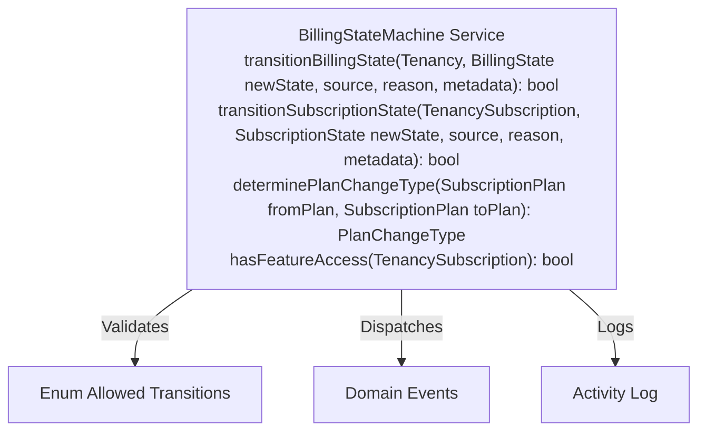

### Key Responsibilities

1. **Validation**: Ensures only valid state transitions occur
2. **Logging**: Records all transitions to activity log
3. **Events**: Dispatches domain events on state changes
4. **Legacy Mapping**: Maintains backward compatibility with `status` field

---

## Flow Diagrams

### Flow 1: New Subscription Creation

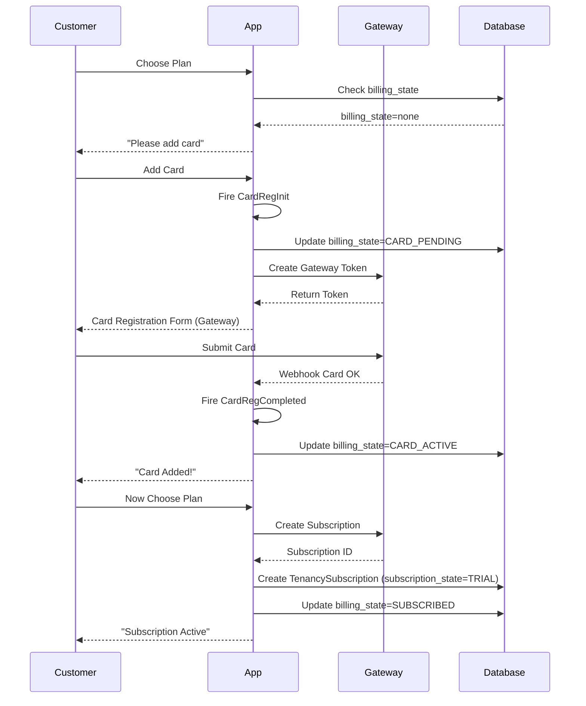

### Flow 2: Payment Success (Renewal)

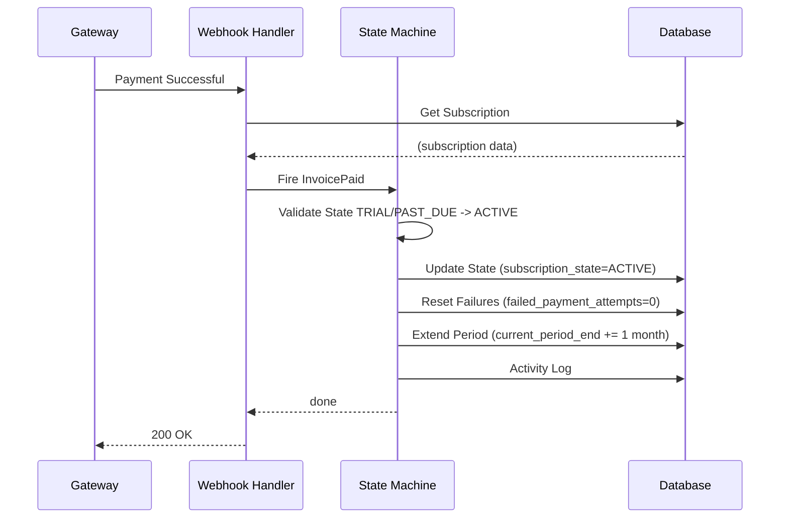

### Flow 3: Payment Failure & Retry

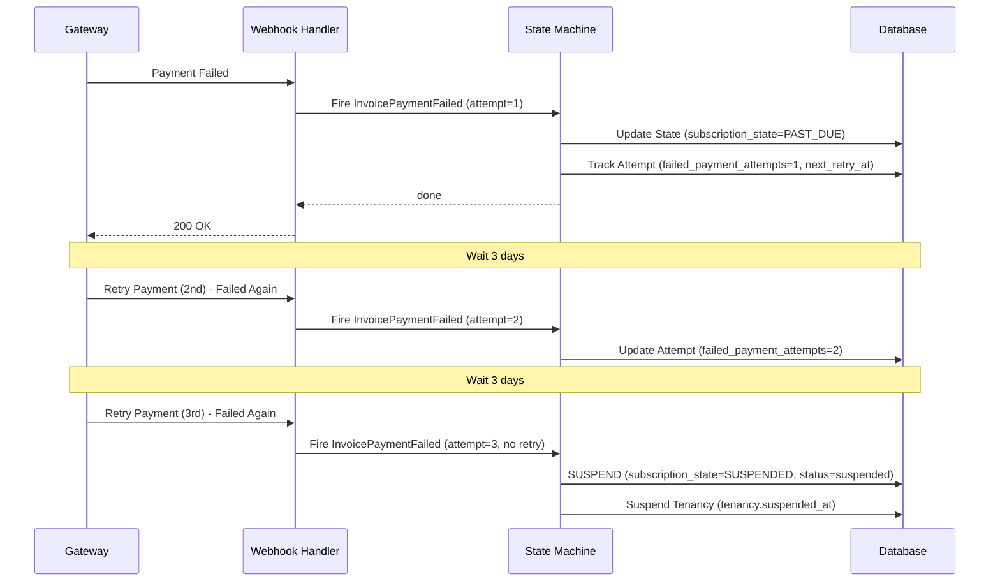

### Flow 4: Plan Upgrade (Immediate)

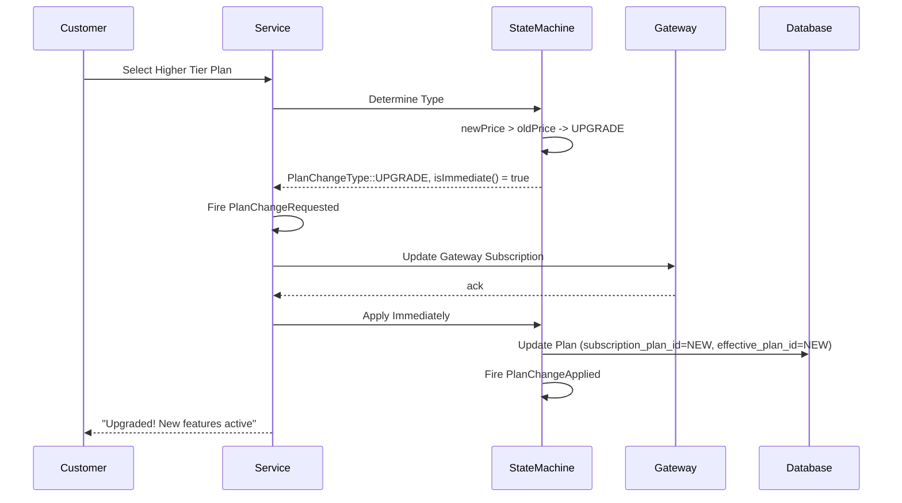

### Flow 5: Plan Downgrade (Deferred)

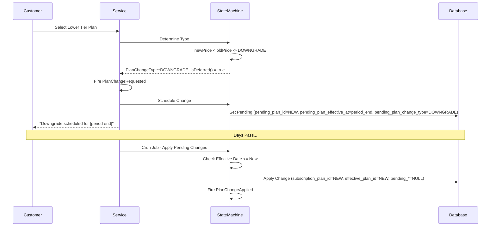

### Flow 6: Subscription Cancellation

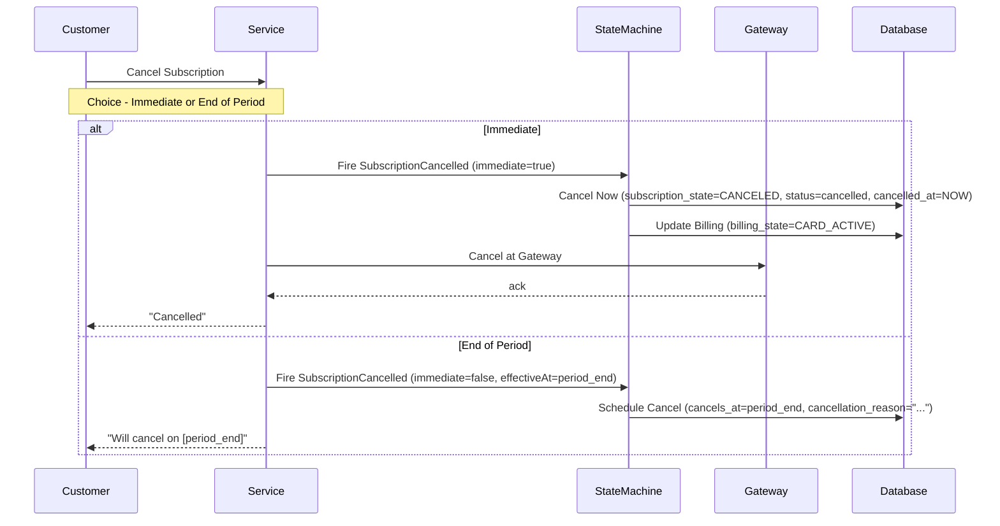

---

## API Endpoints

### Subscription Management

#### Create Subscription

```http
POST /api/tenancy/subscriptions
Authorization: Bearer {token}
Content-Type: application/json

{
  "subscription_plan_id": 1,
  "payment_method_id": "pm_123abc",
  "trial_days": 14
}

Response 201:
{
  "data": {
    "id": 42,
    "tenancy_id": "uuid-123",
    "subscription_plan_id": 1,
    "subscription_state": "trial",
    "effective_plan_id": 1,
    "trial_ends_at": "2026-02-07T10:00:00Z",
    "current_period_start": "2026-01-24T10:00:00Z",
    "current_period_end": "2026-02-24T10:00:00Z"
  }
}
```

#### Get Current Subscription

```http
GET /api/tenancy/subscription/current
Authorization: Bearer {token}

Response 200:
{
  "data": {
    "id": 42,
    "subscription_state": "active",
    "effective_plan": {
      "id": 1,
      "name": "Professional",
      "price": 29990,
      "features": ["feature_1", "feature_2"]
    },
    "pending_plan": null,
    "current_period_end": "2026-02-24T10:00:00Z",
    "has_feature_access": true,
    "is_in_good_standing": true
  }
}
```

#### Change Plan

```http
POST /api/tenancy/subscriptions/{id}/change-plan
Authorization: Bearer {token}
Content-Type: application/json

{
  "new_plan_id": 2
}

Response 200 (Upgrade - Immediate):
{
  "data": {
    "id": 42,
    "effective_plan_id": 2,
    "change_type": "upgrade",
    "applied_immediately": true
  }
}

Response 200 (Downgrade - Deferred):
{
  "data": {
    "id": 42,
    "effective_plan_id": 1,
    "pending_plan_id": 2,
    "pending_plan_effective_at": "2026-02-24T10:00:00Z",
    "change_type": "downgrade",
    "applied_immediately": false
  }
}
```

#### Cancel Subscription

```http
POST /api/tenancy/subscriptions/{id}/cancel
Authorization: Bearer {token}
Content-Type: application/json

{
  "immediate": false,
  "reason": "Customer requested"
}

Response 200:
{
  "data": {
    "id": 42,
    "subscription_state": "active",
    "cancels_at": "2026-02-24T10:00:00Z",
    "cancellation_reason": "Customer requested"
  }
}
```

### Payment Methods

#### Add Payment Method

```http
POST /api/tenancy/payment-methods
Authorization: Bearer {token}
Content-Type: application/json

{
  "gateway_type": "flow",
  "return_url": "https://app.kitchntabs.com/billing/callback"
}

Response 200:
{
  "data": {
    "registration_token": "abc123xyz",
    "registration_url": "https://gateway.flow.cl/register?token=abc123xyz",
    "expires_at": "2026-01-24T11:00:00Z"
  }
}
```

### Webhooks

#### Flow.cl Webhook

```http
POST /api/webhooks/flow
Content-Type: application/json
X-Flow-Signature: {signature}

{
  "event": "payment.confirmed",
  "flowOrder": "123456",
  "amount": 29990,
  "currency": "CLP",
  "status": "paid"
}

Response 200:
{
  "success": true
}
```

#### Rebill Webhook

```http
POST /api/webhooks/rebill
Content-Type: application/json
X-Rebill-Signature: {signature}

{
  "event": "subscription.renewed",
  "subscription_id": "sub_abc123",
  "amount": 29990,
  "currency": "CLP",
  "period_start": "2026-01-24T00:00:00Z",
  "period_end": "2026-02-24T00:00:00Z"
}

Response 200:
{
  "success": true
}
```

---

## Usage Examples

### Example 1: Check Feature Access

```php
use App\Services\Billing\BillingStateMachine;

$stateMachine = app(BillingStateMachine::class);
$subscription = $tenancy->currentSubscription();

// Check if tenant has feature access
if ($stateMachine->hasFeatureAccess($subscription)) {
    // Allow access to premium features
} else {
    // Show upgrade prompt
}

// Or use subscription model helper
if ($subscription->hasFeatureAccess()) {
    // Allow access
}

// Check specific state
if ($subscription->subscription_state === SubscriptionState::ACTIVE) {
    // Fully active subscription
}
```

### Example 2: Handle Plan Change Request

```php
use App\Services\Billing\BillingStateMachine;
use App\Events\Billing\PlanChangeRequested;

$stateMachine = app(BillingStateMachine::class);
$currentPlan = $subscription->effectivePlan;
$newPlan = SubscriptionPlan::find($newPlanId);

// Determine change type
$changeType = $stateMachine->determinePlanChangeType($currentPlan, $newPlan);

// Fire request event
event(new PlanChangeRequested(
    subscription: $subscription,
    fromPlan: $currentPlan,
    toPlan: $newPlan,
    changeType: $changeType,
    immediate: $changeType->isImmediate(),
    scheduledFor: $changeType->isDeferred() ? $subscription->current_period_end : null,
    source: 'user_action'
));

// Apply based on type
if ($changeType->isImmediate()) {
    // Upgrade - apply now
    $subscription->applyImmediatePlanChange($newPlan);
    
    event(new PlanChangeApplied(
        subscription: $subscription,
        fromPlan: $currentPlan,
        toPlan: $newPlan,
        changeType: $changeType,
        source: 'user_action'
    ));
} else {
    // Downgrade - schedule for period end
    $subscription->schedulePlanChange(
        newPlan: $newPlan,
        effectiveAt: $subscription->current_period_end,
        changeType: $changeType
    );
}
```

### Example 3: Query Subscription State

```php
// Get all at-risk subscriptions
$atRiskSubscriptions = TenancySubscription::whereIn('subscription_state', [
    SubscriptionState::PAST_DUE,
    SubscriptionState::SUSPENDED,
])->get();

// Get subscriptions with pending changes
$pendingChanges = TenancySubscription::whereNotNull('pending_plan_id')
    ->where('pending_plan_effective_at', '<=', now())
    ->get();

// Get trial subscriptions ending soon
$endingTrials = TenancySubscription::where('subscription_state', SubscriptionState::TRIAL)
    ->whereBetween('trial_ends_at', [now(), now()->addDays(3)])
    ->get();
```

### Example 4: Handle Webhook Payment

```php
// In FlowWebhookTrait

public function handlePaymentConfirmed(array $data): void
{
    $payment = Payment::where('external_id', $data['flowOrder'])->first();
    $subscription = $payment->subscription;
    
    // Fire domain event
    event(new InvoicePaid(
        subscription: $subscription,
        amount: $data['amount'],
        currency: 'CLP',
        gatewayPaymentId: $data['flowOrder'],
        payment: $payment,
        source: 'gateway_webhook'
    ));
    
    // Listener handles state transitions
}
```

---

## Integration Guide

### Step 1: Run Migrations

```bash
sail artisan migrate
```

This adds all event-driven billing fields to your database.

### Step 2: Update Webhook Handlers

Replace direct database updates with event dispatching:

```php
// OLD (direct update)
$subscription->update(['status' => 'active']);

// NEW (event-driven)
event(new InvoicePaid(
    subscription: $subscription,
    amount: $amount,
    currency: 'CLP',
    gatewayPaymentId: $paymentId,
    source: 'gateway_webhook'
));
```

### Step 3: Update Services

Inject `BillingStateMachine` and use for state transitions:

```php
class TenancySubscriptionService
{
    public function __construct(
        protected BillingStateMachine $stateMachine
    ) {}
    
    public function upgrade(TenancySubscription $subscription, SubscriptionPlan $newPlan)
    {
        // Use state machine instead of direct updates
        $changeType = $this->stateMachine->determinePlanChangeType(
            $subscription->effectivePlan,
            $newPlan
        );
        
        // ... rest of logic
    }
}
```

### Step 4: Test Event Flow

```bash
# Test payment success event
sail artisan tinker

>>> $subscription = TenancySubscription::first();
>>> event(new App\Events\Billing\InvoicePaid(
...     subscription: $subscription,
...     amount: 29990,
...     currency: 'CLP',
...     gatewayPaymentId: 'test-123',
...     source: 'test'
... ));

# Check activity log
>>> activity()->forSubject($subscription->tenancy)->inLog('billing')->get();
```

### Step 5: Monitor Activity Logs

```php
// View billing activity for a tenancy
$activities = Activity::forSubject($tenancy)
    ->inLog('billing')
    ->orderBy('created_at', 'desc')
    ->take(50)
    ->get();

foreach ($activities as $activity) {
    echo $activity->description;
    echo $activity->properties; // Full event data
}
```

---

## Appendix

### Payment Gateway Support Matrix

| Feature | Flow.cl | Rebill | Transbank | Internal |
|---------|---------|--------|-----------|----------|
| Card Registration | ✅ Yes | ✅ Yes | ✅ Yes | ⏩ Skip |
| Recurring Billing | ✅ Yes | ✅ Yes | ❌ No | ⏩ Manual |
| Webhooks | ✅ Yes | ✅ Yes | ✅ Yes | N/A |
| Proration | ❌ No | ❌ No | ❌ No | N/A |
| 3DS Support | ✅ Yes | ✅ Yes | ✅ Yes | N/A |

### Activity Log Event Types

| Event Type | Log Name | Purpose |
|------------|----------|---------|
| All billing events | `billing` | Complete audit trail |
| Model changes | `default` | Standard Laravel activity log |
| Subscription changes | `subscription` | Subscription-specific log |
| Tenancy changes | `tenancy` | Tenancy-specific log |

### Cron Jobs Required

```php
// app/Console/Kernel.php

protected function schedule(Schedule $schedule)
{
    // Apply pending plan changes
    $schedule->command('subscriptions:apply-pending-changes')
        ->hourly();
    
    // Send trial ending reminders
    $schedule->command('subscriptions:trial-ending-reminders')
        ->daily();
    
    // Clean up expired card registration tokens
    $schedule->command('billing:cleanup-registration-tokens')
        ->daily();
}
```

---

## Support

For questions or issues with the subscription system:

1. Check the activity log for audit trail
2. Review domain events in database
3. Check webhook logs from payment gateway
4. Verify state machine transitions are valid

**End of Documentation**
