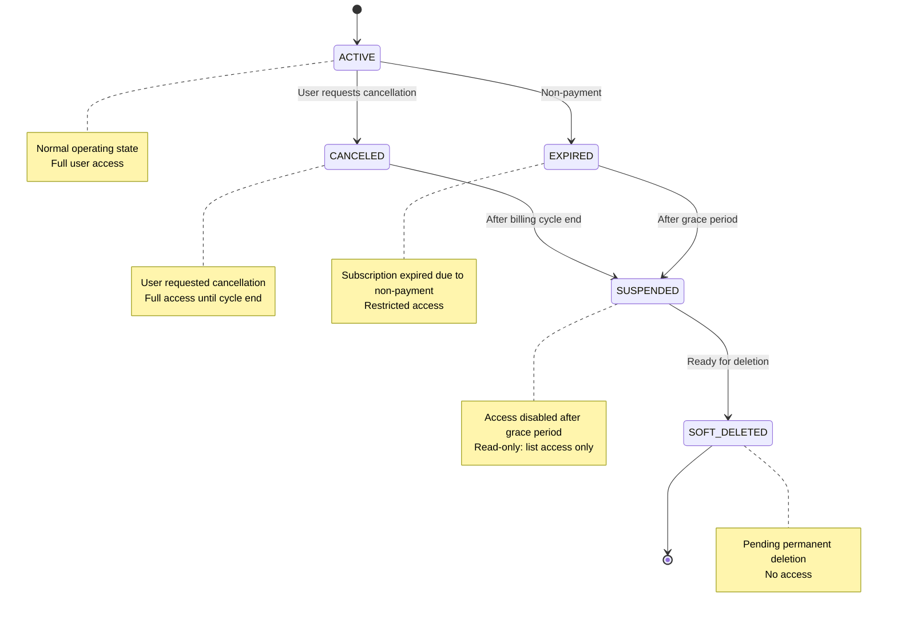

# TenancyAccount Lifecycle Management - Testing Flow

## Overview

This document provides a comprehensive testing flow for the TenancyAccount Lifecycle Management feature, including subscription cancellation (unsubscribe), account suspension, access restrictions, and reactivation.

---

## State Machine

The TenancyAccount follows this lifecycle:



### State Descriptions

| State | Description | User Access |
|-------|-------------|-------------|
| `ACTIVE` | Normal operating state | Full access |
| `CANCELED` | User requested cancellation, access until billing cycle ends | Full access |
| `EXPIRED` | Subscription expired due to non-payment | Restricted access |
| `SUSPENDED` | Access disabled after grace period | Read-only (list access only) |
| `SOFT_DELETED` | Pending permanent deletion | No access |

### Timing Configuration

Located in `config/tenancy.php`:

```php
'lifecycle' => [
    'grace_period_days' => 7,        // Days after cancellation before suspension
    'retention_period_days' => 30,   // Days to keep data after suspension
    'permanent_delete_days' => 30,   // Days after soft_deleted before permanent deletion
],
```

---

## Test Cases

### Test 1: Unsubscribe Flow (Frontend)

**Preconditions:**
- Active subscription with payment method
- Logged in as TenancyAdmin

**Steps:**
1. Navigate to `/billing` or subscription management page
2. In the "Current Subscription" section, look for "Cancel Subscription" button (red outlined)
3. Click the button
4. Verify confirmation dialog appears with:
   - Preview information (access until date, days remaining)
   - "What happens when you unsubscribe" list
   - "Cancel Subscription" confirm button
   - "Keep Subscription" cancel button
5. Click "Cancel Subscription" to confirm
6. Verify success notification appears
7. Verify the subscription section now shows "Scheduled for Cancellation" box with end date

**Expected Results:**
- Subscription status changes to show cancellation date
- `cancels_at` field is populated on subscription
- Account status remains `ACTIVE` until billing cycle ends
- User maintains full access

**API Endpoints Used:**
- `GET /api/tenancy/subscriptions/{id}/unsubscribe-preview` - Preview
- `POST /api/tenancy/subscriptions/{id}/unsubscribe` - Execute cancellation

---

### Test 2: Account Access Restrictions (SUSPENDED State)

**Preconditions:**
- Account with status `SUSPENDED`
- Non-SystemAdmin user logged in

**Steps:**
1. Log in to the application
2. Navigate to any resource list (e.g., products, orders)
3. Verify list view loads correctly (read access)
4. Attempt to create a new record
5. Verify 403 error with message about suspended account
6. Attempt to edit an existing record
7. Verify 403 error with message about suspended account
8. Attempt to delete a record
9. Verify 403 error with message about suspended account

**Expected Results:**
- List operations work (read-only)
- All write operations (create, update, delete) return HTTP 403
- Error message: "Your account has been suspended. Only read-only access is available."

**To simulate SUSPENDED state via Tinker:**
```php
sail tinker
>>> $tenancy = \App\Models\Tenancy::find(1);
>>> $tenancy->setAccountStatus(\App\Enums\TenancyAccountStatus::SUSPENDED);
>>> $tenancy->save();
```

---

### Test 3: SystemAdmin Bypass

**Preconditions:**
- Account with status `SUSPENDED`
- SystemAdmin user logged in

**Steps:**
1. Log in as SystemAdmin
2. Navigate to any resource
3. Perform create, update, delete operations

**Expected Results:**
- All operations succeed regardless of tenancy status
- SystemAdmin has unrestricted access

---

### Test 4: User Disabling on Suspension

**Preconditions:**
- Active account with multiple users (TenancyAdmin + other users)

**Steps:**
1. Verify all users are active and can log in
2. Set account status to `SUSPENDED`:
   ```php
   sail tinker
   >>> $tenancy = \App\Models\Tenancy::find(1);
   >>> $tenancy->suspendAccount();
   ```
3. Verify TenancyAdmin can still log in
4. Verify other users receive "Account suspended" error on login

**Expected Results:**
- TenancyAdmin remains active (is_active = true)
- All other tenant users are disabled (is_active = false)
- `TenancyAccountSuspended` event is dispatched

---

### Test 5: Reactivation Flow

**Preconditions:**
- Account with status `CANCELED`, `EXPIRED`, or `SUSPENDED`
- Previously disabled users exist

**Steps:**
1. Log in as TenancyAdmin
2. Navigate to billing/subscription page
3. Select a plan to subscribe
4. Complete the subscription process
5. Verify success message includes "users_restored" count
6. Verify previously disabled users can now log in

**Expected Results:**
- Account status changes to `ACTIVE`
- All previously disabled users are re-enabled (is_active = true)
- `TenancyAccountReactivated` event is dispatched
- Full access is restored

**API Response Includes:**
```json
{
    "success": true,
    "reactivated": true,
    "message": "Your account has been reactivated successfully",
    "users_restored": 3,
    "data": { ... }
}
```

---

### Test 6: Scheduled Job Execution

**Testing SuspendTenancyJob:**

```php
// Create a canceled tenancy past grace period
sail tinker
>>> $tenancy = \App\Models\Tenancy::find(1);
>>> $tenancy->setAccountStatus(\App\Enums\TenancyAccountStatus::CANCELED);
>>> $tenancy->billing_cycle_ends_at = now()->subDays(10);
>>> $tenancy->save();

// Dispatch the job
>>> dispatch(new \App\Jobs\SuspendTenancyJob($tenancy));
```

**Verify:**
- Account status changes to `SUSPENDED`
- Users are disabled
- Event is dispatched

---

### Test 7: API Error Responses

**Test 403 on Write Operations:**

```bash
# With a suspended account
curl -X POST "https://api.example.com/api/products" \
  -H "Authorization: Bearer {token}" \
  -H "Content-Type: application/json" \
  -d '{"name": "Test Product"}'
```

**Expected Response:**
```json
{
    "error": "account_suspended",
    "message": "Your account has been suspended. Only read-only access is available.",
    "status": 403
}
```

---

## Database Verification Queries

### Check Account Status:
```sql
SELECT id, name, account_status, billing_cycle_ends_at, suspended_at, soft_deleted_at 
FROM tenancies 
WHERE id = {tenancy_id};
```

### Check User States:
```sql
SELECT id, name, email, is_active, tenancy_id 
FROM users 
WHERE tenancy_id = {tenancy_id};
```

### Check Event Log (if using event sourcing):
```sql
SELECT * FROM activity_log 
WHERE subject_type = 'App\\Models\\Tenancy' 
AND subject_id = {tenancy_id}
ORDER BY created_at DESC;
```

---

## Event Listeners

The following events are dispatched during the lifecycle:

| Event | When Dispatched |
|-------|-----------------|
| `TenancyUnsubscribed` | User cancels subscription |
| `TenancyAccountSuspended` | Account transitions to SUSPENDED |
| `TenancyAccountReactivated` | Account resubscribes and is restored |

**Register listeners in `EventServiceProvider` if needed:**
```php
protected $listen = [
    \App\Events\Tenancy\TenancyAccountSuspended::class => [
        \App\Listeners\Tenancy\NotifyTenancySuspension::class,
    ],
    \App\Events\Tenancy\TenancyAccountReactivated::class => [
        \App\Listeners\Tenancy\NotifyTenancyReactivation::class,
    ],
];
```

---

## Rollback Procedures

### Manually Reactivate Account:
```php
sail tinker
>>> $tenancy = \App\Models\Tenancy::find(1);
>>> $service = app(\App\Services\Subscription\TenancySubscriptionService::class);
>>> $service->reactivateAccount($tenancy);
```

### Re-enable All Users:
```php
sail tinker
>>> $tenancy = \App\Models\Tenancy::find(1);
>>> $service = app(\App\Services\Subscription\TenancySubscriptionService::class);
>>> $service->restoreUsersAccess($tenancy);
```

---

## Troubleshooting

### Issue: Users not being disabled on suspension
- Check that `disableNonAdminUsers()` is being called in the service
- Verify the user's `tenancy_id` matches the suspended tenancy
- Check if user has `isTenancyAdmin()` returning true incorrectly

### Issue: 403 errors for SystemAdmin
- Verify `isSystemAdmin()` check is working
- Check the order of conditions in `PlanLimitsService::isTenancyDisabled()`

### Issue: Reactivation not restoring users
- Check `canReactivate()` returns true for the status
- Verify `restoreUsersAccess()` is being called
- Check for database transaction issues

---

## Related Files

**Backend:**
- `app/Enums/TenancyAccountStatus.php` - Status enum with state machine logic
- `app/Models/Tenancy.php` - Tenancy model with lifecycle methods
- `app/Services/Subscription/PlanLimitsService.php` - Access control checks
- `app/Services/Subscription/TenancySubscriptionService.php` - Subscription management
- `app/Http/Controllers/API/System/ReactAdminBaseController.php` - Write operation enforcement
- `app/Http/Controllers/API/Tenancy/TenancySubscriptionController.php` - API endpoints
- `app/Jobs/SuspendTenancyJob.php` - Scheduled suspension job

**Frontend:**
- `apps/kitchntabs-web/src/components/billing/TenancySubscriptionList.tsx` - UI component
- `apps/kitchntabs-web/src/i18n/en.tsx` - English translations
- `apps/kitchntabs-web/src/i18n/es.tsx` - Spanish translations

**Configuration:**
- `config/tenancy.php` - Lifecycle timing configuration

---

## Checklist for Production Deployment

- [ ] Run migration: `sail artisan migrate`
- [ ] Clear config cache: `sail artisan config:clear`
- [ ] Verify cron job for `SuspendTenancyJob` is scheduled
- [ ] Test unsubscribe flow in staging environment
- [ ] Verify payment gateway webhook for cancellation callbacks
- [ ] Test email notifications (if configured)
- [ ] Verify translations are complete
- [ ] Test with both monthly and yearly subscriptions
