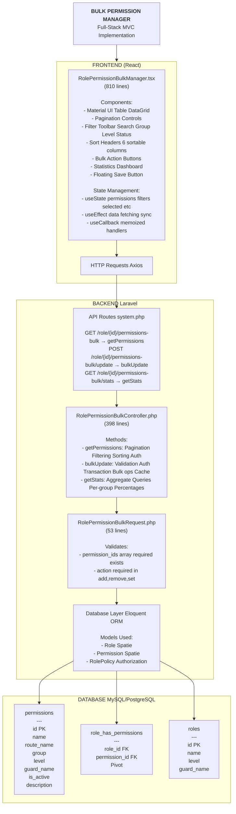
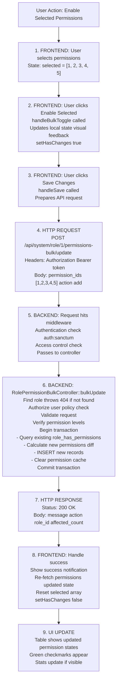
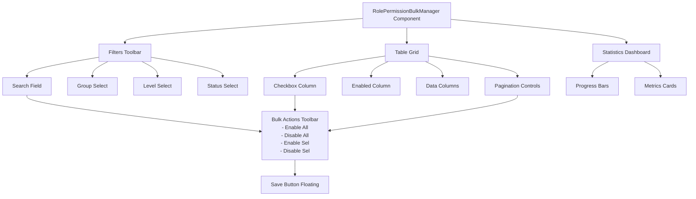
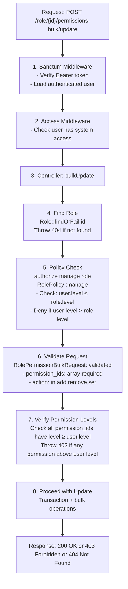
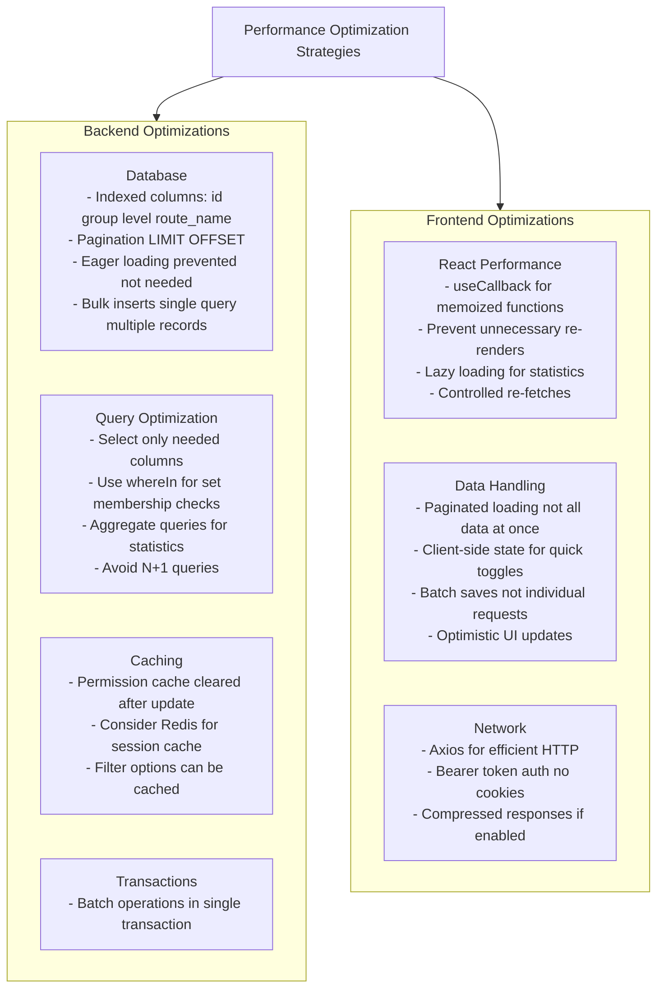

# Bulk Permission Manager - System Architecture Diagram

## High-Level Architecture



## Request Flow Diagram



## Component Interaction Diagram



## Data Flow Diagram

```mermaid
flowchart TD
    Title["Frontend State Management"]
    
    Init["Initial Load<br/>- roleId from URL params<br/>- page = 0<br/>- rowsPerPage = 25<br/>- filters = {search: '' group: '' level: '' ...}"]
    
    UseEffect["useEffect triggers fetchPermissions"]
    
    APICall["API Call<br/>GET /role/{id}/permissions-bulk?page=1&perPage=25"]
    
    Response["Response received"]
    
    StateUpdate["State Updates<br/>- permissions = response.data<br/>- total = response.meta.total<br/>- groups = response.filters.groups<br/>- levels = response.filters.levels<br/>- role = response.role<br/>- originalChecked = Set checked permission IDs"]
    
    UserInteract["User interactions"]
    
    UserActions["User Actions<br/>- Search → updates searchTerm → triggers re-fetch<br/>- Filter → updates filter state → triggers re-fetch<br/>- Sort → updates sort state → triggers re-fetch<br/>- Select → updates selected array → no fetch<br/>- Toggle → updates permission.checked → no fetch<br/>- Page change → updates page → triggers re-fetch"]
    
    ChangeDetect["Changes detected"]
    
    ChangeTrack["Change Tracking<br/>hasChanges = current checked ≠ originalChecked"]
    
    SaveClick["Save button clicked"]
    
    SaveOp["Save Operation<br/>- Calculate diff added removed<br/>- POST /role/{id}/permissions-bulk/update<br/>- Re-fetch permissions after success"]
    
    Title --> Init --> UseEffect --> APICall --> Response --> StateUpdate --> UserInteract --> UserActions --> ChangeDetect --> ChangeTrack --> SaveClick --> SaveOp
```



## Authorization Flow



## Performance Optimization Strategies



## Error Handling Flow

```
Error Scenarios
│
├─ Backend Errors
│   ├─ 404 Not Found
│   │   └─ Role doesn't exist
│   │       └─ Return JSON error message
│   │
│   ├─ 403 Forbidden
│   │   ├─ User unauthorized for role
│   │   └─ Permission level too high
│   │       └─ Return JSON error message
│   │
│   ├─ 422 Validation Error
│   │   └─ Invalid request data
│   │       └─ Return validation errors
│   │
│   └─ 500 Server Error
│       ├─ Database connection failed
│       ├─ Transaction error
│       └─ Unexpected exception
│           └─ Log to Laravel log
│           └─ Return generic error (production)
│
└─ Frontend Handling
    ├─ Axios interceptor catches errors
    ├─ Display notification (react-admin notify)
    ├─ Log to console (development)
    └─ Restore previous state (if needed)
```

This architecture provides a robust, scalable, and maintainable solution for managing thousands of permissions efficiently.
