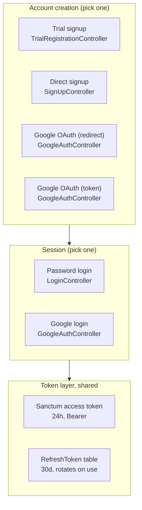
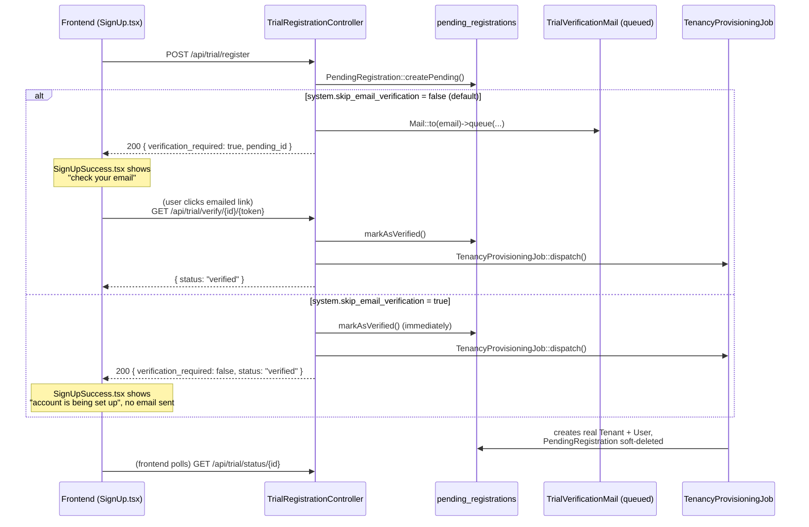
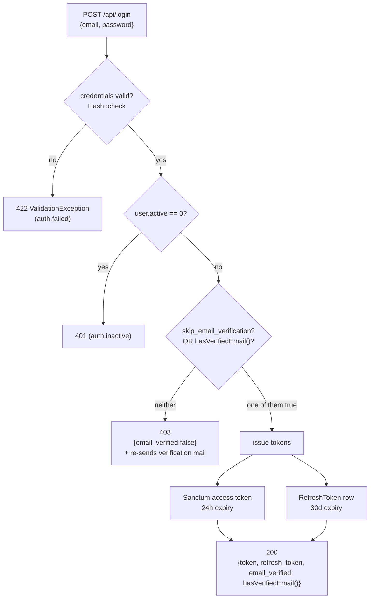

# Core Authentication & Registration Flows

**Category**: Functional Epic — F14: Auth & Access Control
**Status**: Active
**Last Updated**: 2026-08-06
**Scope**: `dash-backend` (core). Domain-specific overrides are called out explicitly where they exist.

---

## 1. Overview

There are **four independent ways an account gets created**, and **two independent ways a session gets authenticated**, sharing a common token layer (Laravel Sanctum + a custom refresh-token table). None of the four registration paths funnel through a shared "create account" service — each controller builds the `User`/`Tenant` pair itself. This is worth knowing before changing any one of them: a fix applied to one path does not apply to the others automatically.



---

## 2. Registration path 1 — Trial signup (deferred provisioning)

**Controller**: `App\Http\Controllers\API\Auth\TrialRegistrationController`
**Routes**: `routes/api.php`, prefix `trial.*`



### Why this flow exists (vs. direct signup)

Trial signup is **asynchronous by design**: `register()` never creates a real `User`/`Tenant` row. It creates a `PendingRegistration` (`app/Models/PendingRegistration.php`), and the real account only comes into existence once `TenancyProvisioningJob` runs — which needs a verified email (or the skip flag) to be dispatched at all. This decouples "the person filled out the form" from "a tenant, with all its seeded roles/settings/currencies, actually exists," which can take longer than a request cycle.

### Key methods

| Method | Route | Behaviour |
|---|---|---|
| `register()` | `POST /api/trial/register` | Validates, creates `PendingRegistration`, then either queues `TrialVerificationMail` or (flag on) verifies+provisions immediately |
| `verifyEmail($id, $token)` | `GET /api/trial/verify/{id}/{token}` | Checks token via `hash_equals`, checks expiry, calls `markAsVerified()`, dispatches `TenancyProvisioningJob` |
| `resendVerification()` | `POST /api/trial/resend` | Re-issues token + extends expiry, re-queues the mail. Always returns success (never reveals whether the email exists — enumeration protection). Short-circuits to a no-op success when the skip flag is on |
| `checkStatus($id)` | `GET /api/trial/status/{id}` | Lets the frontend poll provisioning progress without another email round-trip |

### `PendingRegistration` model (`app/Models/PendingRegistration.php`)

- `status` lifecycle: `pending` → `verified` → `provisioning` → `provisioned` (or `failed`, which `verifyEmail()` can retry by resetting to `pending` and re-dispatching the job)
- `expires_at`: 24 hours from creation/resend; `isExpired()` gates `verifyEmail()`
- `verification_token`: random, compared via `hash_equals()` — timing-safe
- Soft-deletes on successful provisioning (see `TenancyProvisioningJob`); a scheduled command (`registrations:cleanup`, see `app/Console/Kernel.php`) hard-purges stale ones after `system.pending_registrations_cleanup_hours` (default 48h)

### `system.skip_email_verification` (added 2026-08-06)

`config/system.php`:

```php
'skip_email_verification' => env('SKIP_EMAIL_VERIFICATION', false),
```

**Defaults to `false`.** This is a core config key, so the default ships to every deployment including production — an environment that forgets to set the env var must get the *safe* behaviour. Turn it on per-environment:

```
SKIP_EMAIL_VERIFICATION=true
```

When on:
- `register()` calls `$pending->markAsVerified()` and dispatches `TenancyProvisioningJob` synchronously with the request, with no mail sent at all.
- `resendVerification()` answers success immediately without touching the mail system (there is nothing to resend).
- The response's `data.verification_required` field is `false`, which the frontend reads to decide which success-screen copy to show — see §6.

This does **not** make the account instantly usable. Provisioning is still async (`TenancyProvisioningJob` still runs on the queue); the flag only removes the wait for a human to click a link, not the wait for the tenant to actually be provisioned.

**Why this exists**: environments where outbound SMTP is genuinely unreachable (a firewalled dev machine, an air-gapped install) would otherwise have registration silently die — the mail job queues, retries with the real SMTP host, times out repeatedly, and lands in `failed_jobs` via `MaxAttemptsExceededException`, while the account sits forever unverified with no way to unblock it from the browser.

---

## 3. Registration path 2 — Direct signup

**Controller**: `App\Http\Controllers\API\Auth\SignUpController`
**Route**: `POST /api/auth/user/signup`

Unlike trial signup, this creates the **real** `Tenant` and `User` rows synchronously, in one request, wrapped in a DB transaction:

1. Validate (email/public_id uniqueness, password confirmation, plan existence)
2. `Tenant::create([...])`
3. `User::create([...])` — `tenant_id` set, `active: true`, **no `email_verified_at`**
4. Assign the `tenant_admin` role (via `config('permission.tenant_admin.role')`, falling back to a hardcoded `tenant_admin` lookup if the config key is unset — logs a warning either way if no role is found)
5. `SubscriptionService::createTrialSubscription($user, $plan)`
6. **Verification step** (patched 2026-08-06):
   ```php
   if (config('system.skip_email_verification', false)) {
       $user->forceFill(['email_verified_at' => now()])->save();
   } else {
       $user->sendEmailVerificationNotification();
   }
   ```
   This uses Laravel's *native* `MustVerifyEmail` notification system (`App\Notifications\VerifyEmail` / `CustomVerifyEmail`), which is a **completely different mechanism** from trial signup's `PendingRegistration`+`TrialVerificationMail` — see §5 for why both exist.

The account exists and can attempt to log in immediately either way; whether login actually succeeds depends on the login gate (§4).

---

## 4. Login

**Controller**: `App\Http\Controllers\API\Auth\LoginController`
**Route**: `POST /api/login` (middleware `guest:sanctum`)



### The verification gate (patched 2026-08-06)

```php
if (!config('system.skip_email_verification', false) && !$user->hasVerifiedEmail()) {
    $user->sendEmailVerificationNotification();
    return ResponseHandler::json([
        'message' => 'Your email address is not verified...',
        'email_verified' => false
    ], 403);
}
```

This check has to move **together** with the two registration paths' skip logic, not independently — an account created *before* the flag was turned on is still sitting there with `email_verified_at = NULL`. If only the registration paths were patched, those old accounts would remain locked out here, emailing a link that (in an environment configured this way) is typically unreachable.

### `email_verified` in the success response

Previously hardcoded `true` — harmless before this flag existed, because reaching that line of code was itself proof of verification. With the gate skippable, that stopped being true, so it now reports the real value: `'email_verified' => $user->hasVerifiedEmail()`. A client can use this to show a "verify your email" banner for an account that logged in without ever actually verifying.

### Token issuance

- **Access token**: `$user->createToken('api', ['*'], $expiresAt)` — Sanctum, 24h (`Carbon::now()->addHours(24)`), sent as `Authorization: Bearer <token>`.
- **Refresh token**: a *separate*, custom mechanism (`App\Models\RefreshToken`, **not** part of Sanctum) — see §7.
- `RefreshToken::cleanupOldTokens($user->id, $deviceName)` runs on every login, keyed by the `X-Device-Name` header (defaults to `'web'`) — old tokens for the *same device* are cleaned up, so logging in again from the same browser doesn't accumulate refresh tokens forever, while logging in from a *different* device leaves the other session's token alone.

### `determineRedirectUrl()`

Login also computes a `redirectTo` in the response — tenant-specific post-login landing logic. Not covered in depth here; see the method itself in `LoginController` if you need to change where a given role lands after login.

---

## 5. Two verification mechanisms — do not confuse them

| | **Trial flow** | **Native Laravel flow** |
|---|---|---|
| Used by | `TrialRegistrationController` only | `SignUpController`, `LoginController`, `GoogleAuthController` (indirectly) |
| Storage | `pending_registrations.email_verified_at` (a *pre-account* record) | `users.email_verified_at` (via `MustVerifyEmail` trait on `User`) |
| Mail class | `App\Mail\TrialVerificationMail` (plain `Mailable`) | `App\Notifications\VerifyEmail` / `CustomVerifyEmail` (a Notification, dispatched via `sendEmailVerificationNotification()`) |
| Verify route | `GET /api/trial/verify/{id}/{token}` — public, token in URL | `GET /api/email/verify/{id}/{hash}` — **behind `auth:sanctum`**, requires the user to already be logged in |
| Token check | `hash_equals($pending->verification_token, $token)` | `hash_equals($hash, sha1($user->getEmailForVerification()))`, Laravel's standard signed-hash scheme |

**The trial flow's verify link works for a logged-out visitor** (there's no account yet to log into). **The native flow's verify link requires an active session** — which is why a direct-signup user who never verifies still has a working `POST /api/auth/user/signup` response with a real token; verifying is a *separate authenticated action*, not a gate on the initial response.

Two email verification routes are wired for the native flow — an old, commented-out block in `routes/api.php` (`email/verification/send`, `email/verification/verify/{id}/{hash}`) is marked "old one, not tested" and dead; the active ones are `email/verify/{id}/{hash}` and `email/verification-notification`.

---

## 6. Google OAuth

**Controller**: `App\Http\Controllers\API\Auth\GoogleAuthController`
**Routes**: `routes/api.php`, prefix `auth/google/*`

Two independent code paths exist for the *same* provider, because there are two different frontend integration styles:

### 6a. Redirect flow (`redirectToGoogle` → `handleGoogleCallback`)

Classic OAuth redirect dance via `Laravel\Socialite`. Stores `google_is_signup`/`google_signup_plan_id` in the **session** before redirecting to Google, reads them back in the callback (`Session::get`, then `Session::forget`), and branches to `handleGoogleSignup()` or `handleGoogleLogin()`. Ends by redirecting *back to the frontend* (`$this->getFrontendUrl()`) with query-string success/error signaling — this is a full-page redirect flow, not an API call the frontend awaits.

### 6b. Token flow (`authenticateWithGoogle`)

For an SPA using Google's client-side SDK directly: the frontend gets a Google ID token itself and POSTs it to `POST /api/auth/google/authenticate` with `{ google_token, is_signup, plan_id }`. The backend verifies it server-side via `Google_Client->verifyIdToken()`, then branches to `apiGoogleSignup()`/`apiGoogleLogin()` — same account logic as 6a's handlers, structurally duplicated rather than shared.

### Verification is a non-issue for Google accounts

Both signup handlers set `'email_verified_at' => now()` **unconditionally** at user creation — Google has already verified the email, so there is nothing for `system.skip_email_verification` to affect here. If you're auditing "does the skip flag cover every path," Google is the one path that was already always-skipped, by design, before this flag existed.

---

## 7. Refresh tokens

**Model**: `App\Models\RefreshToken`
**Controller**: `App\Http\Controllers\API\Auth\RefreshTokenController`

This is a **custom table**, not a Sanctum feature — Sanctum only provides the short-lived (24h) access token. Long-lived sessions are built on top via this separate mechanism.

| Route | Auth | Purpose |
|---|---|---|
| `POST /api/auth/refresh` | none (the whole point — access token may be expired) | Exchange a valid refresh token for a new access token + a **new** refresh token |
| `GET /api/auth/sessions` | `auth:sanctum` | List this user's active (non-revoked, non-expired) refresh-token "sessions" — device name, IP, last used |
| `POST /api/auth/revoke-all` | `auth:sanctum` | Revoke every refresh token for the current user (log out everywhere) |
| `DELETE /api/auth/sessions/{id}` | `auth:sanctum` | Revoke one specific session |

**Token rotation**: every successful `/api/auth/refresh` call revokes the *old* refresh token and issues a brand-new one (`Str::random(64)`, stored hashed as `hash('sha256', $plain)`). The plaintext is only ever returned once, in the refresh response — same one-time-reveal pattern as the access token. This means refresh tokens are single-use; a client must persist the *new* one from every refresh response or the next refresh will fail.

`RefreshToken::EXPIRATION_DAYS = 30`.

---

## 8. Core vs. domain: what gets overridden

Neither `vanexa-backend-domain` nor `kitchntabs-backend-domain` currently overrides the **trial** flow — `TrialRegistrationController`, `PendingRegistration`, and the `skip_email_verification` flag behave identically for both projects, differing only by their respective `.env`/production config.

`kitchntabs-backend-domain` **does** override two pieces, both at `app/Http/Controllers/API/Auth/`, declared under the **same** `App\Http\Controllers\API\Auth` namespace core uses (not `Domain\App\...`) — worth flagging because this is a different override style than the `class_exists()`-guarded pattern used elsewhere in the codebase (e.g. `Tenant::getDomainSettingFormats()`), and the exact resolution mechanism (composer classmap regeneration favoring the domain-mounted path) wasn't independently re-verified while writing this doc — confirm against the live `vendor/composer/autoload_classmap.php` if you need certainty on precedence.

- **`LoginController`** (kitchntabs) — a much simpler rewrite: no email-verification check *at all* (so `skip_email_verification` is moot for kitchntabs' login — it never gated on verification in the first place), no refresh token, a plain non-expiring Sanctum token (`$user->createToken('api')`, no explicit expiry/scope). If you're debugging "why doesn't the verification gate apply on kitchntabs," this is why — it's a pre-existing divergence, unrelated to the new flag.
- **`EmailVerificationController`** (kitchntabs) — functionally near-identical to core's, but the file is marked `// @Deprecated, this is not a domain controller` in a comment. Treat as legacy; don't extend it without first confirming it's actually the one being routed to.

---

## 9. Frontend integration

**Apps**: `kitchntabs-frontend/apps/vanexa-web`, `apps/vanexa-system` (identical logic in both; `vanexa-app` has an unrelated `Signup.tsx` under `components/theme/` that is not part of this flow)

### Public config

`GET /api/public/system-config` (`SystemConfigController`, cached 1h via `Cache::remember`) publishes `email_verification_required` — merged **after** the cache block deliberately, since it's a cheap config read and putting it inside the hour-long cache would make toggling the env var appear to do nothing for up to an hour. This is **advisory only**: it lets the signup form pre-emptively adjust copy/expectations, but it is not authoritative for any single registration.

### The authoritative signal: the register response itself

`SignUp.tsx`:
```ts
const response = await axios.post('/trial/register', submitData);
const verificationRequired = response.data?.data?.verification_required !== false;
navigate('/signup-success', { state: { email, message, verificationRequired } });
```

Reading `verification_required` from **this specific response**, not from the cached public config, means the success screen can never contradict what the backend actually did for *this* registration — a cached config value could theoretically be stale relative to a mid-flight config change; this field cannot be.

### `SignUpSuccess.tsx`

```ts
const { email, planName, verificationRequired = true } = location.state || {};
```

Defaults to `true` — an older backend (pre-flag) or a direct navigation to this URL with no router state preserves the original "check your email" copy rather than silently claiming no verification is needed. Renders either the email-sent `Alert` or a `noVerificationNeeded` alert (`i18n` key added to both `es.tsx`/`en.tsx` in both apps) depending on the flag.

### `TrialVerify.tsx`

Handles the `GET /trial/verify/{id}/{token}` link click itself — unaffected by the skip flag (a skipped registration never generates this link in the first place, since no email is sent).

---

## 10. Operational reference

### Enabling the skip flag locally

The flag lives in `config/system.php`, which is **not** bind-mounted into the local dev container by default — only `firebase.php`, `broadcasting.php`, and `horizon.php` were previously mounted individually (`dash-backend-docker/docker-compose.yml`). `system.php` was added to that list specifically to support live-editing this flag; without it, a new key added to `config/system.php` reads as `NULL` regardless of the `.env` value, because the container runs the version baked into the image at build time.

Set in the relevant `.env.<project>.<environment>` file (`dash-backend-docker/`):
```
SKIP_EMAIL_VERIFICATION=true
```

### Gotcha: config-cache staleness across process types

`php artisan config:clear && php artisan config:cache` is necessary after changing this value **and is not enough on its own** if the app is being served by a long-running `php-fpm` process (as opposed to `php artisan tinker`, which always starts a fresh CLI process with no carried-over state). Two separate staleness mechanisms can bite here:

1. **Config cache file staleness** — fixed by `config:clear` + `config:cache`.
2. **`putenv()` persistence within a long-lived FPM worker** — `vlucas/phpdotenv` (via Laravel) calls `putenv()` when loading `.env`. Unlike `$_ENV`/`$_SERVER` (reset per-request by PHP-FPM), `putenv()`-set values persist for the *life of the OS process*. Laravel's Dotenv runs in **immutable** mode — if a variable is already present in the environment (including a stale value a previous request's `putenv()` call left behind), it will **not** overwrite it with the current file's value. A worker that ever served a request while the `.env` file said `false` can keep silently reading `false` from its own process memory indefinitely, even after the file is corrected and even after `config:cache` is refreshed — because the value never comes from the file at all for that worker anymore, it comes from `putenv()` state that outlived the request that set it.

   Symptom: `php artisan tinker` correctly shows the new value; real HTTP requests keep behaving as if it's still the old one.

   `kill -USR2 <fpm-master-pid>` (graceful reload) is **not sufficient** — it restarts *worker* processes, but they fork from the *master*, and a worker that inherits a poisoned environment... in practice the only reliable fix observed was a full container restart (`docker compose up -d --force-recreate app`, then re-run `composer install` for the post-autoload-dump config cache steps), which guarantees no PHP process anywhere in the container carries forward stale `putenv()` state.

### `.env` bind-mount gotcha

Never edit a bind-mounted `.env` file with `sed -i` — it replaces the file's inode, which detaches Docker's bind mount (the container keeps the *old*, now-unlinked file open, or loses it entirely depending on mount type). Symptom: the app suddenly can't connect to anything (`SQLSTATE[08006]... no password supplied`), because `/var/www/dash/.env` effectively vanished from the container's point of view. Edit in place (e.g. read-modify-write the full file content back to the same path, as `python3 -c "pathlib.Path(...).write_text(...)"` does) so the inode is preserved.

---

## 11. Quick reference — where to change what

| I want to... | Touch this |
|---|---|
| Change trial signup's validation rules | `TrialRegistrationController::register()` |
| Change what happens after trial email verification | `TrialRegistrationController::verifyEmail()` + `TenancyProvisioningJob` |
| Change direct signup's account creation | `SignUpController::signup()` |
| Change the login verification gate | `LoginController` (core) — and check whether the target project has a domain override first (§8) |
| Change access token lifetime | `LoginController` / `RefreshTokenController`, `Carbon::now()->addHours(24)` |
| Change refresh token lifetime | `RefreshToken::EXPIRATION_DAYS` |
| Add a project-specific skip-verification default | Do **not** put this in `domain/config/system.php` — `mergeConfigFrom()`'s semantics mean core's value always wins for a scalar key, silently discarding a domain override (see comments in `AppServiceProvider::registerDomainConfigLayers()`). Use the project's own `.env.<project>.<environment>` file instead |
| Skip verification for Google signups | Nothing to do — already unconditional (§6) |
