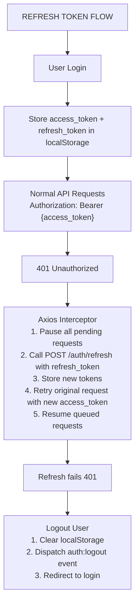

# Refresh Token Implementation

## Overview

This document describes the implementation of a refresh token mechanism for the Dash application. The feature enables seamless session persistence by automatically refreshing expired access tokens without requiring user re-authentication.

## Problem Statement

Previously, the application used long-lived access tokens (1 year expiration) which posed security risks:
- Stolen tokens remained valid for extended periods
- No mechanism to invalidate specific sessions
- No visibility into active sessions across devices

## Solution Architecture

### Token Strategy

| Token Type | Expiration | Storage | Purpose |
|------------|------------|---------|---------|
| Access Token | 24 hours | localStorage | API authentication |
| Refresh Token | 30 days | localStorage | Obtain new access tokens |

### Security Features

1. **Token Rotation**: Each refresh generates a new refresh token, invalidating the old one
2. **Device Tracking**: Tokens are associated with device name, IP, and user agent
3. **Session Management**: Users can view and revoke active sessions
4. **Automatic Cleanup**: Expired/revoked tokens are periodically purged

---

## Backend Implementation

### Database Schema

```sql
CREATE TABLE refresh_tokens (
    id BIGINT UNSIGNED AUTO_INCREMENT PRIMARY KEY,
    user_id BIGINT UNSIGNED NOT NULL,
    token VARCHAR(64) UNIQUE NOT NULL,  -- SHA-256 hash of plain token
    device_name VARCHAR(255),
    ip_address VARCHAR(45),
    user_agent VARCHAR(255),
    expires_at TIMESTAMP NOT NULL,
    last_used_at TIMESTAMP NULL,
    is_revoked BOOLEAN DEFAULT FALSE,
    created_at TIMESTAMP,
    updated_at TIMESTAMP,
    
    FOREIGN KEY (user_id) REFERENCES users(id) ON DELETE CASCADE,
    INDEX idx_token_valid (token, is_revoked, expires_at),
    INDEX idx_user_revoked (user_id, is_revoked)
);
```

### API Endpoints

#### Authentication

| Method | Endpoint | Auth | Description |
|--------|----------|------|-------------|
| POST | `/login` | No | Login, returns access + refresh tokens |
| POST | `/logout` | Yes | Logout current device |
| POST | `/logout-all` | Yes | Logout all devices |
| POST | `/auth/refresh` | No | Exchange refresh token for new tokens |

#### Session Management

| Method | Endpoint | Auth | Description |
|--------|----------|------|-------------|
| GET | `/auth/sessions` | Yes | List active sessions |
| POST | `/auth/revoke-all` | Yes | Revoke all refresh tokens |
| DELETE | `/auth/sessions/{id}` | Yes | Revoke specific session |

### Login Response

```json
{
    "token": "1|abc123...",
    "refresh_token": "randomString64chars...",
    "expires_at": "2025-12-31 10:00:00",
    "refresh_expires_at": "2026-01-29 10:00:00",
    "email_verified": true,
    "user": {
        "id": 1,
        "name": "John Doe",
        "email": "john@example.com"
    },
    "redirectTo": "/tab/tab"
}
```

### Refresh Token Response

```json
{
    "token": "2|newToken...",
    "refresh_token": "newRefreshToken64chars...",
    "expires_at": "2026-01-01 10:00:00",
    "refresh_expires_at": "2026-01-30 10:00:00",
    "user": {
        "id": 1,
        "name": "John Doe",
        "email": "john@example.com"
    }
}
```

### Sessions Response

```json
{
    "sessions": [
        {
            "id": 1,
            "device_name": "web",
            "ip_address": "192.168.1.1",
            "last_used_at": "2025-12-30 09:00:00",
            "created_at": "2025-12-01 10:00:00",
            "expires_at": "2025-12-31 10:00:00",
            "is_current": true
        }
    ]
}
```

### Key Files

| File | Description |
|------|-------------|
| `app/Models/RefreshToken.php` | Eloquent model with token management methods |
| `app/Http/Controllers/API/Auth/LoginController.php` | Updated login/logout with refresh token support |
| `app/Http/Controllers/API/Auth/RefreshTokenController.php` | Refresh and session management endpoints |
| `database/migrations/2025_12_30_000001_create_refresh_tokens_table.php` | Database migration |
| `app/Console/Commands/CleanupExpiredRefreshTokens.php` | Scheduled cleanup command |

### RefreshToken Model Methods

```php
// Create a new refresh token for a user
RefreshToken::createForUser(User $user, ?string $deviceName, ?string $ipAddress, ?string $userAgent): RefreshToken

// Find a valid token by its plain text value
RefreshToken::findByToken(string $plainToken): ?RefreshToken

// Revoke all tokens for a user
RefreshToken::revokeAllForUser(int $userId): int

// Clean up expired tokens (for scheduled task)
RefreshToken::cleanupExpired(): int
```

---

## Frontend Implementation

### Token Flow



### Axios Interceptor Logic

The interceptor in `useAxios.tsx` handles automatic token refresh:

```typescript
// Key features:
// 1. Detects 401 errors (excluding auth endpoints)
// 2. Queues concurrent requests during refresh
// 3. Retries failed requests after successful refresh
// 4. Triggers logout if refresh fails

instance.interceptors.response.use(
    (response) => response,
    async (error) => {
        if (error.response?.status === 401 && !originalRequest._retry) {
            // Skip for auth endpoints to prevent loops
            if (isAuthEndpoint) return Promise.reject(error);
            
            // Queue if already refreshing
            if (isRefreshing) {
                return new Promise((resolve, reject) => {
                    failedQueue.push({ resolve, reject });
                }).then(token => {
                    // Retry with new token
                });
            }
            
            // Attempt refresh
            const newToken = await refreshAccessToken();
            if (newToken) {
                // Success: retry request
            } else {
                // Failure: logout
                handleLogout();
            }
        }
    }
);
```

### Key Files

| File | Description |
|------|-------------|
| `packages/dash-axios-hook/src/hooks/useAxios.tsx` | Axios interceptor with auto-refresh |
| `packages/dash-admin/src/contexts/auth/DASHAuthenticationService.tsx` | Auth service with refresh support |
| `apps/kitchntabs/src/dash-extensions/config/DASHAuthProvider.tsx` | React-Admin auth provider |
| `apps/kitchntabs/src/KitchnTabsBootstrap.tsx` | App bootstrap with logout event listener |

### Storage Keys

| Key | Content |
|-----|---------|
| `token` | Current access token |
| `refreshToken` | Current refresh token |
| `authenticated` | Boolean flag |
| `user` | User object JSON |

---

## Configuration

### Backend Configuration

#### Token Expiration

In `RefreshToken.php`:
```php
public const EXPIRATION_DAYS = 30;  // Refresh token validity
```

In `LoginController.php`:
```php
$expiresAt = Carbon::now()->addHours(24);  // Access token validity
```

#### Scheduled Cleanup

Add to `app/Console/Kernel.php`:
```php
protected function schedule(Schedule $schedule): void
{
    $schedule->command('tokens:cleanup')->daily();
}
```

### Frontend Configuration

The axios instance automatically uses the configured `ADMIN_API_URL` from `DASHAdminSystemConstants`.

---

## Deployment

### Backend

1. Run the migration:
```bash
php artisan migrate
```

2. (Optional) Schedule token cleanup:
```bash
# Add to crontab or Laravel scheduler
php artisan tokens:cleanup
```

### Frontend

No special deployment steps required. The changes are automatically included in the build.

---

## Error Codes

| Code | Description |
|------|-------------|
| `INVALID_REFRESH_TOKEN` | Refresh token is invalid or expired |
| `USER_NOT_FOUND` | User associated with token no longer exists |
| `USER_INACTIVE` | User account has been deactivated |

---

## Security Considerations

1. **Token Storage**: Tokens are stored in localStorage. For higher security environments, consider HttpOnly cookies.

2. **Token Rotation**: Each refresh invalidates the previous refresh token, limiting the window of opportunity for stolen tokens.

3. **Device Tracking**: IP and User-Agent are logged for audit purposes.

4. **Rate Limiting**: Consider adding rate limiting to the `/auth/refresh` endpoint to prevent abuse.

5. **HTTPS**: Always use HTTPS in production to protect tokens in transit.

---

## Testing

### Manual Testing

1. Login and verify both tokens are stored
2. Wait for access token to expire (or manually delete it)
3. Make an API request and verify automatic refresh
4. Verify old refresh token is invalidated
5. Test logout and verify tokens are cleared

### Automated Testing

```php
// Example PHPUnit test
public function test_refresh_token_returns_new_tokens()
{
    $user = User::factory()->create();
    $refreshToken = RefreshToken::createForUser($user);
    
    $response = $this->postJson('/api/auth/refresh', [
        'refresh_token' => $plainToken,
    ]);
    
    $response->assertOk()
        ->assertJsonStructure(['token', 'refresh_token', 'expires_at']);
}
```

---

## Changelog

- **2025-12-30**: Initial implementation
  - Added RefreshToken model and migration
  - Updated LoginController with refresh token generation
  - Created RefreshTokenController for token refresh and session management
  - Added Axios interceptor for automatic token refresh
  - Updated DASHAuthenticationService for refresh token handling
