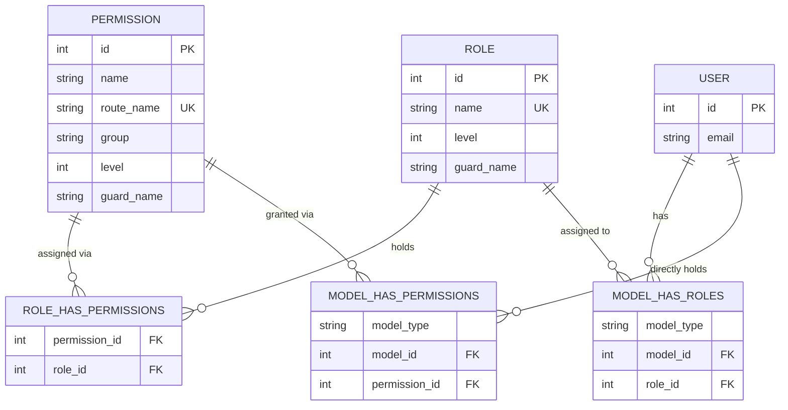
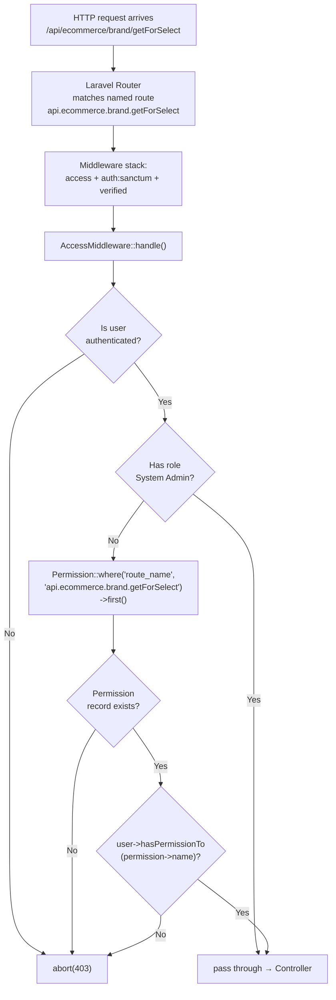
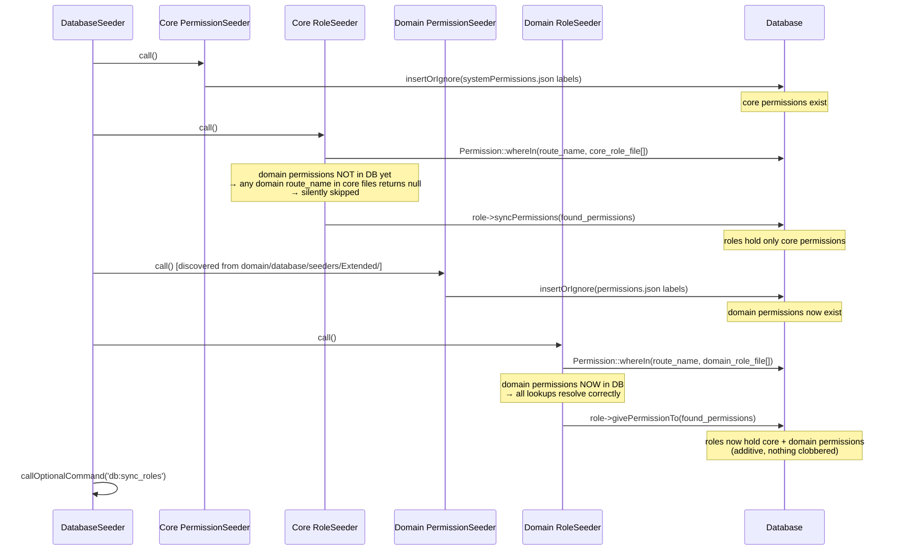
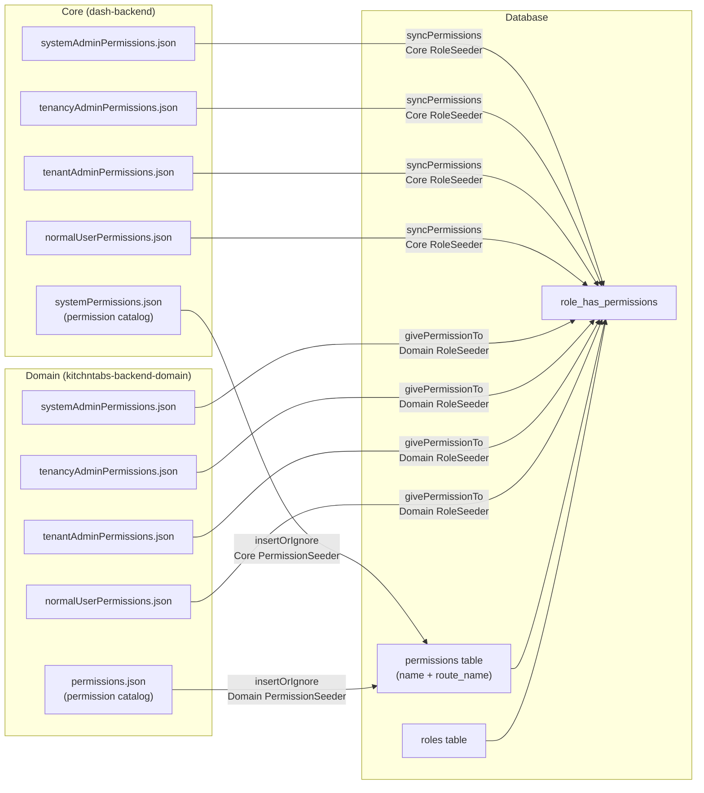
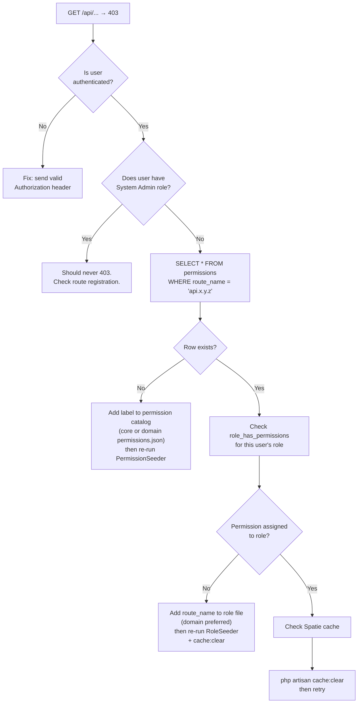

# Role Permission System

## Canonical Doc

This is the single consolidated reference for the DASH role and permission system. It replaces the fragmented role-permission notes and should be treated as the source of truth for access control behavior, default role permissions, and seeding workflow.

## What The System Does

The backend uses Spatie Laravel Permission plus a route-name based access layer. Permissions are stored in the database, default role assignments are stored in JSON files, and route access is enforced by middleware.

The important rule is simple: if a route is protected by `AccessMiddleware`, the authenticated user must either be a System Admin or have a matching permission for that route name.

## Role Hierarchy

Lower level numbers mean higher authority.

| Role | Constant | Level | Intent |
|------|----------|-------|--------|
| System | `Role::NAME_SYSTEM_ADMIN` | 0 | Full system access and middleware bypass |
| TenancyAdmin | `Role::NAME_TENANCY_ADMIN` | 1 | Multi-tenant administration |
| Tenant | `Role::NAME_TENANT_ADMIN` | 2 | Tenant business operations |
| User | `Role::NAME_NORMAL_USER` | 3 | Read-only or limited operational access |

## Domain-Only Roles

Roles with no core equivalent are defined in `Domain\App\Models\Extended\Role` (extends the core `Role` model) and seeded by the domain `RoleSeeder` alongside the four core roles above.

| Role | Constant | Level | Default permissions file |
|------|----------|-------|---------------------------|
| TenantServiceAccount | `Role::NAME_TENANT_SERVICE_ACCOUNT` | 13 | `tenantServiceAccountPermissions.json` |
| MallServiceAccount | `Role::NAME_MALL_SERVICE_ACCOUNT` | 14 | `mallServiceAccountPermissions.json` |
| Kitchen | `Role::NAME_KITCHEN` | 15 | `kitchenPermissions.json` |
| Staff | `Role::NAME_STAFF` | 16 | `staffPermissions.json` |

These four currently mirror `normalUserPermissions.json` verbatim — they are placeholders pending a dedicated permission review per role, not a final permission set.

## Permission Naming

Permissions follow the route-name convention:

`api.{context}.{resource}.{action}`

Examples:

- `api.system.roles.getList`
- `api.system.permissions.create`
- `api.ecommerce.currency.getMany`
- `api.ecommerce.currency.getManyReference`

## Runtime Enforcement

Protected API routes use `AccessMiddleware`:

1. Guests are denied.
2. System Admin users pass immediately.
3. Other users must have the permission that matches the route name.
4. Otherwise the request is rejected with `403`.

This means a permission must exist in both places to work correctly:

- in the permission catalog, so the middleware can resolve it
- in the role default JSON, so the seeder and sync command can assign it

## Default Permission Files

Default role permissions live in `database/data/rolePermissions/`:

- `systemAdminPermissions.json`
- `tenantAdminPermissions.json`
- `normalUserPermissions.json`

These files define the default permission set that should be synced to each role during seeding or when the new automation command is used.

## Seeding Flow

The normal bootstrap order is:

1. `PermissionSeeder` loads `database/data/systemPermissions.json`.
2. The domain-layer `Domain\Database\Seeders\Extended\PermissionSeeder` loads `database/data/permissions.json` from the mounted domain repo.
3. `RoleSeeder` creates the four roles and syncs their permissions from the role JSON files.
4. `UserSeeder` creates users and assigns roles.

If permissions change, rerun the relevant seeders and clear the Spatie cache.

## Automation Command

Use the new artisan command to persist a permission to a role default file and sync the role immediately:

```bash
php artisan permissions:role-default-upsert User api.ecommerce.currency.getMany --dry-run
php artisan permissions:role-default-upsert User api.ecommerce.currency.getMany
```

What it does:

- adds the route to the role’s JSON defaults if it is missing
- creates the database permission row if it does not already exist
- attaches the requested permission to the live role
- clears the permission cache

## Updating Or Troubleshooting Access

If a user gets `403` for a route that should be allowed, check these in order:

1. The route has `access` middleware and a permission record exists for its route name.
2. The role default JSON includes the route name.
3. The role has been synced after the JSON change.
4. The Spatie permission cache has been cleared.

Useful commands:

```bash
php artisan validate:role-permissions
php artisan db:seed --class=PermissionSeeder
php artisan db:seed --class=RoleSeeder
php artisan cache:clear
```

## Canonical Files

- `app/Http/Middleware/AccessMiddleware.php`
- `app/Console/Commands/UpsertRoleDefaultPermission.php`
- `database/seeders/PermissionSeeder.php`
- `database/seeders/RoleSeeder.php`
- `kitchntabs-backend-domain/database/seeders/Extended/PermissionSeeder.php`
- `database/data/systemPermissions.json`
- `database/data/rolePermissions/systemAdminPermissions.json`
- `database/data/rolePermissions/tenantAdminPermissions.json`
- `database/data/rolePermissions/normalUserPermissions.json`

## Notes For Current Case

The route `api.ecommerce.currency.getMany` already belongs in the permission catalog and the normal-user default file. If a User role still receives `403`, the likely fix is to resync the role from the default file using the new command above, then clear cache.

## Superseded Documents

This document replaces the fragmented notes that previously lived across multiple permission docs and role-test references. Keep this file updated when permission behavior changes.

---

# Routes and Permissions — Technical Reference

## Overview

The DASH framework enforces access control at the HTTP route level using a two-layer permission system. Routes are named by a dot-notation convention, that same name is stored as a `route_name` in the `permissions` table, and `AccessMiddleware` performs an exact lookup at request time. There is no wildcard matching.

This section documents the full lifecycle: how routes are registered, how permissions are cataloged, how roles are seeded, and how the two layers (core and domain) interact without clobbering each other.

---

## Entity–Relationship Diagram



`route_name` is the join key between a Laravel named route and its DB permission record. If a route has no matching `permissions.route_name`, `AccessMiddleware` will always return `403` regardless of the user's role.

---

## Route Naming Convention

All protected routes follow the pattern:

```
api.{context}.{resource}.{action}
```

For trash sub-resources:

```
api.{context}.{resource}.trash.{action}
```

The `{action}` values come directly from `config/react-admin-methods.php` (the `name` key of each loop iteration, which becomes the Laravel route `->name()` suffix).

| Context | Example resources |
|---------|------------------|
| `ecommerce` | `brand`, `gallery`, `product`, `pricelists`, `stock_type`, … |
| `tenant` | `tenant`, `user`, `roles` |
| `system` | `users`, `tenant`, `role`, `subscriptions`, … |
| `app` | `logs`, `tenant` |
| `common` | `country`, `region`, `communes`, `currency` |
| `tab` | `tab`, `cashcount`, `kitchentab` |

---

## React-Admin Methods — Full Route Table

`config/react-admin-methods.php` is the single source of truth for which HTTP verb, path suffix, and controller method are registered per resource. Every resource group iterates this config unless explicitly filtered.

| Key (→ route name suffix) | HTTP Method | Path | Controller Method | Mode |
|--------------------------|-------------|------|-------------------|------|
| `getList` | GET | `/` | `getList` | view |
| `getMany` | GET | `/getMany` | `getMany` | view |
| `getManyReference` | GET | `/getManyReference` | `getManyReference` | view |
| `getForSelect` | GET | `/getForSelect` | `getForSelect` | view |
| `filterValues` | GET | `/filter/{field}` | `filterValues` | view |
| `filterValue` | GET | `/filter/{field}/getMany` | `filterValue` | view |
| `auditAll` | GET | `/audit` | `auditAll` | view |
| `audit` | GET | `/audit/{id}` | `audit` | view |
| `interfaces` | GET | `/interfaces` | `interfaces` | view |
| `getOne` | GET | `/{id}` | `getOne` | getOne |
| `update` | PUT | `/{id}` | `update` | view |
| `postUpdate` | POST | `/{id}/update` | `update` | edit |
| `partial` | POST | `/partial/{id}` | `partial` | view |
| `updateMany` | POST | `/updateMany` | `updateMany` | edit |
| `create` | POST | `/` | `create` | edit |
| `putCreate` | PUT | `/` | `create` | edit |
| `delete` | DELETE | `/{id}` | `delete` | edit |
| `postDelete` | POST | `/{id}/delete` | `delete` | edit |
| `deleteMany` | POST | `/deleteMany` | `deleteMany` | edit |

Trash sub-groups apply a filter: only `getList`, `update`, `delete`, `updateMany`, `deleteMany` (and their post-variants via controller method matching) are registered.

---

## Route Registration Flow



**Critical invariant:** a permission record must exist in the `permissions` table AND be assigned to the user's role. Absence of either causes a `403`, with no fallback.

---

## Domain Route Loading

Core routes (`dash-backend/routes/api.php`) conditionally include the domain route loader:

```php
// dash-backend/routes/api.php (simplified)
if (file_exists(base_path('domain/routes/api.php'))) {
    require $apiRoutesPath;
}
```

The domain loader (`kitchntabs-backend-domain/routes/api.php`) then globs all files in `domain/routes/api/*.php`:

```php
foreach (glob(base_path('domain/routes/api/*.php')) as $apiRoutesPath) {
    require $apiRoutesPath;
}
```

This means `ecommerce.php`, `tenant.php`, etc. are loaded at Laravel bootstrap time and registered into the same route table as core routes. The domain routes carry the same `['middleware' => ['access', 'auth:sanctum', 'verified']]` stack.

---

## Permission Catalog Structure

Both layers use the same JSON schema for their permission catalogs, differing only in path:

| Layer | Catalog file |
|-------|-------------|
| Core | `dash-backend/database/data/systemPermissions.json` |
| Domain | `kitchntabs-backend-domain/database/data/permissions.json` |

Schema:

```json
[
  {
    "group": "ecommerce.brand",
    "level": 2,
    "labels": [
      { "name": "Get For Select Brand", "route_name": "api.ecommerce.brand.getForSelect" },
      { "name": "Get List Brand",       "route_name": "api.ecommerce.brand.getList" }
    ]
  }
]
```

`route_name` must match the Laravel named route exactly. The `name` field is the human-readable label stored in `permissions.name`; `AccessMiddleware` uses `hasPermissionTo(permission->name)` — but looks up the permission object by `route_name` first.

---

## Full Seeding Flow



### Why `givePermissionTo` instead of `syncPermissions`

The core `RoleSeeder` uses `syncPermissions`, which **replaces** all role permissions atomically. The domain `RoleSeeder` must use `givePermissionTo` (**additive**) because it runs after the core seeder has already established the role's core permissions. Using `syncPermissions` in the domain seeder would erase everything the core seeder assigned.

| Method | Behavior | Used by |
|--------|----------|---------|
| `syncPermissions($permissions)` | Replaces all existing role permissions | Core `RoleSeeder` |
| `givePermissionTo($permissions)` | Adds to existing role permissions | Domain `RoleSeeder` |

---

## Two-Layer Permission File Map



**Rule:** if a permission's `route_name` is not yet in the `permissions` table when a seeder calls `whereIn('route_name', [...])`, that entry is silently dropped. Domain route_names must never appear only in core role files; they belong in the domain role files which run after the domain PermissionSeeder.

---

## Trash Sub-Resource Permission Pattern

Resources with soft-delete support register a nested `trash` route group. The trash group only exposes the following actions (filtered from `react-admin-methods.php`):

```
getList   → GET    /ecommerce/{resource}/trash
update    → PUT    /ecommerce/{resource}/trash/{id}
delete    → DELETE /ecommerce/{resource}/trash/{id}
updateMany → POST  /ecommerce/{resource}/trash/updateMany
deleteMany → POST  /ecommerce/{resource}/trash/deleteMany
postUpdate → POST  /ecommerce/{resource}/trash/{id}/update    (alias)
postDelete → POST  /ecommerce/{resource}/trash/{id}/delete    (alias)
```

These produce route names like `api.ecommerce.gallery.trash.getList`. They must appear explicitly in both the permission catalog and the role files — the shorthand `"api.ecommerce.gallery.trash"` has **no matching route_name** in the DB and will always be silently skipped by the seeder's `whereIn` lookup.

Correct form in role permission files:
```json
"api.ecommerce.gallery.trash.delete",
"api.ecommerce.gallery.trash.deleteMany",
"api.ecommerce.gallery.trash.getList",
"api.ecommerce.gallery.trash.postDelete",
"api.ecommerce.gallery.trash.postUpdate",
"api.ecommerce.gallery.trash.update",
"api.ecommerce.gallery.trash.updateMany"
```

---

## 403 Diagnosis Decision Tree



---

## Canonical File Reference

| File | Layer | Purpose |
|------|-------|---------|
| `dash-backend/config/react-admin-methods.php` | Core | Defines all standard RA actions (HTTP verb + path + controller method) |
| `dash-backend/app/Http/Middleware/AccessMiddleware.php` | Core | Runtime enforcement — exact route_name lookup |
| `dash-backend/database/data/systemPermissions.json` | Core | Core permission catalog |
| `dash-backend/database/data/rolePermissions/*.json` | Core | Core default role permission sets |
| `dash-backend/database/seeders/PermissionSeeder.php` | Core | Inserts core catalog into DB (insertOrIgnore) |
| `dash-backend/database/seeders/RoleSeeder.php` | Core | Creates roles + syncPermissions from core files |
| `dash-backend/database/seeders/DatabaseSeeder.php` | Core | Orchestrates seeder execution order |
| `dash-backend/routes/api.php` | Core | Loads domain route file if present |
| `kitchntabs-backend-domain/routes/api.php` | Domain | Globs and loads all `domain/routes/api/*.php` files |
| `kitchntabs-backend-domain/routes/api/ecommerce.php` | Domain | Registers all ecommerce routes via react-admin-methods loop |
| `kitchntabs-backend-domain/database/data/permissions.json` | Domain | Domain permission catalog (ecommerce + tenant routes) |
| `kitchntabs-backend-domain/database/data/rolePermissions/*.json` | Domain | Domain default role permission sets |
| `kitchntabs-backend-domain/database/seeders/Extended/PermissionSeeder.php` | Domain | Inserts domain catalog into DB (insertOrIgnore) |
| `kitchntabs-backend-domain/database/seeders/Extended/RoleSeeder.php` | Domain | Adds domain permissions to roles (givePermissionTo — additive) |

---

## Re-seeding After Permission Changes

When you add a new route, new permission label, or modify a role file:

```bash
# 1. Seed the permission catalog (safe to re-run — uses insertOrIgnore)
docker exec dash_image_app php artisan db:seed \
  --class="Domain\\Database\\Seeders\\Extended\\PermissionSeeder"

# 2. Sync role assignments (additive for domain roles)
docker exec dash_image_app php artisan db:seed \
  --class="Domain\\Database\\Seeders\\Extended\\RoleSeeder"

# 3. Clear Spatie permission cache
docker exec dash_image_app php artisan cache:clear
```

For core-only changes (non-domain permissions or roles), use the core seeders:

```bash
docker exec dash_image_app php artisan db:seed --class="PermissionSeeder"
docker exec dash_image_app php artisan db:seed --class="RoleSeeder"
docker exec dash_image_app php artisan cache:clear
```

> **Warning:** The core `RoleSeeder` calls `syncPermissions` (destructive replacement). Running it after the domain `RoleSeeder` will strip all domain-only permissions from every role. Always re-run the domain `RoleSeeder` afterward, or run the full `DatabaseSeeder` which preserves the correct order.

---

## Known Pitfalls

| Pitfall | Consequence | Prevention |
|---------|-------------|------------|
| Shorthand trash entry (`"api.ecommerce.gallery.trash"`) in role file | Silently skipped — permission never assigned — always 403 | Use explicit sub-route names (`gallery.trash.getList`, etc.) |
| Adding domain route_name to core role file only | Silently skipped at core seeder run time (domain permission not in DB yet) | Put domain route_names in domain role files only |
| Running core `RoleSeeder` standalone after a full seed | Strips all domain permissions from all roles | Always follow with domain `RoleSeeder` + `cache:clear` |
| Missing label in permission catalog | `AccessMiddleware` gets `null` from `Permission::where('route_name')` → always 403 | Every route protected by `access` middleware needs a catalog entry |
| Duplicate entries in role JSON file | Spatie deduplicates by permission ID — functionally harmless, but noisy | Remove duplicates in JSON source |
| `getForSelect` missing from catalog for non-product ecommerce resources | 403 on React-Admin reference inputs for those resources | Label must be in `permissions.json` AND role files |