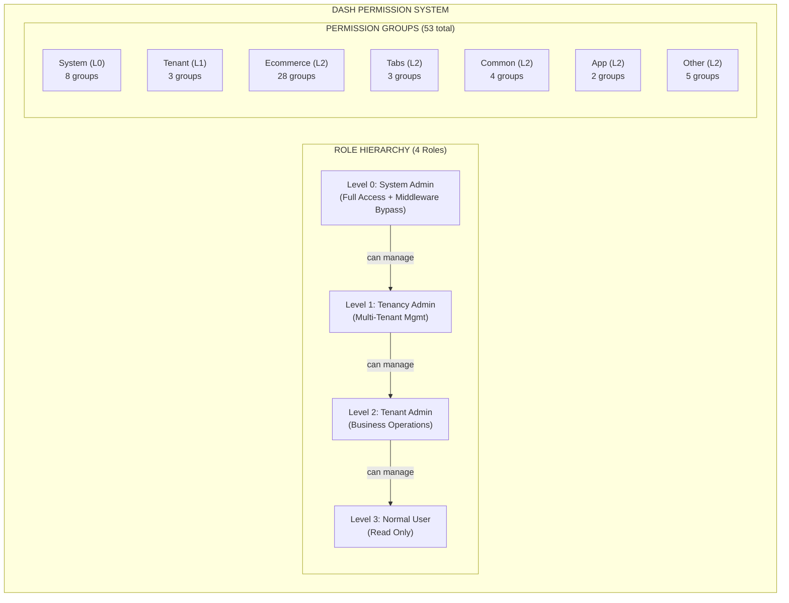
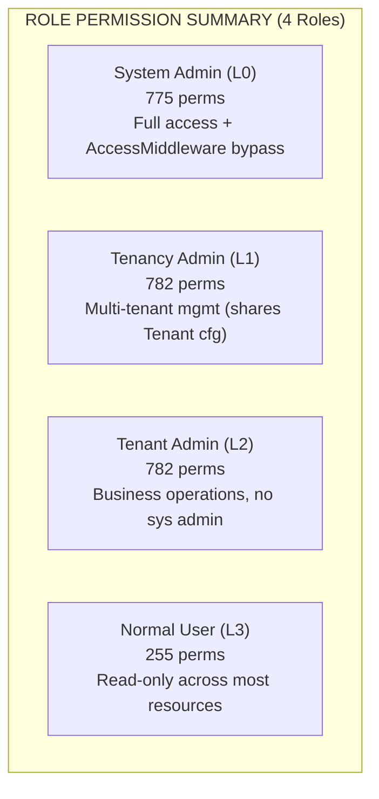
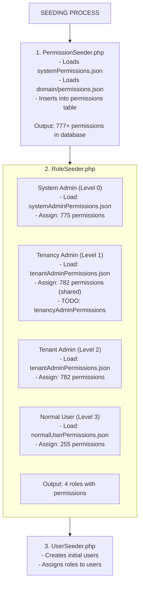
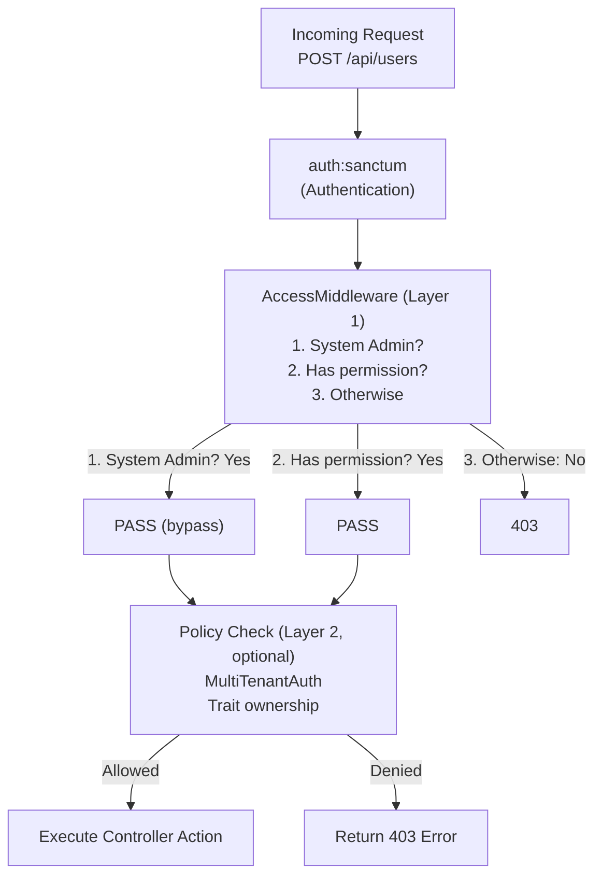
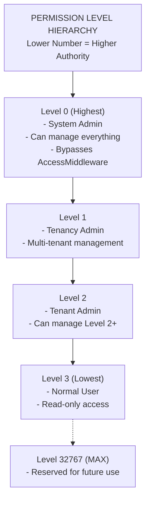
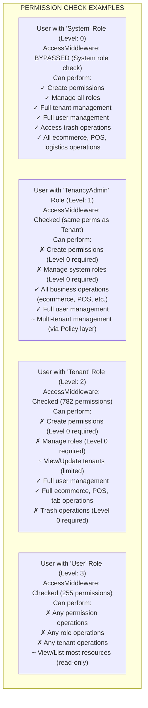
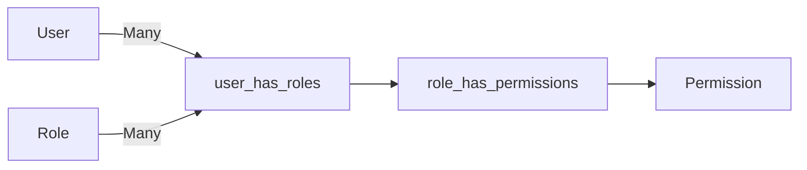
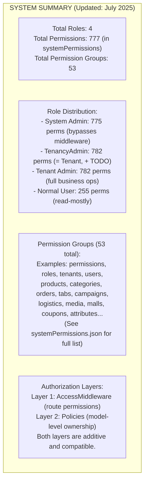

# Role Permission System - Visual Overview

> **Last Updated:** June 2025 — Updated for 4-role hierarchy and current permission counts.

## System Architecture



## Permission Distribution



Note: Tenancy Admin currently uses tenantAdminPermissions.json (same as
Tenant Admin). A dedicated tenancyAdminPermissions.json is a TODO.

Legend:
  L0-L3 = Role level (lower = higher authority)
```

## Data Flow



## Request Authorization Flow



Note: tenancy.* routes do NOT use AccessMiddleware (only auth:sanctum).
      public.* routes require no authentication at all.

## File Structure Diagram

```
dash-backend/
│
├── app/
│   ├── Models/
│   │   ├── Role.php ──────────────────── Role constants & model
│   │   │   • NAME_SYSTEM_ADMIN = 'System'      (Level 0)
│   │   │   • NAME_TENANCY_ADMIN = 'TenancyAdmin' (Level 1)
│   │   │   • NAME_TENANT_ADMIN = 'Tenant'       (Level 2)
│   │   │   • NAME_NORMAL_USER = 'User'          (Level 3)
│   │   │
│   │   └── Permission.php ─────────────── Permission model
│   │       • MAX_LEVEL = 32767
│   │       • route_name, group, level
│   │
│   ├── Policies/
│   │   └── RolePolicy.php ────────────── Level-based authorization
│   │       • manage(): level-based check
│   │
│   ├── Http/
│   │   ├── Middleware/
│   │   │   └── AccessMiddleware.php ──── Route-level enforcement
│   │   │       • System Admin bypass
│   │   │       • Permission lookup by route_name
│   │   │
│   │   ├── Resources/
│   │   │   ├── RoleResource.php
│   │   │   └── PermissionResource.php
│   │   │
│   │   └── Requests/
│   │       └── API/System/
│   │           ├── PermissionRequest.php
│   │           └── RolePermissionRequest.php
│   │
│   ├── Jobs/
│   │   └── SyncRolePermissionsJob.php ── Async permission sync
│   │
│   └── Console/Commands/
│       └── ValidateRolePermissions.php ─ Validation command
│
├── database/
│   ├── data/
│   │   ├── systemPermissions.json ────── 777+ permission definitions (53 groups)
│   │   │
│   │   └── rolePermissions/
│   │       ├── systemAdminPermissions.json ─ 775 permissions
│   │       ├── tenantAdminPermissions.json ─ 782 permissions (also used by TenancyAdmin)
│   │       ├── normalUserPermissions.json ── 255 permissions
│   │       └── README.md
│   │
│   └── seeders/
│       ├── PermissionSeeder.php ──────── Creates permissions
│       │   1. Load systemPermissions.json
│       │   2. Load domain/permissions.json
│       │   3. Insert permissions
│       │
│       ├── RoleSeeder.php ────────────── Creates 4 roles + assigns
│       │   1. Create System role (L0)
│       │   2. Create TenancyAdmin role (L1, shared config)
│       │   3. Create Tenant role (L2)
│       │   4. Create User role (L3)
│       │
│       └── UserSeeder.php ────────────── Creates users
│
├── domain/
│   └── app/Policies/
│       ├── Traits/
│       │   └── MultiTenantAuthorizationTrait.php ── Model ownership
│       └── Extended/
│           └── TenantPolicy.php ── 3-tier tenant authorization
│
├── docs/
│   ├── MULTI_TENANT_POLICY_GUIDE.md ── Multi-tenant policy docs
│   └── TENANCY_ARCHITECTURE.md ─────── Tenancy architecture docs
│
└── ROLE_PERMISSION_SYSTEM.md ────────── Full documentation
```

## Permission Levels Explained



## Common Operations



## Key Relationships



## Summary Statistics

```
╔══════════════════════════════════════════════════════════╗
║                    SYSTEM SUMMARY                        ║
║              (Updated: July 2025)                        ║
╠══════════════════════════════════════════════════════════╣
║                                                          ║

