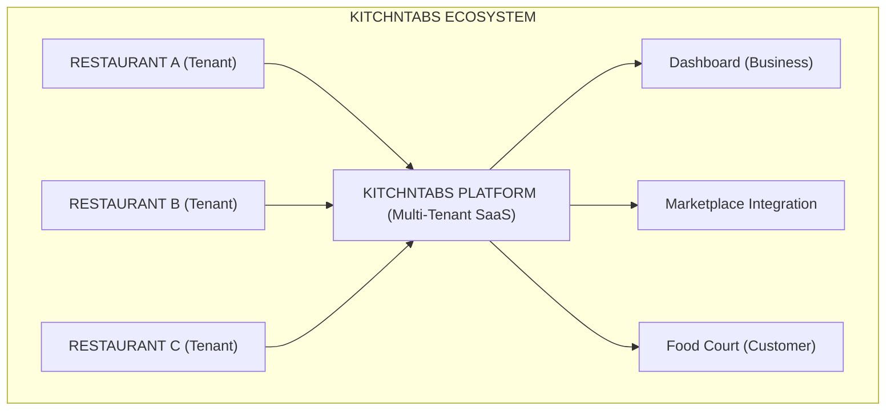
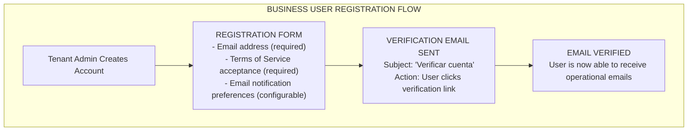
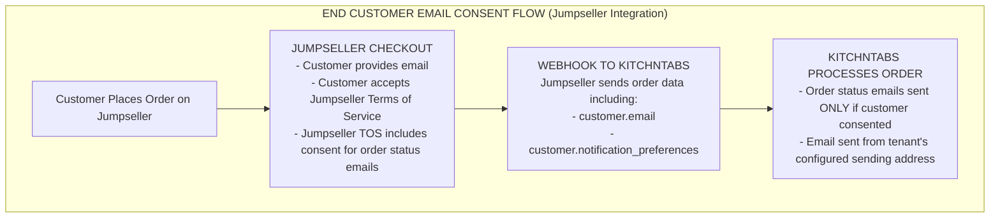
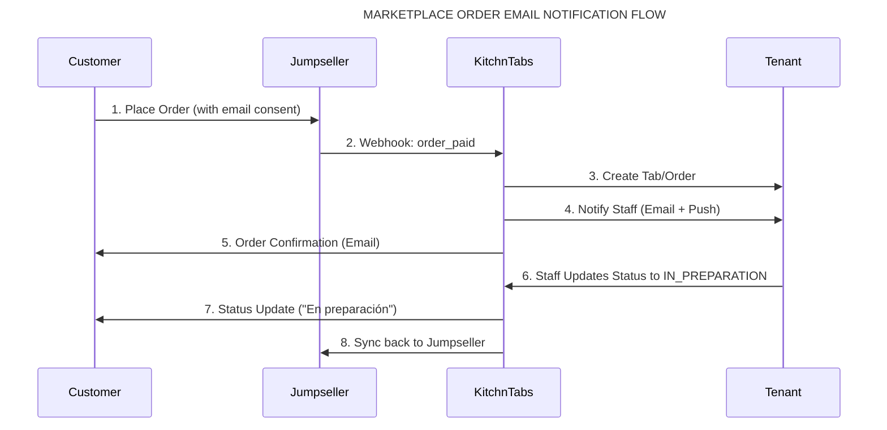
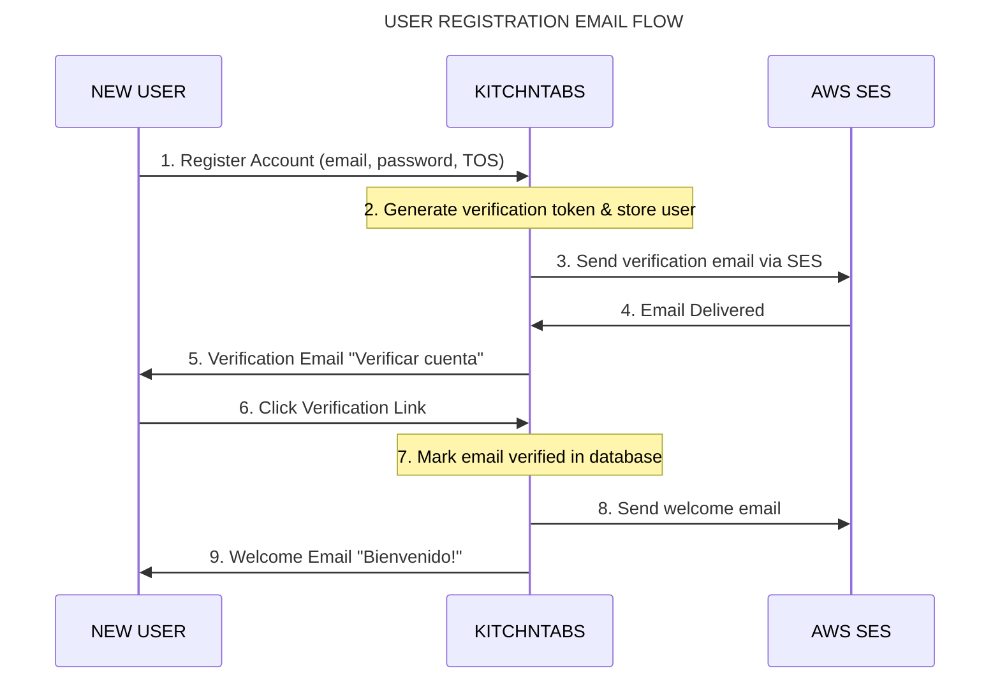
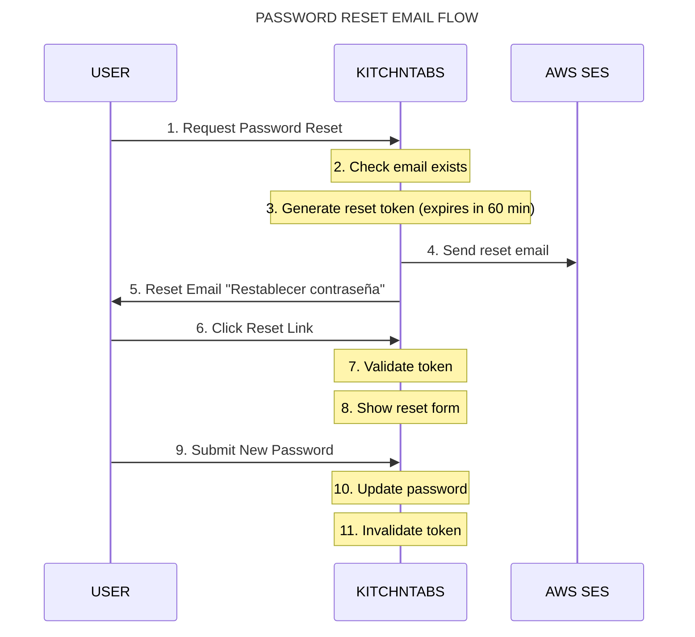
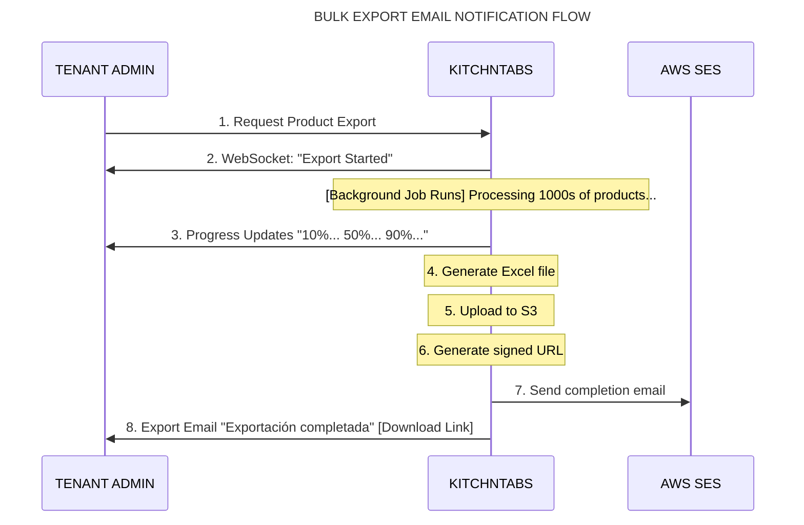
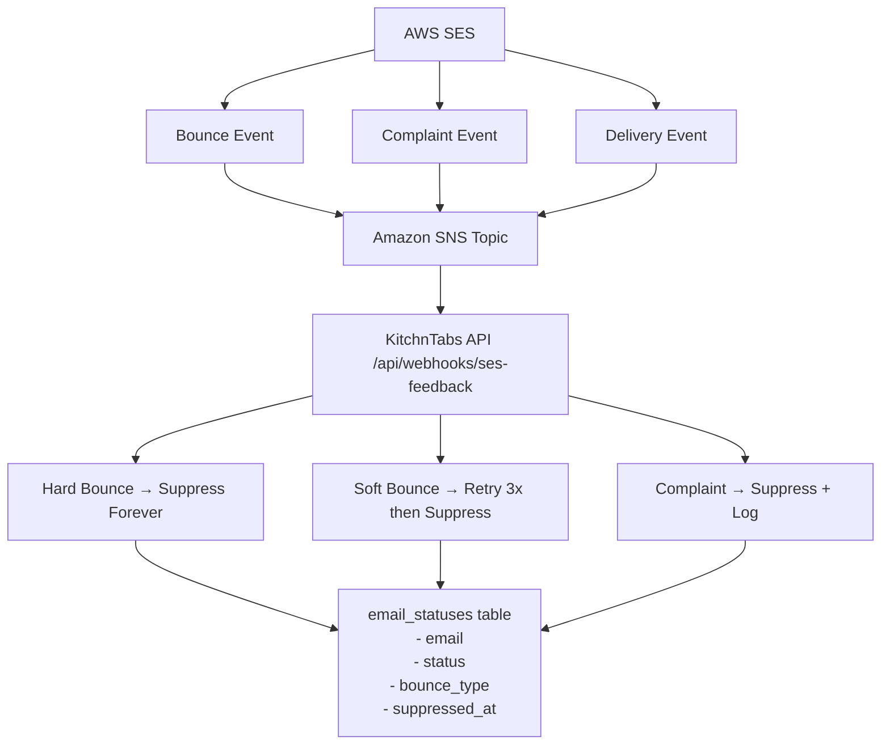
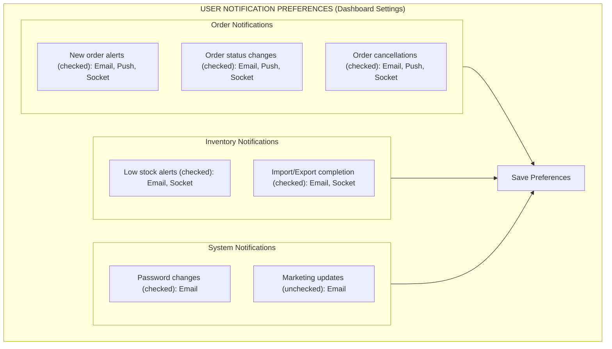
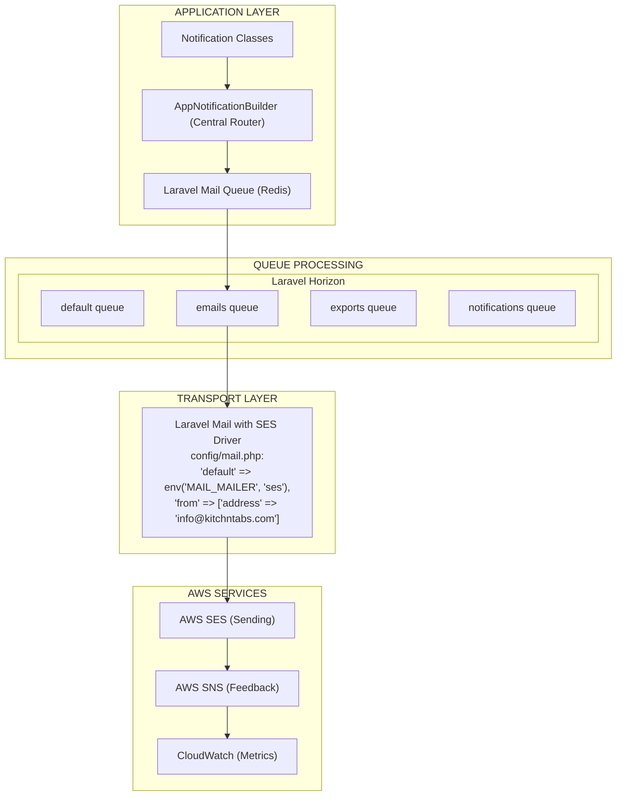

can you give me a latex version please. 

# KitchnTabs Email Sending Practices for AWS SES Review

**Document Version:** 1.0  
**Date:** December 22, 2025  
**Prepared by:** KitchnTabs Development Team  
**Contact:** Francisco Aranda <farandal@gmail.com> - <info@kitchntabs.com>
**Website:** https://kitchntabs.com
**App:** https://panel.kitchntabs.com

---

## Table of Contents

1. [Executive Summary](#1-executive-summary)
2. [Company & Platform Overview](#2-company--platform-overview)
3. [Email Sending Practices](#3-email-sending-practices)
4. [Recipient List Management](#4-recipient-list-management)
5. [Email Categories & Examples](#5-email-categories--examples)
6. [Email Flow Diagrams](#6-email-flow-diagrams)
7. [Bounce & Complaint Handling](#7-bounce--complaint-handling)
8. [Unsubscribe Management](#8-unsubscribe-management)
9. [Technical Infrastructure](#9-technical-infrastructure)
10. [Quality Assurance](#10-quality-assurance)
11. [Email Templates](#11-email-templates)

---

## 1. Executive Summary

**KitchnTabs** is a B2B SaaS platform providing restaurant and food court management solutions to businesses in Latin America, primarily Chile. Our platform sends transactional and operational emails that are critical to business operations.

### Key Points:

- **Nature of Emails:** 100% transactional emails (no marketing/promotional content)
- **Primary Recipients:** 
  - Business users (restaurant staff, administrators)
  - End customers (who have explicitly consented via marketplace checkout)
- **Volume:** Low to moderate (estimated 50-500 emails/day depending on order volume)
- **Languages:** Spanish (primary), English (secondary)
- **Consent:** All recipients have explicitly opted-in or consented via transactional relationships

---

## 2. Company & Platform Overview

### 2.1 About KitchnTabs

KitchnTabs is a comprehensive restaurant management platform consisting of:

- **Dash Backend:** Laravel-based API providing multi-tenant architecture, role-based permissions, real-time WebSocket messaging, and order management
- **Dash Admin:** React-based admin dashboard for business users
- **Mall/Food Court System:** QR-based ordering system for food courts
- **Marketplace Integrations:** Jumpseller, Uber Eats, and other e-commerce platforms

### 2.2 Business Model



### 2.3 User Types

| User Type | Description | Email Frequency |
|-----------|-------------|-----------------|
| **Tenant Admin** | Restaurant owner/manager | 1-5 emails/week |
| **Tenant Staff** | Kitchen/front-of-house staff | 1-10 emails/day (order notifications) |
| **End Customer** | Customer placing orders via marketplace | 1-3 emails/order (status updates) |

---

## 3. Email Sending Practices

### 3.1 Email Frequency

| Email Category | Frequency | Trigger |
|----------------|-----------|---------|
| **Order Status Updates** | Per order (3-5 per order lifecycle) | Order state changes |
| **Password Reset** | On-demand | User request |
| **Account Verification** | Once per user | Registration |
| **Export Notifications** | As needed | User-initiated exports |
| **Low Stock Alerts** | Daily digest | Inventory threshold breach |
| **Import Notifications** | As needed | Bulk import completion |

### 3.2 Email Volume Estimates

| Period | Expected Volume | Notes |
|--------|-----------------|-------|
| **Daily** | 50-500 emails | Depends on order volume per tenant |
| **Weekly** | 350-3,500 emails | Business days see higher volume |
| **Monthly** | 1,500-15,000 emails | Seasonal variations apply |

### 3.3 Sending Patterns

```
       Email Volume Distribution (Typical Day (estimation))
       
Emails│                    ████                    
  60 │                   █████                    
     │                  ███████                   
  40 │                 █████████ █                
     │               ███████████████              
  20 │            █████████████████████           
     │         ███████████████████████████        
   0 │────────────────────────────────────────────
       00  04  08  12  16  20  24   Hour (Local Time)
       
       Peak hours: 12:00-14:00, 19:00-21:00 (meal times)
```

---

## 4. Recipient List Management

### 4.1 How Recipients Are Added

#### Business Users (Tenant Staff/Admins)



#### End Customers (Marketplace Orders)



### 4.2 Email List Hygiene

| Practice | Implementation |
|----------|----------------|
| **No purchased lists** | All recipients are organic (business users or marketplace customers) |
| **Email verification** | Business users must verify email before receiving notifications |
| **Consent-based** | End customers consent via marketplace checkout process |
| **Regular cleanup** | Inactive accounts flagged after 6 months of no activity |

---

## 5. Email Categories & Examples

### 5.1 Email Notifications Catalog

| # | Email Type | Trigger | Recipients | Subject Example |
|---|------------|---------|------------|-----------------|
| 1 | **Order Status Update** | Order state changes | Kitchen Staff, Admins | "Nueva Orden #12345" |
| 2 | **Marketplace Order Update** | Order status change | End Customer | "¡Actualización de tu pedido!" |
| 3 | **Password Reset** | User request | Requesting User | "Restablecer contraseña" |
| 4 | **Account Verification** | New registration | New User | "Verificar cuenta" |
| 5 | **Account Verified** | Email confirmed | User | "¡Cuenta verificada exitosamente!" |
| 6 | **Welcome Email** | After verification | New User | "Bienvenido a KitchnTabs" |
| 7 | **Export Completed** | Data export finishes | Requesting User | "Exportación completada" |
| 8 | **Product Import Result** | Bulk import completes | Tenant Admins | "Importación completada" |
| 9 | **Low Stock Alert** | Stock below threshold | Tenant Admins | "Alerta de stock bajo" |
| 10 | **Private Message** | Internal messaging | Specific User | "Mensaje privado" |

### 5.2 Order Status Email Lifecycle

For a typical order, the customer receives emails at these stages:

```
ORDER LIFECYCLE EMAIL SEQUENCE
══════════════════════════════════════════════════════════════════════════

 TIME     STATUS              EMAIL SENT?    SUBJECT
 ─────    ──────              ───────────    ───────────────────────────
 
 T+0      CREATED             ✅ Yes         "¡Pedido recibido!"
          (Order placed)
          
 T+5min   CONFIRMED           ✅ Yes         "¡Tu pedido ha sido confirmado!"
          (Restaurant accepts)
          
 T+15min  IN_PREPARATION      ✅ Yes         "Tu pedido está en preparación"
          (Kitchen starts)
          
 T+30min  PREPARED            ✅ Yes         "¡Tu pedido está listo!"
          (Ready for pickup)
          
 T+45min  SHIPPED/PICKED_UP   ✅ Yes         "Tu pedido está en camino"
          (Out for delivery)
          
 T+60min  DELIVERED           ✅ Yes         "¡Pedido entregado!"
          (Customer received)

══════════════════════════════════════════════════════════════════════════

Note: Not all orders go through all stages. Some orders are pickup-only,
      some are cancelled. Each status change triggers a notification.
```

---

## 6. Email Flow Diagrams

### 6.1 Marketplace Order Email Flow



### 6.2 User Registration Email Flow



### 6.3 Password Reset Email Flow



### 6.4 Bulk Export Email Flow



---

## 7. Bounce & Complaint Handling

### 7.1 Current Implementation Status

> ⚠️ **Note:** Bounce and complaint handling via SNS notifications is planned but not yet implemented. Below is the proposed implementation.

### 7.2 Proposed Bounce Handling Architecture



### 7.3 Bounce Type Handling

| Bounce Type | Action | Retention |
|-------------|--------|-----------|
| **Hard Bounce** (permanent) | Immediately suppress email | Permanent |
| **Soft Bounce** (temporary) | Retry up to 3 times over 24h | Suppress after 3 failures |
| **Complaint** | Immediately suppress + log for review | Permanent |

### 7.4 Database Schema

```sql
CREATE TABLE email_delivery_status (
    id BIGINT PRIMARY KEY AUTO_INCREMENT,
    email VARCHAR(255) NOT NULL,
    tenant_id UUID NULL,
    status ENUM('active', 'bounced', 'complained', 'suppressed') DEFAULT 'active',
    bounce_type VARCHAR(50) NULL, -- 'Permanent', 'Transient'
    bounce_subtype VARCHAR(50) NULL, -- 'General', 'NoEmail', 'Suppressed'
    complaint_type VARCHAR(50) NULL, -- 'abuse', 'not-spam'
    retry_count INT DEFAULT 0,
    last_bounce_at TIMESTAMP NULL,
    suppressed_at TIMESTAMP NULL,
    created_at TIMESTAMP DEFAULT CURRENT_TIMESTAMP,
    updated_at TIMESTAMP DEFAULT CURRENT_TIMESTAMP ON UPDATE CURRENT_TIMESTAMP,
    
    INDEX idx_email (email),
    INDEX idx_status (status),
    INDEX idx_tenant (tenant_id)
);
```

### 7.5 Email Sending Check

Before sending any email, the system check:

```php
// Proposed implementation in AppNotificationBuilder
public function shouldSendEmail(string $email): bool
{
    $status = EmailDeliveryStatus::where('email', $email)->first();
    
    if (!$status) {
        return true; // New email, OK to send
    }
    
    if ($status->status === 'suppressed') {
        Log::info("Email suppressed: {$email}", [
            'reason' => $status->bounce_type ?? $status->complaint_type
        ]);
        return false;
    }
    
    return true;
}
```

---

## 8. Unsubscribe Management

### 8.1 User Preference Center

Business users can manage their notification preferences through the platform:



### 8.2 Unsubscribe Methods

| Method | Implementation | Notes |
|--------|----------------|-------|
| **Preference Center** | In-app settings page | Full control over notification types |
| **Email Footer Link** | List-Unsubscribe header | One-click unsubscribe for specific categories |
| **Reply-based** | Not implemented | Low priority for transactional emails |

### 8.3 End Customer Unsubscribe

For marketplace customers:
- Transactional emails (order updates) cannot be unsubscribed as they are essential for order fulfillment
- Customers can contact the restaurant directly to request email removal
- System respects marketplace-level preferences passed via webhook

---

## 9. Technical Infrastructure

### 9.1 Email Sending Architecture



### 9.2 Configuration

**Environment Variables:**
```bash
MAIL_MAILER=ses
MAIL_FROM_ADDRESS=no-reply@kitchntabs.com
MAIL_FROM_NAME="KitchnTabs"

AWS_ACCESS_KEY_ID=AKIA...
AWS_SECRET_ACCESS_KEY=...
AWS_DEFAULT_REGION=us-east-1
```

### 9.3 Sending Domains

| Domain | Purpose | DKIM | SPF | DMARC |
|--------|---------|------|-----|-------|
| kitchntabs.com | Primary sending domain | ✅ | ✅ | ✅ |
| pinoywok.cl | Tenant-specific (legacy) | ✅ | ✅ | ✅ |

---

## 10. Quality Assurance

### 10.1 Email Quality Checklist

| Check | Status | Implementation |
|-------|--------|----------------|
| ✅ Valid From address | Implemented | Verified domain |
| ✅ Clear subject lines | Implemented | Descriptive, no spam triggers |
| ✅ Plain text alternative | Implemented | All emails have text version |
| ✅ Unsubscribe header | Planned | List-Unsubscribe header |
| ✅ Mobile-responsive | Implemented | All templates responsive |
| ✅ Proper encoding | Implemented | UTF-8 throughout |
| ✅ No broken images | Implemented | CDN-hosted images |

### 10.2 Content Guidelines

- **No promotional content** in transactional emails
- **Clear sender identification** (company name, logo)
- **Relevant, expected content** based on user action
- **Spanish language** with proper localization
- **Contact information** in footer

---

## 11. Email Templates

### 11.1 Order Status Update Email

**Subject:** "¡Actualización de tu pedido!"

```html
┌─────────────────────────────────────────────────────────────────────────────────┐
│                                                                                  │
│                              [COMPANY LOGO]                                      │
│                                                                                  │
│                     ┌─────────────────────────┐                                 │
│                     │      JUMPSELLER         │                                 │
│                     └─────────────────────────┘                                 │
│                                                                                  │
│                  ¡Actualización de tu pedido!                                    │
│                                                                                  │
│  ─────────────────────────────────────────────────────────────────────────────  │
│                                                                                  │
│  Hola Juan, te informamos que el estado de tu pedido ha cambiado.               │
│                                                                                  │
│  Pedido: #12345                                                                  │
│  Fecha: 22/12/2025 14:30                                                        │
│                                                                                  │
│                                                  ┌──────────────────┐           │
│                                                  │ EN PREPARACIÓN   │           │
│                                                  └──────────────────┘           │
│                                                                                  │
│  ─────────────────────────────────────────────────────────────────────────────  │
│                                                                                  │
│  PRODUCTOS ORDENADOS                                                            │
│  ──────────────────────────────────────────                                     │
│                                                                                  │
│  🍕 Pizza Margherita .......................... x2 ........... $15.990         │
│  🥤 Coca-Cola 500ml ........................... x2 ........... $3.000          │
│                                                                                  │
│  ─────────────────────────────────────────────────────────────────────────────  │
│                                                                                  │
│  Subtotal: $18.990                                                              │
│  Envío: $2.990                                                                  │
│  TOTAL: $21.980                                                                 │
│                                                                                  │
│  ─────────────────────────────────────────────────────────────────────────────  │
│                                                                                  │
│  INFORMACIÓN DE ENVÍO                                                           │
│  ──────────────────────────────────────────                                     │
│                                                                                  │
│  Av. Providencia 1234, Santiago                                                 │
│  Llegada estimada: 22/12/2025 15:00                                             │
│                                                                                  │
│  ─────────────────────────────────────────────────────────────────────────────  │
│                                                                                  │
│  Si tienes preguntas, contáctanos en contact@restaurant.cl                      │
│                                                                                  │
│                              © 2025 KitchnTabs                                  │
│                                                                                  │
└─────────────────────────────────────────────────────────────────────────────────┘
```

### 11.2 Password Reset Email

**Subject:** "Restablecer contraseña"

```html
┌─────────────────────────────────────────────────────────────────────────────────┐
│                                                                                  │
│                              [COMPANY LOGO]                                      │
│                                                                                  │
│                     Recuperación de contraseña                                   │
│                                                                                  │
│  ─────────────────────────────────────────────────────────────────────────────  │
│                                                                                  │
│  A continuación, verás un enlace para restablecer tu contraseña.                │
│  Cuando hagas click en aquel enlace te dirigirá a realizar los                  │
│  cambios necesarios para recuperar tu contraseña.                               │
│                                                                                  │
│                     ┌─────────────────────────┐                                 │
│                     │  Recuperar contraseña   │                                 │
│                     └─────────────────────────┘                                 │
│                                                                                  │
│  Este enlace expirará en 60 minutos.                                            │
│                                                                                  │
│  Si no solicitaste este cambio, puedes ignorar este correo.                     │
│                                                                                  │
│                              © 2025 KitchnTabs                                  │
│                                                                                  │
└─────────────────────────────────────────────────────────────────────────────────┘
```

### 11.3 Welcome Email

**Subject:** "¡Bienvenido a KitchnTabs!"

```html
┌─────────────────────────────────────────────────────────────────────────────────┐
│                                                                                  │
│                              [COMPANY LOGO]                                      │
│                                                                                  │
│                       ¡Bienvenido Juan!                                          │
│                                                                                  │
│  ─────────────────────────────────────────────────────────────────────────────  │
│                                                                                  │
│  Nombre del usuario: juan@example.com                                            │
│                                                                                  │
│  Tu cuenta ha sido creada exitosamente. Ya puedes ingresar                       │
│  y comenzar a usar la plataforma.                                                │
│                                                                                  │
│                     ┌─────────────────────────┐                                 │
│                     │  Ingresar al sistema    │                                 │
│                     └─────────────────────────┘                                 │
│                                                                                  │
│                              © 2025 KitchnTabs                                  │
│                                                                                  │
└─────────────────────────────────────────────────────────────────────────────────┘
```

### 11.4 Export Completed Email

**Subject:** "Exportación completada"

```html
┌─────────────────────────────────────────────────────────────────────────────────┐
│                                                                                  │
│                              [COMPANY LOGO]                                      │
│                                                                                  │
│                       Export Completed                                           │
│                                                                                  │
│  ─────────────────────────────────────────────────────────────────────────────  │
│                                                                                  │
│  Your export has been completed successfully.                                    │
│                                                                                  │
│  ┌─────────────────────────────────────────────────────────────────────────┐   │
│  │  📁 File: products_export_2025-12-22.xlsx                               │   │
│  │  ⏰ Completed: Dec 22, 2025 at 14:30                                    │   │
│  └─────────────────────────────────────────────────────────────────────────┘   │
│                                                                                  │
│                     ┌─────────────────────────┐                                 │
│                     │  📊 Download Excel File │                                 │
│                     └─────────────────────────┘                                 │
│                              (2.5 MB)                                           │
│                                                                                  │
│  ─────────────────────────────────────────────────────────────────────────────  │
│                                                                                  │
│  🔒 Important Information:                                                       │
│  • Download links are temporary and will expire after 24 hours                  │
│  • Please download your file as soon as possible                                │
│                                                                                  │
│                              © 2025 KitchnTabs                                  │
│                                                                                  │
└─────────────────────────────────────────────────────────────────────────────────┘
```

---

## Appendix A: Recommendations Requested

Based on this documentation, we request AWS SES team recommendations on:

1. **Bounce Handling:** Best practices for implementing SNS-based bounce processing
2. **Complaint Management:** Optimal workflow for handling abuse complaints
3. **Sending Limits:** Appropriate rate limits for our transactional volume
4. **Dedicated IP:** Whether our volume warrants dedicated IP address(es)
5. **Monitoring:** CloudWatch alarms and metrics we should configure
6. **DMARC Policy:** Recommended policy (none → quarantine → reject) progression

---

## Document Revision History

| Version | Date | Author | Changes |
|---------|------|--------|---------|
| 1.0 | 2025-12-22 | Francisco Aranda L <farandal@gmail.com> | Initial document |

---

**Contact Information:**

- **Technical Contact:** farandal@gmail.com
- **Website:** https://kitchntabs.com
