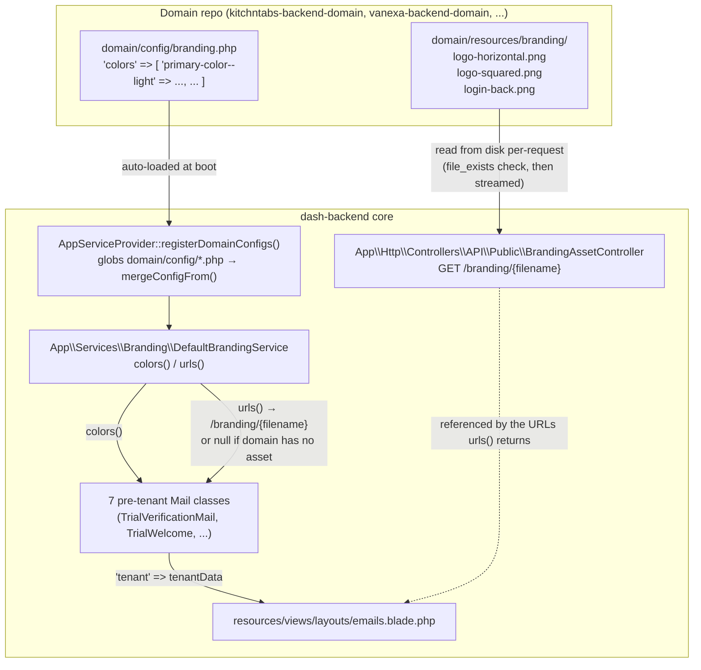

# Domain Default Branding for Pre-Tenant System Emails — Technical Documentation

**Category**: Functional Epic (F15: Notifications & Messaging)
**Status**: Active
**Last Updated**: 2026-08-04
**Audience**: Engineers implementing or debugging core system emails, or onboarding a new domain (new product vertical) onto dash-backend

---

## 1. Purpose

This document describes how **default branding** (logo images, brand colors) is resolved for
dash-backend core's **pre-tenant system emails** — the handful of `App\Mail\*` classes that send
before any tenant exists, or independently of a specific tenant, so they cannot use the normal
tenant-branding pipeline described in
[DASH Email Notification System](F15-Notifications-Messaging_DASH_EMAIL_NOTIFICATION_SYSTEM.md).

It complements that document: read this one for the *pre-tenant* branding path (trial
verification, trial welcome, payment receipts, subscription changes, provisioning failures);
read the other for the *tenant-branded* path (`AppNotificationBuilder` → `AppNotificationBase` →
`AppNotification::toMail()`), which is unrelated and unaffected by anything here.

---

## 2. The Problem This Solves

Before this feature, seven core mail classes hardcoded their logo URLs as:

```php
'horizontal_logo_url' => config('app.url') . '/img/logo-horizontal.png',
'squared_logo_url'    => config('app.url') . '/img/logo-squared.png',
```

`dash-backend/public/img/logo-horizontal.png` and `logo-squared.png` were, by file content
(verified by MD5), **KitchnTabs' actual logo assets, committed directly into the core repo**.
Every deployment built from dash-backend core — including VaneXa's, a completely different
product/brand sharing the same core — served KitchnTabs' logo and KitchnTabs' green
(`#417300`) as the "default" system branding in these emails, regardless of which domain
(`kitchntabs-backend-domain`, `vanexa-backend-domain`, ...) was actually mounted.

This is the same class of bug as the frontend's `GlobalSmallLoader` icon (see
[F8 Style System Technical Reference](../F8-Public-Web/F8-Public-Web_STYLE_SYSTEM_TECHNICAL_REFERENCE.md))
— a brand-specific asset baked into a supposedly brand-neutral core package. The fix follows the
same principle established elsewhere in this codebase (e.g. the domain `routes/api/*.php` /
`config/*.php` auto-discovery pattern already used for domain-specific routes and settings):
**the core ships brand-neutral, and each domain supplies its own default at a well-known,
auto-discovered location — no code changes required per domain.**

The affected mail classes:

| Class | Sent when |
|---|---|
| `App\Mail\TrialVerificationMail` | User registers for a trial (email verification link) |
| `App\Mail\TrialWelcome` | Trial account provisioning succeeds |
| `App\Mail\TenancyProvisioningFailed` | Trial account provisioning fails |
| `App\Mail\PaymentReceived` | A tenancy payment is successfully processed |
| `App\Mail\SubscriptionWelcome` | A user subscribes to a paid plan |
| `App\Mail\SubscriptionPlanChanged` | A user upgrades/downgrades their subscription plan |

All six explicitly use *system* branding rather than a tenant's own (per their inline comments:
"Use SYSTEM branding ... to maintain consistent branding across all billing communications") —
that choice is unchanged by this fix. What changed is *which* system branding: the active
domain's, not a brand hardcoded into core.

---

## 3. Architecture at a Glance



Both discovery mechanisms — `domain/config/*.php` and `domain/resources/branding/*` — are
**runtime, not build-time**: nothing needs registering per domain, no symlink, no `public/`
copy step, no webserver/docker config. This works identically whether `domain/` is bind-mounted
(local dev) or baked into the image (prod), because both are just reading files off disk at
request time — the same pattern already used for `domain/routes/api/*.php` (glob-required from
`routes/api.php`) and `domain/config/*.php` (glob-merged by `registerDomainConfigs()`).

---

## 4. File Map — Where Everything Lives

| # | Component | Path | Role |
|---|---|---|---|
| 1 | **Branding resolver** | `dash-backend/app/Services/Branding/DefaultBrandingService.php` | Single source of truth. `colors()` merges the domain's `config('branding.colors')` over a neutral gray/blue fallback. `urls()` returns a `/branding/{filename}` URL for each asset the domain actually has, `null` otherwise. |
| 2 | **Asset controller** | `dash-backend/app/Http/Controllers/API/Public/BrandingAssetController.php` | `show(string $filename)` — allow-list checked, streams `domain/resources/branding/{filename}` if present, 404s otherwise. No core-bundled fallback image (core ships brand-neutral by omission, not by placeholder). |
| 3 | **Route** | `dash-backend/routes/web.php` | `GET /branding/{filename}`, name `branding.asset`, filename constrained by regex to the three known asset names (defense in depth alongside the controller's allow-list — blocks path traversal). |
| 4 | **Domain config convention** | `domain/config/branding.php` (e.g. `kitchntabs-backend-domain/config/branding.php`, `vanexa-backend-domain/config/branding.php`) | One file per domain. Only key used today: `colors` (flat array, same `--light`/`--dark`-suffixed naming as the frontend's CSS-var convention — see §6). Auto-loaded by the *existing* `AppServiceProvider::registerDomainConfigs()`, no changes needed there. |
| 5 | **Domain asset convention** | `domain/resources/branding/{logo-horizontal,logo-squared,login-back}.png` | One folder per domain, same three filenames always. `BrandingAssetController` and `DefaultBrandingService` both hardcode this exact path (`base_path('domain/resources/branding/...')`) and this exact filename set (`DefaultBrandingService::ASSET_FILES`). |
| 6 | **Legacy default-tenant config** | `dash-backend/config/constants.php` → `default_tenant` | A *separate*, older default-branding mechanism used by `AppNotificationBase::normalizeTenantData()` (the tenant-branding pipeline's own "no tenant resolved" fallback — see §7). Its `logo_url` / `horizontal_logo_url` / `squared_logo_url` defaults were pointed at the same `/branding/{filename}` route as part of this fix (previously `/images/default-*.png`, which don't exist in `public/` — a pre-existing dead link, unrelated to the KitchnTabs-leak bug but fixed alongside it). |
| 7 | **Email layout's last-resort fallback** | `dash-backend/resources/views/layouts/emails.blade.php` | The `data_get_safe($colors, 'primary-color--light', '#417300')`-style literals only reached if *neither* a tenant *nor* `DefaultBrandingService::colors()` reaches this view at all. Genericized from KitchnTabs green to the same neutral gray used by `DefaultBrandingService`'s own fallback. |

---

## 5. `DefaultBrandingService` — API Reference

```php
namespace App\Services\Branding;

class DefaultBrandingService
{
    /** The only three filenames BrandingAssetController will ever serve. */
    public const ASSET_FILES = ['logo-horizontal.png', 'logo-squared.png', 'login-back.png'];

    /**
     * @return array{horizontal_logo_url: ?string, squared_logo_url: ?string, login_back_url: ?string}
     */
    public static function urls(): array;

    /** @return array<string, string> */
    public static function colors(): array;
}
```

**`urls()`** — for each of the three asset files, checks
`is_file(base_path("domain/resources/branding/{$filename}"))`. If present, returns
`rtrim(config('app.url'), '/') . '/branding/' . $filename`. If absent, returns `null` for that
key — **not** a broken link, **not** a placeholder image. Every blade template that consumes
`horizontal_logo_url` / `squared_logo_url` already guards with `@if($logoUrl)` (see the parent
email doc's §"Logo Not Displaying" troubleshooting entry), so a domain that hasn't supplied a
given asset yet simply omits that `` tag — a clean degrade, not a 404 image icon.

**`colors()`** — `array_merge(NEUTRAL_COLORS, config('branding.colors', []))`. Domain values win
for any key both define; core's neutral values (`#666666` / `#999999` / `#333333` / `#0078D4`)
fill in anything the domain's `config/branding.php` doesn't set. Because it's a plain
`array_merge` on flat keys (not the array-of-entries structure `tenants.setting_formats` uses —
see §7's note on why that mechanism was *not* reused here), a domain only needs to declare the
keys it wants to override.

---

## 6. Color Key Convention

`DefaultBrandingService::colors()` returns the same `--key--light` suffix convention as the
frontend's CSS-variable system (see
[F8 Style System Technical Reference §2](../F8-Public-Web/F8-Public-Web_STYLE_SYSTEM_TECHNICAL_REFERENCE.md)),
because `layouts/emails.blade.php` reads it with the exact same `data_get_safe($colors,
'primary-color--light', ...)` lookup pattern the frontend uses for CSS vars. Both the
suffixed and unsuffixed form of each key are provided (identical value) since the blade layout
tries the suffixed key first and falls back to the unsuffixed one:

| Key | Used for |
|---|---|
| `primary-color` / `primary-color--light` | Header background, primary buttons |
| `secondary-color` / `secondary-color--light` | Secondary accents |
| `primary-contrast` / `primary-contrast--light` | Gradient stop, decorative contrast |
| `highlight-color` / `highlight-color--light` | Links, CTA buttons (e.g. "Verify Email", "Download Brochure") |

This is a **separate, smaller key set** than the full ~270-variable frontend CSS-var system —
only what `layouts/emails.blade.php` actually reads (see file map entry 7's `$primaryColor` /
`$secondaryColor` / `$primaryContrast` / `$highlightColor` / ... assignments).

---

## 7. Relationship to the Tenant-Branding Pipeline (`AppNotificationBase`)

There are now **two independent default-branding fallbacks** in core, serving two different call
sites — don't confuse them:

| | `DefaultBrandingService` (this doc) | `config('constants.default_tenant')` |
|---|---|---|
| Consumed by | The 7 pre-tenant `Mail` classes directly | `AppNotificationBase::normalizeTenantData()`, used by the `AppNotificationBuilder` tenant-branding pipeline (see the parent email doc) when a real tenant can't be resolved |
| Purpose | "No tenant exists for this email at all" (registration, billing-system emails that deliberately use system branding) | "A tenant *should* exist for this notification but couldn't be resolved" — a genuine fallback-of-last-resort inside the normal per-tenant flow |
| Asset source | `domain/resources/branding/*` via `/branding/{filename}` | Same `/branding/{filename}` route as of this fix (previously dead `/images/default-*.png` links) — see file map entry 6 |
| Color source | `domain/config/branding.php` → `colors` | `config('constants.default_tenant.primary_color')` / `secondary_color` (single flat keys, no `--light` suffix — a different, older shape) |

They were **not** merged into one mechanism in this pass — `constants.default_tenant`'s color
keys have a different shape (`primary_color` vs `primary-color--light`) consumed by different
code, and unifying them was out of scope. They do now at least point at the *same* image files,
so a domain only has to supply its `domain/resources/branding/` assets once.

A third, pre-existing color source (`config('tenants.setting_formats')`'s `theme_colors` entry's
`default_value`) was previously read by three of the seven mail classes' now-removed
`getDefaultColors()` methods. That mechanism is for the **tenant-settings UI's** color-picker
default (what a *new* tenant's color picker opens with) — not a sensible source for "what color
should a pre-tenant email be," and reading it here was itself a design smell (see §8). It is
**not** consulted by `DefaultBrandingService`.

---

## 8. What Each Mail Class Looked Like Before

All seven classes had near-identical `content()` methods, but their `getDefaultColors()` helpers
had **silently drifted into three different, partially-broken implementations** — evidence this
logic badly needed consolidating even before the KitchnTabs-leak was noticed:

```php
// TrialVerificationMail, TenancyProvisioningFailed, TrialWelcome, SubscriptionWelcome —
// walked tenants.setting_formats for an entry with id === 'theme_colors':
protected function getDefaultColors(): array
{
    $settingFormats = config('tenants.setting_formats', []);
    foreach ($settingFormats as $format) {
        if (($format['id'] ?? '') === 'theme_colors') {
            return $format['default_value'] ?? [];
        }
    }
    return ['primary-color' => '#417300', /* ...KitchnTabs green... */];
}

// PaymentReceived — read a DIFFERENT config key, returned a DIFFERENT (smaller) key set
// with no --light suffixes at all:
protected function getDefaultColors(): array
{
    $colorsConfig = config('tenants.defaults', [])['settings']['colors'] ?? [];
    return ['primary-color' => $colorsConfig['primary-color'] ?? '#417300', /* ... */];
}

// SubscriptionPlanChanged — read YET ANOTHER config key, and returned keys
// (primary/secondary/background/text/...) that layouts/emails.blade.php's
// data_get_safe($colors, 'primary-color--light', ...) lookups could never match —
// meaning this class's "default colors" were dead on arrival; the blade template's own
// hardcoded '#417300' literal was silently winning every time:
protected function getDefaultColors(): array
{
    return config('tenants.dash.settings.colors', ['primary' => '#6B46C1', /* ... */]);
}
```

All three variants, plus the logo hardcoding, were removed and replaced with:

```php
use App\Services\Branding\DefaultBrandingService;

// ...inside content():
$tenantData = [
    'name' => config('app.name'),
    'display_name' => config('app.name'),
    ...DefaultBrandingService::urls(),
    'settings' => [
        'colors' => DefaultBrandingService::colors()
    ]
];
```

---

## 9. Onboarding a New Domain — Step by Step

When mounting core onto a new product vertical (a new domain repo), give its pre-tenant system
emails correct branding by adding exactly two things — **no core code changes required**:

1. **Assets**: create `domain/resources/branding/` in the new domain repo and add:
   - `logo-horizontal.png`
   - `logo-squared.png`
   - `login-back.png`

   (Any subset is fine — `DefaultBrandingService::urls()` returns `null` for whichever files
   aren't present, and the blade templates already omit the `` tag in that case.)

2. **Colors**: create `domain/config/branding.php`:

   ```php
   <?php

   return [
       'colors' => [
           'primary-color'           => '#0078D4',
           'primary-color--light'    => '#0078D4',
           'secondary-color'         => '#A8D800',
           'secondary-color--light'  => '#A8D800',
           'primary-contrast'        => '#002f55',
           'primary-contrast--light' => '#002f55',
           'highlight-color'         => '#A8D800',
           'highlight-color--light'  => '#A8D800',
       ],
   ];
   ```

   Pull the actual hex values from that domain's frontend `apps/<app>/src/dash-variables.less`
   (`--primary-color--light`, `--secondary-color--light`, `--primary-contrast--light`,
   `--highlight-color--light`) so the email branding matches the app's own theme — see
   [F8 Style System Technical Reference](../F8-Public-Web/F8-Public-Web_STYLE_SYSTEM_TECHNICAL_REFERENCE.md)
   for where those live.

Both files are picked up automatically the next time the app boots (config) or the asset is
requested (route) — no `config:cache` clear is strictly required in dev, though `php artisan
config:clear` guarantees it if the app is already running with a cached config.

### Currently configured domains

| Domain | Colors | Assets copied from |
|---|---|---|
| `kitchntabs-backend-domain` | Primary `#8f00cb`, secondary `#7faa00`, contrast `#460064`, highlight `#96b500` | `kitchntabs-frontend/apps/kitchntabs-app/src/assets/` |
| `vanexa-backend-domain` | Primary `#0078D4`, secondary `#A8D800`, contrast `#002f55`, highlight `#A8D800` | `kitchntabs-frontend/apps/vanexa-app/src/assets/` |

---

## 10. Verifying Branding End-to-End

These are the checks used to validate this feature — run them against a running app container
(swap the container name for whichever domain you're checking):

```bash
# 1. Config picked up correctly
docker exec <container> php artisan tinker --execute="
echo json_encode(config('branding.colors')) . PHP_EOL;
echo json_encode(\App\Services\Branding\DefaultBrandingService::urls()) . PHP_EOL;
"

# 2. Asset route serves the real file (not a 404, not a path-traversal hole)
curl -s -o /dev/null -w "HTTP %{http_code}, size: %{size_download} bytes\n" \
    http://localhost:<port>/branding/logo-horizontal.png
curl -s -o /dev/null -w "HTTP %{http_code}\n" \
    http://localhost:<port>/branding/../../../../etc/passwd   # must 404
curl -s -o /dev/null -w "HTTP %{http_code}\n" \
    http://localhost:<port>/branding/not-a-real-file.png       # must 404

# 3. A real mail class renders with the domain's branding, not the wrong brand's
docker exec <container> php artisan tinker --execute="
\$pending = new \App\Models\PendingRegistration();
\$pending->name = 'Test'; \$pending->email = 't@example.com';
\$pending->public_name = 'Test Co'; \$pending->primary_language = 'es';
\$pending->verification_token = 'x'; \$pending->expires_at = now()->addHours(24);
\$html = (new \App\Mail\TrialVerificationMail(\$pending))->render();
echo str_contains(\$html, 'branding/logo-horizontal.png') ? 'HAS LOGO' : 'NO LOGO (ok if domain has no asset yet)';
echo PHP_EOL;
echo str_contains(\$html, '#417300') ? 'BUG: KitchnTabs green leaked' : 'OK: no KitchnTabs green';
"
```

---

## 11. Known Gotchas

1. **`config()` caching in prod.** Like any Laravel config, if `php artisan config:cache` has run
   with a stale domain config, a newly-added `domain/config/branding.php` won't be picked up
   until `config:clear`/`config:cache` runs again. Routes have the same caveat via
   `route:cache` — `BrandingAssetController`'s route was invisible until `route:clear` in local
   testing purely because of a stale route cache, not a code issue.

2. **`BrandingAssetController` has no core-bundled fallback image, by design.** Unlike
   `constants.default_tenant`'s legacy `/images/default-*.png` (which was *intended* to be a
   fallback image but the files never existed — a separate, pre-existing dead link fixed
   alongside this feature, see file map entry 6), `DefaultBrandingService::urls()` deliberately
   returns `null` rather than pointing at any core-bundled placeholder when a domain hasn't
   supplied an asset. If you want a visible logo in dev before adding real brand assets, add
   *any* PNG at the expected path — there is no "generic DASH logo" to fall back to on purpose
   (that was the whole bug being fixed).

3. **Two unrelated `default_tenant`-shaped configs exist**: `config('constants.default_tenant')`
   (flat `primary_color`/`secondary_color`) and `config('tenants.setting_formats')`'s
   `theme_colors` entry (nested, tenant-settings-UI-shaped). Neither is consulted by
   `DefaultBrandingService` — see §7's comparison table before reaching for either as "the"
   default-branding config.

4. **`domain/resources/branding/` is a fixed, hardcoded path** (`base_path('domain/resources/branding/...')`
   in both `DefaultBrandingService` and `BrandingAssetController`) — not itself a `config()`
   value. A domain cannot relocate its branding assets elsewhere without changing core code.
   This was a deliberate simplicity trade-off (one convention, always discoverable) rather than
   a full configurable-path system.

---

## 12. Related Documentation

- [DASH Email Notification System](F15-Notifications-Messaging_DASH_EMAIL_NOTIFICATION_SYSTEM.md) — the tenant-branded notification pipeline this document's mechanism sits alongside, not inside
- [Email System Tests](F15-Notifications-Messaging_EMAIL_SYSTEM_TESTS.md) — test suite conventions for this codebase's email features (no dedicated tests exist yet for `DefaultBrandingService` — see §13)
- [F8 Style System Technical Reference](../F8-Public-Web/F8-Public-Web_STYLE_SYSTEM_TECHNICAL_REFERENCE.md) — the frontend's parallel CSS-variable branding system; `DefaultBrandingService::colors()`'s key naming mirrors it deliberately

---

## 13. Suggested Follow-Ups (Not Yet Done)

- No automated test coverage for `DefaultBrandingService` or `BrandingAssetController` exists yet
  — the verification in §10 was manual (tinker + curl against a running container). A
  `tests/Feature/Branding/` suite mirroring the pattern in
  [Email System Tests](F15-Notifications-Messaging_EMAIL_SYSTEM_TESTS.md) would close this gap.
- `config('constants.default_tenant')`'s color keys (`primary_color`/`secondary_color`, no
  `--light` suffix) and `DefaultBrandingService::colors()`'s keys (`primary-color--light`, ...)
  remain two different shapes for conceptually the same "default brand color" idea — a future
  pass could unify them.
- `logo_small_url` and `banner_url` in `config('constants.default_tenant')` still default to
  `/images/default-logo-small.png` / `/images/default-banner.png`, which do not exist in
  `public/` (the same class of dead link `logo_url`/`horizontal_logo_url`/`squared_logo_url`
  had before this fix) — left alone because no source asset was provided for either during this
  pass.
