# Campaign Publishing Flow Documentation

## Table of Contents

1. [Overview](#1-overview)
2. [Architecture Diagram](#2-architecture-diagram)
3. [Publishing Flow](#3-publishing-flow)
4. [Marketplace Integrations](#4-marketplace-integrations)
   - [Jumpseller Integration](#41-jumpseller-integration)
   - [UberEats Integration](#42-ubereats-integration)
5. [Notification System](#5-notification-system)
6. [Tracker System](#6-tracker-system)
7. [Pause & Finish Flows](#7-pause--finish-flows)
8. [Error Handling](#8-error-handling)
9. [Technical Reference](#9-technical-reference)

---

## 1. Overview

The Campaign Publishing System enables merchants to publish products from their internal catalog to external marketplaces (Jumpseller, UberEats). The system handles:

- **Multi-marketplace publishing** - Products can be published to multiple marketplaces simultaneously
- **Batch processing** - Products are processed in batches via job queues
- **Progress tracking** - Real-time progress updates via WebSocket notifications
- **Error recovery** - Automatic retries and graceful error handling
- **Status management** - Comprehensive status tracking per product per marketplace

### Key Actors

| Actor | Description |
|-------|-------------|
| **User** | Merchant managing campaigns via frontend |
| **Campaign** | Container for products to be published |
| **CampaignMarketplaceProduct** | Junction table tracking product-marketplace status |
| **Tracker** | Progress monitor for bulk operations |
| **Marketplace Service** | Integration layer for external APIs |

---

## 2. Architecture Diagram

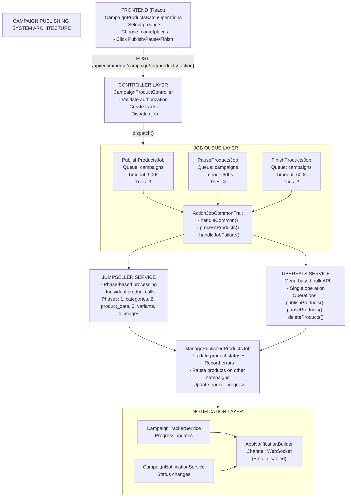

---

## 3. Publishing Flow

### Step-by-Step Flow

```mermaid
flowchart TD
    S1["STEP 1: User Action<br/>User selects products → Selects marketplaces (Jumpseller, UberEats) → Clicks 'Publicar'"]

    S2A["CampaignProductsBatchOperations.tsx"]
    S2B["Validates selection (products + marketplaces)"]
    S2C["POST /api/ecommerce/campaign/{id}/products/publish<br/>{ product_ids: [uuid1, uuid2, uuid3], marketplace_ids: [1, 2] }"]
    S2A --> S2B --> S2C

    S3A["CampaignProductController::publish()"]
    S3B["Authorize action (CampaignMarketplaceProduct policy)"]
    S3C["Validate request (PublishCampaignProductRequest)"]
    S3D["**UPDATE TRACKER** (Before dispatch - prevents stuck states)<br/>CampaignTrackerService::createOrUpdateTracker()<br/>status: 'pending', progress: 0%"]
    S3E["Dispatch job<br/>PublishProductsJob::dispatch($campaignMarketplaceProducts, $tracker)"]
    S3A --> S3B --> S3C --> S3D --> S3E

    S4A["PublishProductsJob::handle()"]
    S4B["ActionJobCommonTrait::handleCommon()"]
    S4C["Group products by marketplace"]
    S4D["For each marketplace: Get marketplace service (via MarketplaceContract)"]
    S4E["Check rate limits"]
    S4F1["delay = 0 → Execute immediately"]
    S4F2["delay ≤ 5s → sleep() then execute"]
    S4F3["delay > 5s → Dispatch delayed job"]
    S4G["Execute: $service->publishProducts()"]
    S4H["Dispatch ManagePublishedProductsJob::dispatchSync()"]
    S4A --> S4B --> S4C --> S4D --> S4E
    S4E --> S4F1
    S4E --> S4F2
    S4E --> S4F3
    S4F1 --> S4G
    S4F2 --> S4G
    S4F3 --> S4G
    S4G --> S4H

    S5A["ManagePublishedProductsJob::handle()"]
    S5B["Update successful products<br/>status = PUBLISHED, published_at = now(), error_message = null"]
    S5C["Update failed products<br/>status = ERRORED, error_message = {reason}"]
    S5D["Pause products on other active campaigns<br/>A product can only be published once per marketplace"]
    S5E["Update tracker progress<br/>CampaignTrackerService::updateProgress()"]
    S5A --> S5B --> S5C --> S5D --> S5E

    S6A["ManageCampaign::finishNotification()"]
    S6B["Update campaign status (if all products processed)<br/>Campaign.status = PUBLISHED"]
    S6C["CampaignNotificationService::campaignStatusChanged()"]
    S6D["AppNotificationBuilder::send()"]
    S6E["WebSocket → tenant.{id}.system channel"]
    S6F["'Campaign published successfully'"]
    S6A --> S6B --> S6C --> S6D --> S6E --> S6F

    S1 --> S2A
    S2C --> S3A
    S3E --> S4A
    S4H --> S5A
    S5E --> S6A
```

### Timeline Diagram

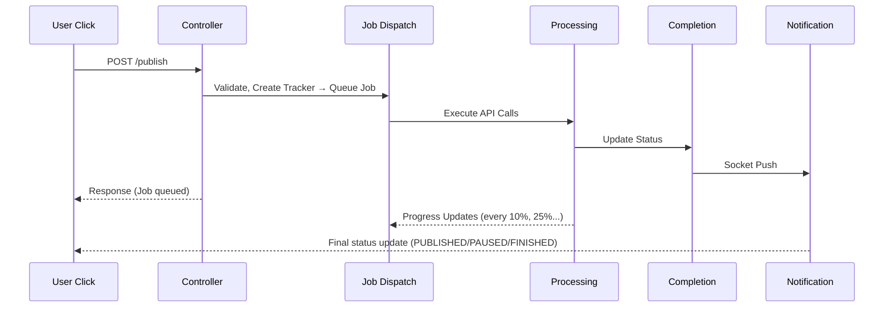

---

## 4. Marketplace Integrations

### 4.1 Jumpseller Integration

Jumpseller uses a **phase-based** processing approach. Products are published in sequential phases:

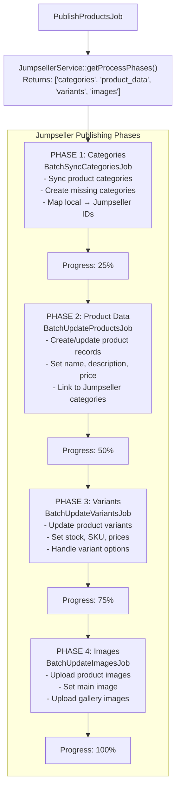

Key Characteristics:
- Individual API calls per product
- Rate limiting per request
- Phase can fail independently
- Granular progress tracking

#### Jumpseller API Flow

```php
// JumpsellerService.php - Publish flow
public function publishProducts($user, $products, ...): array
{
    $pushed = [];
    $failed = [];
    
    foreach ($products as $product) {
        try {
            // Check if product exists in Jumpseller
            $jsProduct = $this->getProduct($product->marketplace_product_id);
            
            if ($jsProduct) {
                // Update existing
                $this->updateProduct($product);
            } else {
                // Create new
                $this->createProduct($product);
            }
            
            $pushed[] = $product;
        } catch (Exception $e) {
            // Handle 404 - product was deleted, recreate
            if ($e->getCode() === 404) {
                $this->createProduct($product);
                $pushed[] = $product;
            } else {
                $failed[] = $product;
            }
        }
    }
    
    return ['pushed' => $pushed, 'failed' => $failed];
}
```

### 4.2 UberEats Integration

UberEats uses a **menu-based** bulk API approach. All products are sent as a complete menu structure:

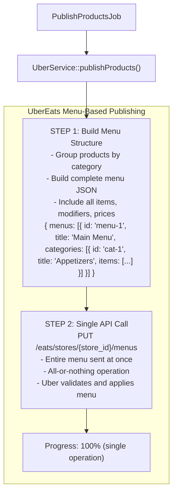

Key Characteristics:
- Single API call for entire menu
- All products processed together
- Faster for bulk operations
- All-or-nothing success/failure

#### UberEats API Flow

```php
// UberService.php - Publish flow
public function publishProducts($user, $products, ...): array
{
    // 1. Get or create menu for store
    $menu = $this->getOrCreateMenu($this->storeId);
    
    // 2. Group products by category
    $categories = $this->groupByCategory($products);
    
    // 3. Build complete menu structure
    $menuData = $this->buildMenuPayload($categories);
    
    // 4. Single API call to update menu
    $response = $this->uberApi->updateMenu($this->storeId, $menuData);
    
    // 5. Determine success/failure per product
    if ($response->success) {
        return ['pushed' => $products, 'failed' => []];
    } else {
        return ['pushed' => [], 'failed' => $products];
    }
}
```

### Comparison Table

| Aspect | Jumpseller | UberEats |
|--------|------------|----------|
| **API Style** | Individual product calls | Menu-based bulk |
| **Processing** | Phase-based (4 phases) | Single operation |
| **Progress Tracking** | Per-phase (25%, 50%, 75%, 100%) | Single (0% → 100%) |
| **Rate Limiting** | Per-request with delays | Menu-level |
| **Failure Mode** | Partial (some products fail) | All-or-nothing |
| **Recovery** | Retry individual phases | Retry entire menu |
| **Finish Action** | Delete or archive product | **DELETE** product from menu |

---

## 5. Notification System

### Notification Architecture

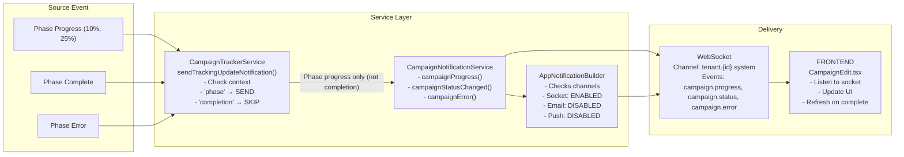

### Notification Events

| Event | Trigger | Channel | Enabled |
|-------|---------|---------|---------|
| `campaign.tracker.update` | Phase progress milestone | Socket | ✅ Yes |
| `campaign.status` | Final status (PUBLISHED/PAUSED/FINISHED) | Socket | ✅ Yes |
| `campaign.error` | Operation failure | Socket | ✅ Yes |
| Campaign email | Any status change | Email | ❌ No |
| Push notification | Any status change | FCM | ❌ No |

### Notifiable Statuses (Final States Only)

```php
// CampaignNotificationService.php
const NOTIFIABLE_STATUSES = [
    Campaign::STATUS_PUBLISHED,   // Publishing completed
    Campaign::STATUS_FINISHED,    // Finishing completed  
    Campaign::STATUS_PAUSED,      // Pausing completed
];

// Notifications are ONLY sent for these final states
// Intermediate states (in_progress, pending) do NOT trigger notifications
```

### Notification Payload Structure

```json
// Progress notification
{
    "type": "campaign.tracker.update",
    "tracker_update": {
        "id": 123,
        "campaign_id": "uuid-here",
        "status": "in_progress",
        "progress": 50.00,
        "current_phase": "product_data",
        "phases": {
            "categories": { "status": "completed", "progress": 100 },
            "product_data": { "status": "in_progress", "progress": 50 },
            "variants": { "status": "pending", "progress": 0 },
            "images": { "status": "pending", "progress": 0 }
        }
    },
    "message": "Campaign tracking update for Jumpseller",
    "notification_metadata": {
        "event": "update",
        "context": "phase",
        "timestamp": "2025-01-01T12:00:00Z"
    }
}

// Status change notification
{
    "type": "campaign.status",
    "campaign_id": "uuid-here",
    "status": "PUBLISHED",
    "message": "Campaign 'Summer Sale' has been published successfully",
    "marketplace": "Jumpseller",
    "products_count": 25,
    "success_count": 24,
    "error_count": 1
}
```

### Frontend Handling

```typescript
// CampaignEdit.tsx
useEffect(() => {
    // Listen to tracker updates via WebSocket
    if (tracker?.status === 'completed' || tracker?.status === 'finished') {
        // Refresh product list when operation completes
        refresh();
    }
}, [tracker?.status]);
```

---

## 6. Tracker System

### Tracker State Machine

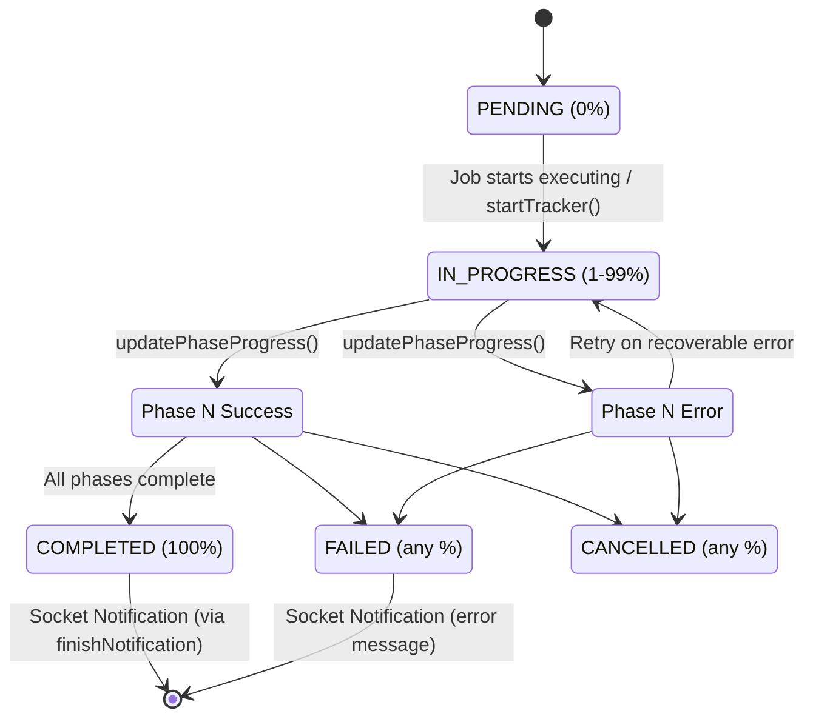

### Tracker Database Model

```sql
-- campaign_trackers table
CREATE TABLE campaign_trackers (
    id BIGINT PRIMARY KEY,
    campaign_id UUID NOT NULL,
    marketplace_id INT,
    
    -- Type & Action
    process_type ENUM('main', 'marketplace'),
    action ENUM('publishing', 'pausing', 'finishing', 'republishing'),
    
    -- Status
    status ENUM('pending', 'in_progress', 'completed', 'failed', 'paused', 'cancelled'),
    
    -- Progress
    progress DECIMAL(5,2) DEFAULT 0.00,
    current_phase VARCHAR(50),
    
    -- Phase details (JSON)
    phases JSON,
    /*
    {
        "categories": { "status": "completed", "total": 5, "processed": 5, "success": 5, "failed": 0 },
        "product_data": { "status": "in_progress", "total": 25, "processed": 12, "success": 11, "failed": 1 },
        ...
    }
    */
    
    -- Counts
    total_items INT DEFAULT 0,
    processed_items INT DEFAULT 0,
    success_count INT DEFAULT 0,
    failed_count INT DEFAULT 0,
    
    -- Timing
    started_at TIMESTAMP,
    completed_at TIMESTAMP,
    
    -- Error handling
    error_message TEXT,
    
    -- Audit
    initiated_by INT,
    created_at TIMESTAMP,
    updated_at TIMESTAMP
);
```

### Tracker Service Methods

```php
// CampaignTrackerService.php - Key methods

// Create tracker before job dispatch
public function createTracker(
    Campaign $campaign,
    string $action,
    User $user,
    ?Marketplace $marketplace = null
): CampaignTracker

// Initialize phases with totals
public function initializeTrackerPhases(
    int $trackerId,
    array $phases,
    int $totalItems
): void

// Update progress during processing
public function updatePhaseProgress(
    int $trackerId,
    string $phaseName,
    int $processed,
    int $success,
    int $failed
): void

// Mark phase complete
public function completePhase(int $trackerId, string $phaseName): void
public function failPhase(int $trackerId, string $phaseName, string $reason): void

// Final tracker states
public function completeTracker(int $trackerId, bool $hasErrors = false): void
public function failTracker(int $trackerId, string $reason): void
```

### Cache Strategy

```php
// Tracker caching for performance
const CACHE_PREFIX = 'campaign_tracker:';
const CACHE_TTL = 300; // 5 minutes

// Cache keys
"campaign_tracker:tracker:{id}"              // Full tracker data
"campaign_tracker:progress:{id}"             // Progress summary
"campaign_tracker:active:{campaignId}:{action}"  // Active tracker lookup

// Cache invalidation
// - On status change
// - On progress update (> 5% change)
// - On completion/failure
```

---

## 7. Pause & Finish Flows

### Pause Flow

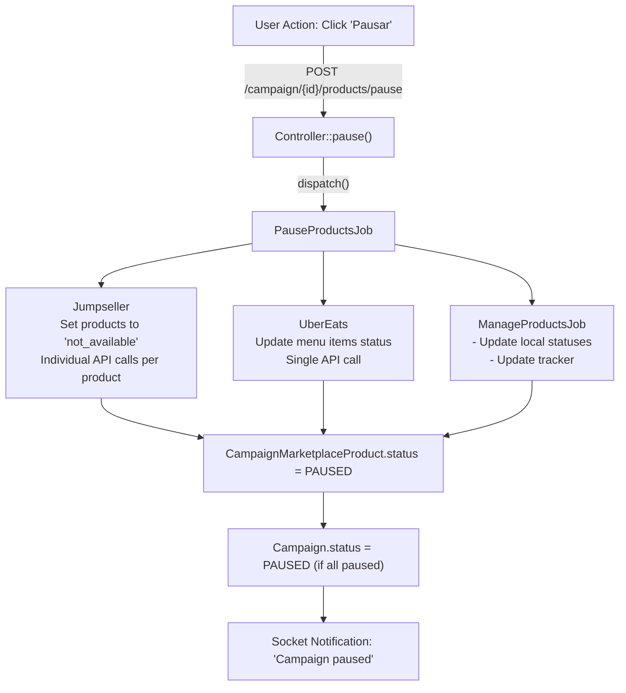

### Finish Flow

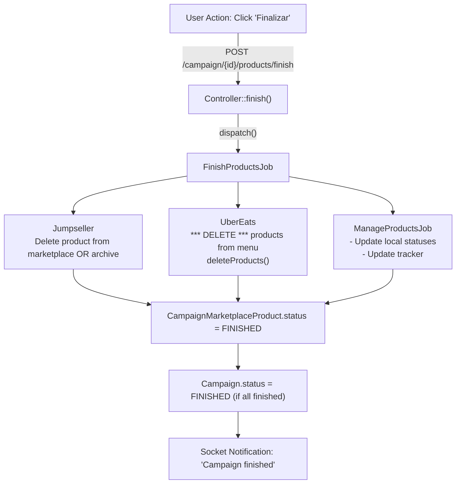

### Important: UberEats Finish = DELETE

```php
// UberService.php
public function finishProducts($user, $products, ...): array
{
    // IMPORTANT: Finish action DELETES products from Uber menu
    // This is intentional - products are removed, not just hidden
    return $this->deleteProducts($user, $products, ...);
}

public function deleteProducts($user, $products, ...): array
{
    // Remove items from menu entirely
    $menu = $this->getMenu($this->storeId);
    
    foreach ($products as $product) {
        $menu = $this->removeItemFromMenu($menu, $product->marketplace_product_id);
    }
    
    return $this->updateMenu($menu);
}
```

---

## 8. Error Handling

### Error Handling Layers

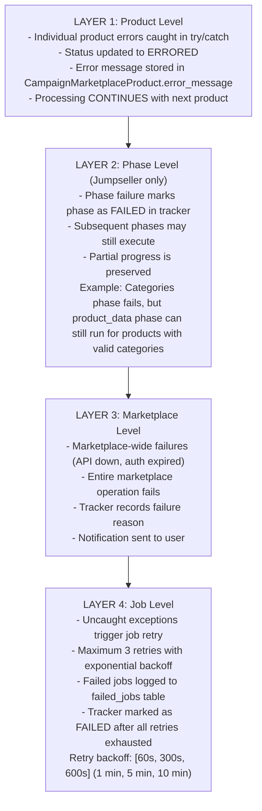

```php
// Layer 1 example
try {
    $service->publishProduct($product);
    $pushed[] = $product;
} catch (Exception $e) {
    $product->update(['status' => 'ERRORED', 'error_message' => $e->getMessage()]);
    $failed[] = $product;
    // Continue processing other products
}
```

### Rate Limiting & Retry Strategy

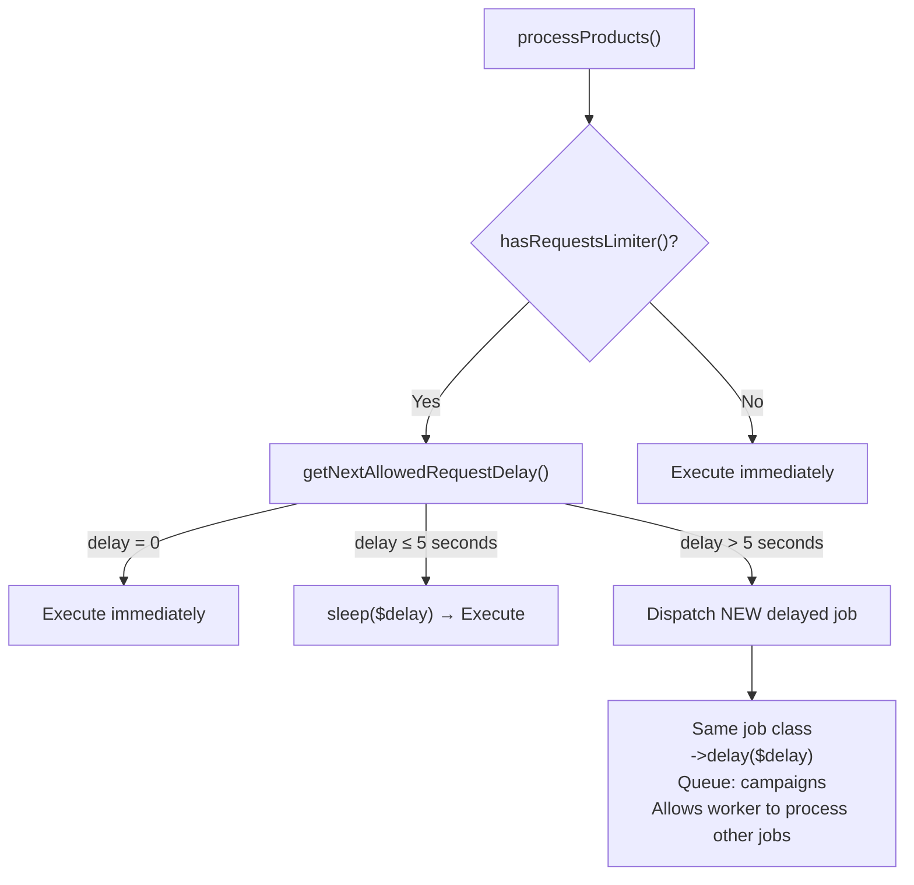

### Error Recovery Patterns

| Scenario | Detection | Handling | Recovery |
|----------|-----------|----------|----------|
| API timeout | `ConnectException` | Retry with backoff | Job re-dispatched |
| Rate limit hit | `429 Too Many Requests` | Delayed job dispatch | New job in X seconds |
| Invalid product | Validation exception | Skip + mark errored | Continue with others |
| Auth expired | `401 Unauthorized` | Fail entire operation | Manual refresh token |
| Network error | `ConnectionException` | Retry with backoff | Job re-dispatched |
| Product deleted | `404 Not Found` | Recreate product | Auto-recovery |

### Jumpseller 404 Recovery

```php
// JumpsellerService.php - Special handling for deleted products
public function updateProduct($product): void
{
    try {
        $this->api->put("/products/{$product->marketplace_product_id}", [...]);
    } catch (NotFoundException $e) {
        // Product was deleted from Jumpseller, recreate it
        Log::info("Product not found, recreating", ['id' => $product->id]);
        $this->createProduct($product);
    }
}
```

---

## 9. Technical Reference

### File Locations

| Component | Path |
|-----------|------|
| **Controllers** | |
| CampaignProductController | `domain/app/Http/Controllers/API/ECommerce/CampaignProductController.php` |
| CampaignMarketplaceProductController | `domain/app/Http/Controllers/API/ECommerce/CampaignMarketplaceProductController.php` |
| **Jobs** | |
| PublishProductsJob | `domain/app/Jobs/ECommerce/CampaignMarketplaceProducts/PublishProductsJob.php` |
| PauseProductsJob | `domain/app/Jobs/ECommerce/CampaignMarketplaceProducts/PauseProductsJob.php` |
| FinishProductsJob | `domain/app/Jobs/ECommerce/CampaignMarketplaceProducts/FinishProductsJob.php` |
| ManagePublishedProductsJob | `domain/app/Jobs/ECommerce/CampaignMarketplaceProducts/ManagePublishedProductsJob.php` |
| ManageFinishedProductsJob | `domain/app/Jobs/ECommerce/CampaignMarketplaceProducts/ManageFinishedProductsJob.php` |
| ActionJobCommonTrait | `domain/app/Jobs/ECommerce/CampaignMarketplaceProducts/ActionJobCommonTrait.php` |
| **Services** | |
| CampaignNotificationService | `domain/app/Services/Campaign/CampaignNotificationService.php` |
| CampaignTrackerService | `domain/app/Services/Campaign/CampaignTrackerService.php` |
| UberService | `domain/app/Services/ECommerce/Marketplaces/Uber/UberService.php` |
| JumpsellerService | `domain/app/Services/ECommerce/Marketplaces/Jumpseller/JumpsellerService.php` |
| **Models** | |
| Campaign | `domain/app/Models/ECommerce/Campaign.php` |
| CampaignMarketplaceProduct | `domain/app/Models/ECommerce/CampaignMarketplaceProduct.php` |
| CampaignTracker | `domain/app/Models/ECommerce/CampaignTracker.php` |
| **Frontend** | |
| CampaignEdit | `packages/kt-ecommerce/src/components/Campaign/CampaignEdit.tsx` |
| CampaignProductsBatchOperations | `packages/kt-ecommerce/src/components/Campaign/Products/CampaignProductsBatchOperations.tsx` |
| CampaignProductsBatchActions | `packages/kt-ecommerce/src/components/Campaign/Campaign/CampaignProductsBatchActions.tsx` |

### API Endpoints

| Endpoint | Method | Description |
|----------|--------|-------------|
| `/api/ecommerce/campaign/{id}/products/publish` | POST | Publish selected products |
| `/api/ecommerce/campaign/{id}/products/pause` | POST | Pause selected products |
| `/api/ecommerce/campaign/{id}/products/finish` | POST | Finish selected products |
| `/api/ecommerce/campaign/{id}/products/delete` | POST | Delete selected products |
| `/api/ecommerce/campaign/{id}/progress` | GET | Get campaign progress/tracker |
| `/api/ecommerce/campaign/{id}/marketplace-products` | GET | List marketplace products |

### Request Payload

```json
// POST /api/ecommerce/campaign/{id}/products/publish
{
    "product_ids": ["uuid-1", "uuid-2", "uuid-3"],
    "marketplace_ids": [1, 2]
}
```

### Status Constants

```php
// CampaignMarketplaceProduct statuses
const STATUS_PENDING = 'PENDING';
const STATUS_PUBLISHED = 'PUBLISHED';
const STATUS_PAUSED = 'PAUSED';
const STATUS_FINISHED = 'FINISHED';
const STATUS_ERRORED = 'ERRORED';
const STATUS_DELETED = 'DELETED';

// Campaign statuses
const STATUS_DRAFT = 'DRAFT';
const STATUS_PENDING = 'PENDING';
const STATUS_PUBLISHED = 'PUBLISHED';
const STATUS_PAUSED = 'PAUSED';
const STATUS_FINISHED = 'FINISHED';

// Tracker statuses
const STATUS_PENDING = 'pending';
const STATUS_IN_PROGRESS = 'in_progress';
const STATUS_COMPLETED = 'completed';
const STATUS_FAILED = 'failed';
const STATUS_PAUSED = 'paused';
const STATUS_CANCELLED = 'cancelled';
```

### Queue Configuration

```php
// config/queue.php (relevant section)
'connections' => [
    'redis' => [
        'driver' => 'redis',
        'connection' => 'default',
        'queue' => env('REDIS_QUEUE', 'default'),
        'retry_after' => 900, // 15 minutes
        'block_for' => null,
    ],
],

// Job configuration
public $queue = 'campaigns';
public $timeout = 900;  // 15 minutes
public $tries = 3;
public $maxExceptions = 3;
public function backoff(): array { return [60, 300, 600]; }
```

### WebSocket Channels

```php
// Broadcasting channels
"tenant.{tenantId}.system"  // Main tenant notification channel

// Event types
"campaign.tracker.update"   // Progress updates
"campaign.status"           // Status changes
"campaign.error"            // Error notifications
```

### Environment Variables

```env
# Queue configuration
QUEUE_CONNECTION=redis
REDIS_QUEUE=default

# Broadcasting
BROADCAST_DRIVER=pusher
PUSHER_APP_KEY=your-key
PUSHER_APP_SECRET=your-secret
PUSHER_APP_ID=your-app-id
PUSHER_APP_CLUSTER=us2

# Marketplace APIs
JUMPSELLER_API_URL=https://api.jumpseller.com
UBER_EATS_API_URL=https://api.uber.com/eats
```

---

## Quick Reference Cheat Sheet

### Publishing a Campaign

1. User selects products and marketplaces
2. Frontend POSTs to `/campaign/{id}/products/publish`
3. Controller validates and creates tracker
4. **Tracker updated BEFORE job dispatch** (prevents stuck states)
5. `PublishProductsJob` dispatched to queue
6. Job groups products by marketplace
7. Each marketplace service processes products
8. `ManagePublishedProductsJob` updates statuses
9. Tracker completed, notification sent

### Notification Triggers

| When | What | Channel |
|------|------|---------|
| Phase progress (10%, 25%...) | `campaign.tracker.update` | Socket |
| Operation complete | `campaign.status` | Socket |
| Operation failed | `campaign.error` | Socket |
| **Email notifications** | **DISABLED** | - |

### Key Design Decisions

1. **Tracker updated before job dispatch** - Prevents "stuck in_progress" states
2. **Email notifications disabled** - Reduces spam, socket-only
3. **Socket notifications only for final states** - PUBLISHED/PAUSED/FINISHED
4. **Rate limit > 5s spawns new job** - Doesn't block worker
5. **UberEats finish = DELETE** - Products removed from menu, not paused
6. **Jumpseller 404 = recreate** - Auto-recovery for deleted products

---

*Last updated: December 2025*
