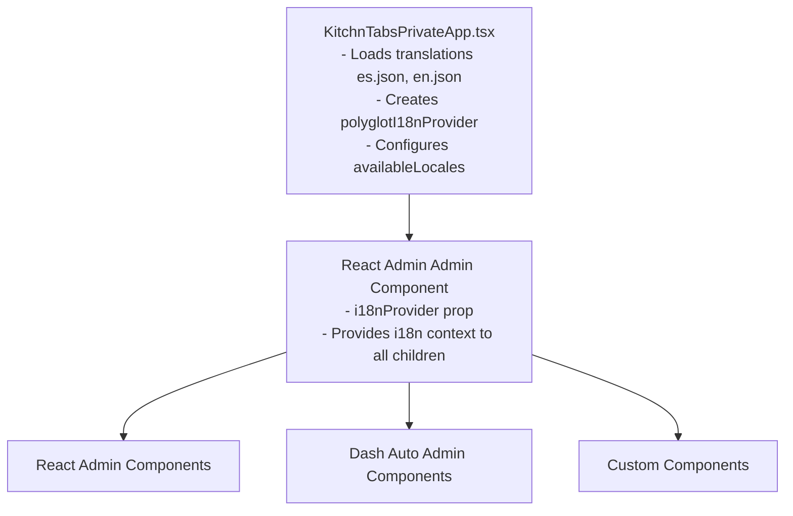

# i18n Integration Guide - KitchnTabs Application

## Overview

This document explains how internationalization (i18n) is integrated across the KitchnTabs application, including React Admin, Dash Auto Admin, and custom components.

## Architecture

### 1. Translation Flow



## Components

### 1. KitchnTabsPrivateApp (Entry Point)

**File:** `apps/kitchntabs-{app}/src/core/KitchnTabsPrivateApp.tsx`

This is where the i18n provider is created and configured:

```typescript
// Load translations from dash-admin and merge with custom translations
const loadTranslations = async () => {
    const [enLang, esLang] = await Promise.all([
        import('dash-admin').then(module => module.en),
        import('dash-admin').then(module => module.es)
    ]);

    const translationsData = {
        en: { ...enLang, ...customEnglish },
        es: { ...esLang, ...customSpanish },
    };

    // Create i18nProvider with availableLocales
    const provider = polyglotI18nProvider(
        locale => translationsData[locale] || translationsData.en,
        settings?.locale || 'en',
        settings?.availableLocales?.map(({ locale, name }) => ({ locale, name })) || [
            { locale: 'en', name: 'English' },
            { locale: 'es', name: 'Español' }
        ]
    );

    setI18nProvider(provider);
};
```

**Key Points:**
- Merges base translations from dash-admin with custom translations (customEnglish, customSpanish)
- Creates `polyglotI18nProvider` with four parameters:
  1. **getMessages function:** Returns translations for a locale
  2. **initialLocale:** Default language (from Redux settings or 'en')
  3. **availableLocales:** Array of available languages (enables LocalesMenuButton)
  4. **polyglotOptions:** Options like `{ allowMissing: true }`

### 2. Translation Files

**Location:** `apps/kitchntabs/src/i18n/`

#### Spanish (es.json)
```json
{
    "tab.status.created": "Creado",
    "tab.status.confirmed": "Confirmado",
    "tab.resource.tabs_admin": "Tabs Admin",
    "tab.resource.filter.status": "Estado",
    ...
}
```

#### English (en.json)
```json
{
    "tab.status.created": "Created",
    "tab.status.confirmed": "Confirmed",
    "tab.resource.tabs_admin": "Tabs Admin",
    "tab.resource.filter.status": "Status",
    ...
}
```

### 3. Package-Owned Translations (`kt-*` / `vx-*`)

A shared package ships its **own** bundles rather than having each consuming app
restate its keys — the strings belong to the component, so adding one should be
a single-file change.

```typescript
// packages/vx-character-preview/src/index.ts
export { en as characterPreviewEn, es as characterPreviewEs } from './i18n';

// apps/<app>/src/KitchnTabsWebPrivateApp.tsx
en: mergeTranslations(dashAdminEn, characterPreviewEn, customEnglish),
es: mergeTranslations(dashAdminEs, characterPreviewEs, customSpanish),
```

`mergeTranslations` is variadic and deep, and **later sources win** — so the app
can still override any individual key without restating the package's bundle.

A package that must stay usable from a **public** app (no React Admin) should
not import `useTranslate`; it takes a `translate` prop instead, defaulting to
polyglot's `_` fallback so it renders readable text with no provider. Full
detail, including why these bundles cannot be lazy-loaded, is in
`_DASH_I18N_TECHNICAL_DOCUMENTATION.md` §7.4.

### 4. Custom Components Translation

**Pattern:** Use `useTranslate()` hook from react-admin

```typescript
import { useTranslate } from 'react-admin';

const MyComponent = () => {
    const translate = useTranslate();
    
    return (
        <div>
            <h1>{translate('tab.status.created')}</h1>
            <p>{translate('tab.message.with_variable', { count: 5 })}</p>
        </div>
    );
};
```

**Examples:**
- `TabStatus.tsx` - Status labels
- `VoiceTabAgent.tsx` - Voice agent UI
- `CategorySelector.tsx` - Category filters
- `TabAgentToolbar.tsx` - Toolbar status messages

## React Auto Admin Integration

### 1. Resource Configuration

**File:** `kt-tabs/resources/tabResource.tsx`

Resource labels and configuration values are automatically translated by React Admin when they match translation keys:

```typescript
const resources: IDashAutoAdminResourceConfig[] = [
    {
        model: "tab/tab",
        label: "tab.resource.tabs", // Translation key (not hardcoded text)
        
        menu: [
            {
                title: "tab.resource.menu.list", // Translation key
                redirect: "/tab/tab",
            },
        ],
        
        mainAction: {
            title: "tab.resource.action.create", // Translation key
            fn: "redirect",
            mode: "create",
        },
    }
];
```

**How it works:**
- React Admin's `<Resource>` component automatically translates the `label` prop
- Translation pattern: `resources.{resourceName}.name`
- However, we use custom translation keys for more control

### 2. Filter Options Translation

**Pattern:** Use translation keys in choice arrays with `translateChoice: true`

```typescript
const getStatusFilterOptions = () => [
    { id: 'CREATED', name: 'tab.status.created' },
    { id: 'CONFIRMED', name: 'tab.status.confirmed' },
    { id: 'IN_PREPARATION', name: 'tab.status.in_preparation' },
    // ...
];

// In resource config:
referenceFilters: [
    {
        id: 'status_id',
        label: 'tab.resource.filter.status', // Translation key
        source: 'status',
        reference: getStatusFilterOptions(),
        optionText: 'name',
        fieldProps: {
            translateChoice: true, // IMPORTANT: Enable translation
        },
        referenceComponent: SelectInput,
    },
]
```

**Key Points:**
- `label` - Translated by React Admin
- `name` in choices - Must be translation keys
- `translateChoice: true` - Tells SelectInput to translate choice labels
- Works with `SelectInput`, `SelectArrayInput`, `AutocompleteInput`, etc.

### 3. Layout Render Translation

**Pattern:** Use translation keys in layout render functions

```typescript
showLayout(render) {
    return (
        <Grid container spacing={2}>
            <Grid size={{ xs: 12 }}>
                {render("tab.resource.layout.products")}
            </Grid>
            <Grid size={{ xs: 12 }}>
                {render("tab.resource.layout.order")}
            </Grid>
        </Grid>
    );
}
```

The `render()` function in Dash Auto Admin automatically translates the section keys.

## Language Switcher

### LocalesMenuButton Integration

**File:** `packages/dash-admin/src/default-theme/menu/AppMaterialMenu.tsx`

```typescript
import { LocalesMenuButton } from 'react-admin';

// In component JSX:
<LocalesMenuButton />
```

**How it works:**
1. `LocalesMenuButton` calls `i18nProvider.getLocales()`
2. `getLocales()` is provided by the third parameter of `polyglotI18nProvider`
3. Automatically displays available languages from `availableLocales` array
4. Uses React Admin's store for persistence
5. Triggers re-render of all components when language changes

### Redux Settings

**File:** `apps/kitchntabs/src/main.tsx`

```typescript
const defaultAppSettings = () => ({
    locale: 'es',
    availableLocales: [
        { locale: 'en', languageId: 'english', name: 'English', icon: 'en' },
        { locale: 'es', languageId: 'spanish', name: 'Español', icon: 'es' },
    ],
});
```

These settings are used by `KitchnTabsPrivateApp` to configure the i18nProvider.

## Translation Key Naming Convention

### Pattern: `{domain}.{category}.{item}`

```
tab.status.created              → Tab status labels
tab.action.confirm              → Tab action buttons
tab.resource.tabs_admin         → Resource labels
tab.resource.filter.status      → Filter labels
tab.resource.layout.products    → Layout section labels
tab.products.search.label       → Product search UI
voice.examples.example1         → Voice agent examples
category.all                    → Category selector
```

### Benefits:
- **Organization:** Easy to find and maintain translations
- **Consistency:** Clear naming patterns across the app
- **Scalability:** Easy to add new domains and categories
- **Auto-complete:** IDEs can suggest keys based on hierarchy

## Translation Interpolation

### Using Variables in Translations

```json
{
    "tab.products.search.local_active": "Búsqueda local activa. Escribe %{count} caracteres más para buscar en el servidor."
}
```

```typescript
const message = translate('tab.products.search.local_active', { 
    count: remainingChars 
});
```

**Polyglot.js syntax:** `%{variableName}`

## Best Practices

### 1. Always Use Translation Keys (Not Hardcoded Text)

❌ **Bad:**
```typescript
label: "Estado"
title: "Listado"
```

✅ **Good:**
```typescript
label: "tab.resource.filter.status"
title: "tab.resource.menu.list"
```

### 2. Enable translateChoice for Selects

❌ **Bad:**
```typescript
reference: [
    { id: 'CREATED', name: 'Creado' }
]
```

✅ **Good:**
```typescript
reference: [
    { id: 'CREATED', name: 'tab.status.created' }
],
fieldProps: {
    translateChoice: true
}
```

### 3. Group Related Translations

✅ **Good structure:**
```json
{
    "tab": {
        "status": {
            "created": "...",
            "confirmed": "..."
        },
        "action": {
            "confirm": "...",
            "close": "..."
        }
    }
}
```

### 4. Maintain Consistency Across Languages

Both `es.json` and `en.json` should have the same structure and keys:

```json
// es.json
{
    "tab.status.created": "Creado"
}

// en.json  
{
    "tab.status.created": "Created"
}
```

## Testing Translations

### 1. Verify It Compiles First

**`pnpm typecheck` does not exist in `apps/*`** — it exits `127`, and grepping
that empty output for `error TS` reports zero for a command that never ran. Use
the project-level invocation and check the exit code:

```bash
cd apps/<app> && npx tsc --noEmit -p .; echo "exit=$?"
```

Locale files are large hand-maintained object literals, and the property before
an insertion point often ends `}` with **no trailing comma** — appending a key
there produces `}` followed by `your_key:`, which takes the dev server down with
`Expected "}" but found "your_key"`. Parse-check the file directly after editing:

```bash
./node_modules/vite/node_modules/esbuild/bin/esbuild apps/<app>/src/i18n/es.tsx --outfile=/dev/null
```

### 2. Manual Testing Checklist

- [ ] Switch languages using LocalesMenuButton
- [ ] Verify all UI text updates
- [ ] Check filter dropdowns translate
- [ ] Verify menu items translate
- [ ] Test resource labels translate
- [ ] Refresh page - language persists
- [ ] Check interpolated variables work

### 3. Debugging

**Check translation keys are loaded:**
```typescript
console.log(translate('tab.status.created'));
// Should output: "Creado" (es) or "Created" (en)
```

**Check i18nProvider is configured:**
```typescript
console.log(i18nProvider.getLocales());
// Should output: [{ locale: 'en', name: 'English' }, { locale: 'es', name: 'Español' }]
```

**Check current locale:**
```typescript
const { locale } = useLocaleState();
console.log('Current locale:', locale);
```

## Common Issues & Solutions

### Issue 1: Translation Keys Not Working

**Symptom:** Seeing translation keys instead of translated text (e.g., "tab.status.created" instead of "Creado")

**Solutions:**
1. Verify translation key exists in both `es.json` and `en.json`
2. Check for typos in the key name
3. Ensure i18nProvider is properly loaded in KitchnTabsPrivateApp
4. Check browser console for i18n errors

### Issue 2: Select Options Not Translating

**Symptom:** Dropdown options show translation keys

**Solution:**
Add `translateChoice: true` in `fieldProps`:
```typescript
fieldProps: {
    translateChoice: true
}
```

### Issue 3: A Boolean Field Shows Its Key Above The Switch

**Symptom:** the switch reads correctly, but a raw key sits above it:

```
resource.ai.agent_config.field_is_active
[toggle] Active
```

**Cause:** `AttributeToInput` renders a Boolean as
`<InputLabel>{input.label}</InputLabel>` above the input, and **that label is
printed raw** — only the `BooleanInput`'s own `label` prop is translated. Any
Boolean whose `label` is an i18n key hits this.

**Solution:** suppress the duplicate heading; the switch keeps its translated
label.

```typescript
{
    attribute: 'is_active',
    label: 'resource.ai.agent_config.field_is_active',
    type: Boolean,
    showLabel: false,
}
```

### Issue 4: Language Switcher Not Showing

**Symptom:** LocalesMenuButton doesn't display

**Solutions:**
1. Verify `availableLocales` is passed to `polyglotI18nProvider` (3rd parameter)
2. Check that LocalesMenuButton is imported from 'react-admin'
3. Verify i18nProvider is set before rendering Admin component

### Issue 5: Language Not Persisting

**Symptom:** Language resets to default on page refresh

**Solution:**
React Admin automatically persists locale to localStorage. Verify:
1. LocalesMenuButton is being used (not custom implementation)
2. i18nProvider includes availableLocales parameter
3. Browser localStorage is not being cleared

## Summary

The i18n integration in KitchnTabs follows these principles:

1. **Centralized Configuration:** `KitchnTabsPrivateApp` creates and configures i18nProvider
2. **Translation Keys Everywhere:** Never use hardcoded text, always use translation keys
3. **React Admin Integration:** Leverage React Admin's built-in translation features
4. **Dash Auto Admin Compatible:** Resource configurations automatically translate
5. **Standard Components:** Use `useTranslate()` hook in custom components
6. **LocalesMenuButton:** Use React Admin's standard language switcher
7. **Consistent Structure:** Maintain same key structure across all language files

This approach ensures:
- ✅ Complete internationalization coverage
- ✅ Easy maintenance and updates
- ✅ Consistent user experience
- ✅ Framework best practices
- ✅ Scalability for future languages
