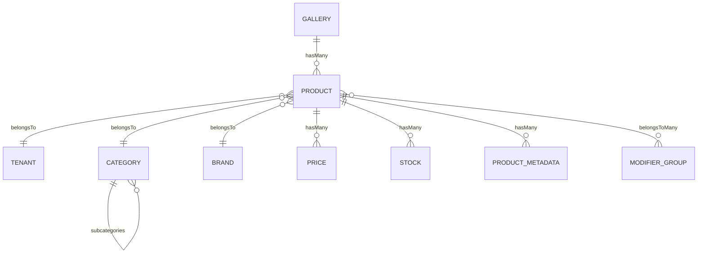

# ECommerce Module

> Product catalog, categories, pricing, and inventory management.

## Overview

The ECommerce module provides the foundation for product management including catalog organization, pricing strategies, stock management, and media galleries.

## Models

### Product
Core product entity with multi-category support.

**Key Fields:**
- `hash_id` - 6-character unique public identifier
- `tenant_id` - Tenant ownership
- `sku`, `name`, `description`
- `category_id` - Primary category (legacy)
- `brand_id`, `gallery_id`
- `is_enabled`, `featured`, `mall_listed`

**Traits:** `HasHashId`, `ResourceVisibility`, `LogsActivity`, `InteractsWithMedia`

### Category
Hierarchical product categories with tree structure.

**Key Fields:**
- `hash_id` - 6-character unique public identifier
- `tenant_id`, `category_id` (parent), `name`
- Supports breadcrumb generation via `breadcrumbed_name`

### Brand
Product brands with contact information.

**Key Fields:**
- `hash_id` - 6-character unique identifier
- `tenant_id`, `name`, `image_path`

### Gallery
Media gallery with Spatie Media Library integration.

**Key Fields:**
- `hash_id` - 6-character unique identifier
- `tenant_id`, `title`, `primary_image_id`
- Supports multiple image conversions (preview, medium, large)

### Pricing Models
- **Pricelist** - Named price tiers
- **Price** - Product-Pricelist pivot
- **StockType** - Inventory locations
- **Stock** - Product-StockType pivot

### Modifiers
- **ModifierGroup** - Groups of product modifiers
- **ModifierOption** - Individual modifier choices

## Relationships



## Multi-Category Support

```php
// Sync categories with primary designation
$product->syncCategories([
    ['category_id' => 1, 'is_primary' => true, 'display_order' => 0],
    ['category_id' => 2, 'is_primary' => false, 'display_order' => 1],
]);

// Simple array sync
$product->syncCategoryIds([1, 2, 3]); // First is primary
```

## Media Management

Products support direct image uploads via Spatie Media Library:

```php
// Get product images
$images = $product->getProductImages();

// Get primary image URL
$url = $product->getProductPrimaryImageUrl('medium');
```
