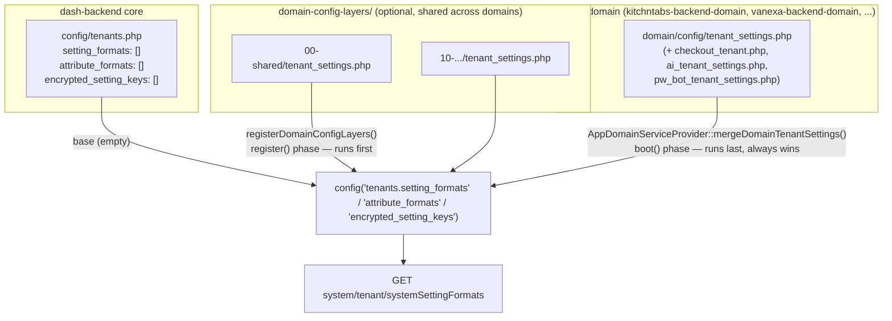

# Tenant Configuration Settings Module Documentation

This document outlines the architecture, interdependencies, and workflow of the Tenant Configuration Settings module in the Dash ecosystem.

**Last Updated**: 2026-08-04 — §1 and §4 rewritten for the core/domain split described below
(`service_fee` and the tenant `attribute_formats` moved out of `dash-backend` core into
`kitchntabs-backend-domain`; core now ships these empty). If you've read this doc before and
just want what changed, jump to §4.

## 1. Architecture Overview

The Tenant Settings module allows for dynamic configuration of tenant-specific properties (settings, themes, colors, contact info) driven by a backend configuration. This "Backend-Driven UI" approach ensures that adding new settings does not always require frontend code changes.

### Key Components

1.  **Backend (`dash-backend`)**:
    *   **Source of truth is split, core/domain** — this is the important change from the previous
        version of this doc. `dash-backend` core's own `config/tenants.php` defines the *schema
        shape* (`setting_formats`, `attribute_formats`, `encrypted_setting_keys`) and ships every
        one of those arrays **empty by default** — core is business-neutral, it doesn't know what
        settings a specific product needs (see §1a).
    *   Every *actual* setting entry — `primary_language`, `theme_colors`, KitchnTabs'
        `service_fee`, the tenant contact-info `attribute_formats`, etc. — is contributed by
        whichever domain is mounted, merged onto core's (empty) arrays at boot. See §1a for the
        exact mechanism and §4 for how to add a new one.
    *   **API Endpoint**: `GET system/tenant/systemSettingFormats`
        (`App\Http\Controllers\API\System\TenantController::getSystemSettingFormats()`) exposes
        the *fully merged* (core + domain) configuration to the frontend as one flat response —
        the frontend never needs to know or care which layer a given setting came from.
    *   **Data Storage**: Tenant settings are stored as JSON in the database (typically in a `settings` column on the `tenants` table).

2.  **Frontend (`dash-admin`)**:
    *   **Context Layer**: `SystemRequestsCache.tsx` (and legacy `TenantSettingsContext.tsx`) caches the configuration from the API to avoid redundant network requests.
    *   **Presentation Layer**:
        *   `TenantSettings.tsx`: Renders the "generic" settings form.
        *   `TenantTheme.tsx`: Renders the "theme/color" settings form.
        *   `TenantAttributes.tsx`: Renders contact/attribute information.
    *   **Schema Definition**: `tenant_superadmin.tsx` integrates these components into the main Tenant resource view in `react-admin`.

### 1a. Core/Domain Split — Where a Setting Actually Lives



Three layers, in this precedence order (later always wins for a matching `id`):

1. **Core defaults** — `dash-backend/config/tenants.php`. Ships `setting_formats: []`,
   `attribute_formats: []`, `encrypted_setting_keys: []`. Core intentionally defines *no* actual
   settings — every product's needs differ (see the KitchnTabs/VaneXa example in §4).
2. **Shared config layers** *(optional)* — `domain-config-layers/*/`, a dedicated,
   config-only Docker mount distinct from `domain/` (which is one whole domain's codebase). Lets
   a setting be shared across *multiple* domains (e.g. a future "ecommerce vertical" defaults set
   reused by more than one brand) without duplicating it into every domain repo. Merged first, in
   sorted subfolder order (`00-`, `10-`, `20-`... — later folders win over earlier ones). Full
   design: `dash-backend-docker/domain-config-layers/README.md`. Empty/unset by default — most
   domains never need this layer.
3. **The active domain's own config** — `domain/config/tenant_settings.php` (+ the other
   feature-scoped files `AppDomainServiceProvider::mergeDomainTenantSettings()` lists:
   `checkout_tenant.php`, `ai_tenant_settings.php`, `pw_bot_tenant_settings.php`). **Always wins**
   — merged last, in the domain's own `boot()` phase, after everything above.

This mirrors the same core/domain principle used throughout DASHADMIN (see CLAUDE.md's core/domain
table) — "does every product need this?" No → it doesn't belong in core's `config/tenants.php`.

**Example — what actually moved (2026-08-04):** `service_fee` (a food-service "service charge %"
setting) and the tenant `attribute_formats` (`public_name`, `address`, `phone`, `mobile`,
`contact_name`, `contact_email`, `contact_phone`) used to be hardcoded directly in
`dash-backend/config/tenants.php`. VaneXa doesn't need `service_fee` at all, and would have
inherited it — and the contact-info attribute set — for free with no way to opt out, simply
because it shares the same core. Both moved to `kitchntabs-backend-domain/config/tenant_settings.php`;
core now ships both arrays empty. VaneXa can add its own `attribute_formats` later (same
mechanism, its own `domain/config/tenant_settings.php`) without ever touching core.

## 2. Interdependencies

The module relies on several inter-connected parts:

*   **`dash-auto-admin`**: The underlying library that renders form inputs based on the schema objects (e.g., `DashAutoFormTabs`, `DashAutoFormGroups`).
*   **`SystemRequestsCache`**: A critical context provider that manages fetching and caching (in memory and IndexedDB) of system-wide configurations, including tenant setting formats.
*   **`TenantSettingsContext`**: A specific usage of the caching mechanism for tenant settings (note: seems to be transitioning to using the more generic `SystemRequestsCache`).
*   **`react-hook-form`**: Used for form state management within the components.
*   **`AppServiceProvider::registerDomainConfigLayers()` / `registerDomainConfigs()`** (core) and
    **`AppDomainServiceProvider::mergeDomainTenantSettings()`** (domain) — the backend-side merge
    chain described in §1a. Nothing in §2's frontend list changed; only where the merged config
    *comes from* changed.

## 3. How It Works (Data Flow)

1.  **Configuration Definition**: Developers define setting fields — in the domain's
    `config/tenant_settings.php` (or a `domain-config-layers/` layer for shared settings; core's
    own `config/tenants.php` only in the rare case of a setting every product should have,
    see §1a). Each field has properties like `id`, `tab`, `type` (boolean, string, color), `default_value`, etc.
2.  **API Consumption**:
    *   The frontend `SystemRequestsCacheProvider` fetches the *merged* config via
        `GET system/tenant/systemSettingFormats` on app load (or on demand) — the three-layer
        merge from §1a has already happened server-side by this point; the frontend just sees one
        flat list.
    *   It caches this data in IndexedDB (`SystemRequestsCacheDB`) to speed up subsequent loads.
3.  **Component Rendering**:
    *   **Tenant Load**: When opening a Tenant record, `react-admin` fetches the tenant data (including current `settings` values).
    *   **Schema Load**: `TenantSettings` and `TenantTheme` subscribe to `useSystemRequestsCache()` to get the *format* definitions.
    *   **Filtering**:
        *   `TenantSettings` filters for items where `tab !== 'colors'`.
        *   `TenantTheme` filters for items where `tab === 'colors'`.
    *   **Form Generation**: `DashAutoFormTabs` (from `dash-auto-admin`) takes the merged data (Schema + Values) and renders the appropriate input fields.

## 4. How to Add More Settings

**This section changed (2026-08-04).** Where you add a setting now depends on who needs it — read
this before reaching for `dash-backend/config/tenants.php`.

### Step 0: Decide where it belongs

| Who needs this setting? | Add it to |
|---|---|
| Only one domain (e.g. a KitchnTabs-only feature) | That domain's own `domain/config/tenant_settings.php` (or `checkout_tenant.php`/`ai_tenant_settings.php`/`pw_bot_tenant_settings.php` if it fits one of those existing feature-scoped files better) |
| Multiple domains, but not literally every product built on core | A new subfolder under `domain-config-layers/` (see `dash-backend-docker/domain-config-layers/README.md`) |
| Genuinely every product core will ever support | `dash-backend/config/tenants.php` directly — rare; this requires a core image rebuild in local dev (`config/` isn't live-mounted — see `dash-backend-docker/docker-compose.yml`'s comments), so treat it as a real cost, not a default choice |

For the common case (a domain-specific setting), **you never need to touch `dash-backend` at
all**, and the change is live immediately (`domain/` is fully bind-mounted in local dev, no
rebuild).

### Step 1: Update Your Domain's Configuration

Open `<your-domain-repo>/config/tenant_settings.php` (create it if it doesn't exist yet — see
`kitchntabs-backend-domain/config/tenant_settings.php` for a working example).

Add a new array item to the `setting_formats` array:

```php
return [
    'setting_formats' => [
        // ...existing entries...
        [
            'id'            => 'new_feature_enabled',      // Unique key for the setting
            'group'         => 'features',                 // Logical grouping (visual)
            'tab'           => 'general',                  // 'colors' for Theme tab, others for Config tab
            'attribute'     => 'settings.new_feature',     // Dot notation path in the JSON column
            'label'         => 'Enable New Feature',       // User-facing label
            'visible'       => true,
            'required'      => false,
            'type'          => 'boolean',                  // 'boolean', 'string', 'integer', 'color', etc.
            'editable'      => true,
            'default_value' => false,
            'description'   => 'Toggles the new feature.',
        ],
    ],

    // Only if this setting stores something secret (API keys, tokens, ...) — see
    // App\Models\Tenant::getEncryptedSettingKeys(), which encrypts these sub-keys at rest.
    // 'encrypted_setting_keys' => ['new_feature_api_key'],

    // Tenant contact/attribute fields (not settings.* — attributes.* instead) go in a
    // separate top-level key, same file:
    // 'attribute_formats' => [ [ 'id' => ..., 'attribute' => 'attributes.foo', ... ] ],
];
```

This file is picked up automatically by
`Domain\App\Providers\AppDomainServiceProvider::mergeDomainTenantSettings()` — no registration
step, no core change. If your domain doesn't already call this method (check its
`AppDomainServiceProvider::boot()`), see `vanexa-backend-domain`'s copy for the minimal wiring —
it's a small, generic method safe to copy as-is.

### Step 2: (Optional) Frontend Customization

If your new setting requires a completely custom UI component that `dash-auto-admin` doesn't support by default:

1.  Define a new `custom` setting in your domain's `config/tenant_settings.php`:
    ```php
    'type' => 'custom',
    'component' => 'MyNewComponent'
    ```
2.  Register/Handle `MyNewComponent` within the `dash-auto-admin` mapping or the `TenantSettings` renderer (this part depends on how `DashAutoForm` resolves custom components, usually via a registry or switch case).

### Step 3: Verify

1.  Reload the frontend (to clear the IndexedDB cache or wait for cache expiry).
2.  Navigate to the Tenant configuration.
3.  The new field should appear automatically in the correct tab.
4.  To confirm it actually merged server-side (useful when debugging a domain provider wiring
    issue), check via tinker in the running container:
    ```php
    collect(config('tenants.setting_formats'))->pluck('id')  // should include your new id
    ```

## 5. Troubleshooting

*   **Changes not showing up?**: The frontend heavily caches these schemas. Try clearing your browser's Application Storage (IndexedDB > SystemRequestsCacheDB) or force a hard reload.
*   **Setting added to the domain file but still missing from `config('tenants.setting_formats')`?**
    Confirm the domain's `AppDomainServiceProvider::boot()` actually calls
    `mergeDomainTenantSettings()` (vanexa-backend-domain didn't, until 2026-08-04 — it's a
    per-domain opt-in, not something core forces). Also confirm the file returns a plain array
    with a `setting_formats` top-level key — a syntax error in the domain file fails silently
    (the `require` throws, but PHP errors here can be easy to miss in a queued/cached boot path).
*   **Edited `dash-backend/config/tenants.php` directly and nothing changed in local dev?**
    Expected — `config/` is not live-mounted (see `dash-backend-docker/docker-compose.yml`'s
    comments); you need an actual core image rebuild. This is one more reason to prefer a domain
    file (§4) whenever the setting isn't genuinely core-wide.
*   **Validation Errors**: Ensure frontend validation rules (if any) match the backend rules defined in the config.

## 6. Related Documentation

- `dash-backend-docker/domain-config-layers/README.md` — full design of the shared config-layers mount referenced in §1a
- [F15: Domain Branding Defaults](../F15-Notifications-Messaging/F15-Notifications-Messaging_DOMAIN_BRANDING_DEFAULTS.md) — the same core/domain-default principle applied to pre-tenant system email branding
