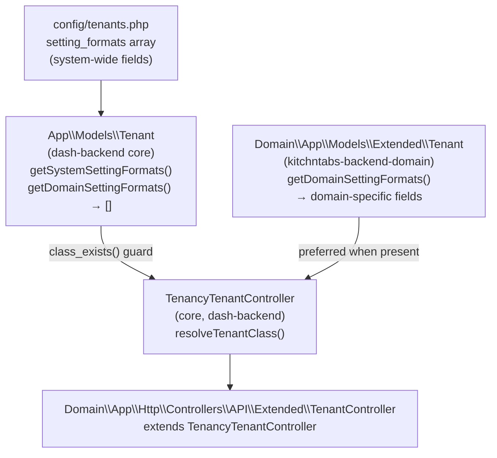
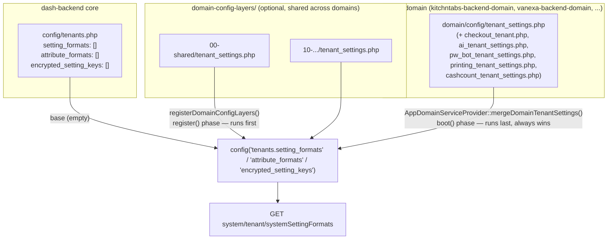
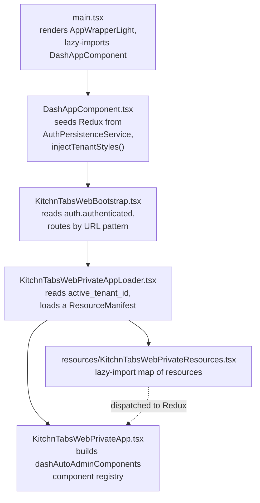
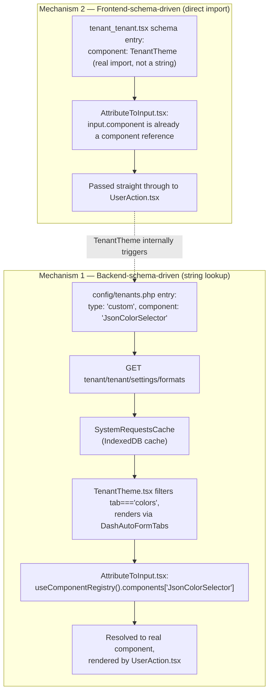
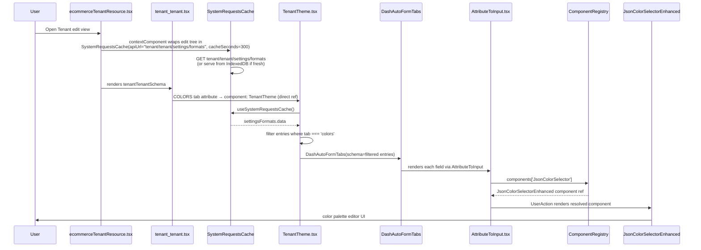
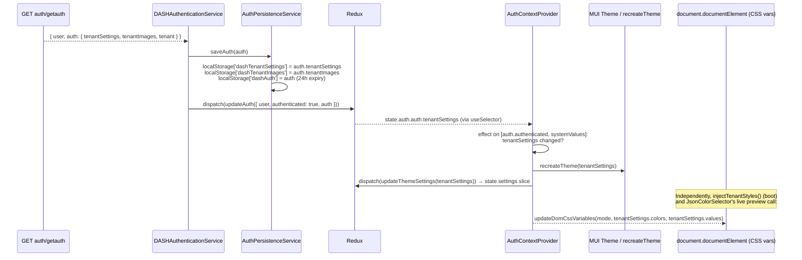

# Tenant Settings Module — End-to-End Technical Documentation

**Category**: Functional Epic (F21: Tenancy Management)
**Status**: Active
**Last Updated**: 2026-08-21 — full rewrite around the schema/values distinction (§1-§7), folding
in the 2026-08-04 core/domain config-layering change (§2.1a: `service_fee` and tenant
`attribute_formats` moved out of `dash-backend` core into `kitchntabs-backend-domain`; core now
ships those arrays empty).

---

## 1. Overview

The Tenant Settings module is a **backend-driven UI** system: the shape of the settings form (which fields exist, their type, label, tab, validation, default value, and — for complex fields — which React component renders them) is defined once on the backend and consumed generically by the frontend. Adding a plain field (boolean/string/integer) normally requires **zero frontend code changes**.

The module spans two repositories and, critically, **two entirely separate data systems** that are easy to conflate:

| | **Setting *Schema*** (metadata) | **Setting *Values*** (actual data) |
|---|---|---|
| What it is | Field definitions: id, label, tab, type, component, validation, default | The tenant's actual stored settings |
| Backend source | `config/tenants.php` (system) + `Tenant::getDomainSettingFormats()` (domain) | `tenants.settings` JSON column |
| Backend endpoint | `GET tenant/tenant/settings/formats` | `GET auth/getauth` (embedded) + normal `PATCH tenant/tenant/{id}` |
| Frontend cache | `SystemRequestsCache` (IndexedDB, 300s TTL) | `AuthPersistenceService` (localStorage) + Redux `auth`/`settings` slices |
| Consumed by | `DashAutoFormTabs` to know *how* to render each field | The rendered form's initial values, the MUI theme, CSS custom properties |

Confusing these two is the most common source of bugs in this module — a field can be perfectly defined in the schema and still show stale or missing data if the *values* system isn't understood.

---

## 2. Backend

### 2.1 Schema source of truth: core vs. domain



The core `App\Models\Tenant` only knows about **system** settings (`config('tenants.setting_formats')`). Domain-specific fields (e.g. `theme_colors`, Uber-specific toggles, POS settings) are defined as a static array returned by `Domain\App\Models\Extended\Tenant::getDomainSettingFormats()`.

`TenancyTenantController` (`dash-backend/app/Http/Controllers/API/Tenancy/TenancyTenantController.php`) resolves which `Tenant` class to call against via a `resolveTenantClass()` helper:

```php
protected function resolveTenantClass(): string
{
    return class_exists(\Domain\App\Models\Extended\Tenant::class)
        ? \Domain\App\Models\Extended\Tenant::class
        : Tenant::class;
}
```

This follows the framework's standard core/domain integration pattern (`class_exists()` guard — see `N0-Architecture`) so the core controller works standalone (returns `[]` for domain settings) and automatically picks up the richer domain schema once a domain is mounted. The core `App\Models\Tenant::getDomainSettingFormats()` exists purely as that empty-array fallback stub.

`kitchntabs-backend-domain`'s `Domain\App\Http\Controllers\API\Extended\TenantController` extends `TenancyTenantController` as a thin wrapper (tenant-level middleware instead of tenancy-level) and inherits all setting-format methods unchanged.

### 2.1a Which config file a setting's *definition* lives in

§2.1 above is about **class resolution** (which `Tenant` model a request is routed to). This is a
separate, second core/domain split: **where the `setting_formats`/`attribute_formats` *array
entries themselves* are declared**, before any of that class-resolution logic ever runs.



Three layers, in this precedence order (later always wins for a matching `id`):

1. **Core defaults** — `dash-backend/config/tenants.php`. Ships `setting_formats: []`,
   `attribute_formats: []`, `encrypted_setting_keys: []`. Core intentionally defines *no* actual
   settings — every product's needs differ.
2. **Shared config layers** *(optional)* — `domain-config-layers/*/`, a dedicated,
   config-only Docker mount distinct from `domain/` (which is one whole domain's codebase). Lets
   a setting be shared across *multiple* domains without duplicating it into every domain repo.
   Merged first, in sorted subfolder order (`00-`, `10-`, `20-`... — later folders win over
   earlier ones). Full design: `dash-backend-docker/domain-config-layers/README.md`. Empty/unset
   by default — most domains never need this layer.
3. **The active domain's own config** — `domain/config/tenant_settings.php` (+ the other
   feature-scoped files `AppDomainServiceProvider::mergeDomainTenantSettings()` lists:
   `checkout_tenant.php`, `ai_tenant_settings.php`, `pw_bot_tenant_settings.php`). **Always wins**
   — merged last, in the domain's own `boot()` phase, after everything above.

This mirrors the same core/domain principle used throughout DASHADMIN (see CLAUDE.md's core/domain
table) — "does every product need this?" No → it doesn't belong in core's `config/tenants.php`.

**Example — what actually moved (2026-08-04):** `service_fee` (a food-service "service charge %"
setting) and the tenant `attribute_formats` (`public_name`, `address`, `phone`, `mobile`,
`contact_name`, `contact_email`, `contact_phone`) used to be hardcoded directly in
`dash-backend/config/tenants.php`. VaneXa doesn't need `service_fee` at all, and would have
inherited it — and the contact-info attribute set — for free with no way to opt out, simply
because it shares the same core. Both moved to `kitchntabs-backend-domain/config/tenant_settings.php`;
core now ships both arrays empty. VaneXa can add its own `attribute_formats` later (same
mechanism, its own `domain/config/tenant_settings.php`) without ever touching core.

If your domain doesn't already call `mergeDomainTenantSettings()` from its
`AppDomainServiceProvider::boot()` (`vanexa-backend-domain` didn't, until 2026-08-04 — it's a
per-domain opt-in, not something core forces), see `vanexa-backend-domain`'s copy for the minimal
wiring; it's small and generic enough to copy as-is.

### 2.2 Setting-format endpoints

Mounted in `kitchntabs-backend-domain/routes/api/tenant.php` under `/api/tenant/tenant/settings/*`:

| Method | Route | Controller method | Returns |
|---|---|---|---|
| GET | `tenant/tenant/settings/system` | `getSystemSettingFormats()` | `{ setting_formats, attribute_formats }` — system-only |
| GET | `tenant/tenant/settings/domain` | `getDomainSettingFormats()` | Domain-only fields |
| GET | `tenant/tenant/settings/formats` | `getSettingFormats()` | **System + domain merged** — this is the one the frontend actually calls |
| POST | `tenant/tenant/settings/theme-generator` | `themeGenerator()` | AI-generated color palette (see 2.4) |

```php
public function getSettingFormats()
{
    $tenantClass = $this->resolveTenantClass();
    $systemSettings = collect($tenantClass::getSystemSettingFormats());
    $domainSettings = collect($tenantClass::getDomainSettingFormats());
    $combinedSettings = $systemSettings->merge($domainSettings);

    return ResponseHandler::json(['data' => $combinedSettings, 'total' => $combinedSettings->count()]);
}
```

Each entry in the returned array has this shape (from `config/tenants.php`):

```php
[
    'id'            => 'theme_colors',
    'group'         => 'colors',
    'tab'           => 'colors',              // 'colors' routes to the Theme tab; anything else to the general Settings tab
    'attribute'     => 'settings.colors',     // dot-path into the tenant's `settings` JSON column
    'label'         => 'COLORS',
    'visible'       => true,
    'required'      => true,
    'type'          => 'custom',              // 'boolean' | 'string' | 'integer' | 'color' | 'custom' | ...
    'component'     => 'JsonColorSelector',   // only for type: 'custom' — a STRING key into the frontend component registry
    'editable'      => true,
    'default_value' => [ /* ~326 light/dark CSS variable keys, e.g. "alert-error-bg--light" => "#DD7373" */ ],
]
```

### 2.3 Actual values: `tenants.settings` + `GET auth/getauth`

The schema endpoints above only describe *how to render* settings — they do **not** carry the tenant's actual saved values. Those live in the `settings` JSON column on the `tenants` table and are delivered separately, embedded in the auth payload.

`kitchntabs-backend-domain/app/Http/Controllers/API/Auth/AuthController.php::getAuth()`:

```php
$tenant = Tenant::find($authUser->tenant_id);
$tenant->load(['currencies', 'languages', 'pointOfSales']);

$tenantSettings = (array) $tenant->settings;          // the tenant's raw stored settings JSON

$currency = $tenant->currencies()->where('is_primary', true)->first();
$tenantSettings['primary_currency'] = $currency;

$language = $tenant->languages()->where('is_primary', true)->first();
$tenantSettings['primary_language'] = $language;
$tenantSettings['primary_language_code'] = $tenant->getPrimaryLanguageCode();

$auth = [
    "tenantSettings" => (object) $tenantSettings,
    "tenantImages"   => $tenant->getTenantImages(),
    "tenant"         => ['id' => $tenant->id, 'name' => $tenant->name, 'slug' => $tenant->slug],
];

return response()->json(compact('user', 'auth', 'systemValues'), 200);
```

**Important**: `tenantSettings` here is the raw column value plus three spliced-in relations — it is *not* merged with the schema's `default_value`s. If a tenant record has never had a given key written to its `settings` column, that key will simply be absent from this payload; the *schema* endpoint's `default_value` is what the frontend falls back to for rendering (see §3.4).

The core `App\Http\Controllers\API\Auth\AuthController::getAuth()` in `dash-backend` is a thin dispatcher — it `class_exists()`-checks for the domain `AuthController` and delegates to it; without a domain mounted it falls back to a minimal `{user}`-only response. This mirrors the same core/domain guard pattern as §2.1.

A parallel `getTencancyAuth()` action supports an `X-Tenant-Id` header to scope `tenantSettings`/`tenantImages` to a specific tenant while still returning the tenancy switcher's full tenant list — used by TenancyAdmin contexts where a user can switch between multiple tenants.

### 2.4 AI theme generator

`themeGenerator()` lives in `dash-backend/app/Http/Controllers/API/System/TenantController.php` (inherited by the domain-mounted controller via the chain in §2.1). It posts the tenant's ~326-key color template plus a user prompt to OpenAI, asking for a full replacement palette.

Two production gotchas worth knowing if you touch this method:

- **Token budget**: the full pretty-printed 326-key JSON response comfortably exceeds a small `max_completion_tokens` budget. It's currently set generously (`8000`) with an explicit "respond with compact, minified JSON" instruction to reduce truncation risk further.
- **Partial responses**: the model sometimes drops an entire half of the object (e.g. all `--dark` keys) even when instructed not to, without hitting the token limit. Rather than hard-failing, the endpoint **merges** the AI response over the template defaults (`array_merge($themeColors, $jsonData)`) and only rejects genuinely near-empty/garbage responses (<10% of expected keys). Any keys the model omits silently fall back to the existing template value.

---

## 3. Frontend

### 3.1 App boot chain



1. **`main.tsx`** renders a lightweight `AppWrapperLight` immediately (no Redux/react-admin in the initial bundle), then lazy-imports `DashAppComponent` after a short delay.
2. **`DashAppComponent.tsx`** seeds the Redux store's initial state directly from persisted data — `AuthPersistenceService.getTenantSettings()` / `.getTenantImages()` — *before* first render, so a page refresh doesn't flash unbranded UI. It also calls `injectTenantStyles()`, which reads persisted tenant settings and calls `updateDomCssVariables(mode, tenantSettings.colors, tenantSettings.values)` (from `dash-utils`) to paint CSS custom properties onto `document.documentElement` before React mounts.
3. **`KitchnTabsWebBootstrap.tsx`** reads `auth.authenticated` from Redux and routes to `PrivateAppLoader` / `SelfServiceAppLoader` / `MallServiceAppLoader` / the public app based on auth state and URL pattern. Re-runs `updateDomCssVariables` on an effect keyed to auth/route changes.
4. **`KitchnTabsWebPrivateAppLoader.tsx`** decides tenancy-level vs. tenant-level resource manifest (via `active_tenant_id` in storage), dynamically imports the manifest, resolves it, dispatches resources to Redux, then renders `KitchnTabsWebPrivateApp`.
5. **`resources/KitchnTabsWebPrivateResources.tsx`** is a `ResourceManifest` — a plain object mapping resource keys to lazy-import functions, e.g. `ecommerceTenantResource: () => import('kt-ecommerce/resources/ecommerceTenantResource')`.

### 3.2 The component registry — two distinct mechanisms

There are **two separate ways** a "custom component" ends up rendering a field, and confusing them is a common source of confusion when adding new ones.



**Mechanism 1 (registry string lookup)** is what powers individual *setting fields* like `theme_colors`. The registry itself is `ComponentRegistryProvider`/`useComponentRegistry()` (package `dash-auto-admin`, file `DashAutoAdminComponentRegistry.tsx`) — a plain React Context holding a `Record<string, React.FC>` map.

The map is populated once, in `KitchnTabsWebPrivateApp.tsx`:

```tsx
const [dashAutoAdminComponents, setDashAutoAdminComponents] = React.useState<any>(null);

useEffect(() => {
  const loadAutoAdminComponents = async () => {
    const [
      UberStoreAvailability, BasicTokenGeneratorField, JsonComp,
      JsonColorSelectorComp, JsonCssVarValuesComp, NotificationPreferencesComp
    ] = await Promise.all([
      import('kt-ecommerce/components/Uber/UberStoreAvailability'),
      import('kt-ecommerce/components/Uber/BasicTokenGeneratorField'),
      import('dash-components/components/Json/Json'),
      import('dash-components/components/JsonColorSelector/JsonColorSelectorEnhanced'),
      import('dash-components/components/JsonColorSelector/JsonCssVarValues'),
      import('dash-components/components/NotificationPreferences/NotificationPreferences'),
    ]);
    setDashAutoAdminComponents({
      UberStoreAvailability: UberStoreAvailability.default,
      BasicTokenGeneratorField: BasicTokenGeneratorField.default,
      Json: JsonComp.default,
      JsonColorSelector: JsonColorSelectorComp.default,
      JsonCssVarValues: JsonCssVarValuesComp.default,
      NotificationPreferences: NotificationPreferencesComp.default,
    });
  };
  loadAutoAdminComponents();
}, []);
```

This 6-entry map is passed to `DASHAppProviders` → `ComponentRegistryProvider customComponents={dashAutoAdminComponents}`.

Resolution happens in `dash-auto-admin/src/mui/AttributeToInput.tsx`:

```tsx
const { components } = useComponentRegistry();

const typeComponentMapper = (type: string) => {
  const component = components[type];
  if (component) return { custom: true, type: "component", component };
  return { custom: true, type: "component", component: () => <>No component for {type}</> };
};

// case 'custom' / default:
if (typeof input?.component === "string") {
  const mappedResult = typeComponentMapper(input.component);
  input = { ...input, ...mappedResult };
}
```

`UserAction.tsx` then renders whatever `input.component` resolved to:

```tsx
if (attribute.component && isFC(attribute.component)) {
  const Action = attribute.component as React.FC<IDashAutoAdminCustomFieldComponent>;
  return <Action method={method} attribute={attribute} resourceConfig={resourceConfig}
                 {...record && { record }} {...attribute?.componentProps} locale={locale} options={options} />;
}
```

**Mechanism 2 (direct import)** is used for hand-authored, hardcoded frontend schemas like `tenant_tenant.tsx`. There, `component: TenantTheme` is a real component reference, not a string — `AttributeToInput` only performs the registry string-lookup when `input.component` is a `string`; when it's already a component, it passes straight through unchanged to `UserAction`. `TenantTheme` (and its sibling `TenantSettings`) are **bridge components**: they internally re-enter Mechanism 1 for their nested fields (see §3.3).

### 3.3 Rendering the Tenant edit form



Key files:

- **`ecommerceTenantResource.tsx`** (`kt-ecommerce/src/resources/`) — `IDashAutoAdminResourceConfig` for `model: "tenant/tenant"`. Its `contextComponent` wraps the edit/view tree in `<SystemRequestsCache cacheKey="tenant_settings_formats_cache" apiUrl="tenant/tenant/settings/formats" cacheSeconds={300}>` — this is what actually fetches the merged schema and caches it in IndexedDB for 300 seconds.
- **`tenant_tenant.tsx`** (`kt-ecommerce/src/schemas/`) — the hand-authored `IDashAutoAdminAttribute[]`. The COLORS tab entry:
  ```tsx
  {
    tab: 'COLORS',
    label: 'Paleta de colores',
    attribute: 'settings',
    type: String,
    custom: true,
    inShow: false,
    inList: false,
    component: TenantTheme,   // direct import — Mechanism 2
  }
  ```
- **`TenantTheme.tsx`** (`kt-ecommerce/src/components/`) — the bridge component:
  ```tsx
  const { formats: settingsFormats } = useSystemRequestsCache();

  useEffect(() => {
    if (settingsFormats?.data) {
      const parsedSchema = settingsFormats.data
        .filter((entry) => entry.tab === 'colors')
        .map((entry) => {
          const defaultValue = (tenant.settings && tenant.settings[entry.attribute]) || entry?.default_value;
          return { ...entry, ...(defaultValue !== null && { fieldOptions: { defaultValue, fullWidth: true } }) };
        });
      setSettingFormatsSchema(parsedSchema);
    }
  }, [settingsFormats]);

  return <FormTabsRenderer schema={settingFormatsSchema} method={method} label="Tema y Colores" />;
  ```
  This is also where the *values* system (§2.3, the tenant's actual `settings`) and the *schema* system (§2.2, `default_value` fallback) meet: each field's initial value prefers the tenant's stored value and falls back to the schema's `default_value`.
- **`TenantSettings.tsx`** — the sibling for the general Settings tab, identical pattern but `entry.tab !== 'colors'`.

### 3.4 Color selector components

Both live in `dash-frontend-core/packages/dash-components/src/components/JsonColorSelector/` (imported as package `dash-components`):

- **`JsonColorSelectorEnhanced.tsx`** (default export used for `"JsonColorSelector"`) — renders each color as a clickable palette card (`ColorEditDialog` to edit), plus an `ImageColorExtractor` panel for picking colors from an uploaded image. **Persistence model**: it does *not* PATCH the backend directly. It reads the current record via react-admin's `useRecordContext()`, and on change calls react-hook-form's `setValue('settings', updatedSettings, { shouldDirty: true })` — the value only reaches the backend when the user clicks the resource's normal Save button (`ecommerceTenantResource` uses `mutationMode: "pessimistic"`).
  - The **AI theme generator** integration (§2.4) lives inside its nested `ImageColorExtractor.tsx`: `axios.post('/tenant/tenant/settings/theme-generator', {...})`, then merges the AI response back into the pairs array via a callback prop — still funneled through the same `setValue()` path, still requiring an explicit Save.
  - It also drives a **live preview**: on "Preview Colors" click (and on a `dash-theme-mode-switched` window event) it calls `updateDomCssVariables(mode, colorsObj, tenantSettingsValues)` directly, independent of persistence.
- **`JsonCssVarValues.tsx`** — a generic key-value editor (string/number/boolean/JSON type detection) for non-color custom settings, registered separately as `"JsonCssVarValues"`.

Both implement the same generic contract, `IDashAutoAdminCustomFieldComponent`:

```ts
interface IDashAutoAdminCustomFieldComponent {
  attribute: IDashAutoAdminAttribute;   // the schema entry itself (id, attribute path, default_value, label, ...)
  method: 'list' | 'view' | 'edit' | 'create';
  resourceConfig: IDashAutoAdminResourceConfig;
  record?: any;
  locale?: string;
  options?: any;
  [x: string]: any;
}
```

Note there's no `value`/`onChange` prop pair — components pull the record via `useRecordContext()` and write back via `useFormContext().setValue(path, value, {shouldDirty: true})`.

### 3.5 Auth persistence & propagation



`tenantSettings` ends up persisted in **three places simultaneously**:

1. **`localStorage`** via `AuthPersistenceService` (`dash-auth` package) — dedicated keys `dashAuth`, `dashTenantSettings`, `dashTenantImages`, `dashSystemValues`, each with a 24h expiry check. `AuthPersistenceService.getTenantSettings()` is the read-side of record for "what does this browser currently think the tenant's settings are" — it's what `DashAppComponent.tsx` uses to seed Redux on boot, before any network round-trip completes.
2. **Redux `state.auth.auth.tenantSettings`** — a simple spread-merge reducer (`ACTION_UPDATE_AUTH`) on whatever `DASHAuthenticationService`/the app's `DASHAuthProvider` dispatches after a successful `getauth`/login call.
3. **Redux `state.settings` slice** — `AuthContextProvider` (`dash-admin/src/contexts/auth/AuthContext.tsx`) watches `auth.auth.tenantSettings` in an effect and, on change, calls `recreateTheme(tenantSettings)` (rebuilds the MUI theme object) and `dispatch(updateThemeSettings(tenantSettings))`, which becomes the app's live `settings` slice — this is distinct from `state.auth`, and is what most UI components should read for "current effective tenant settings" rather than reaching into `state.auth` directly.

Separately, `updateDomCssVariables(mode, colors, values)` (from `dash-utils`) writes CSS custom properties straight onto `document.documentElement.style` — a side effect independent of the React render tree, consumed by the LESS→CSS-variable pipeline at build time (see `N4-Build-Toolchain` for that pipeline).

`AuthPersistenceService.markAsLoggedOut()` deliberately does **not** wipe tenant settings/images on logout — it only tags the stored blob `_loggedOut: true` — so the login screen can still render with the tenant's branding (logo, colors) before the user re-authenticates. Only `clearAllAuthData()` (used e.g. on hard tenant switch) wipes everything.

---

## 4. How to add a new setting

For a plain field (boolean, string, integer, color swatch — anything `dash-auto-admin` already knows how to render), **only touch the backend**:

1. Open `dash-backend/config/tenants.php` (system-wide field) or `Domain\App\Models\Extended\Tenant::getDomainSettingFormats()` in `kitchntabs-backend-domain` (domain-specific field).
2. Add an entry:
   ```php
   [
       'id'            => 'new_feature_enabled',
       'group'         => 'features',
       'tab'           => 'general',          // 'colors' → Theme tab; anything else → general Settings tab
       'attribute'     => 'settings.new_feature',
       'label'         => 'Enable New Feature',
       'visible'       => true,
       'required'      => false,
       'type'          => 'boolean',
       'editable'      => true,
       'default_value' => false,
       'description'   => 'Toggles the new feature.',
   ],
   ```
3. Reload the frontend. `SystemRequestsCache` has a 300s TTL keyed to `tenant_settings_formats_cache` — clear IndexedDB (`SystemRequestsCacheDB`) or wait for expiry to see it immediately. The field appears automatically in the correct tab; its value round-trips through the tenant's `settings` JSON column with no further wiring.

---

## 4b. Worked example — the cash count group

`kitchntabs-backend-domain/config/cashcount_tenant_settings.php`, registered in
`mergeDomainTenantSettings()`. A useful reference because it exercises three of
the five types and needs **no frontend work at all** — `dash-auto-admin` builds
the whole form from the declarations.

It is **one** entry, not five — a `type: 'custom'` setting whose `attribute` is
the parent object:

```php
[
    'id'            => 'cashcount_schedule',
    'group'         => 'cashcount',
    'tab'           => 'general',
    'attribute'     => 'settings.cashcount',          // the whole sub-object
    'type'          => 'custom',
    'component'     => 'CashCountScheduleSettings',   // resolved by NAME
    'default_value' => ['mode' => 'manual', 'frequency' => 'daily', /* … */],
],
```

| Value | Stored at | Shown when |
|---|---|---|
| mode | `settings.cashcount.mode` | always |
| frequency | `settings.cashcount.frequency` | mode = automatic |
| close_time | `settings.cashcount.close_time` | mode = automatic |
| weekday | `settings.cashcount.weekday` | frequency = weekly |
| day_of_month | `settings.cashcount.day_of_month` | frequency = monthly |

Read at runtime by `Domain\App\Services\CashCount\CashCountSchedule` and acted
on by `kt:close-due-cash-counts` (scheduled every 15 minutes). See
[CASHCOUNTS.md §5b](../FEATURES/CASHCOUNTS.md).

### Three things this example gets right, worth copying

**A custom component is how you get conditional fields.** Every *declared*
setting is always rendered — the format has no conditional visibility. When
fields depend on each other, collapse the group into one `type: 'custom'` entry
whose `attribute` is the parent object, and let the component decide what to
show. Write the object **whole** on change (`{ ...current, ...patch }`); a
partial write drops the fields the current render is not showing.

**The default is the safe one.** `mode` defaults to `manual`, so the scheduler
never begins closing periods for a tenant who never configured it. A setting
that changes system behaviour should default to the behaviour that already
exists, not to the new feature.

**Validation is declared *and* re-checked on read.** `close_time` carries
`date_format:H:i`, but `CashCountSchedule` also falls back to `23:59` on a bad
value. Settings are user-editable JSON that predates any rule you add later —
one malformed value must not stop a scheduled job for every other tenant.

> **The component is referenced by name, and nothing links the two ends.** The
> string in `component` must match a key in the frontend registry exactly; a
> rename on either side renders *"No component for …"* rather than failing the
> build. See
> [the component registry](../N2-Frontend-Framework/N2-Frontend-Framework_COMPONENT_REGISTRY.md).

---

## 5. How to add a new custom component

Decide which mechanism you need (see §3.2):

### 5.1 A new setting-format field with a custom widget (Mechanism 1 — most common)

1. Build the React component implementing `IDashAutoAdminCustomFieldComponent` (`attribute`, `method`, `resourceConfig`, reads via `useRecordContext()`, writes via `useFormContext().setValue(attribute.attribute, value, {shouldDirty: true})`). Put it under `dash-components` (framework-shared) or a domain package (`kt-ecommerce`, app-specific) depending on reusability.
2. Register it in `KitchnTabsWebPrivateApp.tsx`'s `loadAutoAdminComponents()`: add a new lazy `import(...)` to the `Promise.all` array and a new key in the object passed to `setDashAutoAdminComponents(...)`.
3. Reference it from the backend schema entry by **string name**, matching the key you registered:
   ```php
   'type'      => 'custom',
   'component' => 'MyNewComponent',
   ```
   `AttributeToInput.tsx`'s `typeComponentMapper` will resolve the string to your component via `useComponentRegistry()`. If the key isn't found, it silently renders `No component for {type}` — check the exact key spelling matches on both sides if a field renders that fallback.

### 5.2 A new hardcoded resource-level field (Mechanism 2 — rare)

Only needed when a field doesn't come from the backend-driven schema at all (e.g. a bespoke tab hand-authored directly in a resource's `IDashAutoAdminAttribute[]`, like `tenant_tenant.tsx`'s `TenantTheme` entry). Import the component directly and assign it to `component` in the schema array — no registry involved. Use this pattern only if you also need the component to internally bridge back into the backend-driven schema (as `TenantTheme`/`TenantSettings` do), otherwise prefer 5.1 for anything schema-driven.

---

## 6. Troubleshooting

| Symptom | Likely cause | Where to look |
|---|---|---|
| New field doesn't show up | `SystemRequestsCache` still serving a stale 300s cache | Clear IndexedDB `SystemRequestsCacheDB`, or hard reload |
| Field shows `No component for {type}` | Component key registered in `KitchnTabsWebPrivateApp.tsx` doesn't match the backend's `component: '...'` string exactly | Check both sides' string spelling |
| `Call to undefined method Tenant::getDomainSettingFormats()` | Controller resolved the **core** `App\Models\Tenant` instead of the domain-extended one | Confirm `resolveTenantClass()` in `TenancyTenantController` and that `Domain\App\Models\Extended\Tenant` autoloads correctly |
| Saved colors don't appear after reload | Confused the schema `default_value` with the tenant's actual stored value | Check the `tenants.settings` JSON column directly, and `GET auth/getauth`'s `auth.tenantSettings`, not the `/settings/formats` schema response |
| Theme/branding briefly flashes wrong colors on load | Expected for the first paint before `injectTenantStyles()` runs — check `AuthPersistenceService.getTenantSettings()` isn't returning stale/expired (24h) data | `dash-admin` `DashAppComponent.tsx`, `AuthPersistenceService` |
| AI theme generator returns incomplete colors or a 422 | Model dropped keys or exceeded the token budget | `TenantController::themeGenerator()` — see §2.4; response is merged over defaults, only near-empty responses hard-fail |
| Colors edited in the UI don't persist | `JsonColorSelectorEnhanced` only updates the in-memory form (`setValue`) — nothing is sent until the resource's Save button is clicked (`mutationMode: "pessimistic"`) | Confirm the user actually saved the record |

---

## 7. File reference

| Concern | Path |
|---|---|
| System schema config | `dash-backend/config/tenants.php` |
| Core Tenant model (schema fallback stub) | `dash-backend/app/Models/Tenant.php` |
| Domain Tenant model (schema + settings values) | `kitchntabs-backend-domain/app/Models/Extended/Tenant.php` |
| Shared config-layers mount (§2.1a) | `dash-backend-docker/domain-config-layers/README.md` |
| Same core/domain-default principle, applied to pre-tenant system email branding | [F15: Domain Branding Defaults](../F15-Notifications-Messaging/F15-Notifications-Messaging_DOMAIN_BRANDING_DEFAULTS.md) |
| Setting-format endpoints | `dash-backend/app/Http/Controllers/API/Tenancy/TenancyTenantController.php` |
| AI theme generator | `dash-backend/app/Http/Controllers/API/System/TenantController.php` |
| Domain tenant routes | `kitchntabs-backend-domain/routes/api/tenant.php` |
| `getauth` core dispatcher | `dash-backend/app/Http/Controllers/API/Auth/AuthController.php` |
| `getauth` domain implementation | `kitchntabs-backend-domain/app/Http/Controllers/API/Auth/AuthController.php` |
| App boot | `kitchntabs-frontend-refactored/apps/kitchntabs-app/src/main.tsx`, `DashAppComponent.tsx`, `KitchnTabsWebBootstrap.tsx` |
| Private app / component registry population | `kitchntabs-frontend-refactored/apps/kitchntabs-app/src/KitchnTabsWebPrivateApp.tsx` |
| Resource manifest | `kitchntabs-frontend-refactored/apps/kitchntabs-app/src/resources/KitchnTabsWebPrivateResources.tsx` |
| Tenant resource config | `kitchntabs-frontend-refactored/packages/kt-ecommerce/src/resources/ecommerceTenantResource.tsx` |
| Tenant schema | `kitchntabs-frontend-refactored/packages/kt-ecommerce/src/schemas/tenant_tenant.tsx` |
| Theme/settings bridge components | `kitchntabs-frontend-refactored/packages/kt-ecommerce/src/components/TenantTheme.tsx`, `TenantSettings.tsx` |
| Component registry provider | `dash-frontend-core/packages/dash-auto-admin/src/DashAutoAdminComponentRegistry.tsx` |
| Schema-to-input resolver | `dash-frontend-core/packages/dash-auto-admin/src/mui/AttributeToInput.tsx` |
| Custom component renderer | `dash-frontend-core/packages/dash-auto-admin/src/wrappers/UserAction.tsx` |
| Color selector components | `dash-frontend-core/packages/dash-components/src/components/JsonColorSelector/` |
| Schema/format cache | `dash-frontend-core/packages/dash-admin/src/contexts/SystemRequestsCache.tsx` |
| Auth persistence | `dash-frontend-core/packages/dash-auth/src/AuthPersistanceService.tsx` |
| Auth service | `dash-frontend-core/packages/dash-admin/src/contexts/auth/DASHAuthenticationService.tsx` |
| Auth context / theme propagation | `dash-frontend-core/packages/dash-admin/src/contexts/auth/AuthContext.tsx` |
| App-level auth provider | `kitchntabs-frontend-refactored/apps/kitchntabs-app/src/dash-extensions/config/DASHAuthProvider.tsx` |

---

*This documentation was generated from a direct code walkthrough of the backend (`dash-backend`, `kitchntabs-backend-domain`) and frontend (`kitchntabs-frontend-refactored`, `dash-frontend-core`) repositories.*
