# Product Import/Export System — Technical Documentation

## Table of Contents

1. [Overview](#overview)
2. [Architecture](#architecture)
3. [Export System](#export-system)
   - [Export Entry Points](#export-entry-points)
   - [Sync vs Async Export](#sync-vs-async-export)
   - [Export Pipeline](#export-pipeline)
   - [Normalized Export Format](#normalized-export-format)
   - [Modifier Group Row Structure](#modifier-group-row-structure)
   - [Dynamic Column Generation](#dynamic-column-generation)
   - [Internal Filtering](#internal-filtering)
   - [Product ID Filtering](#product-id-filtering)
4. [Import System](#import-system)
   - [Import Entry Points](#import-entry-points)
   - [Import Mechanisms](#import-mechanisms)
   - [Normalized Import Pipeline](#normalized-import-pipeline)
   - [Dynamic Column Detection](#dynamic-column-detection)
   - [Modifier Group Import](#modifier-group-import)
5. [Campaign Sync Feature](#campaign-sync-feature)
6. [Import Options Reference](#import-options-reference)
7. [Status Management](#status-management)
8. [Notification System](#notification-system)
9. [Import Phases](#import-phases)
10. [Error Handling](#error-handling)
11. [Key Components](#key-components)
12. [Best Practices](#best-practices)
13. [Troubleshooting](#troubleshooting)

---

## Overview

The Dash Backend provides a product import/export system that supports:

1. **Normalized Export** — single-sheet XLSX with dynamic columns for prices, stocks, campaigns, and multi-row modifier group/option expansion
2. **Standard / Detailed Export** — multi-sheet XLSX for reporting and analysis
3. **Normalized Import** — re-imports the normalized export format with full CRUD semantics
4. **Template Import** — configurable `ProductTemplate` column mappings for flexible formats
5. **Campaign Sync** — bulk-updates campaign product statuses via `campaign_*` columns

---

## Architecture

### System Overview

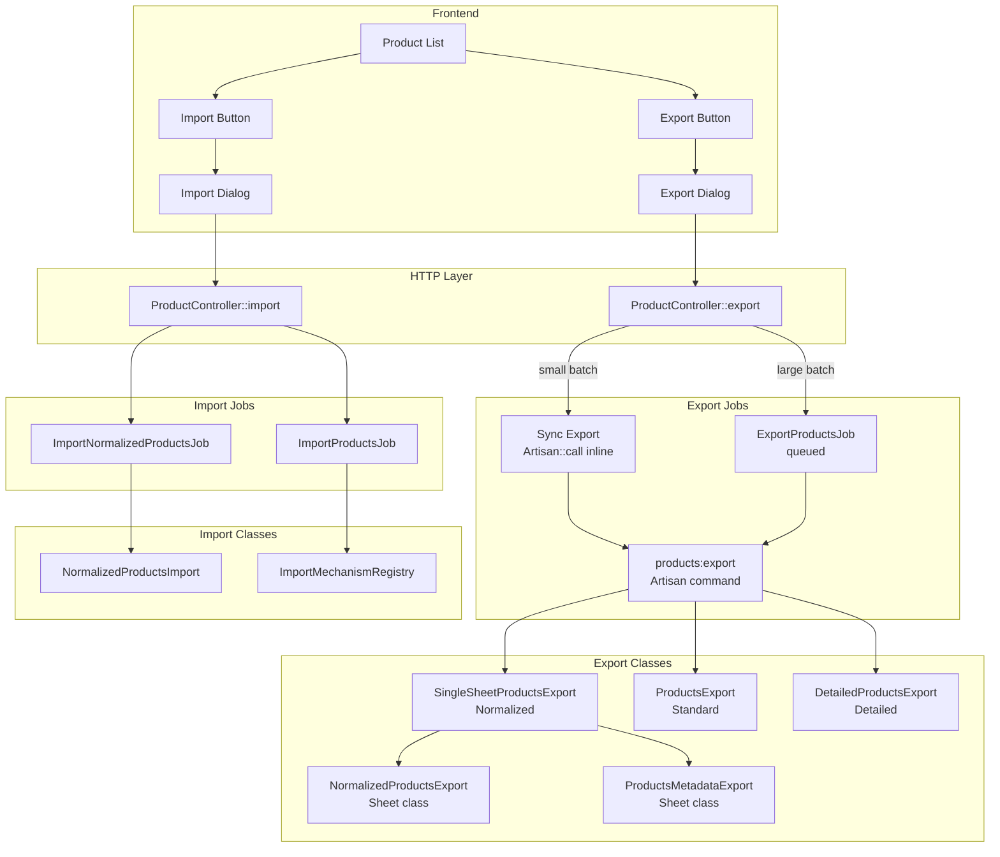

### Key Components

| Component | Path | Purpose |
|-----------|------|---------|
| `ProductController` | `domain/app/Http/Controllers/API/ECommerce/ProductController.php` | Export and import HTTP endpoints |
| `ProductControllerExportTrait` | `domain/app/Http/Traits/ECommerce/ProductControllerExportTrait.php` | Export logic: sync/async dispatch, download |
| `ExportProductsCommand` | `domain/app/Console/Commands/ExportProductsCommand.php` | Artisan command that drives all exports |
| `ExportProductsJob` | `domain/app/Jobs/ECommerce/ExportProductsJob.php` | Queued wrapper around the Artisan command |
| `SingleSheetProductsExport` | `domain/app/Helpers/Exports/SingleSheetProductsExport.php` | Normalized multi-sheet wrapper |
| `NormalizedProductsExport` | `domain/app/Helpers/Exports/NormalizedProductsExport.php` | Normalized Products sheet — row building |
| `ProductsMetadataExport` | `domain/app/Helpers/Exports/ProductsMetadataExport.php` | Reference sheet (IDs, categories, brands) |
| `ImportNormalizedProductsJob` | `domain/app/Jobs/Imports/ImportNormalizedProductsJob.php` | Queued job for normalized imports |
| `NormalizedProductsImport` | `domain/app/Jobs/Imports/NormalizedProductsImport.php` | Row-by-row processing of normalized XLSX |
| `ImportProductsJob` | `domain/app/Jobs/ECommerce/ImportProductsJob.php` | Queued job for template-based imports |
| `ProductImportInstance` | `domain/app/Models/ECommerce/ProductImportInstance.php` | Tracks import status, options, and log |
| `ImportMechanismRegistry` | `domain/app/Services/ECommerce/Imports/ImportMechanismRegistry.php` | Registry of import mechanisms |

---

## Export System

### Export Entry Points

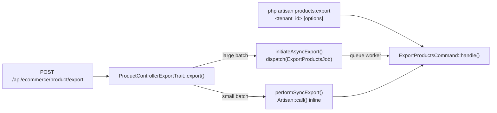

The threshold for switching from sync to async is determined by `validateExportRequest()`, which checks the product count against `getAsyncLimit()`. Normalized exports of >50 products typically go async.

### Sync vs Async Export

**Synchronous path:**
- `performSyncExport()` calls `Artisan::call('products:export', $args)` within the HTTP request
- Returns `200 OK` with the file download URL in the response body
- Used for small selections where the CLI command completes within the HTTP timeout

**Asynchronous path:**
- `initiateAsyncExport()` dispatches `ExportProductsJob` to the `default` queue
- Returns `202 Accepted` with a `job_id` for status polling
- The frontend subscribes via WebSocket to the user's private channel for progress and completion events
- On completion, the notification includes `download_url` pointing to the generated file

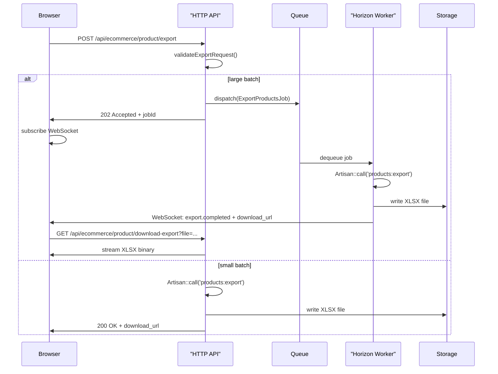

### Export Pipeline

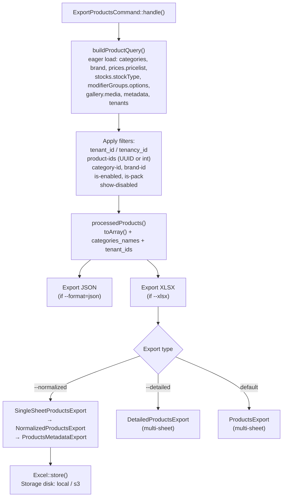

### Normalized Export Format

`NormalizedProductsExport` implements `FromCollection, WithHeadings, WithMapping, WithTitle, ShouldAutoSize, WithStyles`.

**Column order (fixed then dynamic):**

```
[0]  sku
[1]  name
[2]  description
[3]  display_order
[4]  categories
[5]  primary_category
[6]  category_ids
[7]  brand_name
[8]  is_pack
[9]  is_enabled
[10] infinite_stock
[11] gallery_title
[12] images
[13..N]  price_<pricelist_name>  (one per non-internal pricelist, sorted by id)
[N+1..]  stock_<stock_type_name> (one per non-internal stock type, sorted by id)
[M+1..]  campaign_<slug>         (one per PENDING/PUBLISHED/PAUSED campaign)
[...]    modifier_group_name
[...]    modifier_group_type
[...]    modifier_group_description
[...]    modifier_group_is_required
[...]    modifier_group_min_selections
[...]    modifier_group_max_selections
[...]    modifier_option_name
[...]    modifier_option_description
[...]    modifier_option_price
[...]    modifier_option_is_default
[...]    modifier_option_display_order
```

The column count is **not fixed** — it depends on the number of pricelists, stock types, and campaigns in the export dataset.

### Modifier Group Row Structure

Products with modifier groups generate multiple rows. The `collection()` method applies this logic:

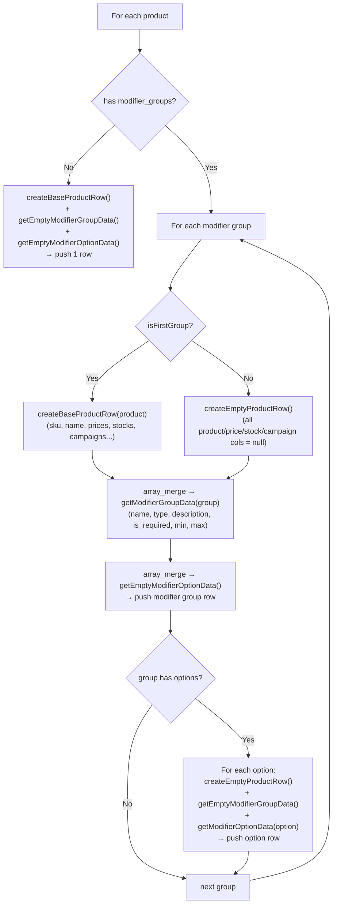

**Resulting row structure for a product with 2 modifier groups:**

| Row | sku | name | price_* | modifier_group_name | modifier_option_name |
|-----|-----|------|---------|---------------------|----------------------|
| 1 | `DVIE` | `Daily Viernes` | `5990` | `Opciones Daily Viernes` | _(empty)_ |
| 2 | _(empty)_ | _(empty)_ | _(empty)_ | _(empty)_ | `Burger` |
| 3 | _(empty)_ | _(empty)_ | _(empty)_ | _(empty)_ | `Tempura` |
| 4 | _(empty)_ | _(empty)_ | _(empty)_ | `Proteína Extra` | _(empty)_ |
| 5 | _(empty)_ | _(empty)_ | _(empty)_ | _(empty)_ | `Chicken` |
| 6 | _(empty)_ | _(empty)_ | _(empty)_ | _(empty)_ | `Shrimp` |

**Key invariants:**
- Product data (sku, name, prices, stocks, campaigns) appears only on the **first row** for that product.
- Subsequent modifier group rows have all product columns set to `null`.
- Option rows have all product columns AND all modifier group columns set to `null`.
- `map($row)` returns `array_values($row)` — array key insertion order must exactly match `headings()` order.

### Dynamic Column Generation

```php
// NormalizedProductsExport.php

// Pricelists: derived from the exported products, sorted by id
$this->pricelists = $products
    ->flatMap(fn($p) => collect($p['prices'])->pluck('pricelist'))
    ->filter(fn($pl) => !$pl['is_internal'])
    ->unique('id')->sortBy('id')->values();

// Stock types: same pattern
$this->stockTypes = $products
    ->flatMap(fn($p) => collect($p['stocks'])->pluck('stock_type'))
    ->filter()->filter(fn($st) => !$st['is_internal'])
    ->unique('id')->sortBy('id')->values();

// Campaigns: queried from DB for the tenant (status: PENDING, PUBLISHED, PAUSED)
$this->campaigns = Campaign::where('tenant_id', $this->tenantId)
    ->whereIn('status', [Campaign::STATUS_PENDING, Campaign::STATUS_PUBLISHED, Campaign::STATUS_PAUSED])
    ->orderBy('id')->get();
```

Column name sanitization:

```php
private function sanitizeColumnName($name): string
{
    return preg_replace('/[^a-zA-Z0-9_]/', '_', strtolower($name));
}

public static function generateCampaignColumnName(string $campaignName): string
{
    $slug = preg_replace('/[^a-zA-Z0-9]+/', '_', strtolower($campaignName));
    return 'campaign_' . trim($slug, '_');
}
```

### Internal Filtering

Both export and import filter out internal pricelists and stock types. These are system-managed records (e.g., the internal cost price used by packs) that should not appear in user-facing exports.

- **Export**: filtered during `analyzePricelistsAndStocks()` — `is_internal = false` only
- **Import**: filtered during `processPricesFromRow()` / `processStocksFromRow()` — columns that resolve to internal records are skipped

### Product ID Filtering

When the frontend sends `product_ids` (a comma-separated list of UUIDs), the `ExportProductsCommand` applies a `whereIn('id', ...)` filter. The filter accepts both integer IDs and UUID v4/v7 format:

```php
$productIdsArray = array_filter($productIdsArray, function ($id) {
    return is_numeric($id)
        || preg_match('/^[0-9a-f]{8}-[0-9a-f]{4}-[0-9a-f]{4}-[0-9a-f]{4}-[0-9a-f]{12}$/i', $id);
});
```

> **Historical bug**: prior versions used `is_numeric()` only, which silently rejected all UUID-format IDs and fell back to exporting all tenant products. Fixed in June 2026.

---

## Import System

### Import Entry Points

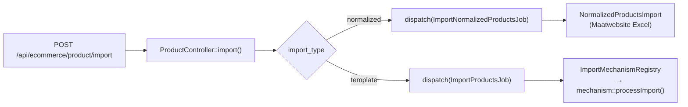

### Import Mechanisms

#### 1. Normalized Import

`ImportNormalizedProductsJob` → `NormalizedProductsImport`

- Reads the normalized XLSX row by row using Maatwebsite Excel `ToCollection` concern
- Accumulates modifier group and option rows under the current product
- Processes prices, stocks, campaigns, and images after product create/update
- Implements `ShouldBeUnique` — prevents concurrent imports for the same `ProductImportInstance`

#### 2. Template Import

`ImportProductsJob` → `ImportMechanismRegistry` → mechanism class

- Uses `ProductTemplate` configurations to map arbitrary column names to product fields
- Supports `relationable` columns: Pricelist, StockType, MetadataFormat, Marketplace
- Works with Excel files and JSON data

### Normalized Import Pipeline

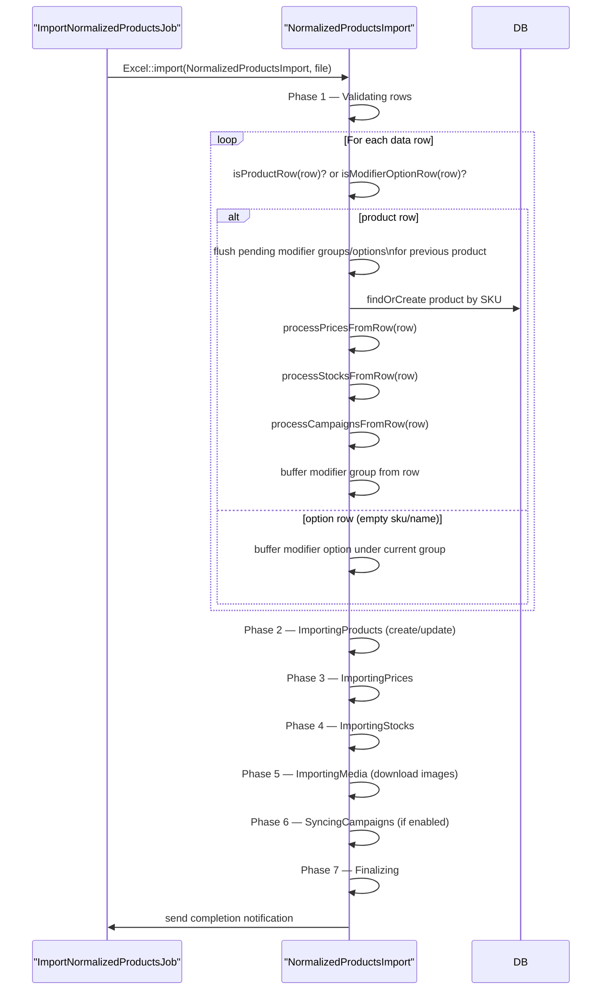

**Row classification:**

A row is a **product row** when `sku` or `name` is non-empty.
A row is a **modifier option row** when `sku` and `name` are both empty but `modifier_option_name` is non-empty.
A row is a **modifier group continuation** when `sku` and `name` are empty and `modifier_group_name` is non-empty.

### Dynamic Column Detection

```php
// NormalizedProductsImport.php

protected function processPricesFromRow($row, $tenantId): array
{
    $prices = [];
    foreach ($row as $column => $value) {
        if (str_starts_with($column, 'price_') && !empty($value) && is_numeric($value)) {
            $pricelistName = str_replace(['price_', '_'], ['', ' '], $column);
            $pricelist = $this->findOrCreatePricelist(trim($pricelistName), $tenantId);
            if ($pricelist) {
                $prices[] = ['pricelist_id' => $pricelist->id, 'price' => (float)$value];
            }
        }
    }
    return $prices;
}
```

The same `str_starts_with` pattern applies to `stock_*` and `campaign_*` columns.

### Modifier Group Import

On import, modifier groups are re-synced per product using the data accumulated from the modifier group rows and option rows. The import:

1. Matches a modifier group by `modifier_group_name` (case-insensitive) within the tenant.
2. Creates the group if it does not exist.
3. Syncs the `modifier_group_options` by name within the group — updates existing, creates new, removes absent options.
4. Links the group to the product via `product_modifier_groups` pivot with `display_order`.

---

## Campaign Sync Feature

### Overview

Campaign columns (`campaign_*`) in the normalized export show the current status of each product within each active campaign. On import (with `sync_campaigns` enabled), changes to these columns trigger the corresponding marketplace action.

### Column Naming

Campaign column names are derived from the campaign name using a slug:

```
"JumpSeller | Productos"   →  campaign_jumpseller_productos
"Uber Campaign"            →  campaign_uber_campaign
"Summer Sale 2024"         →  campaign_summer_sale_2024
```

### Export: which campaigns appear

Only campaigns in `PENDING`, `PUBLISHED`, or `PAUSED` status are included as columns (campaigns in `FINISHED` status are omitted).

### Import: which campaigns are processed

Only **PUBLISHED** (active) campaigns are matched during import. PENDING, PAUSED, and FINISHED campaigns are skipped even if a matching column is present.

### Status Transition Rules

```mermaid
stateDiagram-v2
    [*] --> PENDING
    PENDING --> PUBLISHED : PublishProductsJob
    PUBLISHED --> PAUSED : PauseProductsJob
    PUBLISHED --> FINISHED : FinishProductsJob
    PAUSED --> PUBLISHED : PublishProductsJob
    PAUSED --> FINISHED : FinishProductsJob

    note right of PENDING : Import can target: PUBLISHED
    note right of PUBLISHED : Import can target: PAUSED, FINISHED
    note right of PAUSED : Import can target: PUBLISHED, FINISHED
    note right of FINISHED : No transitions allowed
```

| Current Status | Target: PUBLISHED | Target: PAUSED | Target: FINISHED |
|----------------|-------------------|----------------|-----------------|
| PENDING | ✅ Publish | ❌ Skip | ❌ Skip |
| PUBLISHED | ❌ Skip (already) | ✅ Pause | ✅ Finish |
| PAUSED | ✅ Republish | ❌ Skip (already) | ✅ Finish |
| ERRORED | ✅ Retry | ❌ Skip | ❌ Skip |
| FINISHED | ❌ Skip | ❌ Skip | ❌ Skip (already) |

### Campaign Sync Flow

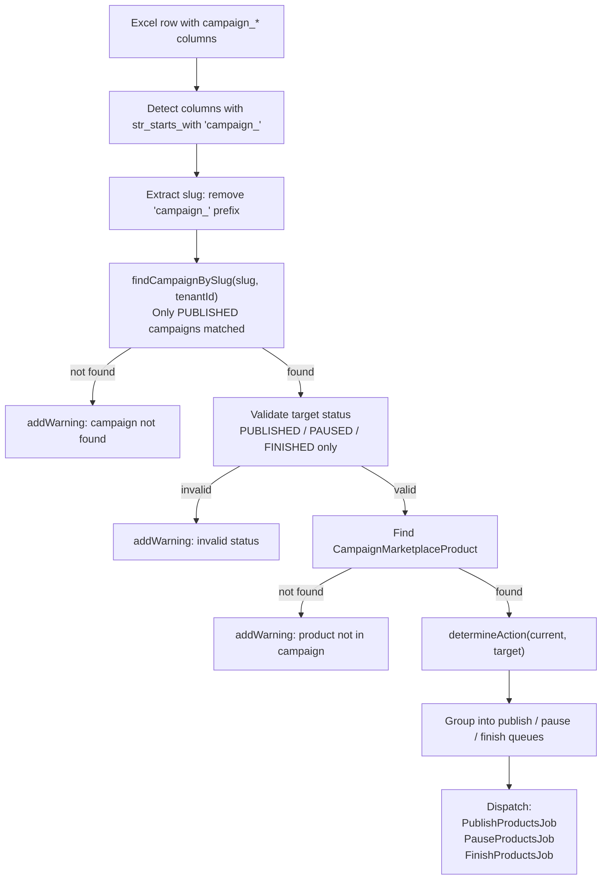

---

## Import Options Reference

Both import mechanisms share the same normalized import options.

### Update Behavior

| Option | Default | Description |
|--------|---------|-------------|
| `update_existing` | `true` | Update products matched by SKU |
| `create_new_products` | `true` | Create products with unknown SKUs |
| `delete_absent_products` | `false` | Soft-delete products not in the file. Skipped if no valid SKUs found (safety guard). |
| `skip_invalid_rows` | `false` | Skip rows with errors instead of failing the entire import |

### Category & Brand

| Option | Default | Description |
|--------|---------|-------------|
| `create_missing_categories` | `true` | Create categories that don't exist |
| `create_missing_brands` | `true` | Create brands that don't exist |
| `assign_default_category` | `true` | Assign primary category when no category mapping found |
| `assign_default_brand` | `true` | Assign primary brand when no brand mapping found |

### Image Handling

| Option | Default | Description |
|--------|---------|-------------|
| `preserve_images` | `true` | Keep existing gallery images |
| `append_images` | `true` | Add new images to existing gallery |
| `skip_galleries` | `false` | Skip all image/gallery processing |
| `validate_urls` | `true` | Check image URL accessibility before download |
| `force_redownload` | `false` | Re-download images even if already stored |

### Price & Stock Auto-Creation

| Option | Default | Description |
|--------|---------|-------------|
| `create_missing_pricelists` | `false` | Create pricelists for unknown `price_*` columns |
| `create_missing_stock_types` | `false` | Create stock types for unknown `stock_*` columns |

### Campaign Sync

| Option | Default | Description |
|--------|---------|-------------|
| `sync_campaigns` | `false` | Process `campaign_*` columns. Only affects PUBLISHED campaigns. |

### Common Scenarios

| Scenario | `update_existing` | `create_new_products` | `delete_absent_products` | Result |
|----------|-------------------|-----------------------|--------------------------|--------|
| Full catalog sync | `true` | `true` | `true` | Create, update, and delete to match file exactly |
| Additive (default) | `true` | `true` | `false` | Create new + update existing, keep all others |
| Update only | `true` | `false` | `false` | Update existing SKUs only |
| Add only | `false` | `true` | `false` | Create new SKUs only, leave existing untouched |

---

## Status Management

### ProductImportInstance Statuses

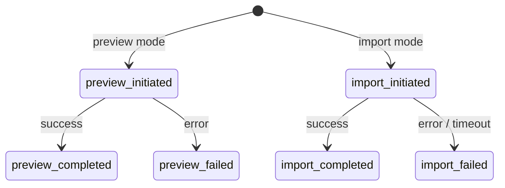

| Status | Constant | Description |
|--------|----------|-------------|
| `preview_initiated` | `STATUS_PREVIEW_INITIATED` | Preview validation started |
| `preview_completed` | `STATUS_PREVIEW_COMPLETED` | Preview validation finished successfully |
| `preview_failed` | `STATUS_PREVIEW_FAILED` | Preview validation failed |
| `import_initiated` | `STATUS_IMPORT_INITIATED` | Import started |
| `import_completed` | `STATUS_IMPORT_COMPLETED` | Import finished successfully |
| `import_failed` | `STATUS_IMPORT_FAILED` | Import failed |

---

## Notification System

All notifications are sent to the user's private WebSocket channel (`user.{user_id}`).

### Notification Types

| Type | Constant | Trigger |
|------|----------|---------|
| `import.started` | `NOTIFICATION_TYPE_STARTED` | Job begins processing |
| `import.progress` | `NOTIFICATION_TYPE_PROGRESS` | Phase change or row milestone |
| `import.completed` | `NOTIFICATION_TYPE_COMPLETED` | Import finished successfully |
| `import.failed` | `NOTIFICATION_TYPE_FAILED` | Unrecoverable error |
| `export.progress` | — | Export phase change |
| `export.completed` | — | Export finished, file ready |
| `export.failed` | — | Export error |

### Notification Payload (import)

```json
{
    "type": "import.progress",
    "phase": "ImportingProducts",
    "phaseNumber": 2,
    "totalPhases": 7,
    "processedItems": 50,
    "totalItems": 96,
    "percentage": 52.1,
    "productImportInstanceId": 123,
    "tenantId": "019ec3dd-...",
    "mode": "import",
    "timestamp": "2026-06-15T00:00:00Z"
}
```

### Notification Payload (export completion)

```json
{
    "type": "export.completed",
    "jobId": "export_abc123",
    "tenantId": "019ec3dd-...",
    "filename": "products_export_tenant_..._normalized.xlsx",
    "exportedFiles": [{ "filename": "...", "path": "...", "size": 22490 }],
    "downloadUrls": [{ "filename": "...", "url": "/api/ecommerce/product/download-export?file=..." }],
    "completedAt": "2026-06-15T00:00:00Z",
    "status": "success"
}
```

---

## Import Phases

### Normalized Import Phases

```mermaid
gantt
    title Normalized Import Phases
    dateFormat X
    axisFormat %s

    section Processing
    Validating           :0, 1
    ImportingProducts    :1, 2
    ImportingPrices      :2, 3
    ImportingStocks      :3, 4
    ImportingMedia       :4, 5
    SyncingCampaigns     :5, 6
    Finalizing           :6, 7
```

| Phase | Constant | Description |
|-------|----------|-------------|
| 1 | `Validating` | Validate headers, check required columns, count rows |
| 2 | `ImportingProducts` | Create or update product records (SKU lookup) |
| 3 | `ImportingPrices` | Sync `price_*` column data to pricelists |
| 4 | `ImportingStocks` | Sync `stock_*` column data to stock types |
| 5 | `ImportingMedia` | Download and store images from `images` column URLs |
| 6 | `SyncingCampaigns` | Process `campaign_*` columns (only if `sync_campaigns=true`) |
| 7 | `Finalizing` | Cleanup, delete absent products (if enabled), close log |

### Template Import Phases

| Phase | Constant | Description |
|-------|----------|-------------|
| 1 | `ImportingProductData` | Create/update product records |
| 2 | `ImportingPrices` | Update product prices per pricelist |
| 3 | `ImportingStocks` | Update product stocks per stock type |
| 4 | `UpdatingPackStocks` | Recalculate pack product stocks |
| 5 | `UpdatingMetadata` | Update product metadata values |

---

## Error Handling

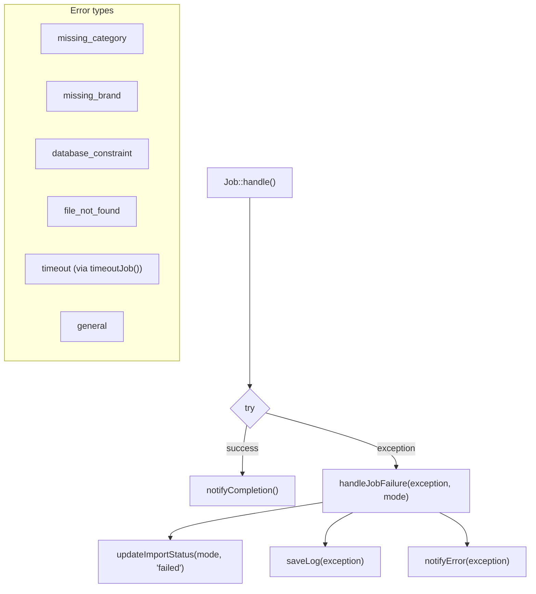

| Error Type | Cause | User Message |
|------------|-------|--------------|
| `missing_category` | No primary category configured | Configuration error |
| `missing_brand` | No primary brand configured | Configuration error |
| `database_constraint` | Required field is null | Data validation message |
| `file_not_found` | Import file not found on any disk | File error message |
| `timeout` | Job exceeded `$timeout` (2600s) | Timeout message |
| `general` | Other exceptions | Generic error with details |

### Job Uniqueness

Both import job classes implement `ShouldBeUnique` to prevent concurrent imports for the same instance:

```php
public function uniqueId(): string
{
    return 'normalized_import_' . $this->productImportInstance->id . '_' . $mode;
}
```

The unique lock is held for 3600 seconds.

---

## Key Components — File Reference

| File | Description |
|------|-------------|
| `ExportProductsCommand.php` | CLI: tenant filter, product query with `modifierGroups.options` eager load, UUID product ID filter, file storage via `DashFileStorage` |
| `ExportProductsJob.php` | Queue job: wraps `Artisan::call('products:export', ...)`, sends WebSocket notifications via `AppNotificationBuilder` |
| `ProductControllerExportTrait.php` | HTTP layer: sync/async dispatch decision, file download endpoint, job status storage |
| `NormalizedProductsExport.php` | Sheet class: `collection()` builds rows with `$isFirstGroup` logic for modifier groups; `headings()` matches column order exactly; `map()` returns `array_values()` |
| `SingleSheetProductsExport.php` | Wraps `NormalizedProductsExport` + `ProductsMetadataExport` into a two-sheet workbook |
| `ImportNormalizedProductsJob.php` | Queue job: dispatches `NormalizedProductsImport`, manages `ProductImportInstance` status, `ShouldBeUnique` |
| `NormalizedProductsImport.php` | Row processing: classifies rows (product / modifier group / option), processes `price_*` / `stock_*` / `campaign_*` columns dynamically |
| `ProductImportInstance.php` | Model tracking import state, options JSON, and log JSON |
| `ImportMechanismRegistry.php` | Registry: maps import type string → mechanism class |

---

## Best Practices

1. **Column order in `NormalizedProductsExport`**: `headings()` and the row-building methods (`createBaseProductRow`, `createEmptyProductRow`, `getModifierGroupData`, etc.) must add keys in exactly the same order. `map()` uses `array_values()` — any insertion order mismatch causes column shifts.

2. **OPcache in long-running workers**: Horizon workers cache PHP files. After editing export/import classes, run `php artisan horizon:terminate` to restart workers with fresh code. The CLI (`php artisan products:export`) always reads from disk.

3. **UUID product ID filter**: Always validate IDs with a UUID regex AND `is_numeric()` check. Do not use `is_numeric()` alone — it silently drops all UUID-format IDs.

4. **Modifier group data consistency**: The export stores modifier group data only when options exist in the DB. Groups with zero options produce a modifier group row but no option rows. Ensure options are populated before exporting.

5. **Binary file downloads**: The frontend must set `responseType: 'blob'` on the axios request for the download endpoint. Without it, axios parses the binary as text and the XLSX ZIP structure is corrupted before saving.

6. **Campaign sync is import-side only**: The export includes campaign columns for informational purposes. The import triggers actual marketplace API calls (Jumpseller, Uber Eats) via `PublishProductsJob`, `PauseProductsJob`, `FinishProductsJob`. Test in a staging environment first.

7. **`delete_absent_products` safety guard**: If no valid SKUs are found in the import file (e.g. blank file), the deletion phase is skipped entirely to prevent accidental mass-deletion.

---

## Troubleshooting

### Export

| Symptom | Likely Cause | Fix |
|---------|-------------|-----|
| "Invalid product IDs provided" in output | UUIDs passed to old `is_numeric()` filter | Ensure fix is deployed; check `ExportProductsCommand.php` |
| Export file is corrupt (cannot open in Excel) | `responseType: 'blob'` missing in frontend axios download | Add `responseType: 'blob'` to the download axios call |
| Modifier option rows missing | Groups have 0 options in the DB | Add options to the modifier groups via the UI |
| Export always returns all products even with selection | UUID filter dropping IDs | See "Invalid product IDs" above |
| Horizon worker using old code | OPcache cached old PHP | Run `php artisan horizon:terminate`; workers restart automatically |

### Import

| Symptom | Cause | Fix |
|---------|-------|-----|
| "No primary category found" | Tenant has no `is_primary=true` category | Mark a category as primary in the Categories section |
| "No primary brand found" | Tenant has no `is_primary=true` brand | Mark a brand as primary in the Brands section |
| "File does not exist" | File not on expected storage disk | Check `FILESYSTEM_DISK` / `MEDIA_DISK` env vars |
| Import stuck / no progress notifications | Queue worker not running | Run `php artisan horizon:status`; restart Horizon |
| No notifications | User not resolvable from `ProductImportInstance` | Ensure `user_id` is set on the import instance |
| Campaign columns ignored | `sync_campaigns` option not enabled | Enable **Sync campaigns** in the import options dialog |
| Campaign status not changing | Campaign is not in PUBLISHED status | Only PUBLISHED campaigns are matched during import |
| Column shift in XLSX output | Key insertion order mismatch in `NormalizedProductsExport` | Ensure `headings()` order matches key insertion order in all `create*Row()` and `get*Data()` methods |

### Database Queries for Debugging

```sql
-- Check import instance status and log
SELECT id, status, options, log, created_at
FROM product_import_instances
WHERE tenant_id = '<tenant_id>'
ORDER BY created_at DESC
LIMIT 5;

-- Check modifier groups and option counts for a product
SELECT pmg.product_id, p.name AS product, mg.name AS modifier_group,
       COUNT(mo.id) AS option_count
FROM product_modifier_groups pmg
JOIN modifier_groups mg ON mg.id = pmg.modifier_group_id
JOIN products p ON p.id = pmg.product_id
LEFT JOIN modifier_options mo ON mo.modifier_group_id = mg.id AND mo.deleted_at IS NULL
WHERE p.tenant_id = '<tenant_id>'
GROUP BY pmg.product_id, p.name, mg.name
ORDER BY p.name, mg.name;

-- Verify export file was created
-- (check storage/app/exports/ directory or S3 bucket)
```
