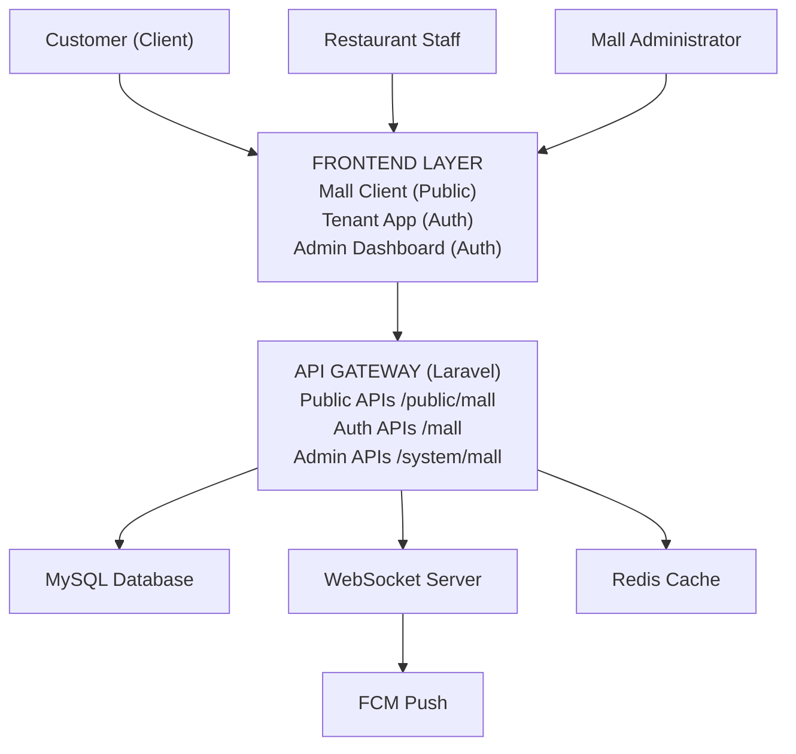
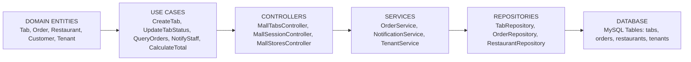
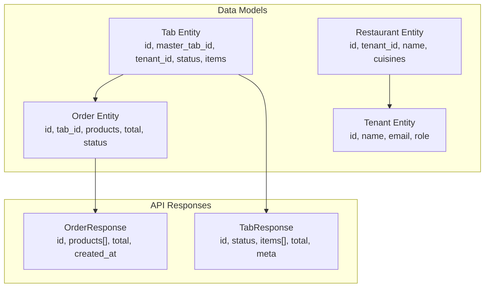
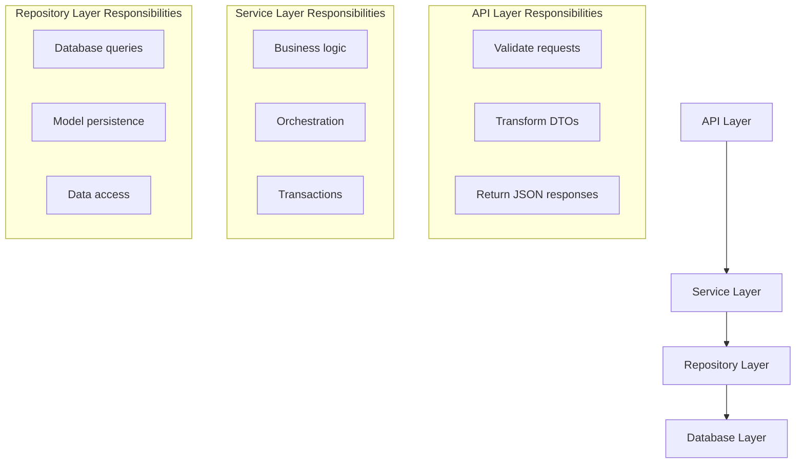
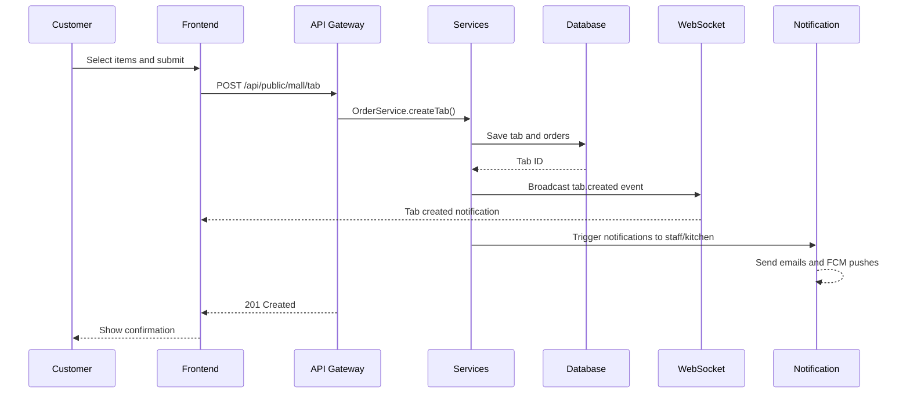
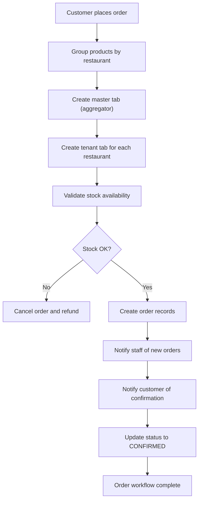

# Mall App - System Architecture

## High-Level Architecture



## Component Architecture

### Backend Components



### Frontend Components



## Data Flow Architecture

### Session-Based Data Flow



### Order Creation Data Flow



## API Route Architecture

### Route Groups

| Group | Auth | Prefix | Purpose |
|-------|------|--------|---------|
| **Public Mall** | None | `/api/public/mall` | Customer ordering |
| **Mall Admin** | Sanctum | `/api/mall` | Tenant management |
| **System Mall** | Sanctum | `/api/system/mall` | System admin |

### Public API Endpoints

```
/api/public/mall/
├── session/
│   ├── POST   /create              → Create new session
│   ├── GET    /{hash}              → Get session details
│   ├── PUT    /{hash}              → Update session
│   ├── POST   /{hash}/complete     → Complete session
│   ├── POST   /{hash}/cancel       → Cancel session
│   ├── GET    /{hash}/notifications → Get notifications
│   └── POST   /{hash}/notifications/mark-read
├── stores/
│   ├── GET    /                    → List stores
│   ├── GET    /{id}                → Get store details
│   └── POST   /{id}/assistance     → Request assistance
├── products/
│   └── GET    /                    → List products
├── tab/
│   ├── GET    /                    → List tabs (filtered by session)
│   ├── POST   /                    → Create order
│   ├── GET    /{id}                → Get tab details
│   └── PUT    /{id}                → Update tab
├── {slug}/getAuth                  → Mall auth by slug
└── {sessionId}/getSessionAuth      → Session auth by hash
```

## Database Architecture

### Entity Relationships



### Key Tables

| Table | Purpose |
|-------|---------|
| `malls` | Mall/food court entities |
| `mall_tenant` | Pivot: malls ↔ tenants |
| `mall_sessions` | Customer sessions |
| `mall_session_notifications` | Persisted notifications |
| `tabs` | Orders (master/tenant) |
| `orders` | Order details |
| `order_products` | Line items |
