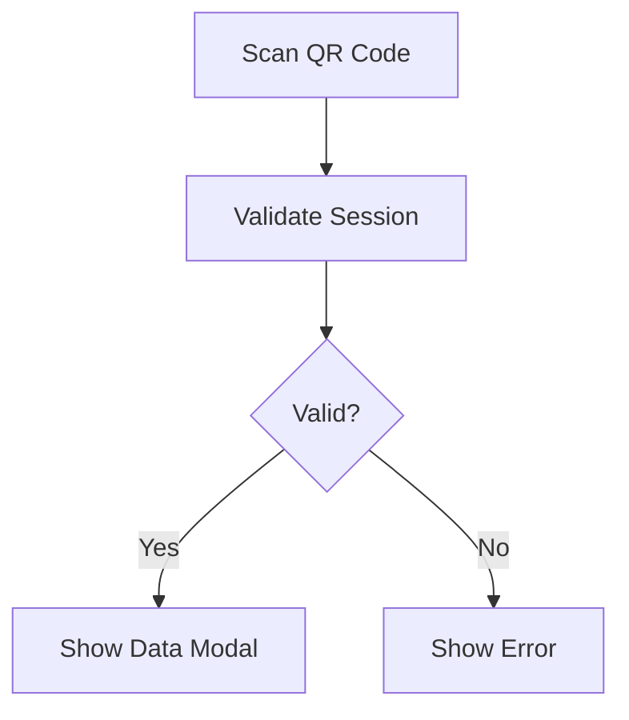
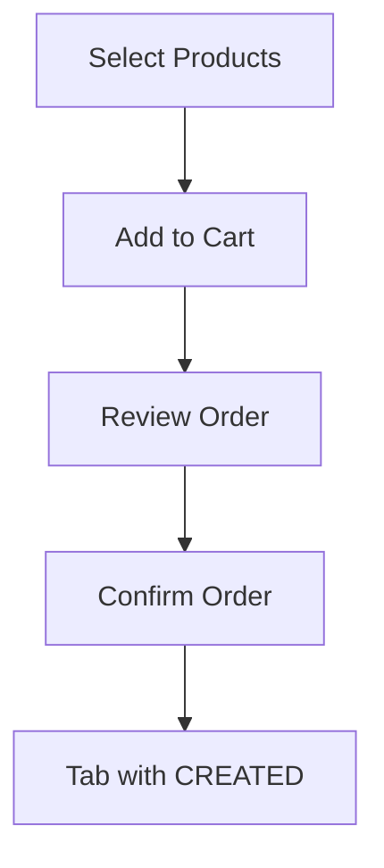
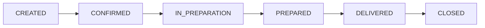
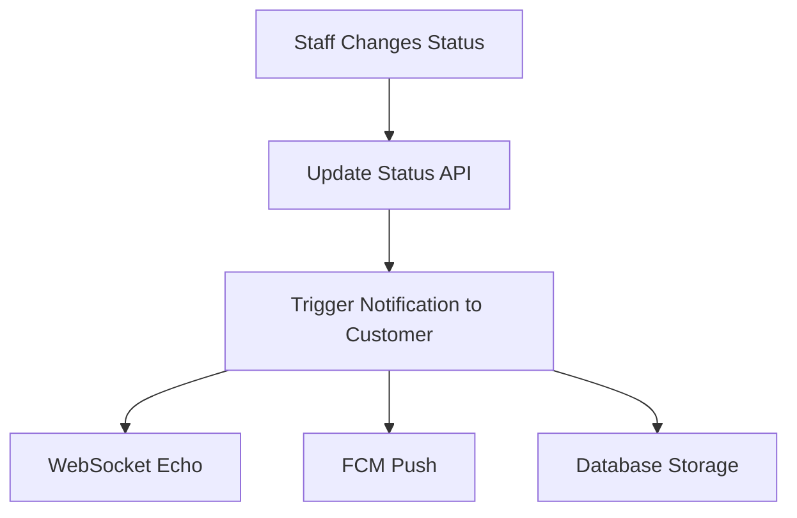
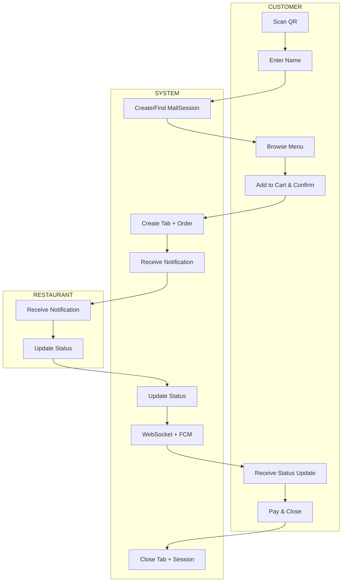
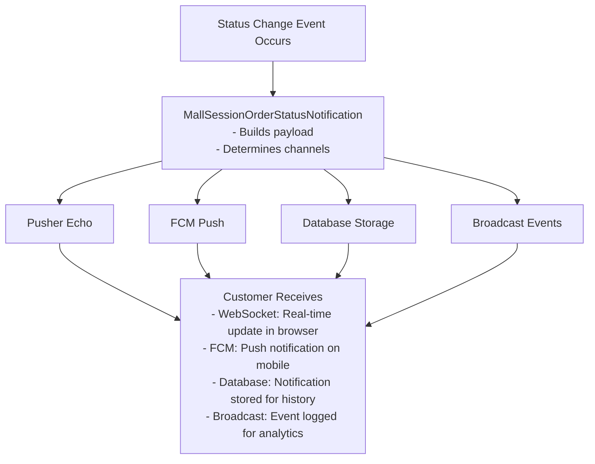

# Mall App - User Stories

## Overview

This document describes the user stories and flows for each actor in the Mall App system.

---

## Actors

| Actor | Description |
|-------|-------------|
| **Customer** | End user ordering from multiple restaurants via QR code |
| **Restaurant Staff** | Restaurant employee managing orders from their tenant |
| **Mall Admin** | Mall administrator managing the overall mall configuration |
| **System Admin** | Super administrator with full system access |

---

## Customer User Stories

### US-001: Start Mall Session

**As a** customer  
**I want to** scan a QR code at my table  
**So that** I can start browsing and ordering from multiple restaurants

**Acceptance Criteria:**
- Scanning QR redirects to `/mall/session/{hash}`
- System validates the mall session hash
- If valid, customer sees restaurant options
- Session hash is stored in browser localStorage
- Customer data collection modal appears (first time)

**Flow:**


---

### US-002: View Available Restaurants

**As a** customer  
**I want to** see all restaurants in the mall  
**So that** I can choose where to order from

**Acceptance Criteria:**
- Display list of active restaurants (tenants) in the mall
- Show restaurant name, logo, and basic info
- Filter by cuisine type (optional)
- Show availability status

---

### US-003: Browse Restaurant Menu

**As a** customer  
**I want to** browse a restaurant's menu  
**So that** I can see available products and prices

**Acceptance Criteria:**
- Display products organized by categories
- Show product name, description, price, image
- Show product availability
- Support product search
- Infinite scroll for product lists

---

### US-004: Create Order

**As a** customer  
**I want to** select products and create an order  
**So that** I can purchase food from a restaurant

**Acceptance Criteria:**
- Add products to cart (tab)
- Specify quantity per product
- Add notes/special instructions
- View order summary before confirming
- Confirm order creates a Tab record

**Flow:**


---

### US-005: Create Multi-Restaurant Order

**As a** customer  
**I want to** order from multiple restaurants in a single session  
**So that** I can get food from different places at my table

**Acceptance Criteria:**
- Create separate tabs per restaurant
- Each tab linked to same MallSession
- Track status independently per restaurant
- Master tab tracks overall session

**Flow:**
```
┌─────────────────────────────────────────────────────┐
│                  Mall Session                        │
│         (customer_name, mall_id, hash)              │
├─────────────────────────────────────────────────────┤
│                                                      │
│   ┌──────────────┐   ┌──────────────┐              │
│   │  Restaurant  │   │  Restaurant  │              │
│   │      A       │   │      B       │              │
│   │   (Tab 1)    │   │   (Tab 2)    │              │
│   └──────────────┘   └──────────────┘              │
│         │                  │                        │
│         ▼                  ▼                        │
│   ┌──────────────┐   ┌──────────────┐              │
│   │  Order for   │   │  Order for   │              │
│   │  Tenant A    │   │  Tenant B    │              │
│   └──────────────┘   └──────────────┘              │
│                                                      │
└─────────────────────────────────────────────────────┘
```

---

### US-006: Track Order Status

**As a** customer  
**I want to** see real-time updates on my order status  
**So that** I know when my food will be ready

**Acceptance Criteria:**
- Display current status per restaurant order
- Receive push notifications on status changes
- Show progress indicator (Created → Confirmed → Preparing → Ready → Delivered)
- Toast notification on WebSocket event
- Auto-refresh order list

**Status Flow:**


---

### US-007: View Order History

**As a** customer  
**I want to** see my notification history  
**So that** I can track all updates to my orders

**Acceptance Criteria:**
- Display list of status update notifications
- Show timestamp, restaurant name, status change
- Mark notifications as read
- Filter by order (optional)

---

### US-008: Pay for Order

**As a** customer  
**I want to** pay for my orders  
**So that** I can complete my purchase

**Acceptance Criteria:**
- View total amount per restaurant
- Support payment methods (cash, card, online)
- Generate receipt/invoice
- Close tab after payment

---

## Restaurant Staff User Stories

### US-101: Receive Order Notification

**As a** restaurant staff member  
**I want to** receive notifications when new orders arrive  
**So that** I can start preparing food promptly

**Acceptance Criteria:**
- Push notification on new order
- Audio alert in dashboard
- Order appears in "New Orders" list
- Shows customer name, table/location, products

---

### US-102: View Order Details

**As a** restaurant staff member  
**I want to** see full order details  
**So that** I can prepare the correct items

**Acceptance Criteria:**
- Display product list with quantities
- Show special instructions/notes
- Show customer name
- Show order creation time
- Show elapsed time since order

---

### US-103: Update Order Status

**As a** restaurant staff member  
**I want to** update the order status  
**So that** the customer knows the progress

**Acceptance Criteria:**
- Change status via dropdown or quick buttons
- Status options: Confirmed, In Preparation, Prepared, Delivered, Cancelled
- Status change triggers notification to customer
- Status change logged with timestamp

**Flow:**


---

### US-104: Manage Order Queue

**As a** restaurant staff member  
**I want to** see all orders in a queue  
**So that** I can manage preparation order

**Acceptance Criteria:**
- Display orders by status
- Sort by creation time or status
- Quick status change actions
- Filter by status

---

### US-105: Cancel Order

**As a** restaurant staff member  
**I want to** cancel an order  
**So that** I can handle unavailable items

**Acceptance Criteria:**
- Cancel with reason (optional)
- Customer receives cancellation notification
- Order marked as CANCELLED
- Cannot cancel delivered orders

---

## Mall Admin User Stories

### US-201: Manage Mall Configuration

**As a** mall admin  
**I want to** configure my mall settings  
**So that** the system reflects my mall's setup

**Acceptance Criteria:**
- Set mall name, logo, description
- Configure operating hours
- Set available tenants/restaurants
- Configure payment options

---

### US-202: Generate Session QR Codes

**As a** mall admin  
**I want to** generate QR codes for tables  
**So that** customers can start ordering

**Acceptance Criteria:**
- Generate single or batch QR codes
- Each QR has unique session hash
- Download QR as image
- Print QR codes
- Associate QR with table/location (optional)

---

### US-203: View Session Activity

**As a** mall admin  
**I want to** see active sessions  
**So that** I can monitor mall activity

**Acceptance Criteria:**
- Display list of active sessions
- Show orders per session
- Show total revenue
- Filter by date range
- Real-time updates

---

### US-204: Manage Mall Tenants

**As a** mall admin  
**I want to** manage which restaurants are in my mall  
**So that** customers see correct options

**Acceptance Criteria:**
- Add/remove restaurants
- Set display order
- Enable/disable restaurants
- Configure tenant-specific settings

---

### US-205: View Analytics

**As a** mall admin  
**I want to** see analytics and reports  
**So that** I can understand business performance

**Acceptance Criteria:**
- Orders per day/week/month
- Revenue per tenant
- Popular products
- Average order value
- Peak hours analysis

---

## System Flows Summary

### Complete Order Flow



---

### Notification Distribution Flow



---

## Error Scenarios

### ES-001: Invalid Session Hash

**Trigger:** Customer scans invalid/expired QR code  
**Response:** Show error message, option to request new QR  
**Recovery:** Staff generates new QR code

### ES-002: Restaurant Unavailable

**Trigger:** Customer tries to order from closed restaurant  
**Response:** Show unavailable message, suggest alternatives  
**Recovery:** Choose different restaurant

### ES-003: Product Out of Stock

**Trigger:** Customer adds unavailable product  
**Response:** Show out of stock message  
**Recovery:** Remove from cart, suggest alternatives

### ES-004: Payment Failed

**Trigger:** Payment processing fails  
**Response:** Show error, retry option  
**Recovery:** Try different payment method

### ES-005: WebSocket Disconnection

**Trigger:** Network issues cause disconnect  
**Response:** Show reconnecting indicator  
**Recovery:** Auto-reconnect with exponential backoff
