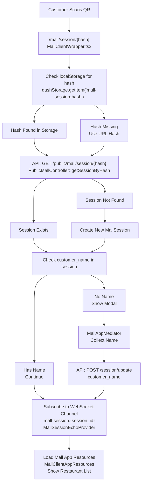
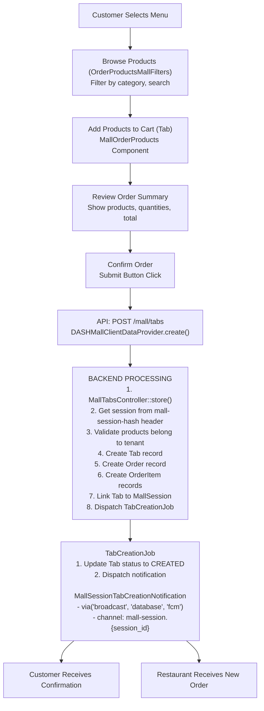
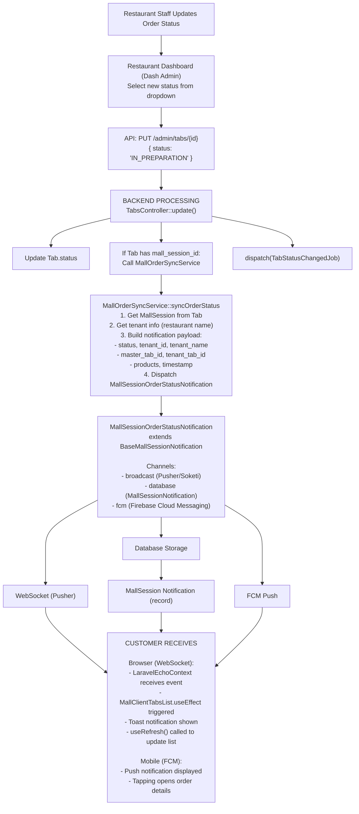
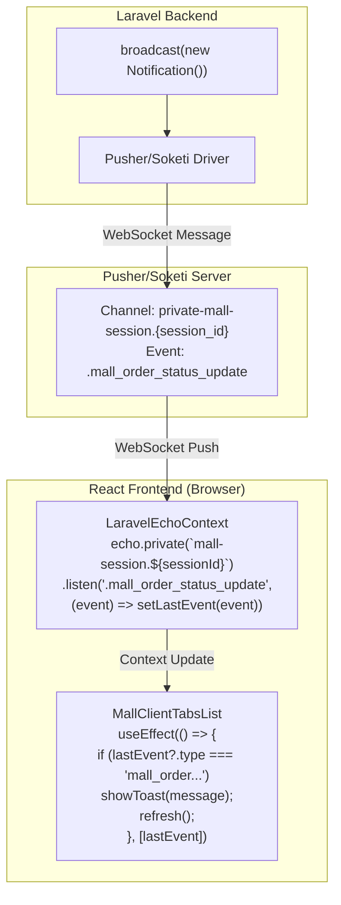
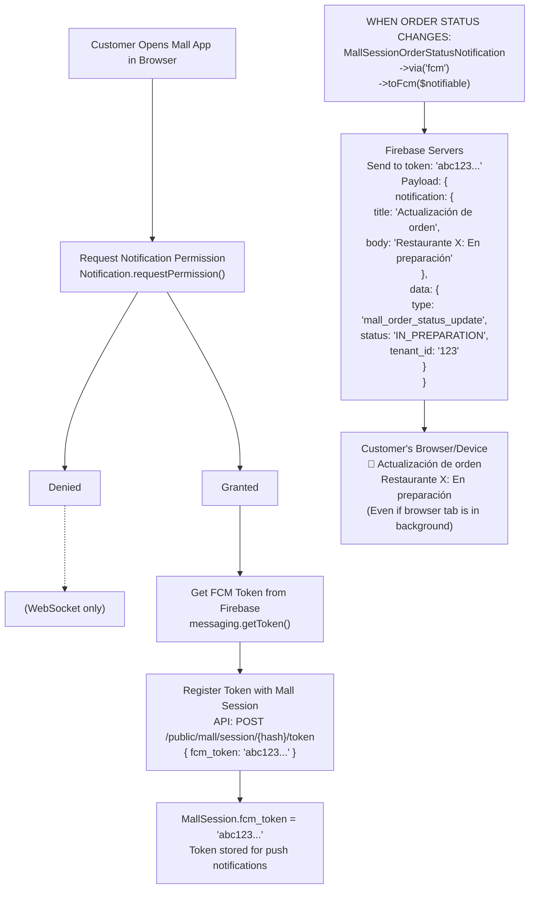
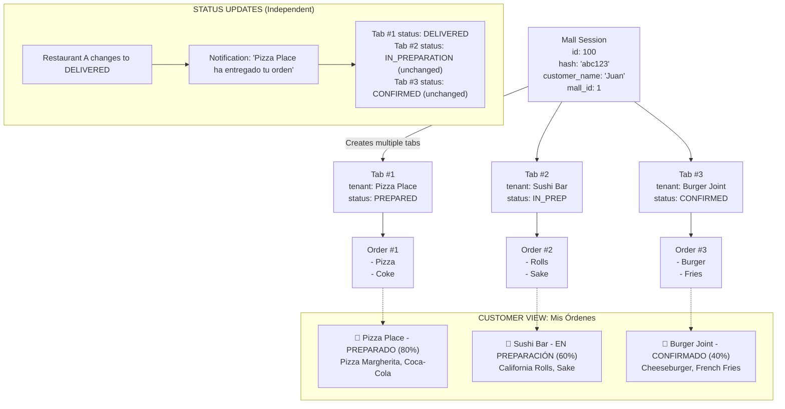
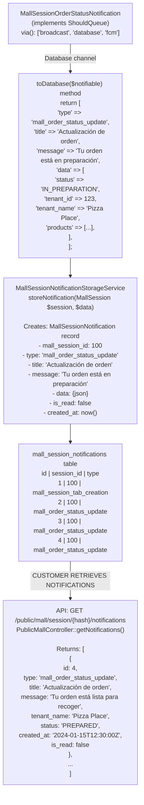
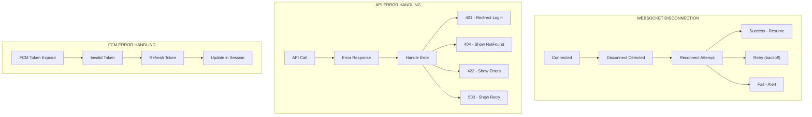

# Mall App - Flow Diagrams

## Overview

This document provides visual flow diagrams for the Mall App's key processes.

---

## 1. Session Initialization Flow

---

## 2. Order Creation Flow

---

## 3. Order Status Update Flow

---

## 4. WebSocket Event Flow

---

## 5. FCM Push Notification Flow

---

## 6. Multi-Restaurant Order Flow

---

## 7. Database Notification Storage Flow

---

## 8. Error Handling Flow

---

## Quick Reference

| Flow | Trigger | Key Components |
|------|---------|----------------|
| Session Init | QR Scan | MallClientWrapper, PublicMallController |
| Order Create | Confirm Button | DASHMallClientDataProvider, MallTabsController |
| Status Update | Staff Action | MallOrderSyncService, MallSessionOrderStatusNotification |
| WebSocket | Any Notification | LaravelEchoContext, Pusher |
| FCM Push | Notification dispatch | Firebase, toFcm() |
| Multi-Order | Multiple restaurants | MallSession, multiple Tabs |
| DB Storage | Notification | MallSessionNotificationStorageService |
