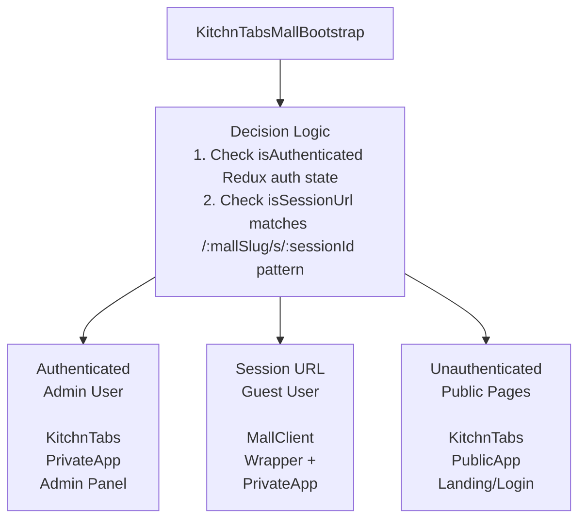
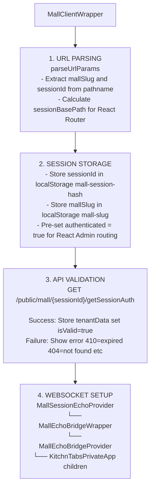

# KitchnTabs Mall Application Flow

## Overview

KitchnTabs Mall is a public-facing food court ordering application that allows customers to browse multiple restaurant menus and place orders by scanning a QR code. This document describes the complete application flow, component architecture, and data flow.

## Application Entry Point

### Bootstrap Component (`KitchnTabsMallBootstrap.tsx`)

The bootstrap component is the main entry point that determines which application variant to render based on authentication state and URL pattern.



### URL Pattern Detection

The bootstrap component detects session URLs using a regex pattern:

```typescript
// Matches: /malltest/s/DFJNL, /foodcourt/s/ABC12, etc.
const isSessionUrl = /^\/[^/]+\/s\/[A-Z0-9]{5,}/i.test(pathname);
```

**URL Patterns Supported:**
- `/:mallSlug/s/:sessionId/*` - Full mall session URL (e.g., `/malltest/s/DFJNL/tab`)
- `/:sessionId` - Direct session hash (legacy, e.g., `/DFJNL`)

### Props Configuration

The bootstrap provides different configurations for admin vs guest users:

```typescript
// Admin user configuration
const privateAppProps = {
    customAuthProvider: DASHMallAuthProvider,      // Full auth with login
    customDataProvider: DASHMallDataProvider,      // Admin API endpoints
    customResources: KitchnTabsMallResources,
    AdminHook: () => <MainAppHookComponent />
};

// Guest user configuration (mall ordering)
const publicAppProps = {
    customAuthProvider: DASHMallClientAuthProvider,  // Guest auth (always authenticated)
    customDataProvider: DASHMallClientDataProvider,  // Public API endpoints
    customResources: KitchnTabsMallResources,
    AdminHook: () => <><PublicSessionAppHookComponent/><MallAppMediator/></>
};
```

---

## MallClientWrapper Component

### Purpose

`MallClientWrapper` is a Higher-Order Component (HoC) that:
1. Parses session parameters from the URL
2. Validates the session with the backend API
3. Sets up the WebSocket connection for real-time updates
4. Bridges WebSocket events to child components

### Architecture Note

This component runs **BEFORE** React Router is initialized, so it cannot use `useParams()`. It parses the URL directly from `window.location`.

### Component Flow



### Session Validation States

| State | Description | UI Shown |
|-------|-------------|----------|
| `isValidating: true` | API call in progress | Loading spinner |
| `isValid: true` | Session validated successfully | Main application |
| `isValid: false` | Validation failed | Error message |

### Error Handling

| HTTP Status | Error Message | Action |
|-------------|---------------|--------|
| 410 | Session expired (10 hours) | Show expiration time |
| 404 | Session not found | Show error |
| 403 | Access denied | Show error |
| 500 | Server error | Show retry option |

---

## Data Provider Configuration

### DASHMallClientDataProvider

The data provider for mall client maps resources to public API endpoints and automatically injects session filters.

```typescript
// Resource path mapping
const RESOURCE_PATH_MAP = {
    'tab': 'public/mall/tab',
    'stores': 'public/mall/stores',
    'products': 'public/mall/products',
};

// Automatic filter injection
const addMallIdToParams = (params) => {
    return {
        ...params,
        filter: {
            ...params.filter,
            mall_id: getMallId(),        // From systemValues
            mall_session: getSessionId(), // From localStorage
        },
    };
};
```

### Key Methods

| Method | Description |
|--------|-------------|
| `getList` | Fetches list with mall_session filter auto-injected |
| `getOne` | Fetches single record with session context |
| `create` | Creates order with mall_id and mall_session injected |
| `delete` | **Disabled** - throws error for public client |

---

## Component Hierarchy

```
KitchnTabsMallBootstrap
├── [Authenticated] KitchnTabsPrivateApp (Admin)
│   └── React-Admin with full CRUD capabilities
│
├── [Session URL] MallClientWrapper
│   ├── MallSessionEchoProvider (WebSocket connection)
│   │   └── MallEchoBridgeWrapper
│   │       └── MallEchoBridgeProvider (Event bridge to kt-mall package)
│   │           └── KitchnTabsPrivateApp (Guest mode)
│   │               └── React-Admin with public resources
│   │                   ├── MallTabsContext (contextComponent)
│   │                   │   └── MallClientTabsProvider
│   │                   │       └── MallClientTabsList
│   │                   └── MallOrderProducts
│
└── [Public] KitchnTabsPublicApp
    └── Landing pages, login, registration
```

---

## Resource Configuration

### MallClientAppResources

The resource configuration defines what the mall client can access:

```typescript
const MallClientAppResources = [
    {
        group: "Haz tu orden aquí!",
        roles: ["Public"],
        model: "tab",                              // Maps to public/mall/tab
        redirect: "create",                        // Start at order creation
        label: "Haz tu orden aquí!",
        schema: MallTabSchema,
        contextComponent: MallTabsContext,         // Provides notification context
        dataGridComponent: MallClientTabsList,     // Custom order list
        
        // Form validation - inject customer data before submit
        beforeSubmit(values) {
            const orderData = dashStorage.getItem('orderData');
            const { name, tableNumber } = JSON.parse(orderData);
            values.customer_name = name;
            values.table_number = tableNumber;
            return values;
        },
        
        // Error handling - show customer data modal if missing
        onError(mode, error) {
            if (error.message === "MISSING_SESSION_DATA") {
                window.dispatchEvent(new CustomEvent('enter-public-order-data'));
            }
        },
    },
];
```

---

## Customer Order Flow

### Step-by-Step Process

```mermaid
flowchart TD
    Step1["STEP 1: QR Code Scan<br/>Customer scans QR code Browser opens URL<br/>Example: https://mall.example.com/malltest/s/DFJNL"]
    
    Step2["STEP 2: Session Validation<br/>MallClientWrapper validates session with backend API<br/>- Checks session exists and is not expired<br/>- Retrieves mall configuration tenant list checkout flags<br/>- checkout_gateway_enabled: allows online payment<br/>- checkout_gateway_available: active gateway configured"]
    
    Step3["STEP 3: Store Selection<br/>Customer sees list of restaurants in the mall<br/>- Each store shows products availability logos<br/>- Products can be filtered by store/category"]
    
    Step4["STEP 4: Product Selection & Cart<br/>Customer adds products from one or more stores to cart<br/>- Products grouped by tenant for multi-restaurant orders<br/>- Modifiers and notes can be added<br/>- Cart drawer shows Crear Pedido button<br/>- Each cart line has a delete button remove item<br/>- Smart add/merge: re-adding SAME product with SAME<br/>modifier selection increments quantity new modifiers = new line"]
    
    Step5["STEP 5: Customer Data Entry<br/>Modal prompts for customer name and table number<br/>- Data stored in localStorage for order creation<br/>- Triggered by Crear Pedido button validation"]
    
    Step6["STEP 6: Order Creation<br/>POST /public/selfservice/{hash}/tab<br/>- Creates order brokerable_type=SelfServiceSession<br/>- Returns order_id and status=CREATED<br/>- Cart drawer closes order card displays with action buttons<br/>- Restaurants notified via WebSocket and FCM"]
    
    Step7A["STEP 7A: With Checkout Enabled<br/>Customer clicks Pagar en línea or Pagar<br/>Frontend builds return_url<br/>POST /public/selfservice/{hash}/checkout/session<br/>- Resolves tenant's default active CheckoutGateway<br/>- Creates CheckoutGatewayTransaction pending<br/>- Redirects SAME tab to gateway no _blank<br/>- Customer approves/rejects on gateway page<br/>- Backend completion: Order.is_paid=true<br/>- Tab auto-confirmed CREATED → CONFIRMED<br/>- Browser redirected back to tab-detail page"]
    
    Step7B["STEP 7B: Without Checkout<br/>Pagar en línea button not shown<br/>Shows Confirmar Pedido if self-confirm enabled<br/>Shows Cancelar Pedido to cancel before confirmation<br/>Kitchen staff confirms order manually if self-confirm off"]
    
    Step8["STEP 8: Post-Payment & Real-Time Tracking<br/>Once paid is_paid=true:<br/>- Card/list show green Pedido Pagado badge<br/>- Pagar and Cancelar buttons hidden<br/>Once confirmed status=CONFIRMED:<br/>- Card/list show Pedido Confirmado locked state<br/>- Cancel/modify disabled<br/>Customer sees real-time updates:<br/>- Progress bars per restaurant<br/>- Toast notifications on status changes<br/>- WebSocket updates: CREATED → CONFIRMED →<br/>IN_PREPARATION → PREPARED → DELIVERED"]
    
    Step1 --> Step2 --> Step3 --> Step4 --> Step5 --> Step6 --> Step7A
    Step6 --> Step7B
    Step7A --> Step8
    Step7B --> Step8
```



> **Cache note (known gap):** the kiosk only invalidates the React-Query cache
> when it returns with `?returned_from_payment=true`, but the live DashTest
> return appends `?transaction={id}` instead. Until reconciled, returning from
> payment can briefly show **stale** order data (pay/cancel still enabled) until
> a manual refresh, even though the backend already marked the order paid +
> confirmed. See FEAT-SYSTEM-CHECKOUT-GATEWAYS.md §1.1 "Known gap".

### Payment Flow Variations

**Without Online Checkout (checkout_gateway_enabled = false):**
1. Order created with status `CREATED`
2. Customer sees list view with order card(s)
3. Only actions shown: "Confirmar" (if self-confirm enabled)
4. Kitchen staff confirms manually (unless self-confirm enabled)
5. Status moves to `CONFIRMED` → `IN_PREPARATION` → etc.

**With Online Checkout (enabled + active gateway):**
1. Order created with status `CREATED`
2. Customer sees list view with action buttons:
   - **"Pagar"** (compact list view) or **"Pagar en línea"** (detailed card view)
   - **"Confirmar"** (if self-confirm enabled)
3. Click "Pagar" → checkout session created → **same tab** navigates to the
   payment gateway (DashTest demo = a KitchnTabs-hosted "bank" page). No `_blank`.
4. On approval the backend completion tail (`AbstractCheckoutGatewayProvider::
   completeTransaction`) sets `Order.is_paid=true`, creates a `Payment` row, and
   **auto-confirms the tab** (`CREATED → CONFIRMED`)
5. WebSocket (`TabsNotificationService`) notifies the kiosk tab
6. Browser is redirected back to the **tab-detail page** in the kiosk SPA
   (`/selfservice/{hash}/tab/{orderId}`) — not a `checkout.kitchntabs.com` page,
   and with no countdown screen
7. The tab-detail view then shows the "Pedido Pagado" badge and hides pay/cancel

> The "Pagar en línea / Pagar" button only appears while `status === 'CREATED'`
> and `order.is_paid` is false. Once paid it is replaced by the paid badge;
> once `CONFIRMED` the order is locked (no cancel/modify).

### List View vs Card View

**Order List View:**
- Grid of order cards (1-3 columns depending on screen size)
- Shows: Order #, products summary, status, action buttons
- Quick-action buttons for CREATED orders:
  - "Pagar" button (compact, if checkout enabled)
  - "Confirmar" button (if self-confirm enabled)
- Responsive: buttons stack vertically on mobile, horizontal on desktop

**Order Card View (Click to open):**
- Full order details: products, total, dates
- Larger action buttons with full labels (only while `CREATED` + not paid):
  - "Pagar en línea" (green, primary action)
  - "Confirmar Pedido" (blue, secondary action)
  - "Cancelar Pedido" (red outline)
- After payment: green "Pedido Pagado" badge, action buttons hidden
- After confirmation: "Pedido Confirmado" locked state, cancel/modify disabled
- Progress tracking per restaurant/store
- Timeline of status changes
- Component: `kt-kiosk/components/SelfServiceOrderActions.tsx`

**Return Page Flow (as built — DashTest):**
- The kiosk navigates the **same tab** to the gateway; for DashTest this is a
  KitchnTabs-hosted Blade "bank" page (`checkout/dashtest_pay.blade.php`)
- The customer approves/rejects; `dashtestProcess()` runs `handleCallback()` →
  `confirmPayment()` → `completeTransaction()` server-side in that request
- The backend then `redirect()->away()` straight back to the frontend
  `return_url` (the tab-detail page `/selfservice/{hash}/tab/{orderId}`),
  appending `?transaction={id}`
- There is **no** intermediate countdown/"Volver Ahora" screen and **no**
  `checkout.kitchntabs.com` result page on this path
- The kiosk also receives a `TabsNotificationService` WebSocket event and, where
  the cache is refreshed, auto-updates the order to its paid/confirmed state

> A generic `returnForSession()` web route (`/checkout/return/{hash}`) exists and
> *would* append `?returned_from_payment=true` to drive cache invalidation, but it
> is not on the DashTest critical path (the gateway returns directly to the SPA).
> This param mismatch is the root of the "stale buttons after paying" issue noted
> above. The planned `checkout.kitchntabs.com` branded Blade result page (with the
> 5-second countdown) is the forward target, not yet wired — see
> FEAT-SYSTEM-CHECKOUT-GATEWAYS.md §16 and §1.1.

---

## Key Interfaces

### ITab (Order/Tab Record)

```typescript
interface ITab {
    id: number;
    tenant_id: string;
    status: 'CREATED' | 'CONFIRMED' | 'IN_PREPARATION' | 'PREPARED' | 'DELIVERED' | 'CLOSED' | 'CANCELLED';
    delivery_method: string;
    note?: string;
    is_master_tab: boolean;
    master_tab_id?: number;
    brokerable_type: string;  // 'MallSession'
    brokerable_id: number;    // Session ID
    order?: {
        id: number;
        items: IOrderItem[];
        total: number;
    };
    tenant_tabs?: ITenantTab[];  // Child tabs per restaurant
    progress?: number;           // 0-100 calculated progress
}
```

### ITenantTab (Restaurant-specific Order)

```typescript
interface ITenantTab {
    id: number;
    tenant_id: string;
    tenant_name: string;
    status: string;
    progress: number;
    items: IOrderItem[];
}
```

---

## File Structure

```mermaid
flowchart TD
    Root["apps/kitchntabs-mall/"]
    Src["src/"]
    Bootstrap["KitchnTabsMallBootstrap.tsx<br/>Main entry point"]
    Routes["KitchnTabsMallRoutes.tsx<br/>Route definitions"]
    Resources["KitchnTabsMallResources.tsx<br/>Resource configurations"]
    Comp["components/"]
    Mall["mall/"]
    MallWrapper["MallClientWrapper.tsx<br/>Session validation WebSocket setup"]
    Ctx["contexts/"]
    Echo["MallSessionEchoContext.tsx<br/>WebSocket subscription"]
    MainHook["MainAppHookComponent.tsx<br/>Admin hooks"]
    PubHook["PublicSessionAppHookComponent.tsx<br/>Guest hooks"]
    Ext["dash-extensions/"]
    ExtCfg["config/"]
    AdminAuth["DASHMallAuthProvider.tsx<br/>Admin auth"]
    GuestAuth["DASHMallClientAuthProvider.tsx<br/>Guest auth"]
    AdminData["DASHMallDataProvider.tsx<br/>Admin data"]
    GuestData["DASHMallClientDataProvider.tsx<br/>Guest data"]
    Core["core/"]
    PrivateApp["KitchnTabsPrivateApp.tsx<br/>React Admin app"]
    PublicApp["KitchnTabsPublicApp.tsx<br/>Public pages"]
    
    KtMall["packages/kt-mall/"]
    KtSrc["src/"]
    KtComp["components/"]
    TabsList["MallClientTabsList.tsx<br/>Order list with progress"]
    TabsCtx["MallClientTabsContext.tsx<br/>Notification context"]
    MallTabs["MallTabsContext.tsx<br/>Resource context wrapper"]
    Products["MallOrderProducts.tsx<br/>Product selection"]
    Progress["MallSessionOrderProgress.tsx<br/>Progress display"]
    Mediator["MallAppMediator.tsx<br/>Customer data modal"]
    KtCtx["contexts/"]
    EchoBridge["MallEchoBridgeContext.tsx<br/>Event bridge to package"]
    Schema["schemas/"]
    TabSchema["MallTabSchema.tsx<br/>Form/list schema"]
    
    Root --> Src
    Root --> KtMall
    Src --> Bootstrap
    Src --> Routes
    Src --> Resources
    Src --> Comp
    Src --> Ctx
    Src --> Ext
    Src --> Core
    Comp --> Mall
    Mall --> MallWrapper
    Ctx --> Echo
    Ctx --> MainHook
    Ctx --> PubHook
    Ext --> ExtCfg
    ExtCfg --> AdminAuth
    ExtCfg --> GuestAuth
    ExtCfg --> AdminData
    ExtCfg --> GuestData
    Core --> PrivateApp
    Core --> PublicApp
    
    KtMall --> KtSrc
    KtSrc --> KtComp
    KtSrc --> KtCtx
    KtSrc --> Schema
    KtComp --> TabsList
    KtComp --> TabsCtx
    KtComp --> MallTabs
    KtComp --> Products
    KtComp --> Progress
    KtComp --> Mediator
    KtCtx --> EchoBridge
    Schema --> TabSchema
```



---

## Related Documentation

- [WebSocket Messaging System](./KITCHNTABS_MALL_WEBSOCKET_SYSTEM.md)
- [Guest Authentication Flow](./KITCHNTABS_MALL_AUTH_FLOW.md)
- [Backend Mall API Documentation](./MALL_BACKEND_API.md)
