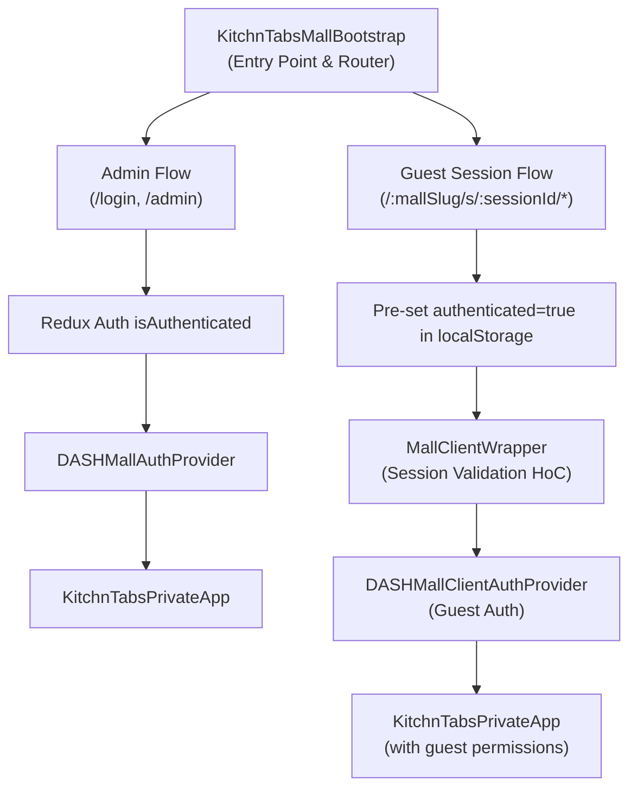
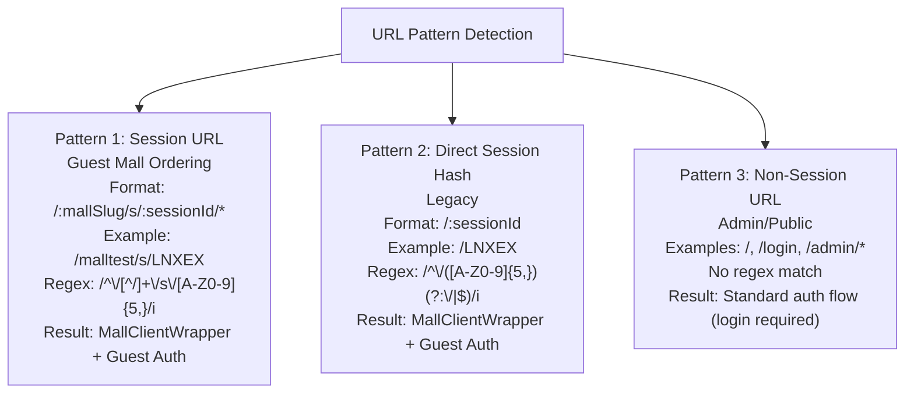
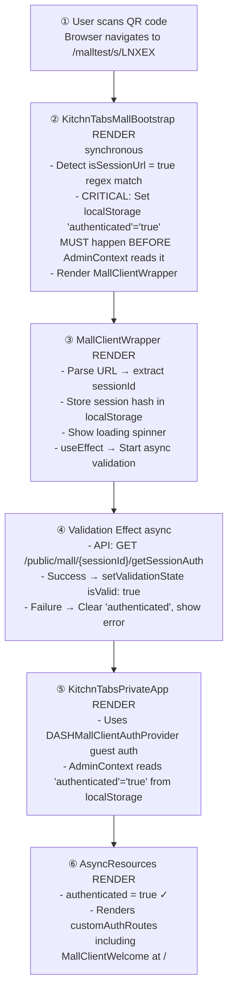
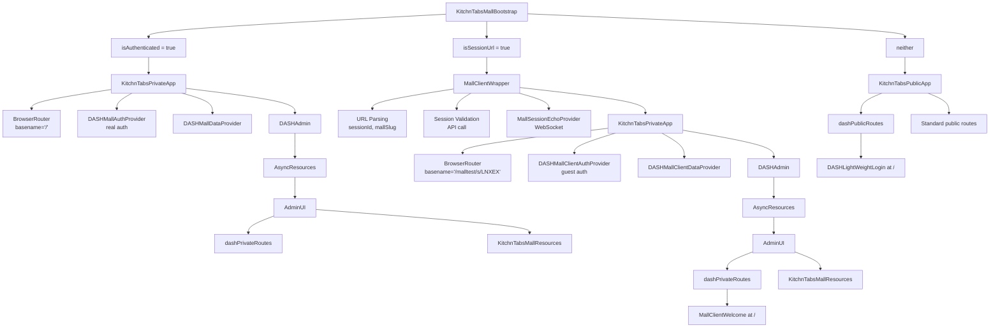
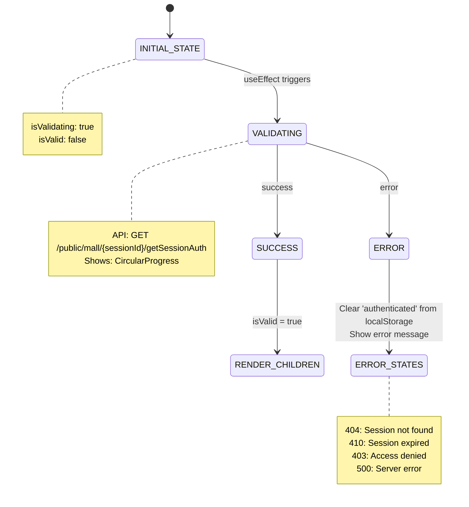
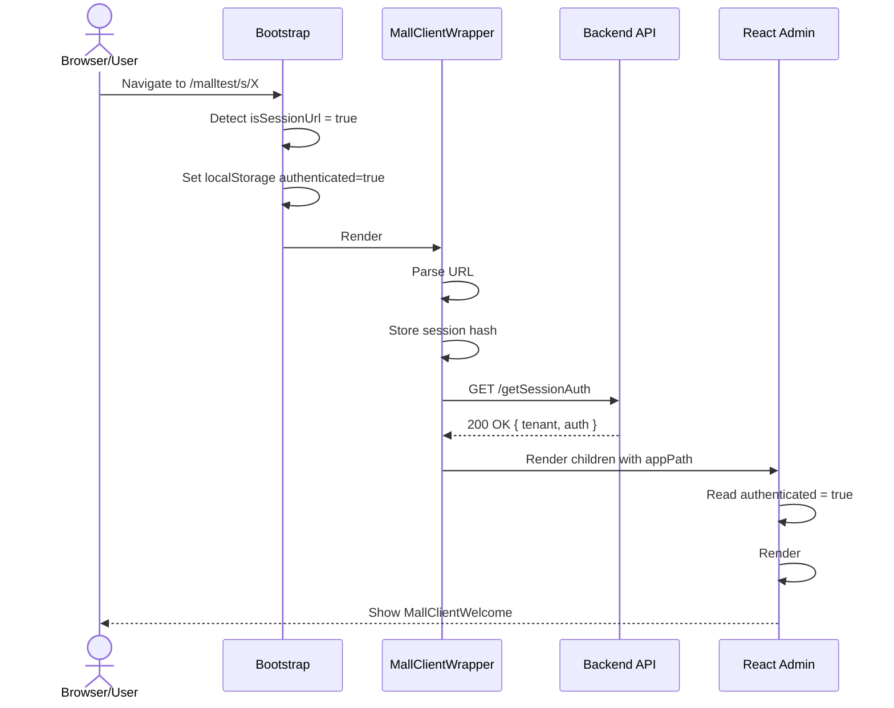

# KitchnTabs Mall - Authentication Flow Technical Documentation

## Overview

The KitchnTabs Mall application implements a **dual authentication architecture** that serves two distinct user types:

1. **Authenticated Admin Users**: Restaurant staff/mall administrators who login with credentials
2. **Guest Mall Customers**: Public users who access mall ordering via QR code session URLs without login

This document explains how the authentication system works, the interaction between React Admin's auth requirements and guest session handling, and the critical timing considerations for proper route rendering.

---

## Table of Contents

1. [Architecture Overview](#1-architecture-overview)
2. [URL Pattern Detection](#2-url-pattern-detection)
3. [Guest Authentication Flow](#3-guest-authentication-flow)
4. [Component Hierarchy](#4-component-hierarchy)
5. [The React Admin Authentication Challenge](#5-the-react-admin-authentication-challenge)
6. [Session Validation Flow](#6-session-validation-flow)
7. [Auth Provider Implementations](#7-auth-provider-implementations)
8. [Route Configuration](#8-route-configuration)
9. [WebSocket Integration](#9-websocket-integration)
10. [Data Flow Diagrams](#10-data-flow-diagrams)
11. [Troubleshooting Guide](#11-troubleshooting-guide)
12. [Key Files Reference](#12-key-files-reference)

---

## 1. Architecture Overview

### High-Level Authentication Architecture



### Key Concepts

| Concept | Description |
|---------|-------------|
| **Session URL** | URL pattern `/:mallSlug/s/:sessionId` that identifies a guest mall ordering session |
| **authenticated flag** | localStorage value that React Admin uses to determine if private routes should render |
| **Guest Authentication** | Treating public users as "authenticated" for React Admin route rendering purposes |
| **Session Validation** | Backend API call to verify session hash is valid and not expired |

---

## 2. URL Pattern Detection

### URL Patterns

The application recognizes different URL patterns to determine the appropriate authentication flow:



### Detection Code (KitchnTabsMallBootstrap.tsx)

```typescript
// Check if URL matches a mall session pattern (/:mallSlug/s/:sessionId)
// Must be computed early before any conditional returns
const isSessionUrl = /^\/[^/]+\/s\/[A-Z0-9]{5,}/i.test(pathname);
```

---

## 3. Guest Authentication Flow

### The Critical Timing Problem

React Admin's `AsyncResources` component checks `authenticated` from `useAuthContext()` on **first render** to determine if private routes should be rendered:

```typescript
// In DASHAdmin.tsx - AsyncResources component
const { authenticated } = useAuthContext();

// Only renders customAuthRoutes if authenticated is true
{(authenticated) ? getCustomAuthRoutes()
  .filter(route => ...)
  .map((route, index) => ...) : null}
```

**Problem**: For guest mall users, `authenticated` is initially `false` because they haven't logged in. Even if the auth provider's `checkAuth()` resolves, React Admin may have already decided not to render private routes.

### Solution: Pre-set authenticated=true

The solution is to set `authenticated=true` in localStorage **synchronously during render**, before any React Admin components mount:

```typescript
// KitchnTabsMallBootstrap.tsx - CRITICAL: Set before React Admin mounts
if (isSessionUrl) {
    const currentAuth = dashStorage.getItem('authenticated');
    if (currentAuth !== 'true') {
        console.log('🔐 Setting guest authenticated=true');
        dashStorage.setItem('authenticated', 'true');
    }
}
```

### Flow Diagram



---

## 4. Component Hierarchy

### Complete Component Tree



---

## 5. The React Admin Authentication Challenge

### Problem Statement

React Admin is designed for authenticated applications. Its `AdminContext` and `AsyncResources` components use the `authenticated` state to decide which routes to render:

1. **AuthContext** reads `authenticated` from Redux state OR localStorage
2. **AsyncResources** conditionally renders `customAuthRoutes` based on `authenticated`
3. **First render** determines initial route rendering - changing `authenticated` later may not re-trigger

### Why Standard Auth Providers Don't Work for Guests

```typescript
// Standard pattern - doesn't work for guests
const authProvider = {
    checkAuth: async () => {
        // Even if this resolves, React Admin may have already
        // decided not to render private routes
        return Promise.resolve();
    }
};
```

### The Solution

**Two-part approach:**

1. **Pre-set `authenticated=true`** in localStorage synchronously in Bootstrap (before React Admin mounts)
2. **Auth provider that always resolves** (`DASHMallClientAuthProvider`)

```typescript
// KitchnTabsMallBootstrap.tsx - SYNCHRONOUS, during render
if (isSessionUrl) {
    dashStorage.setItem('authenticated', 'true');
}

// DASHMallClientAuthProvider.tsx - ASYNC, but always resolves
const authProvider = {
    checkAuth: async () => Promise.resolve(),
    getIdentity: async () => Promise.resolve({ id: 'guest', fullName: 'Guest' }),
    // ... all methods resolve
};
```

---

## 6. Session Validation Flow

### Validation State Machine



### Backend API Response

**Endpoint**: `GET /public/mall/{sessionId}/getSessionAuth`

**Success Response** (200):
```json
{
    "tenant": { /* tenant data */ },
    "auth": {
        "tenant_id": 123,
        "tenant_name": "Mall Name",
        "settings": { /* mall settings */ }
    },
    "systemValues": {
        "pos": [],
        "mall": { /* mall data */ },
        "tenants": [ /* active tenants */ ]
    },
    "redirectTo": "/public/mall/tab/create"
}
```

**Error Responses**:
- `410 Gone`: Session expired (includes `expired_at` timestamp)
- `404 Not Found`: Invalid session hash
- `403 Forbidden`: Access denied

---

## 7. Auth Provider Implementations

### DASHMallAuthProvider (Admin Users)

Used for authenticated admin/staff users. Extends the standard `DASHAuthProvider`.

```typescript
// Real authentication - login with credentials
const authProvider = {
    login: async ({ username, password }) => {
        const response = await api.post('/login', { username, password });
        // Store token, user data in localStorage
        return response;
    },
    checkAuth: async () => {
        const token = localStorage.getItem('token');
        if (!token) throw new Error('Not authenticated');
        return Promise.resolve();
    },
    logout: async () => {
        localStorage.clear();
        return '/login';
    },
    // ... other methods
};
```

### DASHMallClientAuthProvider (Guest Users)

Used for guest mall ordering. All methods resolve - no real authentication.

```typescript
/**
 * Mall Client Auth Provider
 * 
 * Treats guests as "authenticated" so React Admin renders private routes.
 * The guest identity allows access to mall ordering without login.
 */
const authProvider = {
    // Always return guest identity
    getIdentity: async () => Promise.resolve({
        id: 'guest',
        fullName: 'Guest',
        avatar: undefined,
    }),
    
    // Always resolve - tells React Admin user is "authenticated"
    checkAuth: async () => Promise.resolve(),
    
    // No login required
    login: async () => Promise.resolve(),
    
    // No logout action
    logout: async () => Promise.resolve(),
    
    // Don't redirect on errors
    checkError: async () => Promise.resolve(),
    
    // Guest permissions
    getPermissions: async () => Promise.resolve(['guest', 'public']),
};
```

---

## 8. Route Configuration

### Route Types

| Route Type | Context | Renders When |
|------------|---------|--------------|
| `dashPublicRoutes` | Non-session URLs | `isAuthenticated = false` AND `isSessionUrl = false` |
| `dashPrivateRoutes` | Session URLs | `isSessionUrl = true` (guest) OR `isAuthenticated = true` |
| `customAuthRoutes` | React Admin | `authenticated = true` (from localStorage) |

### Route Definitions (KitchnTabsMallRoutes.tsx)

```typescript
// For guest mall users (session URLs) - shows MallClientWelcome at /
export const dashPrivateRoutes = () => [
    ...dashSharedRoutes(),
    <Route
        key="landing"
        data-layout="no-layout"
        path='/'
        element={<MallClientWelcome />}
    />,
    <Route
        key="private-not-found" 
        path="*"
        element={<NotFound />}
    />
];

// For non-session URLs - shows Login at /
export const dashPublicRoutes = () => [
    ...dashSharedRoutes(),
    <Route
        key="landing"
        data-layout="no-layout"
        path='/'
        element={<DASHLightWeightLogin />}
    />,
    <Route
        key="public-not-found"
        path="*"
        element={<NotFound />}
    />
];
```

### React Router basename

The `basename` is dynamically set based on the session URL:

```typescript
// MallClientWrapper calculates sessionBasePath
const sessionBasePath = `/${mallSlug}/s/${sessionId}`; // e.g., "/malltest/s/LNXEX"

// Passed to KitchnTabsPrivateApp
<KitchnTabsPrivateApp appPath={sessionBasePath} />

// Used as BrowserRouter basename
<BrowserRouter basename={appPath || '/'}>
```

This means:
- Session URL `/malltest/s/LNXEX` → basename `/malltest/s/LNXEX`
- Route `/` inside app → Full URL `/malltest/s/LNXEX/`
- Route `/orders` inside app → Full URL `/malltest/s/LNXEX/orders`

---

## 9. WebSocket Integration

### MallSessionEchoProvider

Wraps the guest app to provide WebSocket connectivity for real-time order updates:

```typescript
// MallClientWrapper.tsx
return (
    <MallSessionEchoProvider sessionId={sessionId}>
        <KitchnTabsPrivateApp {...props} />
    </MallSessionEchoProvider>
);
```

### WebSocket Channel

```
Channel: session.{sessionId}
Events:
  - mall_order_status_update
  - mall_tab_creation
  - mall_assistance_request
```

---

## 10. Data Flow Diagrams

### Complete Authentication Flow

```mermaid
flowchart TD
    S1["1. USER ACTION: Scan QR Code<br/>QR contains: https://domain.com/malltest/s/LNXEX"] --> S2
    S2["2. BROWSER: Navigate to URL<br/>pathname = '/malltest/s/LNXEX'"] --> S3
    S3["3. KitchnTabsMallBootstrap: URL PATTERN CHECK<br/>isSessionUrl = /^\/[^/]+\/s\/[A-Z0-9]{5,}/i.test pathname<br/>isSessionUrl = true ✓<br/>CRITICAL: dashStorage.setItem('authenticated', 'true')"] --> S4
    S4["4. RENDER DECISION<br/>if isAuthenticated → Admin App<br/>else if isSessionUrl → MallClientWrapper + Guest App<br/>else → Public App Login"] --> S5
    S5["5. MallClientWrapper: MOUNT<br/>a. Parse URL → sessionId='LNXEX', mallSlug='malltest'<br/>b. Calculate sessionBasePath='/malltest/s/LNXEX'<br/>c. Store in localStorage:<br/>   - mall-session-hash = 'LNXEX'<br/>   - authenticated = 'true' reinforced<br/>d. Initial state: isValidating=true → Show spinner"] --> S6
    S6["6. MallClientWrapper: useEffect VALIDATION<br/>API Request: GET /public/mall/LNXEX/getSessionAuth"] --> S6D{Status?}
    S6D -->|SUCCESS 200| S6S["isValid = true<br/>Store tenant data"]
    S6D -->|ERROR 404/410/403| S6E["isValid = false<br/>Clear 'authenticated'<br/>Show error message"]
    S6S --> S7
    S7["7. RENDER CHILDREN KitchnTabsPrivateApp<br/>Props:<br/>- appPath = '/malltest/s/LNXEX' used as BrowserRouter basename<br/>- customAuthProvider = DASHMallClientAuthProvider<br/>- customDataProvider = DASHMallClientDataProvider<br/>Wrapped in: MallSessionEchoProvider sessionId='LNXEX'"] --> S8
    S8["8. KitchnTabsPrivateApp: MOUNT<br/>BrowserRouter basename='/malltest/s/LNXEX'<br/>DASHAdmin<br/>  authProvider=DASHMallClientAuthProvider<br/>  dataProvider=DASHMallClientDataProvider<br/>  basename='/malltest/s/LNXEX'<br/>AsyncResources"] --> S9
    S9["9. DASHAdmin/AsyncResources: AUTH CHECK<br/>const authenticated = useAuthContext<br/>Reads from localStorage: authenticated = 'true' ✓<br/>authenticated = true<br/>→ Renders customAuthRoutes dashPrivateRoutes<br/>→ Shows MallClientWelcome at /"] --> S10
    S10["10. FINAL STATE: User sees MallClientWelcome<br/>URL: https://domain.com/malltest/s/LNXEX<br/>Component: MallClientWelcome<br/>WebSocket: Connected to session.LNXEX channel<br/>Auth: Guest no login required"]
```



### Sequence Diagram



---

## 11. Troubleshooting Guide

### Problem: Session URL shows Login instead of MallClientWelcome

**Symptoms:**
- Navigating to `/malltest/s/LNXEX` shows Login page
- Console shows "DASHLightWeightLogin.tsx: Initializing app authentication..."

**Cause:** `authenticated` flag not set before React Admin reads it

**Solution:**
1. Ensure `authenticated=true` is set synchronously in Bootstrap:
```typescript
if (isSessionUrl) {
    dashStorage.setItem('authenticated', 'true');
}
```
2. This must happen BEFORE any conditional returns or async operations

### Problem: Session validation fails with 410 (Expired)

**Symptoms:**
- Error message shows "Session has expired"
- Backend returns 410 status

**Cause:** Session older than 10 hours from activation

**Solution:**
- Generate new session QR code
- Sessions auto-expire after 10 hours

### Problem: WebSocket not receiving updates

**Symptoms:**
- Order status updates not appearing in real-time
- Console shows WebSocket connection errors

**Cause:** MallSessionEchoProvider not wrapping the app correctly

**Solution:**
- Verify `sessionId` is passed to MallSessionEchoProvider
- Check WebSocket server configuration

### Problem: Routes not matching after navigation

**Symptoms:**
- Internal navigation works, but page shows 404
- URL shows correct path but wrong component renders

**Cause:** BrowserRouter basename mismatch

**Solution:**
- Verify `appPath` is correctly passed from MallClientWrapper
- Ensure `sessionBasePath` calculation is correct

---

## 12. Key Files Reference

| File | Purpose |
|------|---------|
| `apps/kitchntabs-mall/src/KitchnTabsMallBootstrap.tsx` | Main entry point, URL detection, auth flag pre-setting |
| `apps/kitchntabs-mall/src/components/mall/MallClientWrapper.tsx` | Session validation HoC, URL parsing, WebSocket wrapper |
| `apps/kitchntabs-mall/src/dash-extensions/config/DASHMallClientAuthProvider.tsx` | Guest auth provider (all methods resolve) |
| `apps/kitchntabs-mall/src/dash-extensions/config/DASHMallClientDataProvider.tsx` | Data provider with session context injection |
| `apps/kitchntabs-mall/src/KitchnTabsMallRoutes.tsx` | Route definitions (public vs private) |
| `apps/kitchntabs-mall/src/core/KitchnTabsPrivateApp.tsx` | Private app wrapper, BrowserRouter configuration |
| `packages/dash-admin/src/DASHAdmin.tsx` | React Admin wrapper, AsyncResources (auth gating) |

---

## Summary

The KitchnTabs Mall authentication system solves the challenge of using React Admin (designed for authenticated apps) with public guest users. The key insight is:

1. **React Admin checks `authenticated` synchronously** on first render
2. **Setting `authenticated=true` must happen BEFORE React Admin mounts**
3. **Session validation is async** but route rendering decision is sync
4. **The solution**: Pre-set `authenticated=true` in Bootstrap when a session URL is detected

This architecture enables:
- ✅ Guest users accessing mall ordering without login
- ✅ Real users logging in for admin functionality  
- ✅ Proper route rendering for both user types
- ✅ Session validation with appropriate error handling
- ✅ WebSocket integration for real-time updates
