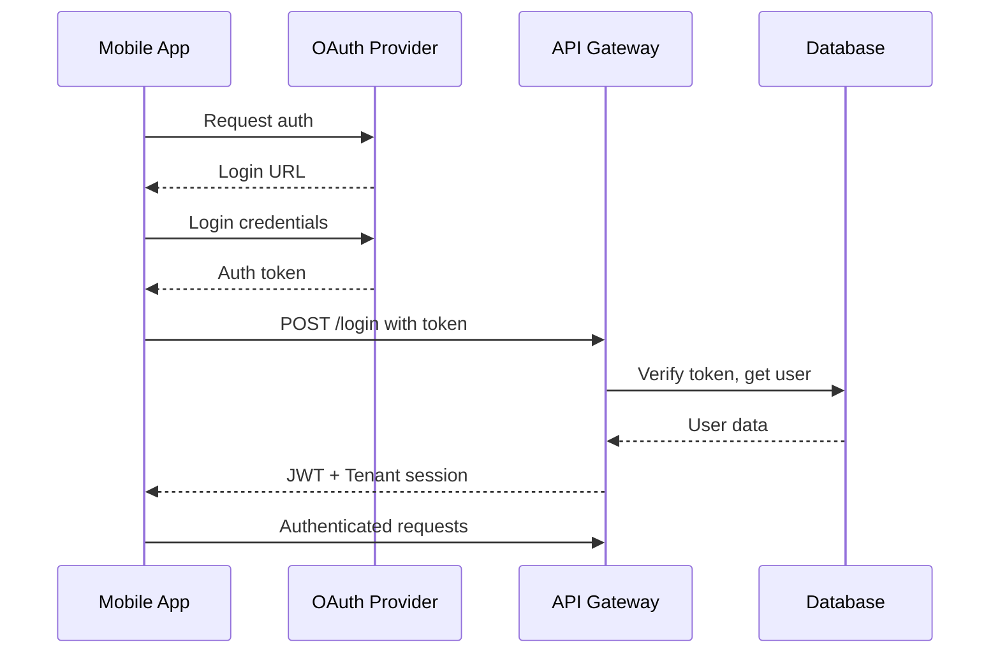
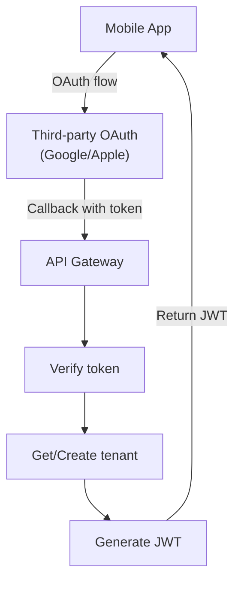
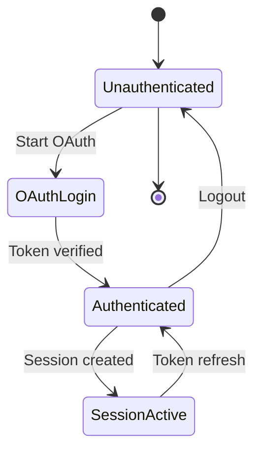
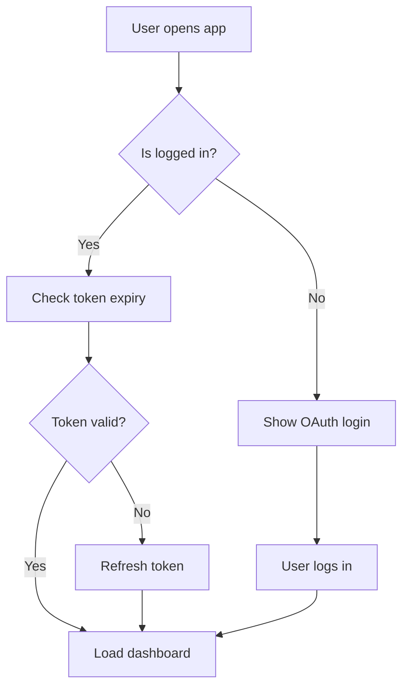

# KitchnTabs Mall Guest Authentication Flow

## Overview

The KitchnTabs Mall application uses a **session-based guest authentication** system that allows customers to access the ordering interface without traditional login credentials. Instead, users authenticate by scanning a QR code that contains a unique session hash.

This document describes the complete authentication flow, from QR code scan to order submission.

---

## Authentication Model

### Traditional Auth vs Session Auth

| Aspect | Traditional Auth | Mall Session Auth |
|--------|------------------|-------------------|
| Credentials | Username/Password | Session Hash (from QR) |
| Persistence | Token in localStorage | Session hash in localStorage |
| Identity | Logged-in user | Anonymous guest |
| Backend Validation | Token validation | Session hash validation |
| Expiration | Token TTL | Session expires after 10 hours |

### The Session Hash

The session hash is a **5+ character alphanumeric identifier** that uniquely identifies a mall ordering session.

**Examples:**
- `DFJNL`
- `ABC12`
- `XYZ99`

The hash is:
1. Generated by the backend when a QR code is created
2. Embedded in the QR code URL
3. Used to identify and validate customer sessions
4. Stored in localStorage for the duration of the session

---

## Authentication Flow Diagram



---

## Key Components

### 1. KitchnTabsMallBootstrap

The main entry point that detects session URLs and routes accordingly.



### 2. MallClientWrapper

Handles session validation and setup before rendering the application.

```typescript
// Located: apps/kitchntabs-mall/src/components/mall/MallClientWrapper.tsx

const MallClientWrapper: React.FC = ({ children }) => {
    const [urlParams] = useState(() => parseUrlParams());
    const { sessionId, mallSlug, sessionBasePath } = urlParams;
    const axios = useAxios();
    
    // Store session data in localStorage
    useEffect(() => {
        if (!sessionId) return;
        
        // Clear storage if session changed
        const prevSessionId = dashStorage.getItem('mall-session-hash');
        if (prevSessionId && prevSessionId !== sessionId) {
            dashStorage.clear();
        }
        
        // Store current session
        dashStorage.setItem('mall-session-hash', sessionId);
        dashStorage.setItem('authenticated', 'true');
        
        if (mallSlug) {
            dashStorage.setItem('mall-slug', mallSlug);
        }
    }, [sessionId, mallSlug]);
    
    // Validate session with backend
    useEffect(() => {
        const validateSession = async () => {
            try {
                const { data } = await axios.get(
                    `/public/mall/${sessionId}/getSessionAuth`
                );
                setTenantData(data);
                setValidationState({ isValidating: false, isValid: true });
            } catch (error) {
                dashStorage.removeItem('authenticated');
                setValidationState({ 
                    isValidating: false, 
                    isValid: false,
                    errorMessage: getErrorFromStatus(error.response?.status)
                });
            }
        };
        
        validateSession();
    }, [sessionId]);
    
    // Render validation states or children
    if (validationState.isValidating) return <LoadingSpinner />;
    if (!validationState.isValid) return <ErrorMessage />;
    
    return (
        <MallSessionEchoProvider sessionId={sessionId}>
            {children}
        </MallSessionEchoProvider>
    );
};
```

### 3. DASHMallClientAuthProvider

Custom auth provider that treats guests as authenticated.

```typescript
// Located: apps/kitchntabs-mall/src/dash-extensions/config/DASHMallClientAuthProvider.tsx

const authProvider = {
    // Returns guest identity - makes React Admin think user is logged in
    getIdentity: async () => {
        return Promise.resolve({
            id: 'guest',
            fullName: 'Guest',
            avatar: undefined,
        });
    },
    
    // Always resolves - tells React Admin authentication is valid
    checkAuth: async () => {
        console.log('🔐 MallClientAuthProvider: checkAuth - resolving as authenticated guest');
        return Promise.resolve();
    },
    
    // No-op login - guests don't need to login
    login: async () => {
        return Promise.resolve();
    },
    
    // No-op logout
    logout: async () => {
        return Promise.resolve();
    },
    
    // Don't redirect on errors - public app handles errors differently
    checkError: async (error) => {
        return Promise.resolve();
    },
    
    // Return guest permissions
    getPermissions: async () => {
        return Promise.resolve(['guest', 'public']);
    },
};
```

### 4. DASHMallClientDataProvider

Data provider that injects session context into API calls.

```typescript
// Located: apps/kitchntabs-mall/src/dash-extensions/config/DASHMallClientDataProvider.tsx

// Get session ID from localStorage
const getSessionId = () => {
    return dashStorage.getItem('mall-session-hash');
};

// Get mall ID from systemValues (set during auth)
const getMallId = () => {
    return AuthPersistenceService.getSystemValues()?.mall?.id;
};

const dataProvider = {
    ...genericDataProvider,
    
    getList: async (resource, params) => {
        const apiResource = mapResourceToApiPath(resource);
        const enhancedParams = {
            ...params,
            filter: {
                ...params.filter,
                mall_id: getMallId(),
                mall_session: getSessionId(),  // Session hash injected
            },
        };
        return genericDataProvider.getList(apiResource, enhancedParams);
    },
    
    create: async (resource, params) => {
        const apiResource = mapResourceToApiPath(resource);
        const enhancedData = {
            ...params.data,
            mall_id: getMallId(),
            mall_session: getSessionId(),  // Session hash injected
        };
        return genericDataProvider.create(apiResource, { 
            ...params, 
            data: enhancedData 
        });
    },
    
    // Disable destructive operations for public client
    delete: async () => {
        throw new Error('Delete not allowed for mall client');
    },
};
```

---

## Backend API Endpoints

### Session Validation Endpoint

```
GET /api/public/mall/{sessionId}/getSessionAuth
```

**Response (Success - 200):**
```json
{
    "tenant": {
        "id": 1,
        "name": "Mall Manager Tenant",
        "settings": { ... }
    },
    "auth": {
        "tenant_id": 1,
        "tenant_name": "Mall Manager Tenant",
        "settings": { ... },
        "images": { ... }
    },
    "systemValues": {
        "pos": [...],
        "mall": {
            "id": 1,
            "name": "Test Mall",
            "slug": "malltest"
        },
        "tenants": [
            { "id": 2, "name": "Pizza Place" },
            { "id": 3, "name": "Sushi Bar" }
        ]
    },
    "redirectTo": "/public/mall/tab/create"
}
```

**Response (Session Expired - 410):**
```json
{
    "message": "Session has expired. Sessions are valid for 10 hours from activation.",
    "expired_at": "2025-12-10T12:30:00.000000Z"
}
```

**Response (Not Found - 404):**
```json
{
    "message": "Session not found"
}
```

---

## localStorage Keys

| Key | Value | Purpose |
|-----|-------|---------|
| `authenticated` | `'true'` | Tells React Admin to render protected routes |
| `mall-session-hash` | `'DFJNL'` | Session identifier for API calls |
| `mall-slug` | `'malltest'` | Mall slug for routing |
| `orderData` | `'{"name":"John","tableNumber":"5"}'` | Customer info for order submission |

---

## Session Lifecycle



### Session Expiration

Sessions expire **10 hours** after activation. The backend validates this on every API call:

```php
// Laravel Backend - MallSessionController
public function getSessionAuth(string $hash)
{
    $session = MallSession::where('hash', $hash)->firstOrFail();
    
    if ($session->isActive()) {
        $activatedAt = Carbon::parse($session->meta['activated_at']);
        
        if ($activatedAt->diffInHours(now()) >= 10) {
            $session->markAsCompleted();
            return response()->json([
                'message' => 'Session expired',
                'expired_at' => $activatedAt->addHours(10)->toIso8601String()
            ], 410);
        }
    }
    
    return $this->buildAuthResponse($session);
}
```

---

## Security Considerations

### No Traditional Authentication

- **No passwords** are used - authentication is based solely on the session hash
- **Session hashes are unguessable** - 5+ alphanumeric characters provide sufficient entropy
- **Sessions are single-use** - once activated, tied to client IP/user-agent (logged for monitoring)

### Client Validation

The backend logs client information for session access monitoring:

```php
$session->update([
    'status' => MallSession::STATUS_ACTIVE,
    'meta' => [
        'activated_at' => now()->toIso8601String(),
        'client_ip' => request()->ip(),
        'user_agent' => request()->userAgent(),
    ],
]);
```

### Rate Limiting

- Sessions are limited to one active session per hash
- API endpoints have rate limiting applied
- Assistance requests are limited per store per session

### Data Access Scope

The data provider automatically scopes all queries to the current session:

```typescript
// All API calls include session context
filter: {
    mall_session: 'DFJNL',  // Session hash
    mall_id: 1              // Mall ID from session
}
```

This ensures customers can only see/modify their own orders.

---

## Comparison: Admin vs Guest Authentication



---

## Troubleshooting

### Common Issues

| Issue | Cause | Solution |
|-------|-------|----------|
| "Session not found" | Invalid hash in URL | Verify QR code URL |
| "Session expired" | 10 hours elapsed | Generate new session |
| Redirect to login | `authenticated` not set | Check isSessionUrl regex |
| API returns 401 | Wrong data provider | Verify publicAppProps config |
| Orders not filtered | Session not in localStorage | Check `mall-session-hash` key |

### Debug Checklist

1. **Check localStorage:**
   ```javascript
   console.log({
       authenticated: localStorage.getItem('authenticated'),
       sessionHash: localStorage.getItem('mall-session-hash'),
       mallSlug: localStorage.getItem('mall-slug')
   });
   ```

2. **Verify URL Pattern:**
   ```javascript
   const pathname = window.location.pathname;
   const isSessionUrl = /^\/[^/]+\/s\/[A-Z0-9]{5,}/i.test(pathname);
   console.log('isSessionUrl:', isSessionUrl);
   ```

3. **Check Network Requests:**
   - Look for `GET /public/mall/{hash}/getSessionAuth`
   - Verify response status and data

4. **Inspect Console Logs:**
   ```
   🔐 KitchnTabsMallBootstrap: Session URL detected, setting guest authenticated=true
   🔍 MallClientWrapper: Parsed URL (mall/s/session pattern): {...}
   ✅ MallClientWrapper: Session validated successfully: DFJNL
   ```

---

## Related Documentation

- [KitchnTabs Mall Application Flow](./KITCHNTABS_MALL_APPLICATION_FLOW.md)
- [WebSocket Messaging System](./KITCHNTABS_MALL_WEBSOCKET_SYSTEM.md)
- [Backend Mall API Documentation](./MALL_BACKEND_API.md)
