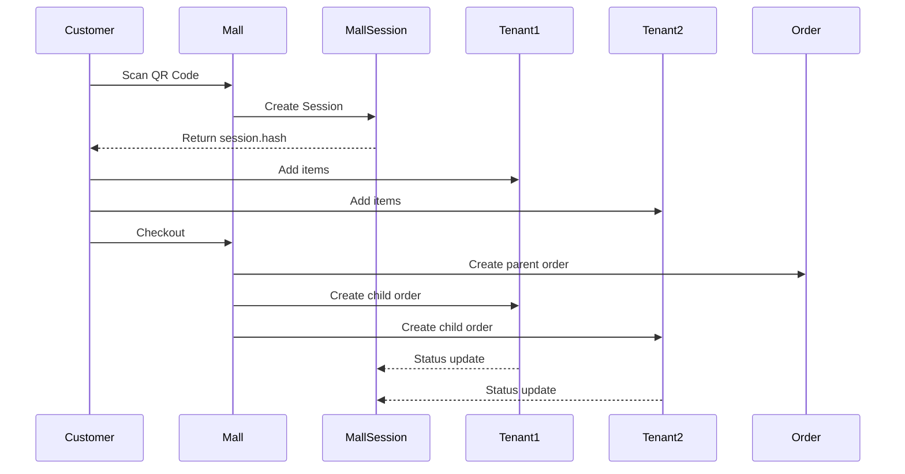

# Mall Module

> Multi-tenant food court / mall session management.

## Overview

The Mall module enables multi-store food court scenarios where customers can order from multiple tenant stores within a single session.

## Models

### Mall
Root mall configuration.

**Key Fields:**
- `name`, `slug`, `manager_tenant_id`
- `settings` - JSON configuration

### MallSession
Active customer session in the mall.

**Key Fields:**
- `hash` - Public session identifier
- `customer_name`, `mall_location` (table number)
- `status` - Session lifecycle

### MallSessionNotification
Real-time notifications for session updates.

## Session Flow

## WebSocket Channel

Sessions broadcast on `session.{hash}` public channel.
