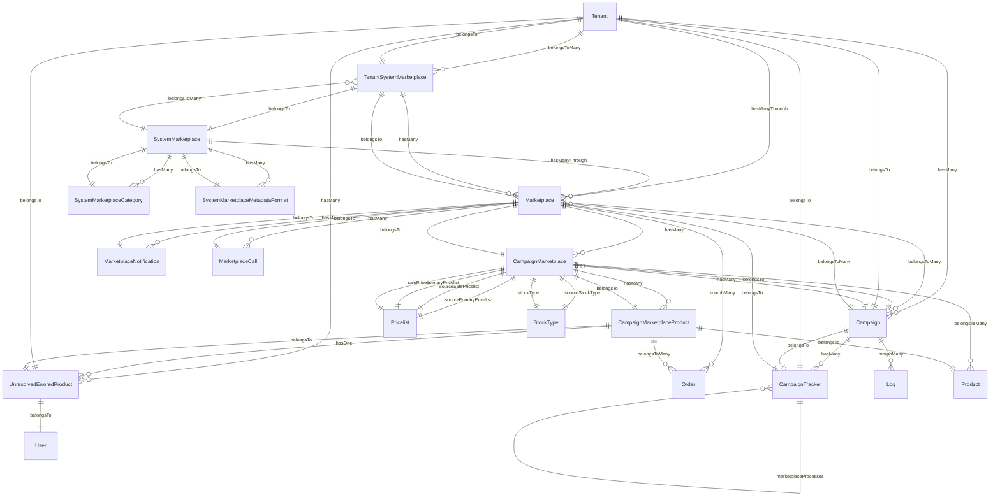
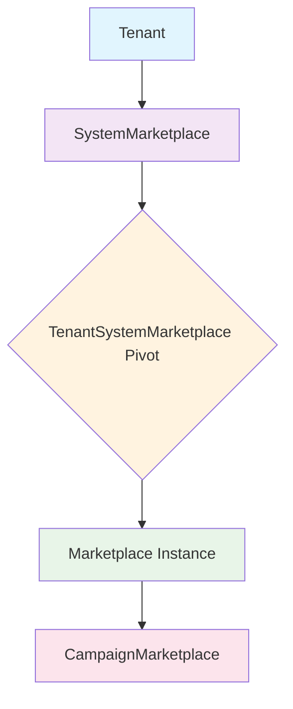
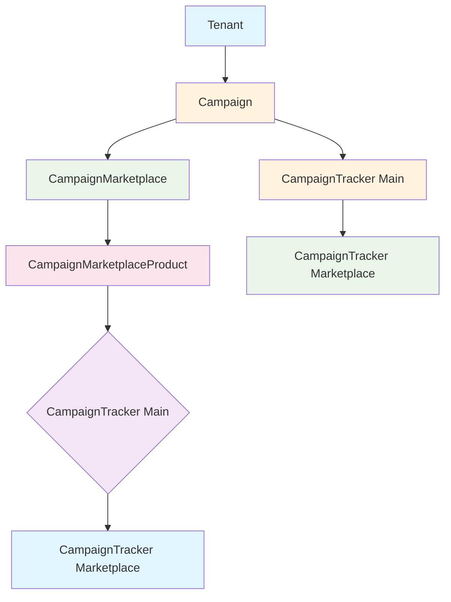
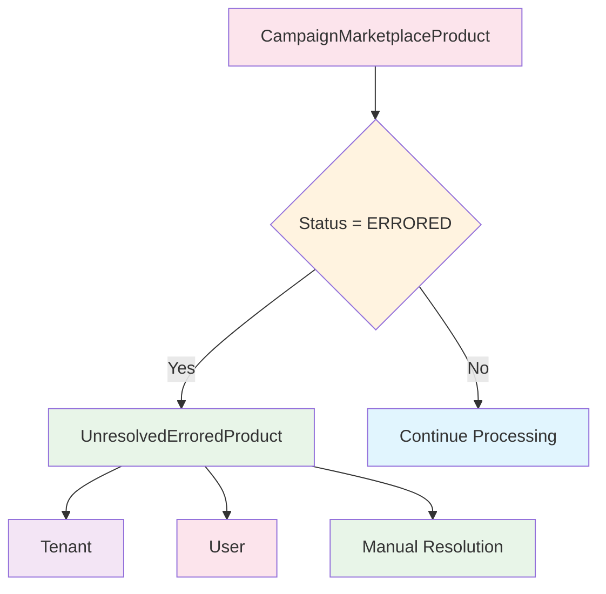

# Tenant, SystemMarketplace, Marketplace & Campaign Models - Architecture Diagram

## Overview

This document provides a comprehensive view of the relationships between Tenant, SystemMarketplace, Marketplace, Campaign, and all related campaign models in the DASH-PW-PROJECT system.

## Entity Relationship Diagram



## Data Flow Diagrams

### Marketplace Setup Flow



### Campaign Execution Flow



### Error Handling Flow



## Model Details

### Core Models

#### Tenant
**Location:** `domain/app/Models/Extended/Tenant.php`

**Key Relationships:**
- `belongsToMany` → SystemMarketplace (via tenant_system_marketplaces pivot)
- `hasManyThrough` → Marketplace (through TenantSystemMarketplace)
- `hasMany` → Campaign
- `hasMany` → UnresolvedErroredProduct

**Purpose:** Represents a business entity that can have multiple marketplace integrations and campaigns.

#### SystemMarketplace
**Location:** `domain/app/Models/Marketplace/SystemMarketplace.php`

**Key Fields:**
- `name` - Display name (e.g., "Uber", "Jumpseller")
- `class` - Service class for integration
- `icon_path` - Icon file path

**Key Relationships:**
- `belongsToMany` → Tenant (via tenant_system_marketplaces pivot)
- `hasManyThrough` → Marketplace (through TenantSystemMarketplace)
- `hasMany` → SystemMarketplaceCategory
- `hasMany` → SystemMarketplaceMetadataFormat

**Purpose:** Defines available marketplace platform types that tenants can enable.

#### Marketplace
**Location:** `domain/app/Models/Marketplace/Marketplace.php`

**Key Fields:**
- `tenant_system_marketplace_id` - Links to tenant's system marketplace
- `name` - Instance name
- `active` - Enable/disable flag
- `connection_params` - API credentials and settings (JSON)

**Key Relationships:**
- `belongsTo` → TenantSystemMarketplace
- `hasMany` → CampaignMarketplace
- `hasMany` → MarketplaceNotification
- `hasMany` → MarketplaceCall
- `morphMany` → Order
- `belongsToMany` → Campaign

**Purpose:** Specific marketplace instance configured for a tenant.

### Campaign System

#### Campaign
**Location:** `domain/app/Models/ECommerce/Campaign.php`

**Key Fields:**
- `tenant_id` - Owner tenant
- `name` - Campaign name
- `description` - Campaign description
- `status` - Current status (PENDING, PUBLISHING, PUBLISHED, etc.)
- `scheduled` - Whether campaign has scheduled start/end
- `start_date`, `end_date` - Campaign duration

**Status Values:**
- PENDING, PUBLISHING, PUBLISHED, PAUSING, PAUSED, FINISHING, FINISHED

**Key Relationships:**
- `belongsTo` → Tenant
- `hasMany` → CampaignMarketplace
- `hasMany` → CampaignTracker
- `morphMany` → Log
- `belongsToMany` → Marketplace

**Purpose:** Main campaign entity managing product promotions across multiple marketplaces.

#### CampaignMarketplace (Pivot Table)
**Location:** `domain/app/Models/ECommerce/CampaignMarketplace.php`

**Key Fields:**
- `campaign_id`, `marketplace_id` - Primary keys
- `source_primary_pricelist_id` - Original primary pricing
- `source_sale_pricelist_id` - Original sale pricing
- `primary_pricelist_id` - Campaign primary pricing (internal clone)
- `sale_pricelist_id` - Campaign sale pricing (internal clone)
- `source_stock_type_id` - Original stock tracking
- `stock_type_id` - Campaign stock tracking (internal clone)

**Key Relationships:**
- `belongsTo` → Campaign
- `belongsTo` → Marketplace
- `belongsTo` → Pricelist (4 relationships)
- `belongsTo` → StockType (2 relationships)
- `belongsToMany` → Product (via CampaignMarketplaceProduct)
- `hasMany` → CampaignMarketplaceProduct

**Purpose:** Links campaigns to marketplaces with specific pricing and stock configurations.

#### CampaignMarketplaceProduct
**Location:** `domain/app/Models/ECommerce/CampaignMarketplaceProduct.php`

**Key Fields:**
- `campaign_marketplace_id` - Parent campaign-marketplace link
- `product_id` - Product being campaigned
- `status` - Publishing status (PENDING, PUBLISHED, PAUSED, WARNING, ERRORED, FINISHED)
- `sales_count` - Number of sales through this campaign
- `stock_alert_threshold` - Low stock warning level
- `marketplace_info` - Marketplace-specific data (JSON)
- `marketplace_error` - Last error message

**Status Values:**
- PENDING, PUBLISHED, PAUSED, WARNING, ERRORED, FINISHED

**Key Relationships:**
- `belongsTo` → CampaignMarketplace
- `belongsTo` → Product
- `hasOne` → UnresolvedErroredProduct
- `belongsToMany` → Order

**Purpose:** Individual product instance within a campaign-marketplace combination.

#### CampaignTracker
**Location:** `domain/app/Models/Campaign/CampaignTracker.php`

**Key Fields:**
- `tenant_id`, `campaign_id`, `marketplace_id` - Context identifiers
- `action` - Type of operation (publishing, pausing, finishing, republishing, validating)
- `process_type` - Main process or marketplace-specific process
- `status` - Current status (pending, in_progress, completed, failed, etc.)
- `progress` - Completion percentage
- `phases_config` - Workflow phases definition (JSON)
- `phases_status` - Current phase statuses (JSON)

**Process Types:**
- `main` - Campaign-level tracking
- `marketplace` - Marketplace-specific operations

**Action Types:**
- publishing, pausing, finishing, republishing, validating

**Status Types:**
- pending, awaiting_provision, in_progress, completed, failed, paused, cancelled

**Key Relationships:**
- `belongsTo` → Tenant
- `belongsTo` → Campaign
- `belongsTo` → Marketplace
- `belongsTo` → CampaignTracker (parent/child hierarchy)
- `hasMany` → CampaignTracker (marketplace processes)

**Purpose:** Tracks campaign execution progress with hierarchical tracking for complex operations.

### Supporting Models

#### TenantSystemMarketplace (Pivot Table)
**Location:** `domain/app/Models/Marketplace/TenantSystemMarketplace.php`

**Key Fields:**
- `tenant_id`, `system_marketplace_id` - Primary keys

**Key Relationships:**
- `belongsTo` → Tenant
- `belongsTo` → SystemMarketplace
- `hasMany` → Marketplace

**Purpose:** Enables system marketplaces for specific tenants.

#### UnresolvedErroredProduct
**Location:** `domain/app/Models/ECommerce/UnresolvedErroredProduct.php`

**Key Fields:**
- `tenant_id`, `user_id` - Context
- `campaign_marketplace_product_id` - Failed product
- `last_attempt_at` - Last retry timestamp
- `attempts_count` - Number of retry attempts

**Key Relationships:**
- `belongsTo` → Tenant
- `belongsTo` → User
- `belongsTo` → CampaignMarketplaceProduct

**Purpose:** Tracks products that failed during campaign publishing for manual resolution.

## Key Data Flow Patterns

### 1. Tenant Setup Flow
```
Tenant → TenantSystemMarketplace → Marketplace → CampaignMarketplace
```

### 2. Campaign Creation Flow
```
Tenant → Campaign → CampaignMarketplace → CampaignMarketplaceProduct
```

### 3. Campaign Execution Flow
```
Campaign → CampaignTracker (main) → CampaignTracker (marketplace processes)
```

### 4. Error Handling Flow
```
CampaignMarketplaceProduct → UnresolvedErroredProduct → Manual Resolution
```

### 5. Order Tracking Flow
```
Marketplace → Order (polymorphic relationship)
```

## Complex Relationship Explanations

### Marketplace Hierarchy
```
SystemMarketplace (platform definition)
    ↓
TenantSystemMarketplace (tenant enables platform)
    ↓
Marketplace (specific tenant instance)
    ↓
CampaignMarketplace (campaign uses marketplace)
```

### Campaign Complexity
```
Campaign (promotion definition)
    ↓
CampaignMarketplace (marketplace-specific config)
    ↓
CampaignMarketplaceProduct (individual products)
    ↓
UnresolvedErroredProduct (error tracking)
```

### Tracking Hierarchy
```
CampaignTracker (main process)
    ↓
CampaignTracker (marketplace processes)
```

## Database Schema Overview

### Key Tables
- `tenants` - Business entities
- `system_marketplaces` - Available platform types
- `tenant_system_marketplaces` - Tenant-platform enablement
- `marketplaces` - Specific platform instances
- `campaigns` - Promotion campaigns
- `campaign_marketplace` - Campaign-marketplace links
- `campaign_marketplace_products` - Individual campaign products
- `campaign_trackers` - Execution tracking
- `unresolved_errored_products` - Error recovery

### Pivot Tables
- `tenant_system_marketplaces` - Many-to-many tenant ↔ system_marketplace
- `campaign_marketplace` - Many-to-many campaign ↔ marketplace (with config)
- `campaign_marketplace_product` - Many-to-many campaign_marketplace ↔ product

This architecture supports multi-tenant marketplace management with sophisticated campaign execution tracking, error handling, and hierarchical progress monitoring.</content>
<parameter name="filePath">/Users/farandal/DASH-PW-PROJECT/tenant-marketplace-campaign-architecture.md