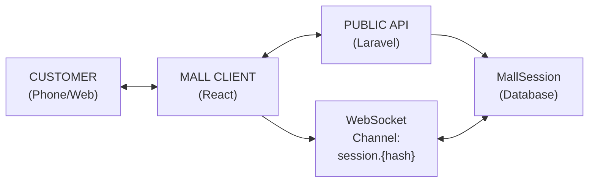
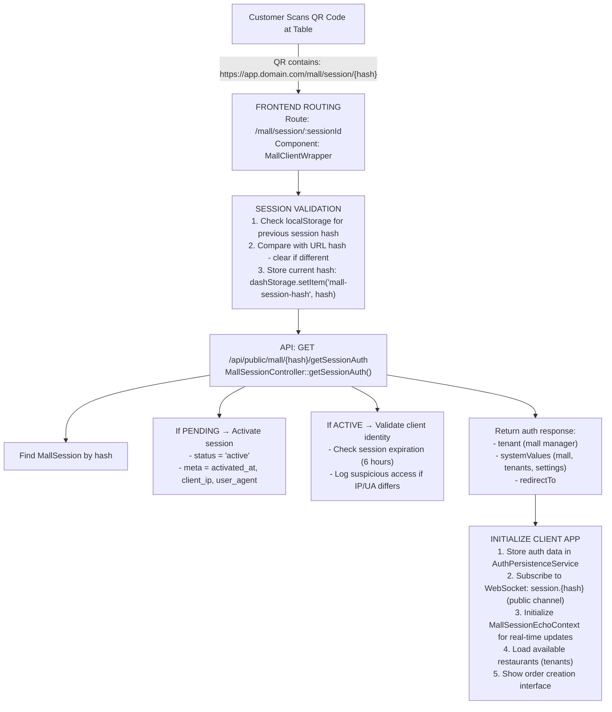
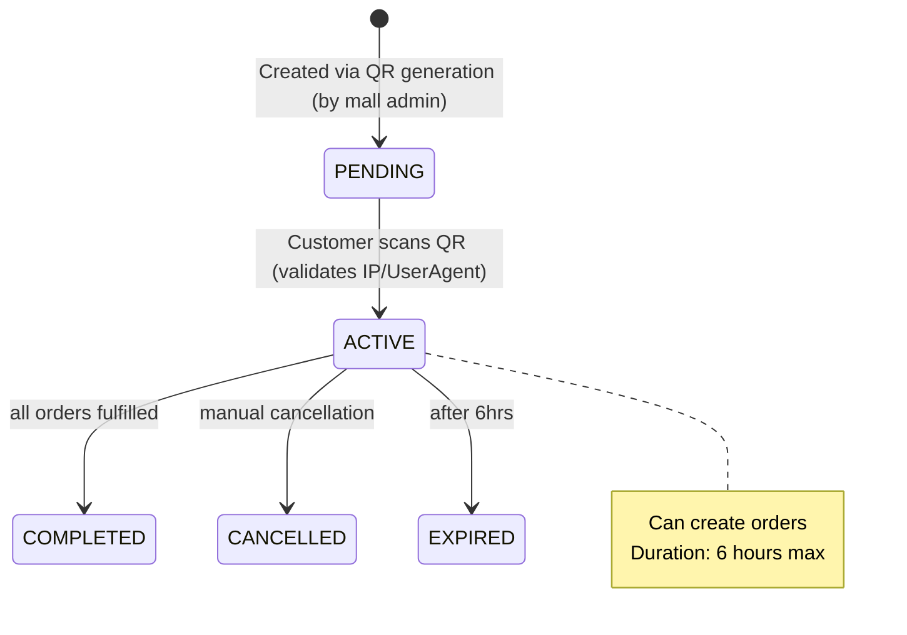
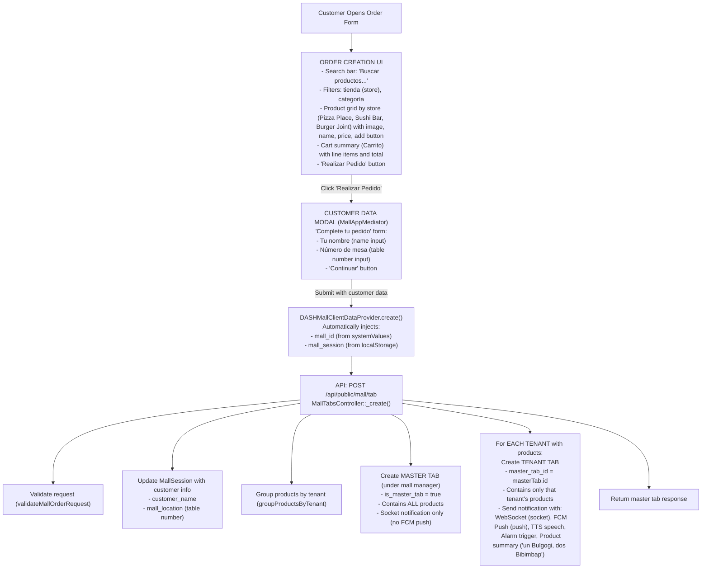
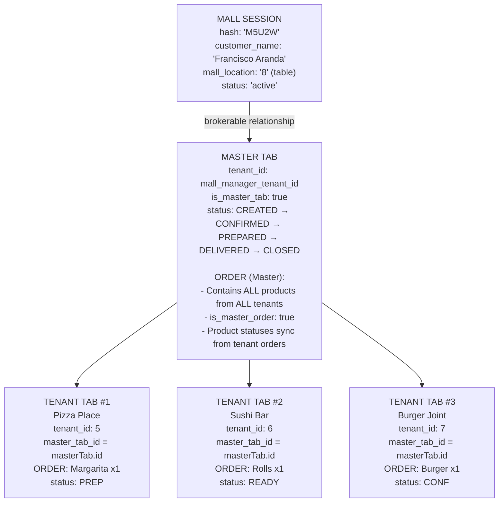
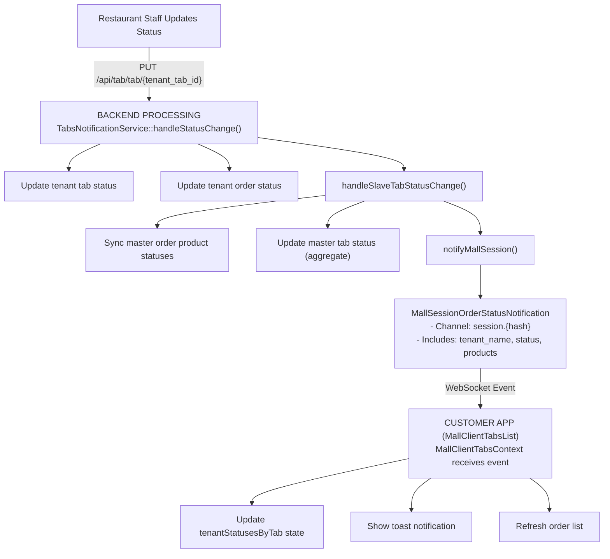
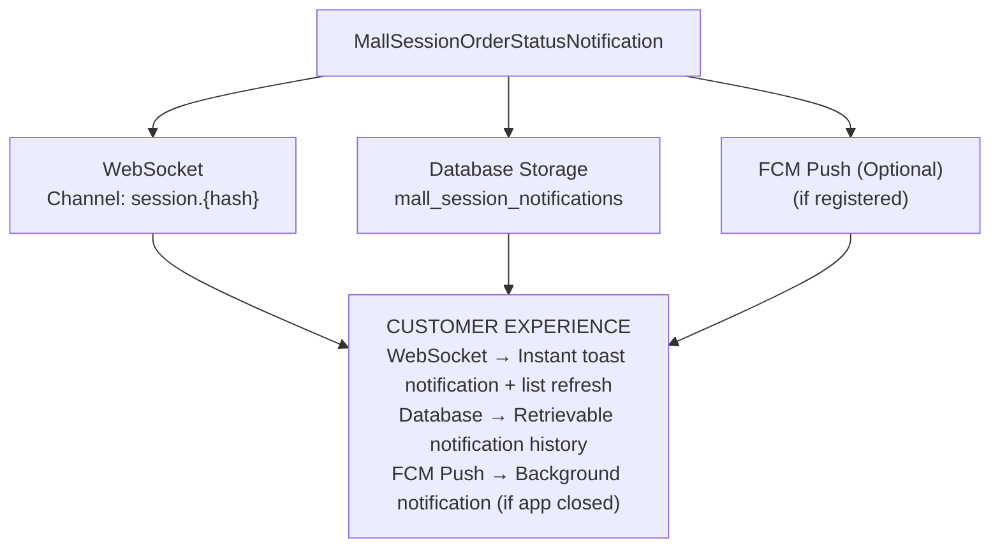
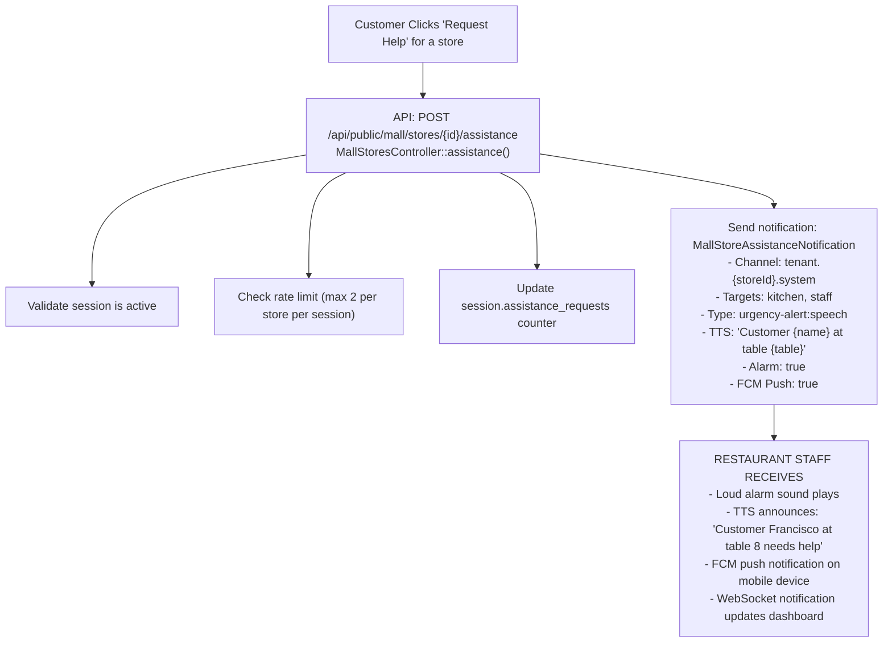
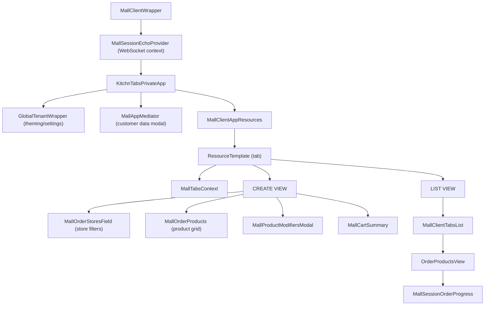

# Customer App (Mall Client) - Complete Flow Documentation

## Overview

This document describes the complete flow of the **Customer App (Mall Client)** - the public-facing application that allows customers to order from multiple restaurants in a mall/food court via QR code scanning.

---

## System Architecture



---

## Key Concepts

| Concept | Description |
|---------|-------------|
| **Mall Session** | Temporary session created when customer scans QR code (5-char hash) |
| **Master Tab** | Aggregated order under mall manager tenant |
| **Tenant Tab** | Individual order per restaurant within the session |
| **Session Hash** | Unique 5-character identifier (e.g., "M5U2W") |

---

## QR Code & Session Flow



---

## Session Lifecycle



---

## Order Creation Flow



---

## Multi-Restaurant Order Structure



---

## Real-Time Order Tracking



---

## Customer Order View

```
┌─────────────────────────────────────────────────────────────────────────────┐
│                        CUSTOMER ORDER VIEW                                   │
└─────────────────────────────────────────────────────────────────────────────┘

  ┌───────────────────────────────────────────────────────────────────────────┐
  │  ☰ TUS ORDENES                                    [+ Nueva Orden]         │
  ├───────────────────────────────────────────────────────────────────────────┤
  │                                                                           │
  │  ┌─────────────────────────────────────────────────────────────────────┐ │
  │  │  Orden #125                                            ⏱ 00:05:32   │ │
  │  │  ─────────────────────────────────────────────────────────────────  │ │
  │  │                                                                     │ │
  │  │  🍕 PIZZA PLACE                                      [PREPARADO ✓]  │ │
  │  │  ████████████████████████████████████░░░░░░░░  80%                 │ │
  │  │    x1 Margarita                                                     │ │
  │  │                                                                     │ │
  │  │  🍣 SUSHI BAR                                    [EN PREPARACIÓN]   │ │
  │  │  ██████████████████████░░░░░░░░░░░░░░░░░░░░░░  50%                 │ │
  │  │    x1 California Roll                                               │ │
  │  │    x2 Nigiri                                                        │ │
  │  │                                                                     │ │
  │  │  🍔 BURGER JOINT                                     [CONFIRMADO]   │ │
  │  │  ████████████░░░░░░░░░░░░░░░░░░░░░░░░░░░░░░░░  25%                 │ │
  │  │    x1 Classic Burger                                                │ │
  │  │    x1 Papas Fritas                                                  │ │
  │  │                                                                     │ │
  │  │  ─────────────────────────────────────────────────────────────────  │ │
  │  │  Total: $38,970                                                     │ │
  │  └─────────────────────────────────────────────────────────────────────┘ │
  │                                                                           │
  │  ℹ️  Recibirás notificaciones cuando tus pedidos estén listos            │
  │                                                                           │
  └───────────────────────────────────────────────────────────────────────────┘
```

---

## Notification Flow to Customer



---

## WebSocket Event Structure (Customer)

### Order Status Update Event

```json
{
    "event": "mall_order_status_update",
    "data": {
        "type": "mall_order_status_update",
        "tenant_tab_id": 126,
        "tenant_id": 5,
        "tenant_name": "Pizza Place",
        "status": "PREPARED",
        "master_tab_id": 125,
        "timestamp": "2025-12-12T00:45:00-03:00",
        "products": [
            {
                "product_id": 50,
                "name": "Margarita",
                "quantity": 1,
                "status": "PREPARED"
            }
        ],
        "mall_session_hash": "M5U2W"
    },
    "notificationPayload": {
        "class": "MallSessionOrderStatusNotification",
        "title": "¡Tu pedido está listo!",
        "message": "Pizza Place ha preparado tu orden"
    }
}
```

---

## Data Provider (Customer App)

### DASHMallClientDataProvider

```typescript
// Key features:

// 1. Resource path mapping
const RESOURCE_PATH_MAP = {
    'tab': 'public/mall/tab',
    'stores': 'public/mall/stores',
    'products': 'public/mall/products',
};

// 2. Auto-inject mall context
const addMallIdToParams = (params) => {
    const mall_id = getMallId();           // from systemValues
    const mall_session = getSessionId();   // from localStorage
    
    return {
        ...params,
        filter: {
            ...params.filter,
            mall_id,
            mall_session,
        },
    };
};

// 3. Disabled dangerous operations
delete: () => { throw new Error('Delete not allowed'); },
deleteMany: () => { throw new Error('Delete not allowed'); },
```

---

## Assistance Request Flow



---

## API Endpoints Reference (Customer)

### Public Mall Endpoints (No Auth Required)

| Method | Endpoint | Description |
|--------|----------|-------------|
| `GET` | `/api/public/mall/{hash}/getSessionAuth` | Validate and activate session |
| `GET` | `/api/public/mall/stores` | List available restaurants |
| `GET` | `/api/public/mall/stores/{id}` | Get restaurant details |
| `GET` | `/api/public/mall/products` | List products (with mall_id filter) |
| `GET` | `/api/public/mall/tab` | List customer's orders |
| `POST` | `/api/public/mall/tab` | Create new order |
| `GET` | `/api/public/mall/tab/{id}` | Get order details |
| `POST` | `/api/public/mall/stores/{id}/assistance` | Request staff help |
| `GET` | `/api/public/mall/session/{hash}/notifications` | Get notification history |
| `POST` | `/api/public/mall/session/{hash}/notifications/mark-read` | Mark notifications read |

---

## Frontend Component Hierarchy



---

## State Management (Customer)

### localStorage Keys

| Key | Value | Purpose |
|-----|-------|---------|
| `mall-session-hash` | "M5U2W" | Current session identifier |
| `orderData` | `{name, tableNumber}` | Customer info for orders |

### Context State (MallClientTabsContext)

```typescript
{
    lastEvent: WebSocketEvent | null,
    tenantStatusesByTab: {
        [tabId]: {
            [tenantId]: "PREPARED" | "IN_PREPARATION" | ...
        }
    }
}
```

---

## Error Handling

### Session Errors

| Error | HTTP Code | User Message |
|-------|-----------|--------------|
| Session not found | 404 | "Sesión no encontrada" |
| Session expired | 410 | "La sesión ha expirado" |
| Session inactive | 400 | "Sesión no está activa" |

### Order Errors

| Error | Handling |
|-------|----------|
| Missing customer data | Show MallAppMediator modal |
| Product unavailable | Show toast, remove from cart |
| Session expired | Redirect to error page |

---

## Mobile Responsiveness

The customer app is designed mobile-first:

```
┌────────────────────────────────────────┐
│  Mobile View (xs)                      │
│                                        │
│  ┌──────────────────────────────────┐  │
│  │  🔍 Buscar...                    │  │
│  └──────────────────────────────────┘  │
│                                        │
│  [Todas ▼] [Categoria ▼]              │
│                                        │
│  ┌──────────────────────────────────┐  │
│  │  [IMG]                           │  │
│  │  Bulgogi                         │  │
│  │  $13,990                    [+]  │  │
│  └──────────────────────────────────┘  │
│                                        │
│  ┌──────────────────────────────────┐  │
│  │  [IMG]                           │  │
│  │  Bibimbap                        │  │
│  │  $12,990                    [+]  │  │
│  └──────────────────────────────────┘  │
│                                        │
│  ════════════════════════════════════  │
│  🛒 Carrito (2)         Total: $26,980 │
│                     [Pedir →]          │
│  ════════════════════════════════════  │
│                                        │
└────────────────────────────────────────┘
```
