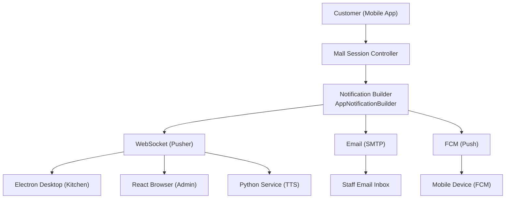
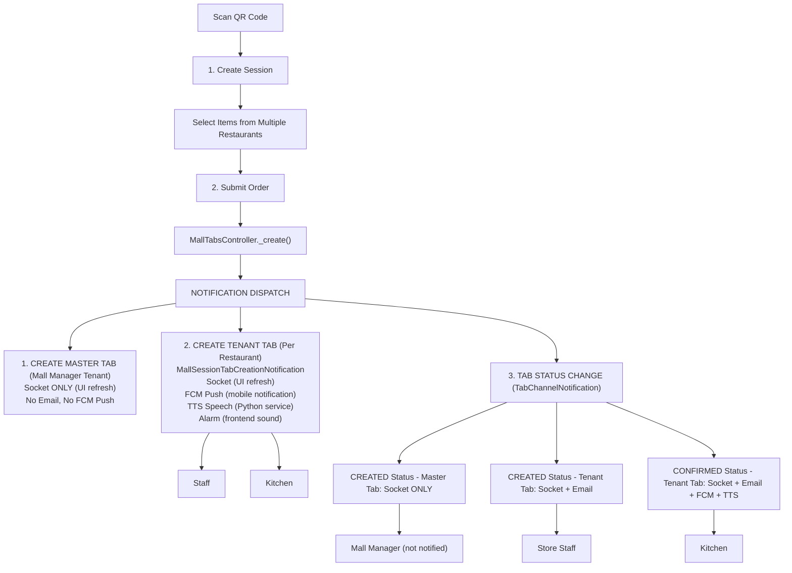
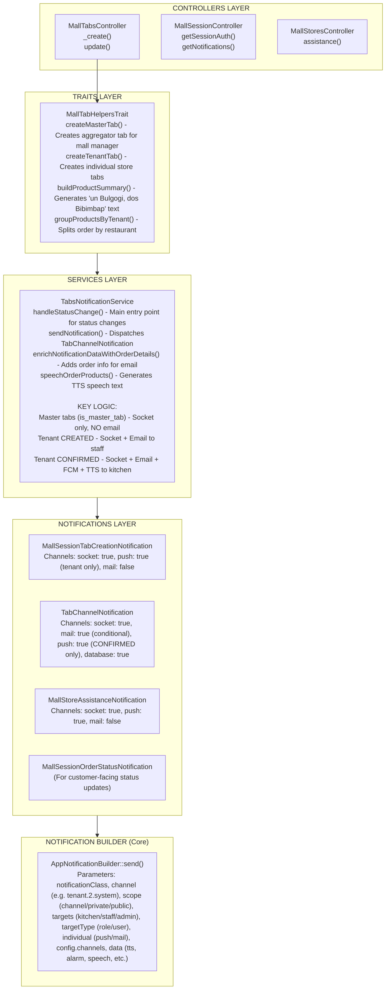
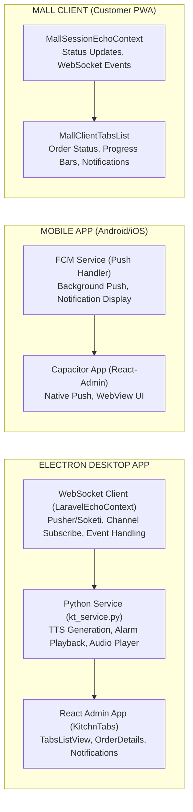
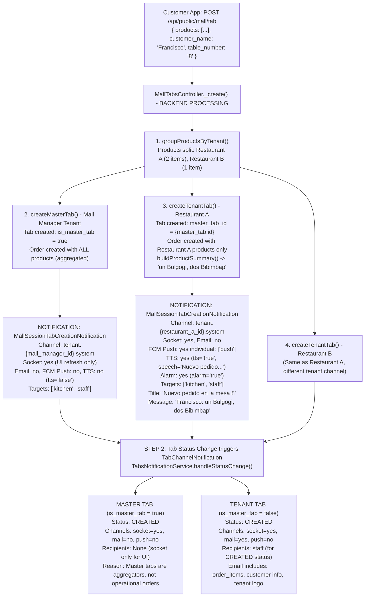
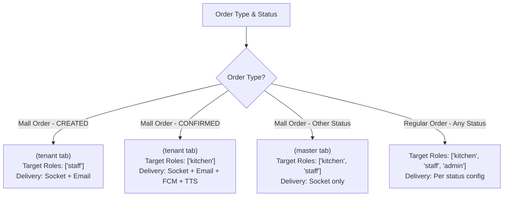

# Mall Session Notifications Flow - Technical Documentation

## Overview

This document provides comprehensive technical documentation for the notification system in the KitchnTabs Mall application. It covers all notification events, recipients, delivery channels, and the interconnected components that make the system work.

---

## Table of Contents

1. [System Architecture](#system-architecture)
2. [Notification Flow Diagram](#notification-flow-diagram)
3. [Notification Events Matrix](#notification-events-matrix)
4. [Component Architecture](#component-architecture)
5. [Detailed Event Flows](#detailed-event-flows)
6. [Delivery Channels](#delivery-channels)
7. [Role-Based Targeting](#role-based-targeting)
8. [Code Component Reference](#code-component-reference)

---

## System Architecture



---

## Notification Flow Diagram

### Mall Session Order Creation Flow



---

## Notification Events Matrix

### By Event Type

| Event | Notification Class | Socket | Email | FCM Push | TTS/Speech | Alarm |
|-------|-------------------|--------|-------|----------|------------|-------|
| **Mall Tab Created (Master)** | `MallSessionTabCreationNotification` | ✅ | ❌ | ❌ | ❌ | ❌ |
| **Mall Tab Created (Tenant)** | `MallSessionTabCreationNotification` | ✅ | ❌ | ✅ | ✅ | ✅ |
| **Tab Status: CREATED (Master)** | `TabChannelNotification` | ✅ | ❌ | ❌ | ❌ | ❌ |
| **Tab Status: CREATED (Tenant)** | `TabChannelNotification` | ✅ | ✅ | ❌ | ❌ | ❌ |
| **Tab Status: CONFIRMED (Tenant)** | `TabChannelNotification` | ✅ | ✅ | ✅ | ✅ | ✅ |
| **Tab Status: IN_PREPARATION** | `TabChannelNotification` | ✅ | ❌ | ❌ | ❌ | ❌ |
| **Tab Status: PREPARED** | `TabChannelNotification` | ✅ | ❌ | ❌ | ❌ | ❌ |
| **Tab Status: DELIVERED** | `TabChannelNotification` | ✅ | ❌ | ❌ | ❌ | ❌ |
| **Tab Status: CANCELLED** | `TabChannelNotification` | ✅ | ❌ | ❌ | ❌ | ❌ |
| **Store Assistance Request** | `MallStoreAssistanceNotification` | ✅ | ❌ | ✅ | ✅ | ✅ |

### By Recipient Role

| Role | CREATED (Master) | CREATED (Tenant) | CONFIRMED | Other Status |
|------|------------------|------------------|-----------|--------------|
| **Mall Manager** | Socket only | ❌ | ❌ | ❌ |
| **Staff** | ❌ | Socket + Email | ❌ | Socket only |
| **Kitchen** | ❌ | ❌ | Socket + Email + FCM + TTS | Socket only |
| **Admin** | Socket only | Socket + Email | Socket + Email + FCM | Socket only |

---

## Component Architecture

### Backend Components



### Frontend Components



---

## Detailed Event Flows

### Flow 1: Customer Creates Mall Order



### Flow 2: Staff Confirms Order

```mermaid
sequenceDiagram
    participant Staff as Staff Dashboard
    participant Tabs as TabsController.updateStatus()
    participant Service as TabsNotificationService.handleStatusChange()
    participant Kitchen as Kitchen Staff / Desktop App

    Staff->>Tabs: PUT /api/tabs/{id} { status: "CONFIRMED" }
    Tabs->>Service: handleStatusChange() - TENANT TAB Status CREATED -> CONFIRMED
    Service->>Service: 1. Update tab.status = 'CONFIRMED'
    Service->>Service: 2. Update tab.date_confirmed = now()
    Service->>Service: 3. Update associated order status
    Service->>Service: 4. If has master_tab_id, update master order products
    Service->>Kitchen: 5. NOTIFICATION TabChannelNotification<br/>Channel tenant.{tenant_id}.system<br/>Socket yes, Email yes (full order details with tenant logo)<br/>FCM Push yes individual ["push","mail"]<br/>TTS yes (tts='true', tts_delay=10), Alarm yes<br/>Targets ['kitchen'] (CONFIRMED -> kitchen only for mall orders)<br/>Title "[RESTAURANT] Orden Confirmada"<br/>Message Speech text with order items
    Kitchen->>Kitchen: 6. Recipients receive - Kitchen staff FCM push + Email + TTS speech; Desktop app WebSocket + Alarm sound + TTS
```

---

## Delivery Channels

### Channel Details

| Channel | Technology | Use Case | Backend Component |
|---------|------------|----------|-------------------|
| **Socket** | Pusher/Soketi WebSocket | Real-time UI updates | `AppNotification` event broadcast |
| **Email** | SMTP (Laravel Mail) | Order confirmations, receipts | `toMail()` method in notification |
| **FCM Push** | Firebase Cloud Messaging | Mobile app background notifications | `toFcm()` method via `individual: ["push"]` |
| **TTS/Speech** | Python `gTTS` service | Voice announcements in kitchen | WebSocket → Python → Audio playback |
| **Database** | MySQL `notifications` table | Notification history, user inbox | `toDatabase()` method |

### Channel Configuration in Code

```php
// Notification class static config
public static function config()
{
    return [
        "name"     => TabChannelNotification::class,
        "active"   => true,
        "channels" => [
            "socket"   => true,   // WebSocket broadcast
            "mail"     => true,   // Email delivery
            "database" => true,   // Store in notifications table
            "push"     => true,   // FCM push (requires individual: ["push"])
        ],
        "mailView" => "notifications.tab_order",
    ];
}

// Per-send override in AppNotificationBuilder
AppNotificationBuilder::send(
    config: [
        'channels' => [
            "socket"   => true,
            "mail"     => false,  // Disable email for this send
            "database" => false,
            "push"     => true,
        ],
    ],
    individual: ["push"],  // Enable per-user FCM delivery
);
```

---

## Role-Based Targeting

### Role Definitions

| Role | Description | Typical Users |
|------|-------------|---------------|
| **admin** | Full system access | Restaurant owner, manager |
| **staff** | Front-of-house staff | Waiters, cashiers |
| **kitchen** | Kitchen staff | Cooks, kitchen manager |

### Targeting Rules for Mall Orders

```php
// In TabsNotificationService::sendNotification()

$isMallOrder = !empty($tab->mall_id) || !empty($tab->master_tab_id);

if ($isMallOrder && isset($data['new'])) {
    if ($data['new'] === Tab::STATUS_CREATED) {
        $targets = ['staff'];  // Staff receives CREATED notifications
    } elseif ($data['new'] === Tab::STATUS_CONFIRMED) {
        $targets = ['kitchen'];  // Kitchen receives CONFIRMED notifications
    }
} else {
    $targets = ['kitchen', 'staff', 'admin'];  // Regular orders: all roles
}
```

### Targeting Flow Diagram



---

## Code Component Reference

### File Locations

| Component | Path |
|-----------|------|
| **MallTabsController** | `domain/app/Http/Controllers/API/Mall/MallTabs/MallTabsController.php` |
| **MallTabHelpersTrait** | `domain/app/Traits/Mall/MallTabHelpersTrait.php` |
| **TabsNotificationService** | `domain/app/Services/Tabs/TabsNotificationService.php` |
| **MallSessionTabCreationNotification** | `domain/app/Notifications/MallSessionTabCreationNotification.php` |
| **TabChannelNotification** | `domain/app/Notifications/Tab/TabChannelNotification.php` |
| **MallStoreAssistanceNotification** | `domain/app/Notifications/Mall/MallStoreAssistanceNotification.php` |
| **AppNotificationBuilder** | `app/AppNotifications/AppNotificationBuilder.php` |
| **Python TTS Service** | `dash-python-service/src/kt_service.py` |
| **Frontend Echo Context** | `packages/dash-admin/src/contexts/com/LaravelEchoContext.tsx` |

### Key Methods

#### MallTabHelpersTrait

```php
/**
 * Creates master tab (aggregator) for mall manager
 * - Socket only notification (no email, no FCM)
 * - TTS disabled
 */
private function createMasterTab(...): Tab

/**
 * Creates tenant tab for individual restaurant
 * - FCM push + TTS + Alarm enabled
 * - Includes product summary in message
 */
private function createTenantTab(...): Tab

/**
 * Generates "un Bulgogi, dos Bibimbap" text
 */
private function buildProductSummary(array $products): string
```

#### TabsNotificationService

```php
/**
 * Main entry point for status change notifications
 * - Validates transition
 * - Updates tab and order status
 * - Dispatches appropriate notification
 */
public function handleStatusChange(Tab $tab, string $newStatus, bool $silent = false): Tab

/**
 * Determines channels and targets based on:
 * - Tab type (master vs tenant)
 * - Status (CREATED, CONFIRMED, etc.)
 * - Marketplace type (Uber vs others)
 */
private function sendNotification(Tab $tab, array $data, ...): void
```

---

## Summary: Email Recipients by Scenario

### Single Mall Session Order (Customer orders from 1 restaurant)

| Email | Recipient | When | Content |
|-------|-----------|------|---------|
| ❌ | Mall Manager | - | No email (master tab) |
| ✅ | Store Staff | CREATED | Order received |
| ✅ | Store Kitchen | CONFIRMED | Order confirmed, ready to prepare |

### Multi-Restaurant Mall Session Order (Customer orders from 2 restaurants)

| Email | Recipient | When | Content |
|-------|-----------|------|---------|
| ❌ | Mall Manager | - | No email (master tab) |
| ✅ | Restaurant A Staff | CREATED | Restaurant A items |
| ✅ | Restaurant A Kitchen | CONFIRMED | Restaurant A items |
| ✅ | Restaurant B Staff | CREATED | Restaurant B items |
| ✅ | Restaurant B Kitchen | CONFIRMED | Restaurant B items |

---

## Troubleshooting

### Common Issues

1. **Mall manager receiving emails**: Check `is_master_tab` field on tab
2. **Missing FCM notifications**: Ensure `individual: ["push"]` is set
3. **TTS not playing**: Check `tts` flag is `'true'` (string, not boolean)
4. **Duplicate notifications**: Check for multiple notification sends in code path

### Debug Logging

```php
// Enable notifications channel logging
Log::channel('notifications')->info("...", $data);

// Check Laravel logs
tail -f storage/logs/laravel.log | grep -i notification
```

---

*Last Updated: December 2025*
*Version: 1.0*
