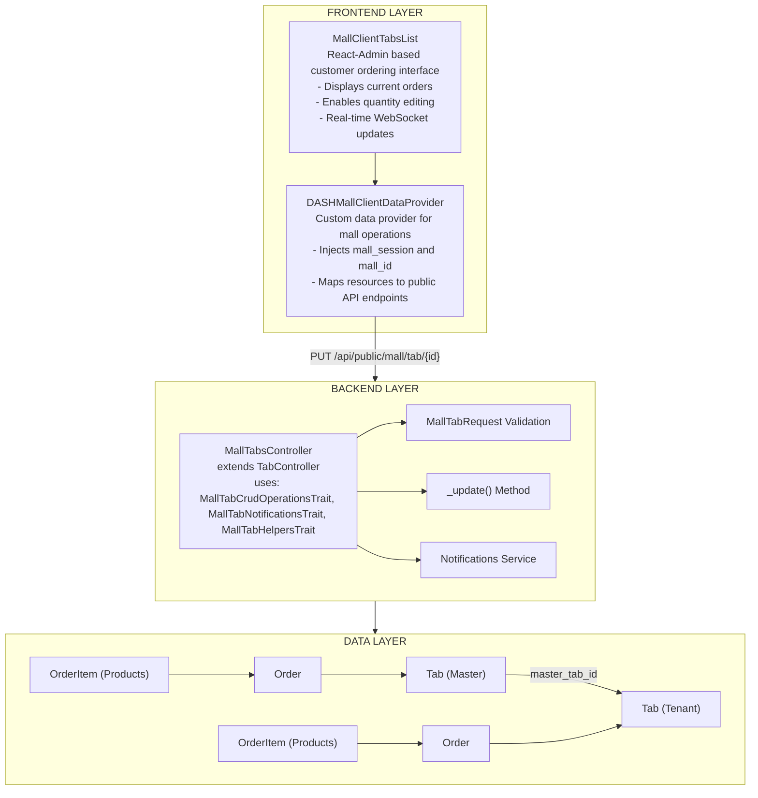
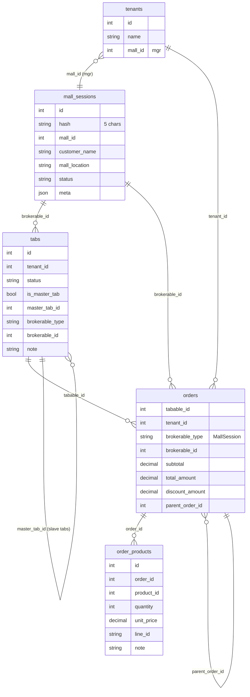
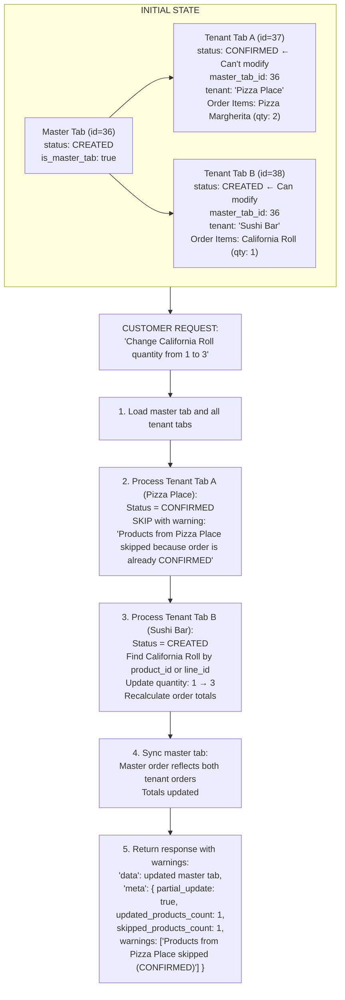
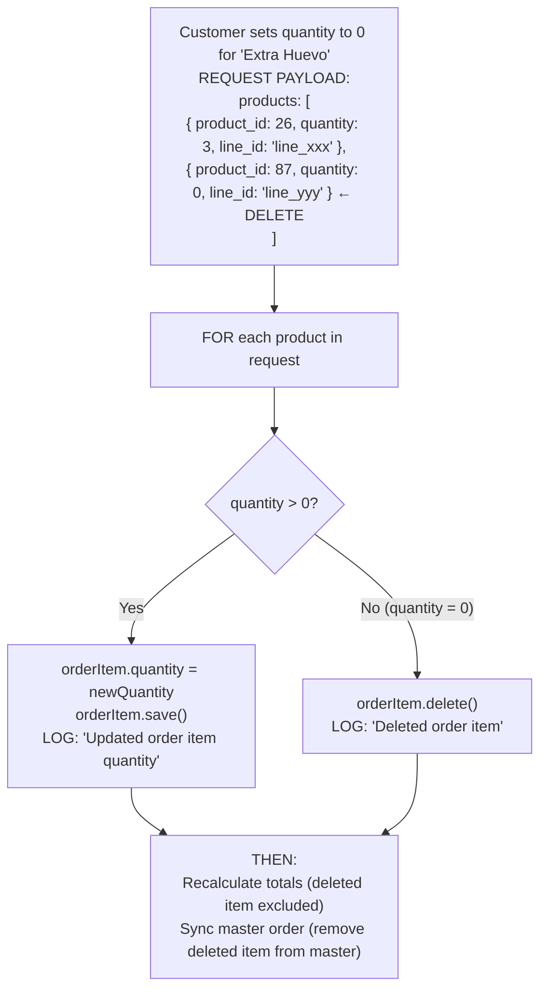
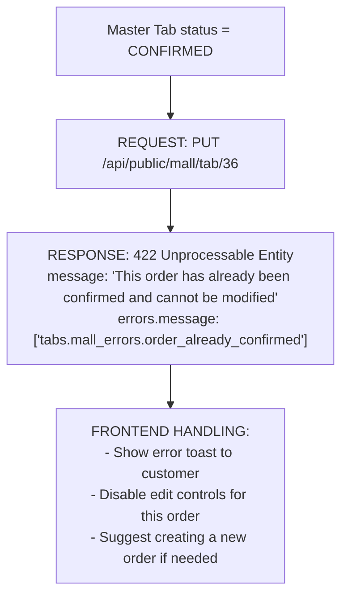
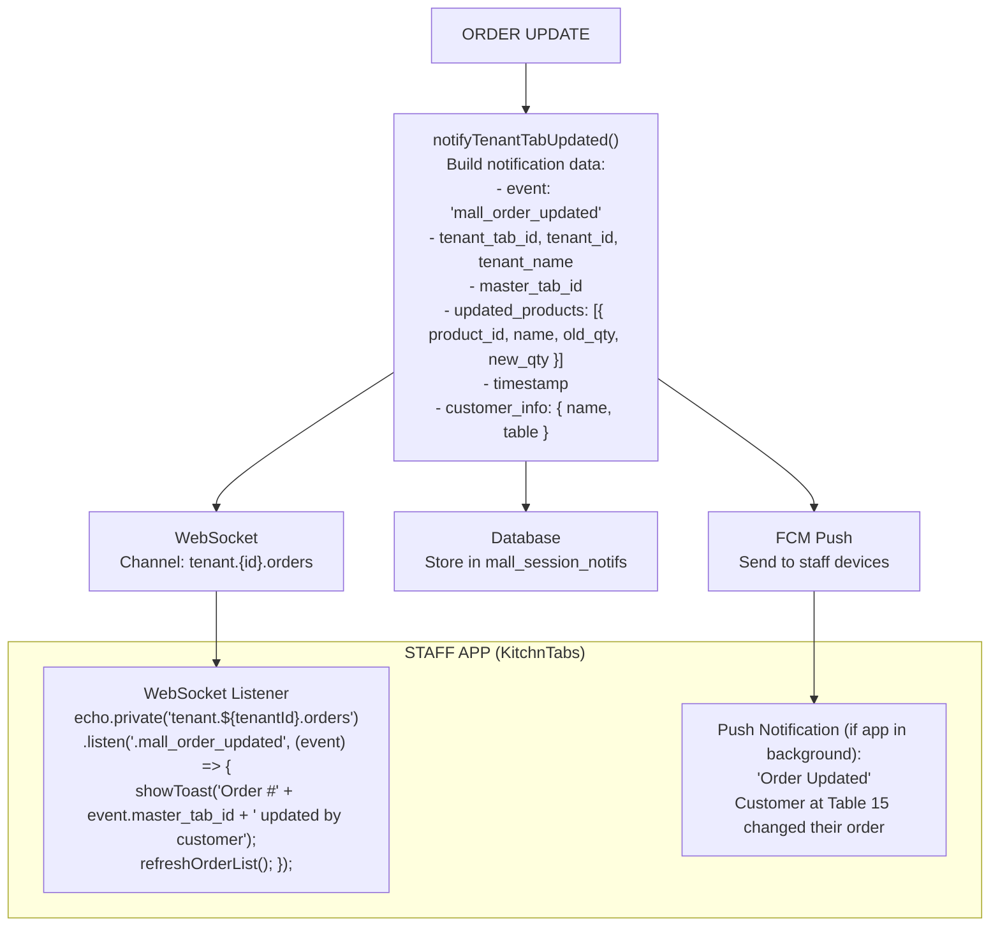
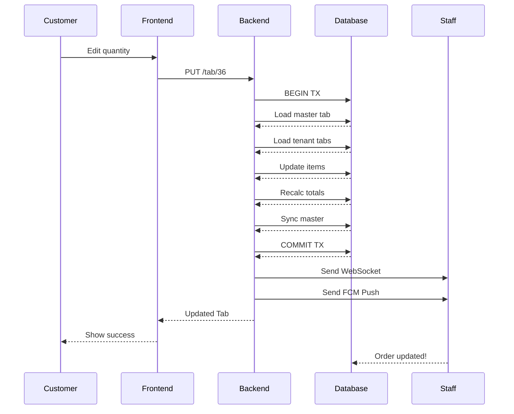

```mermaid
flowchart TD
    A["CUSTOMER: Edit Order, Change Qty 1 → 3"] -->|Click Save| B

    subgraph FE["FRONTEND"]
        B["DASHMallClientDataProvider.update()<br/>1. Get mall_session from localStorage ('KUULO')<br/>2. Get mall_id from systemValues<br/>3. Build products array with updated quantities<br/>4. Inject mall_session and mall_id into payload"]
    end

    B -->|"PUT /api/public/mall/tab/36<br/>{ products: [{product_id: 26, quantity: 3}], mall_session: 'KUULO', mall_id: 1 }"| C

    subgraph BE["BACKEND PROCESSING"]
        C["1. MallTabRequest Validation<br/>- isUpdateRequest() → true (has route id)<br/>- Apply UPDATE rules (all fields optional)<br/>- Validation passes"]
        D["2. _update() Method<br/>a. Load master tab (id=36) with relationships<br/>b. Verify is_master_tab = true<br/>c. Check master status = CREATED<br/>d. Load all tenant tabs (slave tabs)"]
        E["3. Build Products Lookup Map<br/>incomingProductsMap = {<br/>'line:line_1765249522339...': {product_id: 26, qty: 3},<br/>'product:26': {product_id: 26, qty: 3} }"]
        F["4. Process Each Tenant Tab<br/>FOR each tenantTab:<br/>IF status != CREATED → skip with warning<br/>ELSE: FOR each orderItem in tenantTab.order.items:<br/>Match by line_id OR product_id<br/>IF matched: IF new quantity = 0 → DELETE item ELSE → UPDATE quantity<br/>Update note if provided<br/>Recalculate tenant order totals:<br/>subtotal = SUM(item.qty * item.unit_price)<br/>total_amount = subtotal - discount_amount"]
        G["5. Sync Master Tab Order<br/>- Collect all items from all tenant orders<br/>- Update master order items to match<br/>- Recalculate master order totals"]
        H["6. Send Notifications (After DB Commit)<br/>FOR each updated tenantTab:<br/>→ WebSocket to staff: tenant.{id}.orders<br/>→ FCM push to staff devices"]
        C --> D --> E --> F --> G --> H
    end

    H -->|"Response: Updated MallTabResource"| I["Frontend receives updated data<br/>- Refreshes order list<br/>- Shows success toast"]
```

# Mall Session Order Update Flow - Technical Documentation

## Overview

The Mall Session Order Update Flow enables customers to modify their orders after initial creation, as long as the order hasn't been confirmed by the restaurant staff. This feature supports the multi-tenant food court ordering system where a single customer session can have orders from multiple restaurants (tenants).

### Key Concepts

| Concept | Description |
|---------|-------------|
| **Mall Session** | A temporary session created when a customer scans a QR code, identified by a 5-character hash (e.g., "KUULO") |
| **Master Tab** | The main order aggregating all items, owned by the mall's manager tenant |
| **Tenant Tab (Slave Tab)** | Individual orders per restaurant, linked to the master tab via `master_tab_id` |
| **Brokerable** | Polymorphic relationship linking orders to their source (MallSession) |

### Business Rules

1. **Only CREATED status orders can be updated** - Once a tenant confirms an order, it cannot be modified
2. **Partial updates are supported** - If some tenant tabs are confirmed, only the CREATED ones are updated
3. **Products are matched by line_id or product_id** - Enables precise item targeting
4. **Quantity 0 deletes the item** - Setting quantity to 0 removes the product from the order
5. **Totals are recalculated automatically** - Subtotal and total_amount are updated after changes
6. **Notifications are sent to staff** - Restaurant staff receive real-time updates about order changes

---

## Architecture

### Component Diagram



### Database Schema (Relevant Tables)



---

## Update Flow Scenarios

### Scenario 1: Simple Quantity Update (All Tabs CREATED)

**Preconditions:**
- Customer has an active mall session
- Master tab status: CREATED
- All tenant tabs status: CREATED

**Flow:**



---

### Scenario 2: Partial Update (Some Tabs Confirmed)

**Preconditions:**
- Customer has orders from multiple restaurants
- Restaurant A: Tab status = CONFIRMED (already being prepared)
- Restaurant B: Tab status = CREATED (can still be modified)

**Flow:**



---

### Scenario 3: Product Deletion (Quantity = 0)

**Flow:**



---

### Scenario 4: Update Blocked (Order Already Confirmed)

**Flow:**



---

## Component Interactions

### Frontend Components

#### DASHMallClientDataProvider

**File:** `dash-frontend/apps/kitchntabs-mall/src/dash-extensions/config/DASHMallClientDataProvider.tsx`

**Responsibilities:**
- Map resources to public API endpoints (`tab` → `public/mall/tab`)
- Inject `mall_session` and `mall_id` into all requests
- Handle error responses and display appropriate messages

**Key Code:**

```typescript
// Resource mapping
const RESOURCE_PATH_MAP: Record<string, string> = {
    'tab': 'public/mall/tab',
    'stores': 'public/mall/stores',
    'products': 'public/mall/products',
};

// Update method
update: async (resource: string, params: any) => {
    const apiResource = mapResourceToApiPath(resource);
    const mall_id = getMallId();
    const mall_session = getSessionId();

    // Inject mall context
    const enhancedData = {
        ...params.data,
        mall_id,
        mall_session,
    };

    return genericDataProvider.update(apiResource, { 
        ...params, 
        data: enhancedData 
    });
}
```

#### MallClientAppResources

**File:** `dash-frontend/packages/kt-mall/src/MallClientAppResources.tsx`

**Responsibilities:**
- Define resource configuration for mall client
- Handle form submission and validation
- Process errors and trigger customer data modal

**Key Configuration:**

```typescript
{
    model: "tab",
    mutationMode: "pessimistic",
    saveButtonAlwaysEnabled: true,
    
    beforeSubmit(values) {
        // Inject customer data from localStorage
        const orderData = dashStorage.getItem('orderData');
        const { name, tableNumber } = orderData 
            ? JSON.parse(orderData) 
            : { name: null, tableNumber: null };

        if (!name || !tableNumber) {
            throw new Error("MISSING_SESSION_DATA");
        }

        values.customer_name = name;
        values.table_number = tableNumber;
        return values;
    },

    onError(mode, error) {
        if (mode === "create" && error.message === "MISSING_SESSION_DATA") {
            window.dispatchEvent(new CustomEvent('enter-public-order-data'));
            return;
        }
        throw error;
    },
}
```

---

### Backend Components

#### MallTabRequest

**File:** `dash-backend/domain/app/Http/Request/Mall/MallTabRequest.php`

**Responsibilities:**
- Validate incoming requests
- Distinguish between CREATE and UPDATE operations
- Apply appropriate validation rules

**Key Code:**

```php
protected function isUpdateRequest(): bool
{
    return $this->route('id') !== null || $this->has('id');
}

public function rules(): array
{
    // For UPDATE requests, all fields are optional
    if ($this->isUpdateRequest()) {
        return [
            'mall_id' => 'sometimes|integer|exists:malls,id',
            'mall_session' => 'sometimes|string|size:5',
            'customer_name' => 'nullable|string|max:255',
            'table_number' => 'nullable|string|max:50',
            'products' => 'sometimes|array',
            'products.*.product_id' => 'sometimes|integer|exists:products,id',
            'products.*.quantity' => 'sometimes|integer|min:0', // 0 = delete
            // ...
        ];
    }

    // For CREATE requests, require essential fields
    return [
        'mall_id' => 'required|integer|exists:malls,id',
        'mall_session' => 'required|string|size:5',
        'customer_name' => 'required|string|max:255',
        'products' => 'required|array|min:1',
        // ...
    ];
}
```

#### MallTabCrudOperationsTrait

**File:** `dash-backend/domain/app/Traits/Mall/MallTabCrudOperationsTrait.php`

**Responsibilities:**
- Implement `_update()` method for mall orders
- Match products by line_id or product_id
- Update tenant tab orders and sync to master
- Recalculate order totals

**Key Methods:**

| Method | Description |
|--------|-------------|
| `_update($request, $id, $item)` | Main update entry point |
| `updateTenantTabProducts($tenantTab, $products)` | Update items in tenant order |
| `syncMasterTabOrderFromTenants($masterTab, $tenantTabs)` | Sync master order from all tenants |

#### MallTabNotificationsTrait

**File:** `dash-backend/domain/app/Traits/Mall/MallTabNotificationsTrait.php`

**Responsibilities:**
- Send notifications when orders are updated
- Notify restaurant staff via WebSocket and FCM
- Persist notifications for offline retrieval

**Key Methods:**

| Method | Description |
|--------|-------------|
| `notifyTenantTabUpdated($tenantTab, $masterTab, $updatedProducts)` | Notify staff of order update |
| `notifyMallSessionOnOrderUpdate($masterTab, $tenantTabs)` | Notify customer of update |

---

## Notification Flow



---

## Error Handling

### Error Types and Responses

| Error Code | Scenario | Response |
|------------|----------|----------|
| 422 | Order already confirmed | `tabs.mall_errors.order_already_confirmed` |
| 422 | Not a master tab | `tabs.mall_errors.not_master_tab` |
| 422 | Validation failed | Field-specific error messages |
| 404 | Tab not found | Standard 404 response |
| 500 | Database error | Generic error with logged details |

### Partial Update Warnings

When some products can't be updated (e.g., tenant already confirmed), the response includes warnings:

```json
{
    "data": { /* updated master tab */ },
    "meta": {
        "partial_update": true,
        "updated_products_count": 2,
        "skipped_products_count": 1,
        "warnings": [
            "Products from Pizza Place skipped because order is CONFIRMED"
        ],
        "message": "Some products could not be updated"
    }
}
```

---

## Sequence Diagrams

### Complete Update Sequence



---

## Testing Scenarios

### Unit Tests

| Test | Description |
|------|-------------|
| `test_update_quantity_success` | Verify quantity update when tab is CREATED |
| `test_update_blocked_when_confirmed` | Verify 422 when master tab is CONFIRMED |
| `test_partial_update_with_warnings` | Verify partial update when some tenants confirmed |
| `test_delete_product_with_zero_quantity` | Verify product deletion when qty=0 |
| `test_totals_recalculated_after_update` | Verify subtotal and total_amount updated |
| `test_master_synced_from_tenants` | Verify master order reflects tenant changes |

### Integration Tests

| Test | Description |
|------|-------------|
| `test_full_update_flow` | End-to-end update from frontend to database |
| `test_websocket_notification_sent` | Verify WebSocket event dispatched |
| `test_fcm_notification_sent` | Verify FCM push sent to staff |
| `test_concurrent_updates` | Verify handling of race conditions |

---

## Performance Considerations

1. **Database Transactions** - All updates wrapped in transaction to ensure consistency
2. **Eager Loading** - Tenant tabs loaded with orders and items in single query
3. **Batch Updates** - Multiple items updated in single pass per tenant
4. **Notification Queuing** - Notifications dispatched after commit to avoid blocking

---

## Security Considerations

1. **Session Validation** - Mall session hash validated on every request
2. **Status Check** - Only CREATED orders can be modified
3. **Tenant Isolation** - Users can only update their own session's orders
4. **Rate Limiting** - API rate limits prevent abuse

---

## Future Enhancements

1. **Optimistic Updates** - Show changes immediately, rollback on error
2. **Conflict Resolution** - Handle concurrent updates from multiple devices
3. **Undo Functionality** - Allow reverting recent changes
4. **Change History** - Track all modifications for audit trail
