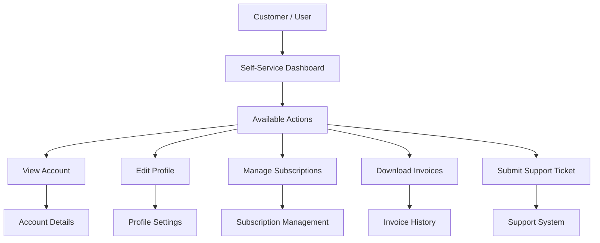
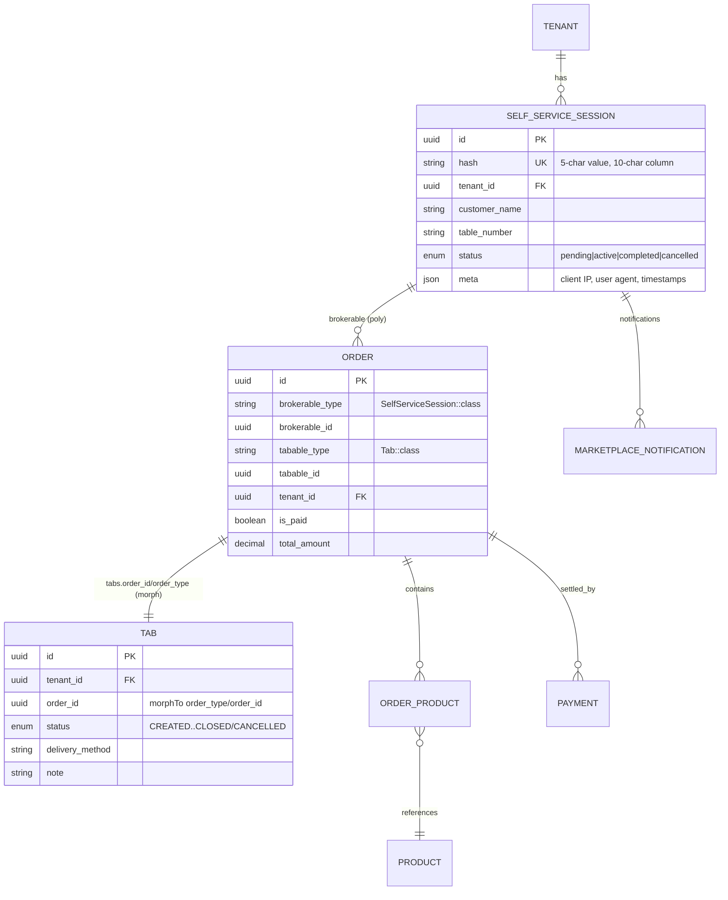
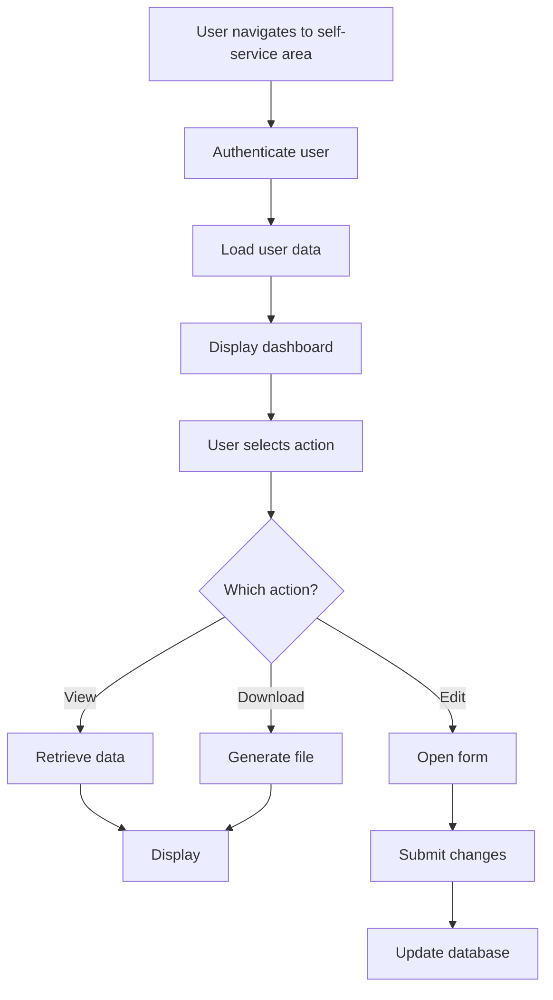
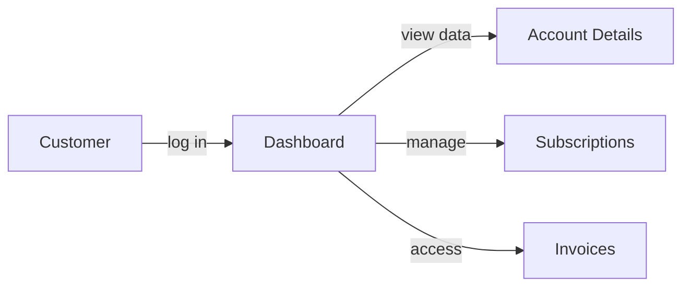
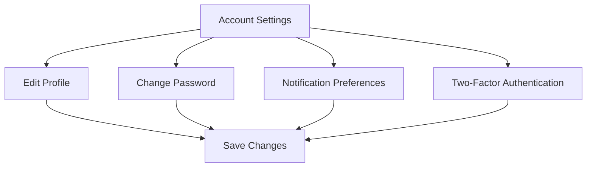
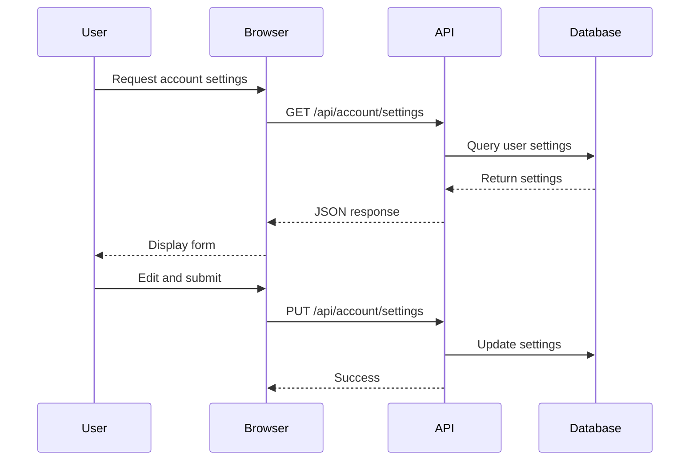
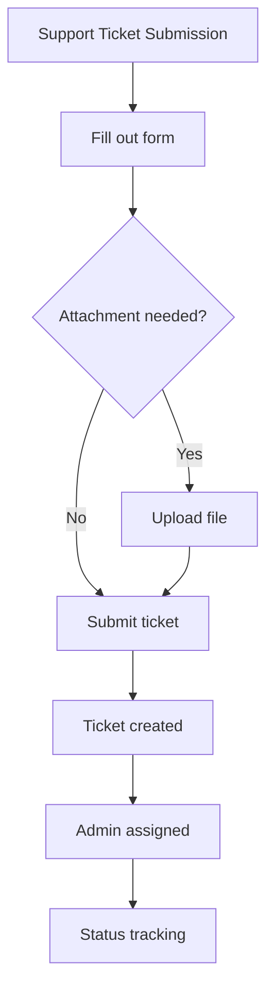
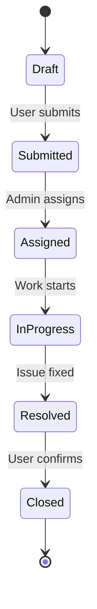

# KitchnTabs Self-Service Kiosk — Full Technical Documentation

> **Scope:** the complete self-service ("scan-to-order") feature: QR session lifecycle, guest
> authentication, the kiosk ordering UI, order creation, real-time notifications, self-confirmation,
> and the paid/locked rules. Online payment is covered in a companion doc:
> [CHECKOUT_GATEWAYS_FEATURE.md](./CHECKOUT_GATEWAYS_FEATURE.md).
>
> **Audience:** backend & frontend engineers.
> **Status:** implemented. **Last updated:** 2026-06-22.

---

## Table of Contents

1. [Overview](#1-overview)
2. [High-Level Architecture](#2-high-level-architecture)
3. [Domain Model & Database](#3-domain-model--database)
4. [Backend — Files & Responsibilities](#4-backend--files--responsibilities)
5. [Frontend — Files & Responsibilities](#5-frontend--files--responsibilities)
6. [Flow 1 — QR Session Creation & Activation](#6-flow-1--qr-session-creation--activation)
7. [Flow 2 — Browse, Cart & Order Creation](#7-flow-2--browse-cart--order-creation)
8. [Flow 3 — Order Actions (Confirm / Cancel / Pay)](#8-flow-3--order-actions-confirm--cancel--pay)
9. [Flow 4 — Real-Time Notifications (both directions)](#9-flow-4--real-time-notifications-both-directions)
10. [Tab Status State Machine](#10-tab-status-state-machine)
11. [Paid & Locked Rules](#11-paid--locked-rules)
12. [Tenant Settings & Feature Flags](#12-tenant-settings--feature-flags)
13. [API Reference](#13-api-reference)
14. [Security Considerations](#14-security-considerations)
15. [Known Gaps & Future Work](#15-known-gaps--future-work)

---

## 1. Overview

The self-service kiosk lets a tenant's **end customer** order from their own phone by scanning a
QR code at a table or counter — no app install, no login. A short **session hash** (5 chars) acts
as a temporary identity, scoped to a single tenant.

Two repositories are involved:

| Repo | Role |
|---|---|
| `kitchntabs-backend-domain` | Domain API under `/api/public/selfservice/*`, models, notifications, settings. Loaded into the core `dash-backend` Laravel app. |
| `kitchntabs-frontend` (`apps/kitchntabs-app`) | The kiosk SPA (guest) **and** the staff admin app (where QR codes are generated and orders are managed). Both are the same React-Admin app, switched by URL pattern. |

The self-service module deliberately **reuses** the generic Tab/Order machinery (the same models
and notification services the mall and marketplace flows use), specialising only where the
single-tenant, guest, QR-scoped flow differs.

---

## 2. High-Level Architecture

**Key idea:** the customer kiosk subscribes to the **public** channel `selfservice_session.{hash}`;
the staff/kitchen subscribe to the **tenant** channel `tenant.{id}.system`. The notification
services fan a single status/content change out to both audiences.

---

## 3. Domain Model & Database

**Relationship notes (these are load-bearing — several bugs in this feature traced to them):**

- `Order.brokerable` (`morphTo`) points to the **`SelfServiceSession`** — this is how ownership is
  scoped (`brokerable_type === SelfServiceSession::class && brokerable_id === session.id`).
- `Order.tabable` (`morphTo`) points to the **`Tab`** — set at creation in
  [`TabOrderManagementTrait`](../../kitchntabs-backend-domain/app/Services/Tabs/TabOrderManagementTrait.php)
  (`'tabable_type' => Tab::class`).
- `Tab.order()` is **also** a `morphTo`, backed by `tabs.order_id` + `tabs.order_type`. So
  `Tab::with('order')` loads the Order, and `$tab->order` is the Order. A Tab id and its Order id
  are **different UUIDs**.
- The kiosk lists **Tabs** (the `tab` resource), so any place the frontend sends an "order_id" it is
  actually sending the **Tab id**. Backend code that needs the Order must resolve
  `Tab::with('order')->find($tabId)->order`.

---

## 4. Backend — Files & Responsibilities

All paths are under `kitchntabs-backend-domain/`.

### Models
| File | Responsibility |
|---|---|
| `app/Models/SelfService/SelfServiceSession.php` | Session entity. `byHash()` scope, `notifications()` relation, `HasUuidV7`. |
| `app/Models/Tab/Tab.php` | Tab/order header. Status constants `STATUS_CREATED … STATUS_CLOSED/CANCELLED`; `order()` morphTo. |
| `app/Models/Order/Order.php` | Order. `brokerable()` + `tabable()` morphs, `is_paid`, `total_amount`. |
| `app/Models/Order/Payment.php` | Payment row. Fillable incl. `source_order_id`, `tenant_id`, `currency_id`, `transaction_amount`, `total_paid_amount`, `payment_type`, `data`. |

### Controllers (`app/Http/Controllers/API/SelfService/`)
| File | Methods |
|---|---|
| `SelfServiceSessionController.php` | `createClientSession({tenantSlug})`, `getSessionAuth({hash})` (validates + activates), `getNotifications`, `markNotificationsAsRead`, `completeSession`, `cancelSession`. |
| `SelfServiceTabsController.php` | React-Admin tab CRUD (`getOneByHash`, `_preList` filtered by session), `confirmTab({hash},{id})` (self-confirm), `downloadSaleNote`. Extends the generic `TabController`. |
| `SelfServiceProductController.php` / `SelfServiceCategoryController.php` | Public product / category listing for the session's tenant (1-hour cache). |
| `SelfServiceCheckoutController.php` | Online payment — see checkout doc. |

### Traits & Services
| File | Responsibility |
|---|---|
| `app/Http/Controllers/API/SelfService/Traits/SelfServiceAuthResponseTrait.php` | Builds `getSessionAuth` response (`tenant`, `auth`, `systemValues.selfservice.*` incl. feature flags). |
| `app/Services/Tabs/TabsNotificationService.php` | `handleStatusChange($tab, $newStatus, $force, $isUpdate)` — single fan-out point; updates status/dates, syncs order status, calls the self-service notifier, builds the tenant-channel message. |
| `app/Services/Tabs/SelfServiceTabNotificationService.php` | `notifySession($tab, $newStatus, $isUpdate=false)` — broadcasts `selfservice_session_order_status_update` to `selfservice_session.{hash}` (only fires for orders whose `brokerable_type === SelfServiceSession`). |
| `app/Services/Tabs/TabOrderManagementTrait.php` | Creates the Tab+Order pair (`tabable_type = Tab::class`). |

### Routes & Config
| File | Responsibility |
|---|---|
| `routes/api/selfservice.php` | The `public/selfservice` route group (sessions, tabs, products, categories, checkout) + authenticated admin session-management routes. |
| `config/tenant_settings.php` | Domain-layer tenant settings extension — `enable_self_service_user_confirm_order`, `enable_self_service_checkout_gateway`. |
| `app/Notifications/SelfService/SelfServiceSessionOrderStatusNotification.php` | The broadcast notification class for the public channel. |

---

## 5. Frontend — Files & Responsibilities

All paths under `kitchntabs-frontend/apps/kitchntabs-app/src/`.

### Bootstrap & routing
| File | Responsibility |
|---|---|
| `KitchnTabsWebBootstrap.tsx` | Detects the URL pattern. `^/selfservice/([A-Z0-9]{5,})` → renders `SelfServiceAppLoader`; pre-sets guest `authenticated=true`. |
| `core/SelfServiceAppLoader.tsx` | Lazy-loads self-service resources/routes/providers, wraps `KitchnTabsPrivateApp` with `SelfServiceClientWrapper`, injects `SelfServiceEchoProvider` + `DASHSelfServiceWSMessagesManager`. |
| `components/selfservice/SelfServiceClientWrapper.tsx` | Parses `/selfservice/:hash`, calls `getSessionAuth`, persists tenant data/theme/logo to Redux + `AuthPersistenceService`, renders the app or an error screen. Mounts `MallAppMediator`. |
| `SelfServiceRoutes.tsx` | `selfServicePublicRoutes` / `selfServicePrivateRoutes` (home + catch-all). |

### Providers & realtime
| File | Responsibility |
|---|---|
| `dash-extensions/config/DASHSelfServiceClientDataProvider.tsx` | Maps `tab` → `public/selfservice/{hash}/tab`; injects `selfservice_session` into every request; disables delete. |
| `dash-extensions/config/DASHSelfServiceClientAuthProvider.tsx` | Guest identity (`checkAuth` always resolves; permissions `['guest','public']`). |
| `kt-selfservice/contexts/SelfServiceEchoContext.tsx` | Subscribes to `selfservice_session.{hash}`, exposes `lastEvent`. |
| `kt-selfservice/contexts/SelfServiceAppHookComponent.tsx` | Headless, mounted **inside** the app providers (so `useDialog`/`useQueryClient` work). Handles `selfservice_session_order_status_update` (toast + `refreshOrders()`), and the checkout return (see checkout doc). |

### QR generation (staff)
| File | Responsibility |
|---|---|
| `kt-selfservice/resources/selfServiceResource.tsx` | Resource that renders the QR generator page (`/selfservice/qr`). |
| `kt-selfservice/components/SelfServiceQRGenerator.tsx` | Auto-creates a session via `POST /public/selfservice/client_session/{slug}`, renders the QR (`/selfservice/{hash}`), auto-refreshes when the **current** session is claimed (listens to the tenant channel). |

### Kiosk ordering (`kt-kiosk/`)
| File | Responsibility |
|---|---|
| `SelfServiceClientAppResources.tsx` | The `tab` resource config for the kiosk: paths (`public/selfservice/{hash}/products` etc.), `MallTabsContextV2` context, `SelfServiceTabSchemaV2`, `SelfServiceMallListWrapper` data grid. |
| `schemas/SelfServiceTabSchemaV2.tsx` | Field schema. Create uses `MallOrderProductsFieldV2`; edit/show use `MallOrderProducts`; `SelfServiceOrderActions`, timeline, voucher. |
| `contexts/MallOrderCreateContext.tsx` | Cart state. `addToCart` (smart merge via `modifiersAreEqual`), `removeFromCart`, `updateQuantity`, `updateCartItem`. |
| `components/MallCartItemsList.tsx` | Cart list with per-line **delete** + quantity + expand-to-edit. |
| `components/MallOrderSummaryDrawer.tsx` | Cart drawer with the **"Crear Pedido"** button. |
| `components/MallOrderProducts.tsx` | Order products in edit/show. Read-only once `is_paid` or past `CREATED` (renders `LocalOrderProductsView`). |
| `components/SelfServiceOrderActions.tsx` | Order-card actions: **Pay** (any active step), **Confirm** (self-confirm, `CREATED`), **Cancel** (`CREATED`); paid badge; checkout return wiring. |
| `components/MallClientTabsList.tsx` | Order list cards + quick actions (pay/confirm) + WebSocket-driven refresh. |
| `components/MallAppMediator.tsx` | Global modal for customer name / table number (event-driven via `enter-public-order-data`). |
| `components/MallTabsContextV2.tsx` | Wires the child providers (tabs context, order-create context). |

---

## 6. Flow 1 — QR Session Creation & Activation

When the **current** session is claimed, `SelfServiceQRGenerator` hears the activation event on
the tenant channel and **regenerates** a fresh QR, so the next customer gets a new session.

---

## 7. Flow 2 — Browse, Cart & Order Creation

### Cart semantics (`MallOrderCreateContext.addToCart`)

`modifiersAreEqual(a, b)` deep-compares the `Record<groupId, optionId[]>` maps (sorted keys and
sorted values). Cart lines also support **delete** (`removeFromCart(uniqueId)`).

### Order creation

---

## 8. Flow 3 — Order Actions (Confirm / Cancel / Pay)

Rendered by `SelfServiceOrderActions` (card) and `MallClientTabsList` (list):

| Action | Visible when | Endpoint |
|---|---|---|
| **Pagar en línea / Pagar** | `checkout enabled & available` **and** not paid **and** not `CLOSED`/`CANCELLED` (any active step) | `POST /public/selfservice/{hash}/checkout/session` |
| **Confirmar Pedido** | `user_confirm_order_enabled` **and** `status === CREATED` **and** not paid | `POST /public/selfservice/{hash}/tab/{id}/confirm` |
| **Cancelar Pedido** | `status === CREATED` **and** not paid | `DELETE /public/selfservice/{hash}/tab/{id}` |

`confirmTab` (backend) re-checks the flag + session ownership + `status === CREATED`, then
`handleStatusChange($tab, CONFIRMED, true)`. The self-confirm uses the **exact same** notification
pipeline as a staff confirmation, so the kitchen sees an identical event.

---

## 9. Flow 4 — Real-Time Notifications (both directions)

This is the heart of the feature and the source of several subtle bugs. The single fan-out point
is `TabsNotificationService::handleStatusChange`.

**The critical fix (2026-06-22):** before, `notifySession` was only reached on a *status change*,
so when staff edited items/notes/amount **without** changing status, the kiosk got nothing. The
`elseif ($forceNotification)` branch in `handleStatusChange` now fires `notifySession(..., isUpdate:
true)` for content edits, and the kiosk's `SelfServiceAppHookComponent` always calls
`refreshOrders()` on the event. `notifySession` is a safe no-op for non-self-service tabs.

---

## 10. Tab Status State Machine

---

## 11. Paid & Locked Rules

The order **contents** (products / quantities / modifiers / notes / amount) freeze once paid; the
**status** can still advance so the kitchen can progress and close. Enforced on three surfaces:

- **Backend** ([`TabController::_update`](../../kitchntabs-backend-domain/app/Http/Controllers/API/Tabs/TabController.php)):
  captures `$wasPaid` and skips `handleOrderUpdate`/discount/`service_fee`/`note` when true. A
  status-only save still posts the products array; it is simply ignored.
- **Customer kiosk** (`MallOrderProducts.tsx`): renders the read-only view when
  `order.is_paid || status !== 'CREATED'`.
- **Staff app** (`tab2/OrderProductsField.tsx`, `Tab/TabOrderProductsSelectorGuarded.tsx`): visual
  lock banner + non-interactive editors when `record.order.is_paid`.

> Note: a paid order auto-moves to `CONFIRMED` at settlement (see checkout doc), so a paid order is
> always at least `CONFIRMED`.

---

## 12. Tenant Settings & Feature Flags

Defined in `kitchntabs-backend-domain/config/tenant_settings.php` (the domain-layer extension point
merged into `config('tenants.setting_formats')`), surfaced to the guest in
`getSessionAuth → systemValues.selfservice`:

| Flag | Effect |
|---|---|
| `enable_self_service_user_confirm_order` | Shows the **Confirmar Pedido** button (customer self-confirm). |
| `enable_self_service_checkout_gateway` | Enables online payment; combined with a resolved default gateway it shows **Pagar**. |

Frontend reads these via `AuthPersistenceService.getSystemValues()?.selfservice` —
`user_confirm_order_enabled`, `checkout_gateway_enabled`, `checkout_gateway_available`,
`session_hash`.

---

## 13. API Reference

`{hash}` is the `SelfServiceSession` hash. Group prefix: `/api/public/selfservice`.

| Method | Path | Description |
|---|---|---|
| POST | `/client_session/{tenantSlug}` | Staff: create a pending session, returns `{ hash }`. |
| GET | `/{hash}/getSessionAuth` | Validate + activate; returns tenant data, theme, `systemValues.selfservice.*`. `403` mismatch · `404` not found · `410` expired. |
| GET / POST | `/{hash}/tab` … | React-Admin tab list/create (`DASHSelfServiceClientDataProvider`). |
| GET | `/{hash}/tab/{id}` | Single tab (`getOneByHash`). |
| POST | `/{hash}/tab/{id}/confirm` | Customer self-confirm (`confirmTab`). |
| DELETE | `/{hash}/tab/{id}` | Cancel an order (unpaid, `CREATED`). |
| GET | `/{hash}/products` · `/{hash}/categories` | Public catalog for the session's tenant. |
| GET | `/{hash}/notifications` · POST `/{hash}/notifications/read` | Session notification feed. |
| POST | `/{hash}/checkout/session` | Start online payment (see checkout doc). |
| GET | `/{hash}/checkout/transaction/{id}` | Read a checkout transaction outcome (see checkout doc). |

---

## 14. Security Considerations

| Measure | Implementation |
|---|---|
| Guest scope | Session bound to one tenant; data provider injects `selfservice_session` into every request. |
| Identity binding | First activation stores client IP + user agent in `meta`; subsequent requests validate. |
| Expiry | Sessions valid ~10h from activation (`410 Gone` after). |
| Ownership checks | Tab actions verify `Order.brokerable_type === SelfServiceSession && brokerable_id === session.id` (e.g. `confirmTab`, checkout session). |
| No delete | The client data provider disables delete; cancellation is a guarded status action. |
| Public channel | Only order-status/update payloads broadcast to `selfservice_session.{hash}`; no cross-session data. |

---

## 15. Known Gaps & Future Work

- **Staff note input** stays visually editable on a paid order (it is a plain field); the backend
  ignores note changes when paid, so it cannot actually change. A custom read-only note field would
  close the UX gap.
- **Focus/visibility "catch-up" poll** — the kiosk relies on the WebSocket event for live updates;
  a focus-based refetch would harden against missed events.
- **i18n keys** for several new strings currently use inline `_` fallbacks
  (`selfservice.order_updated`, `tab.order_paid_locked`, …) and should be added to `i18n/es|en`.

---

## Related Documentation

- [CHECKOUT_GATEWAYS_FEATURE.md](./CHECKOUT_GATEWAYS_FEATURE.md) — online payment, DashTest provider, settlement.
- [KITCHNTABS_MALL_APPLICATION_FLOW.md](./KITCHNTABS_MALL_APPLICATION_FLOW.md) — the sibling mall (multi-tenant) flow.
- [SELFSERVICE_TECHNICAL_DOC.md](./SELFSERVICE_TECHNICAL_DOC.md) — earlier reference (schema/security tables).
