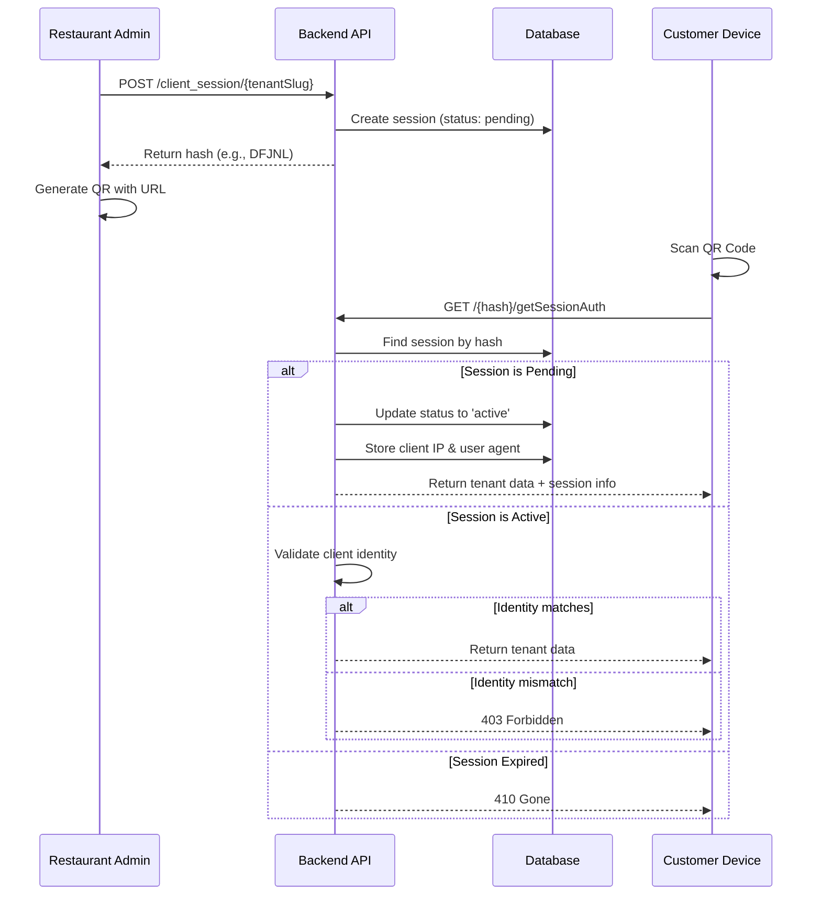
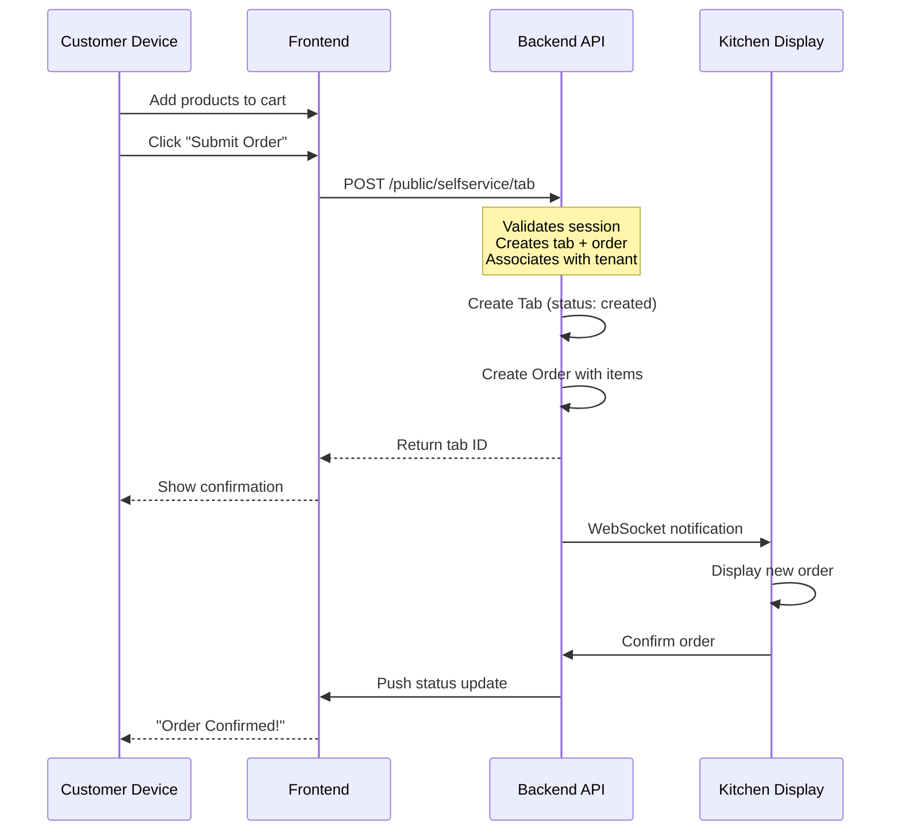
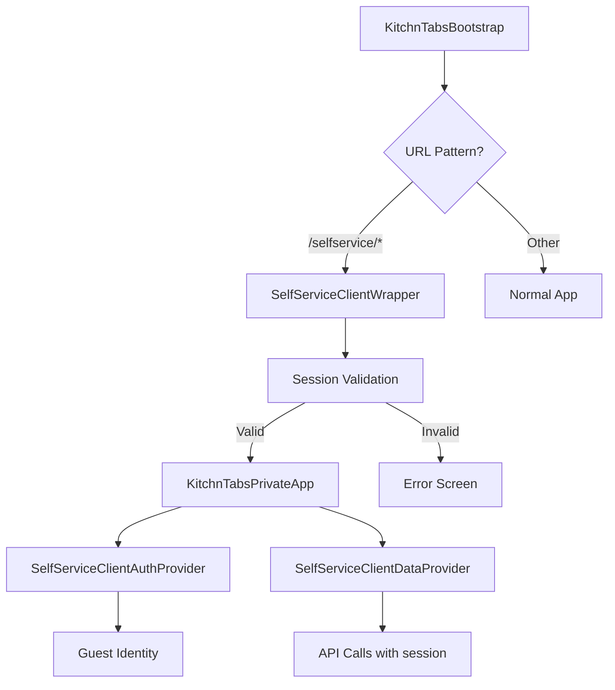
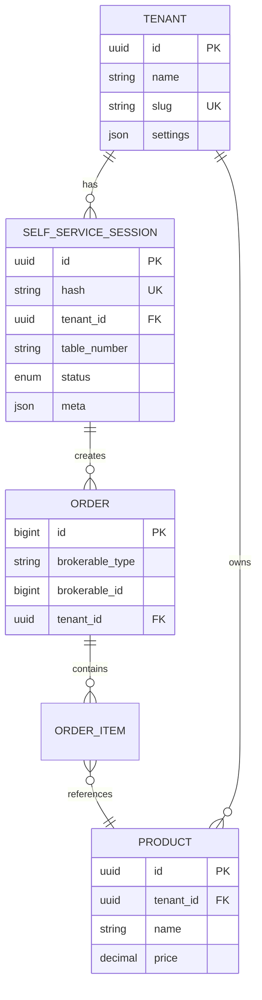

# Self-Service Kiosk - Technical Documentation

> Complete technical documentation for the Self-Service Kiosk feature, including architecture, flows, and component details.

---

## Table of Contents

1. [Architecture Overview](#architecture-overview)
2. [System Flow](#system-flow)
3. [Backend Components](#backend-components)
4. [Frontend Components](#frontend-components)
5. [API Reference](#api-reference)
6. [Database Schema](#database-schema)
7. [Security Considerations](#security-considerations)

---

## Architecture Overview

### High-Level Architecture

```mermaid
flowchart TB
    subgraph Client["Customer Device"]
        QR[QR Scanner]
        Browser[Mobile Browser]
    end
    
    subgraph Frontend["Frontend Application"]
        Wrapper[SelfServiceClientWrapper]
        AuthProvider[SelfServiceClientAuthProvider]
        DataProvider[SelfServiceClientDataProvider]
        Bootstrap[KitchnTabsBootstrap]
    end
    
    subgraph Backend["Backend API"]
        SessionController[SelfServiceSessionController]
        TabsController[SelfServiceTabsController]
        Routes[selfservice.php Routes]
    end
    
    subgraph Database["Database"]
        Sessions[(self_service_sessions)]
        Tabs[(tabs)]
        Orders[(orders)]
        Products[(products)]
    end
    
    QR --> Browser
    Browser --> Bootstrap
    Bootstrap --> Wrapper
    Wrapper --> AuthProvider
    Wrapper --> DataProvider
    DataProvider --> Routes
    Routes --> SessionController
    Routes --> TabsController
    SessionController --> Sessions
    TabsController --> Tabs
    TabsController --> Orders
end
```

### Key Design Decisions

| Decision | Rationale |
|----------|-----------|
| **Guest Authentication** | Customers don't need accounts; sessions act as temporary identities |
| **Session-Based Access** | 5-character hash provides security without login complexity |
| **10-Hour Expiration** | Balances convenience with security |
| **Tenant-Scoped** | Each session is bound to a single tenant's products |
| **No Master/Slave Tabs** | Simplified from mall architecture (single tenant = simple tabs) |

---

## System Flow

### Session Creation & Activation Flow



### Order Submission Flow



---

## Backend Components

### Models

#### SelfServiceSession

| Field | Type | Description |
|-------|------|-------------|
| `id` | uuid | Primary key (UUIDv7, via `HasUuidV7` trait) |
| `hash` | string(10) | Unique session identifier (5-char value, 10-char column) |
| `tenant_id` | uuid | Foreign key to tenants |
| `customer_name` | string | Optional customer name |
| `table_number` | string | Table/location identifier |
| `status` | enum | pending, active, completed, cancelled |
| `meta` | json | Client IP, user agent, timestamps |
| `created_at` | timestamp | Creation time |
| `updated_at` | timestamp | Last update |
| `deleted_at` | timestamp | Soft delete |

**File:** [SelfServiceSession.php](kitchntabs-backend-domain/app/Models/SelfService/SelfServiceSession.php)

### Controllers

#### SelfServiceSessionController

Handles session lifecycle management.

| Method | Endpoint | Description |
|--------|----------|-------------|
| `createSession` | POST /session/create | Create new session |
| `getSession` | GET /session/{hash} | Get session details |
| `updateSession` | PUT /session/{hash} | Update session |
| `completeSession` | POST /session/{hash}/complete | Mark as completed |
| `cancelSession` | POST /session/{hash}/cancel | Cancel session |
| `getSessionAuth` | GET /{hash}/getSessionAuth | Validate & authenticate session |
| `createClientSession` | POST /client_session/{tenantSlug} | Create session by tenant slug |

**File:** [SelfServiceSessionController.php](kitchntabs-backend-domain/app/Http/Controllers/API/SelfService/SelfServiceSessionController.php)

#### SelfServiceTabsController

Handles tab/order operations, extends base TabController.

| Method | Description |
|--------|-------------|
| `_preList` | Filter tabs by selfservice_session |
| `_preGetOne` | Load order items with products |
| `downloadSaleNote` | Generate PDF receipt |

**File:** [SelfServiceTabsController.php](kitchntabs-backend-domain/app/Http/Controllers/API/SelfService/SelfServiceTabsController.php)

### Routes

**File:** [selfservice.php](kitchntabs-backend-domain/routes/api/selfservice.php)

```php
// Public routes (no auth required)
Route::prefix('public/selfservice')->group(function () {
    // Session management
    Route::post('/session/create', 'createSession');
    Route::get('/session/{hash}', 'getSession');
    Route::put('/session/{hash}', 'updateSession');
    Route::post('/session/{hash}/complete', 'completeSession');
    Route::post('/session/{hash}/cancel', 'cancelSession');
    
    // Session auth (validates and activates)
    Route::get('/{sessionId}/getSessionAuth', 'getSessionAuth');
    
    // Client session creation by slug
    Route::post('/client_session/{tenantSlug}', 'createClientSession');
    
    // Tab CRUD (React Admin methods)
    Route::resource('tab', SelfServiceTabsController::class);
});
```

### Traits

#### SelfServiceAuthResponseTrait

Builds the authentication response with tenant data.

**File:** [SelfServiceAuthResponseTrait.php](kitchntabs-backend-domain/app/Http/Controllers/API/SelfService/Traits/SelfServiceAuthResponseTrait.php)

---

## Frontend Components

### Component Hierarchy



### SelfServiceClientWrapper

**Purpose:** Validates session before rendering the app.

**File:** [SelfServiceClientWrapper.tsx](kitchntabs-frontend/apps/kitchntabs-app/src/components/selfservice/SelfServiceClientWrapper.tsx)

**Key Functions:**
- Parses URL for tenant slug and session hash
- Calls `/getSessionAuth` to validate session
- Stores session data in localStorage
- Sets guest as "authenticated" for React Admin
- Renders error states for invalid sessions

### SelfServiceClientAuthProvider

**Purpose:** Provides guest authentication for React Admin.

**File:** [DASHSelfServiceClientAuthProvider.tsx](kitchntabs-frontend/apps/kitchntabs-app/src/dash-extensions/config/DASHSelfServiceClientAuthProvider.tsx)

**Key Functions:**
- `getIdentity()`: Returns guest identity
- `checkAuth()`: Always resolves (guest is "authenticated")
- `getPermissions()`: Returns `['guest', 'public']`

### SelfServiceClientDataProvider

**Purpose:** Maps resources to self-service API endpoints.

**File:** [DASHSelfServiceClientDataProvider.tsx](kitchntabs-frontend/apps/kitchntabs-app/src/dash-extensions/config/DASHSelfServiceClientDataProvider.tsx)

**Resource Mapping:**
```typescript
{
  'tab': 'public/selfservice/tab'
}
```

**Key Functions:**
- Injects `selfservice_session` into all requests
- Maps resource names to API paths
- Disables delete operations

### KitchnTabsWebBootstrap / SelfServiceRoutes

**Files:**
- [KitchnTabsWebBootstrap.tsx](kitchntabs-frontend/apps/kitchntabs-app/src/KitchnTabsWebBootstrap.tsx)
- [SelfServiceRoutes.tsx](kitchntabs-frontend/apps/kitchntabs-app/src/SelfServiceRoutes.tsx)

**Changes:**
- Detects `/selfservice/:tenantSlug/s/:sessionId` URL pattern
- Renders `SelfServiceClientWrapper` for self-service URLs
- Passes self-service providers to private app

---

## API Reference

### Session Endpoints

#### Create Client Session

```http
POST /api/public/selfservice/client_session/{tenantSlug}
Content-Type: application/json

{
  "table_number": "12",
  "meta": {}
}
```

**Response (201):**
```json
{
  "data": {
    "hash": "DFJNL",
    "tenant_id": "uuid",
    "status": "pending",
    "table_number": "12"
  }
}
```

#### Get Session Auth

```http
GET /api/public/selfservice/{hash}/getSessionAuth
```

**Response (200):**
```json
{
  "tenant": {
    "id": "uuid",
    "name": "Restaurant Name",
    "slug": "restaurant-slug"
  },
  "auth": {
    "tenantSettings": {},
    "tenantImages": {}
  },
  "systemValues": {
    "point_of_sales": [],
    "selfservice": {
      "tenant_id": "uuid",
      "session_hash": "DFJNL",
      "table_number": "12"
    }
  },
  "redirectTo": "/public/selfservice/tab/create"
}
```

**Error Responses:**

| Code | Reason |
|------|--------|
| 403 | Client identity mismatch |
| 404 | Session not found |
| 410 | Session expired |

### Tab Endpoints

#### Create Tab (Order)

```http
POST /api/public/selfservice/tab
Content-Type: application/json

{
  "selfservice_session": "DFJNL",
  "order": {
    "items": [
      {
        "product_id": "uuid",
        "quantity": 2,
        "modifiers": []
      }
    ]
  }
}
```

#### List Tabs

```http
GET /api/public/selfservice/tab?selfservice_session=DFJNL
```

---

## Database Schema

### self_service_sessions Table

> PostgreSQL schema. The `id` is created as a bigint by
> `2025_01_15_000001_create_self_service_sessions_table` and then converted to a
> UUIDv7 primary key by `2026_01_09_204300_convert_self_service_sessions_to_uuid`.
> All three migrations live in `kitchntabs-backend-domain/database/migrations/`.

```sql
CREATE TABLE self_service_sessions (
    id UUID PRIMARY KEY,                       -- UUIDv7, set by the model's HasUuidV7 trait
    hash VARCHAR(10) UNIQUE NOT NULL,
    tenant_id UUID NOT NULL,
    customer_name VARCHAR(255) NULL,
    table_number VARCHAR(50) NULL,
    status VARCHAR(255) NOT NULL DEFAULT 'pending',  -- CHECK in ('pending','active','completed','cancelled')
    meta JSONB NULL,
    created_at TIMESTAMP NULL,
    updated_at TIMESTAMP NULL,
    deleted_at TIMESTAMP NULL,

    FOREIGN KEY (tenant_id) REFERENCES tenants(id) ON DELETE CASCADE
);

CREATE INDEX self_service_sessions_tenant_id_status_index ON self_service_sessions (tenant_id, status);
CREATE INDEX self_service_sessions_hash_index ON self_service_sessions (hash);
```

### Entity Relationship



---

## Security Considerations

### Session Security

| Measure | Implementation |
|---------|----------------|
| **Unique Hash** | 5-character alphanumeric, collision-free |
| **IP Binding** | Session locked to first activating IP |
| **User Agent Check** | Secondary validation via browser fingerprint |
| **10-Hour Expiration** | Prevents indefinite session abuse |
| **Soft Delete** | Sessions never truly deleted for audit |

### API Security

| Measure | Implementation |
|---------|----------------|
| **Public Routes** | No auth token required for kiosk access |
| **Session Validation** | Every request validates session ownership |
| **Delete Disabled** | Frontend prevents delete operations |
| **Tenant Isolation** | Sessions scoped to single tenant |

### Client-Side Security

| Measure | Implementation |
|---------|----------------|
| **localStorage** | Session hash stored locally |
| **No Sensitive Data** | Only session hash, no passwords |
| **HTTPS Required** | All API calls over TLS |

---

## Comparison: Mall vs Self-Service

| Aspect | Mall | Self-Service |
|--------|------|--------------|
| **Broker** | Mall (multi-tenant) | Tenant (single) |
| **Products** | From mall.tenants | From tenant directly |
| **URL Pattern** | `/mall/:slug/s/:hash` | `/selfservice/:slug/s/:hash` |
| **Tab Structure** | Master + Tenant tabs | Simple tabs |
| **API Prefix** | `/public/mall/` | `/public/selfservice/` |
| **Session Model** | MallSession | SelfServiceSession |

---

## Related Documentation

- [User Guide](./SELFSERVICE_USER_GUIDE.md)
- [Mall Application Flow](./KITCHNTABS_MALL_APPLICATION_FLOW.md)
- [Mall Auth Flow](./KITCHNTABS_MALL_AUTH_FLOW.md)
