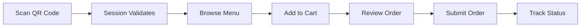

# Self-Service Kiosk - User Guide

> A comprehensive guide for restaurant staff and managers on how to set up and use the Self-Service Kiosk feature.

---

## Table of Contents

1. [Overview](#overview)
2. [Initial Setup](#initial-setup)
3. [Generating QR Codes](#generating-qr-codes)
4. [Customer Experience](#customer-experience)
5. [Managing Orders](#managing-orders)
6. [App Features](#app-features)
7. [Troubleshooting](#troubleshooting)

---

## Overview

The Self-Service Kiosk allows restaurant customers to place orders directly from their smartphones by scanning a QR code. This reduces wait times, minimizes order errors, and streamlines the ordering process.

### Key Benefits

| Benefit | Description |
|---------|-------------|
| **Faster Service** | Customers order directly without waiting for staff |
| **Reduced Errors** | Orders go directly to the kitchen, no miscommunication |
| **Table Tracking** | Orders are linked to specific tables |
| **Real-time Updates** | Customers see order status in real-time |

---

## Initial Setup

### Step 1: Configure Your Tenant Slug

Before customers can access your self-service kiosk, you need to set up a **URL slug** for your restaurant.

1. Go to **Admin Panel** → **Tenants** → Select your restaurant
2. Navigate to the **"Datos"** tab
3. Find the **"Slug (URL)"** field
4. Enter a URL-friendly name (e.g., `my-restaurant`, `cafe-central`)
   - Use only lowercase letters, numbers, and hyphens
   - No spaces allowed
5. Click **Save**

> [!IMPORTANT]
> The slug must be unique across all restaurants. If your slug is taken, choose a different one.

### Step 2: Enable Self-Service Mode

1. Ensure your restaurant is **Open** (Store Status tab)
2. Verify products are available and priced correctly
3. Confirm your point of sale is configured

---

## Generating QR Codes

### Creating a Session QR Code

Each table or kiosk station needs its own QR code that contains a unique session.

#### Option A: Via Admin Panel (Recommended)

1. Go to **Admin Panel** → **Self-Service** → **Sessions**
2. Click **"Create New Session"**
3. Enter:
   - **Table Number**: The table this QR will be placed on
   - **Customer Name** (optional): Pre-fill for VIP customers
4. Click **Generate**
5. Print the QR code or display it on a tablet

#### Option B: Via API

```bash
POST /api/public/selfservice/client_session/{your-tenant-slug}
Content-Type: application/json

{
  "table_number": "12",
  "meta": {
    "location": "Patio area"
  }
}
```

Response:
```json
{
  "data": {
    "hash": "DFJNL",
    "tenant_id": "uuid-here",
    "status": "pending"
  }
}
```

### QR Code URL Format

The QR code should encode the following URL:

```
https://your-domain.com/selfservice/{tenant-slug}/s/{session-hash}
```

Example:
```
https://kitchntabs.app/selfservice/cafe-central/s/DFJNL
```

---

## Customer Experience

### How Customers Use the Kiosk



### Step-by-Step Customer Flow

1. **Scan the QR Code** - Customer uses their phone camera
2. **Session Activation** - The session becomes active (valid for 10 hours)
3. **Browse Products** - View menu items with photos, descriptions, and prices
4. **Add Items** - Select products and any modifiers/options
5. **Review Cart** - Check items before submitting
6. **Submit Order** - Order is sent to kitchen
7. **Track Progress** - Real-time status updates

> [!NOTE]
> Sessions expire after **10 hours** of inactivity. Customers will need a new QR code after expiration.

---

## Managing Orders

### Viewing Incoming Orders

1. Go to **Admin Panel** → **Tabs** (Orders)
2. Filter by **Status**: `Created` or `Confirmed`
3. Self-service orders are marked with a special indicator

### Order Lifecycle

| Status | Description | Action Required |
|--------|-------------|-----------------|
| `created` | New order submitted | Review and confirm |
| `confirmed` | Order accepted | Prepare the order |
| `completed` | Order delivered | Close the tab |
| `cancelled` | Order cancelled | No action needed |

### Processing an Order

1. Click on the order to view details
2. Review items and any special instructions
3. Click **Confirm** to accept the order
4. Kitchen receives the order
5. Mark as **Completed** when delivered

---

## App Features

### For Customers

| Feature | Description |
|---------|-------------|
| 📱 **Mobile-Optimized** | Works on any smartphone browser |
| 🍽️ **Product Catalog** | Browse menu with images and descriptions |
| 🛒 **Shopping Cart** | Add, modify, and remove items |
| 📝 **Order Notes** | Add special instructions |
| 🔔 **Real-time Updates** | See when order is confirmed/ready |
| 📄 **Digital Receipt** | Download order voucher |

### For Restaurant Staff

| Feature | Description |
|---------|-------------|
| 📊 **Order Dashboard** | View all incoming orders |
| 🔍 **Table Tracking** | Orders linked to table numbers |
| ✅ **Quick Confirmation** | One-click order acceptance |
| 📈 **Analytics** | Track self-service usage |
| ⏰ **Session Management** | View active sessions |

---

## Troubleshooting

### Common Issues

#### "Session not found" Error
- The QR code may have expired (10 hours limit)
- Generate a new session QR code

#### "Access denied" Error
- Someone else already activated this session from another device
- Create a new session for the customer

#### Products Not Showing
- Check that products are marked as **active**
- Verify products have prices assigned
- Ensure stock is available

#### Orders Not Appearing
- Check the **Tabs** panel in admin
- Verify Internet connection
- Check if filters are hiding the order

---

## Support

For technical issues, contact your system administrator or refer to the [Technical Documentation](./SELFSERVICE_TECHNICAL_DOC.md).
