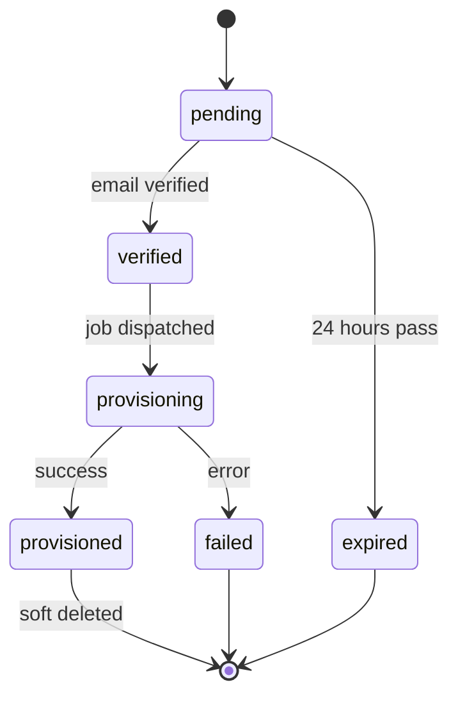

# Trial Registration Flow - Technical Documentation

## Overview

The trial registration flow allows guest users to create a new account with a trial subscription. The flow involves multiple stages: registration, email verification, and provisioning of resources.

## Flow Diagram

```mermaid
flowchart TD
    A["Guest User"] -->|"1. POST /api/trial/register
email, password, public_id, public_name, name, lastname, etc."| B["TrialRegistrationController::register
- Validate input unique email on users AND pending_registrations
- Verify reCAPTCHA if enabled
- Create PendingRegistration record
- Generate 64-char verification_token
- Set expires_at = now + 24 hours
- Send TrialVerificationMail"]
    B -->|"Creates PendingRegistration
status: pending"| C["pending_registrations table
- id UUID
- email, password hashed, name, lastname
- public_id, public_name
- phone, primary_language, primary_currency, primary_timezone
- verification_token 64-char random string
- plan_id optional, default plan used if null
- status: pending/verified/provisioning/provisioned/failed
- expires_at 24 hours from creation
- metadata ip, user_agent, timestamps"]
    C -->|"Email sent"| D["TrialVerificationMail
Link: {frontend_url}/trial/verify?id={uuid}&token={token}&lang={lang}
Expiration: 24 hours from registration"]
    D -->|"User clicks link
2. GET /api/trial/verify/{id}/{token}"| E["TrialRegistrationController::verifyEmail
- Find PendingRegistration by id
- Check not expired expires_at > now
- Verify token matches hash_equals
- Mark as verified status: verified, email_verified_at: now
- Dispatch TenancyProvisioningJob"]
    E -->|"Job dispatched to Horizon queue"| F["TenancyProvisioningJob
Queue: default Horizon
Tries: 1
Unique: tenancy-provisioning-{pending_id} 3600s lock
Flow:
1. Find PendingRegistration
2. Check not already provisioned or expired
3. Mark as provisioning
4. Get subscription plan from pending or default
5. Call TenancyProvisioningService::provisionTenancy
6. Create default ecommerce resources
7. Mark as provisioned with metadata
8. Soft delete the pending registration
9. Send TrialWelcome email"]
    F --> G["TenancyProvisioningService::provisionTenancy
All operations wrapped in DB::transaction
1. Create Tenancy public_id, public_name, legal_name, email, slug, status: active, primary_language, primary_currency, primary_timezone
2. Create Default Tenant name: tenancy.public_name - Main, Link primary language & currency
3. Create User Link to tenancy and tenant, email_verified_at: now already verified
4. Assign Roles TenancyAdmin level 1 redirect: /tenancy, Tenant level 2
5. Create Subscription Link to selected/default plan, trial_ends_at: now + plan.trial_days usually 30 days, status: on_trial
6. Associate Payment Gateways Link all active SystemPaymentGateways
7. Sync Plan Addons Enable marketplaces from plan UberEats, etc., Enable point of sales from plan"]
    G --> H["TenancyProvisioningService::createDefaultResources
Creates localized default ecommerce resources:
1. Default Category name: Categoría Principal es / Main Category en, is_primary: true
2. Default Gallery title: Galería de Ejemplo es / Sample Gallery en
3. Default Brand name: tenancy.public_name, is_primary: true
4. Default PriceList name: Lista de Precios Principal / Main Price List, is_primary: true
5. Default StockType name: Bodega Principal / Main Warehouse, is_primary: true"]
    H -->|"Welcome email sent"| I["Account Ready
User can now login at /login with their email/password
They will be redirected to /tenancy TenancyAdmin dashboard"]
```



## Key Files

| File | Purpose |
|------|---------|
| `app/Http/Controllers/API/Auth/TrialRegistrationController.php` | Handles registration, email verification, resend, status check |
| `app/Models/PendingRegistration.php` | Model for pending registrations with soft deletes |
| `app/Jobs/TenancyProvisioningJob.php` | Queued job that orchestrates provisioning |
| `app/Services/Tenancy/TenancyProvisioningService.php` | Core service for creating tenancy, user, tenant, subscription |
| `app/Services/Tenancy/TenancySubscriptionService.php` | Handles subscription creation |
| `app/Mail/TrialVerificationMail.php` | Email with verification link |
| `app/Mail/TrialWelcome.php` | Welcome email after successful provisioning |
| `app/Mail/TenancyProvisioningFailed.php` | Failure notification email |

## API Endpoints

### POST /api/trial/register
Creates a pending registration and sends verification email.

**Request:**
```json
{
    "email": "user@example.com",
    "password": "password123",
    "password_confirmation": "password123",
    "name": "John",
    "lastname": "Doe",
    "public_id": "12.345.678-9",
    "public_name": "My Company",
    "phone": "+56912345678",
    "primary_language": "es",
    "primary_currency": "CLP",
    "primary_timezone": "America/Santiago",
    "plan_id": null,
    "g-recaptcha-response": "..."
}
```

**Response (200):**
```json
{
    "success": true,
    "message": "Registration successful! Please check your email to verify your account.",
    "data": {
        "email": "user@example.com",
        "expires_at": "2026-01-21T20:01:26-03:00"
    }
}
```

### GET /api/trial/verify/{id}/{token}
Verifies email and triggers provisioning.

**Response (200):**
```json
{
    "success": true,
    "message": "Email verified successfully! Your account is being set up.",
    "data": {
        "status": "verified",
        "email": "user@example.com"
    }
}
```

### POST /api/trial/resend
Resends verification email with new token.

### GET /api/trial/status/{id}
Checks registration status.

### GET /api/trial/plans
Lists available trial plans.

## Verification Token

- **Generation:** 64-character random string via `Str::random(64)`
- **Storage:** `pending_registrations.verification_token` (hashed comparison)
- **Expiration:** 24 hours from registration (`expires_at` column)
- **Validation:** `hash_equals()` for timing-safe comparison

## PendingRegistration Status Flow



| Status | Description |
|--------|-------------|
| `pending` | Created, awaiting email verification |
| `verified` | Email verified, awaiting provisioning |
| `provisioning` | Provisioning job is running |
| `provisioned` | Successfully provisioned, record soft-deleted |
| `failed` | Provisioning failed, user notified via email |

## Subscription Plan & Trial Period

- **Default Plan:** First active plan with `is_default: true`, or lowest tier active plan
- **Trial Period:** `trial_days` from the plan (typically 30 days)
- **Trial End Date:** `trial_ends_at = now + plan.trial_days`
- **Initial Status:** `on_trial`

## Plan Addons (Marketplaces & POS)

When provisioning, the system syncs addons based on the subscription plan:

1. **Marketplaces:** UberEats, Rappi, PedidosYa, etc.
   - Defined in `config/subscription_plans.php` → `addon_formats`
   - Linked via `tenant_system_marketplace` pivot table

2. **Point of Sales:** KitchnTabs POS, etc.
   - Linked via `tenant_system_point_of_sale` pivot table

## Cleanup System

Stale pending registrations are automatically cleaned up:

- **Schedule:** Daily at 3 AM via `registrations:cleanup` command
- **Threshold:** `PENDING_REGISTRATIONS_CLEANUP_HOURS` env (default: 48 hours)
- **Targets:** Expired, provisioned (soft-deleted), or failed records older than threshold
- **Action:** Soft delete (preserves audit trail)

**Manual cleanup:**
```bash
sail artisan registrations:cleanup --dry-run  # Preview
sail artisan registrations:cleanup            # Execute
sail artisan registrations:cleanup --hours=72 # Custom threshold
```

## Error Handling

### Registration Errors
- `422`: Validation failed (duplicate email, invalid password, etc.)
- Email uniqueness checked on BOTH `users` AND `pending_registrations` tables

### Verification Errors
- `404`: Invalid verification link (pending registration not found)
- `410`: Verification link expired (24 hours passed)
- `403`: Invalid verification token

### Provisioning Errors
- Job retries once on failure
- On permanent failure:
  - Status set to `failed`
  - `TenancyProvisioningFailed` email sent
  - Pending registration hard-deleted

### Common Validation Messages
```php
'email.unique' => 'This email is already registered.',
'public_id.unique' => 'This account ID is already taken.',
'password.min' => 'Password must be at least 8 characters.',
```

## Database Schema

### pending_registrations

```sql
CREATE TABLE pending_registrations (
    id CHAR(36) PRIMARY KEY,
    email VARCHAR(255) NOT NULL,
    password VARCHAR(255) NOT NULL,
    name VARCHAR(255) NOT NULL,
    lastname VARCHAR(255) NOT NULL,
    public_id VARCHAR(50) NOT NULL,
    public_name VARCHAR(255) NOT NULL,
    phone VARCHAR(20),
    primary_language VARCHAR(5) DEFAULT 'es',
    primary_currency VARCHAR(3) DEFAULT 'CLP',
    primary_timezone VARCHAR(50) DEFAULT 'America/Santiago',
    email_verified_at TIMESTAMP NULL,
    verification_token VARCHAR(64) NOT NULL,
    plan_id BIGINT UNSIGNED NULL,
    status ENUM('pending', 'verified', 'provisioning', 'provisioned', 'failed') DEFAULT 'pending',
    metadata JSON,
    expires_at TIMESTAMP NOT NULL,
    created_at TIMESTAMP,
    updated_at TIMESTAMP,
    deleted_at TIMESTAMP NULL,
    
    INDEX idx_email (email),
    INDEX idx_status_updated (status, updated_at),
    INDEX idx_expires (expires_at),
    FOREIGN KEY (plan_id) REFERENCES subscription_plans(id)
);
```

## Provisioned Resources Summary

After successful provisioning, the following resources exist:

| Resource | Details |
|----------|---------|
| **Tenancy** | Organization-level entity with subscription |
| **Tenant** | "{name} - Main" default store |
| **User** | Admin user with TenancyAdmin + Tenant roles |
| **Subscription** | Trial subscription linked to plan |
| **Category** | Default primary category |
| **Gallery** | Default gallery |
| **Brand** | Brand named after tenancy |
| **PriceList** | Default price list with primary currency |
| **StockType** | Default warehouse/stock type |
| **Payment Gateways** | All active system payment gateways |
| **Marketplaces** | Based on plan addons |
| **Point of Sales** | Based on plan addons |


1. Trial registration
[2026-01-20 20:01:26] production.INFO: TrialRegistrationController: Pending registration created {"pending_id":"a0e29427-47af-41af-abcf-0d17c8cdc329","email":"tenancy30@kitchntabs.com"} 

Request URL
https://pw-api.ngrok.dev/api/trial/register
Request Method
POST
Status Code
200 OK

{
    "email": "tenancy30@kitchntabs.com",
    "public_id": "77.317.330-7",
    "public_name": "KitchnTabs30",
    "name": "Francisco",
    "lastname": "L",
    "password": "kt1234...",
    "password_confirmation": "kt1234...",
    "phone": "+56936891455",
    "primary_language": "es",
    "primary_currency": "CLP",
    "primary_timezone": "America/Santiago"
}

response: 

{
    "success": true,
    "message": "Registration successful! Please check your email to verify your account.",
    "data": {
        "email": "tenancy30@kitchntabs.com",
        "expires_at": "2026-01-21T20:01:26-03:00"
    }
}


2. Welcome email sent with link:
[2026-01-20 20:01:26] production.INFO: TrialRegistrationController: Verification email sent {"pending_id":"a0e29427-47af-41af-abcf-0d17c8cdc329","email":"tenancy30@kitchntabs.com"} 
https://pw.ngrok.dev/trial/verify?id=a0e29427-47af-41af-abcf-0d17c8cdc329&token=r516repgI8OpfG0681PwV0NOJTnPP9Y0wh16gvzrCjHjU0pBaCf4quBPPrCirbld&lang=es


3. Verification

[2026-01-20 20:03:23] production.INFO: TrialRegistrationController: Email verified {"pending_id":"a0e29427-47af-41af-abcf-0d17c8cdc329","email":"tenancy30@kitchntabs.com"} 
[2026-01-20 20:03:23] production.INFO: TrialRegistrationController: Provisioning job dispatched {"pending_id":"a0e29427-47af-41af-abcf-0d17c8cdc329"} 
[2026-01-20 20:03:24] production.INFO: TenancyProvisioningJob: Starting provisioning {"pending_registration_id":"a0e29427-47af-41af-abcf-0d17c8cdc329"} 
[2026-01-20 20:03:25] production.INFO: TenancyProvisioningJob: Provisioning completed successfully {"pending_registration_id":"a0e29427-47af-41af-abcf-0d17c8cdc329","tenancy_id":"019bdda6-0b04-73fb-b06b-b3ce9598ff8a","user_id":"019bdda6-0bda-72b6-88ff-8d06b4553cf9"} 
[2026-01-20 20:03:47] production.INFO: App\Http\Controllers\API\Auth\LoginController::login - Login attempt {"email":"tenancy30@kitchntabs.com","password":"***","ip":"179.2.195.126","user_agent":"Mozilla/5.0 (Macintosh; Intel Mac OS X 10_15_7) AppleWebKit/537.36 (KHTML, like Gecko) Chrome/144.0.0.0 Safari/537.36","redirect":"/login","meta":null} 
[2026-01-20 20:03:47] production.INFO: App\Http\Controllers\API\Auth\LoginController::determineRedirectUrl - Using role-based redirect {"user_id":"019bdda6-0bda-72b6-88ff-8d06b4553cf9","redirect":"/tenancy"} 
[2026-01-20 20:03:54] production.INFO: options {"mode":"view"} 


4. After login:

Request URL
https://pw-api.ngrok.dev/api/auth/getauth
Request Method
GET
Status Code
200 OK

{
    "user": {
        "id": "019bdda6-0bda-72b6-88ff-8d06b4553cf9",
        "tenant_id": "019bdda6-0b71-70fb-b600-fccbf27b855f",
        "name": "Francisco",
        "lastname": "L",
        "public_id": null,
        "email": "tenancy30@kitchntabs.com",
        "email_verified_at": "2026-01-20 20:03:25",
        "phone": "+56936891455",
        "avatar_path": null,
        "image_url": null,
        "image_path": null,
        "active": true,
        "roles": [
            {
                "id": 8,
                "name": "TenancyAdmin",
                "guard_name": "web",
                "created_at": "2026-01-15T21:42:56.000000Z",
                "updated_at": "2026-01-18T16:36:15.000000Z",
                "level": 1,
                "redirect": "\/tenancy",
                "pivot": {
                    "model_type": "App\\Models\\User",
                    "model_id": "019bdda6-0bda-72b6-88ff-8d06b4553cf9",
                    "role_id": 8
                }
            },
            {
                "id": 2,
                "name": "Tenant",
                "guard_name": "web",
                "created_at": "2025-12-17T02:23:52.000000Z",
                "updated_at": "2026-01-15T21:42:56.000000Z",
                "level": 2,
                "redirect": null,
                "pivot": {
                    "model_type": "App\\Models\\User",
                    "model_id": "019bdda6-0bda-72b6-88ff-8d06b4553cf9",
                    "role_id": 2
                }
            }
        ],
        "role_ids": [
            8,
            2
        ],
        "preferences": [],
        "deleted_at": null,
        "created_at": "2026-01-20 20:03:25",
        "updated_at": "2026-01-20 20:03:25"
    },
    "auth": {
        "tenantSettings": {
            "primary_currency": {
                "id": 1,
                "code": "CLP",
                "symbol": "$",
                "format": ",",
                "is_default": true,
                "created_at": "2025-12-17T02:23:52.000000Z",
                "updated_at": "2025-12-17T02:23:52.000000Z",
                "deleted_at": null,
                "is_enabled": true,
                "pivot": {
                    "tenant_id": "019bdda6-0b71-70fb-b600-fccbf27b855f",
                    "currency_id": 1,
                    "is_primary": true,
                    "created_at": "2026-01-20T23:03:25.000000Z",
                    "updated_at": "2026-01-20T23:03:25.000000Z"
                }
            },
            "primary_language": {
                "id": 2,
                "code": "es",
                "name": "Spanish",
                "native_name": "Espa\u00f1ol",
                "is_active": true,
                "created_at": "2026-01-01T23:59:40.000000Z",
                "updated_at": "2026-01-01T23:59:40.000000Z",
                "deleted_at": null,
                "translations": null,
                "pivot": {
                    "tenant_id": "019bdda6-0b71-70fb-b600-fccbf27b855f",
                    "language_id": 2,
                    "is_primary": true,
                    "created_at": "2026-01-20T23:03:25.000000Z",
                    "updated_at": "2026-01-20T23:03:25.000000Z"
                }
            },
            "primary_language_code": "es"
        },
        "tenantImages": {
            "banner": [],
            "horizontal_logo": [],
            "squared_logo": []
        },
        "tenant": {
            "id": "019bdda6-0b71-70fb-b600-fccbf27b855f",
            "name": "KitchnTabs30 - Main",
            "slug": "kitchntabs30-main"
        }
    },
    "systemValues": {
        "point_of_sales": [],
        "managed_mall": null,
        "user_notifications": [
            {
                "id": "Domain\\App\\Notifications\\Tab\\TabCancelledNotification",
                "name": "TabCancelledNotification",
                "className": "Domain\\App\\Notifications\\Tab\\TabCancelledNotification",
                "hasEmail": true,
                "hasPush": true,
                "hasSocket": true,
                "hasDatabase": false
            },
            {
                "id": "Domain\\App\\Notifications\\Tab\\TabClosedNotification",
                "name": "TabClosedNotification",
                "className": "Domain\\App\\Notifications\\Tab\\TabClosedNotification",
                "hasEmail": true,
                "hasPush": true,
                "hasSocket": true,
                "hasDatabase": false
            },
            {
                "id": "Domain\\App\\Notifications\\Tab\\TabConfirmedNotification",
                "name": "TabConfirmedNotification",
                "className": "Domain\\App\\Notifications\\Tab\\TabConfirmedNotification",
                "hasEmail": true,
                "hasPush": true,
                "hasSocket": true,
                "hasDatabase": false
            },
            {
                "id": "Domain\\App\\Notifications\\Tab\\TabCreatedNotification",
                "name": "TabCreatedNotification",
                "className": "Domain\\App\\Notifications\\Tab\\TabCreatedNotification",
                "hasEmail": true,
                "hasPush": false,
                "hasSocket": true,
                "hasDatabase": false
            },
            {
                "id": "Domain\\App\\Notifications\\Tab\\TabCreatedUberNotification",
                "name": "TabCreatedUberNotification",
                "className": "Domain\\App\\Notifications\\Tab\\TabCreatedUberNotification",
                "hasEmail": true,
                "hasPush": true,
                "hasSocket": true,
                "hasDatabase": false
            },
            {
                "id": "Domain\\App\\Notifications\\Tab\\TabDeliveredNotification",
                "name": "TabDeliveredNotification",
                "className": "Domain\\App\\Notifications\\Tab\\TabDeliveredNotification",
                "hasEmail": true,
                "hasPush": true,
                "hasSocket": true,
                "hasDatabase": false
            },
            {
                "id": "Domain\\App\\Notifications\\Tab\\TabInPreparationNotification",
                "name": "TabInPreparationNotification",
                "className": "Domain\\App\\Notifications\\Tab\\TabInPreparationNotification",
                "hasEmail": true,
                "hasPush": true,
                "hasSocket": true,
                "hasDatabase": false
            },
            {
                "id": "Domain\\App\\Notifications\\Tab\\TabPreparedNotification",
                "name": "TabPreparedNotification",
                "className": "Domain\\App\\Notifications\\Tab\\TabPreparedNotification",
                "hasEmail": true,
                "hasPush": true,
                "hasSocket": true,
                "hasDatabase": false
            }
        ],
        "preference_formats": [
            {
                "id": "notifications",
                "group": "notifications",
                "tab": "notifications",
                "attribute": "preferences.notifications",
                "label": "Notification Preferences",
                "visible": true,
                "required": false,
                "custom": true,
                "type": "custom",
                "component": "NotificationPreferences",
                "editable": true,
                "default_value": [],
                "description": "Manage email and push notification preferences for different event types"
            },
            {
                "id": "locale",
                "group": "general",
                "tab": "general",
                "attribute": "preferences.locale",
                "label": "Language \/ Locale",
                "visible": true,
                "required": true,
                "type": "select",
                "editable": true,
                "rules": "required|in:es,en",
                "default_value": "es",
                "options": [
                    {
                        "value": "es",
                        "label": "Espa\u00f1ol"
                    },
                    {
                        "value": "en",
                        "label": "English"
                    }
                ],
                "description": "Select your preferred language for notifications and interface"
            },
            {
                "id": "sample_boolean_setting",
                "group": "sample",
                "tab": "general",
                "attribute": "preferences.sample_boolean_setting",
                "label": "Sample Boolean",
                "visible": true,
                "required": false,
                "type": "boolean",
                "editable": true,
                "default_value": false
            },
            {
                "id": "sample_integer_setting",
                "group": "sample",
                "tab": "general",
                "attribute": "preferences.sample_integer_setting",
                "label": "Sample Integer",
                "visible": true,
                "required": false,
                "type": "integer",
                "editable": true,
                "rules": "integer|min:1|max:100",
                "default_value": 10
            },
            {
                "id": "sample_text",
                "group": "sample",
                "tab": "general",
                "attribute": "preferences.sample_text",
                "label": "Sample Text",
                "visible": true,
                "required": false,
                "type": "string",
                "editable": true,
                "rules": "string|max:500",
                "default_value": "Default text"
            }
        ]
    }
}


Request URL
https://pw-api.ngrok.dev/api/tenancy?field=id&no_cache=true&order=asc&page=1&pagination=true&perPage=10&tenant_id=019bdda6-0b71-70fb-b600-fccbf27b855f
Request Method
GET
Status Code
200 OK

{
    "data": [
        {
            "id": "019bdda6-0b04-73fb-b06b-b3ce9598ff8a",
            "public_name": "KitchnTabs30",
            "legal_name": "KitchnTabs30",
            "public_id": "77.317.330-7",
            "email": "tenancy30@kitchntabs.com",
            "url": null,
            "slug": "77317330-7",
            "status": "active",
            "trial_ends_at": "2026-02-20T23:03:25.000000Z",
            "suspended_at": null,
            "marked_for_deletion_at": null,
            "settings": [],
            "metadata": [],
            "created_at": "2026-01-20T23:03:25.000000Z",
            "updated_at": "2026-01-20T23:03:25.000000Z",
            "deleted_at": null,
            "gateway_customer_id": null,
            "gateway_type": "internal",
            "pm_type": null,
            "pm_last_four": null,
            "primary_language": "es",
            "primary_currency": "CLP",
            "primary_timezone": "America\/Santiago"
        }
    ],
    "current_page": 1,
    "first_page_url": "https:\/\/pw-api.ngrok.dev\/api\/tenancy?page=1",
    "prev_page_url": null,
    "next_page_url": null,
    "last_page_url": "https:\/\/pw-api.ngrok.dev\/api\/tenancy?page=1",
    "last_page": 1,
    "per_page": 10,
    "total": 1,
    "path": "https:\/\/pw-api.ngrok.dev\/api\/tenancy"
}


---