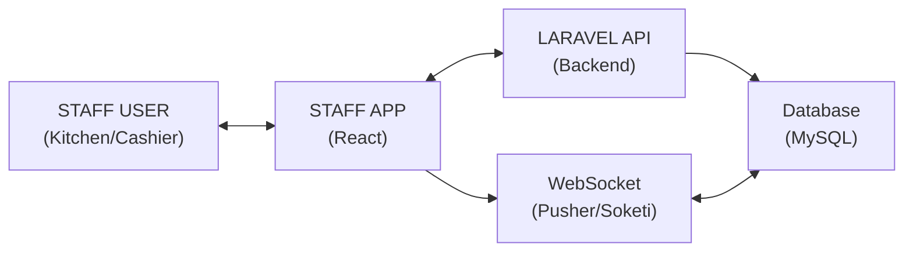
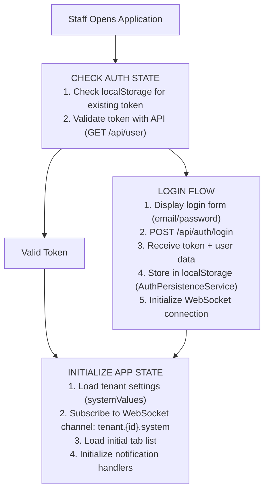
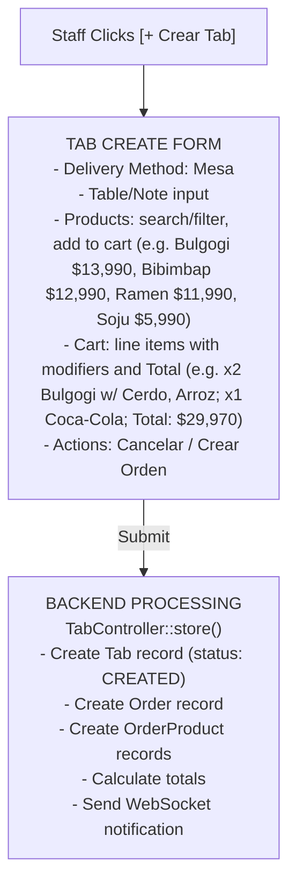
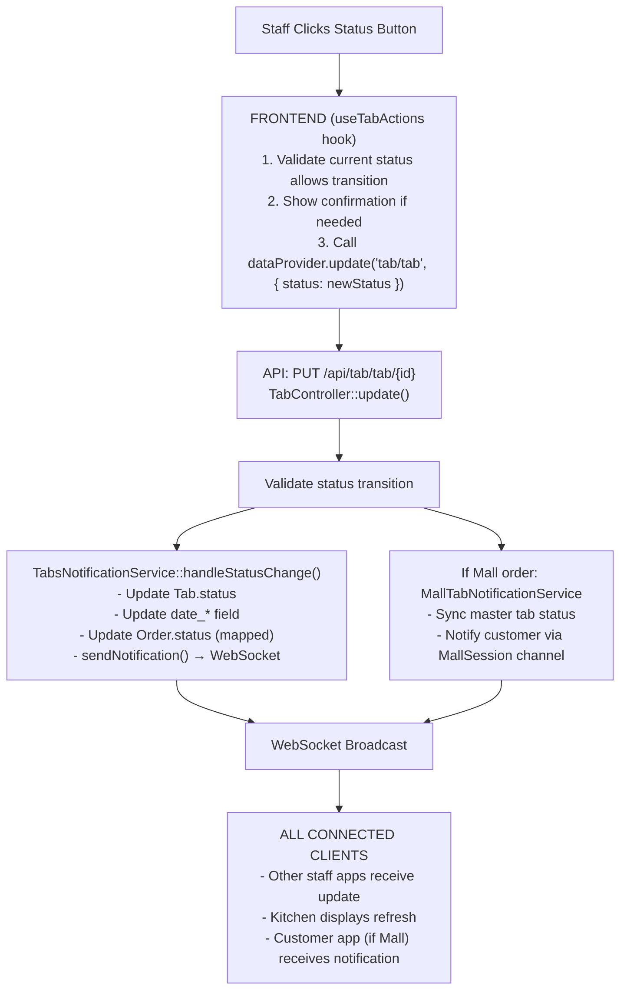
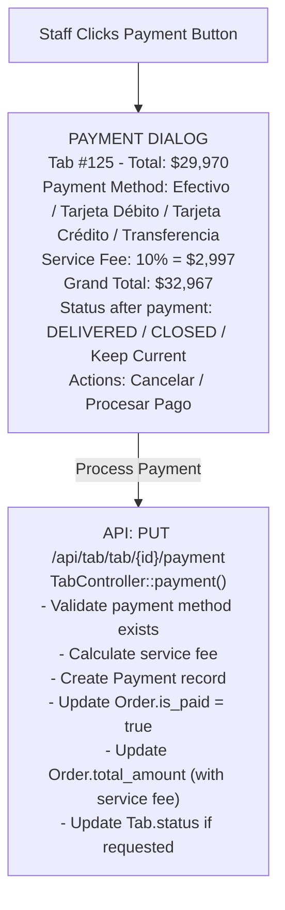
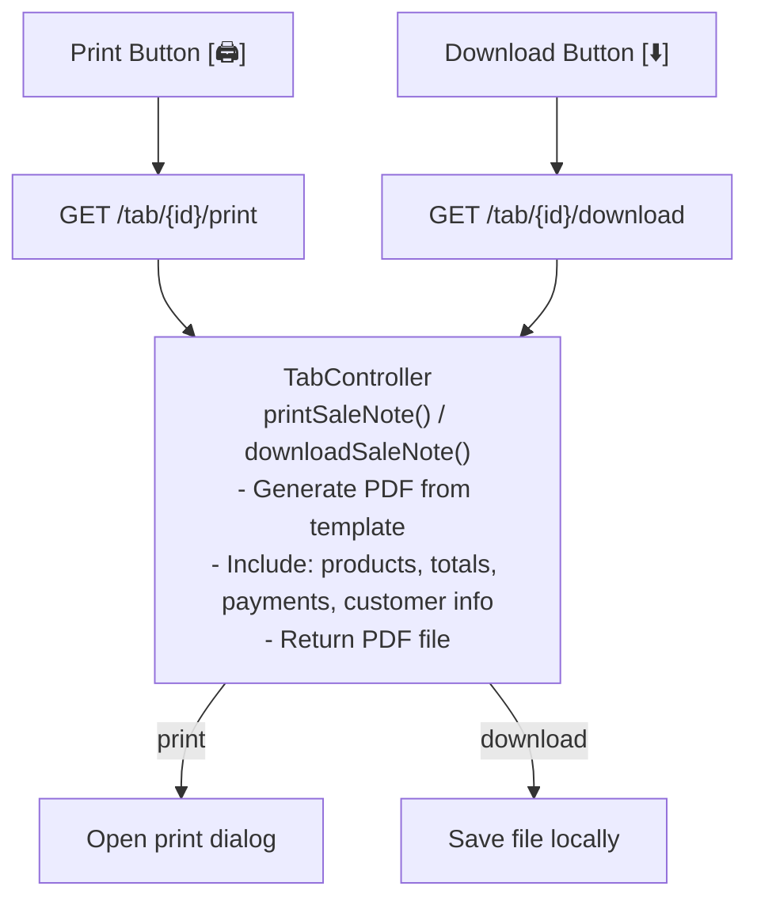
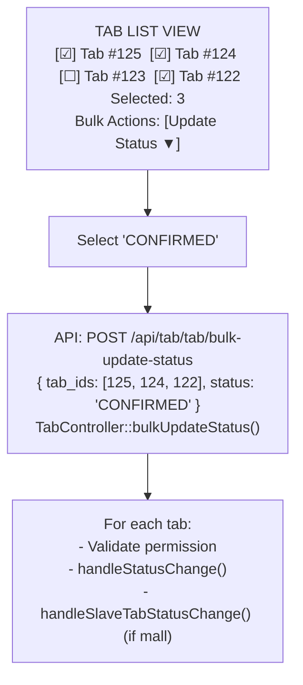
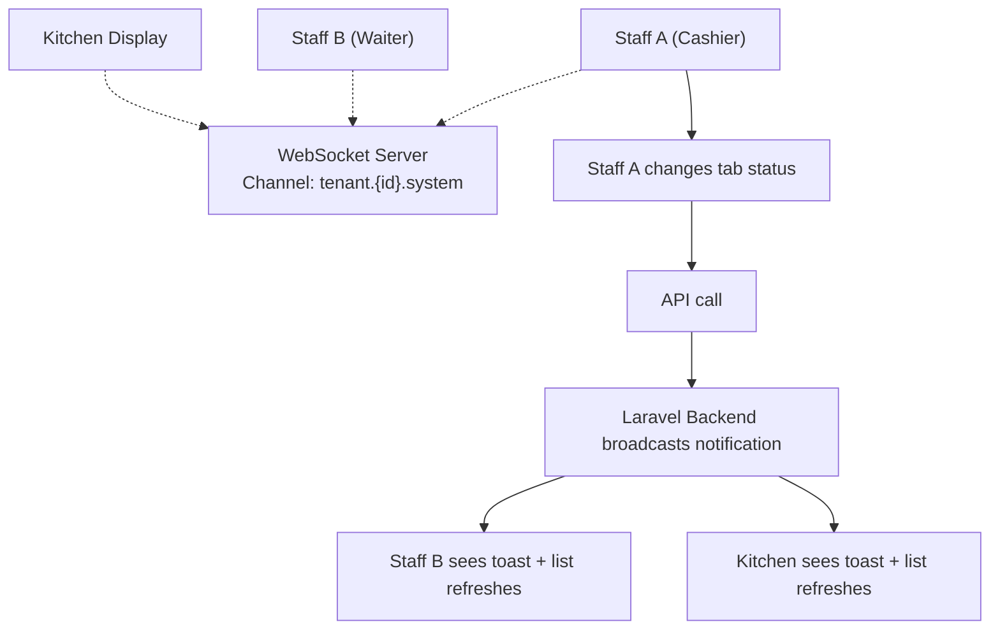
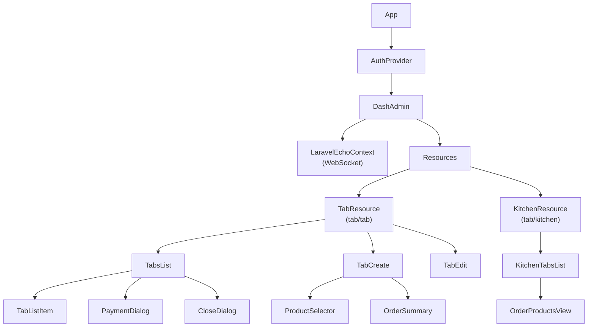

# Staff App - Complete Flow Documentation

## Overview

This document describes the complete flow of the **Staff/Kitchen App** - from login to order management and all operations available to restaurant staff.

---

## System Architecture



---

## User Roles

| Role | Description | Permissions |
|------|-------------|-------------|
| `admin` | Tenant Administrator | Full access, manage users, settings |
| `staff` | Front-of-house staff | Create/manage orders, process payments |
| `kitchen` | Kitchen staff | View orders, update preparation status |

---

## Authentication Flow



---

## Main App Views

### 1. Tab List View (TabsList)

**Purpose:** Primary view for managing all active orders

```
┌─────────────────────────────────────────────────────────────────────────────┐
│  ☰ TABS                                              [+ Crear Tab]          │
├─────────────────────────────────────────────────────────────────────────────┤
│                                                                             │
│  Filter: [Todos ▼]  [Estado: Todos ▼]                                      │
│                                                                             │
│  ┌───────────────────┐  ┌───────────────────┐  ┌───────────────────┐       │
│  │ Tab #125          │  │ Tab #124          │  │ Tab #123          │       │
│  │ ⏱ 00:05:32       │  │ ⏱ 00:12:15       │  │ ⏱ 00:25:00       │       │
│  │ ────────────────  │  │ ────────────────  │  │ ────────────────  │       │
│  │ Mesa: 8           │  │ Mesa: 5           │  │ Mesa: 3           │       │
│  │ Cliente: Juan     │  │ Cliente: María    │  │ Cliente: Pedro    │       │
│  │ ────────────────  │  │ ────────────────  │  │ ────────────────  │       │
│  │ x2 Bulgogi        │  │ x1 Bibimbap       │  │ x3 Ramen          │       │
│  │ x1 Coca-Cola      │  │ x2 Soju           │  │                   │       │
│  │ ────────────────  │  │ ────────────────  │  │ ────────────────  │       │
│  │ Total: $27,980    │  │ Total: $18,990    │  │ Total: $35,970    │       │
│  │ ────────────────  │  │ ────────────────  │  │ ────────────────  │       │
│  │ [CREADO]          │  │ [CONFIRMADO]      │  │ [PREPARADO]       │       │
│  │                   │  │                   │  │                   │       │
│  │ [→] [💳] [🖨️] [⬇️]│  │ [→] [💳] [🖨️] [⬇️]│  │ [→] [💳] [🖨️] [⬇️]│       │
│  └───────────────────┘  └───────────────────┘  └───────────────────┘       │
│                                                                             │
└─────────────────────────────────────────────────────────────────────────────┘
```

**Available Actions:**
- `[→]` - Advance to next status
- `[💳]` - Process payment
- `[🖨️]` - Print sale note
- `[⬇️]` - Download sale note

### 2. Kitchen View (KitchenTabsList)

**Purpose:** Simplified view for kitchen staff focused on preparation

```
┌─────────────────────────────────────────────────────────────────────────────┐
│  🍳 COCINA                                                                  │
├─────────────────────────────────────────────────────────────────────────────┤
│                                                                             │
│  ◀ ────────────────────────────────────────────────────────────────── ▶    │
│                                                                             │
│  ┌────────────────────┐  ┌────────────────────┐  ┌────────────────────┐    │
│  │ Tab #125  ⏱ 05:32  │  │ Tab #124  ⏱ 12:15  │  │ Tab #123  ⏱ 25:00  │    │
│  │ ─────────────────  │  │ ─────────────────  │  │ ─────────────────  │    │
│  │                    │  │                    │  │                    │    │
│  │ [IMG] x2 Bulgogi   │  │ [IMG] x1 Bibimbap  │  │ [IMG] x3 Ramen     │    │
│  │       • Cerdo      │  │       • Extra arr  │  │       • Picante    │    │
│  │       • Arroz      │  │                    │  │                    │    │
│  │                    │  │ [IMG] x2 Soju      │  │                    │    │
│  │ [IMG] x1 Coca-Cola │  │                    │  │                    │    │
│  │                    │  │                    │  │                    │    │
│  │ ─────────────────  │  │ ─────────────────  │  │ ─────────────────  │    │
│  │ [CREADO]           │  │ [CONFIRMADO]       │  │ [EN PREPARACIÓN]   │    │
│  │                    │  │                    │  │                    │    │
│  │ [Confirmar →]      │  │ [Preparado →]      │  │ [Listo →]          │    │
│  └────────────────────┘  └────────────────────┘  └────────────────────┘    │
│                                                                             │
└─────────────────────────────────────────────────────────────────────────────┘
```

---

## Order Creation Flow



---

## Order Status Management Flow



---

## Payment Processing Flow



---

## Print/Download Flow



---

## Bulk Operations Flow



---

## Real-Time Updates Flow



---

## API Endpoints Reference

### Tab Management

| Method | Endpoint | Description |
|--------|----------|-------------|
| `GET` | `/api/tab/tab` | List all tabs |
| `POST` | `/api/tab/tab` | Create new tab |
| `GET` | `/api/tab/tab/{id}` | Get tab details |
| `PUT` | `/api/tab/tab/{id}` | Update tab |
| `DELETE` | `/api/tab/tab/{id}` | Delete tab |
| `POST` | `/api/tab/tab/bulk-update-status` | Bulk status update |

### Tab Actions

| Method | Endpoint | Description |
|--------|----------|-------------|
| `PUT` | `/api/tab/tab/{id}/payment` | Process payment |
| `GET` | `/api/tab/tab/{id}/print` | Print sale note |
| `GET` | `/api/tab/tab/{id}/download` | Download sale note |
| `GET` | `/api/tab/tab/statuses` | Get available statuses |
| `GET` | `/api/tab/tab/{id}/status-transitions` | Get valid transitions |

---

## Error Handling

### Frontend Error Display

```typescript
// useTabActions.tsx

const showError = (msg: string) => {
    toast.error(msg, {
        position: 'top-center',
        autoClose: 3000,
    });
};

// Usage
try {
    await updatePayment(tabId, paymentData);
} catch (error) {
    showError('Error al procesar el pago: ' + error.message);
}
```

### Backend Error Responses

```php
// TabController.php

return ResponseHandler::error(
    new Exception(__('tabs.errors.invalid_status_transition')),
    422
);

return ResponseHandler::error(
    new Exception(__('tabs.errors.cannot_delete_processed_tab')),
    409
);
```

---

## Component Hierarchy



---

## State Management

### Redux Store Structure

```typescript
{
    auth: {
        isAuthenticated: boolean,
        user: User,
        token: string,
        tenant: Tenant
    },
    systemValues: {
        paymentMethods: PaymentMethod[],
        currencies: Currency[],
        settings: TenantSettings
    }
}
```

### Local Component State

```typescript
// TabsList.tsx
const [listData, setListData] = useState<ITab[]>([]);
const [selectedTab, setSelectedTab] = useState<ITab | null>(null);
const [updatingTabs, setUpdatingTabs] = useState<Set<number>>(new Set());
const [paymentMethod, setPaymentMethod] = useState<string>("");
const [serviceFeeValue, setServiceFeeValue] = useState(0);
```
