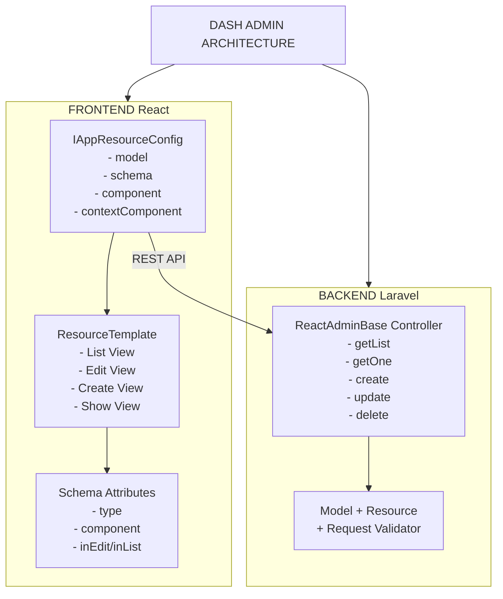

# DASH Admin Framework - Technical Documentation

> **Version:** 2.0  
> **Last Updated:** January 2026  
> **Audience:** Developers, AI Agents, System Architects

---

## Table of Contents

1. [Overview](#1-overview)
2. [Architecture](#2-architecture)
3. [Backend: ReactAdminBaseController](#3-backend-reactadminbasecontroller)
4. [Route Registration](#4-route-registration)
5. [Frontend: Resource Configuration](#5-frontend-resource-configuration)
6. [Schema Definition](#6-schema-definition)
7. [Custom Components](#7-custom-components)
8. [Context Components](#8-context-components)
9. [Drawer Configuration](#9-drawer-configuration)
10. [Complete Examples](#10-complete-examples)
11. [Troubleshooting](#11-troubleshooting)

---

## 1. Overview

The DASH Admin Framework is a full-stack solution built on:
- **Backend**: Laravel with `ReactAdminBaseController` providing REST API endpoints
- **Frontend**: React Admin with `dash-auto-admin` library for automatic schema-driven UI generation

### Key Concepts

| Concept | Description |
|---------|-------------|
| **Resource** | A CRUD entity (e.g., `tenancy`, `users`, `products`) |
| **Schema** | Array of attribute definitions that describe fields and behavior |
| **ResourceConfig** | Configuration object defining how a resource is rendered and behaves |
| **Custom Component** | React component that replaces default field rendering |
| **ContextComponent** | Wrapper component providing data context to child components |

---

## 2. Architecture



---

## 3. Backend: ReactAdminBaseController

The `ReactAdminBaseController` provides a standardized REST API that integrates with React Admin's data provider.

### 3.1 Controller Structure

```php
<?php

namespace App\Http\Controllers\API\Tenancy;

use App\Http\Controllers\API\System\ReactAdminBaseController;
use App\Http\Requests\API\Tenancy\TenancyRequest;
use App\Http\Resources\TenancyResource;
use App\ModelFilters\TenanciesFilter;
use App\Models\Tenancy;

class TenancyController extends ReactAdminBaseController
{
    // Required: API Resource for response transformation
    public $resource = TenancyResource::class;
    
    // Optional: Form request for validation
    public $requestValidator = TenancyRequest::class;
    
    // Optional: Model filter for search/filtering
    public $modelFilter = TenanciesFilter::class;

    public function __construct()
    {
        $this->model = Tenancy::query();
    }
}
```

### 3.2 Available Hooks

The base controller provides lifecycle hooks for customization:

| Hook | Phase | Purpose |
|------|-------|---------|
| `_setup($request)` | All methods | Initial setup, called first |
| `_preList($request)` | Before list | Modify query before fetching |
| `_postList($data)` | After list | Transform results |
| `_preGetOne($request)` | Before show | Modify single record query |
| `_postGetOne($data)` | After show | Transform single record |
| `_precreate($req)` | Before create | Modify input data |
| `_create($request)` | Create | Custom create logic |
| `_postcreate($request, $id, $item)` | After create | Post-create operations |
| `_update($request, $id, $data)` | Update | Custom update logic |
| `_delete($request, $id, $data)` | Delete | Custom delete logic |

### 3.3 Example: Custom List Filtering

```php
class ProductController extends ReactAdminBaseController
{
    public function __construct()
    {
        $this->model = Product::query();
    }

    /**
     * Filter products by tenant before listing
     */
    public function _preList($request)
    {
        $user = $request->user();
        
        if (!$user->isSystemAdmin()) {
            $this->model->where('tenant_id', $user->tenant_id);
        }
    }

    /**
     * Load relationships after fetching
     */
    public function _postList($data)
    {
        return $data->load(['category', 'images']);
    }
}
```

### 3.4 Example: Custom Create with Related Data

```php
public function _create(Request $request)
{
    $product = Product::create($request->only([
        'name', 'sku', 'price', 'tenant_id'
    ]));

    // Handle categories
    if ($request->has('category_ids')) {
        $product->categories()->sync($request->category_ids);
    }

    return $product->fresh(['categories']);
}
```

---

## 4. Route Registration

### 4.1 Standard Route Pattern

Routes should be registered using the `ReactAdminRoutes` helper:

```php
// routes/api.php

use App\Support\ReactAdminRoutes;

// System routes (requires system role)
Route::middleware(['auth:sanctum'])->prefix('system')->group(function () {
    ReactAdminRoutes::register('tenant', TenantController::class);
    ReactAdminRoutes::register('user', UserController::class);
});

// Tenancy routes (requires tenancy auth)
Route::middleware(['auth:sanctum'])->prefix('tenancy')->group(function () {
    ReactAdminRoutes::register('tenancy', TenancyController::class);
    ReactAdminRoutes::register('subscriptions', TenancySubscriptionController::class);
});
```

### 4.2 What ReactAdminRoutes::register Creates

```php
// ReactAdminRoutes::register('product', ProductController::class) creates:

GET    /api/{prefix}/product              → getList
GET    /api/{prefix}/product/{id}         → getOne
POST   /api/{prefix}/product              → create
PUT    /api/{prefix}/product/{id}         → update
PATCH  /api/{prefix}/product/{id}         → partial
DELETE /api/{prefix}/product/{id}         → delete
POST   /api/{prefix}/product/deleteMany   → deleteMany
POST   /api/{prefix}/product/updateMany   → updateMany
```

---

## 5. Frontend: Resource Configuration

The `IDashAutoAdminResourceConfig` interface defines how a resource behaves in the frontend.

### 5.1 Minimal Resource Configuration

```tsx
import { IDashAutoAdminResourceConfig } from "dash-auto-admin";
import ResourceTemplate from "dash-admin/src/templates/ResourceTemplate";
import ProductSchema from "./schemas/product";
import InventoryIcon from "@mui/icons-material/Inventory";

const productResource: IDashAutoAdminResourceConfig = {
    roles: ["Admin", "Manager"],           // Who can access
    component: ResourceTemplate,           // Use default template
    model: "domain/product",               // API endpoint path
    schema: ProductSchema,                 // Field definitions
    label: "Products",                     // Display name
    icon: <InventoryIcon />,              // Menu icon
    group: "Inventory",                    // Menu group
};
```

### 5.2 Full Resource Configuration Reference

```tsx
const fullResourceConfig: IDashAutoAdminResourceConfig = {
    // ============ BASIC PROPERTIES ============
    model: "tenancy/tenants",              // API path (required)
    label: "resource.tenants.label",       // i18n key or string
    icon: <StoreIcon />,                   // MUI icon component
    group: "resource.groups.account",      // Menu grouping
    roles: ["TenancyAdmin", "System"],     // Required roles
    path: "/tenancy/tenants",              // Custom URL path (optional)

    // ============ COMPONENT CONFIGURATION ============
    component: ResourceTemplate,           // Main rendering component
    
    // ============ SCHEMA ============
    schema: tenantSchema,                  // Primary schema for all views
    listSchema: listOnlySchema,            // Override for list view only
    editSchema: editOnlySchema,            // Override for edit view only
    createSchema: createOnlySchema,        // Override for create view only
    showSchema: showOnlySchema,            // Override for show view only

    // ============ CRUD PERMISSIONS ============
    list: true,                            // Enable list view
    create: true,                          // Enable create view
    edit: true,                            // Enable edit view
    view: true,                            // Enable show view
    delete: true,                          // Enable delete action

    // ============ DRAWER CONFIGURATION ============
    drawer: true,                          // Enable drawer for editing
    drawerOptions: {
        view: true,                        // View in drawer
        edit: true,                        // Edit in drawer
        create: false,                     // Create as full page
    },
    closeDrawerAfterSave: true,            // Auto-close drawer on save

    // ============ MENU CONFIGURATION ============
    menu: [
        {
            title: "resource.tenants.menu_all",
            redirect: "/tenancy/tenants",
        },
        {
            title: "🗑",                    // Trash icon
            redirect: "/tenancy/tenants/trash",
        },
    ],
    mainAction: {
        title: "resource.tenants.main_action",
        fn: "redirect",
        mode: "create",
        redirect: "create",
    },

    // ============ TOOLBAR BUTTONS ============
    toolbarCreateButton: { enabled: true },
    toolbarEditButton: { enabled: true },
    toolbarDeleteButton: { enabled: true },
    toolbarSaveButton: { enabled: true },
    toolbarListButton: { enabled: true },
    toolbarExportButton: { enabled: false },

    // ============ LIST BUTTONS ============
    listViewButton: { props: { buttonProps: { variant: 'text', size: 'small' } } },
    listEditButton: { props: { buttonProps: { variant: 'text', size: 'small' } } },
    listDeleteButton: { confirm: true },

    // ============ DATA GRID ============
    dataGridProps: { 
        stickyHeader: true,
        rowClick: false,                   // Disable row click
    },
    dataGridWrapper: (props) => (
        <TableContainer sx={{ maxHeight: 800 }}>
            {props.children}
        </TableContainer>
    ),

    // ============ FILTERS ============
    referenceFilters: [
        {
            id: "name",
            label: "Name",
            source: "name",
            reference: null,
            optionText: null,
            alwaysOn: true,
        },
        {
            id: "status",
            label: "Status",
            source: "status",
            reference: "domain/status.name",
            optionText: "name",
            alwaysOn: false,
        },
    ],

    // ============ FORM BEHAVIOR ============
    formGroupMode: 'tabs',                 // 'tabs' | 'groups' | 'layout'
    mutationMode: 'pessimistic',           // 'pessimistic' | 'optimistic' | 'undoable'
    isFormData: true,                      // Use FormData (for file uploads)
    redirectAfterCreate: true,             // Redirect to list after create
    redirectAfterUpdate: false,            // Stay on edit after update
    refreshAfter: true,                    // Refresh list after mutations

    // ============ DATA TRANSFORMATION ============
    postFormatter: (params, method) => {
        // Transform data before sending to API
        if (method === 'create') {
            params.status = 'active';
        }
        return params;
    },

    // ============ ERROR HANDLING ============
    onError: (mode, error) => {
        if (mode === 'create' && error?.body?.limit_info) {
            console.warn('Plan limit reached:', error.body.limit_info);
        }
    },

    // ============ CONTEXT COMPONENT ============
    contextComponent: ({ resourceConfig, mode, children }) => (
        <SystemRequestsCache
            cacheKey="tenant_settings_cache"
            apiUrl="system/settings"
            cacheSeconds={300}
        >
            {children}
        </SystemRequestsCache>
    ),

    // ============ SOFT DELETES ============
    trash: true,                           // Enable trash/restore functionality
};
```

---

## 6. Schema Definition

The schema defines how fields are displayed and edited across all views.

### 6.1 Basic Attribute Types

```tsx
import { IDashAutoAdminAttribute } from 'dash-auto-admin';

const basicSchema: IDashAutoAdminAttribute[] = [
    // String field
    {
        attribute: 'name',
        label: 'Name',
        type: String,
        inList: true,
        inEdit: true,
        inShow: true,
        inCreate: true,
    },

    // Number field
    {
        attribute: 'price',
        label: 'Price',
        type: Number,
        inList: true,
        inEdit: true,
        inShow: true,
        inCreate: true,
    },

    // Boolean field
    {
        attribute: 'is_active',
        label: 'Active',
        type: Boolean,
        inList: true,
        inEdit: true,
        inShow: true,
        inCreate: true,
    },

    // Date field
    {
        attribute: 'created_at',
        label: 'Created',
        type: Date,
        inList: true,
        inEdit: false,
        inShow: true,
        inCreate: false,
    },
];
```

### 6.2 Reference Fields (Foreign Keys)

```tsx
const referenceSchema: IDashAutoAdminAttribute[] = [
    // Single reference (SelectInput)
    {
        attribute: 'category_id',
        label: 'Category',
        type: 'domain/category.name',      // endpoint.displayField
        inList: true,
        inEdit: true,
        inShow: true,
        inCreate: true,
        multiple: false,
        pagination: false,
    },

    // Multiple references (SelectArrayInput)
    {
        attribute: 'tag_ids',
        label: 'Tags',
        type: 'domain/tag.name',
        inList: false,
        inEdit: true,
        inShow: true,
        inCreate: true,
        multiple: true,
    },
];
```

### 6.3 Tab Organization

```tsx
const tabbedSchema: IDashAutoAdminAttribute[] = [
    {
        tab: 'General',
        attribute: 'name',
        label: 'Name',
        type: String,
    },
    {
        tab: 'General',
        attribute: 'description',
        label: 'Description',
        type: String,
    },
    {
        tab: 'Pricing',
        attribute: 'price',
        label: 'Price',
        type: Number,
    },
    {
        tab: 'Pricing',
        attribute: 'discount',
        label: 'Discount %',
        type: Number,
    },
    {
        tab: 'Settings',
        attribute: 'is_active',
        label: 'Active',
        type: Boolean,
    },
];
```

### 6.4 Field Visibility Control

```tsx
{
    attribute: 'internal_notes',
    label: 'Internal Notes',
    type: String,
    inList: false,      // Hidden from list view
    inEdit: true,       // Visible in edit form
    inShow: false,      // Hidden from show view
    inCreate: false,    // Hidden from create form
    inDrawer: true,     // Visible in drawer view
}
```

### 6.5 Validation

```tsx
{
    attribute: 'email',
    label: 'Email',
    type: String,
    validate: (value, allValues) => {
        if (!value) {
            throw new Error('Email is required');
        }
        if (!value.includes('@')) {
            throw new Error('Invalid email format');
        }
    },
}

{
    attribute: 'password_confirmation',
    label: 'Confirm Password',
    type: String,
    isPassword: true,
    validate: (value, allValues) => {
        if (allValues.password && value !== allValues.password) {
            throw new Error('Passwords do not match');
        }
    },
}
```

### 6.6 Field Props and Slot Props

```tsx
{
    attribute: 'public_id',
    label: 'Tax ID',
    type: String,
    fieldProps: {
        required: true,
        helperText: 'Enter valid tax ID format',
    },
    slotProps: {
        input: {
            fullWidth: true,
            autoComplete: 'off',
        },
    },
}
```

---

## 7. Custom Components

Custom components replace default field rendering with specialized UI.

### 7.1 Custom Component Interface

```tsx
import { IDashAutoAdminCustomFieldComponent } from 'dash-auto-admin';

interface MyComponentProps extends IDashAutoAdminCustomFieldComponent {
    // Additional props if needed
}

// The component receives these props:
interface IDashAutoAdminCustomFieldComponent {
    method: 'list' | 'edit' | 'create' | 'view';
    attribute: IDashAutoAdminAttribute;
    resourceConfig: IDashAutoAdminResourceConfig;
    endpoint?: string;
    children?: ReactNode;
}
```

### 7.2 Complete Custom Component Example

```tsx
import React from 'react';
import { useRecordContext, useInput } from 'react-admin';
import { IDashAutoAdminCustomFieldComponent } from 'dash-auto-admin';
import { TextField, Select, MenuItem, FormControl, InputLabel } from '@mui/material';

interface StatusSelectorProps extends IDashAutoAdminCustomFieldComponent {}

// Edit/Create mode component
const StatusSelectorEdit: React.FC<StatusSelectorProps> = ({ attribute }) => {
    const { field, fieldState } = useInput({ source: attribute.attribute });
    
    return (
        <FormControl fullWidth error={!!fieldState.error}>
            <InputLabel>Status</InputLabel>
            <Select {...field} label="Status">
                <MenuItem value="active">Active</MenuItem>
                <MenuItem value="inactive">Inactive</MenuItem>
                <MenuItem value="pending">Pending</MenuItem>
            </Select>
        </FormControl>
    );
};

// View/List mode component
const StatusSelectorView: React.FC<StatusSelectorProps> = ({ attribute }) => {
    const record = useRecordContext();
    const value = record?.[attribute.attribute];
    
    const statusColors = {
        active: 'green',
        inactive: 'red',
        pending: 'orange',
    };
    
    return (
        <span style={{ color: statusColors[value] || 'gray' }}>
            {value || '-'}
        </span>
    );
};

// Main component with method switching
const StatusSelector: React.FC<StatusSelectorProps> = ({ method, ...props }) => {
    switch (method) {
        case 'edit':
        case 'create':
            return <StatusSelectorEdit method={method} {...props} />;
        case 'view':
        case 'list':
            return <StatusSelectorView method={method} {...props} />;
        default:
            return null;
    }
};

export default StatusSelector;
```

### 7.3 Using Custom Component in Schema

```tsx
import StatusSelector from '../components/StatusSelector';

const schema: IDashAutoAdminAttribute[] = [
    {
        tab: 'General',
        attribute: 'status',
        label: 'Status',
        type: String,
        custom: true,                        // Mark as custom
        component: StatusSelector,           // Your component
        inList: true,
        inEdit: true,
        inShow: true,
        inCreate: true,
    },
];
```

### 7.4 Custom Component with API Data

```tsx
import { useAxios } from 'dash-axios-hook';
import { useQuery } from '@tanstack/react-query';

const DynamicSelector: React.FC<IDashAutoAdminCustomFieldComponent> = ({ 
    attribute, 
    method 
}) => {
    const axios = useAxios();
    const { field } = useInput({ source: attribute.attribute });
    
    // Fetch options from API
    const { data: options, isLoading } = useQuery({
        queryKey: ['options', attribute.attribute],
        queryFn: async () => {
            const response = await axios.get('/api/options/' + attribute.attribute);
            return response.data.data;
        },
    });
    
    if (isLoading) return <CircularProgress size={24} />;
    
    if (method === 'edit' || method === 'create') {
        return (
            <FormControl fullWidth>
                <InputLabel>{attribute.label}</InputLabel>
                <Select {...field} label={attribute.label}>
                    {options?.map((opt) => (
                        <MenuItem key={opt.id} value={opt.id}>
                            {opt.name}
                        </MenuItem>
                    ))}
                </Select>
            </FormControl>
        );
    }
    
    // View mode
    const selected = options?.find((o) => o.id === field.value);
    return <span>{selected?.name || '-'}</span>;
};
```

---

## 8. Context Components

Context components wrap resource views to provide data or state.

### 8.1 What is a Context Component?

A context component wraps the resource's CRUD views to provide:
- Cached API data
- Shared state
- Configuration options
- Theme or locale settings

### 8.2 Using SystemRequestsCache

```tsx
import SystemRequestsCache from 'dash-admin/src/contexts/SystemRequestsCache';

const resourceConfig: IDashAutoAdminResourceConfig = {
    model: 'system/tenant',
    schema: tenantSchema,
    
    // Context component wraps edit/create views (not list by default)
    contextComponent: ({ resourceConfig, mode, children }) => {
        console.log("Context mode:", mode); // "list" | "edit" | "create"
        
        // Only wrap edit/create, not list
        return mode === "list" ? children : (
            <SystemRequestsCache
                cacheKey="tenant_settings_cache"
                apiUrl="system/tenant/settingFormats"
                cacheSeconds={300}
            >
                {children}
            </SystemRequestsCache>
        );
    },
};
```

### 8.3 Creating a Custom Context Provider

```tsx
import React, { createContext, useContext } from 'react';
import { useQuery } from '@tanstack/react-query';
import { useAxios } from 'dash-axios-hook';

// 1. Create the context
interface SettingsContextType {
    currencies: Currency[];
    languages: Language[];
    isLoading: boolean;
}

const SettingsContext = createContext<SettingsContextType | null>(null);

// 2. Create the provider
export const SettingsProvider: React.FC<{ children: React.ReactNode }> = ({ 
    children 
}) => {
    const axios = useAxios();
    
    const { data, isLoading } = useQuery({
        queryKey: ['settings'],
        queryFn: async () => {
            const response = await axios.get('/api/system/settings');
            return response.data.data;
        },
        staleTime: 30 * 60 * 1000, // 30 minutes
    });
    
    return (
        <SettingsContext.Provider value={{
            currencies: data?.currencies || [],
            languages: data?.languages || [],
            isLoading,
        }}>
            {children}
        </SettingsContext.Provider>
    );
};

// 3. Create the hook
export const useSettings = () => {
    const context = useContext(SettingsContext);
    if (!context) {
        throw new Error('useSettings must be used within SettingsProvider');
    }
    return context;
};
```

### 8.4 Using Custom Context in Resource

```tsx
const resourceConfig: IDashAutoAdminResourceConfig = {
    model: 'tenancy/account',
    schema: accountSchema,
    
    contextComponent: ({ mode, children }) => (
        mode === "list" ? children : (
            <SettingsProvider>
                {children}
            </SettingsProvider>
        )
    ),
};
```

### 8.5 Consuming Context in Custom Component

```tsx
import { useSettings } from '../contexts/SettingsProvider';

const CurrencySelector: React.FC<IDashAutoAdminCustomFieldComponent> = ({ 
    attribute, 
    method 
}) => {
    const { currencies, isLoading } = useSettings();
    const { field } = useInput({ source: attribute.attribute });
    
    if (isLoading) return <CircularProgress size={24} />;
    
    return (
        <FormControl fullWidth>
            <InputLabel>Currency</InputLabel>
            <Select {...field} label="Currency">
                {currencies.map((curr) => (
                    <MenuItem key={curr.code} value={curr.code}>
                        {curr.symbol} - {curr.code}
                    </MenuItem>
                ))}
            </Select>
        </FormControl>
    );
};
```

---

## 9. Drawer Configuration

The drawer provides inline editing without leaving the list view.

### 9.1 Basic Drawer Setup

```tsx
const resourceConfig: IDashAutoAdminResourceConfig = {
    model: 'domain/product',
    schema: productSchema,
    
    drawer: true,                          // Enable drawer
    drawerOptions: {
        view: true,                        // Show in drawer
        edit: true,                        // Edit in drawer
        create: false,                     // Create as full page
    },
};
```

### 9.2 Drawer with Custom Buttons

```tsx
const drawerSettings = {
    drawer: true,
    drawerOptions: {
        view: true,
        edit: true,
        create: false,
    },
    listViewButton: { 
        props: { 
            buttonProps: { variant: 'text', size: 'small' }, 
            label: '' 
        } 
    },
    listEditButton: { 
        props: { 
            buttonProps: { variant: 'text', size: 'small' }, 
            label: '' 
        } 
    },
    listDeleteButton: { 
        confirm: true, 
        props: { 
            buttonProps: { variant: 'text', size: 'small' }, 
            label: '' 
        } 
    },
};

const resourceConfig: IDashAutoAdminResourceConfig = {
    model: 'domain/product',
    schema: productSchema,
    ...drawerSettings,
};
```

### 9.3 Drawer Behavior Options

```tsx
const resourceConfig: IDashAutoAdminResourceConfig = {
    drawer: true,
    closeDrawerAfterSave: true,            // Auto-close on save
    refreshAfter: true,                     // Refresh list after save
    redirectAfterUpdate: false,             // Don't redirect
    showDialogAfterSubmit: true,           // Show success dialog
    showNotifyAfterSubmit: true,           // Show notification
};
```

---

## 10. Complete Examples

### 10.1 Simple Product Resource

**Backend Controller:**

```php
// app/Http/Controllers/API/Domain/ProductController.php

namespace App\Http\Controllers\API\Domain;

use App\Http\Controllers\API\System\ReactAdminBaseController;
use App\Http\Resources\ProductResource;
use Domain\App\Models\Extended\Product;

class ProductController extends ReactAdminBaseController
{
    public $resource = ProductResource::class;

    public function __construct()
    {
        $this->model = Product::query();
    }

    public function _preList($request)
    {
        $this->model->where('tenant_id', $request->user()->tenant_id);
    }
}
```

**Frontend Schema:**

```tsx
// resources/private/schemas/product.tsx

import { IDashAutoAdminAttribute } from 'dash-auto-admin';

const productSchema: IDashAutoAdminAttribute[] = [
    {
        tab: 'General',
        attribute: 'name',
        label: 'Product Name',
        type: String,
        inList: true,
        inEdit: true,
        inShow: true,
        inCreate: true,
    },
    {
        tab: 'General',
        attribute: 'sku',
        label: 'SKU',
        type: String,
        inList: true,
        inEdit: true,
        inShow: true,
        inCreate: true,
    },
    {
        tab: 'Pricing',
        attribute: 'price',
        label: 'Price',
        type: Number,
        inList: true,
        inEdit: true,
        inShow: true,
        inCreate: true,
    },
    {
        tab: 'General',
        attribute: 'category_id',
        label: 'Category',
        type: 'domain/category.name',
        inList: true,
        inEdit: true,
        inShow: true,
        inCreate: true,
    },
];

export default productSchema;
```

**Frontend Resource Config:**

```tsx
// resources/private/productResources.tsx

import { IDashAutoAdminResourceConfig } from "dash-auto-admin";
import ResourceTemplate from "dash-admin/src/templates/ResourceTemplate";
import productSchema from "./schemas/product";
import InventoryIcon from "@mui/icons-material/Inventory";

const productResources: IDashAutoAdminResourceConfig[] = [
    {
        roles: ["Admin", "Manager"],
        component: ResourceTemplate,
        model: "domain/product",
        schema: productSchema,
        label: "Products",
        icon: <InventoryIcon />,
        group: "Inventory",
        
        drawer: true,
        drawerOptions: { view: true, edit: true, create: false },
        
        toolbarCreateButton: { enabled: true },
        mutationMode: "pessimistic",
        
        referenceFilters: [
            {
                id: "name",
                label: "Search",
                source: "q",
                reference: null,
                optionText: null,
                alwaysOn: true,
            },
        ],
    },
];

export default productResources;
```

### 10.2 Complex Resource with Custom Components

```tsx
// Full tenancy account example

import { IDashAutoAdminResourceConfig } from "dash-auto-admin";
import ResourceTemplate from "dash-admin/src/templates/ResourceTemplate";
import tenancyAccountSchema from "./schemas/tenancy_account";
import BusinessIcon from "@mui/icons-material/Business";
import AccountList from "@app/components/account/AccountList";

const tenancyResources: IDashAutoAdminResourceConfig[] = [
    {
        roles: ["TenancyAdmin", "System"],
        component: ResourceTemplate,
        model: "tenancy",
        group: "resource.tenancy.groups.account",
        path: "/tenancy/account",
        schema: tenancyAccountSchema,
        label: "resource.tenancy.account.label",
        icon: <BusinessIcon />,
        
        // Custom list rendering
        dataGridComponent: AccountList,
        
        // Disable create (single record)
        create: false,
        
        // Form configuration
        mutationMode: "pessimistic",
        redirectAfterUpdate: false,
        formGroupMode: 'tabs',
        
        // Drawer for inline editing
        drawer: true,
        drawerOptions: { view: true, edit: true, create: false },
    },
];

export default tenancyResources;
```

---

## 11. Troubleshooting

### 11.1 Common Issues

| Issue | Cause | Solution |
|-------|-------|----------|
| Fields not showing | Wrong `inEdit`/`inList` flags | Set visibility flags correctly |
| Custom component not rendering | Missing `custom: true` | Add `custom: true` to attribute |
| API 404 | Wrong `model` path | Ensure route is registered |
| Form not saving | Missing `$fillable` in model | Add fields to model's `$fillable` |
| Drawer not opening | `drawer: false` or missing | Set `drawer: true` |

### 11.2 Debugging Tips

```tsx
// Enable debug in ResourceTemplate
const debug = true; // Line 33 in ResourceTemplate.tsx

// Log form values in custom component
const { field } = useInput({ source: 'my_field' });
console.log('Field value:', field.value);

// Log record context
const record = useRecordContext();
console.log('Current record:', record);
```

### 11.3 Backend Debugging

```php
// In controller
public function _preList($request)
{
    Log::info('Query parameters:', $request->all());
    Log::info('User:', $request->user()->toArray());
}

public function _postcreate($request, $id, $item)
{
    Log::info('Created item:', $item->toArray());
    return $item;
}
```

---

## Appendix: File Locations

| File Type | Location Pattern |
|-----------|-----------------|
| Controllers | `app/Http/Controllers/API/{Module}/` |
| Models | `app/Models/` or `domain/app/Models/` |
| Resources | `app/Http/Resources/` |
| Requests | `app/Http/Requests/API/` |
| Frontend Configs | `src/resources/private/` |
| Schemas | `src/resources/private/schemas/` |
| Custom Components | `src/components/` |

---

> **Document maintained by**: DASH Development Team  
> **For questions**: Refer to existing implementations in `systemResources.old.tsx` and `tenancyResources.tsx`
