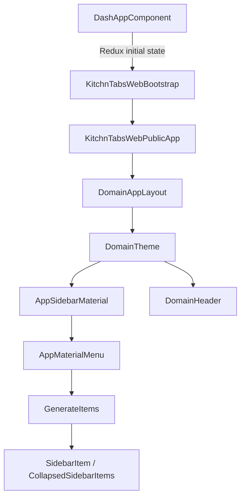
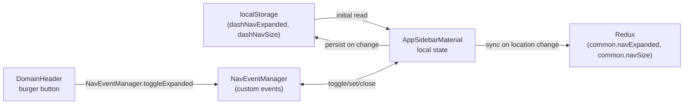

# Sidebar Architecture

Technical documentation of the sidebar implementation in the DASH Admin framework.

## Component Hierarchy



---

## State Management

The sidebar uses a **three-layer state system**: local component state (source of truth), localStorage (persistence), and Redux (read-only sync for other components).

### State Flow



### Key State Variables

| Variable | Source | Purpose |
|---|---|---|
| `localNavExpanded` | `AppSidebarMaterial` local state | Whether sidebar is open (expanded) |
| `localNavSize` | `AppSidebarMaterial` local state | `"large"` = permanent drawer, `"small"` = temporary overlay |
| `sidebarPosition` | Redux `common.panelSettings.sidebarPosition` | `"left"` / `"right"` / `"top"` / `"bottom"` |
| `navExpanded` | Redux `common.navExpanded` | Read-only copy, synced on route changes |
| `navSize` | Redux `common.navSize` | Read-only copy, synced on route changes |

### Initial State Configuration

Set in [DashAppComponent.tsx](file:///Users/farandal/DASH-PW-PROJECT/dash-frontend/apps/kitchntabs-app/src/DashAppComponent.tsx):

```typescript
{
    navExpanded: dashStorage.getItem('dashNavExpanded') === 'true' ?? false,
    navSize: dashStorage.getItem('dashNavSize') || 'small',
    panelSettings: {
        sidebarPosition: 'top',        // Primary position (large screens)
        // secondarySidebarPosition: 'left' // Fallback for small screens (defaults to 'left')
        sidebarLargeWidth,              // From CSS var --sidebar-large-width
        sidebarSmallWidth,              // From CSS var --sidebar-small-width
        sidebarHorizontalHeight,        // From CSS var --sidebar-horizontal-height
    }
}
```

---

## Responsive Behavior

[AppSidebarMaterial.tsx](file:///Users/farandal/DASH-PW-PROJECT/dash-frontend/packages/dash-admin/src/default-theme/menu/AppSidebarMaterial.tsx) manages responsive breakpoint transitions.

### Breakpoints & Behavior

| Screen Size | MUI Breakpoint | `navSize` | `navExpanded` | Drawer Variant | Position |
|---|---|---|---|---|---|
| **Small** (< sm) | `down('sm')` | `small` | `false` | `temporary` | Secondary (left) |
| **Medium** (sm–md) | `down('md')` | `small` | `false` | `temporary` | Secondary (left) |
| **Large** (> md) | `up('md')` | `large` | User preference | `permanent` | Primary (top) |

### Breakpoint Crossing Logic

When crossing breakpoints, the sidebar automatically adjusts:

- **Entering small/medium screen** → `navSize = "small"`, `navExpanded = false`, position switches to `secondarySidebarPosition` (defaults to `"left"`)
- **Entering large screen** → `navSize = "large"`, `navExpanded = true`, position uses `primarySidebarPosition` (e.g. `"top"`)
- **Initial load on small screen** → Always forces `small` + collapsed regardless of stored localStorage preferences

### Position Switching

```typescript
// Primary position used on large screens (from panelSettings.sidebarPosition)
const primarySidebarPosition = panelSettings?.sidebarPosition || 'left';
// Secondary position used on medium/small screens (fallback for burger menu)
const secondarySidebarPosition = panelSettings?.secondarySidebarPosition || 'left';
// Effective position
const sidebarPosition = isMediumOrSmaller ? secondarySidebarPosition : primarySidebarPosition;
```

---

## Drawer Rendering

### Variant Selection

```typescript
// "small" navSize → temporary (overlay, dismiss on backdrop click)
// "large" navSize → permanent (always visible, pushes content)
variant={localNavSize === "small" ? 'temporary' : 'permanent'}
```

### Horizontal Mode Override

When `sidebarPosition` is `"top"` or `"bottom"`, the sidebar forces `effectiveNavExpanded = true` and `effectiveNavSize = "large"`. The toggle button is hidden in horizontal mode — the full menu is always visible.

---

## NavEventManager

[navEvents.tsx](file:///Users/farandal/DASH-PW-PROJECT/dash-frontend/packages/dash-admin/src/utils/navEvents.tsx) provides a custom event bus for cross-component navigation communication, decoupled from Redux.

### Events

| Event | Emitter | Listener | Purpose |
|---|---|---|---|
| `nav:toggle-expanded` | `DomainHeader` burger button | `AppSidebarMaterial` | Toggle sidebar open/close |
| `nav:set-expanded` | Any component | `AppSidebarMaterial` | Set sidebar to specific state |
| `nav:close-drawer` | `SidebarItem`, `CollapsedSidebarItem` | `AppSidebarMaterial` | Close temporary drawer after navigation |
| `nav:state-changed` | `AppSidebarMaterial` | `DomainHeader` | Sync local state for UI feedback |
| `nav:submenu-opened` | Menu items | Other menu items | Accordion behavior (close others) |
| `nav:close-all-submenus` | Various | All submenus | Close all open submenus |

---

## Header Burger Button

[DomainHeader.tsx](file:///Users/farandal/DASH-PW-PROJECT/dash-frontend/packages/dash-admin/src/default-theme/DomainHeader.tsx) renders a burger icon visible only on small/medium screens:

```tsx
<Box sx={{ display: { xs: 'flex', sm: 'flex', md: 'none' } }}>
    <IconButton onClick={() => NavEventManager.toggleExpanded()}>
        <MenuOpenIcon />
    </IconButton>
</Box>
```

On large screens (`md` and up), the sidebar has its own toggle button inside `AppMaterialMenu`.

---

## Menu Rendering

[AppMaterialMenu.tsx](file:///Users/farandal/DASH-PW-PROJECT/dash-frontend/packages/dash-admin/src/default-theme/menu/AppMaterialMenu.tsx) renders sidebar content based on state:

| Condition | Rendering |
|---|---|
| `navExpanded && navSize === "large"` | Full expanded menu with labels (`SidebarItem`, `SidebarItemCollapse`) |
| Otherwise | Collapsed icon-only menu (`CollapsedSidebarItems`) |
| Horizontal mode (`top`/`bottom`) | Items in a horizontal flex row, no scrollbar |
| Vertical mode (`left`/`right`) | Items in a vertical list with custom scrollbar |

### Logo Display

- **Collapsed sidebar**: Shows `TenantAvatarComponent` with squared logo
- **Expanded sidebar**: Shows `TenantAvatarComponent` with squared (vertical) or horizontal (horizontal) logo
- **Small screen**: Logo hidden in sidebar, small logo shown in `DomainHeader` instead

---

## CSS Variables

Sidebar dimensions are configured via CSS custom properties in [dash-variables.less](file:///Users/farandal/DASH-PW-PROJECT/dash-frontend/apps/kitchntabs-app/src/dash-variables.less):

```css
:root {
    --sidebar-large-width: 200px;
    --sidebar-small-width: 60px;
    --sidebar-horizontal-height: 64px;
    --logo-vertical-max-width: 130px;
    --logo-vertical-max-height: 130px;
    --logo-horizontal-max-width: 200px;
    --logo-horizontal-max-height: 60px;
}
```

These are read at initialization in `DashAppComponent.tsx` via `getCssVariableNumber()` and stored in Redux `panelSettings`.

---

## CSS Class Management

`AppSidebarMaterial` maintains CSS classes on `#dash-app-layout` for styling hooks:

- `expanded` / `collapsed` — sidebar open state
- `small` / `large` — drawer variant
- `sidebar-position-left` / `sidebar-position-top` / etc. — current position

Body classes managed:
- `full-scroll`, `horizontal-layout` — for horizontal nav styles
- `location-{path}` — current route for per-page styling
- Layout type: `framed` / `boxed` / `full`
- Theme type: `dark` / `light`

---

## Persistence

| Key | Storage | Purpose |
|---|---|---|
| `dashNavExpanded` | localStorage | Sidebar expanded/collapsed state |
| `dashNavSize` | localStorage | `"small"` or `"large"` drawer variant |

> [!IMPORTANT]
> On small/medium screens, stored preferences are **overridden** — the sidebar always starts as `small` + collapsed to prevent the permanent drawer from appearing on mobile devices.
