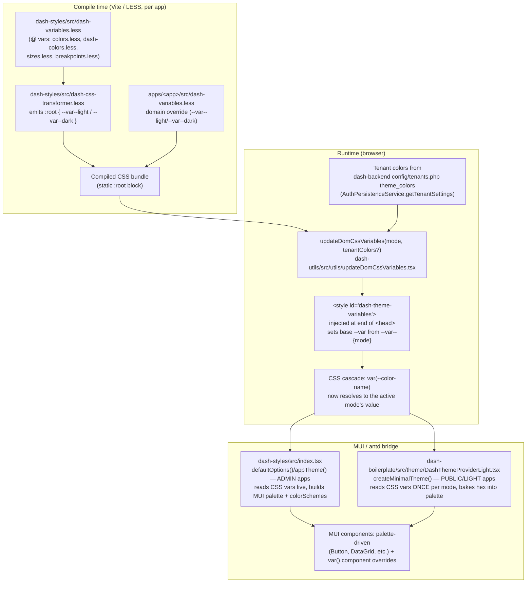

# DASH Style System — Technical Reference

**Category**: Functional Epic (F8: Public Web)
**Status**: Active
**Last Updated**: 2026-08-03
**Audience**: Engineers implementing or debugging theming in `dash-frontend-core` or any domain frontend (`kitchntabs-*`, `vanexa-*`)

---

## 1. Purpose

This document is the engineering-level reference for how the DASH style system works end to end:
how LESS compiles to CSS custom properties, how light/dark mode is applied at runtime, how those
CSS variables are bridged into MUI's (and antd's) JS theme objects, where every moving part lives
in the repo, and — critically — a full table of every CSS variable a domain frontend
(`apps/<app>/src/dash-variables.less`) is expected to override.

It complements (and in a few places corrects/updates) the two existing design-system docs:
- [Public-Web Dash Design System Variables](F8-Public-Web_DASH_DESIGN_SYSTEM_VARIABLES.md)
- [Public-Web Design-System-Less-Css](F8-Public-Web_design-system-less-css.md)

Those two documents are near-duplicates of each other and describe the intended architecture.
This document was produced by tracing the actual current source (not just the design intent),
so where the two disagree, treat this one as authoritative and the others as historical/conceptual.

---

## 2. Core Philosophy

**"CSS variables are the runtime source of truth for colors. LESS `@variables` are only used at
compile time — to seed the CSS variables and for structural/layout LESS logic (`@media`
breakpoints, mixins) that cannot use `var()`.**

- Colors: `background: var(--primary-color);` — resolved at runtime, swappable without reload.
- Structural/breakpoint LESS: `@media (min-width: @screen-md) { ... }` — LESS vars are fine here
  because media queries can't reference CSS custom properties.
- Layout dimensions (sidebar width, header height): mostly CSS vars too, but a few (see §7) are
  compile-time only and must be set as **LESS** `@variables`, not CSS `--variables`.

Every themeable color follows a **three-key pattern**:

```
--color-name            ← "base" key — what components actually use in var(--color-name)
--color-name--light     ← light mode value (compiled default AND/OR domain override)
--color-name--dark      ← dark mode value (compiled default AND/OR domain override)
```

The base (unsuffixed) key is **never** set statically at compile time. It only exists because a
runtime function (`updateDomCssVariables`, §5) copies the correct suffixed value into it whenever
the theme mode changes. **If that runtime step doesn't run, the base key is simply undefined** and
anything reading `var(--color-name)` with no fallback silently gets nothing (inherits from parent,
or falls back to the browser/MUI default).

---

## 3. Architecture at a Glance



Three distinct "override layers" exist, evaluated in this order of precedence (last wins):

1. **Core defaults** — `dash-styles/src/dash-css-transformer.less` (the gray/green DASH defaults).
2. **Domain/app defaults** — `apps/<app>/src/dash-variables.less` (per-app brand colors, compiled
   into the bundle, static per build).
3. **Tenant runtime override** — `dash-backend` `config/tenants.php` → `theme_colors` setting,
   fetched per-tenant and passed into `updateDomCssVariables(mode, colors)` at app boot
   (see §6). This is the only layer that can change **without a rebuild**.

---

## 4. File Map — Where Everything Lives

| # | Component | Path | Role |
|---|---|---|---|
| 1 | Base LESS variables | `dash-frontend-core/packages/dash-styles/src/variables/colors.less` | Raw color palette swatches (greens, greys) used to seed `dash-colors.less`. Not themed (no light/dark). |
| 2 | Dash base colors | `dash-frontend-core/packages/dash-styles/src/variables/dash-colors.less` | `@primary-color`, `@table-header-bg`, etc. Legacy `@`-var layer, "overwrite in domain `dash-variables.less`" per its own header comment. Mostly superseded by the CSS `--var` convention (§7) but still imported for the few dimension vars. |
| 3 | Sizes/typography | `dash-frontend-core/packages/dash-styles/src/variables/sizes.less` | All layout/dimension `@` vars: sidebar widths, font sizes, spacing, border radii. `@sidebar-large-width: 255px` lives here. |
| 4 | Breakpoints | `dash-frontend-core/packages/dash-styles/src/variables/breakpoints.less` | `@screen-*` media query breakpoints. |
| 5 | dash-styles aggregate defaults | `dash-frontend-core/packages/dash-styles/src/dash-variables.less` | Just `@import`s files 1–4. This is `@dash-styles-src/dash-variables.less` in every app's Vite config. |
| 6 | **CSS transformer** | `dash-frontend-core/packages/dash-styles/src/dash-css-transformer.less` | The single most important file. Emits the full `:root { --var--light: ...; --var--dark: ... }` block (≈270 variables) plus the antd `.ant-table-css-var` / `.css-var-root` bridge overrides (§8). |
| 7 | Domain/app overrides | `apps/<app>/src/dash-variables.less` (one per app, e.g. `kitchntabs-frontend/apps/vanexa-system/src/dash-variables.less`) | Per-app brand palette. Only defines the keys the app wants to change; everything else falls through to file 6. |
| 8 | Vite LESS pipeline | `apps/<app>/vite.config.mts` → `css.preprocessorOptions.less.additionalData` | Controls import order of files 5, 6, 7 for every `.less` file compiled in the app. Order determines which convention the app must use (§7.1). |
| 9 | **Runtime remap (canonical)** | `dash-frontend-core/packages/dash-utils/src/utils/updateDomCssVariables.tsx` | Copies `--var--{mode}` → `--var` at runtime; merges in tenant colors; injects `<style id="dash-theme-variables">` at the end of `<head>`. Exported from the `dash-utils` package — **this is the one to use/import**. |
| 10 | Runtime remap (**stale fork — do not use**) | `dash-frontend-core/packages/dash-admin/src/default-theme/updateDomCssVariables.tsx` | An older, diverged copy with a known-fixed bug still present (see §9). Kept only because older admin code still imports it locally. |
| 11 | **MUI bridge — Admin/full apps** | `dash-frontend-core/packages/dash-styles/src/index.tsx` | `defaultOptions()`, `defaultComponentOverrides()`, `appTheme()`, `getAntTheme()`. Reads CSS vars live from stylesheets, builds full MUI `palette` + `colorSchemes` (supports `useColorScheme()`), and ~30 component `styleOverrides` blocks that reference `var(--...)` directly (self-updating, not baked). Also produces the antd theme token object. |
| 12 | **MUI bridge — Public/light apps** | `dash-frontend-core/packages/dash-boilerplate/src/theme/DashThemeProviderLight.tsx` | Lightweight alternative that explicitly avoids importing `dash-styles` (keeps `react-admin` etc. out of the public bundle). Reads CSS vars **once per mode change** via `getComputedStyle` and bakes them into a plain `createTheme({ palette: {...} })`. No `colorSchemes`, no `cssVariables: true`, and none of the ~30 component overrides from file 11 — see §9 for the practical consequences. |
| 13 | Admin theme toggle | `dash-frontend-core/packages/dash-admin/src/components/menu/DarkToggleMode.tsx` | `useColorScheme()` + Redux + `data-theme` attribute + `dashStorage`. Works correctly here because the admin app's theme (file 11, `appTheme()`) is built with `cssVariables: true` / `colorSchemes`, i.e. a real MUI CSS-vars theme. |
| 14 | Public app theme toggle(s) | e.g. `kitchntabs-frontend/apps/vanexa-system/src/components/lang/DarkToggleMode.tsx` | App-local copies of file 13, reused verbatim in several public apps. **`useColorScheme()` is non-functional here** (see §9) because these apps use file 12's plain theme, not a CSS-vars theme — but toggling still works because of the parallel `data-theme` attribute + `MutationObserver` path. |
| 15 | Redux theme action | `dash-frontend-core/packages/dash-admin-state/src/redux/actions/Setting.tsx` → `toggleThemeType()` | Persists `theme` to `dashStorage` and dispatches to Redux. Note the `document.documentElement.setAttribute` call is commented out here — the DOM attribute is set by the toggle components (13/14) directly, not by this action. |
| 16 | Admin app boot / tenant color injection | `apps/<app>/src/DashAppComponent.tsx` (one per admin app under `dash-frontend-core/apps/*`) | Calls `injectTenantStyles()` → `updateDomCssVariables(THEME_TYPE_DARK, tenantSettings.colors)` on boot, before React renders. |
| 17 | Tenant color source | `dash-backend` `config/tenants.php` → `theme_colors` setting (`default_value` array of `--key--light` / `--key--dark` pairs) | Backend-configurable per-tenant palette, editable via a `JsonColorSelector` admin field. Delivered to the frontend via `AuthPersistenceService.getTenantSettings().colors` and fed into file 9. |

---

## 5. Runtime Theme-Switching Flow (Admin Apps)

```
User clicks DarkToggleMode (dash-admin)
  │
  ├─ setMode(newMode)                       → MUI useColorScheme (works: theme has colorSchemes)
  ├─ dashStorage.setItem('theme', newMode)  → persisted preference
  ├─ document.documentElement.setAttribute('data-theme', newMode)
  └─ dispatch(toggleThemeType(newMode))     → Redux (mostly informational / persistence)
       │
       ▼
updateDomCssVariables(newMode)   [dash-utils]
  ├─ Reads every --var--light / --var--dark from compiled stylesheets (skips its own
  │  <style id="dash-theme-variables"> to avoid reading back stale injected values)
  ├─ Writes BOTH --var--light and --var--dark for every key it has a value for
  │  (so code that reads a specific-mode variable directly — e.g. an always-dark
  │  sidebar reading var(--primary-color--dark) — stays correct in both modes)
  ├─ Writes the BASE --var only for the ACTIVE mode's suffix
  └─ Injects/moves <style id="dash-theme-variables"> to the end of <head> (cascade priority)
       │
       ▼
appTheme() / defaultOptions()   [dash-styles/src/index.tsx]
  Re-invoked wherever it's memoized on `data-theme` or re-rendered; reads the now-updated
  CSS vars into a fresh MUI palette. Component `styleOverrides` using var(--...) update
  immediately via the CSS cascade regardless of when/if the JS palette re-renders.
```

## 6. Runtime Theme-Switching Flow (Public/Light Apps)

Public apps (`vanexa-system`, `vanexa-web`, `kitchntabs-web`, `kitchntabs-app`, …) use
`DashThemeProviderLight` (dash-boilerplate) instead of the full `appTheme()`:

```
User clicks the app-local DarkToggleMode
  │
  ├─ setMode(newMode)   ← MUI useColorScheme: NO-OP here, theme has no colorSchemes (see §9)
  ├─ dashStorage.setItem('theme', newMode)
  └─ document.documentElement.setAttribute('data-theme', newMode)   ← the ACTUAL trigger
       │
       ▼
DashThemeProviderLight's MutationObserver (watches documentElement[data-theme])
  └─ setCurrentMode(newMode)
       │
       ▼
useEffect([currentMode]) → updateDomCssVariables(currentMode)   [dash-utils, same as §5]
useMemo([currentMode, extendedOptions]) → createMinimalTheme(currentMode, extendedOptions)
  ├─ getThemeColors(mode): reads a small fixed set of --var--{mode} vars ONCE via
  │  getComputedStyle (primary/secondary/body-bg/component-bg/text/text-contrast/
  │  heading/link/border) — NOT the full ~270-variable set
  ├─ Bakes the resolved hex values into a plain MUI createTheme({ palette: {...} })
  └─ Spreads `extendedOptions` (per-app `MuiButton`/`MuiBox`/etc. overrides) on top
       │
       ▼
<ThemeProvider theme={theme}><CssBaseline/>{children}</ThemeProvider>
```

Boot sequence for a public app (`vanexa-system` as example):
`main.tsx` → `initializeThemeEarly('dark')` (sets `data-theme` before first paint, avoids flash)
→ lazy-loads `KitchnTabsWebPublicApp.light.tsx` → wraps routes in
`<DashThemeProviderLight extendedOptions={...}><ThemeComponent>...</ThemeComponent></DashThemeProviderLight>`.

> ⚠️ **Some apps also carry a local fork of `DashThemeProviderLight`** (e.g.
> `apps/vanexa-system/src/dash-extensions/components/DashThemeProviderLight.tsx`) that is
> byte-for-byte similar to the canonical one but is **not actually imported/used** anywhere in
> `vanexa-system` (the app imports the real one from `dash-boilerplate`). Treat these local copies
> as dead code / a naming trap until confirmed otherwise — don't assume editing them does anything.

---

## 7. Compile-Time Pipeline: Vite `additionalData`

Every app's `vite.config.mts` prepends the same three LESS files to **every** `.less` file
compiled in that app, via `css.preprocessorOptions.less.additionalData`. **Import order determines
which of two override conventions the app's `dash-variables.less` must use.**

### 7.1 The two conventions (current, verified against source — 2026-08-03)

| App | `dash-variables.less` convention | Vite import order |
|---|---|---|
| `kitchntabs-app` | CSS `--var` | defaults → transformer → app (app **last**) |
| `kitchntabs-web` | CSS `--var` | defaults → transformer → app (app **last**) |
| `kitchntabs-system` | CSS `--var` | defaults → transformer → app (app **last**) |
| `vanexa-app` | CSS `--var` | defaults → transformer → app (app **last**) |
| `vanexa-web` | CSS `--var` | defaults → transformer → app (app **last**) |
| `vanexa-system` | CSS `--var` | defaults → transformer → app (app **last**) |
| `kitchntabs-mall` | **LESS `@var`** (legacy) | defaults → app → transformer (app **before** transformer) |

> This corrects the older design-system docs, which describe `kitchntabs-system` and
> `kitchntabs-mall` as both using the legacy LESS `@var` convention. As of the current codebase,
> **`kitchntabs-mall` is the only app still on the legacy convention** — every other app has
> migrated to the CSS `--var` convention (app-overrides-last). If you're adding a new app, default
> to the CSS `--var` convention; it's the one every other app uses and the one this doc's variable
> table assumes.

**Why the order matters:**

- **CSS `--var` apps** write their own `:root { --primary-color--light: ...; }` block. For it to
  win the cascade over the transformer's `:root` block, the app file must be imported **after**
  the transformer (later `:root` wins at equal specificity).
  ```less
  @import "@dash-styles-src/dash-variables.less";
  @import "@dash-styles-src/dash-css-transformer.less";  // emits gray/green defaults
  @import '@app/dash-variables.less';                     // app :root wins, imported last
  ```
  🐞 Getting this order backwards is a real, previously-hit bug: the app renders the dash-styles
  gray defaults instead of its brand colors, because the transformer's `:root` loads last and
  wins. (This was the kitchntabs-web "purple not applying" bug, 2026-06-13.)

- **Legacy LESS `@var` apps** rely on the transformer *reading* their `@variable` values at
  compile time, so the app file must be imported **before** the transformer:
  ```less
  @import "@dash-styles-src/dash-variables.less";
  @import '@app/dash-variables.less';                     // sets @primary-color, read below
  @import "@dash-styles-src/dash-css-transformer.less";   // reads @vars, emits :root
  ```

### 7.2 Layout/dimension variables are the one exception

Colors are always resolved at **runtime** (§5/§6). Layout/dimension CSS vars are emitted **once,
at compile time**, and are NOT touched by `updateDomCssVariables`. In `dash-css-transformer.less`
they must reference the LESS `@var`, never a literal:

```less
--sidebar-large-width: @sidebar-large-width;   // ✅ correct — respects app override
--sidebar-large-width: 255px;                  // ❌ wrong — ignores app override, silently
```

To override a dimension, set the **LESS** `@var` in the app's `dash-variables.less` regardless of
which color convention (§7.1) the app otherwise uses:

```less
@sidebar-large-width: 180px;
@sidebar-small-width: 60px;
```

Do not redefine `--sidebar-large-width` as a CSS `--var` in an app's `:root` block — the
transformer's `:root` (re-injected via `additionalData` into every compiled file) loads after it
and wins, so a CSS-var hardcode there is dead/misleading.

---

## 8. antd (Ant Design) Bridge

`dash-css-transformer.less` also emits an `--ant-*` token layer that maps antd's CSS-variable
theming onto the same DASH variables (`--ant-color-primary: var(--btn-bg)`, etc.), plus two
class-scoped override blocks (`.ant-table-css-var`, `.css-var-root`) because **antd v6's
CSS-in-JS generates its own scoped CSS variables that outrank a plain `:root` declaration** — the
transformer has to target those wrapper classes directly with `!important` to win. `getAntTheme()`
in `dash-styles/src/index.tsx` additionally builds a full antd `token`/`components` theme object
(`colorPrimary`, `Table.headerBg`, `Button.colorPrimary`, etc.) by resolving the same CSS vars,
for contexts that need antd's JS theme API rather than pure CSS.

---

## 9. Known Gotchas (learned from real incidents in this codebase)

1. **Public/light apps don't get the ~30 MUI `var(--...)` component overrides.** `dash-styles`'s
   `defaultComponentOverrides()` (MuiOutlinedInput, MuiInputLabel, MuiTextField, MuiDataGrid, etc.,
   all referencing `var(--text-color)` / `var(--border-color)` / …) is deliberately **not** used by
   `DashThemeProviderLight` (dash-boilerplate) — the whole point of that provider is avoiding the
   `dash-styles` import. So in public apps, input/label/etc. styling comes from (a) MUI's own
   defaults driven by the *baked* `theme.palette` values, and (b) whatever `extendedOptions` /
   app-local CSS the app supplies. **Any app-local CSS that hardcodes a color for MUI classes
   (`.MuiInputLabel-root`, `.MuiInputBase-root`, …) must be explicitly scoped per theme**
   (`html[data-theme='light'] ...` / `html[data-theme='dark'] ...`), because nothing in the
   pipeline does that for you. Un-scoped hardcoded colors are exactly what caused the invisible
   white-on-white login form and footer text in `vanexa-system` (fixed 2026-08-03,
   `apps/vanexa-system/src/styles.less`) — rules written for the dark "frosted glass" look
   (`color: rgba(255,255,255,0.7)`) were never given a light-mode counterpart, even though the
   surrounding background *was* correctly theme-aware.

2. **`primary.contrastText` is now derived algorithmically, not read from `--primary-contrast`.**
   Both theme builders (`createMinimalTheme()` in dash-boilerplate, `createPalette()` in
   dash-styles/index.tsx) used to set `palette.primary.contrastText` directly from
   `--primary-contrast--{mode}`. That variable is *also* used standalone as a decorative
   gradient stop (`.dash-app-login-wrapper`'s `background: linear-gradient(..., var(--primary-color),
   var(--primary-contrast))`), so nothing ever validated it as an actual legible foreground color.
   `vanexa-system` picked `--primary-contrast--light: #007bff` against `--primary-color--light:
   #0078D4` — two near-identical blues — making every MUI `contained` primary button's text
   effectively invisible. **Fixed 2026-08-03**: both builders now omit `contrastText` entirely from
   the `primary` palette entry, letting MUI's `createPalette()` auto-derive it via
   `getContrastText(main)` (picks black or white text by contrast ratio — see
   `@mui/material/styles/createPalette.js`, `augmentColor()`). This guarantees legible
   primary-button text for *any* `--primary-color`/`--btn-bg` value, at the cost of a domain no
   longer being able to hand-pick a stylized non-black/white foreground for primary buttons — if a
   future app needs that, it must set `palette.primary.contrastText` explicitly via its own
   `extendedOptions`/`muiThemeOptions`, opting back in deliberately rather than inheriting it
   silently from an overloaded CSS variable.

3. **`useColorScheme()` is a no-op in public/light apps.** The app-local `DarkToggleMode` copies
   (file 14) call MUI's `useColorScheme()`, which only works inside a theme built with
   `cssVariables: true` / `colorSchemes` (as the admin app's `appTheme()` provides). `
   DashThemeProviderLight`'s `createMinimalTheme()` is a plain `createTheme({ palette })` with
   neither — so `setMode()` from that hook does nothing useful there. Toggling still works in
   practice only because the same click handler also sets `data-theme` on `<html>` directly, which
   `DashThemeProviderLight`'s `MutationObserver` picks up independently. Don't rely on `mode` from
   `useColorScheme()` to reflect reality in a public app; read `document.documentElement
   .getAttribute('data-theme')` or `dashStorage.getItem('theme')` instead.

4. **Two diverged copies of `updateDomCssVariables` exist.** `dash-utils/src/utils/
   updateDomCssVariables.tsx` (canonical, used by `dash-boilerplate`) contains a documented fix:
   it writes **both** `--var--light` and `--var--dark` for every key regardless of active mode
   (so mode-specific direct references, like an always-dark sidebar reading
   `var(--primary-color--dark)`, stay correct no matter which mode is active), and it always
   falls back to compiled static defaults per-key even when partial tenant `colors` are supplied.
   `dash-admin/src/default-theme/updateDomCssVariables.tsx` is an older fork that lacks both
   fixes. If you're touching this logic, edit the `dash-utils` version and make sure callers
   import from there — don't "fix" the admin fork in isolation, and don't copy new code from the
   admin fork assuming it's up to date.

5. **`--text-header--light` and `--text-header--dark` are both `#ffffff` in the core defaults**
   (`dash-css-transformer.less` — not overridden by every app). Any element styled with
   `color: var(--text-header, #fff)` will be white in **both** modes unless a domain
   `dash-variables.less` explicitly sets a light-mode value. This is by design for things like a
   colored/gradient header bar, but is a trap if reused on a surface whose background is
   theme-aware (see gotcha 1's pattern).

6. **`getStaticCssVariables()` (used by both the MUI bridges and `updateDomCssVariables`) only
   matches rules with `selectorText === ':root'` exactly** — not `:root, [data-theme=...]` or any
   compound selector. This works today because every DASH LESS file emits a plain `:root { ... }`
   block, but it's a silent-failure trap if that ever changes (e.g. hand-writing a combined
   selector to "help" the cascade) — variables defined that way simply won't be discovered as
   static defaults.

---

## 10. Root `dash-styles` CSS Variables — Domain Override Reference

Source of truth: `dash-frontend-core/packages/dash-styles/src/dash-css-transformer.less`
(current as of 2026-08-03). Every variable below follows the `--name--light` / `--name--dark`
pattern from §2 and can be overridden per-app in `apps/<app>/src/dash-variables.less` — just
redeclare the keys you want to change inside your app's `:root { }` block (CSS `--var` convention,
§7.1); anything you don't redeclare falls through to the core default shown here.

Not included below: the legacy `dash-`-prefixed alias block (lines ~442–592 of the transformer —
near-duplicate keys like `--dash-sidebar-bg--light` kept only for backwards compatibility) and the
`--ant-*` token bridge (§8), which are internal plumbing, not intended as direct override targets.

### 10.1 Primary, Secondary & Highlight

| Variable | Light default | Dark default | Used for |
|---|---|---|---|
| `--primary-color` | `#c3c3c3` | `#343434` | Brand primary; sidebar/AppBar background in `appTheme()` |
| `--primary-contrast` | `#f1f1f1` | `#191919` | **Not** consumed as MUI `primary.contrastText` (as of 2026-08-03, see gotcha 2 in §9 — that's now auto-derived). Currently only used directly in CSS as a decorative gradient stop (`.dash-app-login-wrapper`'s background gradient). Treat as free-form brand color, not a guaranteed-legible foreground. |
| `--secondary-color` | `#e8e8e8` | `#202020` | Secondary buttons, accents |
| `--highlight-color` | `#49a000` | `#fbfbfb` | Hover/active accents, tab indicator, links |
| `--highlight-color-contrast` | `#333333` | `#000000` | Text/icon color on top of `--highlight-color` |

### 10.2 Body & Page Background

| Variable | Light default | Dark default | Used for |
|---|---|---|---|
| `--bodybg-primary` | `#ffffff` | `#101010` | `<body>` background (gradient start) |
| `--bodybg-secondary` | `#ececec` | `#242424` | `<body>` background (gradient end) |
| `--body-bg` | `#2e2e2e` (light-side only) | — | Legacy; mostly superseded by `bodybg-primary/secondary` |
| `--framed_layout-bg` | `#ffffff` | `#363636` | "Framed" layout mode background |
| `--nav-bg` | `rgba(64,64,64,0.5)` | `#252526` | Nav/menu bars |

### 10.3 Text

| Variable | Light default | Dark default | Used for |
|---|---|---|---|
| `--text-color` | `#000000` | `#f2f2f2` | Primary body text (`palette.text.primary`) |
| `--text-contrast` | `#595959` | `#cccccc` | Secondary/contrast text (`palette.text.secondary`) |
| `--text-light` | `#4b4b4b` | `#ffffff` | Muted/secondary label text |
| `--text-header` | `#ffffff` | `#ffffff` | Header/title text — **white in both modes by default**, see gotcha 4 |
| `--heading-color` | `#535353` | `#e0e0e0` | `<h1>`–`<h6>` color |
| `--link-color` | `#171d3d` | `#2eac19` | Anchor/link text |

### 10.4 Module, Component & Border

| Variable | Light default | Dark default | Used for |
|---|---|---|---|
| `--module-bg` | `rgba(214,214,214,1)` | `#252526` | Cards, popovers, panels, dialogs |
| `--module-border` | `#4f4f4f` | `#404040` | Border around module surfaces |
| `--component-bg` | `#ffffff` | `#252526` | Generic component surface (inputs, tables, DataGrid) |
| `--component-border` | `#999999` | `#ffffff2e` | Component border |
| `--component-text` | `#333333` | `#d4d4d4` | Text inside components |
| `--component-shadow` | `0 2px 4px rgba(0,0,0,0.1)` | `0 2px 4px rgba(0,0,0,0.4)` | Box-shadow |
| `--component-hover-bg` | `#f8f8f8` | `#2d2d2d` | Hover state |
| `--component-active-bg` | `#e6e6e6` | `#37373d` | Selected/active state |
| `--component-border-base` | `#999999` | `#404040` | Base border variant |
| `--component-border-split` | `#999999` | `#ffffff4d` | Divider/split border (table cell borders) |
| `--border-color` | `#999999` | `#ffffff4d` | General-purpose border (inputs, outlines) |

### 10.5 Links, Disabled & Scrollbar

| Variable | Light default | Dark default | Used for |
|---|---|---|---|
| `--link-hover` | `#999999` | `#9cdcfe` | Link hover color |
| `--link-active` | `#666666` | `#007acc` | Link active color |
| `--disabled-color` | `#808080` | `#6c6c6c` | Disabled text |
| `--disabled-bg` | `#eeeeee` | `#2d2d2d` | Disabled background |
| `--disabled-border` | `#eeeeee` | `#404040` | Disabled border |
| `--scroll_track` | `#808080` | `#1e1e1e` | Scrollbar track |
| `--scroll_thumb-color` | `#333333` | `#424242` | Scrollbar thumb |

### 10.6 Header Bar

| Variable | Light default | Dark default | Used for |
|---|---|---|---|
| `--header-bg` | `#ffffff` | `#252526` | Admin header bar background |
| `--header-font` | `#333333` | `#d4d4d4` | Admin header text |
| `--header-badge` | `#999999` | `#007acc` | Header badge background |
| `--header-badge-hover` | `#F1F1F1` | `#1e8ad2` | Header badge hover |
| `--header-input-bg` | `#2b2b2b` | `#3c3c3c` | Search/input fields in the header |

### 10.7 Sidebar

| Variable | Light default | Dark default | Used for |
|---|---|---|---|
| `--sidebar-bg` | `rgba(255,255,255,0)` | `rgba(0,0,0,0)` | Sidebar container background |
| `--sidebar-bg-hover` | `rgba(255,255,255,0.5)` | `#00000061` | Sidebar item hover |
| `--sidebar` | `rgba(60,60,60,0.5)` | `#d4d4d4` | Base sidebar text/icon tone |
| `--sidebar-active` | `rgba(60,60,60,0.5)` | `#ffffff` | Active sidebar item |
| `--sidebar_icon` | `#ffffff` | `#d4d4d4` | Sidebar icon color |
| `--sidebar_icon-active` | `#ffffff` | `#ffffff` | Active sidebar icon color |
| `--sidebar-primary` | `#000000` | `#ffffff` | Primary sidebar tone |
| `--sidebar-contrast` | `#3d3d3d` | `#cccccc` | Contrast sidebar tone |
| `--sidebar_icon-primary` | `#ffffff` | `#d4d4d4` | Primary icon tone |
| `--sidebar_icon-secondary` | `#f0f0f0` | `#858585` | Secondary icon tone |
| `--sidebar-bg-primary` | `rgba(0,0,0,0)` | `transparent` | Primary bg tone |
| `--sidebar-bg-contrast` | `rgba(62,62,62,0.5)` | `#2d2d2d` | Contrast bg tone |
| `--sidebar_submenu-bg-primary` | `rgba(0,0,0,0.05)` | `#12121229` | Submenu bg (primary) |
| `--sidebar_submenu-bg-contrast` | `rgba(64,64,64,0.5)` | `#2d2d2d` | Submenu bg (contrast) |
| `--sidebar_submenu-color-primary` | `#010101` | `#d4d4d4` | Submenu text (primary) |
| `--sidebar_submenu-color-contrast` | `#383838` | `#cccccc` | Submenu text (contrast) |
| `--sidebar-handle-primary` | `rgba(64,64,64,0.2)` | `rgba(65,65,65,0.4)` | Resize handle (primary) |
| `--sidebar-handle-contrast` | `rgba(61,61,61,0.5)` | `rgba(85,85,85,0.6)` | Resize handle (contrast) |

> Domain apps typically override a much smaller "public-facing" subset of these:
> `--sidebar-primary/contrast`, `--sidebar_icon-primary/secondary`, `--sidebar-bg-*`,
> `--sidebar_submenu-*` — see `vanexa-system`'s `dash-variables.less` for a worked example.

### 10.8 Alerts

Each severity (`info`, `error`, `warning`, `success`) follows the same 5-key pattern:
`--alert-{severity}-bg`, `-border`, `-color`, `-title`, `-link`.

| Severity | Light `bg` | Light `title` | Dark `bg` | Dark `title` |
|---|---|---|---|---|
| `info` | `#0065fd` | `#121857` | `#0058ef` | `#9cdcfe` |
| `error` | `#DD7373` | `#535353` | `#49060f` | `#f48771` |
| `warning` | `#FFCB2F` | `#121857` | `#352a06` | `#dcdcaa` |
| `success` | `#99F4BD` | `#121857` | `#063b1d` | `#6a9955` |

(`-border` mirrors `-bg` for light mode across all severities; `-color` mirrors `-title`;
`-link` is `rgba(...)` derived from `-title` at ~40–60% opacity. See the transformer for exact
per-key values if you need to override a single one, e.g. `--alert-error-border--light`.)

### 10.9 Buttons

All follow `--btn-{variant}-bg` / `--btn-{variant}-color`, plus base `--btn-*` keys:

| Variable | Light default | Dark default |
|---|---|---|
| `--btn-bg` | `#34831b` | `#38a222` |
| `--btn-color` | `#ffffff` | `#ffffff` |
| `--btn-border-color` | `#808080` | `#37373d` |
| `--btn-hover-bg` | `#666666` | `#45454d` |
| `--btn-active-bg` | `#4D4D4D` | `#242424` |
| `--btn-disabled-bg` / `--btn-disabled-color` | `#999999` / `#ffffff` | `#2d2d2d` / `#6c6c6c` |
| `--btn-primary-bg` / `--btn-primary-color` | `#367800` / `#fff` | `#238b45` / `#f7fcf5` |
| `--btn-secondary-bg` / `--btn-secondary-color` | `#666666` / `#ffffff` | `#1c1c1c` / `#d4d4d4` |
| `--btn-success-bg` / `--btn-success-color` | `#808080` / `#ffffff` | `#2f5534` / `#d4d4d4` |
| `--btn-danger-bg` / `--btn-danger-color` | `#808080` / `#ffffff` | `#a1260d` / `#d4d4d4` |
| `--btn-warning-bg` / `--btn-warning-color` | `#999999` / `#333333` | `#8c8c35` / `#d4d4d4` |
| `--btn-info-bg` / `--btn-info-color` | `#666666` / `#ffffff` | `#0e639c` / `#d4d4d4` |
| `--btn-light-bg` / `--btn-light-color` | `#f8f8f8` / `#333333` | `#252526` / `#d4d4d4` |

> Note `--btn-primary-*` is defined in the transformer's "dash-prefixed" legacy block (§10, intro)
> but is actively read by `dash-styles/src/index.tsx`'s `MuiButton` overrides for
> `.MuiButton-containedPrimary` — it's a rare case where a "legacy" key is still load-bearing.
> Override it alongside `--btn-bg`/`--btn-color` if your app customizes primary buttons.

### 10.10 Tabs & Tables

| Variable | Light default | Dark default | Used for |
|---|---|---|---|
| `--tab-selected-bg` | `#dcdcdc` | `#505050` | Selected MUI/antd tab background |
| `--table-header-color` | `#000000` | `#ffffff` | Table/DataGrid header text |
| `--table-header-bg` | `#69de00` | `#3aaa00` | Table/DataGrid header background |

---

## 11. Layout & Dimension Variables (compile-time only — see §7.2)

| CSS Variable | LESS source | Default | Override mechanism |
|---|---|---|---|
| `--sidebar-large-width` | `@sidebar-large-width` | `255px` | Set `@sidebar-large-width` in app's `dash-variables.less` |
| `--sidebar-small-width` | `@sidebar-small-width` | `60px` | Same |
| `--sidebar-mini-drawer-width` | (literal) | `100px` | Not app-overridable without editing the transformer |
| `--sidebar-horizontal-height` | (literal) | `120px` | Same |
| `--min-body-width` | (literal) | `575px` | Same |
| `--font-size-base` | (literal) | `14px` | Same |
| `--border-radius-base` | (literal) | `6px` | Same |

Most apps also freely declare **additional, app-only** CSS vars directly in their
`dash-variables.less` `:root` block for things the core doesn't define at all (e.g.
`--logo-vertical-max-width`, `--content-horizontal-padding`) — these work fine since they're not
part of the runtime color-remap system and are just read once via `getCssVariableNumber()` /
plain CSS.

---

## 12. Tenant Runtime Overrides (Backend-Driven, No Rebuild)

Beyond the compile-time domain override (§7), `dash-backend`'s `config/tenants.php` defines a
`theme_colors` setting (`type: custom`, `component: JsonColorSelector`) whose `default_value` is a
flat map of the **same** `--key--light` / `--key--dark` names described in §10 (e.g.
`"btn-bg--light" => "#8c8c8c"`). This is editable per-tenant through the admin UI.

At boot, `DashAppComponent.tsx` (per admin app) reads it via
`AuthPersistenceService.getTenantSettings().colors` and passes it straight into
`updateDomCssVariables(mode, colors)` (§5/§9.3) — so a tenant's saved palette overrides
whatever the compiled defaults/domain overrides say, without a frontend rebuild or deploy. Public
apps (§6) currently do **not** wire this up — `DashThemeProviderLight`'s `getThemeColors()` only
ever reads compiled static CSS vars, not tenant-saved `colors` — so public-app branding is
currently compile-time only (§7), unless/until that gap is closed.
