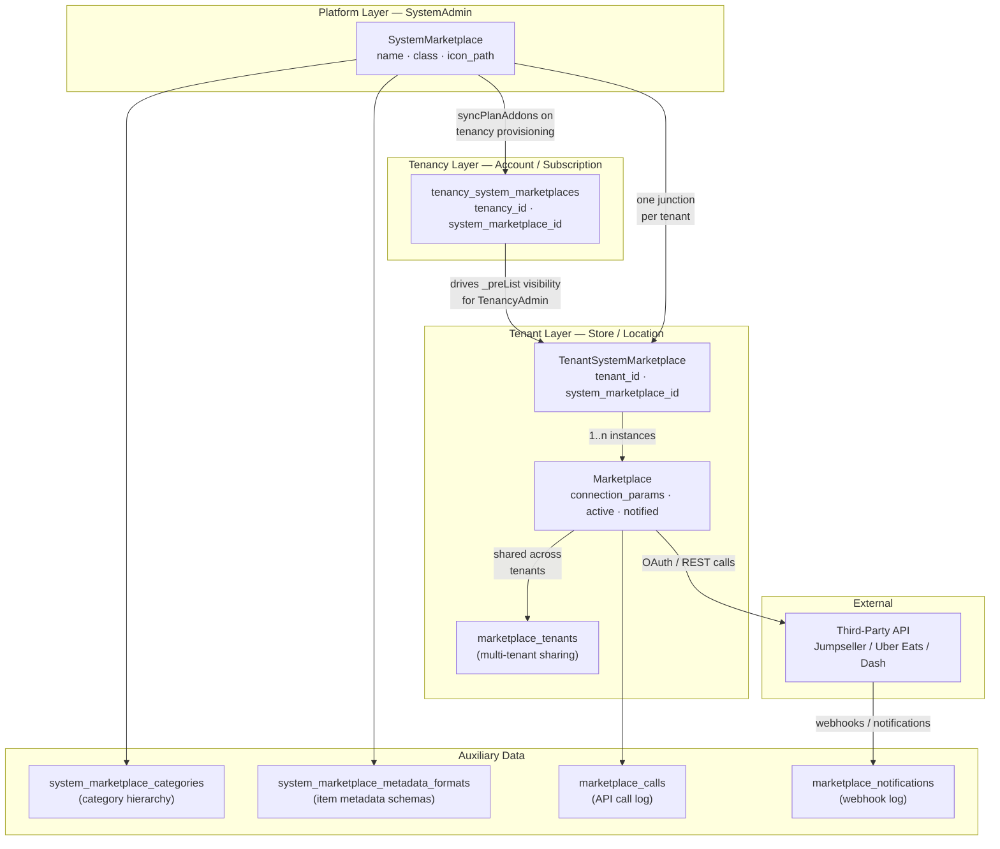
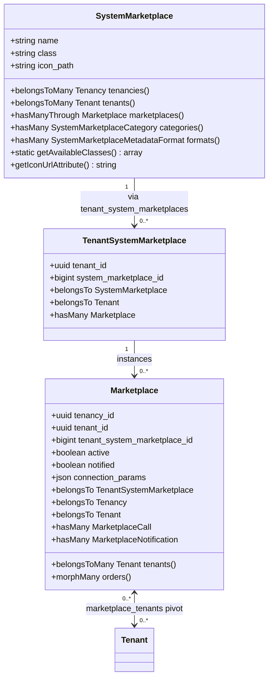
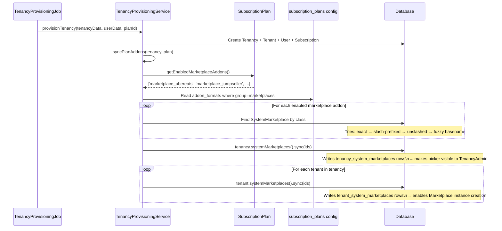
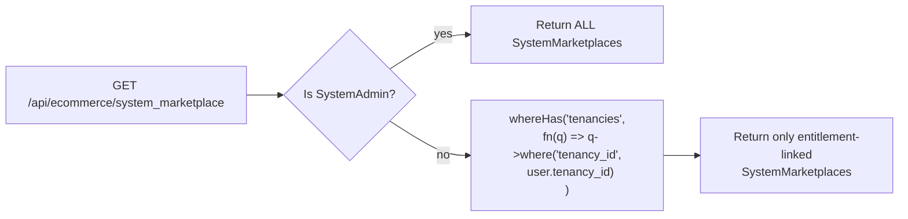
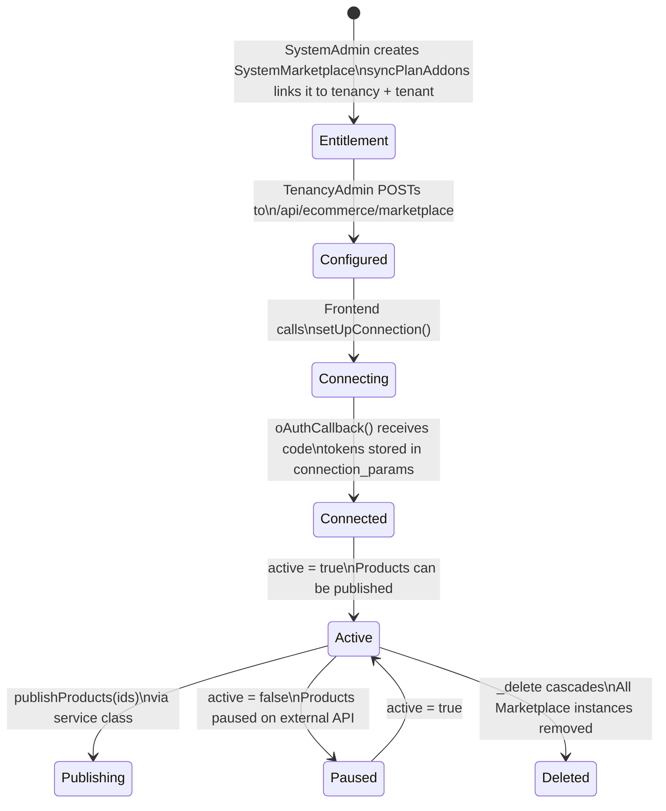
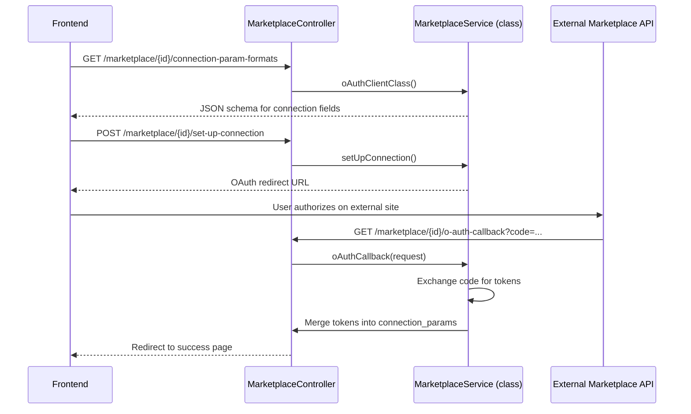
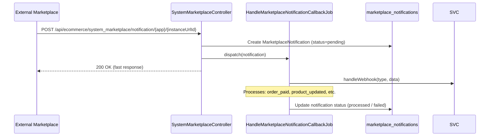

# System Marketplaces — Technical Documentation

> **Version:** 2.0
> **Last Updated:** June 2026
> **Status:** Technical Reference
> **Audience:** Engineers, Backend/Frontend Developers
> **Related Docs:** [FEAT-SYSTEM-POINT-OF-SALES.md](../point-of-sales/FEAT-SYSTEM-POINT-OF-SALES.md) · [SUBSCRIPTION_PLAN_ADDONS_FEATURE.md](../billing/SUBSCRIPTION_PLAN_ADDONS_FEATURE.md)

---

## Table of Contents

1. [Overview](#overview)
2. [Architecture Layers](#architecture-layers)
3. [Database Schema](#database-schema)
4. [Entity Relationships](#entity-relationships)
5. [Provisioning Flow](#provisioning-flow)
6. [Visibility & Access Control](#visibility--access-control)
7. [Marketplace Instance Lifecycle](#marketplace-instance-lifecycle)
8. [OAuth & Connection Flow](#oauth--connection-flow)
9. [Webhook Handling](#webhook-handling)
10. [API Reference](#api-reference)
11. [Service Contract](#service-contract)

---

## Overview

The System Marketplaces feature provides a structured multi-tenant integration layer for connecting the platform to external e-commerce marketplaces (Jumpseller, Uber Eats, Dash Marketplace). It separates **platform-level configuration** from **tenant-level instances**, enabling:

- System admins to define available marketplace integrations once
- Subscription plans to control which marketplaces a tenancy can access
- Each tenant (store/location) to independently configure and connect to allowed marketplaces
- Full OAuth flows, webhook ingestion, API call tracking, and category/metadata sync per integration

### Key Concepts

| Concept | Description |
|---------|-------------|
| **SystemMarketplace** | Platform-defined integration (class, icon, name). Managed by SystemAdmin only. |
| **tenancy_system_marketplaces** | Entitlement pivot: which system marketplaces this account's subscription allows. Drives the picker visibility for TenancyAdmin. |
| **TenantSystemMarketplace** | Junction: one record per (tenant × system_marketplace) pair, enabling the tenant to create instances. |
| **Marketplace** | Tenant-specific instance with OAuth tokens, connection params, active/notified status. |
| **MarketplaceClass** | PHP service class implementing the `Marketplace` contract (JumpsellerService, UberService, DashService). |

---

## Architecture Layers



---

## Database Schema

### Core Tables

```mermaid
erDiagram
    system_marketplaces {
        bigint id PK
        string name
        string class
        string icon_path
        timestamp deleted_at
        timestamps
    }

    tenancy_system_marketplaces {
        bigint id PK
        uuid tenancy_id FK
        bigint system_marketplace_id FK
        timestamps
    }

    tenant_system_marketplaces {
        bigint id PK
        uuid tenant_id FK
        bigint system_marketplace_id FK
        timestamps
    }

    marketplaces {
        bigint id PK
        uuid tenancy_id FK
        uuid tenant_id FK
        bigint tenant_system_marketplace_id FK
        string name
        boolean active
        boolean notified
        json connection_params
        timestamp deleted_at
        timestamps
    }

    marketplace_tenants {
        bigint marketplace_id PK_FK
        uuid tenant_id PK_FK
    }

    marketplace_calls {
        bigint id PK
        bigint marketplace_id FK
        string action
        string status
        json payload
        json response
        timestamps
    }

    marketplace_notifications {
        bigint id PK
        bigint marketplace_id FK
        string status
        json data
        json errors
        timestamps
    }

    system_marketplace_categories {
        bigint id PK
        bigint system_marketplace_id FK
        bigint parent_category_id FK
        string source_id
        string name
        json metadata
        timestamps
    }

    system_marketplace_metadata_formats {
        bigint id PK
        bigint system_marketplace_id FK
        string ownerable_type
        string group
        json format
        timestamps
    }

    system_marketplaces ||--o{ tenancy_system_marketplaces : "entitlement"
    system_marketplaces ||--o{ tenant_system_marketplaces : "junction"
    tenant_system_marketplaces ||--o{ marketplaces : "instance"
    marketplaces ||--o{ marketplace_tenants : "shared with"
    marketplaces ||--o{ marketplace_calls : "tracks"
    marketplaces ||--o{ marketplace_notifications : "receives"
    system_marketplaces ||--o{ system_marketplace_categories : "categories"
    system_marketplace_categories ||--o{ system_marketplace_categories : "subcategories"
    system_marketplaces ||--o{ system_marketplace_metadata_formats : "formats"
```

### Table Roles at a Glance

| Table | Purpose | Who writes it |
|-------|---------|--------------|
| `system_marketplaces` | Platform-defined integrations | SystemAdmin via CRUD |
| `tenancy_system_marketplaces` | Subscription entitlement — what the _account_ can access | `syncPlanAddons` on provisioning / plan change |
| `tenant_system_marketplaces` | Store-level junction — what a _tenant_ can configure | `syncPlanAddons` on provisioning / plan change |
| `marketplaces` | Actual connected instance with credentials | TenancyAdmin / Tenant via CRUD |
| `marketplace_tenants` | Shares one instance across multiple tenants | MarketplaceController on create/update |
| `marketplace_calls` | Append-only API call log | Service classes during API operations |
| `marketplace_notifications` | Inbound webhook queue | `handleNotificationCallback` endpoint |
| `system_marketplace_categories` | Synced category tree from external API | `handleSyncCategories()` service method |
| `system_marketplace_metadata_formats` | Metadata schemas for product attributes | `handleSyncMetadataFormats()` service method |

---

## Entity Relationships



---

## Provisioning Flow

When a new tenancy registers and verifies their email, `TenancyProvisioningService::syncPlanAddons` runs and links all plan-enabled system marketplaces at both the **tenancy** and **tenant** level.



> **Critical distinction**: `tenancy_system_marketplaces` controls what the TenancyAdmin _sees in the picker_ when adding a marketplace. `tenant_system_marketplaces` controls what Marketplace instances _can be created_. If only one is populated, the feature is broken for non-SystemAdmin users.

---

## Visibility & Access Control

### _preList Scoping (`SystemMarketplaceController`)



### Who Sees What

| Role | `system_marketplace` list | `marketplace` list |
|------|--------------------------|-------------------|
| SystemAdmin | All system marketplaces | All marketplace instances |
| TenancyAdmin | Only those in `tenancy_system_marketplaces` for their tenancy | All marketplace instances in their tenancy |
| Tenant user | Same as TenancyAdmin | Only instances where tenant is in `marketplace_tenants` |

### Authorization Policy (`MarketplacePolicy`)

Update and delete on Marketplace instances require:

```
user.tenant_id === marketplace.tenantSystemMarketplace.tenant_id
```

Checked via `$this->authorize('manage', $marketplace)` in `MarketplaceController::_update` and `_delete`.

---

## Marketplace Instance Lifecycle



### AUTO_CREATE Feature Flag

`SystemMarketplaceController` has a dormant feature flag:

```php
const AUTO_CREATE_MARKETPLACE_FOR_TENANTS = false;
```

When enabled, creating or updating a `SystemMarketplace` (associating it with tenants) would automatically create `Marketplace` instances for each tenant. Currently disabled — instances must be created manually by TenancyAdmin.

---

## OAuth & Connection Flow



---

## Webhook Handling



All webhook processing is asynchronous via queued jobs to avoid blocking the external caller.

---

## API Reference

### SystemMarketplace Endpoints

| Method | Path | Description | Access |
|--------|------|-------------|--------|
| GET | `/api/ecommerce/system_marketplace` | List system marketplaces | TenancyAdmin+ |
| GET | `/api/ecommerce/system_marketplace/{id}` | Get single system marketplace | TenancyAdmin+ |
| POST | `/api/ecommerce/system_marketplace` | Create system marketplace | SystemAdmin |
| PUT | `/api/ecommerce/system_marketplace/{id}` | Update system marketplace | SystemAdmin |
| DELETE | `/api/ecommerce/system_marketplace/{id}` | Delete + cascade to all instances | SystemAdmin |
| GET | `/api/ecommerce/system_marketplace/available-classes` | List available service classes | SystemAdmin |
| POST | `/api/ecommerce/system_marketplace/notification/{app}/{id}` | Receive inbound webhook | Public |

### Marketplace Instance Endpoints

| Method | Path | Description | Access |
|--------|------|-------------|--------|
| GET | `/api/ecommerce/marketplace` | List tenant marketplace instances | Tenant+ |
| GET | `/api/ecommerce/marketplace/{id}` | Get single instance | Tenant+ |
| POST | `/api/ecommerce/marketplace` | Create instance | TenancyAdmin |
| PUT | `/api/ecommerce/marketplace/{id}` | Update instance | Tenant (owner) |
| DELETE | `/api/ecommerce/marketplace/{id}` | Delete instance | Tenant (owner) |
| GET | `/api/ecommerce/marketplace/{id}/connection-param-formats` | Get OAuth param schema | Tenant (owner) |
| POST | `/api/ecommerce/marketplace/{id}/set-up-connection` | Initiate OAuth / validate tokens | Tenant (owner) |
| GET | `/api/ecommerce/marketplace/{id}/o-auth-callback` | OAuth provider callback | Public |
| GET | `/api/ecommerce/marketplace/{id}/settings` | Fetch settings from external API | Tenant (owner) |
| POST | `/api/ecommerce/marketplace/{id}/publish-settings` | Push settings to external API | Tenant (owner) |
| POST | `/api/ecommerce/marketplace/{id}/test/{index}` | Execute connection test | Tenant (owner) |
| GET | `/api/ecommerce/marketplace/{id}/export-metadata-mappers` | Get export metadata schemas | Tenant (owner) |
| POST | `/api/ecommerce/marketplace/{id}/export-metadata-mappers` | Save metadata mappings | Tenant (owner) |
| POST | `/api/ecommerce/marketplace/{id}/webhook/{type}` | Receive marketplace webhook | Public |

---

## Service Contract

Each marketplace integration must implement `App\Services\ECommerce\Contracts\Marketplace`:

| Method | Description |
|--------|-------------|
| `oAuthClientClass()` | Returns the OAuth client class name |
| `oAuthClient()` | Returns an initialized OAuth client instance |
| `getMarketplace()` | Fetches account info from the external API |
| `publishProducts(array $ids)` | Publishes products to the marketplace |
| `pauseProducts(array $ids)` | Pauses / hides products |
| `finishProducts(array $ids)` | Marks products as finished / unavailable |
| `handleSyncCategories()` | Syncs category hierarchy into `system_marketplace_categories` |
| `handleSyncMetadataFormats()` | Syncs metadata format schemas |
| `handleWebhook(string $type, array $data)` | Dispatches incoming webhook payload |
| `confirmOrder($orderId)` | Confirms an order received from the marketplace |
| `rejectOrder($orderId, string $reason)` | Rejects an order with a reason |
| `notifyOrderUpdate($orderId)` | Notifies the marketplace of an order update |
| `updateOrderStatus($orderId, string $status)` | Updates the order status on the external side |

### Available Implementations

| Class | Marketplace | Auth Method |
|-------|-------------|-------------|
| `JumpsellerService` | Jumpseller | OAuth 2.0 |
| `UberService` | Uber Eats | OAuth 2.0 |
| `DashService` | Dash Marketplace | Token-based |
